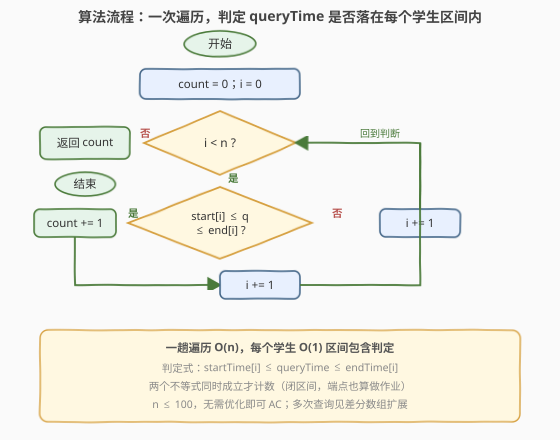
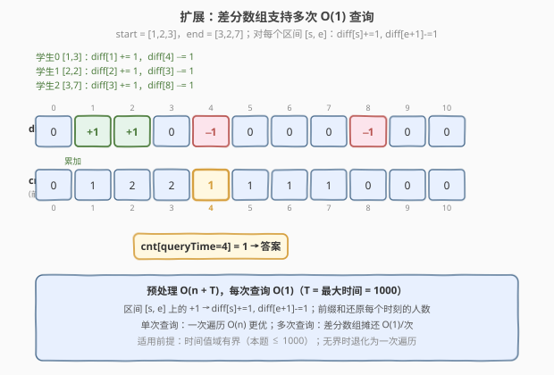

# LeetCode 在既定时间做作业的学生人数 题解

## 1. 题目概述

- **标题 / 题号**：在既定时间做作业的学生人数（#1450，easy）
- **链接**：https://leetcode.cn/problems/number-of-students-doing-homework-at-a-given-time/
- **难度**：简单
- **标签**：数组、一次遍历、区间判定

**题意**：给你两个整数数组 `startTime`（开始时间）和 `endTime`（结束时间），并指定一个整数 `queryTime` 作为查询时间。第 `i` 名学生在 `startTime[i]` 时开始写作业并于 `endTime[i]` 时完成作业。请返回在查询时间 `queryTime` 时**正在做作业**的学生人数。形式上，返回满足 `queryTime` 处于闭区间 `[startTime[i], endTime[i]]`（含两端）的学生人数。

> ⚠️ 审题关键：① 区间是**闭区间**——`queryTime == startTime[i]` 或 `queryTime == endTime[i]` 都算「正在做作业」（示例 2 中 `[4,4]`、`queryTime=4` 返回 1 印证端点计数）；② 「瞬时作业」（`startTime[i] == endTime[i]`）是合法区间，退化为单点，`queryTime` 等于该点即计数（示例 1 的学生 1 `[2,2]`）。

**示例 1**：

```text
输入：startTime = [1,2,3], endTime = [3,2,7], queryTime = 4
输出：1
解释：
  学生 0：[1,3]，4 > 3，不在做作业
  学生 1：[2,2]，4 > 2，不在做作业
  学生 2：[3,7]，3 ≤ 4 ≤ 7，在做作业 ✓
  → 仅 1 人
```

**示例 2**：

```text
输入：startTime = [4], endTime = [4], queryTime = 4
输出：1
解释：端点命中——4 == startTime[0] == endTime[0]，算做作业。
```

**示例 3**：

```text
输入：startTime = [4], endTime = [4], queryTime = 5
输出：0
解释：5 > endTime[0]=4，不在做作业。
```

**示例 5**：

```text
输入：startTime = [9,8,7,6,5,4,3,2,1], endTime = [10,10,10,10,10,10,10,10,10], queryTime = 5
输出：5
解释：startTime ≤ 5 的学生有 5 名（start = 1,2,3,4,5），它们的 endTime 均为 10 ≥ 5，全部命中。
```

**约束**：

- `startTime.length == endTime.length`
- $1 \le \text{startTime.length} \le 100$
- $1 \le \text{startTime[i]} \le \text{endTime[i]} \le 1000$
- $1 \le \text{queryTime} \le 1000$

> 💡 **关键点**：每个学生对应一个闭区间 $[\text{startTime[i]}, \text{endTime[i]}]$，问题即统计有多少个区间**包含** `queryTime`。判定式为两个不等式的合取：$\text{startTime[i]} \le \text{queryTime} \le \text{endTime[i]}$。数据规模 $n \le 100$，一次遍历 $O(n)$ 即可。

## 2. 解题思路

### 2.1 暴力思路：逐学生检查区间包含

最直白的做法：遍历每个学生 $i$，检查 `queryTime` 是否落在 `[startTime[i], endTime[i]]` 内，命中则计数加一。

- **正确**：逐一检查覆盖所有学生，不重不漏；
- **效率**：$n \le 100$，$O(n)$ 毫秒级 AC，本题暴力即最优。

> ⚠️ 本题「暴力」与「最优」同为 $O(n)$——没有更优的渐近复杂度可降（至少要读入 $n$ 个区间）。真正值得讨论的不是「如何降复杂度」，而是**判定式的正确性**（闭区间端点）与**多次查询时的预处理**（见第 5 节差分数组）。

### 2.2 核心观察：闭区间包含判定

![核心观察：queryTime 落在 [startTime[i], endTime[i]] 区间内即计数](../images/1450_concept.svg)

把每个学生的作业时间建模为时间轴上的一个**闭区间** $[s_i, e_i]$。`queryTime` 是时间轴上的一个点。问题等价于：**数轴上有多少个区间覆盖了这个点**。

判定一个点 $q$ 是否被区间 $[s, e]$ 覆盖，只需两个不等式**同时成立**：

$$s \le q \quad \text{且} \quad q \le e$$

- $s \le q$：学生已开始作业（`queryTime` 不早于开始时间）；
- $q \le e$：学生尚未完成作业（`queryTime` 不晚于结束时间）。

> 💡 **一句话**：两个不等式合取即 $s \le q \le e$——这是「点是否落在闭区间内」的最简判定。注意是**闭区间**，两端都取等号，故 `queryTime` 恰好等于开始或结束时间也算在做作业。

> ⚠️ **瞬时区间**（$s_i = e_i$）退化为单点，此时 $s \le q \le e$ 化为 $q = s_i$，即仅当 `queryTime` 恰好等于该时刻才计数。代码无需特判——统一的双不等式自然覆盖。

### 2.3 算法流程图



**完整步骤**：

1. **初始化** `count = 0`（计数器），`i = 0`（学生指针）；
2. **循环** 当 `i < n`：
   - 若 `startTime[i] <= queryTime` **且** `queryTime <= endTime[i]`：`count += 1`；
   - `i += 1`；
3. **返回** `count`。

> 💡 一趟遍历 $O(n)$，每轮 $O(1)$ 双不等式判定，额外只用 `count` 一个变量，空间 $O(1)$。

### 2.4 示例演算

以示例 1（`startTime = [1,2,3]`，`endTime = [3,2,7]`，`queryTime = 4`）与示例 5（9 名学生，`queryTime = 5`）演算：

![示例演算：逐学生判定 queryTime 是否落在 [start, end] 内](../images/1450_example_walkthrough.svg)

**示例 1**（$n=3$，$q=4$）：

| 学生 | 区间 $[s,e]$ | $s \le 4$ ? | $4 \le e$ ? | 计数? |
|------|--------------|-------------|-------------|-------|
| 0 | $[1,3]$ | ✓（$1 \le 4$） | ✗（$4 > 3$） | 否 |
| 1 | $[2,2]$ | ✓（$2 \le 4$） | ✗（$4 > 2$） | 否 |
| 2 | $[3,7]$ | ✓（$3 \le 4$） | ✓（$4 \le 7$） | **是** ✓ |

仅学生 2 满足 $3 \le 4 \le 7$ $\implies$ `count = 1` ✓。

**示例 5**（$n=9$，$q=5$，`endTime` 全为 10）：

- `startTime = [9,8,7,6,5,4,3,2,1]`，其中 $s_i \le 5$ 的有 5 个（$s = 1,2,3,4,5$）；
- 它们的 $e_i = 10 \ge 5$ 全部成立；
- 故 $s_i \le 5 \le 10$ 对这 5 名学生均成立 $\implies$ `count = 5` ✓。

> 以示例 2 `[4]`,`[4]`,$q=4$ 验证：$s=4 \le 4$ ✓ 且 $4 \le e=4$ ✓，端点命中计数 1 ✓。示例 3 `[4]`,`[4]`,$q=5$：$s=4 \le 5$ ✓ 但 $5 \le e=4$ ✗，返回 0 ✓。

## 3. 参考代码

### C++

```cpp
class Solution {
public:
    int busyStudent(vector<int>& startTime, vector<int>& endTime, int queryTime) {
        int count = 0;
        for (int i = 0; i < (int)startTime.size(); ++i) {
            if (startTime[i] <= queryTime && queryTime <= endTime[i]) {
                ++count;
            }
        }
        return count;
    }
};
```

### Python

```python
class Solution:
    def busyStudent(self, startTime: List[int], endTime: List[int], queryTime: int) -> int:
        count = 0
        for s, e in zip(startTime, endTime):
            if s <= queryTime <= e:
                count += 1
        return count
```

> 💡 **实现要点**：① 判定式 `startTime[i] <= queryTime && queryTime <= endTime[i]`——两个不等式合取，闭区间端点取等；② Python 可用链式比较 `s <= queryTime <= e` 更简洁；③ 用 `zip` 同时遍历两个等长数组，避免下标索引出错。

## 4. 复杂度分析

| 维度 | 一次遍历 $O(n)$（推荐） | 差分数组预处理 + 查询 |
|------|------------------------|----------------------|
| **时间复杂度** | $O(n)$ | 预处理 $O(n + T)$，每次查询 $O(1)$ |
| **空间复杂度** | $O(1)$（仅 `count`） | $O(T)$（差分数组，$T$ 为最大时间） |
| **单次查询** | $O(n)$ | $O(1)$ |
| **多次查询** | $O(n \cdot Q)$ | $O(n + T + Q)$ |
| **适用场景** | 单次查询（本题） | 多次查询 / 时间值域有界 |

- **一次遍历**：$n \le 100$，$O(n)$ 即最优；额外仅 `count` 一个变量，空间 $O(1)$。是本题的最优解。
- **差分数组**：预处理 $O(n + T)$（$T \le 1000$），之后每次查询 $O(1)$。当查询次数 $Q \gg 1$ 时，总复杂度 $O(n + T + Q)$ 远优于逐次 $O(n)$ 的 $O(nQ)$。但本题只有单次查询，差分数组反而多耗 $O(T)$ 空间，非必要。

> ⚠️ 本题 $n \le 100$ 且仅单次查询，一次遍历即 AC。差分数组的价值在于**多次查询**场景，见第 5 节。

## 5. 扩展：差分数组支持多次 O(1) 查询

### 5.1 思路

若题目升级为「给定 $n$ 个区间，回答 $Q$ 次 `queryTime` 查询」，逐次遍历 $O(nQ)$ 会变慢。由于时间值域有界（$1 \le t \le 1000$），可用**差分数组**预处理，把每次查询降到 $O(1)$。

### 5.2 差分数组原理



对每个学生区间 $[s_i, e_i]$，在差分数组 `diff` 上做两次更新：

- `diff[s_i] += 1`：从 $s_i$ 起人数 +1；
- `diff[e_i + 1] -= 1`：从 $e_i + 1$ 起人数 −1（结束时间的下一刻退出）。

随后对 `diff` 做**前缀和**，得到 `cnt[t]` = 时刻 $t$ 正在做作业的人数。回答 `queryTime = q` 直接返回 `cnt[q]`，$O(1)$。

> 💡 **差分数组的本质**：把「区间上的批量加减」转化为「端点上的两次单点更新」。前缀和还原时，`+1` 从 $s_i$ 起持续生效，`−1` 从 $e_i+1$ 起抵消——恰好覆盖 $[s_i, e_i]$ 闭区间。这与 [1109. 航班预订统计](../1101-1200/1109_航班预订统计.md) 的「航班座位预订」完全同构。

以示例 1 验证（`start=[1,2,3]`，`end=[3,2,7]`）：

| 操作 | diff 变化 |
|------|-----------|
| 学生 0 $[1,3]$ | `diff[1] += 1`，`diff[4] -= 1` |
| 学生 1 $[2,2]$ | `diff[2] += 1`，`diff[3] -= 1` |
| 学生 2 $[3,7]$ | `diff[3] += 1`，`diff[8] -= 1` |

`diff = [0, +1, +1, 0, −1, 0, 0, 0, −1, 0, 0]`，前缀和 `cnt = [0, 1, 2, 2, 1, 1, 1, 1, 0, 0, 0]`，`cnt[4] = 1` ✓ 与一次遍历结果一致。

### 5.3 差分数组代码

```cpp
class DiffArray {
public:
    DiffArray(vector<int>& startTime, vector<int>& endTime, int maxTime) {
        diff.assign(maxTime + 2, 0);  // +2 避免 e_i+1 越界
        for (int i = 0; i < (int)startTime.size(); ++i) {
            diff[startTime[i]] += 1;
            diff[endTime[i] + 1] -= 1;
        }
        cnt.assign(maxTime + 1, 0);
        int running = 0;
        for (int t = 1; t <= maxTime; ++t) {
            running += diff[t];
            cnt[t] = running;
        }
    }
    int query(int q) { return cnt[q]; }  // O(1)
private:
    vector<int> diff, cnt;
};

// 用法（多次查询场景）：
// DiffArray da(startTime, endTime, 1000);
// int ans = da.query(queryTime);  // O(1)
```

> ⚠️ **边界**：`diff` 大小取 `maxTime + 2`，因为 `endTime[i] + 1` 可能等于 `maxTime + 1`（当 `endTime[i] == maxTime == 1000` 时）。前缀和只需扫到 `maxTime`，因为 `queryTime ≤ 1000`。

> 💡 **何时用差分数组**：① 多次查询（$Q$ 大）；② 时间值域有界且不大（本题 $T \le 1000$）。若时间值域无界（如 $t \le 10^9$），差分数组不可行，需退化为一次遍历或离散化后用线段树。

## 6. 面试要点

1. **判定式为什么是 `startTime[i] <= queryTime && queryTime <= endTime[i]` 而不是严格不等式？**

   > 题目明确区间为**闭区间** $[\text{startTime[i]}, \text{endTime[i]}]$（含两端）。`queryTime` 等于开始时间表示「刚开始做」，等于结束时间表示「刚做完」，都算正在做作业。示例 2 `[4,4]`、$q=4$ 返回 1 印证端点计数。若用严格不等式会漏掉端点命中。

2. **瞬时区间（`startTime[i] == endTime[i]`）需要特判吗？**

   > 不需要。双不等式 $s \le q \le e$ 当 $s = e$ 时退化为 $q = s$，自然处理——仅当 `queryTime` 恰好等于该瞬时时刻才计数。统一判定式覆盖所有情况，无需分支。

3. **本题 $n \le 100$，还有优化空间吗？**

   > 单次查询下 $O(n)$ 已是渐近最优——至少要读入 $n$ 个区间，无法低于 $O(n)$。优化的方向是**多次查询**：若要回答 $Q$ 次查询，用差分数组预处理 $O(n + T)$ 后每次 $O(1)$，总 $O(n + T + Q)$ 优于逐次 $O(nQ)$。前提是时间值域有界（本题 $T \le 1000$）。

4. **差分数组为什么 `diff[endTime[i] + 1] -= 1` 而不是 `diff[endTime[i]] -= 1`？**

   > 因为区间是闭区间，`endTime[i]` 时刻学生**仍在**做作业，人数不应减少。减一应作用在 `endTime[i] + 1`——结束时间的**下一刻**，学生才退出。若在 `endTime[i]` 减一，会把结束时刻的人数算少，导致 `queryTime == endTime[i]` 时误判为不在做作业。

5. **如果时间值域很大（如 $t \le 10^9$）但区间数 $n$ 很小，多次查询怎么做？**

   > 差分数组需要 $O(T)$ 空间，值域无界时不可行。替代方案：① 把所有 `startTime`、`endTime` 离散化后用线段树/树状数组维护区间加；② 对查询点二分找覆盖它的区间数（需按起点排序 + 前缀计数）。但本题 $T \le 1000$，差分数组是最简解。

> 💡 **一句话总结**：1450 的灵魂是「**闭区间点包含判定**」——遍历每个学生检查 $s_i \le q \le e_i$，$O(n)$/$O(1)$ 即解。扩展到多次查询时，差分数组把区间批量标记压成端点更新 + 前缀和，每次查询 $O(1)$。

## 同类练习题

| # | 题目 | 与本题的关联 |
|---|------|-------------|
| 1109 | [航班预订统计](https://leetcode.cn/problems/corporate-flight-bookings/)（[题解](../1101-1200/1109_航班预订统计.md)） | 差分数组的招牌应用——每个航班预订是区间加座位数，`diff[l] += seats`、`diff[r+1] -= seats` 后前缀和还原，与 1450 多次查询扩展完全同构 |
| 370 | [区间加法](https://leetcode.cn/problems/range-addition/)（[题解](../0301-0400/370_区间加法.md)） | 差分数组母题——多个 `[l, r, val]` 区间加后还原数组，与 1450 的差分数组扩展同源（1450 是 `val=1` 的特例） |
| 303 | [区域和检索 - 数组不可变](https://leetcode.cn/problems/range-sum-query-immutable/)（[题解](../0301-0400/303_区域和检索 - 数组不可变.md)） | 前缀和的母题——预处理 $O(n)$ 后区间和查询 $O(1)$，与 1450 差分数组「预处理 + $O(1)$ 查询」的思路同源，区别是 303 求和、1450 求覆盖计数 |
| 228 | [汇总区间](https://leetcode.cn/problems/summary-ranges/)（[题解](../0201-0300/228_汇总区间.md)） | 有序区间的扫描归纳——把连续整数序列归纳为区间列表，与 1450「区间包含点」对偶：一个从点构区间、一个判点在区间 |
| 56 | [合并区间](https://leetcode.cn/problems/merge-intervals/)（[题解](../0001-0100/56_合并区间.md)） | 区间处理经典——排序后贪心合并重叠区间，与 1450 同属「区间族」问题，1450 是区间包含点的判定、56 是区间间的重叠合并 |
