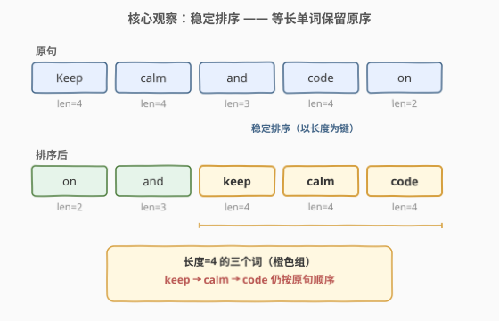
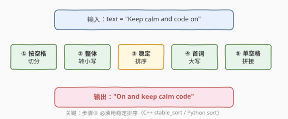
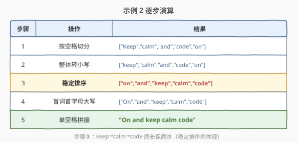
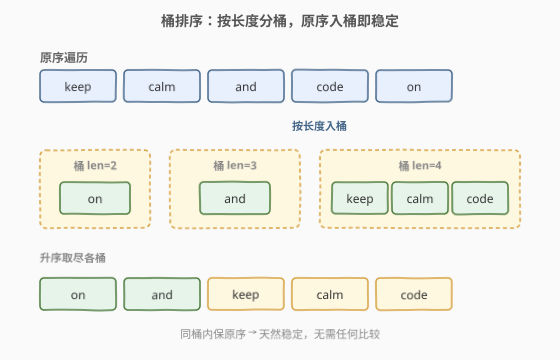

# LeetCode 重新排列句子中的单词 题解

## 1. 题目概述

- **标题 / 题号**：重新排列句子中的单词（#1451，medium）
- **链接**：https://leetcode.cn/problems/rearrange-words-in-a-sentence/
- **难度**：中等
- **标签**：字符串、排序、稳定排序

**题意**：给定一个满足下述格式的句子 `text`：首字母大写，每个单词用单个空格分隔。请重新排列 `text` 中的单词，使所有单词按其**长度的升序**排列；若两个单词长度相同，则**保留其在原句子中的相对顺序**。返回时同样首字母大写、其余小写、单词间单空格分隔。

**示例 1**：

```text
输入：text = "Leetcode is cool"
输出："Is cool leetcode"
解释：3 个单词长度分别为 8、2、4，按长度升序得 "is" "cool" "Leetcode"，首词大写得 "Is cool leetcode"。
```

**示例 2**：

```text
输入：text = "Keep calm and code on"
输出："On and keep calm code"
解释："on" 2 字母、"and" 3 字母、"keep"/"calm"/"code" 均 4 字母（保留原序），首词大写。
```

**示例 3**：

```text
输入：text = "To be or not to be"
输出："To be or to be not"
```

**约束**：

- `text` 以大写字母开头，然后包含若干小写字母以及单词间的单个空格
- $1 \le \text{text.length} \le 10^5$

> 💡 **关键点**：长度相同要保留原序 → 这是**稳定排序**的招牌特征。同时注意首字母大小写的「搬家」：原句首词大写、新句首词才大写，中间所有单词一律小写。

## 2. 解题思路

### 2.1 暴力思路：选择排序模拟

最直观的做法是模拟「每次挑出当前最短的单词」：每轮在剩余单词中找长度最小者，若有多个同长则取最早出现的（保证原序）。每轮 $O(m)$，共 $m$ 轮（$m$ 为单词数），总计 $O(m^2)$，加上切分/拼接 $O(n)$（$n$ 为 `text` 总长）。$m$ 可能达到 $n/2$（单词均为单字符），最坏 $O(n^2)$，对 $n = 10^5$ 会超时。

> ⚠️ 暴力法的问题在于「重复扫描」：每轮都要在剩余单词中重新找最小值，没有利用「长度是整数、可分桶」的结构。

### 2.2 核心观察：稳定排序

题目的两个要求拆开看：

- **按长度升序** → 排序的关键字是 `len(word)`；
- **同长保原序** → 排序必须是**稳定的**（stable sort），即不改变相等元素的相对位置。



因此只需一次**稳定排序**：以单词长度为关键字排序，等长单词天然保留原序。多数语言的标准排序未必稳定，有两条保险做法：

1. **直接用稳定排序**：C++ 的 `std::stable_sort`、Python 的 `list.sort` / `sorted`（Timsort，保证稳定）；
2. **附原序下标做 tiebreaker**：排序键设为 `(len(word), 原下标)`，这样即便底层是不稳定排序，结果也等价于稳定排序。

大小写处理：先**整体转小写**，排序后再把首词首字母转大写。这样不必纠结原首词大写字母「搬家」到中间位置的问题——先抹平所有大写，最后只动首词一处。

> 💡 **为什么「先全小写、后首词大写」最稳？** 原句只有首词大写，排序后原首词可能落到中间位置，此时它的大写字母必须转小写；而新的首词（原本小写）需转大写。先整体小写一次性抹平所有大写字母，最后只对首词首字母大写，逻辑最简、不易出错。

### 2.3 算法流程图



### 2.4 示例演算

以示例 2 `text = "Keep calm and code on"` 为例：



| 步骤 | 操作 | 结果 |
|------|------|------|
| 1 | 按空格切分 | `["Keep","calm","and","code","on"]` |
| 2 | 整体转小写 | `["keep","calm","and","code","on"]` |
| 3 | 稳定排序（按长度） | `["on","and","keep","calm","code"]` |
| 4 | 首词首字母大写 | `["On","and","keep","calm","code"]` |
| 5 | 单空格拼接 | `"On and keep calm code"` |

注意步骤 3：`keep`、`calm`、`code` 长度均为 4，排序后仍按原句顺序 `keep → calm → code` 排列，这正是稳定排序的体现。若用不稳定的 `sort`，它们可能被打乱成 `code → keep → calm` 等错误顺序。

## 3. 参考代码

### 方法一：稳定排序（推荐）

### C++

```cpp
class Solution {
public:
    string arrangeWords(string text) {
        // ① 按空格切分
        vector<string> words;
        stringstream ss(text);
        string w;
        while (ss >> w) words.push_back(w);

        // ② 整体转小写
        for (auto& s : words)
            for (char& c : s) c = tolower(c);

        // ③ 稳定排序：按长度升序，等长保原序
        stable_sort(words.begin(), words.end(),
                    [](const string& a, const string& b) {
                        return a.size() < b.size();
                    });

        // ④ 首词首字母大写
        words[0][0] = toupper(words[0][0]);

        // ⑤ 单空格拼接
        string ans;
        for (int i = 0; i < (int)words.size(); i++) {
            if (i) ans += ' ';
            ans += words[i];
        }
        return ans;
    }
};
```

### Python

```python
class Solution:
    def arrangeWords(self, text: str) -> str:
        words = text.split()
        words = [w.lower() for w in words]   # ② 整体转小写
        words.sort(key=len)                  # ③ Timsort 稳定，等长保原序
        words[0] = words[0].capitalize()     # ④ 首词首字母大写
        return ' '.join(words)               # ⑤ 单空格拼接
```

> 💡 **实现要点**：① C++ 必须用 `stable_sort` 而非 `sort`（`sort` 不保证稳定）。② Python 的 `list.sort` / `sorted` 均为稳定排序（Timsort），`key=len` 即可，无需附下标。③ 大小写：先全小写、后首词大写，避免原首词大写字母「搬家」到中间位置。

## 4. 复杂度分析

| 维度 | 稳定排序（方法一） | 桶排序（方法二，见第 5 节） |
|------|-------------------|---------------------------|
| **时间复杂度** | $O(m \log m + n)$ | $O(n)$ |
| **空间复杂度** | $O(n)$ | $O(n)$ |
| **稳定性来源** | 稳定排序算法保证 | 同桶按入桶顺序天然稳定 |

- $m$ 为单词数，$n$ 为 `text` 总长。切分/拼接/转小写均为 $O(n)$；排序 $m$ 个单词、比较长度 $O(1)$，故 $O(m \log m)$。$m \le n$，总体 $O(n \log n)$。
- 空间：存放单词数组 $O(n)$；`stable_sort` 归并实现另需 $O(m)$ 辅助空间，仍为 $O(n)$。
- $n = 10^5$ 时稳定排序毫秒级即可通过；追求严格线性可用桶排序（第 5 节）。

> ⚠️ 不要误以为排序复杂度是 $O(n \log n \cdot L)$——这里比较的是**单词长度**（整数，$O(1)$），不是逐字符比较字符串，故排序部分仅 $O(m \log m)$，瓶颈在切分/拼接的 $O(n)$。

## 5. 扩展：桶排序实现线性时间

观察：排序关键字是单词长度，取值范围为正整数 $[1, n]$ → 可用**桶排序**。按长度分桶、**按原句顺序入桶**即天然稳定，再按长度升序依次取尽各桶即可。



### C++

```cpp
class Solution {
public:
    string arrangeWords(string text) {
        stringstream ss(text);
        string w;
        vector<vector<string>> buckets;       // 按长度分桶
        int maxLen = 0;
        while (ss >> w) {
            for (char& c : w) c = tolower(c);
            int len = w.size();
            if ((int)buckets.size() <= len) buckets.resize(len + 1);
            buckets[len].push_back(move(w));   // 原序入桶 → 稳定
            maxLen = max(maxLen, len);
        }

        string ans;
        bool first = true;
        for (int len = 1; len <= maxLen; len++) {
            for (auto& s : buckets[len]) {
                if (first) { s[0] = toupper(s[0]); first = false; }
                if (!ans.empty()) ans += ' ';
                ans += s;
            }
        }
        return ans;
    }
};
```

### Python

```python
class Solution:
    def arrangeWords(self, text: str) -> str:
        from collections import defaultdict
        buckets = defaultdict(list)
        max_len = 0
        for w in text.split():
            w = w.lower()
            buckets[len(w)].append(w)         # 原序入桶 → 稳定
            max_len = max(max_len, len(w))

        ans = []
        first = True
        for length in range(1, max_len + 1):
            for w in buckets[length]:
                if first:
                    w = w.capitalize()
                    first = False
                ans.append(w)
        return ' '.join(ans)
```

**原理**：

1. 每个单词按其长度放入对应桶 `buckets[len]`，**按原句顺序入桶**；
2. 同一桶内单词长度相同，入桶顺序即原句顺序 → 天然稳定；
3. 从 `len = 1` 到 `maxLen` 依次取尽各桶 → 得到按长度升序、等长保原序的序列。

> 💡 **为什么天然稳定？** 稳定排序的实质是「相等元素保持原序」。桶排序中，等长 = 同桶，同桶内按入桶（即原句）顺序排列，自然稳定。全程无需任何元素比较，总时间 $O(n)$（每个字符处理常数次）。这是「整数关键字排序」可线性化的典型应用，与 [排序数组](../0901-1000/912_排序数组.md) 的计数排序思路同源。

## 6. 面试要点

1. **为什么必须用稳定排序？**

   > 题目要求「同长保原序」。不稳定排序会打乱等长单词的相对位置，如 `["keep","calm","code"]` 可能排成 `["code","keep","calm"]`。稳定排序保证相等元素相对位置不变。

2. **C++ `sort` 和 `stable_sort` 的区别？**

   > `sort` 通常为内省排序（快排 + 堆排），**不保证稳定**，平均 $O(m \log m)$；`stable_sort` 通常为归并排序，**保证稳定**，$O(m \log m)$ 但常数和空间更大。本题必须用 `stable_sort`，或用 `sort` 配 `(len, 下标)` 二元键等价实现稳定。

3. **如何在不依赖稳定排序的前提下保证结果正确？**

   > 附原句下标做 tiebreaker：排序键 `(len(word), idx)`。这样即使底层是不稳定排序，等长元素也会按下标升序排列，等价于稳定排序。适用于只能用不稳定 `sort` 的场景。

4. **大小写为什么要先全小写、再首词大写？**

   > 原句只有首词大写。排序后原首词可能「搬家」到中间，此时它的大写字母需转小写；而新的首词（可能原本小写）需转大写。先整体小写抹平所有大写字母，最后只对首词首字母大写，逻辑最简、不易出错。

5. **能否做到 $O(n)$ 时间？**

   > 可以。排序键是整数长度、范围 $[1, n]$，用桶排序（按长度分桶、原序入桶）即可 $O(n)$ 完成稳定排序。切分、转小写、拼接均 $O(n)$，总体线性。这是「整数关键字 → 非比较排序」的典型优化路径。

> 💡 **一句话总结**：1451 的灵魂是「**稳定排序**」。按长度排序 + 等长保原序 = 稳定排序；大小写用「先全小写、后首词大写」一招化解。追求线性可用桶排序替代比较排序。

## 同类练习题

| # | 题目 | 与本题的关联 |
|---|------|-------------|
| 1859 | [将句子排序](https://leetcode.cn/problems/sorting-the-sentence/) | 单词尾带数字编号，按编号还原句子，同为「切分 + 排序 + 拼接」的字符串重排入门题 |
| 1366 | [通过投票对团队排名](https://leetcode.cn/problems/rank-teams-by-votes/) | 按多关键字排序 + 位序处理，对照 1451 的稳定排序思想 |
| 922 | [按奇偶排序数组 II](https://leetcode.cn/problems/sort-array-by-parity-ii/) | 按属性重排数组，重排而非全排序的典型，对照 1451 的「按关键字重排」 |
| 1030 | [距离顺序排列矩阵单元格](https://leetcode.cn/problems/matrix-cells-in-distance-order/) | 按距离排序，可用桶排序线性化，与 1451 桶排序同思路 |
| 912 | [排序数组](https://leetcode.cn/problems/sort-an-array/)（[题解](../0901-1000/912_排序数组.md)） | 排序母题，含计数/桶排序等非比较排序，1451 桶排序解法的理论源头 |
