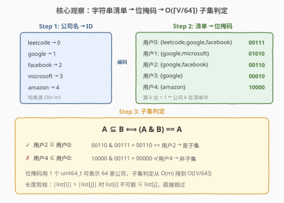
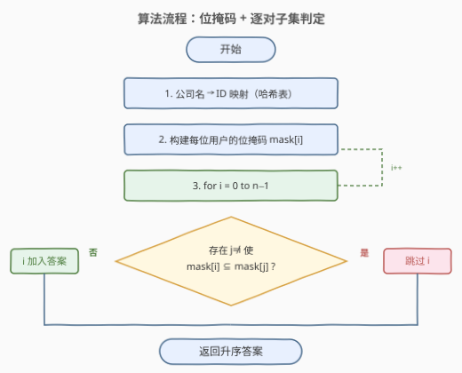
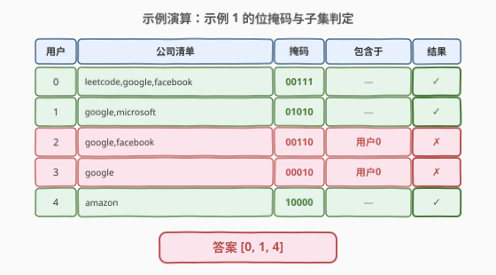

# LeetCode 收藏清单 题解

## 1. 题目概述

- **标题 / 题号**：收藏清单（#1452，medium）
- **链接**：https://leetcode.cn/problems/people-whose-list-of-favorite-companies-is-not-a-subset-of-another-list/
- **难度**：中等
- **标签**：位运算、哈希表、字符串、排序

**题意**：给你一个数组 `favoriteCompanies`，其中 `favoriteCompanies[i]` 是第 $i$ 名用户收藏的公司清单（下标从 0 开始）。请找出**不是其他任何人收藏的公司清单的子集**的收藏清单，返回该清单下标，下标需按升序排列。

**示例 1**：

```text
输入：favoriteCompanies = [["leetcode","google","facebook"],["google","microsoft"],["google","facebook"],["google"],["amazon"]]
输出：[0,1,4]
解释：
favoriteCompanies[2]=["google","facebook"] 是 favoriteCompanies[0]=["leetcode","google","facebook"] 的子集。
favoriteCompanies[3]=["google"] 是 favoriteCompanies[0] 和 favoriteCompanies[1] 的子集。
其余清单均不是其他任何人清单的子集，答案为 [0,1,4]。
```

**示例 2**：

```text
输入：favoriteCompanies = [["leetcode","google","facebook"],["leetcode","amazon"],["facebook","google"]]
输出：[0,1]
```

**示例 3**：

```text
输入：favoriteCompanies = [["leetcode"],["google"],["facebook"],["amazon"]]
输出：[0,1,2,3]
```

**约束**：

- $1 \le \text{favoriteCompanies.length} \le 100$
- $1 \le \text{favoriteCompanies[i].length} \le 500$
- $1 \le \text{favoriteCompanies[i][j].length} \le 20$
- `favoriteCompanies[i]` 中的所有字符串**各不相同**
- 用户收藏的公司清单也**各不相同**（即使排序后也不相等）
- 所有字符串仅包含小写英文字母

> 💡 **关键约束**：用户数 $n \le 100$，每份清单最多 500 家公司，总公司数 $V \le n \times 500 = 50000$。$n^2 = 10000$ 对子集判定是主瓶颈——若能将每次子集判定从 $O(m)$ 降到 $O(\lceil V/64 \rceil)$（位运算），整体可大幅加速。

## 2. 解题思路

### 2.1 暴力思路：哈希集合逐对判定

最直观的做法：对每个用户 $i$，遍历所有其他用户 $j$，用哈希集合判定 `list[i]` 是否为 `list[j]` 的子集。若存在某个 $j$ 使 `list[i]` $\subseteq$ `list[j]`，则 $i$ 不在答案中。

- **子集判定**：将 `list[j]` 存入哈希集合，遍历 `list[i]` 的每个元素查集合——全命中则为子集，$O(m)$ 每次。
- **总复杂度**：$O(n^2 \cdot m)$，$n=100, m=500$ 时约 $5 \times 10^6$ 次哈希查找，可行但常数较大。
- **长度剪枝**：若 $|\text{list}[i]| > |\text{list}[j]|$，则 `list[i]` 不可能为 `list[j]` 的子集，直接跳过——大量减少无效判定。

> ⚠️ 暴力法的瓶颈在于「**字符串哈希查找**」：每次子集判定需 $m$ 次字符串哈希，开销不小。若能将每个清单压缩为一个整数，子集判定变为一次位运算，则可大幅加速。

### 2.2 核心观察：位掩码加速子集判定



**关键洞察**：将每家公司映射为一个整数 ID（$0, 1, \ldots, V-1$），每个用户的清单表示为一个**位掩码**——第 $k$ 位为 1 当且仅当该公司在用户清单中。此时子集判定 $A \subseteq B$ 等价于：

$$A \subseteq B \iff (A \mathbin{\&} B) = A$$

> **为什么？** $A \mathbin{\&} B$ 保留两者共有的位。若 $A$ 的每一位都在 $B$ 中（即 $A \subseteq B$），则 $A \mathbin{\&} B = A$；反之若 $A \mathbin{\&} B = A$，则 $A$ 的每一位都在 $B$ 中，故 $A \subseteq B$。

三步走：

1. **公司名 $\to$ ID**：遍历所有清单，用哈希表为每家公司分配唯一 ID。
2. **清单 $\to$ 位掩码**：对每个用户，将清单中每家公司的 ID 对应位置 1，得到一个整数（或 `uint64_t` 数组）。
3. **逐对子集判定**：对每个 $i$，检查是否存在 $j \neq i$ 使 `(mask[i] & mask[j]) == mask[i]`；不存在则 $i$ 加入答案。

> 💡 **长度剪枝仍适用**：$|\text{list}[i]| > |\text{list}[j]|$ 时 `list[i]` 不可能为子集，跳过。又因题目保证清单**各不相同**，等长清单也不可能是彼此子集（$A \subseteq B$ 且 $|A|=|B|$ 推出 $A=B$），故只检查 $|\text{list}[j]| > |\text{list}[i]|$ 的 $j$ 即可。

### 2.3 算法流程图



整体分三阶段：预处理（建映射 + 建掩码）、判定（双层循环 + 位运算子集检查）、收集（非子集者入答案，天然升序）。

### 2.4 示例演算

以示例 1 为例，5 家公司分配 ID 后，5 位用户的位掩码与子集判定如下：



| 用户 | 公司清单 | 掩码 | 包含于 | 结果 |
|------|---------|------|--------|------|
| 0 | leetcode,google,facebook | 00111 | — | 保留 ✓ |
| 1 | google,microsoft | 01010 | — | 保留 ✓ |
| 2 | google,facebook | 00110 | 用户0 | 删除 ✗ |
| 3 | google | 00010 | 用户0 | 删除 ✗ |
| 4 | amazon | 10000 | — | 保留 ✓ |

> ⚠️ 用户 3 的掩码 `00010` 是用户 0（`00111`）和用户 1（`01010`）的子集，只要找到一个超集即删除。用户 4 的 `10000` 与所有其他掩码的 AND 均为 0，不是任何人的子集，故保留。最终答案 `[0, 1, 4]`。

## 3. 参考代码

### 方法一：哈希集合（直观）

### C++

```cpp
class Solution {
public:
    vector<int> peopleIndexes(vector<vector<string>>& favoriteCompanies) {
        int n = favoriteCompanies.size();
        vector<unordered_set<string>> sets(n);
        for (int i = 0; i < n; ++i)
            for (auto& c : favoriteCompanies[i])
                sets[i].insert(c);

        vector<int> ans;
        for (int i = 0; i < n; ++i) {
            bool isSub = false;
            for (int j = 0; j < n; ++j) {
                if (i == j) continue;
                if ((int)favoriteCompanies[i].size() > (int)favoriteCompanies[j].size()) continue;
                bool sub = true;
                for (auto& c : favoriteCompanies[i])
                    if (!sets[j].count(c)) { sub = false; break; }
                if (sub) { isSub = true; break; }
            }
            if (!isSub) ans.push_back(i);
        }
        return ans;
    }
};
```

### Python

```python
class Solution:
    def peopleIndexes(self, favoriteCompanies: List[List[str]]) -> List[int]:
        sets = [set(lst) for lst in favoriteCompanies]
        n = len(sets)
        ans = []
        for i in range(n):
            is_sub = False
            for j in range(n):
                if i == j:
                    continue
                if len(sets[i]) > len(sets[j]):
                    continue
                if sets[i].issubset(sets[j]):
                    is_sub = True
                    break
            if not is_sub:
                ans.append(i)
        return ans
```

### 方法二：位掩码（推荐）

### C++

```cpp
class Solution {
public:
    vector<int> peopleIndexes(vector<vector<string>>& favoriteCompanies) {
        int n = favoriteCompanies.size();
        // 1. 公司名 → ID
        unordered_map<string, int> compId;
        for (auto& list : favoriteCompanies)
            for (auto& c : list)
                if (!compId.count(c))
                    compId[c] = compId.size();

        // 2. 构建位掩码（动态 bitset，每个 uint64_t 存 64 家公司）
        int V = compId.size();
        int W = (V + 63) / 64;
        vector<vector<uint64_t>> masks(n, vector<uint64_t>(W, 0));
        for (int i = 0; i < n; ++i)
            for (auto& c : favoriteCompanies[i]) {
                int k = compId[c];
                masks[i][k / 64] |= (1ULL << (k % 64));
            }

        // 子集判定：masks[a] ⊆ masks[b]?
        auto isSubset = [&](int a, int b) -> bool {
            for (int w = 0; w < W; ++w)
                if ((masks[a][w] & masks[b][w]) != masks[a][w])
                    return false;
            return true;
        };

        // 3. 逐对检查
        vector<int> ans;
        for (int i = 0; i < n; ++i) {
            bool isSub = false;
            for (int j = 0; j < n; ++j) {
                if (i == j) continue;
                if ((int)favoriteCompanies[i].size() > (int)favoriteCompanies[j].size()) continue;
                if (isSubset(i, j)) { isSub = true; break; }
            }
            if (!isSub) ans.push_back(i);
        }
        return ans;
    }
};
```

### Python

```python
class Solution:
    def peopleIndexes(self, favoriteCompanies: List[List[str]]) -> List[int]:
        # 1. 公司名 → ID
        comp_id = {}
        for lst in favoriteCompanies:
            for c in lst:
                if c not in comp_id:
                    comp_id[c] = len(comp_id)

        # 2. 构建位掩码（Python int 任意精度，直接用一个大整数）
        masks = []
        for lst in favoriteCompanies:
            mask = 0
            for c in lst:
                mask |= (1 << comp_id[c])
            masks.append(mask)

        # 3. 逐对检查：(masks[i] & masks[j]) == masks[i] 则 i ⊆ j
        n = len(favoriteCompanies)
        ans = []
        for i in range(n):
            is_sub = False
            for j in range(n):
                if i == j:
                    continue
                if len(favoriteCompanies[i]) > len(favoriteCompanies[j]):
                    continue
                if (masks[i] & masks[j]) == masks[i]:
                    is_sub = True
                    break
            if not is_sub:
                ans.append(i)
        return ans
```

> 💡 **实现要点**：① Python 的 `int` 任意精度，直接用一个大整数当位掩码，无需手动分块；C++ 需用 `vector<uint64_t>` 模拟动态 bitset（每个 `uint64_t` 存 64 家公司）。② 长度剪枝 `len(list[i]) > len(list[j])` 跳过不可能的超集，大幅减少无效判定。③ $i$ 从小到大遍历，答案天然升序，无需排序。

## 4. 复杂度分析

| 维度 | 哈希集合 | 位掩码 |
|------|---------|--------|
| **时间复杂度** | $O(n^2 \cdot m)$ | $O(n \cdot m + n^2 \cdot \lceil V/64 \rceil)$ |
| **空间复杂度** | $O(n \cdot m)$ | $O(n \cdot \lceil V/64 \rceil + V)$ |
| **实际运算量** | $n=100, m=500$：约 $5 \times 10^6$ 次哈希查找 | $n=100, V \le 50000$：约 $7.8 \times 10^6$ 次字运算 |

- **预处理**：遍历所有清单建 ID 映射 $O(n \cdot m)$，建掩码 $O(n \cdot m)$。
- **判定**：$n^2$ 对子集检查，哈希集合每次 $O(m)$，位掩码每次 $O(\lceil V/64 \rceil)$（逐字 AND 比较）。
- **长度剪枝**：实际有效对数远小于 $n^2$（只有 $|\text{list}[j]| \geq |\text{list}[i]|$ 的 $j$ 才检查），最坏情况（所有清单等长）退化为 $n^2$。

> 💡 **位掩码 vs 哈希集合**：位掩码的子集判定是连续内存的逐字 AND，缓存友好且无哈希开销；哈希集合每次需 $m$ 次字符串哈希查找，常数更大。$n \le 100$ 时两者都能 AC，但位掩码在大 $m$ 时优势明显。Python 中大整数位运算由 C 实现，速度极快。

## 5. 扩展：按清单长度排序剪枝

长度剪枝可进一步强化为**排序 + 单向检查**：将用户按清单长度**降序**排序后，对于用户 $i$，只需检查排在它**前面**（清单更长）的用户 $j$。因为：

- 排在前面的用户清单长度 $\geq$ 当前用户，才可能是超集；
- 等长清单不可能互为子集（清单各不相同），故只检查**严格更长**的 $j$。

排序后单向检查，内层循环只需遍历 $j < i$（在排序后的序列中），减少了一半的检查次数。$n \le 100$ 时优化幅度有限，但思路具有普适性。

> ⚠️ 排序后答案需重新按原始下标升序排列，不能直接输出排序后的顺序。

## 6. 面试要点

1. **为什么位掩码的子集判定 $(A \mathbin{\&} B) = A$ 是正确的？**

   > $A \mathbin{\&} B$ 保留两者共有的位。若 $A$ 的每一位都在 $B$ 中，则 $A \mathbin{\&} B = A$；反之若 $A \mathbin{\&} B = A$，说明 $A$ 的每一位都在 $B$ 中。这等价于集合论中 $A \subseteq B$ 的定义。

2. **长度剪枝为什么有效？**

   > 若 $|\text{list}[i]| > |\text{list}[j]|$，则 `list[i]` 不可能是 `list[j]` 的子集（子集的元素数不超过超集）。跳过这些 $j$ 可大幅减少无效判定。进一步，因清单各不相同，等长清单也不可能是彼此子集。

3. **C++ 中如何表示 50000 位的位掩码？**

   > `std::bitset<N>` 需要编译期常量大小，可用 `bitset<50000>`（约 6.25 KB）。更灵活的方式是 `vector<uint64_t>`，每个元素存 64 位，$\lceil 50000/64 \rceil = 782$ 个元素。Python 则直接用 `int`（任意精度）。

4. **位掩码和哈希集合各自的优劣？**

   > 位掩码的子集判定是连续内存逐字 AND，缓存友好、无哈希开销，适合 $V$ 较小（$\le 64$ 时单次运算即可）。哈希集合适合 $V$ 极大或元素为复杂对象（无法映射为整数 ID）的场景。本题 $V \le 50000$，位掩码需 $\lceil V/64 \rceil$ 次字运算，但仍优于 $m$ 次字符串哈希。

5. **如果公司数 $V$ 超过 $10^6$ 怎么办？**

   > 位掩码需 $\lceil 10^6/64 \rceil \approx 15625$ 个 `uint64_t`，每次子集判定约 15625 次字运算。$n^2 = 10^4$ 对则需 $1.5 \times 10^8$ 次，可能超时。此时应考虑先按长度排序 + 单向检查减少对数，或用布隆过滤器等概率结构预筛。

> 💡 **一句话总结**：1452 的灵魂是「**字符串清单 $\to$ 整数位掩码 $\to$ 位运算子集判定**」。将 $O(m)$ 的哈希子集检查压缩为 $O(\lceil V/64 \rceil)$ 的逐字 AND，配合长度剪枝，$n \le 100$ 时轻松 AC。

## 同类练习题

| # | 题目 | 与本题的关联 |
|---|------|-------------|
| 318 | [最大单词长度乘积](https://leetcode.cn/problems/maximum-product-of-word-lengths/) | 用位掩码表示每个单词的字母集合，判定两单词无公共字母等价于 `mask[i] & mask[j] == 0`——与 1452 的 `(A & B) == A` 互为对照（一个判不相交、一个判包含） |
| 187 | [重复的 DNA 序列](https://leetcode.cn/problems/repeated-dna-sequences/)（[题解](../0101-0200/187_重复的DNA序列.md)） | 将 4 种碱基编码为 2 bit，10-mer DNA 序列编码为 20 位整数——位掩码编码的基础题，1452 将此思路推广到任意字符串集合 |
| 1684 | [统计一致字符串的数目](https://leetcode.cn/problems/count-the-number-of-consistent-strings/) | 用位掩码表示允许字符集，判定单词是否全由允许字符组成等价于 `(word_mask & allowed_mask) == word_mask`——与 1452 完全相同的子集判定 |
| 1434 | [每个人戴不同帽子的方案数](https://leetcode.cn/problems/number-of-ways-to-wear-different-hats/)（[题解](1434_每个人戴不同帽子的方案数.md)） | 用位掩码表示已分配帽子集合，状态压缩 DP——位掩码的另一典型应用（集合表示 + DP 状态转移） |
