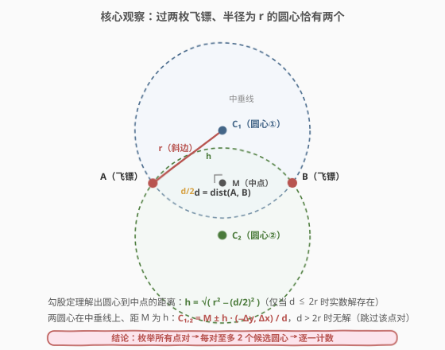
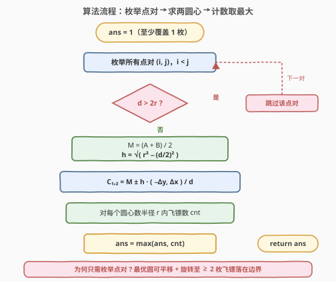
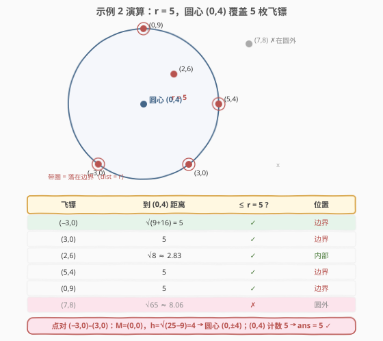

# LeetCode 圆形靶内的最大飞镖数量 题解

## 1. 题目概述

- **标题 / 题号**：圆形靶内的最大飞镖数量（#1453，hard）
- **链接**：https://leetcode.cn/problems/maximum-number-of-darts-inside-of-a-circular-dartboard/
- **难度**：困难
- **标签**：几何、数学、枚举、第 189 场周赛

**题意**：Alice 向一面非常大的墙上掷出 `n` 支飞镖。给定数组 `darts`，其中 `darts[i] = [xi, yi]` 表示第 `i` 支飞镖落在墙上的坐标。Bob 想在墙上放置一个**半径为 `r`** 的圆形靶，使落在靶**内或靶上**的飞镖数尽可能多。请返回能够落在任意半径为 `r` 的圆形靶内或靶上的**最大飞镖数**。

**示例 1**：

```text
输入：darts = [[-2,0],[2,0],[0,2],[0,-2]], r = 2
输出：4
解释：圆形靶圆心取 (0,0)、半径 2，4 枚飞镖都恰落在靶上（距圆心均为 2），最大值为 4。
```

**示例 2**：

```text
输入：darts = [[-3,0],[3,0],[2,6],[5,4],[0,9],[7,8]], r = 5
输出：5
解释：圆心取 (0,4)、半径 5，除 (7,8) 外的 5 枚飞镖都在靶上，最大值为 5。
```

**约束**：

- `1 <= darts.length <= 100`
- `darts[i].length == 2`
- $-10^4 \le x_i, y_i \le 10^4$
- `darts` 中的元素**互不相同**
- `1 <= r <= 5000`

## 2. 解题思路

### 2.1 朴素思路：圆心是连续的，怎么枚举？

难点在于**圆心可在平面上任意位置**——候选圆心有无穷多个。最直觉的朴素做法有两种，但都不好用：

- **网格采样**：在坐标范围内按某小步长离散化枚举圆心，每个圆心 $O(n)$ 计数。问题：步长取多大都不保证精度，可能漏掉最优圆；取太细则耗时爆炸。
- **以每枚飞镖为圆心**：$O(n^2)$ 枚举 `n` 个圆心各数一遍。问题：最优圆的圆心**未必是某枚飞镖**——示例 2 的最优圆心 `(0,4)` 不是任何飞镖坐标，此法直接漏解。

> ⚠️ 这类「固定半径、最大化覆盖点数」的几何题，突破口不在「采样圆心」，而在**缩小候选圆心的集合**：用几何关系把无穷多个圆心压缩到有限个。

### 2.2 核心观察：最优圆必有（至少）两枚飞镖落在边界上



**关键引理**：若最优圆覆盖了 $\ge 2$ 枚飞镖，则**存在一个同样最优的圆，其边界上至少落着两枚飞镖**。

> 💡 **直观论证（平移 + 旋转不变性）**：从任意一个最优圆出发——
> 1. **平移**：在不「挤出」任何已覆盖飞镖的前提下平移圆心，直到**第一枚**飞镖碰到边界（触壁即停，覆盖集不变）。
> 2. **旋转**：以这枚边界飞镖为「枢轴」，让圆心绕它做半径为 $r$ 的圆周运动（等价于圆绕该点滚动），在不挤出任何已覆盖飞镖的前提下旋转，直到**第二枚**飞镖碰到边界。
>
> 全程覆盖集只增不减，结束时边界上至少有两枚飞镖，且覆盖数不变——仍是最优。

由引理，**最优圆的圆心必由某两枚飞镖共同确定**（它们到圆心距离都恰为 $r$）。于是只需：

- 枚举所有 $\binom{n}{2}$ 个点对；
- 对每个点对，求「过这两点、半径为 $r$」的圆心（**至多 2 个**）；
- 对每个候选圆心 $O(n)$ 数半径 $r$ 内的飞镖，取最大值。

> 若最优只覆盖 1 枚飞镖（所有点对距离都 $> 2r$），答案是 1——初始化 `ans = 1` 即可兜底。

### 2.3 几何推导：中垂线 + 勾股定理解出两个圆心

设两枚飞镖 $A=(x_1,y_1)$、$B=(x_2,y_2)$，距离 $d=\|AB\|$。圆心 $C$ 到 $A$、$B$ 等距（都为 $r$），故 $C$ 在 $AB$ 的**中垂线**上。记中点 $M=\frac{A+B}{2}$，则 $|MA|=d/2$。圆心到中点的距离 $h$ 由勾股定理：

$$h = \sqrt{r^2 - (d/2)^2}$$

> 💡 这是一个直角三角形：直角边 $d/2$（中点到端点）与 $h$（中点到圆心），斜边 $r$（圆心到端点）。概念图中的 $\triangle MAC_1$ 正是它。

$AB$ 方向向量 $(\Delta x,\Delta y)=(x_2-x_1,\,y_2-y_1)$，其**单位垂直向量**为 $\dfrac{(-\Delta y,\,\Delta x)}{d}$。于是两个候选圆心：

$$C_{1,2} = M \;\pm\; h\cdot\frac{(-\Delta y,\;\Delta x)}{d}$$

**边界情况**：

| 条件 | 处理 |
|------|------|
| $d > 2r$ | $h$ 无实数解——半径 $r$ 的圆不可能同时覆盖这两点，**跳过该点对** |
| $d = 2r$ | $h=0$，两圆心重合于中点 $M$（$AB$ 恰为直径），退化为 1 个候选 |
| $d = 0$ | 题目保证点互异，不会出现；代码里用 `max(d, eps)` 兜底防除零 |

### 2.4 算法流程图



**五步流水线**：

1. **初始化** `ans = 1`（至少能覆盖 1 枚飞镖）。
2. **枚举点对** `(i, j)`，`i < j`，计算 $d$。
3. **剪枝**：$d > 2r$ 则跳过（无候选圆心）。
4. **求两圆心** $C_1, C_2$（中垂线 + 勾股）。
5. **计数取最大**：对每个圆心，$O(n)$ 数距其 $\le r+\varepsilon$ 的飞镖数，更新 `ans`。

### 2.5 示例演算

以示例 2（`r = 5`）为例，跟踪点对 $(-3,0)$–$(3,0)$ 如何定位最优圆心：



- 点对 $(-3,0),(3,0)$：$d=6$，中点 $M=(0,0)$，$h=\sqrt{25-9}=4$，候选圆心 $(0,\pm4)$。
- 圆心 $(0,4)$ 逐点验距：4 枚飞镖 $(-3,0),(3,0),(5,4),(0,9)$ 距圆心恰为 $5$（落在边界），$(2,6)$ 距 $\sqrt8\approx2.83$（内部），$(7,8)$ 距 $\sqrt{65}\approx8.06>5$（圆外）。
- 计数 $=5$，更新 `ans = 5`。

> 💡 注意圆心 $(0,4)$ **不是任何飞镖坐标**——这正是朴素「以飞镖为圆心」做法会漏解的原因，也印证了「必须用点对确定圆心」的必要性。本题 4 枚飞镖同时落在边界，任意一对都能定位到该圆心。

## 3. 参考代码

### C++

```cpp
class Solution {
public:
    int numPoints(vector<vector<int>>& darts, int r) {
        int n = darts.size();
        int ans = 1;                 // 至少能覆盖 1 枚飞镖
        const double eps = 1e-7;     // 抵消浮点误差，保证边界点被计入
        double R = r;
        for (int i = 0; i < n; ++i) {
            double x1 = darts[i][0], y1 = darts[i][1];
            for (int j = i + 1; j < n; ++j) {
                double x2 = darts[j][0], y2 = darts[j][1];
                double dx = x2 - x1, dy = y2 - y1;
                double d = sqrt(dx * dx + dy * dy);
                if (d > 2.0 * R + eps) continue;          // 无法同时覆盖，跳过
                double mx = (x1 + x2) / 2.0, my = (y1 + y2) / 2.0;
                double dd = max(d, eps);                   // 防除零
                double h = sqrt(max(0.0, R * R - d * d / 4.0));
                double px = -dy / dd, py = dx / dd;        // 单位垂直向量
                for (int s = 0; s < 2; ++s) {              // 两个候选圆心
                    double cx = mx + (s ? -h : h) * px;
                    double cy = my + (s ? -h : h) * py;
                    int cnt = 0;
                    for (int k = 0; k < n; ++k) {
                        double ex = darts[k][0] - cx;
                        double ey = darts[k][1] - cy;
                        if (sqrt(ex * ex + ey * ey) <= R + eps) ++cnt;
                    }
                    ans = max(ans, cnt);
                }
            }
        }
        return ans;
    }
};
```

### Python

```python
class Solution:
    def numPoints(self, darts: List[List[int]], r: int) -> int:
        n = len(darts)
        ans = 1                       # 至少能覆盖 1 枚飞镖
        eps = 1e-7                    # 抵消浮点误差，保证边界点被计入
        for i in range(n):
            x1, y1 = darts[i]
            for j in range(i + 1, n):
                x2, y2 = darts[j]
                dx, dy = x2 - x1, y2 - y1
                d = math.hypot(dx, dy)
                if d > 2 * r + eps:                 # 无法同时覆盖，跳过
                    continue
                mx, my = (x1 + x2) / 2, (y1 + y2) / 2
                dd = max(d, eps)                    # 防除零
                h = math.sqrt(max(0.0, r * r - d * d / 4))
                px, py = -dy / dd, dx / dd          # 单位垂直向量
                for sign in (h, -h):               # 两个候选圆心
                    cx, cy = mx + sign * px, my + sign * py
                    cnt = sum(
                        1 for x, y in darts
                        if math.hypot(x - cx, y - cy) <= r + eps
                    )
                    if cnt > ans:
                        ans = cnt
        return ans
```

> 💡 **精度要点**：计数时比较的是**距离**（`sqrt` 后）而非距离平方，配 `eps = 1e-7`。原因是圆心由 `sqrt`/除法算出，本身带约 $10^{-9}$ 量级误差；比较距离时误差也被开方压缩到同量级，`1e-7` 足以兜住边界点。若改为比较**平方距离**，误差会被放大成 $2r\cdot\delta\approx10^{-4}$ 量级，需要把 `eps` 调到 $10^{-4}$ 以上才稳妥——容易踩坑，故采用「先开方再比较」。

## 4. 复杂度分析

| 维度 | 复杂度 | 说明 |
|------|--------|------|
| 时间 | $O(n^3)$ | $\binom{n}{2}$ 个点对，每对至多 2 个圆心，每个圆心 $O(n)$ 计数：$\dfrac{n(n-1)}{2}\cdot 2\cdot n = O(n^3)$ |
| 空间 | $O(1)$ | 仅常数个浮点变量，原地计数 |

> - $n \le 100$ 时约 $10^6$ 次距离计算，完全可接受。
> - **为何 $O(n^3)$ 够用**：题目 $n\le100$ 是「几何 + 枚举」题的典型甜区——既不允许 $O(n^2)$ 的精巧做法一定存在，又把 $O(n^3)$ 卡在可行边界。若 $n$ 放大到 $10^3$，需改用第 5 节的角度扫描法 $O(n^2\log n)$。

## 5. 扩展：角度扫描法 $O(n^2 \log n)$

当 $n$ 较大时，可用**角度扫描**优化计数阶段。思路：固定一枚飞镖 $P$ 作为「必在边界上」的那枚，则圆心必落在以 $P$ 为圆心、半径 $r$ 的圆上。对其他每枚飞镖 $Q$，解出「$Q$ 在靶内」对应的圆心**角度区间** $[\alpha, \beta]$（一段圆弧），问题转化为「$n-1$ 段圆弧的最大重叠数」——按端点排序后线性扫描即可，单次 $O(n\log n)$，总 $O(n^2\log n)$。

> 💡 本题 $n\le100$，$O(n^3)$ 已足，角度扫描属进阶优化。但其「事件点排序 + 扫描线求最大重叠」思想与 [435. 无重叠区间](https://leetcode.cn/problems/non-overlapping-intervals/)（[题解](../0401-0500/435_无重叠区间.md)）、[719. 找出第 K 小的数对距离](https://leetcode.cn/problems/find-k-th-smallest-pair-distance/)（[题解](../0701-0800/719_找出第K小的数对距离.md)）的排序+扫描套路同源，值得了解。

另外，本题是 [1515. 中心点坐标](https://leetcode.cn/problems/best-position-for-a-service-centre/)（求使「到所有点最大距离」最小的中心）的**对偶问题**：一个是「固定半径求最大覆盖点数」，另一个是「固定覆盖全部点求最小半径」。二者都属计算几何中「圆覆盖」家族。

## 6. 面试要点

1. **为什么枚举点对就够了？最优圆一定有两枚飞镖在边界上吗？**

   > 若最优覆盖 $\ge 2$ 枚，从任一最优圆出发：先平移到第一枚飞镖触壁（覆盖集不变），再以该点为枢轴旋转到第二枚飞镖触壁，全程只增不减，结束时边界至少两枚飞镖且仍最优。故最优圆心必由某点对确定，枚举 $\binom{n}{2}$ 个点对、每对至多 2 个圆心即覆盖全部候选。最优只覆盖 1 枚时由 `ans=1` 兜底。

2. **`d > 2r` 为什么要跳过？`d = 2r` 时圆心有几个？**

   > 半径 $r$ 的圆要同时过两点，要求两点距离 $d\le 2r$（直径是能跨越的最大距离）。$d>2r$ 时 $h=\sqrt{r^2-(d/2)^2}$ 无实数解，无候选圆心，跳过。$d=2r$ 时 $h=0$，两圆心重合于中点（这两点恰为直径两端），退化为 1 个候选。

3. **浮点精度怎么处理？为什么用距离比较而非平方比较？**

   > 圆心由 `sqrt`/除法算出，带约 $10^{-9}$ 误差。计数时比较距离（开方后）配 `eps=1e-7`，误差同量级，边界点稳妥计入。若比较平方距离，误差放大到 $2r\delta\approx10^{-4}$，需把 `eps` 调到 $10^{-4}$ 以上，易因 `eps` 取不当而漏计或误计。另外 `d>2r` 判定也加 `eps`，避免 $d$ 恰为 $2r$ 时因微小误差被误跳。

4. **时间复杂度多少？能否更优？**

   > $O(n^3)$：$\binom{n}{2}$ 点对 × 2 圆心 × $O(n)$ 计数。$n\le100$ 时约 $10^6$ 次操作，可接受。更优可用角度扫描法 $O(n^2\log n)$：固定一枚飞镖在边界，对其他飞镖算圆心角度区间，排序后扫描最大重叠。

5. **如果飞镖可以重合（不互异），代码要改吗？**

   > 不用改。`dd = max(d, eps)` 已防 $d=0$ 除零：此时中点即该重合点、$h=r$、单位垂直向量为零，两候选圆心都退化为该点，正常计数半径 $r$ 内飞镖。本题约束保证互异，但保留这层防御更稳健。

> 💡 **一句话总结**：1453 是「固定半径圆覆盖最多点」的几何枚举招牌题——核心是**引理「最优圆边界必落 ≥2 枚飞镖」把无穷候选圆心压缩为 $\binom{n}{2}\times 2$ 个**，再用**中垂线 + 勾股** $h=\sqrt{r^2-(d/2)^2}$ 解出过两点的两个圆心，$O(n)$ 计数取最大。记住「平移+旋转不变性 → 枚举点对 → 求两圆心 → 计数」四步即可。

## 同类练习题

| # | 题目 | 与本题的关联 |
|---|------|-------------|
| 447 | [回旋镖的数量](https://leetcode.cn/problems/number-of-boomerangs/)（[题解](../0401-0500/447_回旋镖的数量.md)） | 固定一点枚举其余点、按距离平方分组计数——同为「点对几何 + 枚举」家族，把 1453 的「枚举点对」换成「枚举点 + 距离哈希」 |
| 149 | [直线上最多的点数](https://leetcode.cn/problems/max-points-on-a-line/)（[题解](../0101-0200/149_直线上最多的点数.md)） | 固定一点、按斜率（GCD 化简分数）分组求最多共线点——同为「固定一点枚举其余」的几何枚举范式，把「距离」换成「斜率」 |
| 1401 | [圆和矩形是否有重叠](https://leetcode.cn/problems/circle-and-rectangle-overlapping/)（[题解](1401_圆和矩形是否有重叠.md)） | 圆形几何判定——同区间的几何题，用距离比较判定圆与矩形位置关系，对照 1453 理解「点到圆心距离」在不同场景的用法 |
| 587 | [安装栅栏](https://leetcode.cn/problems/erect-the-fence/)（[题解](../0501-0600/587_安装栅栏.md)） | 凸包（Andrew 单调链）——计算几何进阶，同样是「点集 + 几何结构」类问题，从「圆覆盖」拓展到「凸包包围」 |
| 1515 | [中心点坐标](https://leetcode.cn/problems/best-position-for-a-service-centre/) | 求使「到所有点最大距离」最小的中心——1453 的对偶问题（固定半径求最大覆盖点数 vs 固定覆盖全部点求最小半径），用梯度下降/Weiszfeld 算法求解 |
