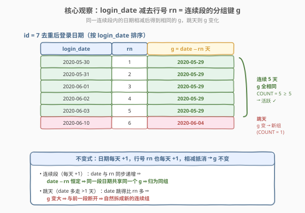
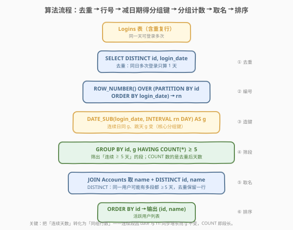
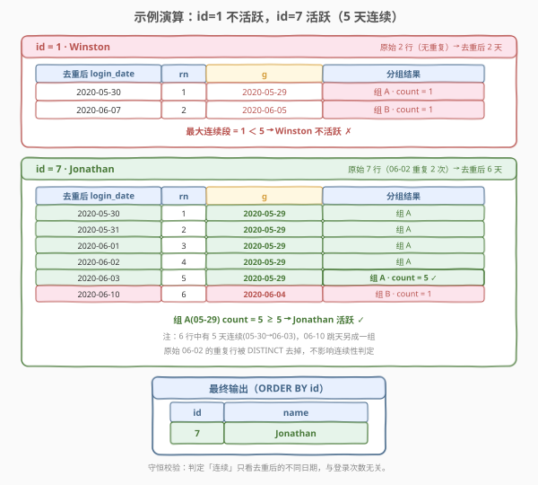

# LeetCode 活跃用户 题解

## 1. 题目概述

- **标题 / 题号**：活跃用户（#1454，medium）
- **链接**：https://leetcode.cn/problems/active-users/
- **难度**：中等
- **标签**：数据库、SQL、窗口函数、`ROW_NUMBER`、`DATE_SUB`/`DATEDIFF`、连续区间分组、`GROUP BY` + `HAVING`、`DISTINCT`、`JOIN`、LeetCode 锁题

**题意**：给定 `Accounts` 表与 `Logins` 表。`Accounts` 每行记录一个账户（`id`、`name`）；`Logins` 每行记录一次登录（`id`、`login_date`）。**活跃用户**是指那些**至少连续 5 天登录账户**的用户。请编写 SQL，找到活跃用户的 `id` 和 `name`，结果按 `id` 升序排列。

> ⚠️ 关键陷阱一：`Logins` 表**可能包含重复行**——同一个用户**一天内可以登录多次**。判定「连续 5 天」只看**不同的日期**，因此必须先用 `DISTINCT` 把「同日多次登录」压成一天，否则 `ROW_NUMBER` 会被重复行打乱，连续段会被人为拉长或错位。

> ⚠️ 关键陷阱二：「连续」指的是**日历上相邻**（每天 +1 天），而不是「登录记录在表中相邻」。`2020-06-03` 与 `2020-06-10` 之间隔了 7 天，即便都在表中也不能算连续——必须识别「跳天」并在此断开。

**表结构**：

```text
Table: Accounts
+---------------+---------+
| Column Name   | Type    |
+---------------+---------+
| id            | int     |  ← 主键
| name          | varchar |  ← 账户用户名
+---------------+---------+

Table: Logins
+---------------+---------+
| Column Name   | Type    |
+---------------+---------+
| id            | int     |  ← 账户 id（外键 → Accounts.id）
| login_date    | date    |  ← 登录日期
+---------------+---------+
（无显式主键，可能含重复行）
```

- `Accounts.id` 是该表主键（唯一）。
- `Logins` 无显式主键，**同一 `id` 在同一 `login_date` 可出现多行**（一天多次登录）。
- 「连续 5 天」= 日历上 5 个相邻日期（`d, d+1, d+2, d+3, d+4`）都有登录记录。

**示例 1**：

```text
输入：
Accounts 表：
+----+----------+
| id | name     |
+----+----------+
| 1  | Winston  |
| 7  | Jonathan |
+----+----------+
Logins 表：
+----+------------+
| id | login_date |
+----+------------+
| 7  | 2020-05-30 |
| 1  | 2020-05-30 |
| 7  | 2020-05-31 |
| 7  | 2020-06-01 |
| 7  | 2020-06-02 |
| 7  | 2020-06-02 |   ← 重复行（同日第二次登录）
| 7  | 2020-06-03 |
| 1  | 2020-06-07 |
| 7  | 2020-06-10 |
+----+------------+

输出：
+----+----------+
| id | name     |
+----+----------+
| 7  | Jonathan |
+----+----------+
```

**解释**：

| id | name | 去重后登录日期 | 连续段分析 | 是否活跃 |
|----|------|----------------|------------|----------|
| 1 | Winston | 2020-05-30, 2020-06-07 | 两段各 1 天（间隔 8 天，跳天） | ✗ 最大连续 1 < 5 |
| 7 | Jonathan | 2020-05-30, 31, 06-01, 02, 03, 06-10 | 05-30→06-03 连续 5 天；06-10 单独 1 天 | ✓ 含 5 天连续段 |

> 💡 id=7 原始有 7 行登录记录，但 `2020-06-02` 出现 2 次（同日多次登录）。`DISTINCT` 后剩 6 个不同日期，其中 `2020-05-30` 至 `2020-06-03` 这 5 天日历相邻 → 连续段长 5 ≥ 5 → 活跃。`2020-06-10` 与前一段隔了 7 天，跳天另成一段。Winston 只在 2 个不相邻的日期登录过，最大连续段仅 1 天。

**约束**：

- `Logins.id` 是 `Accounts.id` 的外键。
- 结果列：`id`、`name`。
- 排序：`id` 升序。
- **进阶**：若活跃用户定义为「至少连续 `n` 天登录」，能否写出通用解？

## 2. 解题思路

### 2.1 暴力思路：枚举起点 + 逐一验证后续 4 天

最直觉的翻译：「存在某个起始日 `d`，使得 `d, d+1, d+2, d+3, d+4` 这 5 个日历日在 `Logins` 中都有该用户的记录」。把 `Logins` 自连接 5 次，每次把日期往后推一天即可：

```sql
SELECT DISTINCT l1.id
FROM Logins l1
JOIN Logins l2 ON l1.id = l2.id
  AND l2.login_date = DATE_ADD(l1.login_date, INTERVAL 1 DAY)
JOIN Logins l3 ON l1.id = l3.id
  AND l3.login_date = DATE_ADD(l1.login_date, INTERVAL 2 DAY)
JOIN Logins l4 ON l1.id = l4.id
  AND l4.login_date = DATE_ADD(l1.login_date, INTERVAL 3 DAY)
JOIN Logins l5 ON l1.id = l5.id
  AND l5.login_date = DATE_ADD(l1.login_date, INTERVAL 4 DAY);
```

- **能过，但有三个硬伤**：
  1. **没去重会出错**：`Logins` 有重复行（同日多次），自连接会放大行数；必须在每个 `l1..l5` 上先 `DISTINCT`。
  2. **`n` 无法泛化**：题目进阶要求「连续 `n` 天」，自连接写法要把 `n` 个 `JOIN` 增删——`n=30` 就要写 30 个 `JOIN`，完全不通用。
  3. **代价高**：5 路自连接最坏 $O(m^5)$（$m$ 为登录行数），即使有 `(id, login_date)` 索引也要做 5 次嵌套查找。

> ⚠️ **自连接思路的本质缺陷**：它把「连续段长度」表达成「`JOIN` 的个数」，是**结构上写死的**——换阈值就要改 SQL 结构。我们需要一种把「连续段长度」变成**数据上的一个可聚合数值**（`COUNT`）的写法，这就是下面的「日期减行号」分组法。

### 2.2 核心观察：日期减去行号 = 连续段的分组键



**关键洞察**：把每个用户去重后的登录日期按升序编号（`ROW_NUMBER()`），然后做 `g = login_date − rn 天`。**同一段连续日期会得到相同的 `g`**，跳天后 `g` 立即变化——于是「连续段」就被 `g` 自动切分，每段的长度就是该 `g` 分组下的 `COUNT(*)`。

> 💡 **为什么成立（不变式）**：日历连续意味着每个日期比上一个 +1 天；而 `ROW_NUMBER` 也是每行 +1。两者**同步增长**，相减后抵消——同一段内 `g` 恒定。一旦「跳天」（日期跳了 >1 天），日期增长快于 `rn`，`g` 变大，自然与前一段断开、另成一组。这是一个极其优雅的「把连续性编码成可分组键」的技巧。

以 id=7 为例（去重后 6 个日期，按序编号）：

| login_date | rn | g = date − rn 天 | 段 |
|------------|----|------------------|----|
| 2020-05-30 | 1  | 2020-05-29 | 段 A |
| 2020-05-31 | 2  | 2020-05-29 | 段 A |
| 2020-06-01 | 3  | 2020-05-29 | 段 A |
| 2020-06-02 | 4  | 2020-05-29 | 段 A |
| 2020-06-03 | 5  | 2020-05-29 | 段 A（count=5 ≥ 5 ✓）|
| 2020-06-10 | 6  | 2020-06-04 | 段 B（跳天，g 变）|

前 5 天 `g` 全是 `2020-05-29` → 同组、`COUNT=5`；`2020-06-10` 因跳天使 `g` 跳到 `2020-06-04` → 另成一组。`GROUP BY id, g HAVING COUNT(*) >= 5` 即可筛出段 A。

> ⚠️ **`g` 的绝对值无意义**，它只是一个分组标签（段 A 的标签恰好是 `2020-05-29`，段 B 的是 `2020-06-04`）。重要的是**同段相同、异段不同**。`DATE_SUB` 也可换成 `DATE_ADD(login_date, INTERVAL -rn DAY)`，效果一致。

### 2.3 算法流程图



**六步流水线**：

1. **`FROM Logins`**：原始登录表（含重复行）。
2. **`SELECT DISTINCT id, login_date`**：去重——同日多次登录压成一天。**这一步不可省**，否则 `ROW_NUMBER` 把重复行也算作不同天，连续段会被错算。
3. **`ROW_NUMBER() OVER (PARTITION BY id ORDER BY login_date)`**：每个用户内部按日期升序编号得 `rn`。`PARTITION BY id` 保证不同用户的编号各自从 1 开始。
4. **`DATE_SUB(login_date, INTERVAL rn DAY) AS grp`**：相减得分组键 `grp`，连续段共享同一 `grp`。
5. **`GROUP BY id, grp` + `HAVING COUNT(*) >= 5`**：按用户+段分组，段长 ≥5 者即活跃段。`COUNT(*)` 数的是去重后的不同日期数，正是段长。
6. **`JOIN Accounts` 取 `name`** + **`DISTINCT id, name`**：补名字；同一用户可能有多段都 ≥5 天，`DISTINCT` 去重保留一行。最后 `ORDER BY id`。

> 💡 **为什么最后要 `DISTINCT id, name`？** 一个用户可能在两个不相连的时段都达成 5 天连续（如月初连 5 天、月末又连 5 天），`GROUP BY id, grp` 会为这两段各产出 1 行。题目只要用户出现一次，故 `DISTINCT` 折叠。

### 2.4 示例演算

以示例 1 的两个用户为例，跟踪「去重 → 编号 → 减日期 → 分组计数」全过程：



| id | 原始行数 | 去重后 | 编号 rn | 分组 g | 段长 | 结论 |
|----|---------|--------|---------|--------|------|------|
| 1 | 2（无重复） | 2 天 | 05-30→1, 06-07→2 | 05-29, 06-05 | 各 1 | 最大段 1 ＜ 5 → ✗ |
| 7 | 7（06-02 重复） | 6 天 | 05-30→1 … 06-10→6 | 05-29×5, 06-04×1 | 5 / 1 | 含段 5 ≥ 5 → ✓ |

**关键验证点**：

- **id=7 的重复行被消去**：原始 `06-02` 出现 2 次，`DISTINCT` 后只留 1 个 `06-02`。若漏掉 `DISTINCT`，`06-02` 会被编两个 `rn`（4 和 5），导致 `06-03` 的 `rn` 变成 6，`g` 错位——`05-30..06-03` 这段会被错误地拆散，可能误判为不活跃。
- **id=1 跳天被识别**：`05-30` 与 `06-07` 间隔 8 天，`g` 从 `05-29` 跳到 `06-05`，两段各 `count=1`，都不达标。
- **id=7 跳天另成段**：`06-10` 的 `g=06-04` 与前段 `g=05-29` 不同，单独成段 `count=1`，但前段 `count=5` 已达标，整体活跃。

> 💡 **守恒校验**：每个用户「所有段长之和」应等于其「去重后的不同日期数」。id=7 为 $5+1=6$，等于去重后的 6 天 ✓。这验证了分组无遗漏、无重叠。

## 3. 参考代码

### MySQL（解法 A：窗口函数 `ROW_NUMBER` + `DATE_SUB`，推荐）

```sql
# 1454. 活跃用户
# 思路：DISTINCT 去重 → ROW_NUMBER 按 id 分组按日期排序 → DATE_SUB(date, rn 天) 得分组键 grp
#       → GROUP BY id, grp HAVING COUNT(*) >= 5 → JOIN Accounts 取 name → DISTINCT 去重 → ORDER BY id
WITH
    d AS (
        SELECT DISTINCT id, login_date
        FROM Logins
    ),
    g AS (
        SELECT
            id, login_date,
            DATE_SUB(
                login_date,
                INTERVAL ROW_NUMBER() OVER (PARTITION BY id ORDER BY login_date) DAY
            ) AS grp
        FROM d
    )
SELECT DISTINCT g.id, a.name
FROM g
JOIN Accounts a ON a.id = g.id
GROUP BY g.id, g.grp, a.name
HAVING COUNT(*) >= 5
ORDER BY g.id;
```

> 💡 **写法要点**：
> - **`SELECT DISTINCT id, login_date`（CTE `d`）**：先去重，把「同日多次登录」压成一天。这是后续编号正确的前提。
> - **`ROW_NUMBER() OVER (PARTITION BY id ORDER BY login_date)`**：每个用户内部按日期升序从 1 编号。`PARTITION BY id` 让不同用户编号独立；`ORDER BY login_date` 保证编号顺序与日历顺序一致。
> - **`DATE_SUB(login_date, INTERVAL rn DAY) AS grp`**：核心分组键。连续段内 `date` 与 `rn` 同步 +1，相减抵消 → `grp` 恒定；跳天则 `grp` 变化。
> - **`GROUP BY id, grp, a.name` + `HAVING COUNT(*) >= 5`**：按「用户 + 段」分组，`COUNT(*)` 即段长（去重后的不同日期数），≥5 即活跃段。`a.name` 一并写出满足 `ONLY_FULL_GROUP_BY`（`name` 函数依赖于 `id`）。
> - **`SELECT DISTINCT id, name`**：同一用户可能有多段达标，`DISTINCT` 折叠为一行。
> - 需 **MySQL 8.0+**（窗口函数 `ROW_NUMBER` 自 8.0 起支持）。

### MySQL（解法 B：`LAG` + 累计和标记跳天）

```sql
# 思路：LAG 看前一天是否恰好 -1 天 → 标记 is_gap(1=断点/首行, 0=连续) → SUM(is_gap) OVER 累计得段号 grp → 分组计数
WITH
    d AS (
        SELECT DISTINCT id, login_date FROM Logins
    ),
    p AS (
        SELECT
            id, login_date,
            IF(
                login_date = DATE_ADD(
                    LAG(login_date) OVER (PARTITION BY id ORDER BY login_date),
                    INTERVAL 1 DAY
                ),
                0, 1
            ) AS is_gap
        FROM d
    ),
    g AS (
        SELECT
            id, login_date,
            SUM(is_gap) OVER (PARTITION BY id ORDER BY login_date) AS grp
        FROM p
    )
SELECT DISTINCT g.id, a.name
FROM g
JOIN Accounts a ON a.id = g.id
GROUP BY g.id, g.grp, a.name
HAVING COUNT(*) >= 5
ORDER BY g.id;
```

> 💡 **解法 B 的思路**：不靠「日期 − 行号」的算术抵消，而是**显式标记断点**——用 `LAG` 看前一行的日期，若当前日期 ≠ 前一行 +1 天（含首行 `LAG=NULL`），则 `is_gap=1`（这里是一个新段的起点）。再用 `SUM(is_gap) OVER (...)` 做累计和，得到一个**递增的段序号** `grp`（段 A=1、段 B=2……）。同段内 `is_gap=0`，`grp` 不变。
> - **与解法 A 的区别**：A 产生**绝对**分组键（一个日期值）；B 产生**相对**段序号（1,2,3…）。两者都能切分连续段，结果等价。
> - **何时选 B？** 当「连续」的定义不是整齐的 +1 天时（如「连续登录且每次间隔 ≤3 天」），`is_gap` 的判定条件可灵活改写，而 A 的 `DATE_SUB` 抵消法依赖「步长恒为 1」的前提。本题步长恰为 1 天，A 更简洁，面试首选；B 适合展示「断点标记 + 累计和」这一更普适的连续段建模技巧。

### MySQL（解法 C：5 路自连接，无窗口函数）

```sql
# 思路：枚举起始日 l1，逐一 JOIN 验证 l2..l5 = 起始日 +1..+4 天都存在；DISTINCT 折叠多起点
SELECT DISTINCT l1.id, a.name
FROM (SELECT DISTINCT id, login_date FROM Logins) l1
JOIN (SELECT DISTINCT id, login_date FROM Logins) l2
  ON l2.id = l1.id
 AND l2.login_date = DATE_ADD(l1.login_date, INTERVAL 1 DAY)
JOIN (SELECT DISTINCT id, login_date FROM Logins) l3
  ON l3.id = l1.id
 AND l3.login_date = DATE_ADD(l1.login_date, INTERVAL 2 DAY)
JOIN (SELECT DISTINCT id, login_date FROM Logins) l4
  ON l4.id = l1.id
 AND l4.login_date = DATE_ADD(l1.login_date, INTERVAL 3 DAY)
JOIN (SELECT DISTINCT id, login_date FROM Logins) l5
  ON l5.id = l1.id
 AND l5.login_date = DATE_ADD(l1.login_date, INTERVAL 4 DAY)
JOIN Accounts a ON a.id = l1.id
ORDER BY 1;
```

> 💡 **解法 C 的思路**：把「存在连续 5 天」直接翻译成「存在起始日 `d`，使 `d, d+1, d+2, d+3, d+4` 都在去重后的登录日期中」。`l1` 取起始日，`l2..l5` 依次验证后 4 天。每个子查询都先 `DISTINCT` 去重。若用户有 ≥5 天连续，则至少存在一个这样的起始日，`JOIN` 成立；`DISTINCT id` 折叠多个起始日。
> - **优点**：不依赖窗口函数，MySQL 5.7 及更早版本也能跑；语义直白。
> - **缺点**：① 5 路自连接最坏 $O(m^5)$，数据量大时性能很差；② **无法泛化到 `n`**——`n=7` 要写 7 个 `JOIN`，`n` 是变量时根本写不出来。这正是窗口函数法（解法 A）的核心优势所在。

### MySQL（进阶：连续 `n` 天的通用解）

```sql
-- 窗口函数版：只需把阈值 5 改成 n，结构完全不变
WITH
    d AS (SELECT DISTINCT id, login_date FROM Logins),
    g AS (
        SELECT id, login_date,
               DATE_SUB(login_date,
                        INTERVAL ROW_NUMBER() OVER (PARTITION BY id ORDER BY login_date) DAY) AS grp
        FROM d
    )
SELECT DISTINCT g.id, a.name
FROM g JOIN Accounts a ON a.id = g.id
GROUP BY g.id, g.grp, a.name
HAVING COUNT(*) >= 7   -- ← 把 5 改成任意 n 即可，例如连续 7 天
ORDER BY g.id;
```

> 💡 **泛化的关键**：窗口函数法把「段长」表达成**数据上的 `COUNT`**（一个可比较的数值），阈值 `n` 只是 `HAVING` 里的一个常量——改一个数字即通用。而解法 C 把「段长」写死成 `JOIN` 的**结构**个数，无法参数化。这就是「数据驱动」胜过「结构写死」的典型例证，也是面试官出「进阶 `n` 天」想听到的的话。

### Python（pandas）

```python
import pandas as pd

def active_users(accounts: pd.DataFrame, logins: pd.DataFrame) -> pd.DataFrame:
    days = logins[['id', 'login_date']].drop_duplicates()
    days = days.sort_values(['id', 'login_date'])
    days['rn'] = days.groupby('id').cumcount() + 1
    days['g'] = (pd.to_datetime(days['login_date'])
                 - pd.to_timedelta(days['rn'], unit='D'))
    runs = days.groupby(['id', 'g']).size().reset_index(name='cnt')
    active_ids = runs.loc[runs['cnt'] >= 5, ['id']].drop_duplicates()
    out = active_ids.merge(accounts, on='id', how='left')[['id', 'name']]
    return out.sort_values('id').reset_index(drop=True)
```

> 💡 **pandas 对照**：
> - `drop_duplicates()` 对应 `SELECT DISTINCT id, login_date`（去重同日多次登录）。
> - `sort_values + groupby('id').cumcount() + 1` 对应 `ROW_NUMBER() OVER (PARTITION BY id ORDER BY login_date)`——`cumcount()` 给出组内 0 基编号，`+1` 转为 1 基。
> - `login_date - to_timedelta(rn, 'D')` 对应 `DATE_SUB(login_date, INTERVAL rn DAY)`，得分组键 `g`。
> - `groupby(['id','g']).size()` 对应 `GROUP BY id, g` + `COUNT(*)`；`loc[cnt >= 5]` 对应 `HAVING COUNT(*) >= 5`。
> - `merge(accounts, on='id')` 对应 `JOIN Accounts`；`drop_duplicates()` 对应 `DISTINCT id, name`；`sort_values('id')` 对应 `ORDER BY id`。

## 4. 复杂度分析

| 维度 | 解法 A（窗口 `DATE_SUB`） | 解法 B（`LAG`+累计和） | 解法 C（5 路自连接） | pandas |
|------|---------------------------|------------------------|----------------------|--------|
| **时间** | $O(m \log m)$ | $O(m \log m)$（3 趟窗口） | $O(m^5)$（无索引）/ $O(m \log m)$（有索引但 5 层嵌套） | $O(m \log m)$ |
| **空间** | $O(m)$（CTE 中间表） | $O(m)$ | $O(m)$（去重子查询） | $O(m)$ |
| **泛化 n** | ✓ 改一个常量 | ✓ 改一个常量 | ✗ 要增删 `JOIN` | ✓ 改一个常量 |
| **可读性** | ✓ 简洁优雅 | △ 多一层 CTE | ✗ 冗长 | ✓ 与 SQL 同构 |
| **推荐度** | ✓ **首选** | △ 普适断点建模 | ✗ 仅旧版 MySQL 兜底 | ✓ 面试口述 |

> - $m$ = `Logins` 去重后的不同 `(id, login_date)` 行数，$a$ = `Accounts` 行数。
> - **解法 A/B**：核心代价是 `PARTITION BY id ORDER BY login_date` 的排序 $O(m \log m)$；之后 `GROUP BY` 与窗口累计都是 $O(m)$ 线性扫描。两段 CTE 物化需 $O(m)$ 中间空间。
> - **解法 C**：5 路等值连接，无索引时每路全扫，最坏 $O(m^5)$；即便 `(id, login_date)` 建索引，每路 $O(\log m)$ 定位，但 5 层嵌套的扇出仍随数据增长急剧恶化，且无法泛化。
> - **排序输出**：三种解法末尾 `ORDER BY id`，$O(a \log a)$（仅活跃用户排序，$a$ 通常远小于 $m$）。

> ⚠️ 本题数据量小（示例级），任何正确写法都能过。复杂度分析的价值在于**可扩展性与泛化能力**：若 `Logins` 达千万行，解法 A/B 走 `(id, login_date)` 索引可接近 $O(m)$ 排序；解法 C 会爆炸。面试官追问「连续 `n` 天」时，只有窗口函数法能一句话泛化。

## 5. 扩展：连续区间问题的通用范式

### 5.1 「减行号」分组法的通用模板

「找出连续满足某条件的、长度 ≥ `n` 的区间」是 SQL 的一类招牌题，通用三步范式：

1. **去重 + 排序**：`SELECT DISTINCT 关键列, 序列列 ... ORDER BY 序序列列`，得到无重复、有序的序列。
2. **造分组键**：`序列列 − ROW_NUMBER() OVER (PARTITION BY 关键列 ORDER BY 序列列)` 得 `grp`。步长恒为 1 时，连续段共享同一 `grp`。
3. **分组计数筛选**：`GROUP BY 关键列, grp HAVING COUNT(*) >= n`，取段长 ≥ `n` 的段。

> 💡 适用条件：序列列的「连续」定义是**步长恒为 1 的等差序列**（日期每天 +1、整数 +1、月份 +1 等）。若步长非 1（如「间隔 ≤3 天算连续」），改用解法 B 的「断点标记 + 累计和」范式。

### 5.2 为什么必须先 `DISTINCT`

本题 `Logins` 允许同日多次登录（无显式主键）。若不去重直接编号：

| login_date（含重复） | rn（未去重） | g |
|----------------------|--------------|----|
| 2020-06-02 | 4 | 05-29 |
| 2020-06-02 | 5 | 05-28 ← 错位！|
| 2020-06-03 | 6 | 05-28 ← 与上一行同 g，但实际跳天了？|

重复行使 `rn` 多消耗一个号，导致后续日期的 `g` 整体偏移，连续段被错误切分。**口诀**：凡用 `ROW_NUMBER` 做连续段分组前，必须确保序列列在该分组内**无重复**。

### 5.3 与「连续数字」类题的关系

本题是 [180. 连续出现的数字](https://leetcode.cn/problems/consecutive-numbers/) 的**日期版**：180 找「连续 3 行 `num` 相同」，用 `ROW_NUMBER` 按 `num` 分组编号后相减得分组键；本题把 `num` 换成 `login_date`、把「相同」换成「日历相邻（+1 天）」，套路完全一致。掌握 180 即可平移到本题。

### 5.4 `DATE_SUB` / `DATE_ADD` / `DATEDIFF` 速查

| 函数 | 语法 | 用途 |
|------|------|------|
| `DATE_SUB(d, INTERVAL n DAY)` | 日期减 `n` 天 | 本题造分组键 `g = date − rn` |
| `DATE_ADD(d, INTERVAL n DAY)` | 日期加 `n` 天 | 解法 C 验证 `d+1..d+4` 是否存在 |
| `DATEDIFF(d1, d2)` | `d1 − d2` 的天数（int） | 判断两天间隔（如 [197. 上升的温度](https://leetcode.cn/problems/rising-temperature/)）|

> 💡 MySQL 的 `DATEDIFF(d1, d2)` 参数顺序是 `d1 − d2`（与多数语言相反，易错）。本题用 `DATE_SUB` 直接得日期型 `g`，比 `DATEDIFF` 更顺手。

## 6. 面试要点

1. **为什么必须先 `DISTINCT id, login_date`？**

   > 因为 `Logins` 允许同一用户同日多次登录（无显式主键、可能含重复行）。判定「连续 5 天」只看不同日期。若不去重，`ROW_NUMBER` 会给重复行分配不同编号，使后续日期的编号整体偏移，`g = date − rn` 错位，连续段被错误拆分或合并。口诀：用 `ROW_NUMBER` 做连续段分组前，序列列在该分组内必须无重复。

2. **`g = login_date − rn 天` 为什么能把连续日归为同组？**

   > 日历连续意味着每个日期比上一个 +1 天，而 `ROW_NUMBER` 也是每行 +1，两者同步增长、相减抵消，故同段内 `g` 恒定。一旦跳天（日期跳 >1 天），日期增长快于 `rn`，`g` 变大，自然与前段断开、另成一组。`g` 的绝对值无意义，仅作分组标签。

3. **为什么 `GROUP BY` 后还要 `SELECT DISTINCT id, name`？**

   > 一个用户可能在两个不相连的时段都达成 5 天连续（如月初、月末各连 5 天），`GROUP BY id, grp HAVING COUNT>=5` 会为这两段各产出 1 行。题目只要用户出现一次，故 `DISTINCT` 把同 `id` 的多段折叠为一行。

4. **如何泛化到「连续 `n` 天」？**

   > 窗口函数法（解法 A）只需把 `HAVING COUNT(*) >= 5` 中的 `5` 改成 `n`——因为「段长」被表达成数据上的 `COUNT`（一个数值常量），改一个数字即通用。而 5 路自连接（解法 C）把「段长」写死成 `JOIN` 的结构个数，`n` 变化就要增删 `JOIN`，无法参数化。这是「数据驱动」胜过「结构写死」的典型例证。

5. **解法 A（`DATE_SUB`）和解法 B（`LAG`+累计和）有何区别？何时选哪个？**

   > A 产生**绝对**分组键（一个日期值），依赖「步长恒为 1」的抵消；B 显式标记断点（`is_gap`）再累计和得**相对**段序号，不依赖步长。本题步长恰为 1 天，A 更简洁首选；当「连续」定义非整齐 +1（如「间隔 ≤3 天算连续」）时，B 的断点条件可灵活改写，更普适。

6. **如果 `Logins` 有千万行，如何优化？**

   > 三点：① 在 `(id, login_date)` 上建复合索引，加速 `PARTITION BY id ORDER BY login_date` 的排序与 `ROW_NUMBER`；② 用解法 A 的窗口函数法，排序 $O(m \log m)$ 后线性聚合，避免解法 C 的 $O(m^5)$ 自连接；③ 去重下推到最早的 CTE，减少后续窗口排序的行数。

> 💡 **一句话总结**：1454 是 SQL **「连续区间分组」** 的日期版招牌题——核心是 `DISTINCT` 去重（同日多次登录只算一天）+ `DATE_SUB(login_date, INTERVAL ROW_NUMBER()... DAY)` 把连续日编成同组键 + `GROUP BY HAVING COUNT>=5` 筛段长。记住「去重 → 编号 → 减日期得分组键 → 分组计数筛阈值」四步，所有「连续 N 天/个」类 SQL 题都能套用，且阈值 `n` 只需改一个常量即可泛化。

## 同类练习题

| # | 题目 | 与本题的关联 |
|---|------|-------------|
| 180 | [连续出现的数字](https://leetcode.cn/problems/consecutive-numbers/)（[题解](../0101-0200/180_连续出现的数字.md)） | `ROW_NUMBER` 按 `num` 分组相减找连续相同值——本题的「数字版」原型，套路完全一致，先做 180 再做 1454 最顺 |
| 197 | [上升的温度](https://leetcode.cn/problems/rising-temperature/)（[题解](../0101-0200/197_上升的温度.md)） | `DATEDIFF` / `DATE_ADD` 找「比昨天温度高」的日期——`DATE_ADD(date, INTERVAL 1 DAY)` 的单步用法，1454 解法 C 自连接的退化版（只需验证 +1 天） |
| 601 | [体育馆的人流量](https://leetcode.cn/problems/human-traffic-of-stadium/)（[题解](../0601-0700/601_体育馆的人流量.md)） | 连续 3 行 `people > 100`——同样是 `ROW_NUMBER` 减行号找连续区间，对比 1454 理解「连续行」与「连续日期」的异同 |
| 550 | [游戏玩法分析 IV](https://leetcode.cn/problems/game-play-analysis-iv/)（[题解](../0501-0600/550_游戏玩法分析IV.md)） | 统计「首次登录后第二天也登录」的用户比例——`DATE_ADD(first_date, INTERVAL 1 DAY)` 的存在性判定，1454 「连续 2 天」的退化版与 fraction 统计变体 |
