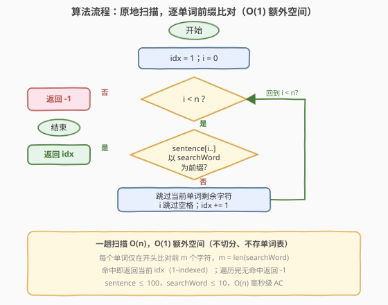

# LeetCode 检查单词是否为句中其他单词的前缀 题解

## 1. 题目概述

- **标题 / 题号**：检查单词是否为句中其他单词的前缀（#1455，easy）
- **链接**：https://leetcode.cn/problems/check-if-a-word-occurs-as-a-prefix-of-any-word-in-a-sentence/
- **难度**：简单
- **标签**：字符串、模拟、前缀匹配、一次遍历

**题意**：给你一个字符串 `sentence` 作为句子并指定检索词为 `searchWord`，其中句子由若干用**单个空格**分隔的单词组成。请你检查检索词 `searchWord` 是否为句子 `sentence` 中任意单词的前缀。

如果 `searchWord` 是某一个单词的前缀，则返回句子 `sentence` 中该单词所对应的下标（**下标从 1 开始**）。如果 `searchWord` 是多个单词的前缀，则返回匹配的第一个单词的下标（**最小下标**）。如果 `searchWord` 不是任何单词的前缀，则返回 `-1`。

字符串 `s` 的**前缀**是 `s` 的任何前导连续子字符串。

**示例 1**：

```text
输入：sentence = "i love eating burger", searchWord = "burg"
输出：4
解释："burg" 是 "burger" 的前缀，而 "burger" 是句子中第 4 个单词。
```

**示例 2**：

```text
输入：sentence = "this problem is an easy problem", searchWord = "pro"
输出：2
解释："pro" 是 "problem" 的前缀，而 "problem" 是句子中第 2 个也是第 6 个单词，但应返回最小下标 2。
```

**示例 3**：

```text
输入：sentence = "i am tired", searchWord = "you"
输出：-1
解释："you" 不是句子中任何单词的前缀。
```

**约束**：

- $1 \le \text{sentence.length} \le 100$
- $1 \le \text{searchWord.length} \le 10$
- `sentence` 由小写英文字母和空格组成
- `searchWord` 由小写英文字母组成

> ⚠️ 审题关键：① 下标**从 1 开始**（不是 0）；② 多个单词同时匹配时返回**最小下标**——从左到右扫到第一个命中即返回，天然保证最小；③ 题目保证单词间是**单个空格**，无需处理连续空格；④ `searchWord` 是单词的**前缀**而非子串，只需比对单词开头的前 $m$ 个字符（$m = \text{len}(\text{searchWord})$），且单词长度必须 $\ge m$。

> 💡 **关键点**：前缀匹配只关心每个单词的**开头**。对每个单词，把它前 $m$ 个字符与 `searchWord` 逐字符比对即可——全相同则命中。数据规模极小（$\text{sentence} \le 100$），一次遍历 $O(n)$ 即 AC。

## 2. 解题思路

### 2.1 暴力思路：切分 + 标准库前缀判定

最直觉的做法是「按空格切分句子得到单词表，再逐词用标准库判断是否以 `searchWord` 开头」：

- **Python**：`sentence.split(' ')` 得到单词列表，`enumerate(..., 1)` 给出 1-indexed 下标，`word.startswith(searchWord)` 判定前缀，首个命中即返回。
- **C++**：`istringstream >> word` 逐词读取，用 `word.rfind(searchWord, 0) == 0`（C++ 版 `startsWith` 惯用法）判定。

这种写法正确、简洁、不易出错。但它会**创建中间单词列表**，额外空间 $O(n)$（$n$ 为 `sentence` 长度）；且切分阶段遍历了整个句子。对于本题 $n \le 100$ 完全无妨，但若被追问「能否 $O(1)$ 额外空间」，原地扫描更优。

### 2.2 核心观察：原地扫描 + 逐字符前缀比对


前缀的本质是「**单词开头的一段连续字符与 `searchWord` 完全相同**」。因此无需切分整句，只需**沿句子扫描**，在每个单词的**起始位置**把后续字符与 `searchWord` 逐字符比对：

- 用游标 `i` 走过 `sentence`，用 `idx` 记录当前是第几个单词（1-indexed）；
- 每当 `i` 停在一个单词开头，就启动一个内层比对：令 `j = 0`，只要 `sentence[i] == searchWord[j]` 就同步推进 `i`、`j`；
- 若 `j` 走到 $m$（`searchWord` 长度），说明前 $m$ 个字符全匹配 → **命中**，返回当前 `idx`；
- 否则（中途字符不同，或单词比 `searchWord` 短提前到空格/末尾），跳过当前单词的剩余字符、越过空格、`idx += 1`，进入下一个单词；
- 整句扫完仍无命中，返回 `-1`。

> 💡 关键直觉：① **前缀只看开头**——比对一旦在某个单词的开头失败就立刻跳到下一个单词，剩余字符无需比较；② **单词比 `searchWord` 短时自然判否**：比对循环会在遇到空格/末尾时因 `sentence[i] != searchWord[j]`（字母 vs 空格）而中止，`j < m`，不命中；③ **从左到右首个命中即返回**——天然满足「最小下标」要求，无需收集所有命中再取最小。

> ⚠️ 与切分法相比，原地扫描**不创建单词表**，额外空间 $O(1)$；每个字符至多被「比对」和「跳过」各访问一次，总时间仍 $O(n)$。这与 [58. 最后一个单词的长度](../0001-0100/58_最后一个单词的长度.md) 中「从右向左扫描 vs `split()`」的取舍同源——面试时先写原地扫描展示对字符串边界的精确控制，再提及标准库 API 作为对照。

### 2.3 算法流程图



**完整步骤**：

1. **初始化** `idx = 1`（1-indexed 单词序号），`i = 0`（句子游标）；
2. **循环** 当 `i < n`（`n = len(sentence)`）：
   - `j = 0`，启动前缀比对；
   - **比对**：当 `i < n` **且** `j < m` **且** `sentence[i] == searchWord[j]` 时，`i += 1`，`j += 1`；
   - 若 `j == m`：**返回** `idx`（前缀命中）；
   - 否则：**跳过当前单词剩余字符**（`while i < n and sentence[i] != ' ': i += 1`），再 `i += 1` 越过空格，`idx += 1`；
3. **循环结束仍未返回** → **返回** `-1`。

> 💡 一趟扫描 $O(n)$，额外只用 `idx`、`i`、`j` 三个变量，空间 $O(1)$。

### 2.4 示例演算

以示例 1（`sentence = "i love eating burger"`，`searchWord = "burg"`）与示例 2（多单词匹配取最小下标）演算：


**示例 1**（$m=4$）：

| 下标 | 单词 | 与 "burg" 比对 | 命中? |
|------|------|----------------|-------|
| 1 | `i` | `i ≠ b`（首字符即不同） | ✗ |
| 2 | `love` | `l ≠ b` | ✗ |
| 3 | `eating` | `e ≠ b` | ✗ |
| 4 | `burger` | `b,u,r,g` 全匹配 | **✓ → 返回 4** |

第 4 个单词 `burger` 前 4 个字符恰为 `burg` $\implies$ 返回 4 ✓。

**示例 2**（$m=3$，`sentence = "this problem is an easy problem"`）：

- 下标 1 `this`：`t ≠ p` ✗；下标 2 `problem`：`p,r,o` 全匹配 **✓ → 返回 2**；
- 下标 6 `problem` 同样匹配，但下标 2 < 6，从左到右首个命中已返回 2，无需继续。

> 以示例 3（`"i am tired"`，`"you"`）验证：`i/a/t` 首字符均 ≠ `y`，整句扫完无命中 $\implies$ 返回 -1 ✓。

## 3. 参考代码

### C++（原地扫描，O(1) 额外空间）

```cpp
class Solution {
public:
    int isPrefixOfWord(string sentence, string searchWord) {
        int n = sentence.size(), m = searchWord.size();
        int idx = 1, i = 0;
        while (i < n) {
            int j = 0;
            // 在当前单词开头逐字符比对
            while (i < n && j < m && sentence[i] == searchWord[j]) {
                ++i;
                ++j;
            }
            if (j == m) return idx;        // 前 m 个字符全匹配 -> 命中
            // 跳过当前单词的剩余字符
            while (i < n && sentence[i] != ' ') ++i;
            ++i;                            // 越过单个空格
            ++idx;
        }
        return -1;
    }
};
```

### Python（原地扫描，O(1) 额外空间）

```python
class Solution:
    def isPrefixOfWord(self, sentence: str, searchWord: str) -> int:
        n, m = len(sentence), len(searchWord)
        idx = 1
        i = 0
        while i < n:
            j = 0
            while i < n and j < m and sentence[i] == searchWord[j]:
                i += 1
                j += 1
            if j == m:
                return idx
            while i < n and sentence[i] != ' ':
                i += 1
            i += 1  # 越过空格
            idx += 1
        return -1
```

### Python（API 一行流，对比用）

```python
class Solution:
    def isPrefixOfWord(self, sentence: str, searchWord: str) -> int:
        for i, word in enumerate(sentence.split(' '), 1):
            if word.startswith(searchWord):
                return i
        return -1
```

> ⚠️ **两种写法的对比**：`split()` + `startswith()` 写法简洁且不易出错，适合工程脚本；但原地扫描是面试中期望的「$O(1)$ 额外空间」解法，能展示对字符串边界与游标推进的精确控制。面试时建议先写原地扫描，再提及 API 版作为对照。注意题目保证**单个空格**分隔，故 `split(' ')` 与 `split()` 等价；若改为任意空格分隔，原地扫描也只需把「越过空格」改成「越过连续空格」即可。

## 4. 复杂度分析

| 维度 | 原地扫描 $O(1)$ 空间（推荐） | 切分 + 标准库 API |
|------|------------------------------|-------------------|
| **时间复杂度** | $O(n)$ | $O(n)$ |
| **空间复杂度** | $O(1)$（仅 `idx`/`i`/`j`） | $O(n)$（存储单词列表） |
| **额外切分开销** | 无 | 需遍历整句并分配列表 |
| **适用场景** | 面试 / 空间敏感 | 工程脚本 / 快速实现 |

- **原地扫描**：每个字符至多被「比对循环」和「跳过循环」各访问一次，总时间 $O(n)$；额外只用三个整型变量，空间 $O(1)$。是本题的最优解。
- **切分法**：时间同为 $O(n)$，但 `split` 会创建单词列表，空间 $O(n)$。本题 $n \le 100$ 两者均毫秒级 AC，差异仅在空间常数与面试表现力。

> ⚠️ 本题 $n \le 100$、$m \le 10$，两种写法实际性能无感知差异。讨论重点不在「降复杂度」（$O(n)$ 已是下界，至少要读入句子），而在**边界处理的正确性**（1-indexed、单词短于检索词、多命中取最小）与**空间取舍**。

## 5. 扩展：单词分隔符泛化与 KMP 对照

### 5.1 任意空格分隔

题目保证单词间为**单个空格**。若放宽为「若干连续空格」（如 [58. 最后一个单词的长度](../0001-0100/58_最后一个单词的长度.md) 的设定），原地扫描只需把「越过空格」一步改为「越过连续空格」：

```cpp
while (i < n && sentence[i] == ' ') ++i;   // 跳过连续空格定位下一单词
```

而 `split()`（无参版）天然合并连续空格，API 写法无需改动。两种写法在泛化场景下的鲁棒性差异值得留意。

### 5.2 与子串匹配的对照

本题是「**前缀**匹配」——只比对单词开头，比对失败即跳到下一单词，无需回溯。而 [28. 找出字符串中第一个匹配项的下标](../0001-0100/28_找出字符串中第一个匹配项的下标.md) 是「**子串**匹配」——模式可在文本任意位置出现，朴素法失配需回退文本游标，故有 KMP 等加速算法。前缀匹配是子串匹配的**特例**（模式固定锚定在单词起点），因此无需 KMP，$O(n)$ 单趟扫描足矣。

> 💡 **一句话**：前缀匹配 $\subset$ 子串匹配。锚定起点消除了失配回溯，使单趟 $O(n)$ 成为可能——这是本题「无需复杂算法」的根本原因。

## 6. 面试要点

1. **下标为什么从 1 开始？返回时如何处理？**

   > 题目明确规定单词下标**从 1 开始**。实现时令 `idx` 初始为 1，每读完一个单词 `idx += 1`，命中时直接返回 `idx`，无需做 $+1$ 修正。若用 `enumerate(words, 1)` 则 `start=1` 同样给出 1-indexed。

2. **如果某个单词比 `searchWord` 短，会误判为命中吗？**

   > 不会。比对循环条件含 `j < m` 与 `sentence[i] == searchWord[j]`：单词较短时 `i` 会先遇到空格或末尾，此时 `sentence[i]`（空格或越界）≠ `searchWord[j]`（字母），循环中止且 `j < m`，不命中。例如 `searchWord = "burger"` 对单词 `"burg"`：比到 `g` 后 `i` 指向空格，`j = 4 < 6`，判否。无需特判长度。

3. **多个单词都匹配时如何保证返回最小下标？**

   > 从左到右扫描，**首个命中立即返回**。由于下标随扫描单调递增，第一个命中的下标必为所有命中中的最小值，无需收集全部再取最小。示例 2 中下标 2 与下标 6 都匹配，扫描到 2 即返回。

4. **原地扫描为什么要分「比对」和「跳过」两个循环？**

   > 「比对循环」从单词开头起逐字符匹配 `searchWord`，一旦失配立即停止；此时 `i` 停在单词中部的某个失配位置，剩余字符无需再比。「跳过循环」负责把 `i` 推到本单词末尾（遇到空格或末尾），随后越过空格进入下一单词。两段职责分离，各自终止条件清晰，避免游标混乱。

5. **`split()` 写法和原地扫描孰优？**

   > 功能等价。`split()` + `startswith()` 简洁、不易出错，适合工程；原地扫描额外空间 $O(1)$，且只访问必要字符，适合面试展示边界控制。两者时间同为 $O(n)$，本题 $n \le 100$ 性能无差异。建议面试先写原地扫描，再提 API 版对照，体现取舍意识。

> 💡 **一句话总结**：1455 的灵魂是「**前缀 = 锚定单词开头的逐字符比对**」——沿句子单趟扫描，每词开头比对前 $m$ 个字符，首个全匹配即返回其 1-indexed 下标，$O(n)$/$O(1)$ 即解。

## 同类练习题

| # | 题目 | 与本题的关联 |
|---|------|-------------|
| 14 | [最长公共前缀](https://leetcode.cn/problems/longest-common-prefix/)（[题解](../0001-0100/14_最长公共前缀.md)） | 前缀扫描母题——纵向 / 横向扫描多字符串公共前缀，与 1455「逐字符比对开头」同源 |
| 28 | [找出字符串中第一个匹配项的下标](https://leetcode.cn/problems/find-the-index-of-the-first-occurrence-in-a-string/)（[题解](../0001-0100/28_找出字符串中第一个匹配项的下标.md)） | 子串匹配母题（BF/KMP）——模式可在任意位置出现，对照 1455 前缀匹配锚定起点无需回溯的特例 |
| 58 | [最后一个单词的长度](https://leetcode.cn/problems/length-of-last-word/)（[题解](../0001-0100/58_最后一个单词的长度.md)） | `split()` API vs 原地 $O(1)$ 扫描的同源取舍，字符串游标边界控制 |
| 1408 | [数组中的字符串匹配](https://leetcode.cn/problems/string-matching-in-an-array/)（[题解](1408_数组中的字符串匹配.md)） | 字符串包含关系判定（子串 vs 前缀的对照），同属字符串匹配家族 |
| 151 | [反转字符串中的单词](https://leetcode.cn/problems/reverse-words-in-a-string/)（[题解](../0101-0200/151_反转字符串中的单词.md)） | 单词边界扫描的进阶——逐词定位并反转顺序，核心子操作即「跳过空格 → 定位单词」 |
