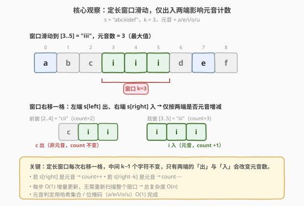
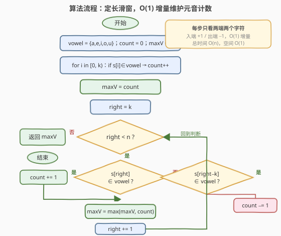
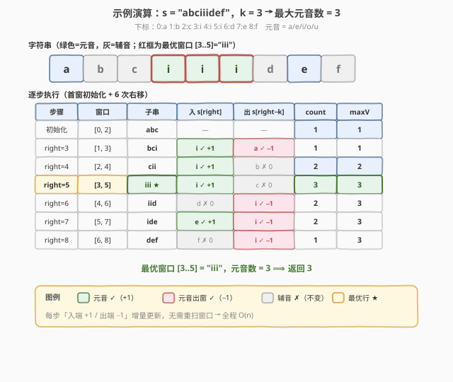

# LeetCode 定长子串中元音的最大数目 题解

## 1. 题目概述

- **标题 / 题号**：定长子串中元音的最大数目（#1456，medium）
- **链接**：https://leetcode.cn/problems/maximum-number-of-vowels-in-a-substring-of-given-length/
- **难度**：中等
- **标签**：字符串、滑动窗口、定长滑窗

**题意**：给你一个字符串 `s` 和一个整数 `k`，请返回 `s` 中**长度为 `k`** 的子串中**元音字母**数目的最大值。

元音字母为 `a`、`e`、`i`、`o`、`u`（均为小写，题目保证 `s` 只含小写英文字母）。

**示例 1**：

```text
输入：s = "abciiidef", k = 3
输出：3
解释：所有长度为 3 的子串中，"iii" 含 3 个元音，为最大值。
```

**示例 2**：

```text
输入：s = "aeiou", k = 2
输出：2
解释：任意长度为 2 的子串都由 2 个元音组成，最大值为 2。
```

**示例 3**：

```text
输入：s = "leetcode", k = 3
输出：2
解释："lee"、"eet" 含 2 个元音，为最大值。
```

**约束**：

- $1 \le \text{s.length} \le 10^5$
- `s` 由小写英文字母组成
- $1 \le k \le \text{s.length}$

> 💡 **关键点**：求的是**定长**子串的元音数最大值——窗口长度固定为 $k$，窗口每次右移一格，只有两端的「出」与「入」会改变元音计数。这是**定长滑窗**的招牌题，每步 $O(1)$ 增量更新即可。

## 2. 解题思路

### 2.1 暴力思路：枚举所有长度为 k 的子串

最直白的做法：枚举每个起点 $i \in [0, n-k]$，扫描子串 $s[i..i+k-1]$ 统计其中元音个数，取最大值。

- **正确**：覆盖所有 $\max(1,\, n-k+1)$ 个长度为 $k$ 的子串，不重不漏；
- **效率**：每个子串扫描 $O(k)$，共 $O(n-k+1)$ 个子串，总时间 $O(nk)$。当 $n = 10^5$、$k \approx n/2$ 时约 $5 \times 10^9$ 次操作，必然超时。

> ⚠️ 瓶颈在于**重复计算**：相邻两个子串 $s[i..i+k-1]$ 与 $s[i+1..i+k]$ 有 $k-1$ 个字符重叠，暴力却每次从头扫描这 $k-1$ 个共享字符。定长滑窗正是为消除这部分冗余而生。

### 2.2 核心观察：定长滑窗 O(1) 增量



关键直觉是维护一个**长度恒为 $k$ 的窗口** $[left, right]$，并用一个变量 `count` 记录当前窗口内的元音数。窗口每次整体右移一格：

- **入端**：新进入窗口的字符 $s[right]$，若为元音则 `count++`；
- **出端**：刚离开窗口的字符 $s[right - k]$（即旧左端），若为元音则 `count--`；
- 中间 $k - 1$ 个字符不变，`count` 无需重算。

每步只看两端两个字符，`count` 在 $O(1)$ 内更新，答案取所有窗口 `count` 的最大值。

> 💡 **为什么「出端」是** $s[right - k]$ **而不是** $s[left]$**？** 因为窗口右移一格后，新窗口为 $[right-k+1,\, right]$，刚被挤出的是新左端的左侧一位，即下标 $right - k$。用 $right$ 统一表达下标，可避免额外维护 $left$ 指针——这是定长滑窗「单指针」写法的精髓。

### 2.3 算法流程图



**完整步骤**：

1. **预处理首窗**：扫描 $s[0..k-1]$ 统计元音数，记为 `count`，并令 `maxV = count`；
2. **滑窗循环**：`right` 从 $k$ 到 $n-1$，每轮：
   - 若 $s[right]$ 是元音：`count += 1`；
   - 若 $s[right - k]$ 是元音：`count -= 1`；
   - `maxV = max(maxV, count)`；
3. **返回** `maxV`。

> 💡 一趟遍历 $O(n)$，每轮两次 $O(1)$ 的元音判定 + 一次取 `max`，额外只用 `count`、`maxV` 两个变量，空间 $O(1)$。元音判定用哈希集合 `unordered_set` 或字符串 `"aeiou"` 的 `find`，均为 $O(1)$。

### 2.4 示例演算

以示例 1（`s = "abciiidef"`，`k = 3`）完整演算（下标：`0:a 1:b 2:c 3:i 4:i 5:i 6:d 7:e 8:f`）：



| 步骤 | 窗口 | 子串 | 入 $s[right]$ | 出 $s[right-k]$ | count | maxV |
|------|------|------|---------------|-----------------|-------|------|
| 初始化 | $[0,2]$ | `abc` | — | — | 1 | 1 |
| right=3 | $[1,3]$ | `bci` | `i` ✓ +1 | `a` ✓ −1 | 1 | 1 |
| right=4 | $[2,4]$ | `cii` | `i` ✓ +1 | `b` ✗ 0 | 2 | 2 |
| right=5 | $[3,5]$ | `iii` | `i` ✓ +1 | `c` ✗ 0 | **3** | **3** ★ |
| right=6 | $[4,6]$ | `iid` | `d` ✗ 0 | `i` ✓ −1 | 2 | 3 |
| right=7 | $[5,7]$ | `ide` | `e` ✓ +1 | `i` ✓ −1 | 2 | 3 |
| right=8 | $[6,8]$ | `def` | `f` ✗ 0 | `i` ✓ −1 | 1 | 3 |

- 首窗 `"abc"` 仅 `a` 一个元音，`count = 1`；
- `right=5` 时入 `i`、出 `c`，`count` 升到 $3$，窗口 `"iii"` 命中最大值；
- 此后窗口依次滑过辅音区，`count` 回落，但 `maxV` 已锁定 $3$；
- 最终返回 `3` ✓。

> ⚠️ 注意 `right=3` 这一步：入端 `i`（+1）与出端 `a`（−1）同为元音，`count` 净变化为 $0$。这说明「入出同为元音」时计数不变，但窗口内容已不同——增量更新只关心**净变化**，这正是 $O(1)$ 维护的正确性来源。

## 3. 参考代码

### C++（哈希集合判定元音）

```cpp
class Solution {
public:
    int maxVowels(string s, int k) {
        unordered_set<char> vowel = {'a', 'e', 'i', 'o', 'u'};
        int count = 0;
        for (int i = 0; i < k; ++i) {
            if (vowel.count(s[i])) ++count;
        }
        int maxV = count;
        for (int right = k; right < (int)s.size(); ++right) {
            if (vowel.count(s[right])) ++count;
            if (vowel.count(s[right - k])) --count;
            maxV = max(maxV, count);
        }
        return maxV;
    }
};
```

### Python

```python
class Solution:
    def maxVowels(self, s: str, k: int) -> int:
        vowel = set("aeiou")
        count = sum(1 for i in range(k) if s[i] in vowel)
        maxV = count
        for right in range(k, len(s)):
            if s[right] in vowel:
                count += 1
            if s[right - k] in vowel:
                count -= 1
            maxV = max(maxV, count)
        return maxV
```

> 💡 **实现要点**：① 首窗单独预处理，避免循环内特判 `right - k < 0`；② 出端下标用 `right - k` 而非额外维护 `left`，单指针更简洁；③ 元音判定用集合 $O(1)$，比逐个 `==` 比较更清晰且同样高效。

## 4. 复杂度分析

| 维度 | 定长滑窗 $O(1)$ 增量（推荐） | 暴力枚举 |
|------|----------------------------|----------|
| **时间复杂度** | $O(n)$ | $O(nk)$ |
| **空间复杂度** | $O(1)$（仅 `count`、`maxV`；元音集合 $O(1)$） | $O(1)$ |
| **每窗更新** | $O(1)$（入端 + 出端各一次判定） | $O(k)$（重扫整窗） |
| **$n = 10^5, k \approx n/2$** | 约 $10^5$ 次操作，毫秒级 AC | 约 $5 \times 10^9$ 次操作，超时 |
| **适用场景** | 定长子窗最值 / 计数 | $n, k$ 均极小 |

- **定长滑窗**：`right` 从 $k$ 走到 $n-1$ 共 $n - k$ 轮，加上首窗预处理 $k$ 次，总操作 $O(n)$；额外仅两个计数变量，空间 $O(1)$。是本题最优解。
- **暴力**：$n - k + 1$ 个窗口各扫 $k$ 字符，$O(nk)$；当 $k$ 接近 $n/2$ 时退化为 $O(n^2)$，超时。

> ⚠️ 定长滑窗之所以能从 $O(nk)$ 降到 $O(n)$，关键在于**窗口长度恒定**——每次右移恰好「出一入一」，增量可 $O(1)$ 计算。若是**变长**窗口（如 [209. 长度最小的子数组](../0201-0300/209_长度最小的子数组.md)），则需配合 `left` 收缩，但思路同源。

## 5. 扩展：位掩码判定元音

当追求极致常数时，可用一个整数的位掩码编码元音集合，以位运算代替哈希查找：

```cpp
class Solution {
public:
    int maxVowels(string s, int k) {
        // 元音位掩码：a=1<<0, e=1<<4, i=1<<8, o=1<<14, u=1<<20
        unsigned mask = (1u << ('a'-'a')) | (1u << ('e'-'a'))
                      | (1u << ('i'-'a')) | (1u << ('o'-'a'))
                      | (1u << ('u'-'a'));
        auto isVowel = [&](char c) { return (mask >> (c - 'a')) & 1u; };

        int count = 0;
        for (int i = 0; i < k; ++i) count += isVowel(s[i]);
        int maxV = count;
        for (int right = k; right < (int)s.size(); ++right) {
            count += isVowel(s[right]);
            count -= isVowel(s[right - k]);
            maxV = max(maxV, count);
        }
        return maxV;
    }
};
```

> 💡 **何时用位掩码**：字符集小且固定（本题仅 26 个小写字母）时，位掩码用一次移位 + 按位与代替哈希查找，常数更小。哈希集合方案更通用、可读性更好，是默认首选；位掩码是「压常数」的进阶写法，面试中提及即可。

## 6. 面试要点

1. **为什么定长滑窗是 $O(n)$ 而暴力是 $O(nk)$？**

   > 定长窗口每次右移一格，恰好「出一字符、入一字符」，中间 $k-1$ 个字符不变。增量更新只检查这两端，每步 $O(1)$，总 $O(n)$。暴力每次从头扫描整窗 $O(k)$，忽略了相邻窗口 $k-1$ 个字符的重叠，故为 $O(nk)$。

2. **出端下标为什么是 $right - k$ 而不是 $left$？**

   > 窗口右移一格后新窗口为 $[right-k+1,\, right]$，被挤出的是新左端左侧一位，即 $right - k$。用 $right$ 单一变量表达下标，可省去 $left$ 指针——这是定长滑窗的「单指针」写法。若维护 $left$，则 $left = right - k + 1$，出端为 $left - 1$，等价但多一个变量。

3. **首窗为什么要单独预处理？**

   > 滑窗循环从 $right = k$ 开始（因为 $right < k$ 时窗口尚未填满 $k$ 个字符）。首窗 $[0, k-1]$ 的元音数需先算好作为 `maxV` 初值。若不预处理而直接在循环里判断 `right >= k` 再滑窗，需额外特判 `right - k < 0`，不如拆成「首窗 + 滑窗」两段清晰。

4. **如果 $k = n$（窗口等于整串）怎么办？**

   > 此时只有 $1$ 个窗口，首窗预处理后 `maxV = count` 即答案，滑窗循环 `right` 从 $k = n$ 开始不执行（`right < n` 为假），直接返回。代码无需特判，自然兼容。

5. **本题与 [643. 子数组最大平均数 I](../0601-0700/643_子数组最大平均数I.md) 有何异同？**

   > 同为「定长子窗最值」：643 求长度为 $k$ 的子数组**最大平均数**，等价于求最大**和**（除以 $k$ 即平均数），增量更新是「入端加、出端减」维护**和**；1456 求最大**元音数**，增量是「入端 +1/0、出端 −1/0」维护**计数**。结构完全同构，只是聚合量从「和」换成「计数」。

> 💡 **一句话总结**：1456 的灵魂是「**定长滑窗 + $O(1)$ 增量**」——窗口右移时只看出入两端是否元音，`count` 增减维护，全程 $O(n)$/$O(1)$。所有「定长子窗最值/计数」题都用这套模板。

## 同类练习题

| # | 题目 | 与本题的关联 |
|---|------|-------------|
| 643 | [子数组最大平均数 I](https://leetcode.cn/problems/maximum-average-subarray-i/)（[题解](../0601-0700/643_子数组最大平均数I.md)） | 定长滑窗最直接的孪生题——求长度为 $k$ 的子数组最大平均数，等价于维护窗口元素**和**的增量（入加出减），与 1456 维护元音**计数**结构完全同构 |
| 209 | [长度最小的子数组](https://leetcode.cn/problems/minimum-size-subarray-sum/)（[题解](../0201-0300/209_长度最小的子数组.md)） | **变长**滑窗的代表——窗口长度不固定，需配合 `left` 主动收缩，对照 1456 的定长「出一入一」理解滑窗的两种形态 |
| 438 | [找到字符串中所有字母异位词](https://leetcode.cn/problems/find-all-anagrams-in-a-string/)（[题解](../0401-0500/438_找到字符串中所有字母异位词.md)） | 定长滑窗 + 字符频率表——窗口长度固定为 $p$ 的长度，维护 $26$ 维频率数组做增量比对，是 1456「计数型定长滑窗」的多维升级版 |
| 1248 | [统计「优美子数组」](https://leetcode.cn/problems/count-number-of-nice-subarrays/)（[题解](../1201-1300/1248_统计优美子数组.md)） | 定长滑窗 + 「至多 K」转化——统计恰含 $k$ 个奇数的子数组数，与 1456 同为「定长子区间计数」家族，但用前缀和/双 atMost 转化处理「恰含」语义 |
| 239 | [滑动窗口最大值](https://leetcode.cn/problems/sliding-window-maximum/)（[题解](../0201-0300/239_滑动窗口最大值.md)） | 定长滑窗的「最难版」——窗口内求**最大值**无法 $O(1)$ 增量，需单调队列维护候选最值，对照 1456 的「可增量」与 239 的「需单调队列」理解滑窗维护的边界 |
