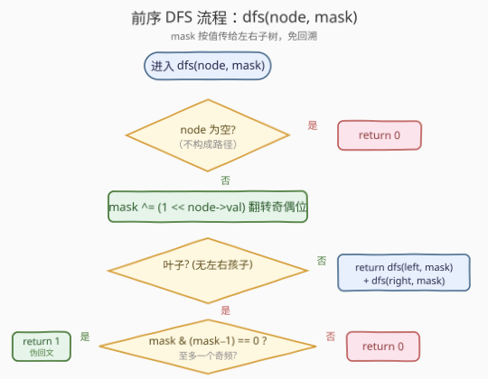
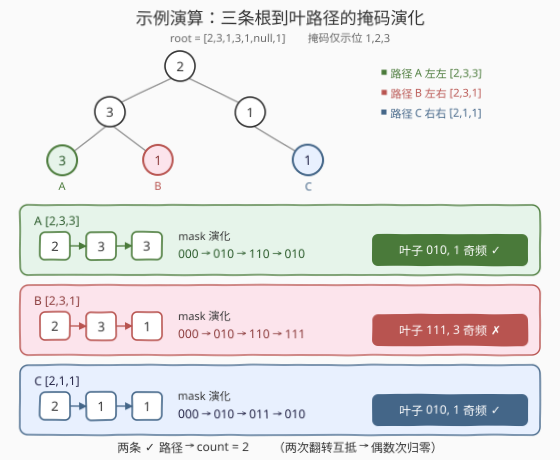

# 二叉树中的伪回文路径

- **题目名称**：二叉树中的伪回文路径
- **链接**：[1457. 二叉树中的伪回文路径](https://leetcode.cn/problems/pseudo-palindromic-paths-in-a-binary-tree/)
- **难度**：中等
- **标签**：树、二叉树、深度优先搜索、前序遍历、位运算

## 1. 题目概述

给你一棵二叉树，每个节点的值为 `1` 到 `9`。称一条从根到叶子的路径是「**伪回文**」的，当它满足：路径经过的所有节点值的**排列中，存在一个回文序列**。

返回从根到叶子节点的所有路径中，**伪回文路径**的数目。

**示例 1**：

```text
输入：root = [2,3,1,3,1,null,1]
输出：2

        2
       / \
      3   1
     / \   \
    3   1   1
```

共 3 条根到叶路径：红色 `[2,3,3]`、绿色 `[2,1,1]`、`[2,3,1]`。其中红色 `[2,3,3]` 可重排为 `[3,2,3]`，绿色 `[2,1,1]` 可重排为 `[1,2,1]`，二者为伪回文；`[2,1,3]` 三个值各出现一次（3 个奇频），无法重排成回文。

**示例 2**：

```text
输入：root = [2,1,1,1,3,null,null,null,null,null,1]
输出：1

            2
           / \
          1   1
         / \
        1   3
             \
              1
```

共 3 条路径：`[2,1,1]`（可重排为 `[1,2,1]`，伪回文）、`[2,1,3,1]`（2 与 3 各一次，2 个奇频，非伪回文）、`[2,1]`（2 与 1 各一次，2 个奇频，非伪回文）。

**示例 3**：

```text
输入：root = [9]
输出：1
```

**约束条件**：

- 二叉树节点数目范围 `[1, 10^5]`
- `1 <= Node.val <= 9`

> 💡 本题是「**前序遍历 + 路径状态向下传递**」与「**位掩码压缩奇偶性**」的合体。判定一条路径能否重排成回文，只需关心各数字出现次数的**奇偶性**——至多一个数字出现奇数次即可。而节点值限定在 `1–9`，恰好可用一个 9 位整数（位掩码）记录奇偶性，用异或翻转、用 `mask & (mask - 1) == 0` 判定。与 [1448. 统计二叉树中好节点的数目](../1401-1500/1448_统计二叉树中好节点的数目.md) 一样，把路径状态作为参数前序向下传，无需回溯。

---

## 2. 解题思路

### 2.1 暴力思路：收集路径 + 叶子处统计频率

最直观的做法：DFS 维护一条「当前路径数组」（进入节点压入、退出节点弹出），到达叶子时扫描整条路径统计各数字出现次数，再数有几个数字出现奇数次，若 ≤ 1 则计数 +1。

每个叶子需 $O(h)$ 扫描路径（$h$ 为路径长度）。所有叶子的路径长度之和在最坏情况下可达 $O(n^2)$——例如「梳状树」：每个内部节点挂一个叶子和一个内部子节点，会产生 $\Theta(n)$ 片叶子且路径长度依次为 $2, 3, \dots, \Theta(n)$，求和为 $\Theta(n^2)$。

> ⚠️ 暴力法的浪费在于：路径的频率信息是**可增量维护**的——从父节点走到子节点时，只多了一个数字，不必在叶子处重新统计整条路径。更进一步，判定回文只需奇偶性而非精确频次，奇偶性又可压缩成一个位掩码随路径流动。

### 2.2 核心观察：奇偶性回文判定 + 位掩码 + 参数传递


**关键洞察 1（回文判定）**：一串数字能重排成回文，当且仅当**至多一个数字出现奇数次**。

> 回文关于中心对称：除可能的中心一个元素外，其余元素成对出现。故偶数长度路径要求所有数字均出现偶数次；奇数长度路径恰有一个数字出现奇数次（放在中心）。二者合并为「至多一个奇频」。

**关键洞察 2（位掩码压缩）**：节点值 $\in [1,9]$，恰 9 种数字。用一个 9 位整数 `mask` 的第 `d` 位记录「数字 `d` 出现次数的奇偶性」（1 = 奇，0 = 偶）。访问节点值为 `d` 时，`mask ^= (1 << d)` 翻转该位——出现偶数次自然归零，奇数次保留为 1。

**关键洞察 3（≤1 个奇频 ⟺ `mask & (mask - 1) == 0`）**：`mask` 中至多一个 1 位，等价于 `mask` 为 `0`（全偶，无奇频）或 $2$ 的幂（恰一个奇频）。判定一个非负整数「是否为 0 或 2 的幂」的经典位运算即 `mask & (mask - 1) == 0`：`mask - 1` 把最低位的 1 及以下全翻转，与原 `mask` 相与若为 0，说明原来至多一个 1 位。

> ⚠️ **别和「统计 1 的个数」混淆**。`mask & (mask - 1)` 的作用是**消去最低位的 1**；反复执行可数 1 的个数（[191. 位 1 的个数](https://leetcode.cn/problems/number-of-1-bits/)）。但本题只需执行**一次**并判断结果是否为 0——一次消去后若已无非 1 位，说明原来至多一个 1。

**关键洞察 4（前序向下传参，免回溯）**：把 `mask` 作为 `dfs` 的参数按值传递：进入节点时算出新 `mask`，传给左右子树。左子树对 `mask` 的修改不影响右子树收到的副本——天然隔离，无需「进入时翻转、退出时再翻转回来」的回溯。这与 [1448](../1401-1500/1448_统计二叉树中好节点的数目.md) 传 `pathMax`、[129. 求根节点到叶节点数字之和](../0101-0200/129_求根节点到叶节点数字之和.md) 传前缀累加值同构。

### 2.3 算法流程图



**DFS 完整步骤**（函数 `dfs(node, mask)` 返回以 `node` 为根的子树中伪回文路径数）：

1. **空节点**：返回 `0`（不构成路径）；
2. **翻转奇偶位**：`mask ^= (1 << node->val)`；
3. **叶子判定**：若 `node` 无左右孩子，返回 `(mask & (mask - 1)) == 0 ? 1 : 0`；
4. **递归左右**：`return dfs(node->left, mask) + dfs(node->right, mask)`——把同一份 `mask` 副本分别传给两棵子树。

> 💡 **为什么先翻掩码再判叶子？** 叶子本身也是路径上的一个节点，它的值必须计入奇偶性。若先判叶子再翻掩码，会漏掉叶子值。正确顺序是「进入节点即翻掩码」，保证叶子处掩码已包含自身。

### 2.4 示例演算

以示例 1 `root = [2,3,1,3,1,null,1]` 为例，三条根到叶路径的掩码演化：



| 路径 | 访问序列 | 掩码演化（位 d 表示数字 d） | 叶子处 mask | `mask & (mask-1)` | 奇频数 | 伪回文？ |
|------|---------|---------------------------|------------|-------------------|--------|---------|
| 左左 `[2,3,3]` | 2 → 3 → 3 | `0` → `010` → `110` → `010` | `010`（位 2） | `010 & 001 = 0` | 1（数字 2） | ✅ |
| 左右 `[2,3,1]` | 2 → 3 → 1 | `010` → `110` → `111` | `111`（位 1,2,3） | `111 & 110 = 110` | 3 | ❌ |
| 右右 `[2,1,1]` | 2 → 1 → 1 | `010` → `011` → `010` | `010`（位 2） | `010 & 001 = 0` | 1（数字 2） | ✅ |

最终 `count = 2` ✓。注意左左路径 `[2,3,3]`：数字 3 出现两次（偶数），两次翻转互相抵消，掩码只剩数字 2 的位——这正是「偶数次自然归零」的体现。

> 💡 **掩码即频率的奇偶压缩**。同一数字出现两次，`mask ^= bit` 执行两次相互抵消，位归 0。所以掩码里的每个 1 位，对应「该数字在路径上出现奇数次」。把「数奇频个数 ≤ 1」替换为「掩码至多一个 1 位」，即 `mask & (mask - 1) == 0`，把 $O(9)$ 的扫描降为 $O(1)$ 的位运算。

---

## 3. 参考代码

### C++

```cpp
// 1457. 二叉树中的伪回文路径.cpp —— 前序 DFS + 位掩码奇偶性
class Solution {
public:
    int pseudoPalindromicPaths(TreeNode* root) {
        return dfs(root, 0);
    }
private:
    int dfs(TreeNode* node, int mask) {
        if (!node) return 0;
        mask ^= (1 << node->val);                 // 翻转该数字的奇偶位
        if (!node->left && !node->right) {        // 叶子：判定至多一个奇频
            return (mask & (mask - 1)) == 0 ? 1 : 0;
        }
        return dfs(node->left, mask) + dfs(node->right, mask);
    }
};
```

### Python

```python
class Solution:
    def pseudoPalindromicPaths(self, root: Optional[TreeNode]) -> int:
        def dfs(node: Optional[TreeNode], mask: int) -> int:
            if not node:
                return 0
            mask ^= (1 << node.val)               # 翻转该数字的奇偶位
            if not node.left and not node.right:   # 叶子：判定至多一个奇频
                return 1 if (mask & (mask - 1)) == 0 else 0
            return dfs(node.left, mask) + dfs(node.right, mask)

        return dfs(root, 0)
```

> 💡 两版逻辑一致：`mask` 作为参数按值传递，左子树翻转掩码不影响右子树收到的副本，**无需回溯**。`1 << node->val` 用位 `d` 记录数字 `d` 的奇偶性（位 0 恒为 0，不影响判定）。也可写 `1 << (node->val - 1)` 用位 0–8，等价。

> 💡 **频率数组 + 回溯也行，但更繁**。维护 `int cnt[10]`，进入节点 `cnt[val]++`、退出 `cnt[val]--`，叶子处数 ≤1 个奇频。时间同为 $O(n)$，但需要手动回溯且叶子判定 $O(9)$。位掩码把频率数组压成一个 `int`、把「≤1 奇频」压成一次位运算，并借参数传递免回溯——三重简化。

---

## 4. 复杂度分析

| 维度 | 复杂度 | 说明 |
|------|--------|------|
| 时间复杂度 | $O(n)$ | 每个节点只访问一次，每次做 $O(1)$ 的异或与位运算判定 |
| 空间复杂度 | $O(h)$ | 递归栈深度 = 树高 $h$；平衡树 $O(\log n)$，退化链状 $O(n)$ |
| 最坏情况 | $O(n)$ 空间 | 树退化为单侧链时递归深度达 $n$ |

> ⚠️ 暴力法 $O(n^2)$ 的浪费在于：叶子处重新扫描整条路径统计频率，而频率的奇偶性可由父节点增量传给子节点。位掩码把「9 个频率值」压缩成「1 个整数」、把「扫描数奇频」压缩成「一次 `mask & (mask-1)`」，再借参数传递免回溯——三步把 $O(n^2)$ 降到 $O(n)$。

---

## 5. 扩展：迭代法（显式栈 + 掩码）

递归写法在树极深（如 $n = 10^5$ 退化链）时有栈溢出风险（Python 默认递归深度约 1000）。用显式栈做前序遍历，把 `(node, mask)` 一起压栈即可，同样无需回溯：

```python
class Solution:
    def pseudoPalindromicPaths(self, root: Optional[TreeNode]) -> int:
        count = 0
        stack = [(root, 0)]
        while stack:
            node, mask = stack.pop()
            mask ^= (1 << node.val)
            if not node.left and not node.right:
                if (mask & (mask - 1)) == 0:
                    count += 1
            else:
                if node.right:                     # 先压右，弹出时先处理左（前序）
                    stack.append((node.right, mask))
                if node.left:
                    stack.append((node.left, mask))
        return count
```

```cpp
int pseudoPalindromicPaths(TreeNode* root) {
    int count = 0;
    stack<pair<TreeNode*, int>> st;
    st.push({root, 0});
    while (!st.empty()) {
        auto [node, mask] = st.top(); st.pop();
        mask ^= (1 << node->val);
        if (!node->left && !node->right) {
            if ((mask & (mask - 1)) == 0) ++count;
        } else {
            if (node->right) st.push({node->right, mask});
            if (node->left)  st.push({node->left,  mask});
        }
    }
    return count;
}
```

> 💡 迭代版与递归完全等价：`mask` 仍是「按值传递」，每个栈帧持有独立副本，无需回溯恢复。时间 $O(n)$，空间 $O(h)$。面试推荐先讲递归版（体现对前序向下传参 + 位掩码的理解），再提迭代版作为防栈溢出的工程备选。

---

## 6. 面试要点

1. **为什么「至多一个奇频」等价于可重排成回文？**

   > 回文关于中心对称：除中心一个元素外，其余成对出现。偶数长度要求所有数字偶数次；奇数长度恰一个数字奇数次（居中）。合并即「至多一个奇频」。这是字符串回文排列判定的通用结论（参见 [266. 回文排列](https://leetcode.cn/problems/palindrome-permutation/)）。

2. **`mask & (mask - 1) == 0` 的含义是什么？**

   > `mask - 1` 把 `mask` 最低位的 1 及其以下全翻转，与原 `mask` 相与若为 0，说明 `mask` 中至多一个 1 位——即 `mask` 为 0 或 2 的幂。本题中每个 1 位代表一个「出现奇数次的数字」，故该条件即「至多一个奇频」。注意这是「判定至多一个 1」，与 [191](https://leetcode.cn/problems/number-of-1-bits/) 的「统计 1 的个数」用同一运算但目标不同。

3. **为什么 `mask` 用参数传递而非全局变量 + 回溯？**

   > 参数传递让左右子树收到独立的 `mask` 副本——左子树翻转掩码不影响右子树，无需「进入翻转、退出再翻转回来」。代码更简洁、不易漏回溯。本质是把「可变状态」变成「不可变输入」，与 [1448](../1401-1500/1448_统计二叉树中好节点的数目.md) 传 `pathMax` 同理。

4. **本题和 1448、250 的异同？**

   > 三者都是「树形传递题」。1457 与 1448 同属「**前序向下传状态**」：1457 传奇偶掩码、1448 传路径最值，都在叶子/节点处用传递下来的状态做判定，`dfs` 返回子树计数向上累加。250 则是「**后序向上传子树结论**」：同值性依赖子树结果，需后序返回布尔。看到「只看祖先链」就前序向下传，看到「依赖子树」就后序向上传。

5. **如果节点值范围变成 `1 <= Node.val <= 100`，位掩码还可行吗？**

   > 不可行——100 位超出 `int` / `long long` 的可用位宽（需大整数）。改用频率数组 + 回溯：`int cnt[101]`，进入 `cnt[val]++`、退出 `cnt[val]--`，叶子处 $O(100)$ 扫描数奇频。时间仍 $O(n)$（常数变大），空间 $O(h + 100)$。或用哈希表记录奇频集合：进入时翻转该数字在集合中的存在性，叶子处看集合大小 ≤ 1。位掩码的优雅依赖于**值域小且连续**这一关键约束。

> 💡 **一句话总结**：1457 的灵魂是「**前序向下传位掩码 + 异或压缩奇偶性**」——`mask ^= (1 << val)` 增量记录路径奇偶，叶子处 `mask & (mask-1) == 0` 判定至多一个奇频，参数传递免回溯，一次遍历 $O(n)$ 完成计数。是 [1448](../1401-1500/1448_统计二叉树中好节点的数目.md) 前序传参骨架与位运算奇偶技巧的合体。

---

## 7. 同类练习题

- [1448. 统计二叉树中好节点的数目](https://leetcode.cn/problems/count-good-nodes-in-binary-tree/)（[题解](../1401-1500/1448_统计二叉树中好节点的数目.md)）：前序向下传 `pathMax`，与本题传 `mask` 同套「参数传状态、前序 DFS、叶子处判定」模板
- [129. 求根节点到叶节点数字之和](https://leetcode.cn/problems/sum-root-to-leaf-numbers/)（[题解](../0101-0200/129_求根节点到叶节点数字之和.md)）：前序向下传前缀累积值 `cur = cur*10 + val`，本题传掩码是同框架的另一聚合
- [1022. 从根到叶的二进制数之和](https://leetcode.cn/problems/sum-of-root-to-leaf-binary-numbers/)（[题解](../1001-1100/1022_从根到叶的二进制数之和.md)）：前序向下传 `cur = cur<<1 | val`，与 129 同构，强化「前序传参 + 位运算」肌肉记忆
- [266. 回文排列](https://leetcode.cn/problems/palindrome-permutation/)：单字符串版的「至多一个奇频 ⟺ 可重排成回文」，剥离树结构，聚焦回文判定的数学本质
- [191. 位 1 的个数](https://leetcode.cn/problems/number-of-1-bits/)（[题解](../0001-0100/191_位1的个数.md)）：`n & (n-1)` 消最低位 1 的经典技巧，本题借其「一次消去后判零」判定至多一个 1 位
