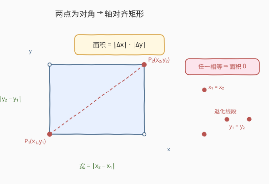
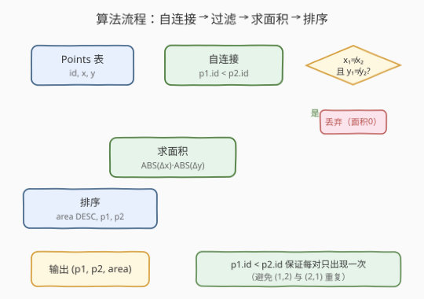
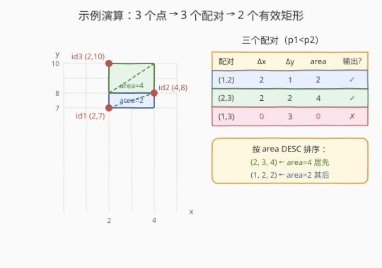

# LeetCode 矩形面积 题解

## 1. 题目概述

- **标题 / 题号**：矩形面积（#1459，medium）
- **链接**：https://leetcode.cn/problems/rectangles-area/
- **难度**：中等
- **标签**：数据库、SQL、自连接（Self-Join）、`ABS`、`JOIN` + `ON`、去重配对、LeetCode 锁题

**题意**：给定 `Points` 表，每行记录一个二维点 `(x_value, y_value)`。请编写 SQL，报告由表中**任意两点**可以形成的所有**边与坐标轴平行**且**面积不为零**的矩形。

结果每行包含三列 `(p1, p2, area)`：`p1`、`p2` 是矩形两个**对角顶点**的 `id`（且 `p1 < p2`），`area` 为矩形面积。返回结果按 `area` **降序**排列；面积相同则按 `p1` **升序**；仍相同则按 `p2` **升序**。

> 💡 **核心点**：两点只要 `x`、`y` 均不同，就唯一确定一个边与坐标轴平行的矩形（这两点恰为一组对角顶点）。题目只要求两个对角顶点来自表中，**不要求**另外两个顶点也在表中。

**表结构**：

```text
Table: Points
+---------------+---------+
| Column Name   | Type    |
+---------------+---------+
| id            | int     |  ← 主键
| x_value       | int     |  ← 横坐标
| y_value       | int     |  ← 纵坐标
+---------------+---------+
id 是该表的主键（唯一）。
```

- `Points.id` 是主键。
- 每行表示一个二维点，坐标为 `(x_value, y_value)`。
- 一个矩形由其**一组对角顶点**唯一确定（边与坐标轴平行时）。

**示例 1**：

```text
输入：
Points 表:
+----+---------+---------+
| id | x_value | y_value |
+----+---------+---------+
| 1  | 2       | 7       |
| 2  | 4       | 8       |
| 3  | 2       | 10      |
+----+---------+---------+

输出：
+----+----+------+
| p1 | p2 | area |
+----+----+------+
| 2  | 3  | 4    |
| 1  | 2  | 2    |
+----+----+------+
```

**解释**：

| 配对 (p1, p2) | 坐标 | Δx | Δy | area | 是否输出 | 原因 |
|---------------|------|----|----|------|----------|------|
| (1, 2) | (2,7) ↔ (4,8) | 2 | 1 | 2 | ✓ | x、y 均不同 |
| (2, 3) | (4,8) ↔ (2,10) | 2 | 2 | 4 | ✓ | x、y 均不同 |
| (1, 3) | (2,7) ↔ (2,10) | 0 | 3 | 0 | ✗ | x 相同 → 退化为竖直线段 |

> 💡 id=1 与 id=3 的 `x_value` 都是 2，两点在同一竖直线上，无法围出「面积不为零」的矩形，故排除。最终按 `area` 降序：`4` 在前、`2` 在后。

**约束**：

- `Points.id` 为主键。
- 结果列：`p1`、`p2`、`area`，且 `p1 < p2`。
- 排序：`area DESC`，`p1 ASC`，`p2 ASC`。
- 每个无序点对在结果中**只出现一次**（不能同时输出 `(1,2)` 和 `(2,1)`）。

## 2. 解题思路

### 2.1 暴力思路：交叉连接所有点对再事后过滤

最直白的翻译：「任意两点」⟹ 把 `Points` 跟自己**交叉连接**（CROSS JOIN），对每个点对算 `area = ABS(Δx) * ABS(Δy)`，再筛掉面积为 0 的：

```sql
SELECT p1.id AS p1, p2.id AS p2,
       ABS(p1.x_value - p2.x_value) * ABS(p1.y_value - p2.y_value) AS area
FROM Points p1 CROSS JOIN Points p2
WHERE ABS(p1.x_value - p2.x_value) * ABS(p1.y_value - p2.y_value) <> 0;
```

- **能出结果但有三个硬伤**：
  1. **重复**：`(1,2)` 与 `(2,1)` 都会产出，每个矩形被算两遍——还需再 `DISTINCT` 或加 `p1.id < p2.id`。
  2. **自身配对**：`(i,i)` 也参与连接，虽然面积必为 0 被过滤，但白白多算了 $n$ 行。
  3. **过滤代价高**：`WHERE` 里写了两次 `ABS(...)*ABS(...)`，先算乘法再判零，没有利用「只要有一个坐标相同就退化」的更早剪枝条件。

> ⚠️ 暴力的浪费在于**没在连接条件里约束配对的结构**。其实「无序配对、不重复、不含自身」可以一步用 `p1.id < p2.id` 表达；「非退化」可以用 `x₁≠x₂ AND y₁≠y₂` 在算面积之前就剪掉。把这两条前移到 `JOIN ... ON` / `WHERE`，既去重又省算。

### 2.2 核心观察：两点为对角 → 轴对齐矩形；非零 ⟺ 两坐标均不同



两个关键观察把暴力压成一条干净查询：

**观察一（两点定矩形）**：边与坐标轴平行的矩形，给定一组**对角顶点** $(x_1,y_1)$、$(x_2,y_2)$ 即唯一确定——另外两个顶点是 $(x_1,y_2)$ 和 $(x_2,y_1)$。因此「由两点形成的矩形」天然指「以这两点为对角」的矩形，面积：

$$\text{area} = |x_1 - x_2| \times |y_1 - y_2|$$

**观察二（非零充要条件）**：面积非零 $\iff$ $|x_1-x_2| > 0$ **且** $|y_1-y_2| > 0$ $\iff$ $x_1 \neq x_2$ **且** $y_1 \neq y_2$。反之只要 $x_1 = x_2$（竖直线段）或 $y_1 = y_2$（水平线段），矩形就退化为线段、面积为 0。故过滤条件不必先算乘积，直接判两坐标均不等即可。

> 💡 **一句话**：「任意两点配对」⟹ 自连接；「不重复、不含自身」⟹ `p1.id < p2.id`；「面积非零」⟹ `x₁≠x₂ AND y₁≠y₂`；面积用 `ABS` 取正。四件事各归位，查询自然成形。这是 SQL「**用连接条件表达配对约束**」的典型范式。

> ⚠️ **为何 `p1.id < p2.id` 而非 `p1.id != p2.id`**：`!=` 只排除自身配对，仍会同时产出 `(1,2)` 和 `(2,1)` 两个方向，导致重复；`<` 一次性既排除自身又只保留一个方向，是最省事的去重配对写法。

### 2.3 算法流程图



**五步流水线**：

| 步骤 | SQL 子句 | 作用 |
|------|----------|------|
| ① | `FROM Points p1 JOIN Points p2 ON p1.id < p2.id` | 自连接生成所有无序点对，`<` 保证每对只出现一次且不含自身 |
| ② | `WHERE p1.x_value != p2.x_value AND p1.y_value != p2.y_value` | 剪掉退化配对（同 x 或同 y），只留可成矩形的对 |
| ③ | `ABS(p1.x_value - p2.x_value) * ABS(p1.y_value - p2.y_value) AS area` | 算对角矩形面积，`ABS` 保证非负 |
| ④ | `ORDER BY area DESC, p1 ASC, p2 ASC` | 三键排序：面积降序，再按 p1、p2 升序 |
| ⑤ | `SELECT p1, p2, area` | 输出三列 |

> 💡 **执行顺序**：`FROM`+`JOIN` 先造点对 $\to$ `WHERE` 在算面积前剪掉退化对 $\to$ `SELECT` 算 `area` $\to$ `ORDER BY` 排序输出。把「非退化」判定前移到 `WHERE`（只比较坐标），比「先算乘积再判零」更早剪枝、也更贴合几何语义。

### 2.4 示例演算

以示例 1 的 3 个点为例，跟踪自连接 → 过滤 → 求面积 → 排序全过程：



**第 ① 步：自连接 `p1.id < p2.id` 生成 3 个无序点对**

| 配对 | p1 坐标 | p2 坐标 |
|------|---------|---------|
| (1,2) | (2,7) | (4,8) |
| (1,3) | (2,7) | (2,10) |
| (2,3) | (4,8) | (2,10) |

3 个点共 $C_3^2 = 3$ 个配对，`<` 已排除 `(2,1)`、`(3,1)`、`(3,2)` 三个反向重复及 `(i,i)` 自身。

**第 ② 步：`WHERE x₁≠x₂ AND y₁≠y₂` 过滤退化对**

| 配对 | Δx | Δy | 是否成矩形 |
|------|----|----|------------|
| (1,2) | 2 | 1 | ✓ 两坐标均不同 |
| (1,3) | 0 | 3 | ✗ Δx=0（同 x=2）→ 竖直线段 |
| (2,3) | 2 | 2 | ✓ 两坐标均不同 |

配对 (1,3) 的两点都在 `x=2` 这条竖直线上，围不出面积，被剪除。

**第 ③ 步：算面积**

- (1,2)：$|2-4| \times |7-8| = 2 \times 1 = 2$
- (2,3)：$|4-2| \times |8-10| = 2 \times 2 = 4$

**第 ④ 步：`ORDER BY area DESC, p1, p2` 排序**

| p1 | p2 | area |
|----|----|------|
| 2  | 3  | 4    |  ← area=4 居先
| 1  | 2  | 2    |  ← area=2 其后

> 💡 **守恒校验**：3 个点最多产生 $C_3^2 = 3$ 个配对，过滤后剩 2 个有效矩形，与输出行数一致 ✓。若漏写 `p1.id < p2.id`，行数会翻倍（每个矩形出两个方向）；若漏写 `WHERE`，会多出 area=0 的退化行。

## 3. 参考代码

### MySQL（解法 A：自连接 + 坐标条件过滤，推荐）

```sql
# 1459. 矩形面积
# 思路：Points 自连接（p1.id < p2.id 去重配对）→ WHERE 两坐标均不等剪退化 → ABS(Δx)*ABS(Δy) 求面积
#       → ORDER BY area DESC, p1, p2 三键排序
SELECT
    p1.id AS p1,
    p2.id AS p2,
    ABS(p1.x_value - p2.x_value) * ABS(p1.y_value - p2.y_value) AS area
FROM
    Points AS p1
    JOIN Points AS p2 ON p1.id < p2.id
WHERE
    p1.x_value != p2.x_value
    AND p1.y_value != p2.y_value
ORDER BY
    area DESC,
    p1,
    p2;
```

> 💡 **写法要点**：
> - **`JOIN Points AS p2 ON p1.id < p2.id`**：自连接的标准去重配对写法。`<` 一步到位——既排除 `(i,i)` 自身配对，又保证每个无序点对只产出一行（`(1,2)` 出、`(2,1)` 不出）。
> - **`WHERE p1.x_value != p2.x_value AND p1.y_value != p2.y_value`**：非零面积的充要条件。在算乘积之前用两次整数比较剪掉退化对，比「先算 `area` 再判 `area <> 0`」更早剪枝、语义也更清晰（直接对应几何上的「不共线」）。
> - **`ABS(...) * ABS(...)`**：两点谁在左、谁在下并不确定，差值可能为负，用 `ABS` 保证面积为正。等价写法 `ABS((x1-x2)*(y1-y2))` 也可，但两次 `ABS` 更直观。
> - **`ORDER BY area DESC, p1, p2`**：MySQL `ORDER BY` 默认 `ASC`，故 `p1`、`p2` 升序可省略 `ASC`；`area` 显式写 `DESC`。三键依次比较，保证面积相同时顺序确定。

### MySQL（解法 B：乘积非零过滤，更简短）

```sql
SELECT
    p1.id AS p1,
    p2.id AS p2,
    ABS((p1.x_value - p2.x_value) * (p1.y_value - p2.y_value)) AS area
FROM
    Points AS p1
    JOIN Points AS p2 ON p1.id < p2.id
WHERE
    (p1.x_value - p2.x_value) * (p1.y_value - p2.y_value) <> 0
ORDER BY
    area DESC,
    p1,
    p2;
```

> 💡 **解法 B 的思路**：利用「两数乘积非零 $\iff$ 两数均非零」这一代数等价，把 `x₁≠x₂ AND y₁≠y₂` 合并成 `(x₁-x₂)*(y₁-y₂) <> 0` 一个条件。过滤时无需 `ABS`（乘积的正负不影响是否为零），只在 `SELECT` 算面积时套一层 `ABS` 取正。
> - **与解法 A 的区别**：A 显式写两个坐标比较，几何语义直白（「不共竖线、不共水平线」），面试讲思路更顺；B 用乘积非零一行搞定，代码更短。两者结果完全一致。
> - **⚠️ 溢出提示**：`(x₁-x₂)*(y₁-y₂)` 是两差之积，若坐标值很大可能溢出 `INT`。本题数据量小、值域有限不会触发；生产环境若坐标可达 $10^9$ 量级，建议改用解法 A 的两次独立比较，避免中间乘积溢出。

### Python（pandas）

```python
import pandas as pd


def rectangles_area(points: pd.DataFrame) -> pd.DataFrame:
    p1 = points.rename(columns={"id": "p1", "x_value": "x1", "y_value": "y1"})
    p2 = points.rename(columns={"id": "p2", "x_value": "x2", "y_value": "y2"})
    pairs = p1.merge(p2, how="cross")                       # ① 交叉连接造所有点对
    pairs = pairs[pairs["p1"] < pairs["p2"]]                # ② 去重：只留 p1<p2
    pairs = pairs[(pairs["x1"] != pairs["x2"])              # ③ 剪退化：x、y 均不等
                  & (pairs["y1"] != pairs["y2"])]
    pairs["area"] = (pairs["x1"] - pairs["x2"]).abs() * (pairs["y1"] - pairs["y2"]).abs()
    return (pairs[["p1", "p2", "area"]]
            .sort_values(["area", "p1", "p2"], ascending=[False, True, True])
            .reset_index(drop=True))
```

> 💡 **pandas 对照**：
> - `merge(how="cross")` 对应 SQL 的 `CROSS JOIN`（笛卡尔积），生成全部 $n^2$ 个点对。
> - `pairs["p1"] < pairs["p2"]` 对应 `ON p1.id < p2.id`——pandas 没有连接内过滤，故先全连接再布尔索引筛。
> - `(x1!=x2) & (y1!=y2)` 对应 `WHERE` 两坐标均不等。
> - `.abs()` 对应 `ABS()`；`sort_values([...], ascending=[False, True, True])` 对应 `ORDER BY area DESC, p1, p2`——`ascending` 列表与列名一一对应，`False` 即降序。

## 4. 复杂度分析

| 维度 | 解法 A（坐标条件过滤） | 解法 B（乘积非零过滤） | pandas |
|------|------------------------|------------------------|--------|
| **时间** | $O(n^2 \log n)$ | $O(n^2 \log n)$ | $O(n^2 \log n)$ |
| **空间** | $O(n^2)$（中间点对） | $O(n^2)$ | $O(n^2)$（笛卡尔积物化） |
| **过滤时机** | 算面积前（坐标比较） | 算面积时（乘积判零） | 算面积前 |
| **可读性** | ✓ 几何语义直白 | △ 代数技巧 | ✓ 与 SQL 同构 |
| **推荐度** | ✓ **首选** | △ 简短但有溢出隐患 | ✓ 面试口述 |

- $n$ = `Points` 表行数。
- **自连接**：`p1.id < p2.id` 产出 $C_n^2 = \dfrac{n(n-1)}{2}$ 个点对，即 $O(n^2)$ 行，这是问题的固有代价——「输出所有矩形」本身就要求枚举所有点对，无法低于 $O(n^2)$。
- **过滤**：`WHERE` 对每个点对做 $O(1)$ 比较，整体 $O(n^2)$。
- **排序**：最坏情况下所有点对都成矩形（任意两点 x、y 均不同），需排序 $O(n^2)$ 行，代价 $O(n^2 \log n)$，是本题的主导项。
- **空间**：中间结果集与排序缓冲均为 $O(n^2)$。

> ⚠️ 本题数据量小（示例级），任何正确写法都能秒过。复杂度的价值在于**认清 $O(n^2)$ 是输出规模决定的下界**：若题目改为「只求最大面积的矩形」或「最近距离」，则可用排序 + 扫描 / 分治降到 $O(n \log n)$，不必输出全部配对——这正是 [612. 平面上的最近距离](https://leetcode.cn/problems/shortest-distance-in-a-plane/) 的方向。

## 5. 扩展：自连接造配对的范式与变体

### 5.1 「同表自连接 + 不等号去重」通用模板

凡「从一张表里取**无序两点对**」的 SQL 题，都套同一模板：

```sql
SELECT t1.id AS a, t2.id AS b, <由两行派生的量>
FROM T t1 JOIN T t2 ON t1.id < t2.id   -- ← 关键：'<', 不是 '!='
WHERE <配对需满足的条件>;
```

> 💡 **为何是 `<` 而非 `!=`**：`!=` 只去掉自身配对 `(i,i)`，但 `(1,2)` 和 `(2,1)` 都会留下，结果翻倍还需 `DISTINCT`；`<` 一步同时去掉自身和反向重复，是最省事的去重配对算子。可记作「**取无序对，左小右大**」。

### 5.2 另外两个顶点是否需要在表中？

本题只要求**两个对角顶点**来自 `Points`，另外两个顶点 $(x_1,y_2)$、$(x_2,y_1)$ **不必**在表中——题目问的是「两点能形成的矩形」，不是「四个顶点都在表中的矩形」。

若题目改问「四个顶点都在表中的矩形」，则需在过滤里再加两条存在性判定：

```sql
-- 进阶变体：要求另外两个顶点也在 Points 中
WHERE p1.x_value != p2.x_value AND p1.y_value != p2.y_value
  AND EXISTS (SELECT 1 FROM Points p3
              WHERE p3.x_value = p1.x_value AND p3.y_value = p2.y_value)
  AND EXISTS (SELECT 1 FROM Points p3
              WHERE p3.x_value = p2.x_value AND p3.y_value = p1.y_value);
```

这是「枚举对 + 存在性校验」的二维版本，与 [603. 连续空余座位](https://leetcode.cn/problems/consecutive-available-seats/)（一维相邻存在性）思路同构。

### 5.3 「全量输出」vs「聚合最值」——自连接的两种形态

同样是「点表自连接求几何量」，目标不同则复杂度天差地别：

| 形态 | 代表题 | 目标 | 复杂度 |
|------|--------|------|--------|
| 全量输出 | **本题 1459** | 列出所有矩形 | $O(n^2)$（输出规模即下界） |
| 聚合最值 | [612. 平面上的最近距离](https://leetcode.cn/problems/shortest-distance-in-a-plane/) | 求 $\min$ 距离 | SQL 仍 $O(n^2)$，但算法层面可 $O(n\log n)$ |

> 💡 SQL 层面两者都是自连接 $O(n^2)$；但「全量输出」必须 $O(n^2)$（结果就这么大），「聚合最值」在工程上可用分治 / k-d tree 降到 $O(n\log n)$。面试若被问「点很多怎么办」，本题答「输出规模本身就是 $O(n^2)$，无法避免」；最近距离题答「换索引结构降维」。

### 5.4 `ABS` 与排序方向速查

| 场景 | 写法 | 说明 |
|------|------|------|
| 面积 / 距离取正 | `ABS(a - b)` | 两点先后序不确定，差值可负 |
| 多键排序 | `ORDER BY k1 DESC, k2, k3` | MySQL 默认 `ASC`，升序可省 |
| 降序中「NULL 在前/后」 | `ORDER BY col IS NULL, col DESC` | 控制空值位置 |

## 6. 面试要点

1. **为什么两个点就能确定一个边与坐标轴平行的矩形？**

   > 边与坐标轴平行的矩形，其四条边分别属于两条竖直线和两条水平线。给定一组对角顶点 $(x_1,y_1)$、$(x_2,y_2)$，就唯一确定了这两条竖线（$x=x_1$、$x=x_2$）和两条水平线（$y=y_1$、$y=y_2$），它们的四个交点即矩形四顶点。故「两点形成的矩形」就是以这两点为对角的矩形。

2. **非零面积的充要条件为什么是 `x₁≠x₂ 且 y₁≠y₂`？**

   > 面积 $=|x_1-x_2| \times |y_1-y_2|$，乘积非零当且仅当两因子均非零，即 $x_1 \neq x_2$ 且 $y_1 \neq y_2$。若 $x_1=x_2$，两点共竖线、矩形退化为竖直线段；若 $y_1=y_2$，共水平线、退化为水平线段；两种情况面积都是 0，需排除。

3. **为什么用 `p1.id < p2.id` 而不是 `p1.id != p2.id`？**

   > 题目要求每个无序点对只出现一次。`!=` 仅排除自身配对 `(i,i)`，但 `(1,2)` 和 `(2,1)` 都会产出，结果翻倍还要 `DISTINCT`。`<` 一步到位：既排除自身配对，又只保留 `id` 小的在前的一个方向，天然去重。这是「取无序对，左小右大」的标准写法。

4. **面积为什么要用 `ABS`？排序方向怎么写？**

   > 自连接时 `p1`、`p2` 谁在左、谁在下并不确定，`x_value` 之差可正可负；面积必须非负，故用 `ABS`。排序用 `ORDER BY area DESC, p1, p2`：`area` 显式 `DESC` 降序，`p1`、`p2` 升序（MySQL 默认 `ASC` 可省）。三键依次比较保证面积相同时顺序确定。

5. **用 `area <> 0` 过滤和用 `x≠x AND y≠y` 过滤有区别吗？**

   > 结果完全一致——乘积非零 $\iff$ 两因子均非零。但 `x≠x AND y≠y` 把判定前移到算面积之前，只做两次整数比较，几何语义直白（不共竖线、不共水平线）；`area <> 0` 要先算乘积再判零。另外 `(x₁-x₂)*(y₁-y₂) <> 0` 的写法在大坐标值下有中间乘积溢出风险，两次独立比较更安全。面试推荐前者。

6. **如果 `Points` 有 10 万行，还能这么写吗？**

   > 本题「输出所有矩形」的规模本身就是 $O(n^2)$，最坏情况（任意两点 x、y 均不同）下会产出约 $5 \times 10^9$ 行——不可能全输出。故应先与面试官确认需求：若只要「最大面积的矩形」，可加 `ORDER BY area DESC LIMIT 1` 并在 `(x_value, y_value)` 建索引辅助；若要统计矩形数量，可用按 x、y 分组的组合计数 $O(n)$ 算出，避免物化全部点对。本质是认清 $O(n^2)$ 由「全量输出」决定，换目标即可降阶。

> 💡 **一句话总结**：1459 是 SQL「**同表自连接造无序点对**」的几何版招牌题——`JOIN ON p1.id < p2.id` 去重配对、`WHERE x≠x AND y≠y` 剪退化、`ABS(Δx)*ABS(Δy)` 求面积、`ORDER BY area DESC, p1, p2` 三键排序。记住「取无序对左小右大」+「非零面积 $\iff$ 两坐标均不等」两点，所有「点表两两配对求几何量」类题都能套用。

## 同类练习题

| # | 题目 | 与本题的关联 |
|---|------|-------------|
| 612 | [平面上的最近距离 🔒](https://leetcode.cn/problems/shortest-distance-in-a-plane/) | 同为「点表自连接求几何量」，但求 `MIN(欧氏距离)` 而非枚举全部——对照 1459 理解「聚合最值」与「全量输出」两种自连接形态 |
| 613 | [直线上的最近距离 🔒](https://leetcode.cn/problems/shortest-distance-in-a-line/) | 一维点表自连接 + `ABS(Δx)` + `MIN`——1459 退化到一维、且只取最小值的近邻版 |
| 180 | [连续出现的数字](../0101-0200/180_连续出现的数字.md) | 同表自连接（三路）找「连续 3 行相同」——对照 1459 体会「自连接造配对」这一 SQL 招式在不同语义下的应用 |
| 197 | [上升的温度](../0101-0200/197_上升的温度.md) | Weather 表自连接 + `DATEDIFF` 找「比昨天温度高」——同表自连接 + 差值比较的入门题，1459 的 `ABS(Δ)` 比较原型 |
