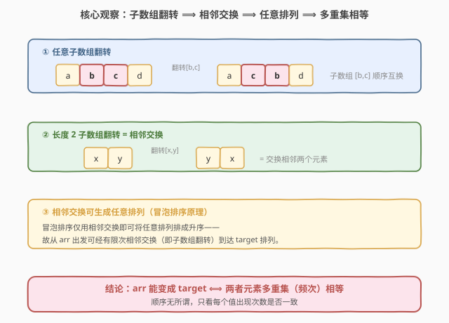
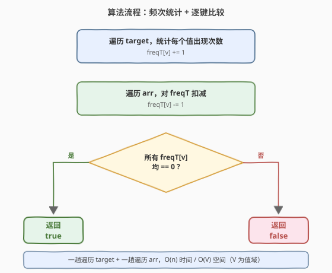
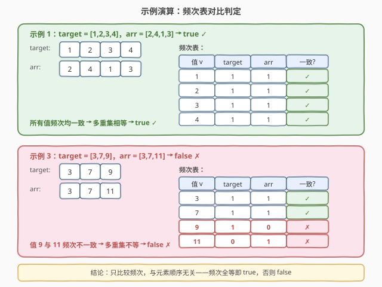

# LeetCode 通过翻转子数组使两个数组相等 题解

## 1. 题目概述

- **标题 / 题号**：通过翻转子数组使两个数组相等（#1460，easy）
- **链接**：https://leetcode.cn/problems/make-two-arrays-equal-by-reversing-subarrays/
- **难度**：简单
- **标签**：数组、哈希表、排序

**题意**：给你两个长度相同的整数数组 `target` 和 `arr`。每一步中，你可以选择 `arr` 的任意**非空子数组**并将它翻转。你可以执行此过程任意次。如果你能让 `arr` 变得与 `target` 相同，返回 `true`；否则返回 `false`。

**示例 1**：

```text
输入：target = [1,2,3,4], arr = [2,4,1,3]
输出：true
解释：你可以按照如下步骤使 arr 变成 target：
1- 翻转子数组 [2,4,1] ，arr 变成 [1,4,2,3]
2- 翻转子数组 [4,2] ，arr 变成 [1,2,4,3]
3- 翻转子数组 [4,3] ，arr 变成 [1,2,3,4]
```

**示例 2**：

```text
输入：target = [7], arr = [7]
输出：true
解释：arr 不需要做任何翻转已经与 target 相等。
```

**示例 3**：

```text
输入：target = [3,7,9], arr = [3,7,11]
输出：false
解释：arr 没有数字 9 ，所以无论如何也无法变成 target 。
```

**约束**：

- `target.length == arr.length`
- $1 \le \text{target.length} \le 1000$
- $1 \le \text{target[i]} \le 1000$
- $1 \le \text{arr[i]} \le 1000$

> 💡 **关键点**：允许翻转**任意非空子数组**且次数不限——这是一个极强的操作。直觉上"翻转"似乎只能改变局部顺序，但因为可以无限次执行，它的实际能力远超字面：**等价于可以重排为任意排列**。于是问题从"模拟翻转过程"瞬间塌缩为"两数组元素多重集是否相等"。

## 2. 解题思路

### 2.1 暴力思路：模拟翻转

最直白的做法是 BFS/DFS 搜索所有可达状态：从 `arr` 出发，每步枚举所有 $O(n^2)$ 个子数组翻转，看能否到达 `target`。

- **正确**：穷举所有可达排列，理论上能找到答案；
- **效率**：状态空间为 $n!$ 个排列（$n$ 个元素的全排列），$n=1000$ 时完全不可行；
- **不可取**：必须发现"翻转能力 = 任意排列"这一性质来降维。

> ⚠️ 本题的精髓不在"如何模拟翻转"，而在**洞察翻转操作的等价能力**——一旦证明"翻转 ⟺ 任意排列"，问题立刻化为频次比较，$O(n)$ 解决。

### 2.2 核心观察：翻转 ⟺ 相邻交换 ⟺ 任意排列 ⟹ 多重集相等



把"任意子数组翻转"的能力逐层放大：

**第一层：长度 2 子数组翻转 = 相邻交换。** 翻转长度为 2 的子数组 `[x, y]` 得到 `[y, x]`，这恰好就是交换两个相邻元素。由于题目允许任意非空子数组（长度 2 也是合法子数组），所以**相邻交换是翻转的特例**——翻转能力 ⊇ 相邻交换能力。

**第二层：相邻交换可生成任意排列（冒泡排序原理）。** 冒泡排序仅用相邻交换就能把任意排列排成升序——这意味着从任意一个排列出发，都能通过有限次相邻交换到达任意另一个排列。换言之，相邻交换的可达关系是全体排列上的**全连通关系**。

**第三层：结论。** 既然"翻转 ⊇ 相邻交换"且"相邻交换可到任意排列"，那么从 `arr` 出发经有限次翻转可到达 `target` 当且仅当 `arr` 与 `target` 是**同一组元素的两个排列**——即两者的**元素多重集（每个值的出现次数）相等**。

$$\text{arr 可变成 target} \iff \text{multiset}(\text{arr}) = \text{multiset}(\text{target})$$

> 💡 **一句话**：顺序无所谓，只看每个值出现次数是否一致。频次相等 ⟹ 必有解；频次不等 ⟹ 必无解（元素都不一样，怎么翻都凑不出对方缺的值）。

> ⚠️ **必要性**（频次不等则无解）是平凡的：翻转不改变元素多重集，故若 `arr` 与 `target` 多重集不等，永远不可能相等。**充分性**（频次等则有解）靠的就是上面的相邻交换连通性论证。

### 2.3 算法流程图



**完整步骤**：

1. **统计 `target` 频次**：用哈希表/数组 `freq` 记录 `target` 中每个值的出现次数，`freq[v] += 1`；
2. **遍历 `arr` 扣减**：对 `arr` 中每个值 `v`，执行 `freq[v] -= 1`；
3. **判定归零**：若所有 `freq[v]` 均为 `0`（即 `arr` 恰好把 `target` 的每个值都消耗完），返回 `true`；否则（出现某个值频次为负说明 `arr` 多了该值，或为正说明 `arr` 缺了该值）返回 `false`。

> 💡 **等价写法**：也可分别统计两数组频次表再逐键比较；或直接对两数组排序后逐位比较——三种写法等价，下文给出频次扣减与排序两种代码。

### 2.4 示例演算

以示例 1（频次全等 → `true`）与示例 3（频次不等 → `false`）演算：



**示例 1**（`target = [1,2,3,4]`，`arr = [2,4,1,3]`）：

| 值 $v$ | target 频次 | arr 频次 | 一致? |
|--------|-------------|----------|-------|
| 1 | 1 | 1 | ✓ |
| 2 | 1 | 1 | ✓ |
| 3 | 1 | 1 | ✓ |
| 4 | 1 | 1 | ✓ |

所有值频次均一致 ⟹ 多重集相等 ⟹ `true` ✓。`arr` 的 `[2,4,1,3]` 只是 `target` 的一个重排，必能通过翻转还原。

**示例 3**（`target = [3,7,9]`，`arr = [3,7,11]`）：

| 值 $v$ | target 频次 | arr 频次 | 一致? |
|--------|-------------|----------|-------|
| 3 | 1 | 1 | ✓ |
| 7 | 1 | 1 | ✓ |
| 9 | 1 | 0 | ✗ |
| 11 | 0 | 1 | ✗ |

值 `9` 与 `11` 频次不一致（`target` 有 `9` 无 `11`，`arr` 有 `11` 无 `9`）⟹ 多重集不等 ⟹ `false` ✗。`arr` 缺了 `9`、多了 `11`，无论怎么翻转都无法凭空变出 `9`。

> 以示例 2 `[7]`,`[7]` 验证：频次表 `{7:1}` 与 `{7:1}` 全等 ⟹ `true` ✓（无需翻转）。

## 3. 参考代码

### C++（频次数组，值域 $[1,1000]$）

```cpp
class Solution {
public:
    bool canBeEqual(vector<int>& target, vector<int>& arr) {
        int freq[1001] = {0};
        for (int v : target) freq[v]++;
        for (int v : arr)    freq[v]--;
        for (int v : target) if (freq[v] != 0) return false;
        return true;
    }
};
```

### C++（排序写法）

```cpp
class Solution {
public:
    bool canBeEqual(vector<int>& target, vector<int>& arr) {
        sort(target.begin(), target.end());
        sort(arr.begin(), arr.end());
        return target == arr;
    }
};
```

### Python（Counter 频次比较）

```python
from collections import Counter

class Solution:
    def canBeEqual(self, target: List[int], arr: List[int]) -> bool:
        return Counter(target) == Counter(arr)
```

### Python（排序写法）

```python
class Solution:
    def canBeEqual(self, target: List[int], arr: List[int]) -> bool:
        return sorted(target) == sorted(arr)
```

> 💡 **实现要点**：① 值域 $[1,1000]$ 小，C++ 用定长数组 `freq[1001]` 比哈希表更快；② 频次扣减后只需检查是否全零——遍历 `target` 的键即可，无需扫全值域；③ Python 一行 `Counter == Counter` 最简洁，底层即哈希表逐键比较；④ 排序写法 $O(n \log n)$ 略慢但代码极简，$n \le 1000$ 下完全够用。

## 4. 复杂度分析

| 维度 | 频次统计 $O(n)$（推荐） | 排序 $O(n \log n)$ |
|------|------------------------|----------------------|
| **时间复杂度** | $O(n)$ | $O(n \log n)$ |
| **空间复杂度** | $O(V)$（值域数组）或 $O(n)$（哈希表） | $O(\log n)$（排序栈，原地排序） |
| **实现难度** | 低 | 极低 |
| **适用场景** | 值域较小或需 $O(n)$ | 通用、代码最简 |

- **频次统计**：两趟遍历各 $O(n)$，查零 $O(n)$，合计 $O(n)$；值域 $V \le 1000$ 时用定长数组空间 $O(V)$，值域无界时用哈希表空间 $O(n)$。是本题最优解。
- **排序**：两数组各排序 $O(n \log n)$，比较 $O(n)$，合计 $O(n \log n)$；原地排序额外空间 $O(\log n)$。$n \le 1000$ 下与频次法实际耗时差异可忽略，代码更短。

> ⚠️ 频次法是渐近最优——至少要读入 $n$ 个元素，下界 $O(n)$。排序法多一个 $\log$ 因子，但常数小、写法短，是面试中可接受的等价解。

## 5. 扩展：值域无界时的哈希表写法

本题值域 $[1,1000]$ 较小，定长数组即可。若值域放大到 $[1, 10^9]$（如变体题），定长数组不可行，需用哈希表：

```cpp
class Solution {
public:
    bool canBeEqual(vector<int>& target, vector<int>& arr) {
        unordered_map<int, int> freq;
        for (int v : target) freq[v]++;
        for (int v : arr)    freq[v]--;
        for (auto& [v, c] : freq) if (c != 0) return false;
        return true;
    }
};
```

- **时间**：期望 $O(n)$（哈希表均摊 $O(1)$ 插入/查找）；
- **空间**：$O(n)$（哈希表存所有出现过的值）。

> 💡 **何时用哈希表 vs 定长数组**：值域有界且不大（如 $\le 10^6$）优先定长数组——常数小、无哈希开销；值域无界或稀疏时用哈希表。两种写法的**算法本质完全相同**：统计频次后比较，只是底层容器不同。

## 6. 面试要点

1. **为什么"任意子数组翻转"等价于"可重排为任意排列"？**

   > 分两步：① 翻转长度 2 子数组 = 相邻交换（翻转的特例）；② 冒泡排序仅用相邻交换就能排任意排列（相邻交换的连通性）。故翻转能力 ⊇ 相邻交换能力 ⊇ 任意排列能力。反之翻转不改变元素多重集，所以"可达任意排列"已是翻转能力的上界——二者等价。

2. **频次不等时为什么一定无解？**

   > 翻转操作只改变元素顺序，不增删元素，故 `arr` 的元素多重集在任意次翻转后保持不变。若 `target` 与 `arr` 多重集不等，`arr` 永远变不出 `target` 缺少的元素，也不可能消除自身多余的元素。必要性是"翻转保多重集"的直接推论。

3. **频次法和排序法哪个更优？**

   > 渐近上频次法 $O(n)$ 优于排序法 $O(n \log n)$。但 $n \le 1000$ 时两者实际耗时差异极小，排序法代码更短、更不易出错。面试中可先给排序法说明思路，再优化到频次法展示对值域的敏感度。值域无界时只能用哈希表频次法或排序法。

4. **如果题目改成"只能翻转长度恰好为 $k$ 的子数组"，结论还成立吗？**

   > 不一定。当 $k=2$ 时仍等价于相邻交换，结论成立（任意排列可达）；但当 $k$ 为其他值时，可达的排列集合可能受限，不再是全体排列。例如 $k$ 为偶数时可能只能生成偶置换（保持奇偶性），需用群论分析。本题关键在于"任意非空子数组"覆盖了 $k=2$ 这一关键特例。

5. **能否不统计频次，直接用异或判定？**

   > 不能。异或所有元素相等只能说明"两数组异或和相同"，但无法区分频次差异——例如 `[1,2,3]` 与 `[1,1,1]` 的异或和可能相同但频次显然不同。异或只对"每个元素恰好出现两次"类问题有效（如 [136. 只出现一次的数字](../0101-0200/136_只出现一次的数字.md)），本题频次可能任意，必须用计数。

> 💡 **一句话总结**：1460 的灵魂是"**翻转 ⟺ 任意排列 ⟹ 多重集相等**"——把强操作的能力放大到上界，问题从"模拟搜索"塌缩为"频次比较"，$O(n)$/$O(V)$ 即解。

## 同类练习题

| # | 题目 | 与本题的关联 |
|---|------|-------------|
| 242 | [有效的字母异位词](https://leetcode.cn/problems/valid-anagram/)（[题解](../0201-0300/242_有效的字母异位词.md)） | 同样是"两对象元素多重集是否相等"——只是从整数数组换成字符频次表，与 1460 的频次法完全同构（`Counter(s) == Counter(t)`） |
| 350 | [两个数组的交集 II](https://leetcode.cn/problems/intersection-of-two-arrays-ii/)（[题解](../0301-0400/350_两个数组的交集II.md)） | 频次表取交集——两数组各统计频次后按 `min(freqA[v], freqB[v])` 输出，与 1460 频次比较同源（1460 是判全等、350 是取交集） |
| 383 | [赎金信](https://leetcode.cn/problems/ransom-note/)（[题解](../0301-0400/383_赎金信.md)） | 频次扣减判定——`magazine` 的频次表能否覆盖 `ransomNote` 的需求，与 1460 的"遍历 arr 扣减 freq"同一模板（383 判 `freq[v] >= 0`、1460 判 `freq[v] == 0`） |
| 136 | [只出现一次的数字](https://leetcode.cn/problems/single-number/)（[题解](../0101-0200/136_只出现一次的数字.md)） | 异或求唯一落单元素——对照 1460 面试要点 5，说明异或只适用于"其余元素成对出现"的特殊频次结构，1460 的任意频次必须用计数 |
| 268 | [丢失的数字](https://leetcode.cn/problems/missing-number/)（[题解](../0201-0300/268_丢失的数字.md)） | 等差数列缺一元素——可用求和/异或/排序多种解法，与 1460 同属"数组元素集合判定"族，但 268 利用等差结构有更巧的 $O(1)$ 空间解 |
