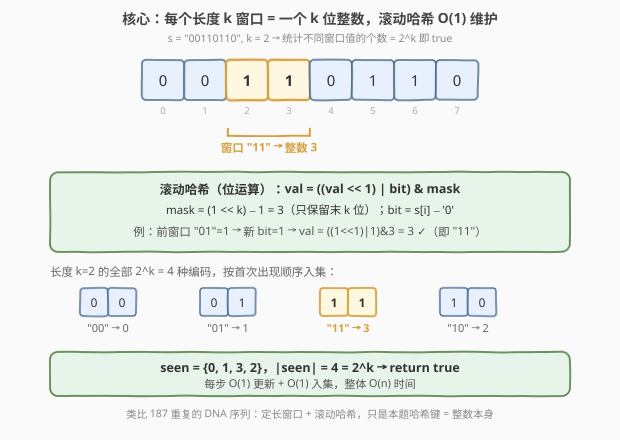
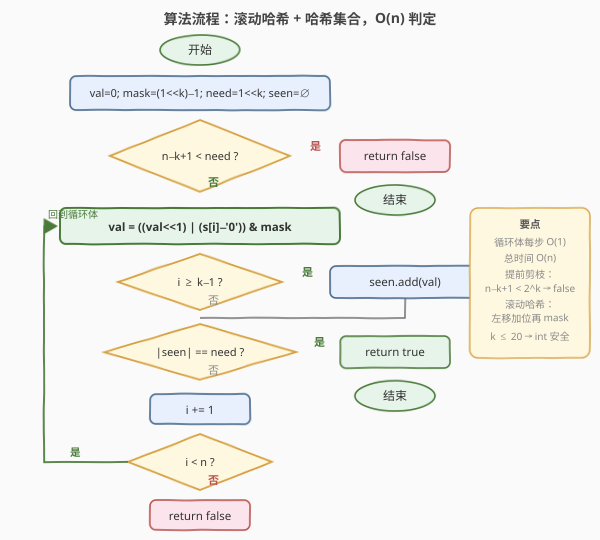
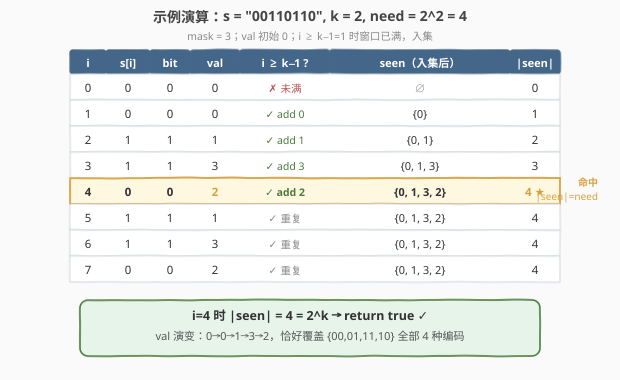

# 检查一个字符串是否包含所有长度为 K 的二进制子串

- **题目名称**：检查一个字符串是否包含所有长度为 K 的二进制子串
- **链接**：[1461. 检查一个字符串是否包含所有长度为 K 的二进制子串](https://leetcode.cn/problems/check-if-a-string-contains-all-binary-codes-of-size-k/)
- **难度**：中等
- **标签**：字符串、位运算、滑动窗口、哈希集合、滚动哈希

## 1. 题目概述

给定一个二进制字符串 `s` 和一个整数 `k`。如果**所有**长度为 $k$ 的二进制字符串都是 `s` 的子串，返回 `true`，否则返回 `false`。

> ⚠️ 审题关键：长度为 $k$ 的二进制串共有 $2^k$ 种（从 $00\cdots0$ 到 $11\cdots1$）。题目要求这 $2^k$ 种**全部**出现在 `s` 中——是一个「**全覆盖**」判定，而非「存在某一个」。

**示例 1**：

```text
输入：s = "00110110", k = 2
输出：true
解释：长度为 2 的二进制串包括 "00"，"01"，"10" 和 "11"。
      它们分别是 s 中下标为 0，1，3，2 开始的长度为 2 的子串。
```

**示例 2**：

```text
输入：s = "0110", k = 1
输出：true
解释：长度为 1 的二进制串包括 "0" 和 "1"，显然它们都是 s 的子串。
```

**示例 3**：

```text
输入：s = "0110", k = 2
输出：false
解释：长度为 2 的二进制串 "00" 没有出现在 s 中。
```

**约束条件**：

- $1 \le \text{s.length} \le 5 \times 10^5$
- `s[i]` 不是 `'0'` 就是 `'1'`
- $1 \le k \le 20$

> 💡 **关键点**：$k \le 20$ 意味着 $2^k \le 2^{20} \approx 10^6$，而 $s$ 长度可达 $5 \times 10^5$。每个长度 $k$ 的窗口天然对应一个 $k$ 位整数（值域 $[0, 2^k)$），用**滚动哈希** $O(1)$ 维护窗口值、**哈希集合**去重，最后比较集合大小是否等于 $2^k$ 即可。

---

## 2. 解题思路

### 2.1 暴力思路：枚举所有长度 k 子串入集

最直白的做法：枚举 `s` 中所有 $n - k + 1$ 个长度为 $k$ 的子串，逐个加入哈希集合，最后检查集合大小是否等于 $2^k$。

- **正确**：集合自动去重，大小恰为「出现过的不同子串数」。
- **低效**：每个子串提取 + 哈希需 $O(k)$（拷贝 $k$ 个字符再哈希），总计 $O(n \cdot k)$。当 $n = 5 \times 10^5$、$k = 20$ 时约 $10^7$ 次字符操作，常数偏大。

> ⚠️ 暴力的浪费在于：**相邻窗口高度重叠**——$s[i..i+k-1]$ 与 $s[i+1..i+k]$ 只差首尾两个字符，却每次从头哈希整段。需要一种方式**只看新进入窗口的那一位**就更新窗口的「指纹」——这正是滚动哈希。

### 2.2 核心观察：滚动哈希（位运算）+ 哈希集合



两个观察把单步代价降到 $O(1)$：

**观察一（二进制串即整数）**：`s` 只含 `0`/`1`，每个长度 $k$ 的窗口恰好是一个 $k$ 位二进制数，值域 $[0, 2^k)$。无需字符串哈希，**整数本身就是完美哈希键**——无碰撞、$O(1)$ 比较。

**观察二（窗口值可滚动递推）**：设当前窗口 $s[i-k+1..i]$ 的值为 `val`。当窗口右移一格（吃进 `s[i+1]`、吐出 `s[i-k+1]`）时，新值只依赖旧 `val` 与新位 `bit`：

$$\text{val}_{\text{new}} = \big((\text{val}_{\text{old}} \ll 1) \;\mid\; \text{bit}\big) \;\&\; \text{mask}, \quad \text{mask} = (1 \ll k) - 1$$

- `val << 1` 把旧值整体左移一位（最高位被挤出 $k$ 位范围）；
- `| bit` 把新进入的字符作为最低位塞入；
- `& mask` 截断到末 $k$ 位，丢弃溢出的最高位（即被窗口吐出的那位）。

三步合一，单次 $O(1)$。这与 [187. 重复的 DNA 序列](../0101-0200/187_重复的DNA序列.md) 的 2-bit 滚动哈希同源——只是 187 用 2 位编码一个碱基（4 种），而本题每个字符就是 1 位，更直接。

> 💡 **一句话**：维护一个滚动整数 `val` 和一个哈希集合 `seen`。每读一个字符就 $O(1)$ 更新 `val`，窗口满（$i \ge k-1$）后把 `val` 入集；扫完比较 $|\text{seen}|$ 与 $2^k$。

> ⚠️ **提前剪枝**：若 $n - k + 1 < 2^k$，即窗口数都不够目标编码数，必然无法全覆盖，直接返回 `false`。例如示例 3：$n=4, k=2$，窗口数 $3 < 4 = 2^k$，立刻 `false`（"00" 缺失）。这一剪枝在 $k$ 较大时尤其有效——$k=20$ 时 $2^k \approx 10^6$，而 $n \le 5\times10^5$，绝大多数大 $k$ 用例在此一步即结束。

### 2.3 算法流程图



**完整步骤**：

1. **初始化** `val = 0`，`mask = (1 << k) - 1`，`need = 1 << k`，`seen = ∅`；
2. **提前剪枝**：若 $n - k + 1 < \text{need}$，返回 `false`；
3. **遍历** `i` 从 $0$ 到 $n-1$：
   - `bit = s[i] - '0'`；
   - `val = ((val << 1) | bit) & mask`（滚动更新）；
   - 若 $i \ge k - 1$（窗口已满）：`seen.add(val)`；
   - 若 $|\text{seen}| == \text{need}$：提前返回 `true`；
4. **遍历结束**仍未集齐，返回 `false`。

> 💡 第 3 步的「$|\text{seen}| == \text{need}$ 即返回」是另一个提前出口：一旦集齐就不必再扫。最坏情况（差一种编码）需扫完整串，但平均能省下不少。

### 2.4 示例演算

以示例 1 的 `s = "00110110", k = 2` 为例（`mask = 3`，`need = 4`）：



| 步 $i$ | $s[i]$ | bit | `val`（更新后） | $i \ge k-1$? | `seen`（入集后） | $|\text{seen}|$ |
|--------|--------|-----|------|--------------|-----------------|----------------|
| 0 | 0 | 0 | `((0<<1)\|0)&3 = 0` | ✗（$i=0<1$） | ∅ | 0 |
| 1 | 0 | 0 | `((0<<1)\|0)&3 = 0` | ✓ add 0 | {0} | 1 |
| 2 | 1 | 1 | `((0<<1)\|1)&3 = 1` | ✓ add 1 | {0, 1} | 2 |
| 3 | 1 | 1 | `((1<<1)\|1)&3 = 3` | ✓ add 3 | {0, 1, 3} | 3 |
| 4 | 0 | 0 | `((3<<1)\|0)&3 = 2` | ✓ add 2 | {0, 1, 3, 2} | **4 ★** |
| 5 | 1 | 1 | `((2<<1)\|1)&3 = 1` | ✓ 重复 | {0, 1, 3, 2} | 4 |
| 6 | 1 | 1 | `((1<<1)\|1)&3 = 3` | ✓ 重复 | {0, 1, 3, 2} | 4 |
| 7 | 0 | 0 | `((3<<1)\|0)&3 = 2` | ✓ 重复 | {0, 1, 3, 2} | 4 |

- **第 4 步是关键**：`val` 从 3（"11"）滚动到 2（"10"），集合补齐最后一种编码，$|\text{seen}|$ 达到 4 = `need`，此时即可返回 `true`（后续 5–7 步全为重复，仅作完整性展示）。
- **`val` 的演变** `0→0→1→3→2` 恰好对应窗口 "00"→"00"→"01"→"11"→"10"，第 4 步首次出现 "10"。

> 💡 注意第 0 步：虽然 `val` 已被更新为 0，但此时窗口只有 1 个字符（$i=0 < k-1=1$），尚未满 $k$ 位，不能入集。入集条件 $i \ge k-1$ 保证了只统计完整窗口。

---

## 3. 参考代码

### C++

```cpp
// 检查一个字符串是否包含所有长度为 K 的二进制子串.cpp —— 滚动哈希 + 哈希集合，O(n)
// 编译: g++ -O2 -std=c++17 检查一个字符串是否包含所有长度为K的二进制子串.cpp -o lcd
#include <string>
#include <unordered_set>
using namespace std;

class Solution {
  public:
    bool hasAllCodes(string s, int k) {
        int n = s.size();
        int need = 1 << k;            // 需要覆盖的编码总数 2^k
        if (n - k + 1 < need) return false;   // 窗口数不足，提前剪枝

        unordered_set<int> seen;
        seen.reserve(need);           // 预分配，避免 rehash

        int val = 0, mask = need - 1; // mask = (1<<k)-1，截断到末 k 位
        for (int i = 0; i < n; ++i) {
            val = ((val << 1) | (s[i] - '0')) & mask;
            if (i >= k - 1) {
                seen.insert(val);
                if ((int)seen.size() == need) return true;   // 集齐即返回
            }
        }
        return false;
    }
};
```

### Python

```python
class Solution:
    def hasAllCodes(self, s: str, k: int) -> bool:
        n = len(s)
        need = 1 << k              # 2^k
        if n - k + 1 < need:       # 窗口数不足，提前剪枝
            return False

        seen = set()
        val = 0
        mask = need - 1            # (1<<k) - 1
        for i, ch in enumerate(s):
            val = ((val << 1) | (ord(ch) - 48)) & mask
            if i >= k - 1:
                seen.add(val)
                if len(seen) == need:
                    return True    # 集齐即返回
        return False
```

> 💡 **实现要点**：① `mask = (1 << k) - 1` 与 `need = 1 << k` 共享一次移位，`mask = need - 1`；② 入集条件 `i >= k - 1` 保证只统计满 $k$ 位的窗口——前 $k-1$ 步仅预热 `val`，不入集；③ `seen.reserve(need)`（C++）预分配桶数，避免中途 rehash 抖动；④ 两个提前出口：开头「窗口数不足」+ 循环内「集齐即返回」，平均大幅提速。

---

## 4. 复杂度分析

| 维度 | 复杂度 | 说明 |
|------|--------|------|
| **时间复杂度** | $O(n)$ | 每个字符 $O(1)$ 滚动更新 + $O(1)$ 入集（均摊）；提前剪枝/提前返回使大 $k$ 用例常数更小 |
| **空间复杂度** | $O(\min(n, 2^k))$ | 集合最多存 $\min(n-k+1,\, 2^k)$ 个不同值；$k \le 20$ 时上限约 $2^{20}$ |

- **时间**：循环 $n$ 轮，每轮一次移位/或/与 + 一次集合插入（均摊 $O(1)$），总计 $O(n)$。两个提前出口（窗口数不足 / 集齐即返）不改变最坏界限，但实际跑得更快。
- **空间**：集合容量上界为 $2^k$（全部编码都出现）与 $n-k+1$（实际窗口数）的较小者。$k=20$ 时最坏约 $10^6$ 个 `int`，约 4–8 MB，可接受。

> ⚠️ 为什么 $k \le 20$ 是关键约束？因为 $2^k$ 既是集合大小上限，也是 `val` 的值域宽度。$k=20$ 时 `val` 最大 $2^{20}-1$，远在 32 位 `int` 范围内，位运算安全；若 $k$ 达 30，$2^{30}$ 个 `int` 的集合会超出常见内存限制。题目把 $k$ 卡在 20 正是让「整数即哈希键」的方案可行。

---

## 5. 扩展：为什么不用字符串哈希？

暴力法用 `unordered_set<string>` 存长度 $k$ 的子串，单次插入需哈希 $k$ 个字符，总 $O(nk)$。本题的优化本质是**把长度 $k$ 的字符串压缩成一个 $k$ 位整数**，使得：

1. **哈希键从变长字符串变为定长整数**——哈希/比较 $O(1)$ 而非 $O(k)$；
2. **窗口更新从「重新哈希整段」变为「移位+或+与」三步**——利用了窗口滑动的连续性。

这是「滚动哈希」思想的精髓：**当窗口内容可由旧值 + 新增量 $O(1)$ 推出时，不必重新计算**。[187. 重复的 DNA 序列](../0101-0200/187_重复的DNA序列.md) 把 4 种碱基编码成 2 位、10-mer 压成 20 位整数，与此完全同构；本题更简单——字符本身就是 1 位。

> 💡 另一种思路是用**布尔数组** `bool seen[1<<k]` 代替哈希集合：初始化全 `false`，每入一个 `val` 就 `seen[val]=true` 并计数。查找/插入严格 $O(1)$（无哈希冲突），但需 $O(2^k)$ 连续内存。$k=20$ 时约 1 MB，可接受；$k$ 更小则更优。哈希集合在 $k$ 较大、实际不同值稀疏时更省空间，二者皆可 AC。

---

## 6. 面试要点

1. **为什么每个长度 $k$ 的二进制窗口天然对应一个整数？**

   > `s` 只含 `0`/`1`，长度 $k$ 的窗口就是一个 $k$ 位二进制数，值域 $[0, 2^k)$。无需额外哈希函数，整数本身是无碰撞的完美键——这是本题能用 $O(1)$ 滚动更新的前提。若字符集更大（如 DNA 的 4 种、字母的 26 种），需用 [187](../0101-0200/187_重复的DNA序列.md) 的多位编码技巧。

2. **滚动公式 `val = ((val << 1) | bit) & mask` 三步各起什么作用？**

   > `val << 1` 把旧窗口整体左移，给新位腾出最低位，同时把最旧的一位推到第 $k$ 位（溢出区）；`| bit` 把新进入窗口的字符塞进最低位；`& mask`（`mask = (1<<k)-1`，即末 $k$ 个 1）截掉溢出的第 $k$ 位，相当于「吐出」离开窗口的最旧字符。三步合一完成窗口滑动。

3. **入集条件为什么是 `i >= k - 1` 而不是 `i >= k`？**

   > 下标从 0 起，窗口 $s[i-k+1..i]$ 满 $k$ 个字符的条件是 $i - k + 1 \ge 0$，即 $i \ge k-1$。例如 $k=2$ 时 $i=1$（第 2 个字符）窗口刚好 2 格，应入集；若写成 $i \ge k$ 会漏掉第一个完整窗口。前 $k-1$ 步仅用于「预热」`val`，不能入集——此时 `val` 还不足 $k$ 位。

4. **两个提前出口分别解决什么问题？**

   > 开头判断 $n-k+1 < 2^k$：窗口总数都不够目标编码数，必定无法全覆盖，直接 `false`——对大 $k$（如 $k=20$，$2^k \approx 10^6 \gg n$）几乎是 $O(1)$ 解决。循环内判断 $|\text{seen}| == \text{need}$：一旦集齐就返回，不必扫完整串——对「早早集齐」的用例省时。二者都不影响最坏复杂度，但显著降低平均常数。

5. **若把 $k$ 上限放宽到 30，本题方案会出什么问题？**

   > 两个问题：① $2^{30} \approx 10^9$，哈希集合存不下、布尔数组更存不下；② `val` 仍可用 64 位整数装下，但「全覆盖」意味着要见齐 $10^9$ 种编码，而 $s$ 长度远不够——此时提前剪枝 $n-k+1 < 2^k$ 几乎必然触发，直接 `false`。所以 $k \le 20$ 是经过精心设计的「正好可行」的甜区。

> 💡 **一句话总结**：1461 的灵魂是「**二进制窗口即整数 + 滚动哈希 O(1) 更新**」——把长度 $k$ 的子串去重问题压缩成整数集合大小判定，用 `((val<<1)|bit)&mask` 滑动窗口、哈希集合去重、$|\text{seen}| == 2^k$ 收尾，整体 $O(n)$。是 [187. 重复的 DNA 序列](../0101-0200/187_重复的DNA序列.md) 滚动哈希思想在「全覆盖判定」场景下的直接应用。

---

## 7. 同类练习题

- [187. 重复的 DNA 序列](https://leetcode.cn/problems/repeated-dna-sequences/)（[题解](../0101-0200/187_重复的DNA序列.md)）：定长窗口 + 滚动哈希的招牌题，把 4 碱基编码成 2 位、10-mer 压成 20 位整数找重复；1461 是其「字符即 1 位」的简化版，把「找重复」换成「判全覆盖」
- [76. 最小覆盖子串](https://leetcode.cn/problems/minimum-window-substring/)（[题解](../0001-0100/76_最小覆盖子串.md)）：同为「窗口覆盖全部目标字符」的判定，76 是变长窗口 + 频率表求最短覆盖，1461 是定长窗口 + 整数集合判是否全覆盖，对照体会「全覆盖」判定的两种形态
- [1442. 形成两个异或相等数组的三元组数目](https://leetcode.cn/problems/count-triplets-that-can-form-two-arrays-of-equal-xor/)（[题解](../1401-1500/1442_形成两个异或相等数组的三元组数目.md)）：前缀异或 + 哈希计数，同属位运算家族——1461 用移位滚动、1442 用异或前缀，都是把区间信息压缩成可 O(1) 递推的整数
- [3. 无重复字符的最长子串](https://leetcode.cn/problems/longest-substring-without-repeating-characters/)（[题解](../0001-0100/3_无重复字符的最长子串.md)）：滑动窗口 + 哈希集合的经典母题，1461 是其「窗口定长、统计不同值个数」的变体，3 是「窗口变长、维护无重复不变式」，共享滑窗 + 哈希骨架
