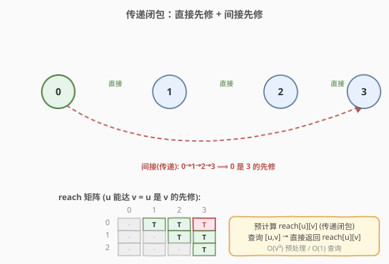
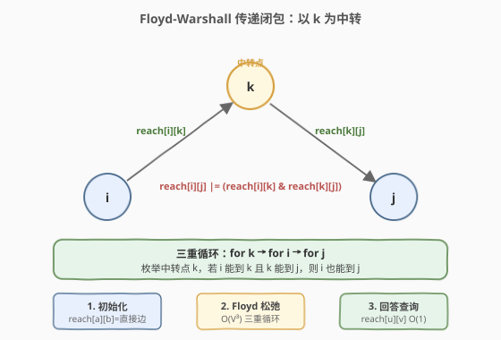
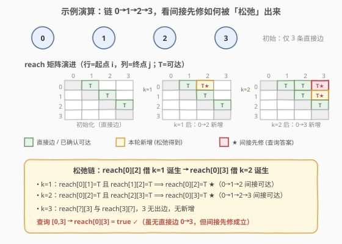

# 课程表 IV

- **题目名称**：课程表 IV
- **链接**：[1462. 课程表 IV](https://leetcode.cn/problems/course-schedule-iv/)
- **难度**：中等
- **标签**：图、拓扑排序、传递闭包、Floyd-Warshall

## 1. 题目概述

你总共需要上 `numCourses` 门课，课程编号 `0` 到 `numCourses-1`。给你一个数组 `prerequisites`，其中 `prerequisites[i] = [ai, bi]` 表示**想选 `bi` 必须先选 `ai`**（即 `ai` 是 `bi` 的先修课）。先修关系可以**间接传递**：若 `a` 是 `b` 的先修、`b` 是 `c` 的先修，则 `a` 也是 `c` 的先修。

再给你一个查询数组 `queries`，`queries[j] = [uj, vj]`，问 `uj` 是否是 `vj` 的先修课（直接或间接均可）。返回布尔数组 `answer`，`answer[j]` 为第 `j` 个查询的答案。

**示例 1**：

```text
输入：numCourses = 2, prerequisites = [[1,0]], queries = [[0,1],[1,0]]
输出：[false,true]
解释：[1,0] 表示选 0 前先选 1，即 1→0。
  查询 [0,1]：0 是 1 的先修吗？0 无出边，false。
  查询 [1,0]：1 是 0 的先修吗？有直接边 1→0，true。
```

**示例 2**：

```text
输入：numCourses = 2, prerequisites = [], queries = [[1,0],[0,1]]
输出：[false,false]
解释：无先修关系，两门课互相独立。
```

**示例 3**：

```text
输入：numCourses = 3, prerequisites = [[1,2],[1,0],[2,0]], queries = [[1,0],[1,2]]
输出：[true,true]
解释：边 1→2、1→0、2→0。
  查询 [1,0]：直接边 1→0，true。
  查询 [1,2]：直接边 1→2，true。
```

**约束条件**：

- $2 \le \text{numCourses} \le 100$
- $0 \le \text{prerequisites.length} \le \frac{\text{numCourses} \cdot (\text{numCourses}-1)}{2}$
- `prerequisites[i].length == 2`，$0 \le a_i, b_i \le \text{numCourses}-1$，$a_i \ne b_i$
- 每一对 $[a_i, b_i]$ 互不相同
- 先修课程图中**没有环**（保证是 DAG）
- $1 \le \text{queries.length} \le 10^4$，$u_i \ne v_i$

> ⚠️ **建图方向（与 207 相反！）**：本题 `[ai, bi]` 表示「选 `bi` 前先选 `ai`」，对应有向边 **`ai → bi`**（先修指向后修）。而 [207. 课程表](../0201-0300/207_课程表.md) 的 `[a, b]` 表示「选 `a` 前先选 `b`」，对应边 `b → a`。两题边方向恰好相反，照搬 207 的建图会全部建反。本文统一按 **`ai → bi`** 建邻接表。

> 💡 **问题本质**：`uj` 是 `vj` 的先修 ⟺ 在 DAG 中沿 `ai → bi` 方向，`uj` 能到达 `vj`。于是问题归约为求 DAG 的**传递闭包**（transitive closure）`reach[u][v]`：预计算所有点对的可达性后，每次查询 $O(1)$。

---

## 2. 解题思路

### 2.1 暴力思路：每次查询做一次 BFS/DFS

最直白的做法：对每个查询 `[u, v]`，从 `u` 出发沿邻接表 DFS/BFS 搜索，看能否到达 `v`。

- **正确**：枚举 `u` 的所有后代，命中 `v` 即可达；
- **效率**：单次查询 $O(V+E)$，共 $Q$ 次查询 $\implies O(Q \cdot (V+E))$。本题 $Q \le 10^4$、$V \le 100$、$E \le 4950$，最坏约 $5 \times 10^7$，能过但**同一节点被反复搜索**——许多查询共享前缀，重复劳动严重。

优化方向：把「可达性」**预计算**成一张 $V \times V$ 的表，之后每次查询直接查表 $O(1)$。这就是传递闭包。

### 2.2 核心观察：传递闭包



定义布尔矩阵 `reach[u][v]`：`true` 当且仅当 `u` 可达 `v`（存在路径 `u → … → v`，含直接边）。则：

$$\text{uj 是 vj 的先修} \iff \text{reach}[u_j][v_j] = \text{true}$$

初始化时，每条直接边 `ai → bi` 置 `reach[ai][bi] = true`。随后用 **Floyd-Warshall** 把间接可达性「松弛」出来：枚举中转点 `k`，若 `i` 能到 `k` 且 `k` 能到 `j`，则 `i` 也能到 `j`。

$$\text{reach}[i][j] \;\lor\!=\; \big(\text{reach}[i][k] \;\wedge\; \text{reach}[k][j]\big)$$

> 💡 **为什么 Floyd 对 DAG 也成立？** Floyd-Warshall 本质是「枚举所有中转点 k，松弛所有点对 (i,j)」——它对任意有向图都成立，**不要求无负环即可正确求传递闭包**（这里只判可达、不判最短路长度，所以连「负环」都不需要担心）。本题保证无环，进一步保证可达性无歧义。$V \le 100 \implies V^3 = 10^6$，松弛三重循环毫秒级。

> ⚠️ **对角线 `reach[u][u]`**：本题查询保证 $u_i \ne v_i$，对角线取何值都不影响答案。Floyd 流程中 `reach[u][u]` 不会被直接边置真（无自环），也不会被松弛出真（无环），故保持 `false`，无需特判。

### 2.3 算法流程图



**完整步骤**：

1. **初始化** `reach` 为 $V \times V$ 全 `false` 矩阵；
2. **置直接边**：对每条 `[ai, bi]`，`reach[ai][bi] = true`；
3. **Floyd 松弛**：三重循环
   - `for k in 0..V-1`
     - `for i in 0..V-1`
       - `for j in 0..V-1`
         - `if reach[i][k] and reach[k][j]: reach[i][j] = true`；
4. **回答查询**：对每个 `[uj, vj]`，输出 `reach[uj][vj]`。

> 💡 **剪枝小技巧**：内层 `j` 循环前先判断 `reach[i][k]` 是否为真，为假则直接跳过整行 `j`，常数优化约 $V$ 倍（见参考代码 Python 版与 C++ BFS 版）。

### 2.4 示例演算



用一个**链状 DAG** `0 → 1 → 2 → 3`（即 `prerequisites = [[0,1],[1,2],[2,3]]`）演示间接先修如何诞生。查询 `[0,3]`：图中并无直接边 `0→3`，但传递闭包应给出 `true`。

**初始 `reach`**（仅直接边）：`reach[0][1]=T`，`reach[1][2]=T`，`reach[2][3]=T`。

| 中转 k | 松弛动作 | 新增项 | 说明 |
|--------|----------|--------|------|
| `k=0` | `reach[?][0]` 全假 → 无 | — | 0 无入边，没人能借 0 中转 |
| `k=1` | `reach[0][1]=T` ∧ `reach[1][2]=T` | `reach[0][2]=T` ★ | 0→1→2，0 间接可达 2 |
| `k=2` | `reach[0][2]=T` ∧ `reach[2][3]=T` | `reach[0][3]=T` ★ | 0→1→2→3，0 间接可达 3 |
|        | `reach[1][2]=T` ∧ `reach[2][3]=T` | `reach[1][3]=T` ★ | 1→2→3，1 间接可达 3 |
| `k=3` | `reach[3][?]` 全假 → 无 | — | 3 无出边，无法作中转 |

最终 `reach[0][3] = true` $\implies$ 查询 `[0,3]` 返回 `true` ✓。注意 `k=2` 这一步用到了 `k=1` 刚刚松弛出的 `reach[0][2]`——**Floyd 的中转点按外层循环顺序逐步「解锁」**，先短后长地拼出间接路径，这正是它能发现多跳可达性的原因。

> 💡 **对照官方示例 1**：`prerequisites = [[1,0]]`（边 `1→0`）。初始 `reach[1][0]=T`，三轮 `k` 均无新增（1 无入边、0 无出边）。查询 `[0,1] → reach[0][1]=false`，`[1,0] → reach[1][0]=true`，输出 `[false,true]` ✓。

---

## 3. 参考代码

### 方法一：Floyd-Warshall 传递闭包（推荐，$V \le 100$ 首选）

### C++

```cpp
class Solution {
public:
    vector<bool> checkIfPrerequisite(int numCourses,
                                     vector<vector<int>>& prerequisites,
                                     vector<vector<int>>& queries) {
        vector<vector<bool>> reach(numCourses,
                                   vector<bool>(numCourses, false));
        for (auto& p : prerequisites) {
            reach[p[0]][p[1]] = true;          // ai -> bi
        }
        for (int k = 0; k < numCourses; ++k)
            for (int i = 0; i < numCourses; ++i)
                for (int j = 0; j < numCourses; ++j)
                    if (reach[i][k] && reach[k][j])
                        reach[i][j] = true;
        vector<bool> ans;
        ans.reserve(queries.size());
        for (auto& q : queries)
            ans.push_back(reach[q[0]][q[1]]);
        return ans;
    }
};
```

### Python

```python
class Solution:
    def checkIfPrerequisite(self, numCourses: int,
                            prerequisites: List[List[int]],
                            queries: List[List[int]]) -> List[bool]:
        reach = [[False] * numCourses for _ in range(numCourses)]
        for a, b in prerequisites:
            reach[a][b] = True                  # a -> b
        for k in range(numCourses):
            for i in range(numCourses):
                if not reach[i][k]:
                    continue                    # 剪枝：i 到不了 k，跳过整行 j
                for j in range(numCourses):
                    if reach[k][j]:
                        reach[i][j] = True
        return [reach[u][v] for u, v in queries]
```

> 💡 **实现要点**：① 建图方向 `ai → bi`，`reach[p[0]][p[1]] = true`；② Python 版加了 `if not reach[i][k]: continue` 剪枝，把无效内层循环整体跳过；③ 用 `vector<bool>` / `List[bool]` 而非 `int`，省 $V^2$ 内存。

### 方法二：从每个点 BFS 求可达集（避免 $V^3$ 的替代方案）

当 $V$ 较大（如 $V \approx 10^3$）但图稀疏（$E \ll V^2$）时，$O(V^3)$ 的 Floyd 偏慢。改为从每个起点做一次 BFS，总复杂度 $O(V \cdot (V+E))$，稀疏图下优于 Floyd。

### C++

```cpp
class Solution {
public:
    vector<bool> checkIfPrerequisite(int numCourses,
                                     vector<vector<int>>& prerequisites,
                                     vector<vector<int>>& queries) {
        vector<vector<int>> adj(numCourses);
        for (auto& p : prerequisites) adj[p[0]].push_back(p[1]);  // ai -> bi
        vector<vector<bool>> reach(numCourses,
                                   vector<bool>(numCourses, false));
        for (int s = 0; s < numCourses; ++s) {
            queue<int> q;
            q.push(s);
            while (!q.empty()) {
                int u = q.front(); q.pop();
                for (int v : adj[u])
                    if (!reach[s][v]) {
                        reach[s][v] = true;
                        q.push(v);
                    }
            }
        }
        vector<bool> ans;
        ans.reserve(queries.size());
        for (auto& q : queries)
            ans.push_back(reach[q[0]][q[1]]);
        return ans;
    }
};
```

> 💡 **两种方法的选择**：$V \le 100$ 时 Floyd 更简洁（三重循环、无队列、无邻接表），是本题首选；$V$ 大且图稀疏时 BFS-per-source 更优。两者预处理后查询都是 $O(1)$。

---

## 4. 复杂度分析

| 维度 | Floyd-Warshall（推荐） | BFS-per-source |
|------|------------------------|----------------|
| **预处理时间** | $O(V^3)$ | $O(V \cdot (V+E))$ |
| **查询时间** | $O(1)$ | $O(1)$ |
| **总时间** | $O(V^3 + Q)$ | $O(V(V+E) + Q)$ |
| **空间复杂度** | $O(V^2)$（`reach` 矩阵） | $O(V^2 + E)$（`reach` + 邻接表） |
| **适用场景** | $V$ 小（$\le 200$），稠密稀疏皆可 | $V$ 大但图稀疏（$E \ll V^2$） |

- **Floyd**：$V \le 100 \implies V^3 = 10^6$，预处理毫秒级；$Q \le 10^4$ 次查询共 $O(Q)$，整体远低于时限。空间 $O(V^2) = 10^4$ 布尔，可忽略。
- **BFS-per-source**：$V=100$、$E \le 4950$ 时 $V(V+E) \approx 5 \times 10^5$，比 Floyd 还快约一半，但要额外建邻接表 $O(E)$。本题两者都轻松 AC。

> ⚠️ 注意暴力「逐查询 BFS」是 $O(Q(V+E)) \approx 5 \times 10^7$，看似也能过，但一旦 $Q$ 涨到 $10^5$ 就会 TLE。传递闭包的预处理把 $Q$ 因子从乘法变成加法，是更稳健的工程选择。

---

## 5. 扩展：bitset 优化与拓扑序传递

### 5.1 bitset 压缩：$V^3/64$

`reach` 的每一行是一个比特串。Floyd 内层 `reach[i][j] |= reach[i][k] & reach[k][j]` 可改写为「按行按位或」：

```cpp
// 用 std::bitset<100> 代替 vector<bool> 的一行
for (int k = 0; k < n; ++k)
    for (int i = 0; i < n; ++i)
        if (reach[i][k])
            reach[i] |= reach[k];     // 整行 64 位一起或
```

复杂度从 $O(V^3)$ 降到 $O(V^3 / 64)$。$V=100$ 时提升不明显，但 $V \approx 2000$ 时可从 $8 \times 10^9$ 降到 $1.25 \times 10^8$，是 ICPC/CCPC 常用技巧。

### 5.2 拓扑序 + 后继集合并查

DAG 还可按**逆拓扑序**处理：对节点 $u$，`reach[u] = {u} ∪ ⋃_{v ∈ adj[u]} reach[v]`（用 bitset 做集合并）。逆拓扑序保证处理 $u$ 时其所有后继的 `reach` 已就绪。复杂度 $O(V^2 + VE/64)$，本质与 BFS-per-source 同阶，但常数更小、缓存更友好。

> 💡 三种方法（Floyd / BFS-per-source / 拓扑序并集）**对 DAG 都正确**；若图可能有环，Floyd 与 BFS 仍能正确求可达性（环上节点互相可达），拓扑序法失效（无法给出拓扑序）。

---

## 6. 面试要点

1. **本题的建图方向为什么是 `ai → bi` 而不是 `bi → ai`？**

   > 题目说 `[ai, bi]` 表示「想选 `bi` 必须先选 `ai`」，即 `ai` 是 `bi` 的先修。先修关系指向后修，故边 `ai → bi`。查询「`uj` 是否为 `vj` 的先修」即「`uj` 能否沿先修→后修方向到达 `vj`」。这与 [207. 课程表](../0201-0300/207_课程表.md) 的 `[a,b]`（学 `a` 前先学 `b`，边 `b→a`）方向恰好相反，照搬 207 会建反。

2. **为什么用传递闭包而不是每次查询做 BFS？**

   > 查询数 $Q$ 可达 $10^4$，逐次 BFS 是 $O(Q(V+E))$，同一节点被反复访问。预计算 $V \times V$ 的 `reach` 矩阵后，每次查询 $O(1)$，总复杂度从 $O(Q(V+E))$ 降到 $O(V^3 + Q)$，把 $Q$ 从乘法变加法，$Q$ 再大也不怕。

3. **Floyd 三重循环的顺序能换吗（k 放最外层是必须的吗）？**

   > 求传递闭包时，**k 必须在最外层**。原因是中转点需按顺序「逐步解锁」：处理 k 时，所有只经过 `{0..k}` 中转的可达性应已就绪。k 在外层保证 `reach[i][k]` 和 `reach[k][j]` 此时反映的恰是「只经 `< k` 中转」的可达性。若把 k 放最内层，会用到本轮尚未松弛完成的值，结果仍正确（传递闭包最终收敛），但中间状态语义混乱、且无法提前终止。最外层 k 是标准写法。

4. **Floyd 对有环图还成立吗？**

   > 成立。Floyd 求传递闭包只关心「能否到达」，不涉及路径长度，环只会让环上节点互相可达，不影响松弛逻辑的正确性。本题额外保证无环，只是排除了「自间接」歧义，对算法无影响。

5. **$V$ 很大（如 $10^3$）时该用哪种方法？**

   > 稠密图仍可 Floyd + bitset，$O(V^3/64)$；稀疏图（$E \ll V^2$）用 BFS-per-source 或拓扑序并集，$O(V(V+E))$ 更优。若只需回答少数查询，甚至可退化为暴力逐次 BFS，$O(Q(V+E))$，避免 $O(V^2)$ 预处理开销——按 $Q$ 与 $V$ 的相对大小择优。

> 💡 **一句话总结**：1462 的灵魂是「**DAG 传递闭包**」——预计算 `reach[u][v]`，查询 $O(1)$。$V \le 100$ 时 Floyd 三重循环 $O(V^3)$ 最简洁；图大稀疏时换成 BFS-per-source 或 bitset 优化的拓扑序并集。

---

## 7. 同类练习题

- [207. 课程表](https://leetcode.cn/problems/course-schedule/)（[题解](../0201-0300/207_课程表.md)）：课程表系列母题——拓扑排序判环，本题在其基础上加「点对可达性查询」，建图方向相反需对照注意
- [210. 课程表 II](https://leetcode.cn/problems/course-schedule-ii/)（[题解](../0201-0300/210_课程表II.md)）：拓扑排序输出拓扑序，与 1462 同属课程表家族，1462 关心「点对可达」、210 关心「全局顺序」
- [1136. 平行课程](https://leetcode.cn/problems/parallel-courses/)：按层 BFS 求最长链层数，与 1462 同样建先修图，但目标不同——一个求闭包、一个求深度
- [399. 除法求值](https://leetcode.cn/problems/evaluate-division/)：传递闭包思想的另一应用——预计算变量对间的比值传递关系，查询时直接查表，与 1462「预计算可达性后 $O(1)$ 查询」同构
- [802. 找到最终的安全状态](https://leetcode.cn/problems/find-eventual-safe-states/)：反向图 + 拓扑（或 DFS 三色）求终态节点，与 1462 同属「DAG 上预计算点对/点集关系」一类
