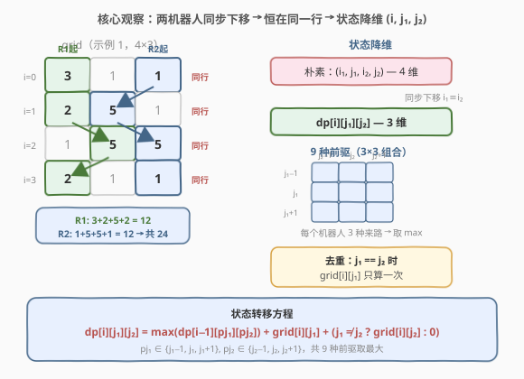
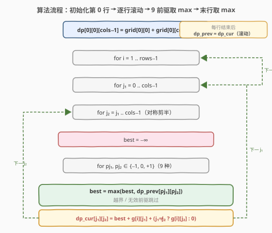
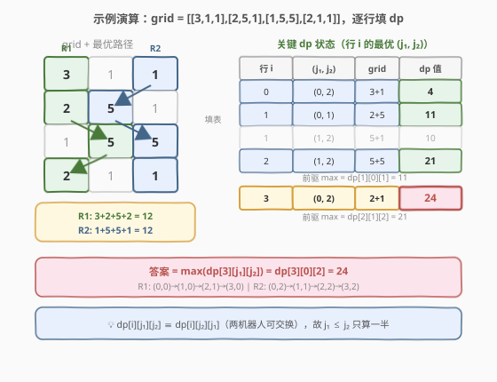

# 摘樱桃 II

- **题目名称**：摘樱桃 II
- **链接**：[1463. 摘樱桃 II](https://leetcode.cn/problems/cherry-pickup-ii/)
- **难度**：困难
- **标签**：数组、动态规划、网格 DP

## 1. 题目概述

给定一个 `rows x cols` 的矩阵 `grid` 表示樱桃地，每个格子的数字表示该位置的樱桃数目。两个机器人从第一行同时出发：

- **机器人 1** 从 `(0, 0)` 出发；
- **机器人 2** 从 `(0, cols-1)` 出发。

每一步，两个机器人都从第 `i` 行移动到第 `i+1` 行，列坐标可以 **左移一格、不动、右移一格**（即 `j-1`、`j`、`j+1`）。机器人经过格子时摘走全部樱桃，格子变空。若两个机器人**同时到达同一格子**，只有一个能摘到樱桃。机器人不能走出 `grid` 边界，最终都要到达最后一行。求两个机器人能收集的**最多樱桃总数**。

**示例 1**：

```text
输入：grid = [[3,1,1],[2,5,1],[1,5,5],[2,1,1]]
输出：24
解释：机器人 1 路径 (0,0)→(1,0)→(2,1)→(3,0)，摘 3+2+5+2=12；
      机器人 2 路径 (0,2)→(1,1)→(2,2)→(3,2)，摘 1+5+5+1=12；
      总计 24。
```

**示例 2**：

```text
输入：grid = [[1,0,0,0,0,0,1],[2,0,0,0,0,3,0],[2,0,9,0,0,0,0],[0,3,0,5,4,0,0],[1,0,2,3,0,0,6]]
输出：28
```

**示例 3**：

```text
输入：grid = [[1,0,0,3],[0,0,0,3],[0,0,3,3],[9,0,3,3]]
输出：22
```

**约束条件**：

- $\text{rows} = \text{grid.length}$
- $\text{cols} = \text{grid}[i].\text{length}$
- $2 \leq \text{rows}, \text{cols} \leq 70$
- $0 \leq \text{grid}[i][j] \leq 100$

> 💡 本题是 [741. 摘樱桃](https://leetcode.cn/problems/cherry-pickup/)（单机器人折返走）的变体：从「一个机器人走两趟」变为「两个机器人同时走一趟」，核心区别在于**两个机器人同步下移**这一约束如何简化状态。

---

## 2. 解题思路

### 2.1 暴力思路

每一步两个机器人各有 3 种列移动选择（`j-1`、`j`、`j+1`），共 $3 \times 3 = 9$ 种组合。从第 0 行到第 $\text{rows}-1$ 行共 $\text{rows}-1$ 步，暴力 DFS 枚举所有路径组合数为 $9^{\text{rows}-1}$。当 $\text{rows}=70$ 时这是一个天文数字，完全不可行。

> 💡 暴力会大量重复计算「两个机器人在某行某两列时，从该行到底行能摘的最大樱桃数」——这正是**重叠子问题**的信号 → 上 DP。

### 2.2 核心观察：同步下移 → 状态降维为 $(i, j_1, j_2)$



本题最关键的观察在于**两个机器人始终在同一行**：由于每一步两个机器人都从第 $i$ 行下移到第 $i+1$ 行，它们的行坐标恒相等 $i_1 \equiv i_2$。这意味着：

- **朴素状态**需要 4 维 $(i_1, j_1, i_2, j_2)$ 来描述两个机器人的独立位置；
- **利用同步性**，$i_1 = i_2 = i$，状态降为 3 维 $(i, j_1, j_2)$——只需记录**行号**和**两个列坐标**。

这带来了两个关键性质：

- **无后效性**：到达 $(i, j_1, j_2)$ 后的最优后续只取决于当前行和两列位置，与之前怎么到的无关；
- **最优子结构**：$(i, j_1, j_2)$ 的最优 = 9 个前驱状态中的最优 + 当前行两格的樱桃和。

**去重规则**：当 $j_1 = j_2$（两机器人同格）时，$\text{grid}[i][j_1]$ 只算一次；当 $j_1 \neq j_2$ 时，两格各算一次。

设 $dp[i][j_1][j_2]$ 表示两个机器人分别走到 $(i, j_1)$ 和 $(i, j_2)$ 时，从第 0 行到第 $i$ 行能收集的最大樱桃总数，则：

$$
dp[i][j_1][j_2] = \max_{\substack{p j_1 \in \{j_1-1, j_1, j_1+1\} \\ p j_2 \in \{j_2-1, j_2, j_2+1\}}} dp[i-1][p j_1][p j_2] + \text{grid}[i][j_1] + \begin{cases} \text{grid}[i][j_2], & j_1 \neq j_2 \\ 0, & j_1 = j_2 \end{cases}
$$

> ⚠️ 前驱状态 $(p j_1, p j_2)$ 必须在合法列范围 $[0, \text{cols}-1]$ 内，越界的前驱直接跳过。

### 2.3 算法流程图



**初始化**（第 0 行）：

- $dp[0][0][\text{cols}-1] = \text{grid}[0][0] + \text{grid}[0][\text{cols}-1]$（两个机器人的起始位置，列不同必为 $0$ 和 $\text{cols}-1$，因为 $\text{cols} \geq 2$）；
- 其余 $dp[0][j_1][j_2]$ 均为 $-\infty$（非法起始状态）。

**逐行递推**（$i$ 从 1 到 $\text{rows}-1$）：

1. 对每个合法的 $(j_1, j_2)$（$0 \leq j_1 \leq \text{cols}-1$，$0 \leq j_2 \leq \text{cols}-1$）；
2. 枚举 9 个前驱 $(p j_1, p j_2)$，跳过越界和值为 $-\infty$ 的前驱，取最大值 `best`；
3. $dp[i][j_1][j_2] = \text{best} + \text{grid}[i][j_1] + (j_1 \neq j_2\ ?\ \text{grid}[i][j_2] : 0)$。

**答案**：$\max_{j_1, j_2} dp[\text{rows}-1][j_1][j_2]$。

> 💡 **对称性剪枝**：由于两个机器人可交换（$dp[i][j_1][j_2] \equiv dp[i][j_2][j_1]$），只需计算 $j_1 \leq j_2$ 的部分，常数优化约一半。

> 💡 **空间优化**：$dp[i]$ 只依赖 $dp[i-1]$，可用两个 $\text{cols} \times \text{cols}$ 的二维数组滚动，空间从 $O(\text{rows} \cdot \text{cols}^2)$ 降到 $O(\text{cols}^2)$。

### 2.4 示例演算

以 `grid = [[3,1,1],[2,5,1],[1,5,5],[2,1,1]]` 为例，逐行填 $dp$：



**第 0 行**（起始）：

$$dp[0][0][2] = \text{grid}[0][0] + \text{grid}[0][2] = 3 + 1 = 4$$

其余状态均为 $-\infty$。

**第 1 行**（`grid[1] = [2,5,1]`）：机器人 1 从第 0 列出发可达第 0、1 列，机器人 2 从第 2 列出发可达第 1、2 列。合法前驱仅有 $dp[0][0][2] = 4$。

| $(j_1, j_2)$ | grid 贡献 | 前驱 max | $dp[1][j_1][j_2]$ |
|--------------|-----------|----------|-------------------|
| (0, 1) | 2 + 5 = 7 | 4 | **11** |
| (0, 2) | 2 + 1 = 3 | 4 | 7 |
| (1, 1) | 5（同格） | 4 | 9 |
| (1, 2) | 5 + 1 = 6 | 4 | 10 |

最优状态：$dp[1][0][1] = 11$。

**第 2 行**（`grid[2] = [1,5,5]`）：以最优状态 $dp[2][1][2]$ 为例，9 个前驱中合法且有效的最大值为 $dp[1][0][1] = 11$：

$$dp[2][1][2] = 11 + \text{grid}[2][1] + \text{grid}[2][2] = 11 + 5 + 5 = 21$$

**第 3 行**（`grid[3] = [2,1,1]`）：以答案状态 $dp[3][0][2]$ 为例，前驱最大值为 $dp[2][1][2] = 21$：

$$dp[3][0][2] = 21 + \text{grid}[3][0] + \text{grid}[3][2] = 21 + 2 + 1 = \mathbf{24}$$

最终答案 $\max dp[3][j_1][j_2] = 24$，对应路径 R1: $(0,0)→(1,0)→(2,1)→(3,0)$、R2: $(0,2)→(1,1)→(2,2)→(3,2)$。

---

## 3. 参考代码

### C++（滚动数组，$O(\text{cols}^2)$ 空间）

```cpp
class Solution {
  public:
    int cherryPickup(vector<vector<int>>& grid) {
        int rows = grid.size(), cols = grid[0].size();
        const int NEG = -1;
        // dp_prev[j1][j2]: 上一行 j1<=j2 部分的最大值，其余用 -1 标记非法
        vector<vector<int>> dp_prev(cols, vector<int>(cols, NEG));
        vector<vector<int>> dp_cur(cols, vector<int>(cols, NEG));

        // 初始化第 0 行
        dp_prev[0][cols - 1] = grid[0][0] + grid[0][cols - 1];

        int dj[3] = {-1, 0, 1};
        for (int i = 1; i < rows; ++i) {
            for (int j1 = 0; j1 < cols; ++j1) {
                for (int j2 = j1; j2 < cols; ++j2) {   // 对称剪枝：只算 j1 <= j2
                    int best = NEG;
                    for (int d1 : dj) {
                        int pj1 = j1 + d1;
                        if (pj1 < 0 || pj1 >= cols) continue;
                        for (int d2 : dj) {
                            int pj2 = j2 + d2;
                            if (pj2 < 0 || pj2 >= cols) continue;
                            int lo = min(pj1, pj2), hi = max(pj1, pj2);
                            if (dp_prev[lo][hi] == NEG) continue;
                            best = max(best, dp_prev[lo][hi]);
                        }
                    }
                    if (best == NEG) continue;          // 无合法前驱
                    int gain = grid[i][j1] + (j1 != j2 ? grid[i][j2] : 0);
                    dp_cur[j1][j2] = best + gain;
                }
            }
            dp_prev.swap(dp_cur);
            fill(dp_cur.begin(), dp_cur.end(), vector<int>(cols, NEG));
        }

        int ans = 0;
        for (int j1 = 0; j1 < cols; ++j1)
            for (int j2 = j1; j2 < cols; ++j2)
                ans = max(ans, dp_prev[j1][j2]);
        return ans;
    }
};
```

### Python

```python
class Solution:
    def cherryPickup(self, grid: List[List[int]]) -> int:
        rows, cols = len(grid), len(grid[0])
        dp_prev = [[-1] * cols for _ in range(cols)]
        dp_prev[0][cols - 1] = grid[0][0] + grid[0][cols - 1]

        dj = (-1, 0, 1)
        for i in range(1, rows):
            dp_cur = [[-1] * cols for _ in range(cols)]
            for j1 in range(cols):
                for j2 in range(j1, cols):          # 对称剪枝
                    best = -1
                    for d1 in dj:
                        pj1 = j1 + d1
                        if pj1 < 0 or pj1 >= cols:
                            continue
                        for d2 in dj:
                            pj2 = j2 + d2
                            if pj2 < 0 or pj2 >= cols:
                                continue
                            lo, hi = min(pj1, pj2), max(pj1, pj2)
                            if dp_prev[lo][hi] == -1:
                                continue
                            best = max(best, dp_prev[lo][hi])
                    if best == -1:
                        continue
                    gain = grid[i][j1] + (grid[i][j2] if j1 != j2 else 0)
                    dp_cur[j1][j2] = best + gain
            dp_prev = dp_cur

        return max(max(row) for row in dp_prev)
```

> 💡 **非法状态用 `-1` 而非 `-∞`**：因为 `grid[i][j] ≥ 0`，任何合法状态的 $dp$ 值都 $\geq 0$，用 `-1` 即可区分非法状态。前驱为 `-1` 时直接跳过。

---

## 4. 复杂度分析

| 维度 | 复杂度 | 说明 |
|------|--------|------|
| 时间复杂度 | $O(\text{rows} \cdot \text{cols}^2)$ | 每行 $\text{cols}^2 / 2$ 个状态（对称剪枝），每个状态查 9 个前驱，常数 9/2 约 4.5 |
| 空间复杂度 | $O(\text{cols}^2)$ | 两个 $\text{cols} \times \text{cols}$ 的滚动数组 |

> ⚠️ 当 $\text{rows} = \text{cols} = 70$ 时，$70 \times 70^2 \times 4.5 \approx 1.5 \times 10^6$，完全在时限内。若不加对称剪枝则为 $70 \times 70^2 \times 9 \approx 3 \times 10^6$，同样可过。

---

## 5. 扩展：对称性原理

两个机器人在功能上完全等价（都是「从某列出发、向下走、摘樱桃」），因此状态 $dp[i][j_1][j_2]$ 与 $dp[i][j_2][j_1]$ 的值恒相等。这意味着：

- 只需计算 $j_1 \leq j_2$ 的部分（上三角），常数减半；
- 查前驱时，$(p j_1, p j_2)$ 也要归一化为 $(\min, \max)$ 再查表。

> 💡 这与 [526. 优美的排列](../0501-0600/526_优美的排列.md) 中「状态压缩 DP 枚举子集」的思路不同但精神相似：都是利用**对称性减少状态空间**。本题对称性来自「两个机器人无差别」，526 的对称性来自「排列的位置对称」。

---

## 6. 面试要点

1. **为什么状态是 3 维而不是 4 维？**
   - 因为两个机器人**每步同步下移一行**，行坐标恒相等 $i_1 = i_2 = i$。若两个机器人可以独立地在行方向移动（如一个走两步另一个走一步），就不能降维，需要完整的 4 维状态。

2. **为什么不能用贪心？**
   - 每个机器人各自走最大和路径的简单贪心**不正确**。因为两个机器人的路径可能**冲突**——同格子只算一次，局部最优可能全局次优。必须联合考虑两个机器人的位置才能保证全局最优。

3. **前驱有 9 个，为什么不会超时？**
   - 9 是常数。每个状态计算 $O(9) = O(1)$，总状态数 $O(\text{rows} \cdot \text{cols}^2)$，$\text{cols} \leq 70$ 时约 $3.4 \times 10^5$ 个状态，完全可行。

4. **滚动数组为什么可行？初始化怎么做？**
   - $dp[i]$ 只依赖 $dp[i-1]$，与更早的行无关，故只需保留上一行。初始化时第 0 行只有 $dp[0][0][\text{cols}-1]$ 合法（两机器人起始列），其余设为 $-\infty$（或 `-1`），递推时跳过非法前驱。

5. **和 [741. 摘樱桃](https://leetcode.cn/problems/cherry-pickup/) 的区别？**
   - 741 是**单机器人走两趟**（先从左上到右下，再折返回左上），需要 2 维状态 $(j_1, j_2)$ 并处理「第一趟摘过后第二趟为空」的问题。本题是**两个机器人同时走一趟**，因同步下移可降为 3 维，且不存在「先摘后空」的时序问题——两个机器人同时到达才需去重。

---

## 7. 同类练习题

- [741. 摘樱桃](https://leetcode.cn/problems/cherry-pickup/)：单机器人走两趟的网格 DP，2 维状态 $(j_1, j_2)$，对比同步性如何影响状态维度
- [64. 最小路径和](https://leetcode.cn/problems/minimum-path-sum/)（[题解](../0001-0100/64_最小路径和.md)）：单机器人网格 DP 入门，对比「一维列状态」到「二维双列状态」的升级
- [174. 地下城游戏](https://leetcode.cn/problems/dungeon-game/)（[题解](../0101-0200/174_地下城游戏.md)）：反向网格 DP + 负数，巩固网格 DP 的状态定义与转移
- [1301. 最大得分的路径数目](https://leetcode.cn/problems/number-of-paths-with-max-score/)：网格 DP 同时追踪最大得分与路径数，多目标网格 DP 练习
- [526. 优美的排列](https://leetcode.cn/problems/beautiful-arrangement/)（[题解](../0501-0600/526_优美的排列.md)）：状态压缩 DP，对比「对称性减少状态空间」的不同应用场景
