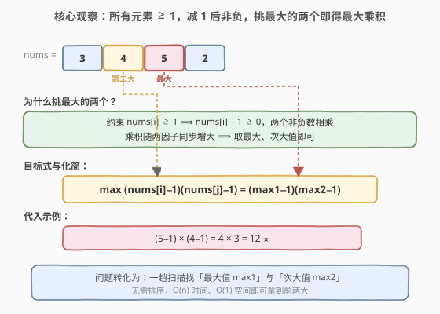
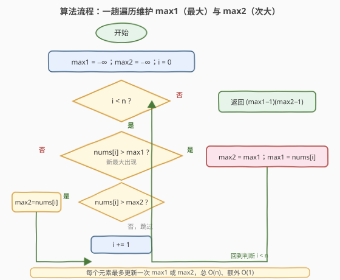

# 数组中两元素的最大乘积

- **题目名称**：数组中两元素的最大乘积
- **链接**：[1464. 数组中两元素的最大乘积](https://leetcode.cn/problems/maximum-product-of-two-elements-in-an-array/)
- **难度**：简单
- **标签**：数组、贪心、一次遍历求最值

## 1. 题目概述

给定一个正整数数组 `nums`，请你选择两个**不同**的下标 `i` 和 `j`（$i \ne j$），返回 $(\text{nums}[i]-1) \times (\text{nums}[j]-1)$ 的**最大值**。

**示例 1**：

```text
输入：nums = [3,4,5,2]
输出：12
解释：(5-1) * (4-1) = 4 * 3 = 12。
```

**示例 2**：

```text
输入：nums = [1,5,4,5]
输出：16
解释：(5-1) * (5-1) = 4 * 4 = 16。
```

**示例 3**：

```text
输入：nums = [3,7]
输出：12
解释：(3-1) * (7-1) = 2 * 6 = 12。
```

**约束条件**：

- $2 \le \text{nums.length} \le 500$
- $1 \le \text{nums}[i] \le 10^3$

> 💡 **关键点**：约束保证 $\text{nums}[i] \ge 1$，故 $\text{nums}[i]-1 \ge 0$，两个因子都非负。非负数相乘时乘积随两因子同步增大，因此最大乘积必由「最大值」与「次大值」贡献——问题转化为在一趟扫描里找出数组的前两大元素。

---

## 2. 解题思路

### 2.1 暴力思路：枚举所有数对

最直观的做法是用两层循环枚举所有 $(i, j)$（$i \ne j$），逐个计算 $(\text{nums}[i]-1)(\text{nums}[j]-1)$ 取最大。

```text
ans = 0
for i in 0..n-1:
    for j in 0..n-1, j != i:
        ans = max(ans, (nums[i]-1) * (nums[j]-1))
```

- **正确**：穷举所有数对必然覆盖最优解。
- **低效**：$n$ 个元素产生 $n(n-1)$ 个有序数对，时间 $O(n^2)$。本题 $n \le 500$，约 $2.5 \times 10^5$ 次操作能过，但完全没有利用「乘积由最大、次大决定」这一结构。

> ⚠️ 暴力的浪费在于「**对每个元素都和所有其他元素配对**」。其实只有最大的两个元素才可能贡献最大乘积，其余配对全是无效计算。

### 2.2 核心观察：非负因子 + 取前两大



两步观察把 $O(n^2)$ 压成 $O(n)$：

**观察一（因子非负，乘积单调）**：约束 $\text{nums}[i] \ge 1$ ⟹ $\text{nums}[i]-1 \ge 0$。两个**非负**因子相乘，乘积关于每个因子单调不减——任意一个因子变大，乘积不会变小。因此要最大化 $(\text{nums}[i]-1)(\text{nums}[j]-1)$，两个因子都应尽可能大。

**观察二（取前两大即可）**：由单调性，最优解必为「最大值减 1」与「次大值减 1」的乘积：

$$\max_{i \ne j}(\text{nums}[i]-1)(\text{nums}[j]-1) = (\text{max}_1 - 1)(\text{max}_2 - 1)$$

其中 $\text{max}_1$、$\text{max}_2$ 分别是数组的最大值与次大值（允许相等，对应两个并列最大的不同下标）。问题从而归约为「一趟扫描求前两大」，无需排序、无需枚举数对。

> 💡 **一句话**：识别出「因子非负 ⟹ 乘积单调 ⟹ 最优解由前两大贡献」，把「$O(n^2)$ 枚举数对」降级为「$O(n)$ 求前两大」。这是「**最值驱动决策**」的最朴素范例。

> ⚠️ 若约束改为 $\text{nums}[i]$ 可负（如 [628. 三个数的最大乘积]），减 1 后符号不定，单调性失效，需同时考虑「两最小 × 一最大」等情况。本题约束 $\ge 1$ 是单调性成立的前提，审题时要确认。

### 2.3 算法流程图



**完整步骤**（一趟扫描维护前两大）：

1. **初始化** `max1 = -∞`、`max2 = -∞`（用首个元素或极小值占位）；
2. **遍历** `i` 从 `0` 到 `n-1`，对每个 `num = nums[i]`：
   - 若 `num > max1`：**新最大出现** ⟹ 旧 `max1` 降级为 `max2`，再更新 `max1 = num`；
   - 否则若 `num > max2`：**只更新次大** `max2 = num`；
   - 否则跳过。
3. **返回** `(max1 - 1) * (max2 - 1)`。

> 💡 **降级是关键**：当新最大出现时，被挤下的旧 `max1` 必然是当前所见的次大——它比所有更早见过的都大、又比新 `max1` 小，所以直接 `max2 = max1` 再 `max1 = num` 即可，无需额外比较。这一步天然处理了「两个并列最大」的情形（如 `[1,5,4,5]`，第二个 5 出现时旧 max1=5 降为 max2=5）。

### 2.4 示例演算

以示例 1 的 `nums = [3, 4, 5, 2]` 为例：

![示例演算：nums = [3, 4, 5, 2]，一趟维护 max1 / max2](../images/1464_example_walkthrough.svg)

| 步 | $\text{nums}[i]$ | 与 `max1` 比 | 与 `max2` 比 | `max1` | `max2` | 说明 |
|----|------------------|--------------|--------------|--------|--------|------|
| i=0 | 3 | $> -\infty$ | — | 3 | $-\infty$ | 首元素成为 max1 |
| i=1 | 4 | $> 3$ | — | 4 | 3 | 新最大，旧 max1 降级为 max2 |
| i=2 | 5 | $> 4$ | — | 5 | 4 | 新最大，旧 max1 降级为 max2 |
| i=3 | 2 | $\le 5$ | $\le 4$ | 5 | 4 | 不更新，跳过 |

- **结果**：`max1=5, max2=4` ⟹ $(5-1)(4-1) = 12$ ⭐。

以示例 2 `[1, 5, 4, 5]` 为例：遍历后 `max1=5, max2=5`（第一个 5 成为 max1；4 进入 max2；第二个 5 出现时，旧 max1=5 降级为 max2，max1 更新为 5）⟹ $(5-1)(5-1) = 16$ ⭐。

> 💡 注意「降级」机制如何处理并列最大：第二个 5 不大于 max1=5，但「否则若 $> \text{max2}$」分支会把它收入 max2——这与上面流程图的等价写法一致。两种写法（先比 max1 再比 max2 / 新最大时降级）都能正确得到 max1=max2=5。

---

## 3. 参考代码

### C++（一趟遍历维护前两大）

```cpp
class Solution {
public:
    int maxProduct(vector<int>& nums) {
        int max1 = INT_MIN, max2 = INT_MIN;
        for (int num : nums) {
            if (num > max1) {
                max2 = max1;   // 旧最大降级为次大
                max1 = num;
            } else if (num > max2) {
                max2 = num;
            }
        }
        return (max1 - 1) * (max2 - 1);
    }
};
```

### Python

```python
class Solution:
    def maxProduct(self, nums: List[int]) -> int:
        max1 = max2 = float('-inf')
        for num in nums:
            if num > max1:
                max2 = max1
                max1 = num
            elif num > max2:
                max2 = num
        return (max1 - 1) * (max2 - 1)
```

> 💡 **实现要点**：① `max1`、`max2` 初始化为极小值，保证首元素必落入 max1 分支。② 新最大出现时**先降级再更新**：`max2 = max1; max1 = num`，顺序不能反——若先更新 `max1` 再 `max2 = max1` 会把新值错误塞进 max2。③ `else if` 保证每个元素最多触发一次更新。④ 也可用 `sort` 后取末两位（`nums[-1]-1)*(nums[-2]-1`），$O(n \log n)$ 简洁但非最优。

---

## 4. 复杂度分析

| 维度 | 一趟求前两大 $O(n)$（推荐） | 排序取末两位 $O(n \log n)$ | 暴力枚举数对 $O(n^2)$ |
|------|----------------------------|---------------------------|------------------------|
| **时间复杂度** | $O(n)$ | $O(n \log n)$ | $O(n^2)$ |
| **空间复杂度** | $O(1)$ | $O(\log n)$（排序栈） | $O(1)$ |
| **每元素操作** | 至多两次比较 | 排序分摊 | $n-1$ 次乘法 |
| **是否破坏原序** | 否 | 是（原地排序时） | 否 |
| **适用性** | 仅需前 $k$ 小时最优 | 需要多个次序信息时 | $n$ 极小时可接受 |

- **一趟求前两大**：一趟遍历，每个元素至多两次比较 + 一次赋值，合计 $O(n)$；额外只用 `max1`、`max2` 两个变量，空间 $O(1)$。是本题的最优解。
- **排序取末两位**：`sort` 后取 `nums[-1]`、`nums[-2]`，写法极简但 $O(n \log n)$，且常破坏原数组顺序。$n \le 500$ 时与一趟法实测差距不大，但理论劣于 $O(n)$。
- **暴力枚举**：$O(n^2)$，$n=500$ 约 $2.5 \times 10^5$ 次，毫秒级通过，但未识别「乘积由前两大决定」的结构。

> ⚠️ 本题 $n \le 500$，三种方法都能过。面试中写出一趟维护前两大，即体现对「最值驱动 + 单调性」的把握——这是把 $O(n^2)$ 降到 $O(n)$ 的通用思路。

---

## 5. 扩展：维护前 $k$ 大与「降级」思想

### 5.1 维护前两大为何只需「降级」

当新最大 `num > max1` 出现时，旧 `max1` 必然成为新的次大：它比所有更早见过的元素都大（否则不会曾是 max1），又比 `num` 小（因为 `num > max1`）。所以无需把 `num` 与 `max2` 再比一次，直接 `max2 = max1; max1 = num` 即可——这是「**插入排序对长度为 2 的有序表**」的特例，插入新元素时把被挤出的元素顺移到下一槽位。

### 5.2 推广到前 $k$ 大

维护前 $k$ 大时，同样用一趟扫描 + 有序表插入：新元素若大于当前第 $k$ 大，则插入并挤出最小的那个。可用长度为 $k$ 的有序数组（$O(nk)$）或小顶堆（$O(n \log k)$）。本题 $k=2$，$O(nk)=O(n)$ 已最优，无需堆。这正是 [215. 数组中的第K个最大元素] 的小顶堆解法在 $k=2$ 时的退化情形。

### 5.3 若元素可负

本题约束 $\text{nums}[i] \ge 1$ 保证减 1 后非负、乘积单调。若元素可负（如 [628. 三个数的最大乘积]），减 1 后符号不定，最大乘积可能来自「两最小（最负）× 一最大」（负负得正），需同时维护前两大与前两小。这是审题时必须确认的边界。

---

## 6. 面试要点

1. **如何想到从 $O(n^2)$ 优化到 $O(n)$？**

   > 观察约束 $\text{nums}[i] \ge 1$ ⟹ $\text{nums}[i]-1 \ge 0$，两个非负因子相乘，乘积随因子单调增大。因此最大乘积必由「最大值」与「次大值」贡献，把「枚举所有数对」降级为「一趟求前两大」，从 $O(n^2)$ 降到 $O(n)$。

2. **为什么新最大出现时要先 `max2 = max1` 再 `max1 = num`？顺序能反吗？**

   > 不能反。若先 `max1 = num` 再 `max2 = max1`，会把新值 `num` 错误塞进 `max2`，而真正的次大（旧 `max1`）被丢弃。必须先把旧 `max1` 保存到 `max2`，再更新 `max1`。这是「覆盖前先备份」的常见陷阱。

3. **如果数组有两个并列最大（如 `[1,5,4,5]`），算法还能正确工作吗？**

   > 能。第一个 5 成为 max1；4 进入 max2；第二个 5 出现时 `num > max1` 不成立（$5 \not> 5$），走 `else if num > max2` 分支，$5 > 4$ ⟹ `max2 = 5`。最终 max1=max2=5，$(5-1)(5-1)=16$ 正确。题目要求两个**不同下标**，两个并列最大来自不同位置，合法。

4. **排序取末两位的写法有什么优劣？**

   > 写法极简（`return (nums[-1]-1)*(nums[-2]-1)`），但 $O(n \log n)$ 且常破坏原数组顺序；一趟维护前两大是 $O(n)$、$O(1)$ 且不破坏原序。$n \le 500$ 时两者实测差距不大，但面试中一趟法更能体现对「最值结构」的把握。若题目后续需要前三大、前四大，排序法反而更易扩展。

5. **如果约束改为元素可负，解法会怎样变化？**

   > 减 1 后因子可负，乘积单调性失效。最大乘积可能来自「两最大」或「两最小（负负得正）」，需同时维护前两大与前两小再比较。这正是 [628. 三个数的最大乘积] 的处理方式。本题约束 $\ge 1$ 是单调性成立的前提，审题时务必确认数值范围。

> 💡 **一句话总结**：1464 的灵魂是「**因子非负 ⟹ 乘积单调 ⟹ 最优解由前两大贡献**」——一趟扫描维护 `max1`、`max2`，新最大出现时旧 max1 降级为 max2，$O(n)$ 时间、$O(1)$ 空间即得答案。

---

## 7. 同类练习题

- [747. 至少是其他数字两倍的最大数](../0701-0800/747_至少是其他数字两倍的最大数.md)：最佳镜像题，同款「一趟扫描求最大与次大」——判定最大值是否 $\ge$ 次大的 2 倍，前两大维护逻辑与 1464 完全一致
- [628. 三个数的最大乘积](../0601-0700/628_三个数的最大乘积.md)：乘积最值家族进阶，元素可负时需同时维护前两大与前两小，对照 1464 因子非负时只需前两大的简化情形
- [414. 第三大的数](../0401-0500/414_第三大的数.md)：维护前三大的一趟扫描，对照 1464 维护前两大，体会「有序表插入 + 去重」的扩展
- [215. 数组中的第K个最大元素](https://leetcode.cn/problems/kth-largest-element-in-an-array/)：维护前 $k$ 大的通用化（小顶堆 $O(n \log k)$ / 快速选择 $O(n)$），1464 是其 $k=2$ 的退化特例
