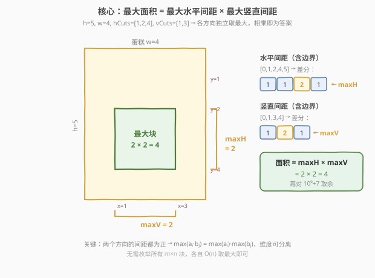
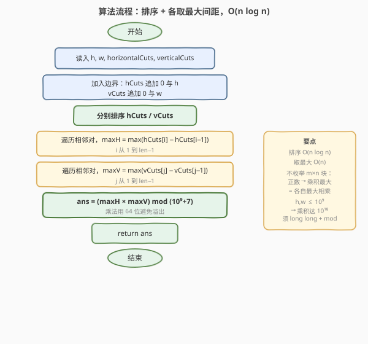
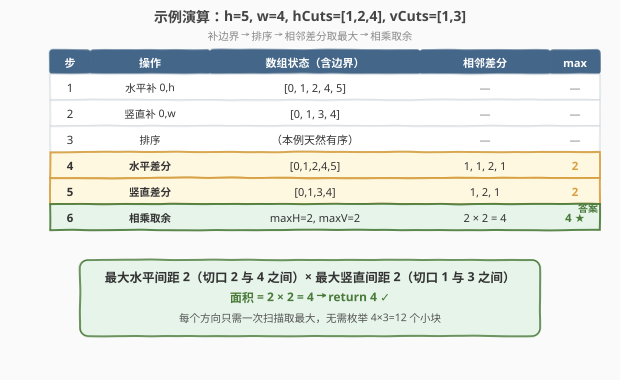

# LeetCode 切割后面积最大的蛋糕 题解

## 1. 题目概述

- **标题 / 题号**：切割后面积最大的蛋糕（#1465，medium）
- **链接**：https://leetcode.cn/problems/maximum-area-of-a-piece-of-cake-after-horizontal-and-vertical-cuts/
- **难度**：中等
- **标签**：数组、排序、贪心

**题意**：矩形蛋糕的高度为 `h`、宽度为 `w`。给定两个整数数组 `horizontalCuts` 和 `verticalCuts`，其中：

- `horizontalCuts[i]` 是从蛋糕**顶部**到第 $i$ 个水平切口的距离；
- `verticalCuts[j]` 是从蛋糕**左侧**到第 $j$ 个竖直切口的距离。

按数组中给出的位置完成所有水平和竖直切割后，找出**面积最大**的那份蛋糕，返回其面积。由于答案可能很大，需将结果**对 $10^9+7$ 取余**后返回。

> ⚠️ 审题关键：切口位置是无序的（如示例 2 的 `[3,1]`），且切口只落在蛋糕**内部**（$1 \le \text{horizontalCuts[i]} < h$）。蛋糕的四条边（$0$ 与 $h$、$0$ 与 $w$）虽不在数组里，却也是分块的天然边界——每一「块」由**相邻两条水平切口（含顶/底边）**与**相邻两条竖直切口（含左/右边）**围成。

**示例 1**：

```text
输入：h = 5, w = 4, horizontalCuts = [1,2,4], verticalCuts = [1,3]
输出：4
解释：水平切口在距顶 1/2/4 处，竖直切口在距左 1/3 处。
      面积最大的块由水平区间 [2,4]、竖直区间 [1,3] 围成，面积 2×2=4。
```

**示例 2**：

```text
输入：h = 5, w = 4, horizontalCuts = [3,1], verticalCuts = [1]
输出：6
解释：水平切口排序后 [1,3]，最大水平间距 2（[1,3] 或 [3,5]）；
      竖直切口 [1]，最大竖直间距 3（[1,4]）。面积 2×3=6。
```

**示例 3**：

```text
输入：h = 5, w = 4, horizontalCuts = [3], verticalCuts = [3]
输出：9
解释：水平间距 [3,2] 最大 3（[0,3]），竖直间距 [3,1] 最大 3（[0,3]）。面积 3×3=9。
```

**约束**：

- $2 \le h, w \le 10^9$
- $1 \le \text{horizontalCuts.length} \le \min(h-1,\, 10^5)$
- $1 \le \text{verticalCuts.length} \le \min(w-1,\, 10^5)$
- $1 \le \text{horizontalCuts[i]} < h$，$1 \le \text{verticalCuts[i]} < w$
- 同一数组内元素**互不相同**

> 💡 **关键点**：$h, w$ 可达 $10^9$，但切口数量上限 $10^5$，故「块」的数量虽多达 $(m+1)(n+1) \approx 10^{10}$，却不必逐一枚举——两个方向的间距都为正，最大面积 = 两个方向**各自最大间距**的乘积，可分离求解。

## 2. 解题思路

### 2.1 暴力思路：枚举所有「水平条 × 竖直条」小块

最直白的做法：给两个切口数组各补上边界 $0$ 和 $h/w$、排序后做差分，得到 $m+1$ 个水平间距 $\{a_i\}$ 与 $n+1$ 个竖直间距 $\{b_j\}$。每一块蛋糕的面积恰为某个 $a_i \cdot b_j$，于是双重循环枚举所有 $(m+1)(n+1)$ 对，取最大。

- **正确**：每块面积 = 一个水平间距乘一个竖直间距，枚举所有组合必能命中最大。
- **低效**：$m, n$ 各达 $10^5$ 时组合数约 $10^{10}$，远超时间限制。

> ⚠️ 暴力的浪费在于：**两个方向相互独立**——竖直方向选哪段不影响水平方向选哪段。当所有间距都为正时，「乘积的最大」就是「各自最大的乘积」，无需配对枚举。这正是分离维度的切入点。

### 2.2 核心观察：分离维度，各取最大间距



两个观察把 $O(mn)$ 降到 $O(m+n)$：

**观察一（块 = 水平间距 × 竖直间距）**：补上边界 $0$ 与 $h/w$ 后排序，相邻切口之间的差就是一条「间距」。任意一块蛋糕由一段水平间距 $a_i$ 与一段竖直间距 $b_j$ 围成，面积为 $a_i \cdot b_j$。问题等价于在两组正数中各挑一个，使乘积最大。

**观察二（正数下乘积可分离）**：所有间距严格为正（切口互异且落在内部）。设 $A = \max_i a_i$、$B = \max_j b_j$，对任意 $i, j$：

$$a_i \cdot b_j \;\le\; A \cdot b_j \;\le\; A \cdot B$$

而 $A \cdot B$ 恰由取得两个最大值的那对 $(i^\*, j^\*)$ 实现。故 $\max_{i,j} a_i b_j = A \cdot B$——**两个方向独立求最大间距，再相乘即可**。

> 💡 **一句话**：水平方向扫一遍取最大间距 `maxH`，竖直方向扫一遍取最大间距 `maxV`，答案 $= (\text{maxH} \cdot \text{maxV}) \bmod (10^9+7)$。无需枚举 $10^{10}$ 个小块。

> ⚠️ **取余时机**：`maxH`、`maxV` 各自 $\le 10^9$，乘积达 $10^{18}$，超出 32 位但仍在 64 位整数范围内。故**用 64 位整数算乘积，最后取一次余**即可，不必中途取余（乘法对取余有 $(ab)\bmod p = ((a\bmod p)(b\bmod p))\bmod p$，但此处一次乘法不溢出 64 位，直接乘更简洁）。

### 2.3 算法流程图



**完整步骤**：

1. **补边界**：`horizontalCuts` 追加 $0$ 与 $h$，`verticalCuts` 追加 $0$ 与 $w$；
2. **排序**：分别对两个数组升序排序（切口给定无序，如示例 2 的 `[3,1]`）；
3. **求最大水平间距** `maxH`：遍历相邻对，`maxH = max(hCuts[i] - hCuts[i-1])`；
4. **求最大竖直间距** `maxV`：同理遍历 `vCuts` 相邻对；
5. **相乘取余**：`ans = (maxH * maxV) % (10^9+7)`，返回 `ans`。

> 💡 第 3、4 步可合并到一个 `maxGap(bound, cuts)` 辅助函数：排序后用 `prev=0` 起步，每读一个切口算 `c - prev` 更新最大值并把 `prev` 推进到 `c`，最后再补一次 `bound - prev` 处理末段边界。

### 2.4 示例演算

以示例 1 的 `h=5, w=4, hCuts=[1,2,4], vCuts=[1,3]` 为例：



| 步 | 操作 | 数组状态（含边界） | 相邻差分 | 最大 |
|----|------|--------------------|----------|------|
| 1 | 水平补 0,h | `[0, 1, 2, 4, 5]` | — | — |
| 2 | 竖直补 0,w | `[0, 1, 3, 4]` | — | — |
| 3 | 排序 | （本例天然有序） | — | — |
| 4 | 水平差分 | `[0,1,2,4,5]` | 1, 1, **2**, 1 | **2** |
| 5 | 竖直差分 | `[0,1,3,4]` | 1, **2**, 1 | **2** |
| 6 | 相乘取余 | maxH=2, maxV=2 | 2 × 2 = 4 | **4 ★** |

- **第 4 步是关键**：水平间距 $1,1,2,1$ 中最大者 $2$，落在切口 $2$ 与 $4$ 之间；竖直最大间距 $2$ 落在切口 $1$ 与 $3$ 之间。二者交集即面积最大的块。
- **示例 2 的对比**：`hCuts=[3,1]` 给定时无序，第 3 步排序后变 `[0,1,3,5]`，差分 $1,2,2$，最大 $2$；竖直 `[0,1,4]` 差分 $1,3$，最大 $3$，面积 $2\times3=6$。可见**排序不可省**。

> 💡 注意边界 $0$ 与 $h/w$ 必须补入：示例 3 中最大水平间距 $3$ 来自 $[0,3]$ 这段——若漏补边界 $0$，会丢掉顶/底边缘的块，得到错误答案 $2$（误取 $[3,5]$ 段）。

## 3. 参考代码

### C++

```cpp
// 切割后面积最大的蛋糕.cpp —— 排序 + 各取最大间距，O(n log n)
// 编译: g++ -O2 -std=c++17 切割后面积最大的蛋糕.cpp -o lcd
#include <vector>
#include <algorithm>
using namespace std;

class Solution {
  public:
    int maxArea(int h, int w, vector<int>& horizontalCuts, vector<int>& verticalCuts) {
        const long long MOD = 1000000007;
        long long maxH = maxGap(h, horizontalCuts);   // 最大水平间距
        long long maxV = maxGap(w, verticalCuts);     // 最大竖直间距
        return (int)((maxH * maxV) % MOD);            // 64 位乘法后取一次余
    }
  private:
    // 求切口数组（补边界 0 与 bound 后）相邻元素的最大差
    long long maxGap(int bound, vector<int>& cuts) {
        sort(cuts.begin(), cuts.end());
        long long prev = 0, best = 0;
        for (int c : cuts) {
            best = max(best, (long long)c - prev);
            prev = c;
        }
        best = max(best, (long long)bound - prev);    // 末段边界 bound - 最后一个切口
        return best;
    }
};
```

### Python

```python
class Solution:
    def maxArea(self, h: int, w: int,
                horizontalCuts: List[int],
                verticalCuts: List[int]) -> int:
        MOD = 10**9 + 7

        def max_gap(bound: int, cuts: List[int]) -> int:
            cuts.sort()
            prev, best = 0, 0
            for c in cuts:
                best = max(best, c - prev)
                prev = c
            return max(best, bound - prev)            # 末段边界

        maxH = max_gap(h, horizontalCuts)
        maxV = max_gap(w, verticalCuts)
        return (maxH * maxV) % MOD
```

> 💡 **实现要点**：① `maxGap` 把「补边界」与「差分取最大」合为一次扫描——`prev` 初值 $0$ 即顶/左边界，循环结束再补 `bound - prev` 即底/右边界，避免显式 `push_back` 改原数组；② `best`、`prev` 用 `long long`，因 `c - prev` 虽不溢出 `int`，但统一 64 位可避免 `maxH * maxV` 前的类型转换疏忽；③ Python 整数任意精度，无需担心溢出，末步取余即可。

## 4. 复杂度分析

| 维度 | 复杂度 | 说明 |
|------|--------|------|
| **时间复杂度** | $O(m \log m + n \log n)$ | 排序主导；差分取最大各 $O(m)$、$O(n)$ |
| **空间复杂度** | $O(\log m + \log n)$ | 原地排序的栈空间（不复制数组）；额外仅常数变量 |

- **时间**：两个方向分别排序，$m, n \le 10^5$，排序约 $10^5 \log 10^5 \approx 1.7 \times 10^6$ 次比较；之后线性扫描取最大间距。总计远低于 $10^7$，轻松 AC。
- **空间**：`std::sort` / `list.sort` 原地进行，仅需递归栈 $O(\log n)$；未引入额外数组。

> ⚠️ 为什么不是 $O(mn)$？因为「正数乘积可分离」把二维枚举降为两个一维求最大。若间距可正可负（如选两数乘积最大的 [628. 三个数的最大乘积](https://leetcode.cn/problems/maximum-product-of-three-numbers/) 需考虑 $\min \cdot \min$），就不能如此分离——本题切口互异且在内部，保证间距恒正，是分离成立的前提。

## 5. 扩展：为什么 $\max_{i,j} a_i b_j = \max a_i \cdot \max b_j$？

把第 2.2 节的观察形式化。设 $\{a_i\}$、$\{b_j\}$ 两组数均**严格为正**，记 $A = \max_i a_i$、$B = \max_j b_j$，取到最大值的下标分别为 $i^\*, j^\*$。

- **上界**：对任意 $i, j$，因 $a_i \le A$ 且 $b_j \ge 0$，有 $a_i b_j \le A b_j$；又 $b_j \le B$ 且 $A > 0$，故 $A b_j \le A B$。所以 $\max_{i,j} a_i b_j \le A B$。
- **可达**：取 $i = i^\*, j = j^\*$，则 $a_{i^\*} b_{j^\*} = A \cdot B$。

两者夹逼得 $\max_{i,j} a_i b_j = A \cdot B$。这把「在 $m \cdot n$ 个乘积里找最大」转化为「在 $m$ 个数里找最大」与「在 $n$ 个数里找最大」两次独立求解，复杂度从 $O(mn)$ 降到 $O(m+n)$。

> 💡 **失效场景**：若 $a_i$ 可正可负，上界推导中 $a_i \le A \Rightarrow a_i b_j \le A b_j$ 当 $b_j < 0$ 时不成立（不等号翻转）。此时最大乘积可能是 $\max a \cdot \max b$（两正）或 $\min a \cdot \min b$（两负），需两者比较——[628. 三个数的最大乘积](https://leetcode.cn/problems/maximum-product-of-three-numbers/) 即属此类。本题切口互异且落在 $(0, \text{bound})$ 内，间距恒正，分离安全。

## 6. 面试要点

1. **为什么最大面积等于两个方向最大间距的乘积？**

   > 每块蛋糕面积 = 一段水平间距 $a_i$ × 一段竖直间距 $b_j$。切口互异且落在蛋糕内部，所有间距严格为正。正数下 $\max_{i,j} a_i b_j = \max a_i \cdot \max b_j$（上界夹逼 + 取最大下标可达），故两个方向独立求最大间距再相乘即得答案，无需 $O(mn)$ 枚举所有块。

2. **为什么要给切口数组补上 $0$ 和 $h/w$？**

   > 蛋糕的顶/底、左/右边虽不在 `horizontalCuts`/`verticalCuts` 数组里，却是天然的分块边界。示例 3 的最大水平间距 $3$ 来自 $[0,3]$ 段——若漏补 $0$，会丢掉贴边的块，误答为 $2$。`maxGap` 用 `prev=0` 起步、循环后补 `bound - prev`，等价于把两端边界纳入差分。

3. **溢出如何处理？**

   > $h, w \le 10^9$，故 `maxH`、`maxV` 各 $\le 10^9$，乘积达 $10^{18}$，溢出 32 位 `int`（上限约 $2.1 \times 10^9$）但仍在 64 位 `long long` 范围内（上限约 $9.2 \times 10^{18}$）。C++ 中把 `maxH`、`maxV` 存为 `long long` 后直接相乘再取余；若语言无 64 位整数，可先各取余再乘（$(ab)\bmod p = ((a\bmod p)(b\bmod p))\bmod p$）。

4. **为什么必须先排序？**

   > 切口给定顺序无意义——如示例 2 的 `horizontalCuts=[3,1]`。差分求间距要求切口按位置升序排列，否则 `cuts[i]-cuts[i-1]` 可能是负数或非相邻切口之差，得不到正确间距。排序后相邻元素才是空间上真正相邻的切口。

5. **取余放在哪一步？为什么只取一次？**

   > 放在最后 `maxH * maxV` 之后取一次。`maxH`、`maxV` 均 $\le 10^9 < 10^9+7$，取余前后不变；乘积 $< 10^{18}$ 不溢出 64 位，直接乘再取余最简洁。中途对 `maxH`、`maxV` 取余虽不影响正确性（乘法对模同余），但属多余操作。注意「差分取最大」阶段**不能**取余——取最大值比的是真实大小，取余会破坏序关系。

> 💡 **一句话总结**：1465 的灵魂是「**正数乘积可分离**」——蛋糕切块是两个方向间距的笛卡尔积，所有间距恒正使得最大面积 = 各方向最大间距之积，排序后线性各取一次最大即可，$O(n \log n)$ 解决，末步 64 位乘法取余防溢出。

## 同类练习题

| # | 题目 | 与本题的关联 |
|---|------|-------------|
| 164 | [最大间距](https://leetcode.cn/problems/maximum-gap/)（[题解](../0101-0200/164_最大间距.md)） | 排序后相邻元素最大差，正是 1465 在一维上的子程序——1465 把这套「排序 + 相邻差分取最大」分别在水平和竖直方向各跑一遍 |
| 56 | [合并区间](https://leetcode.cn/problems/merge-intervals/)（[题解](../0001-0100/56_合并区间.md)） | 排序 + 一次扫描的预处理范式，与 1465 「先排序切口再差分」同属「排序破除无序、扫描提取结构」一脉 |
| 435 | [无重叠区间](https://leetcode.cn/problems/non-overlapping-intervals/)（[题解](../0401-0500/435_无重叠区间.md)） | 区间按端点排序后贪心，共享「排序后相邻关系即问题结构」的核心思路，对照体会排序在不同区间问题里的前置作用 |
| 1423 | [可获得的最大点数](https://leetcode.cn/problems/maximum-points-you-can-obtain-from-cards/)（[题解](../1401-1500/1423_可获得的最大点数.md)） | 从两端取牌、剩余中段即「留下的一块」——同样把「边界」视作天然切口，剩余连续段的最大/最小决定答案，与 1465 的「边界即切口」思想相通 |
