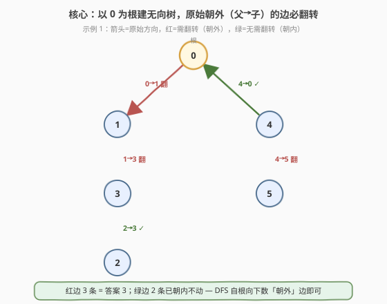
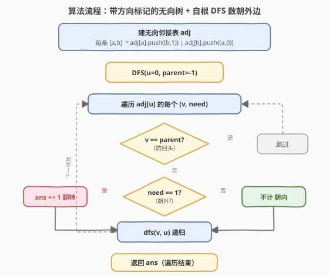
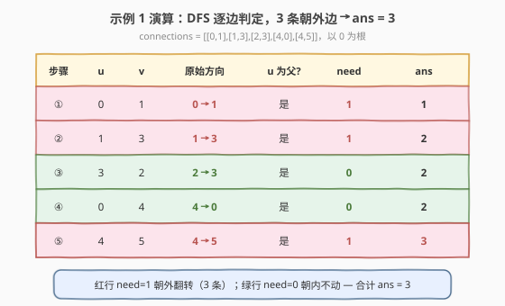

# 重新规划路线

- **题目名称**：重新规划路线
- **链接**：[1466. 重新规划路线](https://leetcode.cn/problems/reorder-routes-to-make-all-paths-lead-to-the-city-zero/)
- **难度**：中等
- **标签**：图、树、深度优先搜索、无向图建图

## 1. 题目概述

`n` 座城市，编号 `0` 到 `n-1`，其间共有 `n-1` 条**有向**路线，路线网形成一棵**树**（任意两座城市间恰有一条路径）。`connections[i] = [a, b]` 表示一条从城市 `a` 指向城市 `b` 的有向路线。

今年城市 0 举办大型比赛，所有游客都要前往城市 0。请你重新规划路线方向（反转若干条有向边），使**每个城市都能到达城市 0**。返回需要变更方向的最小路线数。题目保证重新规划后每个城市都能到达城市 0。

**示例 1**：

```text
输入：n = 6, connections = [[0,1],[1,3],[2,3],[4,0],[4,5]]
输出：3
解释：翻转 [0,1]、[1,3]、[4,5] 三条边后，每个城市均可到达 0。
```

**示例 2**：

```text
输入：n = 5, connections = [[1,0],[1,2],[3,2],[3,4]]
输出：2
解释：翻转 [1,2]、[3,4] 两条边后，每个城市均可到达 0。
```

**示例 3**：

```text
输入：n = 3, connections = [[1,0],[2,0]]
输出：0
解释：所有边已指向 0，无需翻转。
```

**约束条件**：

- $2 \le n \le 5 \times 10^4$
- $\text{connections.length} = n - 1$
- $\text{connections}[i] = [a_i, b_i]$，$0 \le a_i, b_i \le n - 1$，$a_i \ne b_i$
- 不存在重复边，路线网构成一棵树

> 💡 **数据规模提示**：$n$ 可达 $5 \times 10^4$，必须 $O(n)$ 一次遍历，用邻接表建图。递归深度最坏 $O(n)$（链状树），Python 需 `sys.setrecursionlimit` 或改迭代 BFS/DFS。

---

## 2. 解题思路

### 2.1 暴力思路：枚举翻转组合

最朴素的设想：枚举每条边「翻 / 不翻」共 $2^{n-1}$ 种组合，对每种组合检查是否所有城市可达 0。

- **不可行**：$n = 5 \times 10^4$ 时 $2^{n-1}$ 是天文数字。
- 即便贪心地「从 0 出发 BFS，遇到走不通的边就翻转」也需谨慎——必须保证翻转决策**全局最优**，不能局部翻转后破坏其它路径。

> ⚠️ 暴力的核心缺陷：把「翻转哪些边」当成独立的组合爆炸问题。正确思路应利用**树的唯一路径性质**——每个城市到 0 的路径唯一，只需沿该路径检查每条边的方向。

### 2.2 核心观察：以 0 为根建无向树，远离根的边必翻转



把所有有向边**当作无向边**建一棵以 0 为根的树。此时每个非根节点 $v$ 都有唯一的**父节点 $p$**（更靠近 0 的那一端），$v$ 到 0 的唯一路径必经过边 $p\text{-}v$。这条边是否需要翻转，取决于它的**原始方向**：

- **原始方向 $p \to v$（由父指向子，远离 0）**：游客从 $v$ 出发想回 0，但这条边只允许 $p \to v$，$v$ 无法沿它到达 $p$。**必须翻转**，计数 $+1$。
- **原始方向 $v \to p$（由子指向父，指向 0）**：$v$ 已能沿该边直接到达 $p$，进而到达 0。**无需翻转**。

> 💡 **一句话**：每条边是否翻转，**仅由它相对根 0 的朝向决定**——朝外（父→子）的翻，朝内（子→父）的不翻。树的无环性保证了每条边的「父 / 子」身份在以 0 为根后唯一确定，因此 DFS 一遍即可统计答案。

### 2.3 算法流程图



**完整步骤**：

1. **建图（带方向标记）**：对每条 `connections[i] = [a, b]`（原始 $a \to b$）：
   - `adj[a].push((b, 1))` —— 从 $a$ 走向 $b$ 时方向与原始一致，若 $a$ 是父则「远离根」，`need = 1`；
   - `adj[b].push((a, 0))` —— 从 $b$ 走向 $a$ 时方向与原始相反，若 $b$ 是父则「指向根」，`need = 0`。
2. **DFS(u, parent)**，从 `0` 出发，`parent = -1`：
   - 遍历 `adj[u]` 中每个 `(v, need)`，跳过 `v == parent`（防回头）；
   - `ans += need`（此时 `u` 是 `v` 的父节点，`need` 即「该边是否朝外需翻转」）；
   - 递归 `dfs(v, u)`。
3. **答案** = 累加的 `ans`。

> ⚠️ **方向标记的本质**：`need` 标记的是「**从当前端 $u$ 走向邻居 $v$ 时，是否与原始箭头同向**」。DFS 自根向下遍历时 $u$ 恒为父节点，同向即「父→子 = 远离根」，必翻转。把有向边拆成两条带标记的无向半边，一次 DFS 即可判定。

### 2.4 示例演算

以示例 1（`n = 6, connections = [[0,1],[1,3],[2,3],[4,0],[4,5]]`）为例，以 0 为根的无向树如下：



| 步骤 | 当前节点 $u$ | 邻居 $v$ | 原始方向 | $u$ 是否父节点 | `need` | `ans` |
|------|--------------|----------|----------|----------------|--------|-------|
| ① | 0 | 1 | $0 \to 1$ | 是 | 1 | 1 |
| ② | 1 | 3 | $1 \to 3$ | 是 | 1 | 2 |
| ③ | 3 | 2 | $2 \to 3$ | 是（3 为父） | 0 | 2 |
| ④ | 0 | 4 | $4 \to 0$ | 是（0 为父） | 0 | 2 |
| ⑤ | 4 | 5 | $4 \to 5$ | 是 | 1 | **3** |

- **边 0-1**：原始 $0 \to 1$，0 是父 ⟹ 朝外 ⟹ 翻转（`need=1`）。
- **边 1-3**：原始 $1 \to 3$，1 是父 ⟹ 朝外 ⟹ 翻转（`need=1`）。
- **边 3-2**：原始 $2 \to 3$，3 是父 ⟹ 朝内（子 2 指向父 3）⟹ 不翻（`need=0`）。
- **边 0-4**：原始 $4 \to 0$，0 是父 ⟹ 朝内（子 4 指向父 0）⟹ 不翻（`need=0`）。
- **边 4-5**：原始 $4 \to 5$，4 是父 ⟹ 朝外 ⟹ 翻转（`need=1`）。

合计翻转 $3$ 条，与示例输出一致。

> 💡 注意步骤③④：虽然原始箭头分别写作 $2 \to 3$、$4 \to 0$（看似「朝 0」），但判定时看的是「**父→子方向是否与原始同向**」。3 是 2 的父、0 是 4 的父，原始箭头恰好是子→父（朝内），故 `need=0`。

---

## 3. 参考代码

### C++

```cpp
class Solution {
public:
    int minReorder(int n, vector<vector<int>>& connections) {
        vector<vector<pair<int,int>>> adj(n);
        for (auto& c : connections) {
            adj[c[0]].push_back({c[1], 1}); // 原始 a->b：从 a 走向 b（远离根）需翻转
            adj[c[1]].push_back({c[0], 0}); // 从 b 走向 a，与原始相反，无需翻转
        }
        int ans = 0;
        dfs(0, -1, adj, ans);
        return ans;
    }
private:
    void dfs(int u, int parent, vector<vector<pair<int,int>>>& adj, int& ans) {
        for (auto& [v, need] : adj[u]) {
            if (v == parent) continue;
            ans += need;
            dfs(v, u, adj, ans);
        }
    }
};
```

### Python

```python
class Solution:
    def minReorder(self, n: int, connections: List[List[int]]) -> int:
        adj = [[] for _ in range(n)]
        for a, b in connections:
            adj[a].append((b, 1))  # a->b 原方向，从 a 走向 b（远离根）需翻转
            adj[b].append((a, 0))  # 从 b 走向 a，与原方向相反，无需翻转

        ans = 0
        def dfs(u: int, parent: int) -> None:
            nonlocal ans
            for v, need in adj[u]:
                if v == parent:
                    continue
                ans += need
                dfs(v, u)

        dfs(0, -1)
        return ans
```

> 💡 **实现要点**：① 建图时把每条有向边拆成**两条带标记的无向半边**，`need` 标记「此方向是否与原始同向」。② DFS 传 `parent` 防回头（无向邻接表每条边出现两次）。③ `ans += need` 在递归前累加——此时 `u` 是 `v` 的父节点，`need` 恰好表示「该边朝外需翻转」。④ Python 大数据建议 `sys.setrecursionlimit(100000)` 或改用下面的迭代 BFS。

---

## 4. 复杂度分析

| 维度 | DFS / BFS 一次遍历 $O(n)$（推荐） | 暴力枚举 $2^{n-1}$ |
|------|----------------------------------|---------------------|
| **时间复杂度** | $O(n)$ | $O(2^{n-1} \cdot n)$（枚举 + 验证） |
| **空间复杂度** | $O(n)$（邻接表 + 递归栈） | $O(n)$ |
| **建图** | 邻接表 $O(n)$ | 不必建图 |
| **翻转判定** | 方向标记 $O(1)$ 每边 | 需对每种组合重跑可达性 |
| **是否一次遍历** | 是 | 否 |

- **DFS/BFS**：每个节点访问一次、每条半边查一次，合计 $O(n)$；邻接表 $O(n)$ 空间，递归栈最深 $O(n)$（链状树）。是本题最优解。
- **暴力枚举**：$2^{n-1}$ 种翻转组合，每种需 $O(n)$ 验证全可达，完全不可行。

> ⚠️ $n = 5 \times 10^4$ 时 Python 递归深度可达 $5 \times 10^4$，默认上限 1000 必爆栈，需 `sys.setrecursionlimit(100000)` 或改迭代 BFS（见第 5 节）。

---

## 5. 扩展：迭代 BFS（防栈溢出）

把递归 DFS 改成显式队列 BFS，逻辑等价但栈在堆上，无系统栈限制。从 0 出发逐层下探，对每个非父邻居累加 `need`：

```python
from collections import deque

class Solution:
    def minReorder(self, n: int, connections: List[List[int]]) -> int:
        adj = [[] for _ in range(n)]
        for a, b in connections:
            adj[a].append((b, 1))
            adj[b].append((a, 0))

        ans = 0
        q = deque([(0, -1)])
        while q:
            u, parent = q.popleft()
            for v, need in adj[u]:
                if v == parent:
                    continue
                ans += need
                q.append((v, u))
        return ans
```

> 💡 BFS 与 DFS 在本题**完全等价**——只需自根向下遍历一次，遍历顺序不影响结果（每条边的 `need` 与遍历次序无关）。BFS 在链状树时空间仍 $O(n)$（队列），但无系统栈溢出风险，Python 推荐此版。

---

## 6. 面试要点

1. **为什么把有向边当无向边建树？**

   > 题目保证路线网是树（无环连通），且重新规划后每个城市都能到达 0。把边当无向边后，以 0 为根的树结构唯一确定每个节点的父节点，每个城市到 0 的路径也唯一。翻转的本质是「让这条唯一路径上每一段都能朝 0 流通」，故只需检查每条边相对根的方向。

2. **`need` 标记为什么用「是否与原始箭头同向」而非「是否朝外」？**

   > 二者在 DFS 自根向下时**等价**：$u$ 恒为父节点，「从 $u$ 走向 $v$ 与原始同向」⟺「原始是 $u \to v$ = 父→子 = 朝外」。用「同向」编码的好处是**与遍历方向解耦**——建图时只需比较两端与原始箭头，无需预先知道谁是父；DFS 时再凭 `parent` 锁定父节点身份，`need` 自然语义化。

3. **为什么不需要担心翻转一条边后破坏其它城市的可达性？**

   > 树的每条边是**割边**，删除后树分成两棵子树。翻转边 $p\text{-}v$ 只影响 $v$ 子树内的城市能否到达 $p$，不影响其它子树。且 $v$ 子树内的城市到达 0 必经 $p\text{-}v$，只要这条边朝内（$v \to p$）即可，与 $v$ 子树内部如何翻转无关。因此**每条边的翻转决策相互独立**，贪心统计朝外边数即全局最优。

4. **DFS 和 BFS 在本题有区别吗？**

   > 没有本质区别。两者都自根向下一次遍历，时间 $O(n)$、空间 $O(n)$。差异仅在递归栈 vs 队列的实现层面：链状树时 DFS 递归栈深 $O(n)$（Python 易爆栈），BFS 队列宽 $O(1)$ 但仍 $O(n)$ 总空间。Python 大数据推荐迭代 BFS 或 `setrecursionlimit`。

5. **如果图不是树（有环 / 不连通）这思路还成立吗？**

   > 不成立。本题的关键是「每个城市到 0 路径唯一」，这是树的性质。若有环，翻转一条边可能影响多条路径，需用最短路 / 最小树形图等更复杂方法。题目保证是树，故简化为方向统计。

> 💡 **一句话总结**：1466 的灵魂是「**有向树 → 无向建图 + 方向标记 → 自根 DFS 数朝外边**」——利用树的唯一路径性把「翻转最少边使全可达」规约为「统计原始方向远离根的边数」，一次 $O(n)$ 遍历搞定。

---

## 7. 同类练习题

- [1443. 收集树上所有苹果的最小时间](../1401-1500/1443_收集树上所有苹果的最小时间.md)：同样以无向树建邻接表 + DFS 自根遍历，体会「无向建图 + parent 防回头」范式
- [236. 二叉树的最近公共祖先](../0201-0300/236_二叉树最近公共祖先.md)：后序 DFS 向上汇总子树信息，与 1466「自根向下遍历」对照方向相反的树上 DFS
- [797. 所有可能的路径](https://leetcode.cn/problems/all-paths-from-source-to-target/)：有向无环图 DFS 枚举路径，体会纯有向图与「拆成无向半边」的区别
- [1557. 可以到达所有点的最少点数目](https://leetcode.cn/problems/minimum-number-of-vertices-to-reach-all-nodes/)：有向图可达性，贪心找零入度点，对照 1466 的「翻转使可达」
- [841. 钥匙和房间](https://leetcode.cn/problems/keys-and-rooms/)：有向图 BFS/DFS 判全可达，可达性判定的基础题
