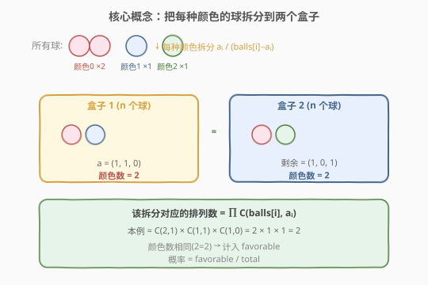
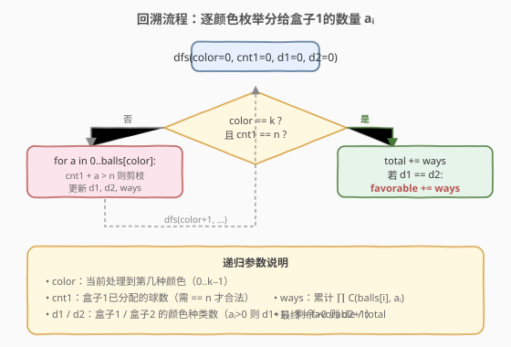

# LeetCode 两个盒子中球的颜色数相同的概率 题解

## 1. 题目概述

- **标题 / 题号**：两个盒子中球的颜色数相同的概率（#1467，hard）
- **链接**：https://leetcode.cn/problems/probability-of-a-two-boxes-having-the-same-number-of-distinct-balls/
- **难度**：困难
- **标签**：数学、组合数学、回溯、概率

**题意**：桌面上有 $2n$ 个颜色不完全相同的球，球的颜色共有 $k$ 种。给你一个大小为 $k$ 的整数数组 `balls`，其中 `balls[i]` 是颜色为 $i$ 的球的数量。

所有的球都已经**随机打乱顺序**，前 $n$ 个球放入第一个盒子，后 $n$ 个球放入另一个盒子。两个盒子是不同的（即分配有先后之分）。请返回「两个盒子中球的颜色数相同」的情况的概率。答案与真实值误差在 $10^{-5}$ 以内被视为正确。

**示例 1**：

```text
输入：balls = [1,1]
输出：1.00000
解释：球平均分配的方式只有两种，两种分配中两盒颜色数都相同，概率 = 2/2 = 1。
```

**示例 2**：

```text
输入：balls = [2,1,1]
输出：0.66667
解释：球的列表为 [1,1,2,3]，12 种等概率打乱方案中 8 种满足两盒颜色数相同。
概率 = 8/12 = 0.66667
```

**示例 3**：

```text
输入：balls = [1,2,1,2]
输出：0.60000
解释：180 种打乱方案中 108 种满足，概率 = 108/180 = 0.6。
```

**约束**：

- `1 <= balls.length <= 8`
- `1 <= balls[i] <= 6`
- `sum(balls)` 是偶数

## 2. 解题思路

### 2.1 暴力思路：枚举所有排列

最直观的暴力做法是把 $2n$ 个球（同色球视为可区分）的全排列都生成出来，前 $n$ 个进盒子 1、后 $n$ 个进盒子 2，统计两盒颜色数相同的比例。但 $2n$ 最大可达 $48$，全排列数量是天文数字，完全不可行。

### 2.2 核心观察：同色球不可区分 → 按"拆分"计数

关键在于**同色球是不可区分的**。决定一个分配方案"外观"的，不是具体哪几个球进了哪个盒子，而是**每种颜色分给盒子 1 的数量 $a_i$**。

设颜色 $i$ 共有 `balls[i]` 个球，其中 $a_i$ 个分给盒子 1、剩余 `balls[i] - a_i` 个分给盒子 2（$0 \le a_i \le \text{balls}[i]$）。一个合法的拆分必须满足：

$$\sum_{i=0}^{k-1} a_i = n$$

即盒子 1 恰好拿到 $n$ 个球。



上图展示了核心直觉：

- 对每种颜色 $i$，把 `balls[i]` 个球拆成 $a_i$（进盒子 1）和 `balls[i] - a_i`（进盒子 2）两部分。
- **盒子 1 的颜色数** $d_1$ = 满足 $a_i > 0$ 的颜色种类数；**盒子 2 的颜色数** $d_2$ = 满足 `balls[i] - a_i > 0` 的颜色种类数。
- 当 $d_1 = d_2$ 时，该拆分计入 favorable。

> 💡 **为什么排列数是 $\prod C(\text{balls}[i], a_i)$？** 因为对每种颜色 $i$，从 `balls[i]` 个同色球中选 $a_i$ 个进盒子 1 有 $C(\text{balls}[i], a_i)$ 种选法；各颜色独立，故总排列数为乘积。这正是多项式系数的拆分。

### 2.3 算法流程图：回溯逐颜色枚举

用回溯逐颜色枚举 $a_i \in [0, \text{balls}[i]]$，沿途累计 `cnt1`（盒子 1 球数）、`d1`/`d2`（两盒颜色数）、`ways`（排列数乘积）。当 `cnt1 > n` 时剪枝。



**递归终止**：`color == k` 时，若 `cnt1 == n` 则把 `ways` 累加到 `total`；若同时 `d1 == d2` 则累加到 `favorable`。最终返回 $\text{favorable} / \text{total}$。

> 💡 **total 的捷径**：由范德蒙恒等式（Vandermonde），$\sum_{\sum a_i = n} \prod C(\text{balls}[i], a_i) = C(2n, n)$，所以 `total` 恒等于 $C(2n, n)$。回溯同时算出 `total` 和 `favorable`，无需单独套公式，但这个恒等式可用于验证正确性。

### 2.4 示例演算

以 `balls = [2,1,1]`（$n = 2$）为例，枚举所有满足 $a_0 + a_1 + a_2 = 2$ 的拆分：

![示例演算：balls=[2,1,1] 的 4 种合法拆分](../images/balls_example_walkthrough.svg)

| 拆分 $(a_0,a_1,a_2)$ | 排列数 $\prod C$ | $d_1$ | $d_2$ | $d_1 = d_2$? | 计入 |
|----------------------|------------------|-------|-------|--------------|------|
| $(0,1,1)$ | $1 \times 1 \times 1 = 1$ | 2 | 1 | 否 | total += 1 |
| $(1,0,1)$ | $2 \times 1 \times 1 = 2$ | 2 | 2 | 是 ✓ | favorable += 2 |
| $(1,1,0)$ | $2 \times 1 \times 1 = 2$ | 2 | 2 | 是 ✓ | favorable += 2 |
| $(2,0,0)$ | $1 \times 1 \times 1 = 1$ | 1 | 2 | 否 | total += 1 |

$\text{total} = 6 = C(4,2)$，$\text{favorable} = 4$，概率 $= 4/6 = 0.66667$，与示例 2 一致。

## 3. 参考代码

### C++

```cpp
class Solution {
  public:
    double getProbability(vector<int>& balls) {
        int k = balls.size();
        int total_balls = 0;
        for (int b : balls) total_balls += b;
        int n = total_balls / 2;

        // 预处理组合数 C[i][j]，balls[i] <= 6
        int C[7][7] = {0};
        for (int i = 0; i <= 6; ++i) {
            C[i][0] = 1;
            for (int j = 1; j <= i; ++j) {
                C[i][j] = C[i - 1][j - 1] + C[i - 1][j];
            }
        }

        long long total = 0, favorable = 0;

        // 回溯：逐颜色枚举分给盒子1的数量 a
        function<void(int, int, int, int, long long)> dfs =
            [&](int color, int cnt1, int d1, int d2, long long ways) {
                if (cnt1 > n) return; // 剪枝：盒子1球数已超
                if (color == k) {
                    if (cnt1 == n) {
                        total += ways;
                        if (d1 == d2) favorable += ways;
                    }
                    return;
                }
                int b = balls[color];
                for (int a = 0; a <= b; ++a) {
                    int nd1 = d1 + (a > 0 ? 1 : 0);
                    int nd2 = d2 + (b - a > 0 ? 1 : 0);
                    dfs(color + 1, cnt1 + a, nd1, nd2, ways * C[b][a]);
                }
            };

        dfs(0, 0, 0, 0, 1);
        return (double)favorable / total;
    }
};
```

### Python

```python
class Solution:
    def getProbability(self, balls: List[int]) -> float:
        from math import comb

        k = len(balls)
        total_balls = sum(balls)
        n = total_balls // 2

        total = 0
        favorable = 0

        def dfs(color: int, cnt1: int, d1: int, d2: int, ways: int) -> None:
            nonlocal total, favorable
            if cnt1 > n:  # 剪枝
                return
            if color == k:
                if cnt1 == n:
                    total += ways
                    if d1 == d2:
                        favorable += ways
                return
            b = balls[color]
            for a in range(b + 1):
                nd1 = d1 + (1 if a > 0 else 0)
                nd2 = d2 + (1 if (b - a) > 0 else 0)
                dfs(color + 1, cnt1 + a, nd1, nd2, ways * comb(b, a))

        dfs(0, 0, 0, 0, 1)
        return favorable / total
```

> ⚠️ **数值范围**：$k \le 8$，`balls[i]` $\le 6$，$2n \le 48$。`ways` 乘积上界 $C(6,3)^8 \approx 2.6 \times 10^{10}$，`total` $= C(48,24) \approx 1.6 \times 10^{13}$，均在 `long long`（Python int 无限）范围内，无需取模。

## 4. 复杂度分析

| 维度 | 复杂度 | 说明 |
|------|--------|------|
| 时间复杂度 | $O(\prod (\text{balls}[i]+1))$ | 每种颜色有 `balls[i]+1` 种取值，回溯枚举所有组合；最坏 $7^8 \approx 5.8 \times 10^6$，剪枝后实际更小 |
| 空间复杂度 | $O(k)$ | 递归深度为颜色数 $k \le 8$；组合数表 $O(1)$ |

> 💡 剪枝 `cnt1 > n` 能在过程中提前剪掉大量无效分支，实际运行远快于最坏上界。

## 5. 扩展：范德蒙恒等式与 total 的捷径

由**范德蒙恒等式**（Vandermonde's identity）的多项式推广：

$$\sum_{\substack{a_0 + \cdots + a_{k-1} = n \\ 0 \le a_i \le \text{balls}[i]}} \prod_{i=0}^{k-1} C(\text{balls}[i],\, a_i) = C\!\left(\sum \text{balls}[i],\, n\right) = C(2n, n)$$

因此 `total` 恒等于 $C(2n, n)$，可直接计算而无需回溯累加。但回溯本身已顺便求出 `total`，且能保证 `favorable` 与 `total` 用同一套枚举逻辑、避免独立计算时的边界遗漏，故代码中保留回溯累加 `total` 的写法，更不易出错。

## 6. 面试要点

1. **为什么不能直接用 $C(2n, n)$ 当分母而忽略同色不可区分？**
   - $C(2n, n)$ 是把所有球视为可区分时的总选法，它确实等于回溯得到的 `total`（范德蒙恒等式）。但**分子**必须按"外观"计数——同一拆分对应 $C(2n,n)$ 中的多种选法，数量正是 $\prod C(\text{balls}[i], a_i)$。分子分母必须用同一套计数口径，回溯天然保证了一致性。

2. **为什么用回溯而不是多重循环？**
   - 颜色数 $k$ 不固定（$1 \le k \le 8$），多重循环的层数无法预先确定；回溯用递归自然处理变长枚举，且可在 `cnt1 > n` 时剪枝。

3. **`d1` 和 `d2` 如何维护？**
   - 对颜色 $i$：若 $a_i > 0$ 则盒子 1 有该色，`d1 += 1`；若 `balls[i] - a_i > 0` 则盒子 2 有该色，`d2 += 1`。注意 $a_i = 0$ 时该色全部进盒子 2，对 `d1` 无贡献但对 `d2` 有贡献。

4. **剪枝 `cnt1 > n` 为什么有效？**
   - `cnt1` 只增不减（$a_i \ge 0$），一旦超过 $n$ 后续只会更大，必然不满足 `cnt1 == n`，可直接返回。

5. **如果 `sum(balls)` 是奇数怎么办？**
   - 题目保证 `sum(balls)` 为偶数，故 $n = \text{sum}/2$ 总是整数；若为奇数则无法平分，题目不出现此情况。

## 同类练习题

| # | 题目 | 与本题的关联 |
|---|------|-------------|
| 39 | [组合总和](https://leetcode.cn/problems/combination-sum/)（[题解](../0001-0100/39_组合总和.md)） | 回溯枚举组合，start 索引去重，与本题逐颜色枚举同骨架 |
| 77 | [组合](https://leetcode.cn/problems/combinations/)（[题解](../0001-0100/77_组合.md)） | 回溯组合模板，剪枝思想相通 |
| 149 | [直线上最多的点数](https://leetcode.cn/problems/max-points-on-a-line/)（[题解](../0101-0200/149_直线上最多的点数.md)） | 哈希 + GCD 化简，组合数学在几何计数中的应用 |
| 172 | [阶乘后的零](https://leetcode.cn/problems/factorial-trailing-zeroes/)（[题解](../0101-0200/172_阶乘后的零.md)） | 勒让德公式数阶乘因子，组合数的底层计算 |
