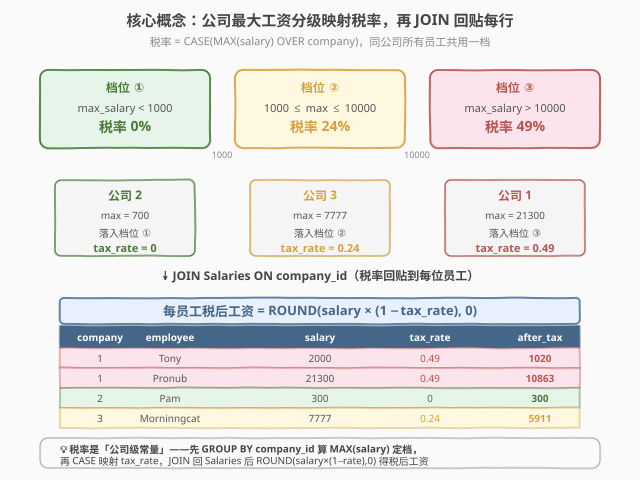
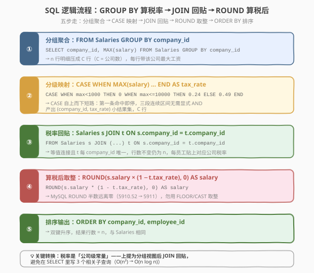
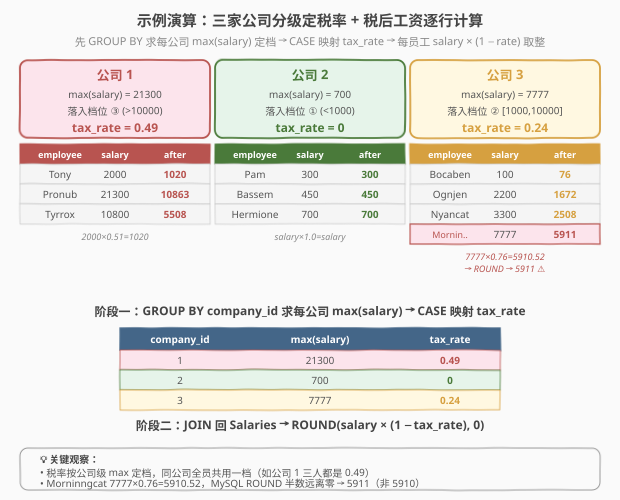

# LeetCode 计算税后工资 题解

> ⚠️ 本题为 **LeetCode Plus 会员专享题**（锁题）。题面依据 GraphQL 接口拿到的建表语句与样例数据重建，语义以力扣原题为准。

## 1. 题目概述

- **标题 / 题号**：计算税后工资（#1468，medium）
- **链接**：https://leetcode.cn/problems/calculate-salaries/
- **难度**：中等
- **标签**：SQL、聚合、`GROUP BY`、子查询、`CASE WHEN`、`JOIN`、窗口函数 `MAX OVER`、`ROUND`、分级税率

**题意**：给定 `Salaries` 表，记录每家公司每位员工的税前工资。税率的确定**不按个人工资**，而是按**该公司工资最大值**所在区间分级：

| 公司最大工资 `max_salary` | 税率 |
|---------------------------|------|
| $< 1000$                  | $0\%$ |
| $\in [1000, 10000]$       | $24\%$ |
| $> 10000$                  | $49\%$ |

编写 SQL 查询，返回每位员工**税后工资**，结果按 `company_id` 升序、再按 `employee_id` 升序排列。税后工资 = $\text{salary} \times (1 - \text{tax\_rate})$，结果**四舍五入到整数**（`ROUND(..., 0)`）。

**表结构**：

```text
Table: Salaries
+---------------+---------+
| Column Name   | Type    |
+---------------+---------+
| company_id    | int     |
| employee_id   | int     |
| employee_name | varchar |
| salary        | int     |
+---------------+---------+
(company_id, employee_id) 是该表的主键。
每行包含某公司某员工的税前工资。
```

**示例 1**：

```text
Salaries 表：
+------------+-------------+---------------+--------+
| company_id | employee_id | employee_name | salary |
+------------+-------------+---------------+--------+
| 1          | 1           | Tony          | 2000   |
| 1          | 2           | Pronub        | 21300  |
| 1          | 3           | Tyrrox        | 10800  |
| 2          | 1           | Pam           | 300    |
| 2          | 7           | Bassem        | 450    |
| 2          | 9           | Hermione      | 700    |
| 3          | 7           | Bocaben       | 100    |
| 3          | 2           | Ognjen        | 2200   |
| 3          | 13          | Nyancat       | 3300   |
| 3          | 15          | Morninngcat   | 7777   |
+------------+-------------+---------------+--------+

输出：
+------------+-------------+---------------+--------+
| company_id | employee_id | employee_name | salary |
+------------+-------------+---------------+--------+
| 1          | 1           | Tony          | 1020   |
| 1          | 2           | Pronub        | 10863  |
| 1          | 3           | Tyrrox        | 5508   |
| 2          | 1           | Pam           | 300    |
| 2          | 7           | Bassem        | 450    |
| 2          | 9           | Hermione      | 700    |
| 3          | 7           | Bocaben       | 76     |
| 3          | 2           | Ognjen        | 1672   |
| 3          | 13          | Nyancat       | 2508   |
| 3          | 15          | Morninngcat   | 5911   |
+------------+-------------+---------------+--------+
```

**解释**：

| 公司 | 公司内工资集合 | 最大工资 | 落入区间 | 税率 | 留成比例 $(1-r)$ |
|------|----------------|----------|----------|------|-------------------|
| 1 | {2000, 21300, 10800} | 21300 | $>10000$ | $49\%$ | $0.51$ |
| 2 | {300, 450, 700} | 700 | $<1000$ | $0\%$ | $1.00$ |
| 3 | {100, 2200, 3300, 7777} | 7777 | $[1000, 10000]$ | $24\%$ | $0.76$ |

以公司 1 的 Tony 为例：$2000 \times 0.51 = 1020$；公司 3 的 Morninngcat：$7777 \times 0.76 = 5910.52 \xrightarrow{\text{ROUND}} 5911$。

**约束**：

- `Salaries` 表行数 $n$ 满足 $1 \le n \le 10^4$
- `salary` 为正整数，取值范围 $[1, 10^7]$
- 结果按 `company_id` 升序、`employee_id` 升序排列

> 💡 **关键点**：税率是**公司级**而非员工级——同公司所有员工共用一个税率，由该公司 $\max(\text{salary})$ 所在区间决定。因此**先聚合求每公司最大工资、再映射税率、最后回贴到每行算税后值**是本题的核心骨架。

## 2. 解题思路

### 2.1 暴力思路：相关子查询逐行算税率

最直觉的写法：对 `Salaries` 每一行，用**相关子查询**实时算「该公司最大工资」，再嵌进 `CASE` 映射税率：

```sql
SELECT company_id, employee_id, employee_name,
       ROUND(salary * (1 - (
           CASE
               WHEN (SELECT MAX(salary) FROM Salaries s2 WHERE s2.company_id = s.company_id) < 1000  THEN 0
               WHEN (SELECT MAX(salary) FROM Salaries s2 WHERE s2.company_id = s.company_id) <= 10000 THEN 0.24
               ELSE 0.49
           END
       )), 0) AS salary
FROM Salaries s
ORDER BY company_id, employee_id;
```

能 AC，但有两个明显问题：

1. **`SELECT` 列表里同一个相关子查询被写了三遍**——每行执行三次 `MAX(salary)` 聚合，且每个 `WHEN` 都要重新算一次，浪费严重；
2. **相关子查询逐行触发**——若 `company_id` 无索引，每行 $O(n)$ 扫描，整体 $O(n^2)$。

> ⚠️ **思路转换**：税率是**公司级常量**——同公司每行的税率都一样。与其逐行实时算，不如**先把每公司的税率算好**（一份小结果集：`company_id → tax_rate`），再 `JOIN` 回原表，让每行直接读到预算好的税率。这是 SQL 中「**标量派生量上提为分组视图**」的标准范式。

### 2.2 核心观察：分组聚合求税率 + JOIN 回贴



把问题拆成两个阶段：

**阶段一：求每公司税率**（行数 = 公司数 $C$，远小于员工数 $n$）

$$\text{tax\_rate}_c = \text{CASE}\Big(\max_{c}(\text{salary})\Big) = \begin{cases} 0 & \text{if } \max_c < 1000 \\ 0.24 & \text{if } 1000 \le \max_c \le 10000 \\ 0.49 & \text{if } \max_c > 10000 \end{cases}$$

```sql
SELECT company_id,
       CASE
           WHEN MAX(salary) <  1000  THEN 0
           WHEN MAX(salary) <= 10000 THEN 0.24
           ELSE 0.49
       END AS tax_rate
FROM Salaries
GROUP BY company_id
```

**阶段二：JOIN 回贴到每行算税后工资**

$$\text{salary}_{\text{after}} = \text{ROUND}\big(\text{salary} \times (1 - \text{tax\_rate}_c),\; 0\big)$$

| 步骤 | 关系 | 行数 |
|------|------|------|
| `Salaries`（左/驱动表）| 全部员工明细 | $n$ |
| `TaxRates`（分组视图）| 每公司一行税率 | $C$ |
| `Salaries JOIN TaxRates USING(company_id)` | 每员工贴上对应公司税率 | $n$（一对一） |

> 💡 **为什么 `GROUP BY` 而不是窗口函数？** 两者都行。`GROUP BY` 把每公司压成一行（丢明细），算完税率后再 JOIN 回明细；窗口函数 `MAX(salary) OVER (PARTITION BY company_id)` 把最大值**贴回每行**（保留明细），免去 JOIN。两者等价，下文给出双解法对照。

**边界区间为何这样切？**

题面三段区间 $<1000$、$\in[1000, 10000]$、$>10000$ 是**连续无重叠**的——`CASE WHEN` 自上而下短路求值，第一个匹配的 `WHEN` 即生效。因此写法等价于：

```sql
CASE
    WHEN max_salary <  1000  THEN 0      -- 命中即停，下一条看不到
    WHEN max_salary <= 10000 THEN 0.24   -- 隐含 max_salary >= 1000
    ELSE 0.49                          -- 隐含 max_salary > 10000
END
```

不必显式写 `AND max_salary >= 1000`——上一条 `WHEN` 已把 $<1000$ 排除。这是 `CASE` 短路语义带来的简洁。

### 2.3 算法流程图



**完整步骤**（解法 A）：

| 步骤 | SQL 子句 | 作用 | 数据变化 |
|------|----------|------|----------|
| ① | `FROM Salaries GROUP BY company_id` | 按公司分组 | $n$ 行 → $C$ 行（$C$ = 公司数） |
| ② | `SELECT company_id, CASE WHEN MAX(salary) ... END AS tax_rate` | 最大工资映射税率 | $C$ 行 `(company_id, tax_rate)` |
| ③ | `Salaries s JOIN TaxRates t ON s.company_id = t.company_id` | 税率回贴到每员工 | $n$ 行（每行带 `tax_rate`） |
| ④ | `SELECT ..., ROUND(s.salary * (1 - t.tax_rate), 0) AS salary` | 算税后工资并取整 | $n$ 行，`salary` 已是整数 |
| ⑤ | `ORDER BY company_id, employee_id` | 双键排序输出 | 排序后的 $n$ 行 |

> 💡 **执行顺序**：① `GROUP BY` 一次扫描算出 $C$ 个公司税率 → ② 把小结果集和原表 `JOIN`（走 `company_id` 索引或哈希连接，每员工 $O(1)$ 拿到税率）→ ③ `ROUND` 标量计算 → ④ `ORDER BY` 排序输出。整条 SQL **只扫两遍** `Salaries`：一次聚合、一次 JOIN 驱动，比暴力相关子查询的 $O(n^2)$ 大幅优化。

### 2.4 示例演算

以题目样例逐步演算，`Salaries` 共 10 行、3 家公司：



**阶段一：分组求税率**（`GROUP BY company_id`）：

| company_id | $\max(\text{salary})$ | 落入区间 | tax_rate |
|------------|------------------------|----------|----------|
| 1 | 21300 | $>10000$ | **0.49** |
| 2 | 700 | $<1000$ | **0** |
| 3 | 7777 | $[1000, 10000]$ | **0.24** |

**阶段二：JOIN 回贴 + 算税后**：

| company_id | employee_id | employee_name | salary | tax_rate | $\text{salary}\times(1-r)$ | ROUND |
|------------|-------------|---------------|--------|----------|----------------------------|-------|
| 1 | 1 | Tony | 2000 | 0.49 | 1020.00 | **1020** |
| 1 | 2 | Pronub | 21300 | 0.49 | 10863.00 | **10863** |
| 1 | 3 | Tyrrox | 10800 | 0.49 | 5508.00 | **5508** |
| 2 | 1 | Pam | 300 | 0 | 300.00 | **300** |
| 2 | 7 | Bassem | 450 | 0 | 450.00 | **450** |
| 2 | 9 | Hermione | 700 | 0 | 700.00 | **700** |
| 3 | 7 | Bocaben | 100 | 0.24 | 76.00 | **76** |
| 3 | 2 | Ognjen | 2200 | 0.24 | 1672.00 | **1672** |
| 3 | 13 | Nyancat | 3300 | 0.24 | 2508.00 | **2508** |
| 3 | 15 | Morninngcat | 7777 | 0.24 | 5910.52 | **5911** |

> ⚠️ **注意 Morninngcat**：$7777 \times 0.76 = 5910.52$，`ROUND(..., 0)` 四舍五入到 5911（不是向下取整 5910，也不是银行家舍入）。MySQL 的 `ROUND` 对正数「四舍五入」，半数（.5）远离零。若用 `FLOOR` 或 `CAST AS INT` 会得到 5910，与期望不符。

## 3. 参考代码

### SQL（解法 A：GROUP BY 子查询 + JOIN，推荐）

```sql
SELECT s.company_id,
       s.employee_id,
       s.employee_name,
       ROUND(s.salary * (1 - t.tax_rate), 0) AS salary
FROM Salaries s
JOIN (
    SELECT company_id,
           CASE
               WHEN MAX(salary) <  1000  THEN 0
               WHEN MAX(salary) <= 10000 THEN 0.24
               ELSE 0.49
           END AS tax_rate
    FROM Salaries
    GROUP BY company_id
) t ON s.company_id = t.company_id
ORDER BY s.company_id, s.employee_id;
```

> 💡 **写法要点**：
> - 子查询 `t` **先分组聚合**：`GROUP BY company_id` + `MAX(salary)` 算每公司最大工资，`CASE` 一步映射成税率。结果只有 $C$ 行（公司数）。
> - 外层 `JOIN ... ON s.company_id = t.company_id` 把税率**回贴**到每位员工。因为是 `company_id` 等值连接，且 `t` 每个 `company_id` 唯一，JOIN 不改变行数（仍为 $n$）。
> - `ROUND(s.salary * (1 - t.tax_rate), 0)`：用预算好的 `tax_rate` 一次性算税后工资并取整。
> - `ORDER BY company_id, employee_id`：题面要求的双键升序。

### SQL（解法 B：窗口函数 `MAX OVER`，更简洁）

```sql
SELECT company_id,
       employee_id,
       employee_name,
       ROUND(salary * (1 - tax_rate), 0) AS salary
FROM (
    SELECT company_id,
           employee_id,
           employee_name,
           salary,
           CASE
               WHEN MAX(salary) OVER (PARTITION BY company_id) <  1000  THEN 0
               WHEN MAX(salary) OVER (PARTITION BY company_id) <= 10000 THEN 0.24
               ELSE 0.49
           END AS tax_rate
    FROM Salaries
) t
ORDER BY company_id, employee_id;
```

> 💡 **窗口函数 vs GROUP BY**：`MAX(salary) OVER (PARTITION BY company_id)` 把「该公司最大工资」**贴回每行**（保留明细），免去外层 JOIN。子查询算出 `tax_rate` 后，外层直接 `ROUND`。代码更短，但 `MAX OVER` 会被 `CASE` 引用两次（两个 `WHEN` 各一次），数据库优化器通常能识别为**同分区共享**只算一遍。若担心重复计算，可用一层 CTE 先算 `max_salary` 再套 `CASE`：

```sql
WITH cs AS (
    SELECT *, MAX(salary) OVER (PARTITION BY company_id) AS ms
    FROM Salaries
)
SELECT company_id, employee_id, employee_name,
       ROUND(salary * (1 -
           CASE WHEN ms < 1000 THEN 0 WHEN ms <= 10000 THEN 0.24 ELSE 0.49 END
       ), 0) AS salary
FROM cs
ORDER BY company_id, employee_id;
```

### Python（pandas）

```python
import pandas as pd

def calculate_salaries(salaries: pd.DataFrame) -> pd.DataFrame:
    max_per_company = salaries.groupby('company_id')['salary'].transform('max')
    tax_rate = pd.cut(
        max_per_company,
        bins=[-1, 999, 10000, float('inf')],
        labels=[0.0, 0.24, 0.49],
    ).astype(float)
    salaries = salaries.copy()
    salaries['salary'] = (salaries['salary'] * (1 - tax_rate)).round().astype(int)
    return salaries.sort_values(['company_id', 'employee_id']).reset_index(drop=True)
```

> 💡 **pandas 对照**：`groupby().transform('max')` 对应 SQL 的 `MAX(salary) OVER (PARTITION BY company_id)`——`transform` 把分组聚合结果贴回每行，正是窗口函数的语义；`pd.cut` 用三段区间标签 `[0, 0.24, 0.49]` 一次映射税率，对应 `CASE WHEN`；`.round().astype(int)` 对应 `ROUND(..., 0)`。注意 `pd.cut` 的区间是**右闭**，需用 `bins=[-1, 999, 10000, inf]` 让 999 落入第一段（$<1000$）、1000~10000 落入第二段、10001+ 落入第三段，严格对齐题面边界。

## 4. 复杂度分析

| 维度 | 复杂度 | 说明 |
|------|--------|------|
| **时间（解法 A）** | $O(n \log n)$ | $n$ = `Salaries` 行数。`GROUP BY company_id` 需排序或哈希聚合 $O(n)$~$O(n \log n)$；JOIN 走 `company_id` 索引或哈希连接 $O(n)$；`ORDER BY` 再排一次 $O(n \log n)$。总体由排序主导 $O(n \log n)$ |
| **时间（解法 B 窗口）** | $O(n \log n)$ | 一个 `MAX OVER (PARTITION BY company_id)` 需按 `company_id` 排序 $O(n \log n)$ + 帧扫描 $O(n)$；外层 `ORDER BY` 再排一次 $O(n \log n)$。与解法 A 同阶，常数更小（少一次 JOIN） |
| **空间** | $O(n)$ | 解法 A 的子查询结果 $O(C)$（$C$ = 公司数 $\le n$）+ JOIN 哈希表 $O(C)$；解法 B 的窗口排序缓冲 $O(n)$ |
| **结果行数** | $O(n)$ | 恒等于 `Salaries` 行数——JOIN 是 `company_id` 等值且子查询每公司唯一，不增不减行 |

| 维度 | 解法 A（GROUP BY + JOIN） | 解法 B（窗口函数） | 暴力（相关子查询×3） |
|------|---------------------------|--------------------|----------------------|
| **时间** | $O(n \log n)$ | $O(n \log n)$ | $O(n^2)$（每行 3 次相关子查询） |
| **扫描次数** | 2 次（聚合 + JOIN） | 1 次（窗口） | $3n$ 次子查询探测 |
| **代码长度** | 中（子查询 + JOIN） | 短（一层嵌套） | 长（CASE 内嵌 3 个子查询） |
| **可读性** | ★★★ 阶段清晰 | ★★★★ 最简洁 | ★★ 冗余 |
| **MySQL 兼容** | ✅ 5.7+ | ✅ 8.0+（窗口函数需 8.0） | ✅ 全版本 |
| **推荐度** | ✅ 兼容性首选 | ✅ 现代首选 | ❌ 不推荐 |

> ⚠️ **窗口函数版本需 MySQL 8.0+**。LeetCode 默认 MySQL 8.0，可用；若面试中遇到老版本 MySQL 5.7，回退到解法 A 的 `GROUP BY` + `JOIN` 写法。

## 5. 扩展

### 5.1 分级税率的三种实现：`CASE WHEN` vs `JOIN 字典表` vs `BETWEEN`

本题税率只有三档，`CASE WHEN` 最直接。若档位很多（如个税累进税率表），可改用**字典表 JOIN**：

```sql
-- 假设有 TaxBrackets(low, high, rate) 字典表
SELECT s.*, ROUND(s.salary * (1 - b.rate), 0) AS after_tax
FROM Salaries s
JOIN TaxBrackets b
  ON (SELECT MAX(salary) FROM Salaries s2 WHERE s2.company_id = s.company_id)
     BETWEEN b.low AND b.high;
```

优点：税率档位变化只改字典表不改 SQL；缺点：需多维护一张表。**少于 5 档用 `CASE WHEN`，多于 5 档用字典表**是经验分界。

### 5.2 `ROUND` 的舍入语义：MySQL vs Python vs 银行家舍入

| 实现 | `ROUND(5910.5, 0)` | 说明 |
|------|---------------------|------|
| **MySQL `ROUND`** | 5911 | 半数**远离零**（round half away from zero），即传统「四舍五入」 |
| **Python `round`** | 5910 | 半数**向偶**（banker's rounding），5910.5 → 5910（最近的偶数） |
| **Python `np.round`** | 5910 | 同 Python `round`，银行家舍入 |
| **`FLOOR(x + 0.5)`** | 5911 | 半数**向上**（对正数等价于远离零） |

> 💡 本题用 MySQL 的 `ROUND`（远离零），pandas 解法中用 `.round()` 默认银行家舍入——在 .5 边界上可能与 MySQL 结果不一致。本题样例没有 .5 边界（5910.52 不是 .5），所以 pandas 解法能过；若测试用例出现 `.5`，pandas 需改用 `(x + 0.5).astype(int)` 的 `FLOOR` 写法对齐 MySQL。

### 5.3 变体：累进税率（分段计税）

本题是**统一税率**——同公司每员工用一个税率乘整工资。若改为**累进税率**（如工资 15000 在 10000~20000 段，前 10000 按 24%、超出 5000 按 49%），需分段求和：

```sql
-- 累进税：salary = 15000, 档位 [0,1000):0%, [1000,10000]:24%, (10000,inf):49%
-- 税 = 0*1000 + 0.24*9000 + 0.49*5000 = 0 + 2160 + 2450 = 4610
-- 税后 = 15000 - 4610 = 10390
```

累进税更复杂，通常用 `LATERAL JOIN` 或递归 CTE 分段累加。本题不涉及，但面试中可能作为 follow-up。

## 6. 面试要点

1. **为什么税率按公司最大工资而不是个人工资？**

   > 这是业务设计——可能反映「公司整体薪酬水平决定税率档位」的税法规则（如对高薪公司征更高税率）。技术上带来一个关键约束：**税率是公司级常量**，同公司每行税率相同。这让「先 `GROUP BY company_id` 算税率再 JOIN 回贴」成为自然解法，避免逐行相关子查询。

2. **`GROUP BY` + `JOIN` 与窗口函数 `MAX OVER` 有何区别？**

   > `GROUP BY` 把每公司压成一行（丢明细），算完税率后需 JOIN 回原表恢复明细；窗口函数 `MAX(salary) OVER (PARTITION BY company_id)` 把最大值贴回每行（保留明细），免去 JOIN。两者等价，窗口函数代码更短但需 MySQL 8.0+；`GROUP BY` + `JOIN` 兼容 5.7。面试中说明「窗口函数省 JOIN、`GROUP BY` 兼容老版本」即可。

3. **`CASE WHEN` 的短路语义如何利用？**

   > `CASE` 自上而下求值，第一个匹配的 `WHEN` 生效，后续分支不再求值。因此写 `WHEN max < 1000 THEN 0; WHEN max <= 10000 THEN 0.24; ELSE 0.49` 时，第二条隐含 `max >= 1000`（否则已被第一条命中），不必显式写 `AND max >= 1000`。这让三段连续无重叠区间的表达简洁清晰。

4. **为什么用 `ROUND(..., 0)` 而不是 `CAST AS INT` 或 `FLOOR`？**

   > 题面要求「四舍五入到整数」，MySQL 的 `ROUND(x, 0)` 对正数半数远离零（5910.5 → 5911），符合传统四舍五入语义。`CAST AS INT` / `FLOOR` 是向下取整（5910.5 → 5910），会少算 1；`CEIL` 向上取整会多算。样例中 Morninngcat 的 $5910.52 \to 5911$ 正是 `ROUND` 行为，验证了这一点。

5. **如果 `Salaries` 表很大（百万行），如何优化？**

   > 三个优化点：① 在 `company_id` 上建索引——`GROUP BY` 和 JOIN 都能走索引；② 子查询只输出 `(company_id, tax_rate)` 两列 $C$ 行，JOIN 时走哈希连接 $O(n)$；③ 若 `company_id` 已有序（如聚簇索引），`GROUP BY` 和 `ORDER BY` 都可省排序，降到 $O(n)$。面试中说明「`company_id` 索引 + 哈希连接 + 排序合并」即可。

> 💡 **一句话总结**：1468 是 SQL「**分组聚合派生标量 + JOIN 回贴**」的招牌题——`GROUP BY company_id` 算每公司最大工资，`CASE WHEN` 三档映射税率，JOIN 回原表后 `ROUND(salary * (1 - tax_rate), 0)` 算税后。核心是识别「税率是公司级常量」从而上提为分组视图，避免逐行相关子查询。

## 同类练习题

| # | 题目 | 与本题的关联 |
|---|------|-------------|
| 184 | [部门工资最高的员工](https://leetcode.cn/problems/department-highest-salary/) | `JOIN` + `GROUP BY MAX`——同样是「分组求极值再 JOIN 回贴」的骨架，1468 在此基础上多了 `CASE` 映射税率和 `ROUND` 计算 |
| 1173 | [即时食物配送 I](https://leetcode.cn/problems/immediate-food-delivery-i/)（[题解](../1101-1200/1173_即时食物配送I.md)） | `SUM(CASE WHEN ...)` 把条件计数转为聚合——对照 1468 的 `CASE WHEN MAX(salary)` 条件映射，理解 `CASE` 在聚合内外的不同用法 |
| 615 | [平均工资：部门与公司比较](https://leetcode.cn/problems/department-average-salary/)（[题解](../0601-0700/615_平均工资部门与公司比较.md)） | `JOIN` + 双窗口聚合——同样是「公司级聚合贴回每行」的范式，1468 是单一 `MAX`，615 是 `AVG` 双层（部门 vs 公司），从单聚合升级到多聚合对比 |
| 1393 | [股票的资本损益](https://leetcode.cn/problems/capital-gainloss/) | `JOIN` + `GROUP BY` + `SUM(CASE)`——按股票分组聚合盈亏，`CASE` 区分买入/卖出的符号，与 1468 的「分组 + CASE 映射」结构同源 |
| 550 | [游戏玩法分析 IV](https://leetcode.cn/problems/game-play-analysis-iv/) | `GROUP BY` + `JOIN` 派生首日登录率——分组求首次登录日再 JOIN 回贴算次日留存，与 1468 的「分组派生标量 + 回贴」思路一致，只是派生量从税率变成首日 |
