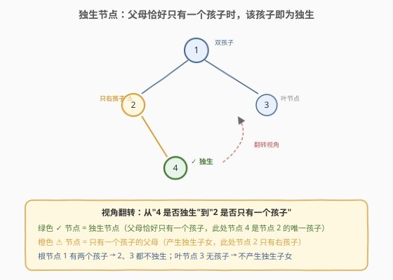
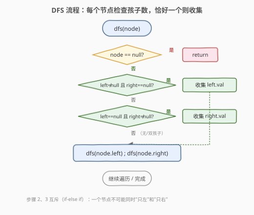
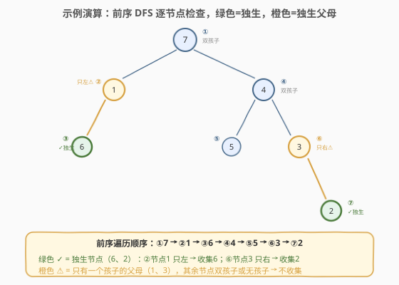

# LeetCode 寻找所有的独生节点 题解

## 1. 题目概述

- **标题 / 题号**：寻找所有的独生节点（#1469，easy）
- **链接**：https://leetcode.cn/problems/find-all-the-lonely-nodes/
- **难度**：简单
- **标签**：树、二叉树、深度优先搜索、前序遍历

**题意**：给定一棵二叉树的根节点 `root`，找出其中所有的**独生节点**（lonely node），返回包含它们值的数组，顺序任意。

> **独生节点**：在二叉树中，一个节点是其父节点的**唯一孩子**——父节点只有这一个子节点（左或右）。根节点没有父节点，因此**永远不会**是独生节点。

**示例 1**：

```text
输入：root = [1,2,3,null,4]
输出：[4]

        1
       / \
      2   3
       \
        4
```

节点 `2` 只有右孩子 `4`，故 `4` 是独生节点。节点 `1` 有两个孩子（`2`、`3`），节点 `3` 无孩子，均不产生独生节点。

**示例 2**：

```text
输入：root = [7,1,4,6,null,5,3,null,null,null,null,null,2]
输出：[6,2]

            7
           / \
          1   4
         /   / \
        6   5   3
                 \
                  2
```

节点 `1` 只有左孩子 `6` → `6` 独生；节点 `3` 只有右孩子 `2` → `2` 独生。其余节点要么双孩子、要么无孩子。

**示例 3**：

```text
输入：root = [11,99,88,77,null,null,66,55,null,null,44,33,null,null,22]
输出：[77,55,66,44,33,22]

                    11
                   /  \
                 99    88
                /       \
               77        66
              /           \
             55            44
            /               \
           33                22
```

每个父节点都恰好只有一个孩子：`99→77`、`77→55`、`55→33`（只左）；`88→66`、`66→44`、`44→22`（只右），6 个孩子全为独生节点。

**约束**：

- 树中节点数目范围 `[1, 1000]`
- `1 <= Node.val <= 10^6`

> 💡 本题是「**视角翻转 + 前序 DFS**」的招牌题。独生性本质是**父节点**的属性——"父母只有一个孩子"，而非子节点自身的属性。把问题从"节点 X 是否独生"翻转为"节点 P 是否有独生子女"，就能顺着树的天然方向（父母→孩子）一次遍历完成收集。

## 2. 解题思路

### 2.1 思路探索：从"逐节点判定"到"逐父母检查"

最直观的切入点：遍历每个节点，判断它是否为独生节点。但"独生"的定义涉及**父节点**——节点自身无法仅凭自身信息判定是否独生，必须知道父节点是否还有另一个孩子。而标准的二叉树节点 `TreeNode` 不带父指针，因此"逐节点判定"需要先建一张父指针映射（额外一次遍历 + 哈希表），再逐节点回查父的孩子数——两次遍历，且引入了不必要的额外结构。

> ⚠️ 问题出在**视角方向**：从"孩子"看"父母"是逆信息流的，需要额外补全父指针；从"父母"看"孩子"是顺信息流的——每个节点天然知道自己的左右孩子。把问题从"节点 `X` 是否独生"翻转为"节点 `P` 是否有独生子女"，就只需一次遍历。

### 2.2 核心观察：视角翻转——检查每个父母的孩子数



**关键洞察**：独生性是**父节点**的属性，不是子节点自身的属性——

> 节点 `X` 是独生节点 ⟺ `X` 的父节点 `P` 恰好只有一个孩子（`P.left == X ∧ P.right == null`，或 `P.left == null ∧ P.right == X`）

因此只需一次**前序 DFS**：在每个节点 `P` 处检查它的左右孩子——

- `P.left != null && P.right == null` → 左孩子是独生，加入结果；
- `P.left == null && P.right != null` → 右孩子是独生，加入结果；
- 两者都 `null`（叶节点）或都非 `null`（双孩子）→ 无独生子女，跳过。

检查完当前节点后，递归进入左右子树继续检查。每个节点只访问一次，每次 $O(1)$ 判定。

> 💡 **异或视角**：恰好一个孩子 ⟺ `left != null` XOR `right != null`。两个条件天然互斥（左独或右独），用 `if-else if` 即可清晰表达。也可统一写成 `if (hasLeft ^ hasRight) ans.add((hasLeft ? left : right).val)`，但拆成两个分支可读性更好。

> 💡 **为什么根节点永远不会是独生？** 根没有父节点，没有任何"父母"会来检查它。DFS 从根开始，根作为**父母**被检查（看它有没有独生子女），但根自身永远不会被任何节点"报告"为独生子女——这与题目定义完全一致。

### 2.3 算法流程图



**DFS 完整步骤**（函数 `dfs(node)` 收集独生节点值到 `ans`）：

1. **空节点**：直接返回（空节点无孩子，不可能有独生子女）；
2. **检查左独**：若 `node.left != null && node.right == null`，则 `node.left` 是独生，`ans.push_back(node.left->val)`；
3. **检查右独**：否则若 `node.left == null && node.right != null`，则 `node.right` 是独生，`ans.push_back(node.right->val)`；
4. **递归**：`dfs(node.left)`，`dfs(node.right)`——继续检查子树。

> ⚠️ **步骤 2 和 3 互斥**：一个节点不可能同时"只有左孩子"和"只有右孩子"。用 `if ... else if ...` 而非两个独立 `if`，虽结果相同（条件互斥），但语义更清晰地表达了"二选一"的关系。

> 💡 **遍历顺序不影响结果**：前序、中序、后序都能正确收集所有独生节点——因为每个节点作为"父母"只被检查一次，检查时机不影响结果。前序最自然（先处理当前节点再递归子树），代码结构也最简洁。

### 2.4 示例演算

以示例 2 `root = [7,1,4,6,null,5,3,null,null,null,null,null,2]` 为例，前序 DFS 遍历顺序与收集过程：



| 前序访问节点 | 左孩子 | 右孩子 | 孩子情况 | 收集独生 | ans |
|-------------|--------|--------|---------|---------|-----|
| ① 根 7 | 1 | 4 | 双孩子 | — | `[]` |
| ② 节点 1 | 6 | null | **只左** | `6` | `[6]` |
| ③ 叶 6 | null | null | 无孩子 | — | `[6]` |
| ④ 节点 4 | 5 | 3 | 双孩子 | — | `[6]` |
| ⑤ 叶 5 | null | null | 无孩子 | — | `[6]` |
| ⑥ 节点 3 | null | 2 | **只右** | `2` | `[6,2]` |
| ⑦ 叶 2 | null | null | 无孩子 | — | `[6,2]` |

最终 `ans = [6, 2]` ✓。节点 `1` 只有左孩子 `6` → 收集 `6`；节点 `3` 只有右孩子 `2` → 收集 `2`。其余节点要么双孩子（`7`、`4`）、要么无孩子（`6`、`5`、`2`），均不产生独生节点。

> 💡 **左独与右独对称**：示例 2 同时覆盖了"只左"（节点 1 → 6）和"只右"（节点 3 → 2）两种情况，验证了 `if-else if` 两分支的正确性。无论独生孩子在左还是在右，都能被准确收集。

## 3. 参考代码

### C++

```cpp
// 1469. 寻找所有的独生节点.cpp —— 前序 DFS + 父母视角检查孩子数
class Solution {
public:
    vector<int> getLonelyNodes(TreeNode* root) {
        vector<int> ans;
        dfs(root, ans);
        return ans;
    }
private:
    void dfs(TreeNode* node, vector<int>& ans) {
        if (!node) return;
        if (node->left && !node->right) {        // 只有左孩子 → 左孩子独生
            ans.push_back(node->left->val);
        } else if (!node->left && node->right) { // 只有右孩子 → 右孩子独生
            ans.push_back(node->right->val);
        }
        dfs(node->left, ans);
        dfs(node->right, ans);
    }
};
```

### Python

```python
class Solution:
    def getLonelyNodes(self, root: Optional[TreeNode]) -> List[int]:
        ans: List[int] = []

        def dfs(node: Optional[TreeNode]) -> None:
            if not node:
                return
            if node.left and not node.right:      # 只有左孩子 → 左孩子独生
                ans.append(node.left.val)
            elif not node.left and node.right:     # 只有右孩子 → 右孩子独生
                ans.append(node.right.val)
            dfs(node.left)
            dfs(node.right)

        dfs(root)
        return ans
```

> 💡 两版逻辑完全一致：`dfs` 在每个节点处检查左右孩子的存在性，恰好一个则收集其值，随后递归左右子树。`ans` 作为引用/闭包变量在递归中共享，无需返回值拼接——这是树形"遍历 + 收集"题的通用写法。

> 💡 **为什么用 `ans` 引用而非返回值拼接？** 本题收集的是值列表而非计数，若用返回值（`return collect(left) + collect(right)`）会产生大量临时 `vector` 拼接，效率低。引用/闭包方式只需一次 `push_back`，$O(n)$ 总追加开销，更高效也更简洁。对比 [1448](../1401-1500/1448_统计二叉树中好节点的数目.md) 用返回值累加整数计数——计数用返回值、收集列表用引用，是树形题的两种惯用法。

## 4. 复杂度分析

| 维度 | 复杂度 | 说明 |
|------|--------|------|
| 时间复杂度 | $O(n)$ | 每个节点只访问一次，每次做 $O(1)$ 的孩子存在性检查 |
| 空间复杂度 | $O(h)$ | 递归栈深度 = 树高 $h$；平衡树 $O(\log n)$，退化链状 $O(n)$ |
| 最坏情况 | $O(n)$ 空间 | 树退化为单侧链时递归深度达 $n$ |

> ⚠️ "逐节点判定 + 父指针映射"方案虽也是 $O(n)$ 时间，但需额外 $O(n)$ 空间存哈希表，且两次遍历常数更大。视角翻转后只需一次遍历、$O(h)$ 栈空间，更优。

## 5. 扩展：BFS 层序遍历

递归写法在树极深时有栈溢出风险（虽然本题 $n \leq 1000$ 不会触发）。用 BFS 层序遍历同样可以完成收集——遍历顺序不同但结果集相同：

```python
from collections import deque

class Solution:
    def getLonelyNodes(self, root: Optional[TreeNode]) -> List[int]:
        ans: List[int] = []
        q = deque([root])
        while q:
            node = q.popleft()
            if node.left and not node.right:      # 只有左孩子
                ans.append(node.left.val)
            elif not node.left and node.right:     # 只有右孩子
                ans.append(node.right.val)
            if node.left:
                q.append(node.left)
            if node.right:
                q.append(node.right)
        return ans
```

```cpp
vector<int> getLonelyNodes(TreeNode* root) {
    vector<int> ans;
    queue<TreeNode*> q;
    q.push(root);
    while (!q.empty()) {
        TreeNode* node = q.front(); q.pop();
        if (node->left && !node->right)
            ans.push_back(node->left->val);
        else if (!node->left && node->right)
            ans.push_back(node->right->val);
        if (node->left)  q.push(node->left);
        if (node->right) q.push(node->right);
    }
    return ans;
}
```

> 💡 **DFS vs BFS**：两者时间都是 $O(n)$。DFS 空间 $O(h)$（递归栈深度），BFS 空间 $O(w)$（队列最宽存一整层节点），平衡树时 $w \approx n/2$ 比 $h = \log n$ 大。本题 $n \leq 1000$，两者均可，面试推荐 DFS 递归版（简洁 + 体现树形遍历理解），BFS 作为防栈溢出的工程备选。

## 6. 面试要点

1. **为什么要"视角翻转"——从父母看而非从孩子看？**

   > 树节点不带父指针，从孩子视角判定"我是否独生"需要先建父指针映射（额外遍历 + 哈希），是逆信息流。从父母视角看"我是否有独生子女"是顺信息流——每个节点天然知道自己的左右孩子，一次 DFS 即可完成。这体现了**顺着数据结构天然方向思考**的原则：遇到"需要父节点信息"的题，先想能否翻转为"在父节点处检查子节点"。

2. **根节点为什么永远不会是独生节点？**

   > 独生的定义是"父节点的唯一孩子"。根节点没有父节点，无从被"报告"为独生。DFS 中根作为**父母**被检查（看它有没有独生子女），但没有任何节点会把根收集进结果——这与题目定义完全一致，无需特判。

3. **`if-else if` 和两个独立 `if` 有区别吗？**

   > "只有左孩子"和"只有右孩子"条件互斥，两种写法结果相同。`if-else if` 语义更清晰地表达互斥关系，且少一次条件判断。也可用异或统一：`bool hasL = node->left, hasR = node->right; if (hasL ^ hasR) ans.push_back((hasL ? node->left : node->right)->val);`，但拆成两分支可读性更好，面试推荐 `if-else if`。

4. **DFS 和 BFS 哪个更好？**

   > 两者时间都是 $O(n)$。DFS 递归空间 $O(h)$（栈深 = 树高），BFS 空间 $O(w)$（队列最宽 = 一层节点数）。平衡树 $h = \log n \ll w \approx n/2$，DFS 更省空间；退化链 $h = w = n$，两者相同。本题 $n \leq 1000$，推荐 DFS（简洁 + 体现树形理解），BFS 作为防栈溢出备选。

5. **如果题目改为"判断树中是否存在独生节点"怎么优化？**

   > 在首次命中独生孩子后立即 `return true` 并终止递归（剪枝）。最坏情况（无独生节点）仍需 $O(n)$ 全遍历，但最好情况（根的孩子就独生）$O(1)$ 即返回。这体现了"收集型"与"判定型"问题的区别——判定型可提前终止，收集型必须遍历完整。

> 💡 **一句话总结**：1469 的灵魂是「**视角翻转 + 前序 DFS**」——把"节点是否独生"翻转为"父母是否有独生子女"，在每个节点处检查左右孩子的存在性，恰好一个则收集其值，一次遍历 $O(n)$ 完成。这道题的核心不在算法复杂度，而在**顺着数据结构天然方向思考**的视角选择。

## 同类练习题

| # | 题目 | 与本题的关联 |
|---|------|-------------|
| 404 | [左叶子之和](https://leetcode.cn/problems/sum-of-left-leaves/)（[题解](../0401-0500/404_左叶子之和.md)） | 同样从**父母视角**检查孩子属性（左孩子是否为叶子），同套"在父节点处判定子节点性质"的视角翻转模板 |
| 1448 | [统计二叉树中好节点的数目](https://leetcode.cn/problems/count-good-nodes-in-binary-tree/)（[题解](../1401-1500/1448_统计二叉树中好节点的数目.md)） | 前序 DFS 向下传递路径最值，在节点处判定收集，同套 DFS + 收集骨架（计数用返回值、列表用引用） |
| 250 | [统计同值子树](https://leetcode.cn/problems/count-univalue-subtrees/)（[题解](../0201-0300/250_统计同值子树.md)） | 后序 DFS 向上传递子树同值性，与本题前序向下检查孩子数对比，体会信息流向决定遍历顺序 |
| 958 | [二叉树的完全性检验](https://leetcode.cn/problems/check-completeness-of-a-binary-tree/)（[题解](../0901-1000/958_二叉树的完全性检验.md)） | 层序遍历检查树结构性质，与本题 BFS 扩展版同套队列遍历模板 |
| 513 | [找树左下角的值](https://leetcode.cn/problems/find-bottom-left-tree-value/)（[题解](../0501-0600/513_找树左下角的值.md)） | BFS 层序遍历定位结构属性，与本题 BFS 扩展版同套层序模板 |
