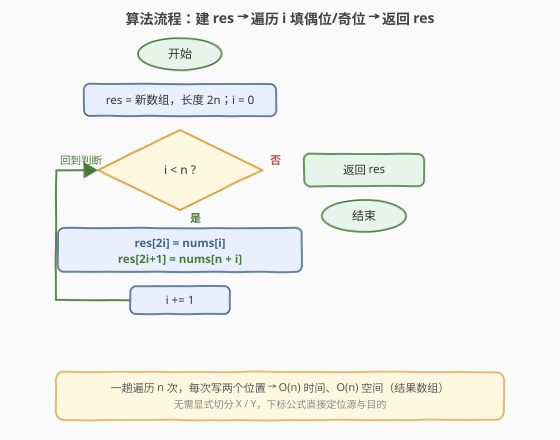

# 重新排列数组

- **题目名称**：重新排列数组
- **链接**：[1470. 重新排列数组](https://leetcode.cn/problems/shuffle-the-array/)
- **难度**：简单
- **标签**：数组、下标映射

## 1. 题目概述

给你一个数组 `nums`，它由 $2n$ 个元素组成，形如 `[x1, x2, ..., xn, y1, y2, ..., yn]`（前半段是 $n$ 个 $x$，后半段是 $n$ 个 $y$）。再给你一个整数 `n`。请将数组**重新排列**为 `[x1, y1, x2, y2, ..., xn, yn]` 并返回——即把前后两半**交错拼接**：一个 $x$、一个 $y$ 交替排列。

**示例 1**：

```text
输入：nums = [2,5,1,3,4,7], n = 3
输出：[2,3,5,4,1,7]
解释：x = [2,5,1]，y = [3,4,7]，交错得 [2,3,5,4,1,7]
```

**示例 2**：

```text
输入：nums = [1,2,3,4], n = 2
输出：[1,3,2,4]
解释：x = [1,2]，y = [3,4]，交错得 [1,3,2,4]
```

**示例 3**：

```text
输入：nums = [1,2,3,4,4,5,6,7], n = 4
输出：[1,4,2,5,3,6,4,7]
解释：x = [1,2,3,4]，y = [4,5,6,7]，交错得 [1,4,2,5,3,6,4,7]
```

**约束条件**：

- $1 \le n \le 500$
- $\text{nums.length} = 2n$
- $1 \le \text{nums}[i] \le 10^3$

> 💡 **关键点**：输入结构是固定的「前 $n$ 个 $x$ + 后 $n$ 个 $y$」，目标结构也是固定的「$x,y,x,y,\dots$ 交错」。两端的排列关系**完全由下标决定**，与元素值无关——这是一道**纯下标映射**题，只需找出「源下标 $\to$ 目的下标」的公式，一趟遍历即可。

---

## 2. 解题思路

### 2.1 暴力思路：显式拆分两半再交错合并

最直观的做法：先把 `nums` 切成两个独立数组 `X = nums[0..n-1]`、`Y = nums[n..2n-1]`（各 $n$ 个元素，额外 $2n$ 空间），再用一个循环交替从 `X`、`Y` 取元素塞进结果数组。

- **正确**：显式分离 $X$、$Y$ 后交错合并，逻辑清晰、必然正确；
- **冗余**：多开了两个长度为 $n$ 的辅助数组（共 $2n$ 额外空间），而 `nums` 本身已经按 `[X | Y]` 的顺序排好——**根本不必复制出来**，用下标就能直接定位 $x_i = \text{nums}[i]$、$y_i = \text{nums}[n+i]$。

> ⚠️ 暴力的浪费在于「**把数据搬出来再合并**」。其实源数组天然分两半，下标算术就能让两半直接「原地对话」，省掉拆分步骤。

### 2.2 核心观察：下标映射公式

![核心观察：两半 [X | Y] 按下标交错 → res[2i]=nums[i]，res[2i+1]=nums[n+i]](../images/1470_concept.svg)

把源数组看成 `[X | Y]` 两段：前半 $X$ 在下标 $[0, n)$，后半 $Y$ 在下标 $[n, 2n)$。目标是把 $x_i$ 放到结果的**偶数位**、$y_i$ 放到**奇数位**：

$$\text{res}[2i] = \text{nums}[i] \qquad (\text{偶位放 } x_i)$$

$$\text{res}[2i+1] = \text{nums}[n+i] \qquad (\text{奇位放 } y_i)$$

其中 $i = 0, 1, \dots, n-1$。一趟遍历 $n$ 次，每次写两个相邻位置，正好填满 $2n$ 个位置。

> 💡 **一句话**：识别出「$x_i$ 在源下标 $i$、$y_i$ 在源下标 $n+i$；目的下标分别是 $2i$、$2i+1$」——一组线性下标公式就把问题变成「循环填表」，无需任何切分。

> ⚠️ **为什么是 $2i$ 与 $2i+1$**：交错排列时，第 $i$ 组 $(x_i, y_i)$ 在结果中恰好占据第 $2i$、$2i+1$ 个位置（从 0 开始计）。偶/奇位之分正是「交错」的代数刻画。$n$ 组共 $2n$ 个位置，$i$ 从 $0$ 到 $n-1$ 完整覆盖，无重复无遗漏。

### 2.3 算法流程图



**完整步骤**：

1. **建结果数组** `res`，长度 $2n$；初始化下标 `i = 0`；
2. **循环** `i` 从 `0` 到 `n-1`：
   - `res[2*i] = nums[i]`（偶位取前半段的 $x_i$）；
   - `res[2*i+1] = nums[n+i]`（奇位取后半段的 $y_i$）；
3. **返回** `res`。

> 💡 也可换用「按目的下标遍历」的视角：对 $j = 0 \dots 2n-1$，若 $j$ 为偶数则 `res[j] = nums[j/2]`，若 $j$ 为奇数则 `res[j] = nums[n + (j-1)/2]`。两种视角等价，按源 $i$ 遍历更简洁（每轮写两格，循环 $n$ 次而非 $2n$ 次）。

### 2.4 示例演算

以示例 1 的 `nums = [2,5,1,3,4,7]`、`n = 3` 为例：

![示例演算：nums = [2,5,1,3,4,7]，n = 3](../images/1470_example_walkthrough.svg)

| $i$ | $\text{nums}[i]$（$x_i$） | $\text{nums}[n+i]$（$y_i$） | $\text{res}[2i]$ | $\text{res}[2i+1]$ | res 进展 |
|-----|---------------------------|------------------------------|-------------------|---------------------|-----------|
| 0 | 2 | 3 | $\text{res}[0]=2$ | $\text{res}[1]=3$ | `[2,3,_,_,_,_]` |
| 1 | 5 | 4 | $\text{res}[2]=5$ | $\text{res}[3]=4$ | `[2,3,5,4,_,_]` |
| 2 | 1 | 7 | $\text{res}[4]=1$ | $\text{res}[5]=7$ | `[2,3,5,4,1,7]` |

- **第 ① 步**：$X = \text{nums}[0..2] = [2,5,1]$，$Y = \text{nums}[3..5] = [3,4,7]$。
- **第 ② 步**：$i=0$ 取 $(x_0, y_0) = (2, 3)$ 写入 $\text{res}[0], \text{res}[1]$；$i=1$ 取 $(5, 4)$ 写入 $\text{res}[2], \text{res}[3]$；$i=2$ 取 $(1, 7)$ 写入 $\text{res}[4], \text{res}[5]$。
- **结果**：`[2,3,5,4,1,7]` ✓。

> 以示例 2 `[1,2,3,4]`、$n=2$ 验证：$X=[1,2]$、$Y=[3,4]$；$i=0$→$(1,3)$ 写入 res[0],res[1]；$i=1$→$(2,4)$ 写入 res[2],res[3] ⟹ `[1,3,2,4]` ✓。示例 3 同理，$n=4$ 四轮填满 8 格。

---

## 3. 参考代码

### C++

```cpp
class Solution {
public:
    vector<int> shuffle(vector<int>& nums, int n) {
        vector<int> res(2 * n);
        for (int i = 0; i < n; ++i) {
            res[2 * i]     = nums[i];
            res[2 * i + 1] = nums[n + i];
        }
        return res;
    }
};
```

### Python

```python
class Solution:
    def shuffle(self, nums: List[int], n: int) -> List[int]:
        res = [0] * (2 * n)
        for i in range(n):
            res[2 * i]     = nums[i]
            res[2 * i + 1] = nums[n + i]
        return res
```

### Python（一行推导式）

```python
class Solution:
    def shuffle(self, nums: List[int], n: int) -> List[int]:
        return [nums[i // 2 + n * (i % 2)] for i in range(2 * n)]
```

> 💡 **实现要点**：① `res` 预分配 $2n$ 大小，避免动态 `push_back` 的重分配开销；② 循环按源下标 $i$ 走 $n$ 次、每轮写两格，比按目的下标走 $2n$ 次少一半迭代；③ 一行推导式用「$j$ 偶 → `nums[j//2]`、$j$ 奇 → `nums[n + (j-1)//2]`」，由于 $j$ 奇时 `(j-1)//2 == j//2`，统一为 `nums[j//2 + n*(j%2)]`，简洁但可读性略低。

---

## 4. 复杂度分析

| 维度 | 下标映射 $O(n)$（推荐） | 显式拆分两半 |
|------|------------------------|--------------|
| **时间复杂度** | $O(n)$ | $O(n)$ |
| **空间复杂度** | $O(n)$（仅结果数组） | $O(n)$（结果）+ $O(n)$（两个半段副本）|
| **是否切分** | 否，下标直接定位 | 是，复制出 $X$、$Y$ |
| **每轮操作** | 两次赋值 | 两次取值 + 两次赋值 |

- **下标映射**：一趟遍历 $n$ 次，每次 $O(1)$ 两次赋值，合计 $O(n)$；额外仅结果数组 $O(n)$（按题意输出不计则 $O(1)$ 工作空间）。是本题最优解。
- **显式拆分**：复制两半各 $O(n)$，合并 $O(n)$，合计仍是 $O(n)$ 时间；但多出 $O(n)$ 辅助空间存 $X$、$Y$，常数更大、且毫无必要——源数组已按半段顺序排好。

> ⚠️ 两种写法时间同为 $O(n)$，渐近无差异。下标映射法的优势在**空间常数更小、代码更短**：省掉拆分步骤，循环内直接 `nums[i]`、`nums[n+i]` 取值。本题下界 $O(n)$（至少要写出 $2n$ 个结果），已最优。

---

## 5. 扩展：原地重排（位运算打包，$O(1)$ 额外空间）

上述解法用了 $O(n)$ 结果数组。若题目进一步要求**原地**修改 `nums`（不开新数组），可借助**位运算打包**——把一对 $(x_i, y_i)$ 塞进同一个整数的不同比特段，从而在原数组里完成交错。

**可行性**：约束 $\text{nums}[i] \le 10^3 < 2^{10} = 1024$，每个值最多占 10 bit。一个 `int`（通常 32 bit）可同时容纳两个值：高 10 bit 存 $x_i$，低 10 bit 存 $y_i$。

**两阶段算法**：

1. **打包阶段**：对 $i = 0 \dots n-1$，把 $\text{nums}[i]$ 与 $\text{nums}[n+i]$ 打包存回 $\text{nums}[i]$：

   $$\text{nums}[i] = (\text{nums}[i] \ll 10) \mid \text{nums}[n+i]$$

   此时 $\text{nums}[i]$ 的高 10 bit 是 $x_i$、低 10 bit 是 $y_i$；$\text{nums}[n+i]$ 成为冗余副本。

2. **解包阶段**：对 $i = n-1 \dots 0$（**倒序**，避免覆盖未读数据），从 $\text{nums}[i]$ 拆出 $(x_i, y_i)$ 写到目的位置：

   $$x_i = \text{nums}[i] \gg 10, \quad y_i = \text{nums}[i] \,\&\, 0\text{x}3\text{FF}$$

   $$\text{nums}[2i] = x_i, \quad \text{nums}[2i+1] = y_i$$

**为什么倒序**：解包时从 $\text{nums}[i]$ 读数据、写到 $\text{nums}[2i]$ 与 $\text{nums}[2i+1]$。因 $2i \ge i$（$i \ge 0$），写入位置始终 $\ge$ 当前读取位置；倒序遍历保证「尚未读取」的位置 $j < i$ 永远不会被写操作波及（写到的 $2i, 2i+1 \ge i > j$），数据安全。

```cpp
class Solution {
public:
    vector<int> shuffle(vector<int>& nums, int n) {
        for (int i = 0; i < n; ++i) {
            nums[i] = (nums[i] << 10) | nums[n + i];
        }
        for (int i = n - 1; i >= 0; --i) {
            int xi = nums[i] >> 10;
            int yi = nums[i] & 0x3FF;
            nums[2 * i]     = xi;
            nums[2 * i + 1] = yi;
        }
        return nums;
    }
};
```

- **时间**：两趟各 $O(n)$，合计 $O(n)$；
- **空间**：$O(1)$（原地，仅用若干临时变量）。

> 💡 **位运算打包的通用模式**：当数据值域有界（每个值 $\le 2^k$）且需要在一个槽里暂存两个值时，用「高位存 A、低位存 B」的打包技巧是经典手法——[136. 只出现一次的数字](../0101-0200/136_只出现一次的数字.md) 之外的众多「原地标记」题（如 [289. 生命游戏](../0201-0300/289_生命游戏.md) 用次低位存下一态）都属同源思想。前提是值域小、且 `int` 位宽足够容纳两值之和。

> ⚠️ 打包法依赖 $\text{nums}[i] \le 10^3$ 这一约束。若值域放宽到 $10^9$（接近 $2^{30}$），两个值无法塞进 32 bit `int`，需改用 64 bit `long long`，或退回辅助数组法。面试时给出辅助数组解法后，可主动提及「值域有界时可位运算原地化」作为加分项。

---

## 6. 面试要点

1. **如何快速想到下标公式？**

   > 观察源与目的的结构：源是 `[x0..xn-1, y0..yn-1]`，目的是 `[x0, y0, x1, y1, ...]`。第 $i$ 组 $(x_i, y_i)$ 在源里分别位于 $i$ 和 $n+i$，在目的里相邻占据 $2i$、$2i+1$。把这两组下标对应起来即得公式，无需记忆——「交错」就是偶/奇位之分。

2. **为什么按源 $i$ 遍历而非按目的 $j$ 遍历？**

   > 按源 $i$ 走 $n$ 次，每轮写两个相邻位置 `res[2i]`、`res[2i+1]`，循环次数减半、代码成对出现更直观。按目的 $j$ 走 $2n$ 次则需用奇偶判断选源下标（`j` 偶取 `nums[j/2]`、`j` 奇取 `nums[n + j/2]`），多一次分支。两者等价，前者更简洁。

3. **原地打包解法为什么要倒序解包？**

   > 解包时读 `nums[i]`、写 `nums[2i]` 和 `nums[2i+1]`，而 $2i \ge i$。若正序遍历，写到 $2i$（$> i$）可能破坏后续才要读取的 `nums[2i]`（若 $2i < n$，它还存着未解包的数据）。倒序遍历让「未读位置」$j < i$ 永远落在写入位置 $2i, 2i+1$（$\ge i$）之外，互不干扰。

4. **打包法对值域有何依赖？**

   > 需要每个值 $\le 2^k$ 且 $2k \le$ 整数位宽。本题 $\text{nums}[i] \le 10^3 < 2^{10}$，两值共 20 bit，远小于 32 bit `int`，安全。若值域升到 $10^9$（$\approx 2^{30}$），两值需 60 bit，超出 `int`，须用 `long long` 或放弃原地法。

5. **这道题和「数组轮转 / 旋转」类下标映射题有何异同？**

   > 同属「源下标 $\to$ 目的下标」的线性映射，但映射关系不同：1470 是「两半交错」，映射 $i \to 2i$、$n+i \to 2i+1$（分段线性）；[189. 轮转数组](../0101-0200/189_轮转数组.md) 是「整体平移」，映射 $i \to (i+k) \bmod n$（循环移位）。两者都靠下标公式一趟完成，但 1470 的偶/奇分段更简单，189 的取模循环更需小心环状置换。

> 💡 **一句话总结**：1470 的灵魂是「**下标映射公式**」——$x_i$ 落偶位 $2i$、$y_i$ 落奇位 $2i+1$，源下标分别是 $i$ 与 $n+i$，一趟 $O(n)$ 搞定；值域有界时可用位运算打包升级为 $O(1)$ 原地。

---

## 7. 同类练习题

- [1089. 复写零](https://leetcode.cn/problems/duplicate-zeros/)（[题解](../1001-1100/1089_复写零.md)）：同属「原地数组重排 + 下标映射」——把每个零复制一份，需从后向前写以避免覆盖未读数据，与 1470 原地解包的倒序技巧同源
- [189. 轮转数组](https://leetcode.cn/problems/rotate-array/)（[题解](../0101-0200/189_轮转数组.md)）：下标映射家族——映射 $i \to (i+k) \bmod n$，用环状置换或翻转法原地完成，对照 1470 的「分段线性映射」体会不同映射的写法
- [1104. 二叉树寻路](https://leetcode.cn/problems/path-in-zigzag-labelled-binary-tree/)（[题解](../1101-1200/1104_二叉树寻路.md)）：下标算术进阶——完全二叉树父/子下标公式 + 锯齿层反向编号，与 1470 同属「用下标数学直接定位」的思想，但推导更复杂
- [283. 移动零](https://leetcode.cn/problems/move-zeroes/)（[题解](../0201-0300/283_移动零.md)）：原地数组重排——快慢双指针把零挪到末尾，对照 1470 的「开辅助数组」与「原地」两种空间取舍
