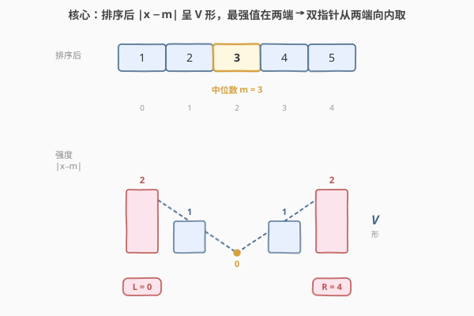

# 数组中的 k 个最强值

- **题目名称**：数组中的 k 个最强值
- **链接**：[1471. 数组中的 k 个最强值](https://leetcode.cn/problems/the-k-strongest-values-in-an-array/)
- **难度**：中等
- **标签**：数组、排序、双指针

## 1. 题目概述

给你一个整数数组 `arr` 和一个整数 `k`。设 `m` 为数组的中位数——即数组**升序排序**后下标 `((n-1)/2)` 处的元素（下标从 0 开始，取**下位中位数**）。

定义「强度」为元素到中位数的距离 $|x - m|$。`arr[i]` 比 `arr[j]` **更强**当且仅当：

- $|\text{arr}[i] - m| > |\text{arr}[j] - m|$，**或**
- $|\text{arr}[i] - m| = |\text{arr}[j] - m|$ 且 $\text{arr}[i] > \text{arr}[j]$（强度并列时，**值更大者更强**）。

请返回数组中最强的 `k` 个值，**顺序任意**。

**示例 1**：

```text
输入：arr = [1,2,3,4,5], k = 2
输出：[5,1]
解释：排序后 [1,2,3,4,5]，中位数 m = arr[(5-1)/2] = arr[2] = 3。
      强度：|1-3|=2, |2-3|=1, |3-3|=0, |4-3|=1, |5-3|=2。
      按从强到弱排序得 [5,1,4,2,3]（5 与 1 强度并列，5>1 故 5 更强）。
      最强两个为 [5,1]。[1,5] 同样正确。
```

**示例 2**：

```text
输入：arr = [1,1,3,5,5], k = 2
输出：[5,5]
解释：排序后 [1,1,3,5,5]，中位数 m = arr[2] = 3。
      强度：|1-3|=2, |1-3|=2, |3-3|=0, |5-3|=2, |5-3|=2。
      按从强到弱排序得 [5,5,1,1,3]。最强两个为 [5,5]。
```

**示例 3**：

```text
输入：arr = [6,7,11,7,6,8], k = 5
输出：[11,8,6,6,7]
解释：排序后 [6,6,7,7,8,11]，n=6，中位数 m = arr[(6-1)/2] = arr[2] = 7。
      强度：|6-7|=1, |6-7|=1, |7-7|=0, |7-7|=0, |8-7|=1, |11-7|=4。
      按从强到弱排序得 [11,8,6,6,7,7]。最强五个为 [11,8,6,6,7]（任意排列均可）。
```

**约束条件**：

- $1 \le \text{arr.length} \le 10^5$
- $-10^5 \le \text{arr}[i] \le 10^5$
- $1 \le k \le \text{arr.length}$

> 💡 **关键点**：强度的定义是「到中位数的距离」，而中位数本身要靠排序得到。一旦数组有序，距离函数 $|x - m|$ 随 $x$ 从小到大呈现**先减后增的 V 形**——中位数处最小、两端最大。这意味着**最强值必然聚在排序数组的两端**，于是「取最强 k 个」等价于「从两端向内双指针取 k 个」。

---

## 2. 解题思路

### 2.1 暴力思路：算强度 + 整体按强度排序 + 取前 k

最直观的做法分三步：

1. 先排序数组取中位数 $m = \text{arr}[(n-1)/2]$（$O(n \log n)$）；
2. 再对**每个元素**算强度 $|x - m|$，用**自定义比较器**对整个数组按「强度降序、强度并列时值降序」**再排一次序**（$O(n \log n)$）；
3. 取前 $k$ 个（$O(k)$）。

- **正确**：强度比较规则可直接写成比较器，整体排序后前 $k$ 个即为所求；
- **冗余**：① 排了**两次**序（一次取中位数、一次按强度），常数翻倍；② 只需要 $k$ 个却对全部 $n$ 个按强度排好，做了大量无用功；③ 完全没利用「强度随排序下标呈 V 形」这一几何结构。

> ⚠️ 暴力的浪费在于「**对全部元素做第二次排序**」。其实第一次排序后，强度的分布形状已经确定——它是一个以中位数为谷底的 V 形。最强值就在两端，根本不必再排第二次，只需从两端往中间「摘」即可。

### 2.2 核心观察：排序后强度呈 V 形 → 双指针从两端取



数组升序排序后，中位数 $m$ 落在下标 $(n-1)/2$ 处。考察强度函数 $f(x) = |x - m|$ 在排序数组上随下标的变化：

$$
\underbrace{\text{arr}[0] \le \cdots \le \text{arr}[mid]}_{\text{左半} \le m,\ f \text{ 单调递减}} \quad \le \quad \underbrace{\text{arr}[mid] \le \cdots \le \text{arr}[n-1]}_{\text{右半} \ge m,\ f \text{ 单调递增}}
$$

- **左半**（$\text{arr}[i] \le m$）：$f(x) = m - x$，随 $x$ 增大而**递减**，即越靠左端值越小、强度越大；
- **右半**（$\text{arr}[i] \ge m$）：$f(x) = x - m$，随 $x$ 增大而**递增**，即越靠右端值越大、强度越大。

合起来，$f$ 沿排序数组呈 **V 形（先减后增）**，谷底在中位数处。**全局最大强度必在两端之一**——左端 $\text{arr}[0]$ 或右端 $\text{arr}[n-1]$。

> 💡 **关键推论**：取最强 $k$ 个，等价于在排序数组两端用双指针 $l=0, r=n-1$，每轮比较两端强度，**取较大者**；取走后对应指针向内收缩一步。重复 $k$ 轮即得答案。

**并列时的处理**：当 $|\text{arr}[r] - m| = |\text{arr}[l] - m|$ 时，规则要求「值更大者更强」。因数组有序，$\text{arr}[r] \ge \text{arr}[l]$ 恒成立，故并列时**取右端**。因此判定写为：

$$
|\text{arr}[r] - m| \ge |\text{arr}[l] - m| \implies \text{取右端 } \text{arr}[r],\ r \mathrel{-}= 1
$$

否则取左端 $\text{arr}[l],\ l \mathrel{+}= 1$。这里的 $\ge$ 一并覆盖了「右端严格更强」和「并列取大值」两种情形，无需单独写并列分支。

> ⚠️ 此双指针**不是**普通有序数组的对撞双指针（左右元素满足某种和/差关系），而是**贪心摘取**：每轮从两端挑一个最强者拿走。V 形保证「次强者」必然仍是剩余区间的某一端，故贪心选择安全、无后效性。

### 2.3 算法流程图


**完整步骤**：

1. **排序**：对 `arr` 升序排序（$O(n \log n)$）；
2. **取中位数**：`m = arr[(n - 1) / 2]`（$O(1)$）；
3. **初始化双指针**：`l = 0, r = n - 1`，结果数组 `res` 预分配 $k$；
4. **循环** $k$ 轮，每轮：
   - 若 $|\text{arr}[r] - m| \ge |\text{arr}[l] - m|$：`res[i] = arr[r]`，`r--`；
   - 否则：`res[i] = arr[l]`，`l++`；
5. **返回** `res`。

> 💡 第 4 步循环恒执行 $k$ 轮即止，不等到 $l > r$——因为题目保证 $k \le n$，取走 $k$ 个时两端必有剩余。$k = n$ 的极端情形下恰好取完全部元素，双指针最终 $l = r + 1$，结果就是按强度降序的全排列。

### 2.4 示例演算

以示例 1 的 `arr = [1,2,3,4,5]`、`k = 2` 为例：

![示例演算：arr = [1,2,3,4,5]，k = 2](../images/1471_example_walkthrough.svg)

排序后 `arr = [1,2,3,4,5]`，$n=5$，$m = \text{arr}[2] = 3$，强度序列 $[2,1,0,1,2]$。

| 轮次 | $l$ | $\text{arr}[l]$ | $|\text{arr}[l]-m|$ | $r$ | $\text{arr}[r]$ | $|\text{arr}[r]-m|$ | 比较 | 取 | res 进展 |
|------|-----|------------------|----------------------|-----|------------------|----------------------|------|------|-----------|
| 1 | 0 | 1 | 2 | 4 | 5 | 2 | $2 \ge 2$ ✓ | 右端 5 | `[5]` |
| 2 | 0 | 1 | 2 | 3 | 4 | 1 | $2 \ge 1$（左更强） | 左端 1 | `[5,1]` |

- **第 ① 步**：$l=0$（值 1，强度 2）、$r=4$（值 5，强度 2）。强度并列，$\text{arr}[r]=5 \ge \text{arr}[l]=1$，取**右端 5**，$r \to 3$；
- **第 ② 步**：$l=0$（值 1，强度 2）、$r=3$（值 4，强度 1）。左端强度 2 > 右端 1，取**左端 1**，$l \to 1$；
- **结果**：`[5,1]` ✓（与官方答案一致，顺序任意均可）。

> 以示例 3 `[6,6,7,7,8,11]`、$k=5$、$m=7$ 验证：强度 $[1,1,0,0,1,4]$。第 1 轮右端 11(强 4) 远胜左端 6(强 1) → 取 11；第 2 轮左 6(1) 与右 8(1) 并列取右 8；第 3、4 轮左端 6、6 强度 1 > 右端 7、7 强度 0 → 取 6、6；第 5 轮并列取右 7。结果 `[11,8,6,6,7]` ✓。

---

## 3. 参考代码

### C++

```cpp
class Solution {
public:
    vector<int> getStrongest(vector<int>& arr, int k) {
        sort(arr.begin(), arr.end());
        int n = arr.size();
        int m = arr[(n - 1) / 2];
        vector<int> res(k);
        int l = 0, r = n - 1;
        for (int i = 0; i < k; ++i) {
            if (abs(arr[r] - m) >= abs(arr[l] - m)) {
                res[i] = arr[r--];
            } else {
                res[i] = arr[l++];
            }
        }
        return res;
    }
};
```

### Python

```python
class Solution:
    def getStrongest(self, arr: List[int], k: int) -> List[int]:
        arr.sort()
        m = arr[(len(arr) - 1) // 2]
        res = []
        l, r = 0, len(arr) - 1
        for _ in range(k):
            if abs(arr[r] - m) >= abs(arr[l] - m):
                res.append(arr[r])
                r -= 1
            else:
                res.append(arr[l])
                l += 1
        return res
```

### Python（自定义比较器排序版，对照用）

```python
class Solution:
    def getStrongest(self, arr: List[int], k: int) -> List[int]:
        arr.sort()
        m = arr[(len(arr) - 1) // 2]
        arr.sort(key=lambda x: (abs(x - m), x), reverse=True)
        return arr[:k]
```

> 💡 **实现要点**：① 中位数取**下位中位数** `arr[(n-1)//2]`（不是 `arr[n//2]`），与题目定义一致；② 判定用 `>=` 把「右端严格更强」与「并列取大值」合二为一，无需并列分支；③ C++ 中 `res` 预分配 $k$ 大小按下标写入，避免 `push_back` 重分配；④ `abs(arr[r] - m)` 中 `arr[i]`、`m` 均 $\le 10^5$，差值 $\le 2\times10^5$，无 `int` 溢出风险。

---

## 4. 复杂度分析

| 维度 | 排序 + 双指针 $O(n\log n)$（推荐） | 排序 + 比较器再排序 | 暴力选最大 $O(nk)$ |
|------|-----------------------------------|---------------------|---------------------|
| **时间复杂度** | $O(n \log n)$ | $O(n \log n)$ | $O(nk)$ |
| **排序次数** | 1 次 | 2 次 | 1 次（仅取中位数） |
| **取 k 个** | $O(k)$ 双指针 | $O(k)$ 切片 | $O(nk)$ 逐轮扫描 |
| **空间复杂度** | $O(k)$（结果）+ $O(\log n)$（排序栈） | $O(n)$（第二次排序的临时结构） | $O(k)$（结果） |
| **是否利用 V 形** | 是 | 否 | 否 |

- **排序 + 双指针**：排序 $O(n \log n)$ 是主项，双指针仅 $O(k) \le O(n)$；额外空间除结果外仅 $O(\log n)$ 排序递归栈。是本题最优解，渐近已达到下界（取中位数至少要排序或选择）。
- **比较器再排序**：时间同为 $O(n \log n)$，但常数更大（两次排序）、且第二次排序需对所有 $n$ 元素重排，代码虽短却未利用结构。可作为对照理解。
- **暴力选最大**：$k$ 轮每轮 $O(n)$ 扫描找最大强度，$O(nk)$；当 $k$ 接近 $n$ 时退化为 $O(n^2)$，$n=10^5$ 必超时。

> ⚠️ 三者都依赖先排序取中位数。能否用快速选择（quickselect）在 $O(n)$ 平均时间求中位数、再 $O(n)$ 选 top-k，从而避开排序？理论上可行，但快速选择最坏 $O(n^2)$、且 top-k 选择需处理并列规则，实现复杂；而 $n=10^5$ 下 $O(n \log n)$ 排序仅约 $1.7\times10^6$ 次比较，毫秒级通过，工程上排序更稳妥。

---

## 5. 扩展：中位数的定义与 V 形性质

### 5.1 为什么是「下位中位数」

题目明确中位数取有序数组下标 $((n-1)/2)$ 处的元素（整数除法）。注意它与「常规中位数」的细微差别：

- $n$ 为**奇**时，$(n-1)/2 = n/2$（整除），即正中那个元素，与直觉一致；
- $n$ 为**偶**时，$(n-1)/2$ 取的是**左中位数**（下位中位数），而非两个中间数的平均值。

例如 $n=6$：$(6-1)/2 = 2$（下标 2），取第 3 小的元素，而非下标 2、3 的平均。这是题目刻意简化——取**真实存在的数组元素**作中位数，使「强度 $|x - m|$」始终是整数且 $m$ 本身强度为 0。

> 💡 这一选择也保证了 V 形谷底恰好落在一个数组元素上（强度 0），双指针逻辑无需处理「中位数是平均值」时左半递减、右半递增的连续过渡——离散 V 形更干净。

### 5.2 V 形与单调性的等价

双指针的正确性建立在 V 形上，而 V 形可严格证明：

设排序数组 $\text{arr}[0] \le \cdots \le \text{arr}[n-1]$，$m = \text{arr}[(n-1)/2]$。对任意下标 $i$：

- 若 $\text{arr}[i] \le m$：$f(i) = m - \text{arr}[i]$。因 $\text{arr}$ 单调不减，$f$ 在 $[0, mid]$ 上**单调不增**；
- 若 $\text{arr}[i] \ge m$：$f(i) = \text{arr}[i] - m$。$f$ 在 $[mid, n-1]$ 上**单调不减**。

两段拼接，$f$ 在 $mid$ 处取最小值 0，向两侧单调递增——即 V 形。因此「剩余区间内的最强者必在其两端」，双指针每轮贪心摘取最强端，安全且最优。

> ⚠️ V 形的前提是数组**已排序**。若数组无序，$|x - m|$ 在下标上无单调性，双指针失效。这也是为什么必须先排序——既为取中位数，也为构造 V 形。

---

## 6. 面试要点

1. **如何想到双指针而不是直接按强度排序？**

   > 观察强度函数 $|x - m|$ 在排序数组上的形状：左半 $x \le m$ 时 $f = m - x$ 递减、右半 $x \ge m$ 时 $f = x - m$ 递增，拼接成 V 形，谷底在中位数。V 形意味着全局最强在两端、次强在剩余两端……于是「取 top-k 强度」=「从两端向内摘 k 次」，双指针自然浮现。直接按强度排序虽对，但漏掉了这个几何结构。

2. **并列时为什么用 `>=` 而非 `>`，且无需单独处理并列？**

   > 规则规定强度并列时「值更大者更强」。数组有序 ⟹ $\text{arr}[r] \ge \text{arr}[l]$ 恒成立，故并列时右端值更大、应取右端。用 `|arr[r]-m| >= |arr[l]-m|` 这一判定：右端严格更强时取右（`>` 部分），并列时也取右（`=` 部分），两种情形合一，无需并列分支。若误用 `>`，并列时会取左端，违反「值更大者更强」。

3. **中位数为什么是 `arr[(n-1)/2]` 而非 `arr[n/2]`？**

   > 题目显式定义为下标 $((n-1)/2)$（整数除法），即下位中位数。$n$ 偶时取左中位数（如 $n=6$ 取下标 2），不是两中间值的平均。面试时务必按题意取，否则强度全错；可主动说明「这是题目约定的下位中位数」。

4. **能否不排序，用快速选择做到 $O(n)$？**

   > 理论上可以：用 quickselect $O(n)$ 平均求第 $(n-1)/2$ 小（即中位数），再对强度做一次 quickselect 选 top-k，整体 $O(n)$ 平均。但 ① quickselect 最坏 $O(n^2)$，需随机化或 introselect 才稳；② 强度的并列规则使 top-k 的 partition 需小心；③ $n=10^5$ 下 $O(n\log n)$ 已毫秒级，工程上排序更简单可靠。面试给出排序解后，可提及「快速选择可降平均复杂度」作为延伸。

5. **这道题和「Top-K 问题」家族的关系？**

   > 同属「从数组取前 k 个」家族，但取法各异：[215. 数组中的第K个最大元素](../0201-0300/215_数组中的第K个最大元素.md) 用 quickselect/堆取第 k 大；[414. 第三大的数](../0401-0500/414_第三大的数.md) 维护前三去重；本题特殊在「排序的 key 是到中位数的距离」，而该距离在排序数组上呈 V 形——正是 V 形让我们用双指针代替堆/选择。识别「排序后目标函数呈 V 形/单调」是选择双指针而非堆的关键。

> 💡 **一句话总结**：1471 的灵魂是「**排序后 $|x - m|$ 呈 V 形**」——最强值在两端，双指针 $l, r$ 从两端向内每轮取较强端（并列取右，`>=` 一并处理），$O(n\log n)$ 排序 + $O(k)$ 双指针搞定。

---

## 7. 同类练习题

- [462. 最小操作次数使数组元素相等 II](https://leetcode.cn/problems/minimum-moves-to-equal-array-elements-ii/)（[题解](../0401-0500/462_最小操作次数使数组元素相等II.md)）：同款「中位数是最优汇聚点」——所有元素变成中位数时移动总距离最小，与 1471「以中位数为强度基准」共享中位数核心地位，对照理解中位数的极值性质
- [215. 数组中的第K个最大元素](https://leetcode.cn/problems/kth-largest-element-in-an-array/)（[题解](../0201-0300/215_数组中的第K个最大元素.md)）：Top-K 家族招牌题——quickselect 或堆取第 k 大，对照 1471 用双指针取 top-k 强度，体会「目标函数结构不同则取法不同」
- [295. 数据流的中位数](https://leetcode.cn/problems/find-median-from-data-stream/)（[题解](../0201-0300/295_数据流的中位数.md)）：中位数维护进阶——双堆动态维护中位数，对照 1471 静态一次性取中位数，理解动态与静态场景下中位数的获取差异
- [414. 第三大的数](https://leetcode.cn/problems/third-maximum-number/)（[题解](../0401-0500/414_第三大的数.md)）：Top-K 的去重变体——三变量维护前三大，对照 1471 取 k 个最强，体会「k 很小时用变量、k 一般时用排序/双指针」的取舍
- [912. 排序数组](https://leetcode.cn/problems/sort-an-array/)（[题解](../0001-0100/912_排序数组.md)）：排序母题——手撕快排/归并/堆排，1471 第一步排序的底层实现，掌握排序是此类题的基础
