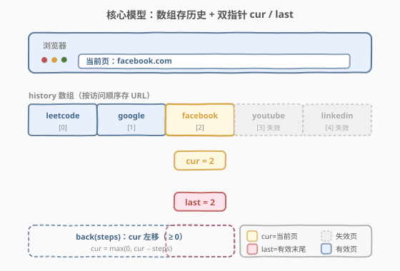
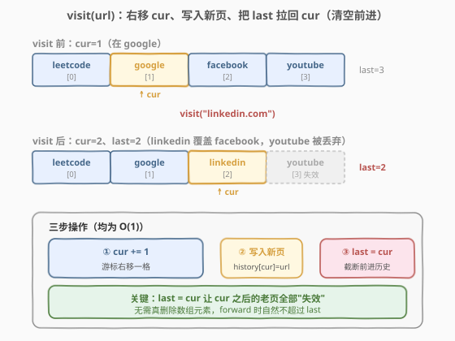
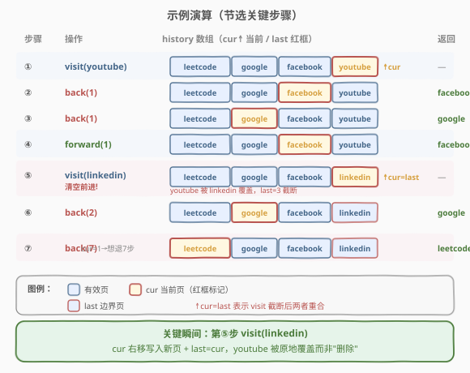

# LeetCode 浏览器历史 题解

## 1. 题目概述

- **标题 / 题号**：浏览器历史（#1472，medium）
- **链接**：https://leetcode.cn/problems/design-browser-history/
- **难度**：中等
- **标签**：设计、数组、双指针、栈

**题意**：设计一个只支持单个标签页的浏览器历史系统 `BrowserHistory`：

- `BrowserHistory(string homepage)`：以 `homepage` 为主页初始化，当前停留在主页。
- `visit(string url)`：从当前页跳转到 `url`。**访问后清空所有前进历史**（即此后无法 forward 到之前的"未来"页面）。
- `back(int steps)`：在历史记录中后退 `steps` 步，若实际只能后退 `x < steps` 步，则只后退 `x` 步（最多退到主页）。返回后退后的当前页 `url`。
- `forward(int steps)`：在历史记录中前进 `steps` 步，若实际只能前进 `x < steps` 步，则只前进 `x` 步（最多进到最后一次 visit 留下的页面）。返回前进后的当前页 `url`。

**示例 1**：

```text
输入：
BrowserHistory browserHistory = new BrowserHistory("leetcode.com");
browserHistory.visit("google.com");       // leetcode.com → google.com
browserHistory.visit("facebook.com");     // google.com → facebook.com
browserHistory.visit("youtube.com");      // facebook.com → youtube.com
browserHistory.back(1);                   // → facebook.com，返回 "facebook.com"
browserHistory.back(1);                   // → google.com，返回 "google.com"
browserHistory.forward(1);                // → facebook.com，返回 "facebook.com"
browserHistory.visit("linkedin.com");     // facebook.com → linkedin.com，清空前进（youtube.com 失效）
browserHistory.forward(2);                // linkedin.com 已是末尾，返回 "linkedin.com"
browserHistory.back(2);                   // → facebook.com → google.com，返回 "google.com"
browserHistory.back(7);                   // 只能退到 leetcode.com，返回 "leetcode.com"
```

**约束**：

- $1 \leq \text{homepage.length} \leq 20$
- $1 \leq \text{url.length} \leq 20$
- $1 \leq \text{steps} \leq 100$
- `homepage`、`url` 仅由 `.` 和英文小写字母组成
- 最多调用 $5000$ 次 `visit`、`back` 和 `forward`

> 💡 **核心抽象**：浏览器的"后退/前进"本质是一条**可双向游走的访问序列**——后退是游标左移，前进是游标右移；而 `visit` 是在游标位置"截断"后续、写入新页。这正是"数组 + 双指针"的经典场景，与 [71. 简化路径](../0001-0100/71_简化路径.md) 用栈模拟路径层级是同一类"线性结构维护游走状态"的设计题。

## 2. 解题思路

### 2.1 暴力思路

用双向链表或两个栈（一个存"后退栈"、一个存"前进栈"）维护历史：

- `back`：把当前页压入前进栈，从后退栈弹一页作为新当前页；
- `forward`：把当前页压入后退栈，从前进栈弹一页作为新当前页；
- `visit`：把当前页压入后退栈，清空前进栈。

问题在于"清空前进栈"需要逐个弹出或整体重建，最坏 $O(n)$；且两栈方案在边界（栈空时 back/forward）需大量特判。虽然也能通过，但不够优雅。

> 💡 暴力方案的痛点是"前进历史"被当作独立容器管理，`visit` 时要单独清空。换一个视角——**把整条历史放进一个数组里，用两个游标界定有效区间**——清空前进就退化成"挪一下游标"，$O(1)$ 完成。

### 2.2 核心观察：数组 + 双指针 cur / last



关键洞察：**访问历史天然有序且按下标可达**，用一个动态数组 `history` 存所有访问过的 URL，再用两个下标指针界定状态：

| 指针 | 含义 | 作用 |
|------|------|------|
| `cur` | **当前页**下标 | `back` 左移、`forward` 右移，操作均围绕它 |
| `last` | **有效历史末尾**下标 | `visit` 时拉回至 `cur`，截断 `cur` 之后的所有"前进页" |

- **`back(steps)`**：`cur = max(0, cur - steps)`，返回 `history[cur]`。下标 0 是主页，是后退的硬下界。
- **`forward(steps)`**：`cur = min(last, cur + steps)`，返回 `history[cur]`。`last` 是前进的硬上界。
- **`visit(url)`**：`cur += 1`，在 `cur` 处写入 `url`（若越界则 `push_back` 扩容），再 `last = cur`。这一步让 `cur` 之后原本的"前进页"全部**逻辑失效**——无需物理删除，因为 `forward` 永远不会越过 `last`。

> ⚠️ **为什么不真正删除 `cur` 之后的元素？** 因为后续 `visit` 会原地覆盖这些位置。只要 `last` 标定了有效边界，越界的数据永远不会被读到。这也是 $O(1)$ 的关键——避免了数组搬迁。

### 2.3 visit 的三步操作（清空前进的关键）



`visit` 是本题的灵魂操作，分三步（全部 $O(1)$）：

1. **`cur += 1`**：游标右移一格，指向待写入的位置；
2. **写入新页**：若 `cur < history.size()` 则原地覆盖 `history[cur] = url`，否则 `history.push_back(url)` 扩容（均摊 $O(1)$）；
3. **`last = cur`**：把有效末尾拉回 `cur`，`cur` 之后的老页逻辑失效。

> 💡 第 3 步 `last = cur` 就是"清空前进历史"的优雅实现——不是真的清空，而是**收缩有效边界**。这与 [71. 简化路径](../0001-0100/71_简化路径.md) 中遇到 `..` 弹栈是同一种"撤销最近一步"的语义，但本题用下标移动替代了栈操作，避免了 $O(n)$ 的搬迁。

### 2.4 示例演算

以示例 1 为例，节选 7 个关键瞬间观察 `cur`/`last` 与数组的变化：



| 步骤 | 操作 | `cur` | `last` | 返回 | 说明 |
|------|------|-------|--------|------|------|
| ① | `visit(youtube)` | 3 | 3 | — | 数组填满 4 页 |
| ② | `back(1)` | 2 | 3 | facebook | cur 左移，last 不变 |
| ③ | `back(1)` | 1 | 3 | google | 继续左移 |
| ④ | `forward(1)` | 2 | 3 | facebook | cur 右移，仍 ≤ last |
| ⑤ | `visit(linkedin)` | 3 | 3 | — | **关键**：linkedin 原地覆盖 youtube，last 拉回 3 |
| ⑥ | `back(2)` | 1 | 3 | google | 退两步 |
| ⑦ | `back(7)` | 0 | 3 | leetcode | 想退 7 步，被 `max(0,·)` 钳制到 0 |

注意第 ⑤ 步：`visit(linkedin)` 时 `cur` 从 2 变 3，linkedin **覆盖**了原 youtube 的位置，`last` 拉回 3。youtube 不是被"删除"，而是被原地覆盖；即使后续没有覆盖它，`last=3` 也保证 `forward` 永远读不到它。第 ⑦ 步则展示了 `back` 的下界钳制：`max(0, 1-7)=0`，退到主页即止。

## 3. 参考代码

### C++

```cpp
class BrowserHistory {
    vector<string> history;
    int cur;
    int last;
  public:
    BrowserHistory(string homepage) {
        history.clear();
        history.push_back(homepage);
        cur = 0;
        last = 0;
    }

    void visit(string url) {
        cur += 1;
        if (cur < (int)history.size()) {
            history[cur] = url;      // 原地覆盖
        } else {
            history.push_back(url);  // 扩容（均摊 O(1)）
        }
        last = cur;                  // 截断前进历史
    }

    string back(int steps) {
        cur = max(0, cur - steps);
        return history[cur];
    }

    string forward(int steps) {
        cur = min(last, cur + steps);
        return history[cur];
    }
};
```

### Python

```python
class BrowserHistory:
    def __init__(self, homepage: str):
        self.history = [homepage]
        self.cur = 0
        self.last = 0

    def visit(self, url: str) -> None:
        self.cur += 1
        if self.cur < len(self.history):
            self.history[self.cur] = url   # 原地覆盖
        else:
            self.history.append(url)       # 扩容（均摊 O(1)）
        self.last = self.cur               # 截断前进历史

    def back(self, steps: int) -> str:
        self.cur = max(0, self.cur - steps)
        return self.history[self.cur]

    def forward(self, steps: int) -> str:
        self.cur = min(self.last, self.cur + steps)
        return self.history[self.cur]
```

> ⚠️ **覆盖 vs 扩容**：`visit` 时若 `cur < len(history)` 走覆盖分支（已有被截断的旧页占位），否则才 `append`。这样避免了 `history = history[:cur+1] + [url]` 这种切片写法——切片会每次新建数组导致 $O(n)$。原地覆盖是 $O(1)$ 的关键。

## 4. 复杂度分析

| 维度 | 复杂度 | 说明 |
|------|--------|------|
| 时间复杂度 | $O(1)$ | `visit`/`back`/`forward` 都是下标运算 + 一次数组访问，均摊 $O(1)$（`push_back` 偶发扩容均摊为 1） |
| 空间复杂度 | $O(n)$ | `history` 数组最多存全部 `visit` 调用次数，$n \leq 5000$ |

> 💡 这是该题的最优解：访问历史天然有序、按下标可达，无需哈希或链表；两个整型指针即编码了全部状态。双栈方案虽也能做，但 `visit` 清空前进栈需 $O(n)$，且边界特判更多。

## 5. 扩展：双栈写法（对照思路）

如果面试官限制"不能用下标随机访问"（比如底层是链表），可用双栈模拟：

```python
class BrowserHistory:
    def __init__(self, homepage: str):
        self.back_stack = [homepage]   # 当前页在最顶
        self.fwd_stack = []            # 前进栈

    def visit(self, url: str) -> None:
        self.back_stack.append(url)
        self.fwd_stack.clear()         # 清空前进：O(k)

    def back(self, steps: int) -> str:
        for _ in range(steps):
            if len(self.back_stack) <= 1:
                break
            self.fwd_stack.append(self.back_stack.pop())
        return self.back_stack[-1]

    def forward(self, steps: int) -> str:
        for _ in range(steps):
            if not self.fwd_stack:
                break
            self.back_stack.append(self.fwd_stack.pop())
        return self.back_stack[-1]
```

> ⚠️ 双栈写法的 `visit` 中 `self.fwd_stack.clear()` 是 $O(k)$（$k$ 为被清空的前进页数），且 `back`/`forward` 用循环而非一步跳转，最坏 $O(\text{steps})$。对照之下，双指针方案把"清空"压缩成 `last = cur` 一次赋值、"跳 $n$ 步"压缩成一次加减法——**用下标随机访问换来了全 $O(1)$**。这就是为什么能用数组就不要用栈：数组支持 $O(1)$ 任意位置读写，而栈只能操作栈顶。

## 6. 面试要点

1. **为什么用两个指针 `cur` 和 `last`，而不是一个 `cur` + 截断数组？**

   - 截断数组（如 `history = history[:cur+1]`）每次 `visit` 都要新建数组搬迁元素，$O(n)$。`last` 指针把"截断"变成一次赋值 `last = cur`，越界数据原地留着但永不被读，$O(1)$ 完成。本质是用"逻辑边界"替代"物理删除"。

2. **`visit` 时为什么要区分"覆盖"和"扩容"两个分支？**

   - 当 `cur < len(history)`，说明该位置有之前被截断的旧页，直接覆盖即可，$O(1)$。只有当 `cur` 超出现有长度（连续 visit 没回退过）才需要 `push_back`。若统一用 `push_back`，数组会无限增长存重复数据；若统一用切片，则退化为 $O(n)$。两个分支保证均摊 $O(1)$ 且无冗余。

3. **`back`/`forward` 的边界钳制为什么用 `max`/`min` 而不是循环？**

   - `cur = max(0, cur - steps)` 和 `cur = min(last, cur + steps)` 是 $O(1)$ 的一步到位，循环则最坏 $O(\text{steps})$。下标运算天然支持任意跳转，这是数组相对链表/栈的核心优势。`0` 是主页下界，`last` 是有效历史上界。

4. **这题和 [71. 简化路径](../0001-0100/71_简化路径.md) 的栈用法有什么同与异？**

   - 同：都是"线性结构维护游走状态"。简化路径用栈维护路径层级，`..` 弹栈即回退一层；本题用数组维护访问序列，`back` 左移游标即回退一页。两者都有"撤销最近一步"的 LIFO 语义。
   - 异：简化路径只需回退（单调向后），用栈最自然；本题需要**双向游走**（既 back 又 forward），栈只能单向操作顶点，必须用双栈或数组。数组 + 下标的双指针方案是"双向游走"场景的最优解。

5. **如果题目加要求"支持删除某条历史记录"怎么办？**

   - 数组按下标删除是 $O(n)$ 搬迁。此时应改用**双向链表 + 哈希表**（链表节点存 URL，哈希表 `url → 节点指针` 实现 $O(1)$ 定位）。这和 [146. LRU 缓存](../0101-0200/146_LRU缓存.md) 的"哈希 + 双向链表"同构——都是"需要 $O(1)$ 定位 + $O(1)$ 删除"的场景。

## 同类练习题

| # | 题目 | 与本题的关联 |
|---|------|-------------|
| 71 | [简化路径](https://leetcode.cn/problems/simplify-path/)（[题解](../0001-0100/71_简化路径.md)） | 用栈模拟路径层级（`..` 弹栈回退），与本题 `back` 左移游标同属"线性结构维护游走状态" |
| 146 | [LRU 缓存](https://leetcode.cn/problems/lru-cache/)（[题解](../0101-0200/146_LRU缓存.md)） | 哈希 + 双向链表实现 $O(1)$ 定位/删除，是本题"加删除需求"后的进阶数据结构 |
| 232 | [用栈实现队列](https://leetcode.cn/problems/implement-queue-using-stacks/)（[题解](../0201-0300/232_用栈实现队列.md)） | 双栈倒换实现双向语义，与本题双栈对照写法同思路 |
| 1381 | [设计一个支持增量操作的栈](https://leetcode.cn/problems/design-a-stack-with-increment-operation/) | 设计题，用数组 + 惰性增量标记实现 $O(1)$ 操作，与本题"用边界指针替代物理操作"的惰性思想相通 |
| 716 | [最大栈](https://leetcode.cn/problems/max-stack/) | 设计支持 `popMax` 的栈，需哈希 + 双向链表定位，与本题扩展讨论的"加删除"场景同类 |
