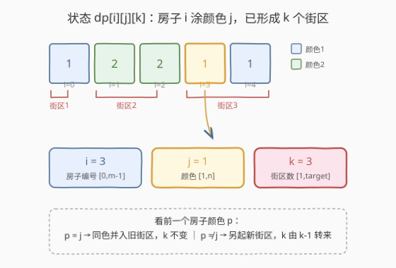
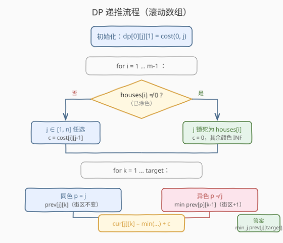
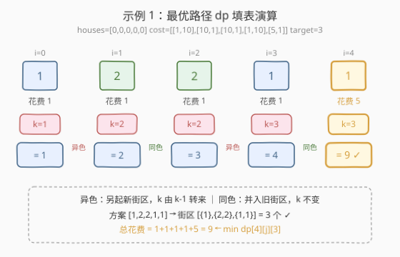

# LeetCode 粉刷房子 III 题解

## 1. 题目概述

- **标题 / 题号**：粉刷房子 III（#1473，hard）
- **链接**：https://leetcode.cn/problems/paint-house-iii/
- **难度**：困难
- **标签**：动态规划、划分型 DP、状态机 DP

**题意**：一排 `m` 个房子，每个房子要涂成 `n` 种颜色之一（颜色编号 `1` 到 `n`）。部分房子去年已涂色（`houses[i] != 0`），**不可重涂**；`houses[i] == 0` 表示尚未涂色。`cost[i][j]` 是把第 `i` 个房子涂成颜色 `j+1` 的花费。

**街区**定义：连续同色的最长一段房子算一个街区。例如 `houses = [1,2,2,3,3,2,1,1]` 含 5 个街区 `[{1}, {2,2}, {3,3}, {2}, {1,1}]`。

要求涂色后恰好形成 `target` 个街区，返回**最小总花费**；无方案返回 `-1`。

**示例 1**：

```text
输入：houses = [0,0,0,0,0], cost = [[1,10],[10,1],[10,1],[1,10],[5,1]], m = 5, n = 2, target = 3
输出：9
解释：涂色方案 [1,2,2,1,1]，街区 [{1},{2,2},{1,1}] 恰好 3 个，花费 1+1+1+1+5 = 9。
```

**示例 2**：

```text
输入：houses = [0,2,1,2,0], cost = [[1,10],[10,1],[10,1],[1,10],[5,1]], m = 5, n = 2, target = 3
输出：11
解释：已有颜色 [_,2,1,2,_]，补涂成 [2,2,1,2,2]，街区 [{2,2},{1},{2,2}] 共 3 个，花费 10+1 = 11。
```

**示例 3**：

```text
输入：houses = [0,0,0,0,0], cost = [[1,10],[10,1],[1,10],[10,1],[1,10]], m = 5, n = 2, target = 5
输出：5
解释：每个房子与邻居都异色才有 5 个街区，方案 [1,2,1,2,1]，花费 1+1+1+1+1 = 5。
```

**示例 4**：

```text
输入：houses = [3,1,2,3], cost = [[1,1,1],[1,1,1],[1,1,1],[1,1,1]], m = 4, n = 3, target = 3
输出：-1
解释：房子已涂色且构成 4 个街区 [{3},{1},{2},{3}]，无法改成 3 个。
```

**约束**：

- $m = \text{houses.length} = \text{cost.length}$
- $n = \text{cost}[i].\text{length}$
- $1 \le m \le 100$
- $1 \le n \le 20$
- $1 \le \text{target} \le m$
- $0 \le \text{houses}[i] \le n$
- $1 \le \text{cost}[i][j] \le 10^4$

> 💡 本题是 [256. 粉刷房子](../0201-0300/256_粉刷房子.md) 系列的第三部：256 只要求「相邻异色」、265 优化到 $O(n)$ 转移、本题再加一维「街区数」约束。三题一脉相承，状态维度逐级递增。

## 2. 解题思路

### 2.1 暴力思路

每个未涂色的房子有 $n$ 种颜色可选，已涂色的颜色固定。最坏 $n^m$ 种涂色方案，$m=100, n=20$ 时是天文数字。即便枚举，还要对每种方案数街区、判是否等于 `target`，完全不可行。

> 💡 暴力会反复计算「前 $i$ 个房子、第 $i$ 个颜色为 $j$、已有 $k$ 个街区时的最小花费」——这正是**重叠子问题**，且具有**最优子结构**：后续决策只依赖当前的颜色 $j$ 和街区数 $k$，与之前怎么涂的无关 → 上 DP。

### 2.2 核心观察：三维状态 $(i, j, k)$



关键在于把「街区数」纳入状态。设：

$$dp[i][j][k] = \text{给前 } i+1 \text{ 个房子涂色、第 } i \text{ 个房子颜色为 } j \text{、此时共 } k \text{ 个街区的最小花费}$$

三个维度：

- $i \in [0, m-1]$：房子编号；
- $j \in [1, n]$：第 $i$ 个房子的颜色；
- $k \in [1, \text{target}]$：到第 $i$ 个房子为止的街区数。

**街区数如何变化**取决于第 $i-1$ 个房子的颜色 $p$ 与第 $i$ 个的颜色 $j$：

- **$p = j$（同色）**：第 $i$ 个房子并入第 $i-1$ 所在街区，街区数**不变** → 前驱为 $dp[i-1][j][k]$；
- **$p \neq j$（异色）**：第 $i$ 个房子另起新街区，街区数 **$+1$** → 前驱为 $dp[i-1][p][k-1]$。

**涂色花费** $\text{cost}(i, j)$：

$$\text{cost}(i, j) = \begin{cases} 0, & \text{houses}[i] = j \text{（已涂此色）} \\ \text{cost}[i][j-1], & \text{houses}[i] = 0 \text{（待涂）} \\ +\infty, & \text{houses}[i] \neq 0 \text{ 且 } \neq j \text{（已涂别色，非法）} \end{cases}$$

> ⚠️ 已涂色房子（`houses[i] != 0`）的颜色被锁死，只能取 $j = \text{houses}[i]$，其余颜色直接判非法（$+\infty$），递推时跳过。这是示例 4 返回 `-1` 的根源：四个房子颜色全锁死且街区数恒为 4，凑不出 `target=3`。

### 2.3 算法流程图



**初始化**（第 0 个房子）：

$$dp[0][j][1] = \text{cost}(0, j), \quad j \in [1, n] \text{ 且合法}$$

第 0 个房子自成 1 个街区，故 $k$ 恒为 $1$。

**逐房子递推**（$i$ 从 $1$ 到 $m-1$）：对每个合法颜色 $j$、每个街区数 $k$：

$$dp[i][j][k] = \min\Big(\underbrace{dp[i-1][j][k]}_{\text{同色，街区不变}}\ ,\ \underbrace{\min_{p \neq j} dp[i-1][p][k-1]}_{\text{异色，街区 }+1}\Big) + \text{cost}(i, j)$$

**答案**：$\min_{j} dp[m-1][j][\text{target}]$，若为 $+\infty$ 则返回 `-1`。

> 💡 **无后效性**：第 $i$ 步的最优只依赖第 $i-1$ 步的 $(j, k)$，更早的历史被颜色 $j$ 和街区数 $k$ 这两个充分统计量概括——这正是「划分型 DP」的典型结构。

### 2.4 示例演算

以示例 1 `houses = [0,0,0,0,0], cost = [[1,10],[10,1],[10,1],[1,10],[5,1]], n=2, target=3` 为例，滚动数组逐房子填表（只列 $k \le 3$ 的有效状态，`—` 表非法）：



| 房子 $i$ | $(j, k)$ | 同色前驱 $dp[j][k]$ | 异色前驱 $\min_{p\neq j}dp[p][k{-}1]$ | best | $+\text{cost}(i,j)$ | $dp[j][k]$ |
|----------|----------|---------------------|----------------------------------------|------|---------------------|------------|
| 0 | (1,1) | — | — | — | +1 | **1** |
| 0 | (2,1) | — | — | — | +10 | **10** |
| 1 | (2,2) | — | $dp[1][1]=1$ | 1 | +1 | **2** |
| 2 | (2,2) | $dp[2][2]=2$ | — | 2 | +1 | **3** |
| 3 | (1,3) | — | $dp[2][2]=3$ | 3 | +1 | **4** |
| 4 | (1,3) | $dp[1][3]=4$ | — | 4 | +5 | **9** ✓ |

最终 $\min_j dp[4][j][3] = dp[1][3] = 9$，对应涂色方案 `[1,2,2,1,1]`，街区 `[{1},{2,2},{1,1}]` 恰为 3。

> 💡 注意第 4 个房子选颜色 1 时走「**同色**」分支（与第 3 个房子同色），街区数保持 3 不变；若选颜色 2 则走「异色」分支街区数会涨到 4，超过 `target`。

## 3. 参考代码

### C++（滚动数组，$O(n \cdot \text{target})$ 空间）

```cpp
class Solution {
  public:
    int minCost(vector<int>& houses, vector<vector<int>>& cost,
                int m, int n, int target) {
        const int INF = 1e9;
        // prev[j][k]: 上一房子颜色为 j、k 个街区时的最小花费
        vector<vector<int>> prev(n + 1, vector<int>(target + 1, INF));
        vector<vector<int>> cur(n + 1, vector<int>(target + 1, INF));

        // 初始化第 0 个房子：自成 1 个街区
        for (int j = 1; j <= n; ++j) {
            if (houses[0] != 0 && houses[0] != j) continue; // 颜色锁死且不匹配
            prev[j][1] = (houses[0] == 0) ? cost[0][j - 1] : 0;
        }

        for (int i = 1; i < m; ++i) {
            for (int j = 0; j <= n; ++j)
                fill(cur[j].begin(), cur[j].end(), INF);

            for (int j = 1; j <= n; ++j) {
                if (houses[i] != 0 && houses[i] != j) continue; // 颜色被锁死
                int c = (houses[i] == 0) ? cost[i][j - 1] : 0;
                for (int k = 1; k <= target; ++k) {
                    int best = prev[j][k];                       // 同色：街区不变
                    for (int p = 1; p <= n; ++p) {               // 异色：街区 +1
                        if (p == j) continue;
                        best = min(best, prev[p][k - 1]);
                    }
                    if (best >= INF) continue;                   // 无合法前驱
                    cur[j][k] = best + c;
                }
            }
            swap(prev, cur);
        }

        int ans = INF;
        for (int j = 1; j <= n; ++j)
            ans = min(ans, prev[j][target]);
        return ans == INF ? -1 : ans;
    }
};
```

### Python

```python
class Solution:
    def minCost(self, houses: List[int], cost: List[List[int]],
                m: int, n: int, target: int) -> int:
        INF = 10 ** 9
        prev = [[INF] * (target + 1) for _ in range(n + 1)]

        # 初始化第 0 个房子
        for j in range(1, n + 1):
            if houses[0] != 0 and houses[0] != j:
                continue
            prev[j][1] = cost[0][j - 1] if houses[0] == 0 else 0

        for i in range(1, m):
            cur = [[INF] * (target + 1) for _ in range(n + 1)]
            for j in range(1, n + 1):
                if houses[i] != 0 and houses[i] != j:
                    continue
                c = cost[i][j - 1] if houses[i] == 0 else 0
                for k in range(1, target + 1):
                    best = prev[j][k]                        # 同色：街区不变
                    for p in range(1, n + 1):                # 异色：街区 +1
                        if p == j:
                            continue
                        best = min(best, prev[p][k - 1])
                    if best >= INF:
                        continue
                    cur[j][k] = best + c
            prev = cur

        ans = min(prev[j][target] for j in range(1, n + 1))
        return -1 if ans >= INF else ans
```

> 💡 **非法状态用 `INF` 而非 `-1`**：花费恒为正，`INF`（$10^9$）可安全做 `min` 且不溢出；`best >= INF` 判无前驱即可跳过。最终答案若仍 $\ge \text{INF}$ 说明无解，返回 `-1`。

## 4. 复杂度分析

| 维度 | 复杂度 | 说明 |
|------|--------|------|
| 时间复杂度 | $O(m \cdot n^2 \cdot \text{target})$ | 每房子 $n \cdot \text{target}$ 个状态，每个状态枚举 $n$ 个异色前驱 |
| 空间复杂度 | $O(n \cdot \text{target})$ | 滚动数组只保留上一房子，两个 $(n+1)\times(\text{target}+1)$ 表 |

> ⚠️ 最坏 $m=100, n=20, \text{target}=100$ 时约 $100 \times 400 \times 100 = 4 \times 10^6$ 次运算，完全在时限内。空间仅 $21 \times 101 \approx 2100$ 个整数。

## 5. 扩展：前缀最小值优化到 $O(m \cdot n \cdot \text{target})$

异色分支 $\min_{p \neq j} dp[i-1][p][k-1]$ 每次枚举 $n$ 个前驱，是时间复杂度的瓶颈。可对每个 $k-1$ 预计算 $dp[i-1][\cdot][k-1]$ 在颜色维度的**最小值与次小值**：

- 设 $\text{min}_1$、$\text{min}_2$ 为最小、次小，$\arg\min$ 为最小值对应的颜色 $j^*$；
- 求 $\min_{p \neq j} dp[i-1][p][k-1]$ 时：若 $j = j^*$ 取 $\text{min}_2$，否则取 $\text{min}_1$。

于是异色分支 $O(1)$，整体降到 $O(m \cdot n \cdot \text{target})$。

```cpp
// 在每层 i 的开头，对每个 k 预算 prev[*][k] 的 min1/min2
for (int k = 1; k <= target; ++k) {
    int m1 = INF, m2 = INF, j1 = 0;
    for (int j = 1; j <= n; ++j) {
        if (prev[j][k] < m1) { m2 = m1; m1 = prev[j][k]; j1 = j; }
        else if (prev[j][k] < m2) { m2 = prev[j][k]; }
    }
    // 异色分支：(j == j1) ? m2 : m1
}
```

> 💡 这正是 [265. 粉刷房子 II](../0201-0300/265_粉刷房子II.md) 的经典优化套路：相邻异色约束下，用「最小 + 次小」把 $O(n)$ 转移降到 $O(1)$。本题把该技巧搬到颜色维度上，街区维度照常遍历。

## 6. 面试要点

1. **为什么状态要带「街区数」这一维？**
   - 题目要求街区数**恰好**等于 `target`，这是个硬约束。若不记录已形成多少街区，就无法判断涂某色后是否仍能凑到 `target`。把 $k$ 纳入状态后具备无后效性：后续只看当前颜色和街区数。

2. **同色 / 异色两个分支怎么来的？**
   - 第 $i$ 个房子颜色 $j$ 与第 $i-1$ 个颜色 $p$ 比较：$p = j$ 则并入旧街区、$k$ 不变；$p \neq j$ 则另起新街区、$k$ 由 $k-1$ 转来。两条分支取 `min` 再加当前花费。

3. **已涂色房子怎么处理？**
   - `houses[i] != 0` 时颜色锁死为 `houses[i]`，只该 $j$ 合法、花费为 0；其余颜色直接判 `INF` 跳过。示例 4 因四房全锁死且街区恒为 4，凑不出 `target=3` 而返回 `-1`。

4. **滚动数组为什么可行？初始化怎么做？**
   - $dp[i]$ 只依赖 $dp[i-1]$，与更早无关，两个 $(n+1)\times(\text{target}+1)$ 表交替即可。初始化第 0 房：$dp[j][1] = \text{cost}(0,j)$，因为它自成 1 个街区。

5. **无解如何判断？**
   - 答案 $\min_j dp[m-1][j][\text{target}]$ 若 $\ge \text{INF}$（即所有颜色都无合法前驱链），说明凑不出 `target` 个街区，返回 `-1`。

## 同类练习题

| # | 题目 | 与本题的关联 |
|---|------|-------------|
| 256 | [粉刷房子](https://leetcode.cn/problems/paint-house/)（[题解](../0201-0300/256_粉刷房子.md)） | 系列入门，相邻异色求最小花费，2 维状态 $(i, j)$，无街区约束，对比维度升级 |
| 265 | [粉刷房子 II](https://leetcode.cn/problems/paint-house-ii/)（[题解](../0201-0300/265_粉刷房子II.md)） | 用「最小 + 次小」把 $O(n)$ 转移降到 $O(1)$，即本文第 5 节优化的原型 |
| 276 | [栅栏涂色](https://leetcode.cn/problems/paint-fence/)（[题解](../0201-0300/276_栅栏涂色.md)） | 涂色方案计数 DP，约束「最多连续 2 根同色」，对比求方案数而非最小花费 |
| 198 | [打家劫舍](https://leetcode.cn/problems/house-robber/)（[题解](../0101-0200/198_打家劫舍.md)） | 同属「房子一排」的一维 DP，状态机两分支（偷 / 不偷）思路与本题同色 / 异色两分支相通 |
| 132 | [分割回文串 II](https://leetcode.cn/problems/palindrome-partitioning-ii/)（[题解](../0101-0200/132_分割回文串II.md)） | 划分型 DP，状态带「段数 / 切割数」维度，与本题「街区数」同属划分计数型约束 |
