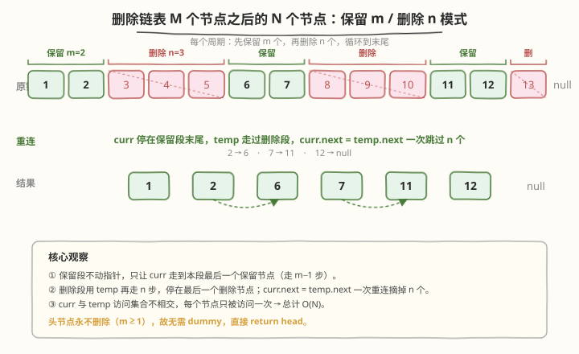
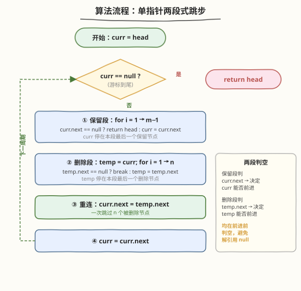
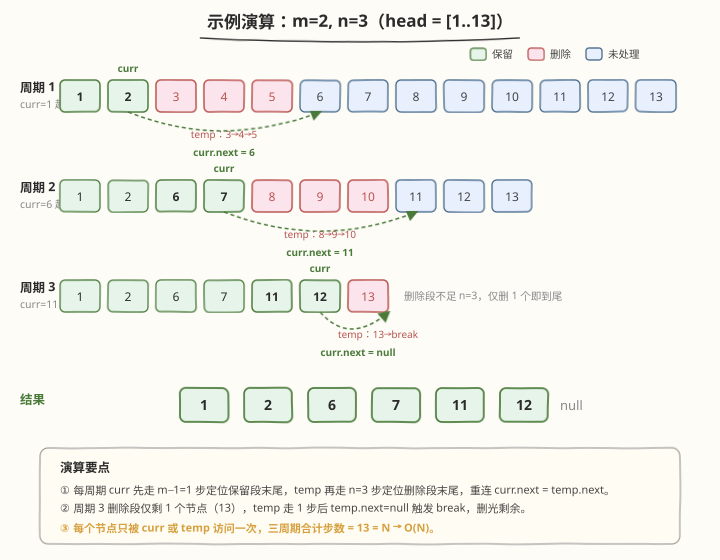

# LeetCode 删除链表 M 个节点之后的 N 个节点 题解

> ⚠️ 本题为 **LeetCode Plus 会员专享题**，题面与约束基于公开描述整理。

## 1. 题目概述

- **标题 / 题号**：删除链表 M 个节点之后的 N 个节点（#1474，easy）
- **链接**：https://leetcode.cn/problems/delete-n-nodes-after-m-nodes-of-a-linked-list/
- **难度**：简单
- **标签**：链表、模拟、双指针

**题意**：给定单链表的头节点 `head`，以及两个整数 `m` 和 `n`。从 `head` 开始，按如下规则反复处理链表直至末尾：

1. **保留**接下来的 `m` 个节点；
2. **删除**接下来的 `n` 个节点；
3. 重复步骤 1~2，直到链表末尾。

最后返回修改后链表的头节点。注意**头节点永不删除**（因为 `m >= 1`，第一段始终保留），所以无需哑节点。

**示例 1**：

```text
输入：head = [1,2,3,4,5,6,7,8,9,10,11,12,13], m = 2, n = 3
输出：[1,2,6,7,11,12]
解释：保留 1,2 → 删除 3,4,5 → 保留 6,7 → 删除 8,9,10 → 保留 11,12 → 删除 13
```

**示例 2**：

```text
输入：head = [1,2,3,4,5,6,7,8,9,10,11], m = 1, n = 3
输出：[1,5,9]
解释：保留 1 → 删除 2,3,4 → 保留 5 → 删除 6,7,8 → 保留 9 → 删除 10,11
```

**示例 3**：

```text
输入：head = [1,2,3,4,5,6,7,8,9,10,11,12,13], m = 2, n = 1
输出：[1,2,4,5,7,8,10,11]
解释：保留 1,2 → 删除 3 → 保留 4,5 → 删除 6 → 保留 7,8 → 删除 9 → 保留 10,11 → 删除 12 → 13 剩下但保留段未满 m 仍保留
```

> 💡 示例 3 末尾的 `13`：在最后一轮"保留 2"阶段走了 `m-1=1` 步到 `11` 后，进入删除阶段只删掉 `12`，随后 `curr` 走到 `13`；下一轮保留阶段 `curr.next` 为 `null`，保留段未满即终止，`13` 被保留。

**约束**：

- 链表中节点数目在范围 `[1, 10^4]` 内
- `1 <= Node.val <= 10^6`
- `1 <= m, n <= 1000`

## 2. 解题思路

### 2.1 暴力思路（转数组重建）

把链表节点值复制到数组，按下标"保留 `m`、跳过 `n`"筛一遍，再用筛出的值重建链表。`O(N)` 时间、`O(N)` 空间。能用但**多开了数组、丢了原节点**，且面试官会追问"能不能直接在链表上原地操作"。

### 2.2 核心观察：单指针 + 两段式跳步

本题本质是**带规则的链表遍历**：每个周期内先走 `m` 步（保留），再跳 `n` 步（删除）。关键在于——

- **保留段**只需让 `curr` 走到"本段最后一个保留节点"，无需改动指针（这些节点本来就串在一起）。
- **删除段**需要把"保留段末尾"直接连到"删除段之后的第一个节点"，即一次指针重连 `curr.next = temp.next`。



用一个游标 `curr` 从 `head` 出发，每个周期执行"走 `m-1` 步定位保留段末尾 → 用 `temp` 再走 `n` 步定位删除段末尾 → 重连 `curr.next = temp.next` → `curr` 跳到下一段保留起点"。**每个节点至多被 `curr` 或 `temp` 访问一次**，总计 `O(N)`。

> 💡 **为什么不直接数 `m+n` 一股脑走？** 因为保留段与删除段的"动作"不同：保留段不动指针，删除段要重连。把两者拆成两段循环，逻辑清晰且重连点明确——`curr` 始终停在"最后一个保留节点"上，`temp` 始终停在"最后一个删除节点"上，`curr.next = temp.next` 一行完成跳过。

### 2.3 算法流程图



```text
curr = head
while curr != null:
    # ① 保留段：curr 向后走 m-1 步，停在最后一个保留节点
    for i in 1 .. m-1:
        if curr.next == null: return head   # 保留段未满即到尾，剩余全保留
        curr = curr.next
    # ② 删除段：temp 从 curr 出发走 n 步，停在最后一个删除节点
    temp = curr
    for i in 1 .. n:
        if temp.next == null: break         # 删除段未满即到尾，删掉剩余
        temp = temp.next
    # ③ 重连：跳过 [curr.next .. temp] 这 n 个节点
    curr.next = temp.next
    # ④ 进入下一段保留区起点
    curr = curr.next
return head
```

### 2.4 示例演算

以示例 1 `head = [1,2,3,4,5,6,7,8,9,10,11,12,13]`，`m = 2, n = 3` 为例：



| 周期 | 保留段末尾 curr | 删除段（temp 走过） | 重连 curr.next | curr 跳到 | 链表状态 |
|------|----------------|---------------------|----------------|----------|----------|
| 1 | 走到 `2` | `3 → 4 → 5` | `2 → 6` | `6` | `1→2→6→7→…→13` |
| 2 | 走到 `7` | `8 → 9 → 10` | `7 → 11` | `11` | `1→2→6→7→11→12→13` |
| 3 | 走到 `12` | `13`（不足 3，删 1 个停） | `12 → null` | `null` | `1→2→6→7→11→12` ✓ |

> ⚠️ **周期 3 的删除段不足 `n`**：`temp` 从 `12` 出发，走第 1 步到 `13`，第 2 步时 `temp.next == null` 触发 `break`，`temp` 停在 `13`，重连 `12 → null`，删掉仅剩的 `13`。这体现"删除段未满即删光剩余"的边界处理。

## 3. 参考代码

### C++

```cpp
class Solution {
public:
    ListNode* deleteNodes(ListNode* head, int m, int n) {
        ListNode* curr = head;
        while (curr) {
            // ① 保留 m 个节点：curr 走 m-1 步，停在本段最后一个保留节点
            for (int i = 1; i < m && curr->next; ++i) {
                curr = curr->next;
            }
            // ② 删除 n 个节点：temp 从 curr 走 n 步，停在本段最后一个删除节点
            ListNode* temp = curr;
            for (int i = 0; i < n && temp->next; ++i) {
                temp = temp->next;
            }
            // ③ 重连：跳过被删除的 n 个节点
            curr->next = temp->next;
            // ④ 进入下一段保留区起点
            curr = curr->next;
        }
        return head;
    }
};
```

### Python

```python
class Solution:
    def deleteNodes(self, head: ListNode, m: int, n: int) -> ListNode:
        curr = head
        while curr:
            # ① 保留 m 个节点：curr 走 m-1 步，停在本段最后一个保留节点
            for _ in range(m - 1):
                if curr.next is None:
                    return head          # 保留段未满即到尾，剩余全保留
                curr = curr.next
            # ② 删除 n 个节点：temp 从 curr 走 n 步，停在本段最后一个删除节点
            temp = curr
            for _ in range(n):
                if temp.next is None:
                    break                # 删除段未满即到尾，删掉剩余
                temp = temp.next
            # ③ 重连：跳过被删除的 n 个节点
            curr.next = temp.next
            # ④ 进入下一段保留区起点
            curr = curr.next
        return head
```

> 💡 **两段循环的判空位置不同**：保留段判 `curr.next`（决定 `curr` 能否前进）；删除段判 `temp.next`（决定 `temp` 能否前进）。两者都在**前进前**判空，避免解引用空指针。C++ 与 Python 唯一差异是 C++ 把"保留段提前到尾"也交给循环条件 `curr->next` 自然终止，无需显式 `return`——两种写法结果一致。

## 4. 复杂度分析

| 维度 | 复杂度 | 说明 |
|------|--------|------|
| **时间** | `O(N)` | `curr` 走过所有保留节点、`temp` 走过所有删除节点，两者不相交，合计恰好遍历整条链一次 |
| **空间** | `O(1)` | 仅 `curr`、`temp` 两个指针，原地改链，无递归栈、无额外数组 |

> ⚠️ 虽有两层 `for` 嵌在 `while` 里，但**每个节点只被访问常数次**（要么被 `curr` 走过一次，要么被 `temp` 走过一次），总步数上界 `2N`，故 `O(N)`。不要被嵌套循环误导成 `O(N·(m+n))`。

## 5. 扩展：为什么不用哑节点？

链表题里凡可能修改头节点的操作都加 `dummy`（如 [21. 合并两个有序链表](../0001-0100/21_合并两个有序链表.md)、82 删重复、86 分隔链表）。本题**例外**：

- `m >= 1` 保证第一段必保留至少 1 个节点，**头节点永不删除**；
- 重连只发生在"保留段末尾"与"删除段之后"之间，从不触及 `head` 之前的虚拟节点；
- 因此直接用 `curr = head` 起步、`return head` 即可，加 `dummy` 反而多余。

判断是否需要 `dummy` 的准则：**操作是否可能改变头指针**。会改则加，不会则不加。

## 6. 面试要点

1. **为什么是 `O(N)` 而不是 `O(N·(m+n))`？**

   - `curr` 与 `temp` 的访问集合不相交：保留节点只被 `curr` 走过，删除节点只被 `temp` 走过。
   - 每个节点恰好被其中一个指针访问一次，总步数 ≤ `2N`，均摊 `O(N)`。

2. **保留段和删除段循环里为什么都在"前进前"判空？**

   - 保留段判 `curr.next`：若为空说明保留段未满已到尾，剩余节点全保留，直接返回。
   - 删除段判 `temp.next`：若为空说明删除段未满已到尾，删掉剩余即可，`break` 后 `temp.next` 为 `null`，重连后链表自然收尾。
   - 在前进前判空避免解引用 `null`，是链表题的基本安全姿势。

3. **重连那一行 `curr.next = temp.next` 为什么对？**

   - `curr` 停在保留段最后一个节点，`temp` 停在删除段最后一个节点。
   - `temp.next` 是删除段之后的第一个节点（下一段保留区的起点，可能为 `null`）。
   - 让 `curr.next` 直接指向它，便把中间 `n` 个节点整体摘下，等价于"删除"。

4. **需要 `dummy` 吗？为什么？**

   - 不需要。`m >= 1` 保证头节点必保留，头指针永不变，`return head` 即可。
   - 凡"可能改头"的操作（插入最前、删头、分隔）才需要 `dummy`。

5. **如果改成"删除前 m、保留后 n"怎么做？**

   - 头节点可能被删，此时**必须加 `dummy`**，`dummy.next = head`，从 `dummy` 起步，返回 `dummy.next`。
   - 思路不变，只是游标起点与返回值改一下，体现 `dummy` 的"统一头边界"作用。

## 同类练习题

| # | 题目 | 与本题的关联 |
|---|------|-------------|
| 82 | [删除排序链表中的重复元素 II](https://leetcode.cn/problems/remove-duplicates-from-sorted-list-ii/) | 哑节点 + 整段跳过重复组，与本题"整段跳过删除段"同形，对照"会改头"与"不改头"何时加 `dummy` |
| 86 | [分隔链表](https://leetcode.cn/problems/partition-list/) | 双子链尾插拼接，同样是"逐节点按规则保留/丢弃"的链表遍历改编 |
| 19 | [删除倒数第 N 个节点](https://leetcode.cn/problems/remove-n-th-node-from-end-of-list/) | 快慢双指针定位删除点，对照本题"先定位再重连"的删节点范式 |
| 328 | [奇偶链表](https://leetcode.cn/problems/odd-even-linked-list/) | 按位置规则拆链重连，与本题"按段保留/删除"同属链表重组织类 |
| 237 | [删除链表中的节点](https://leetcode.cn/problems/delete-node-in-a-linked-list/) | 无前驱时的"值后移伪删除"，对比本题"有前驱时直接重连"的正统删法 |
