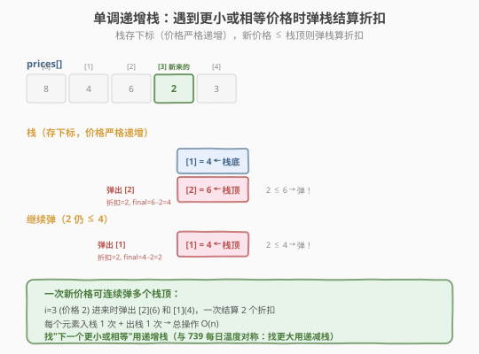
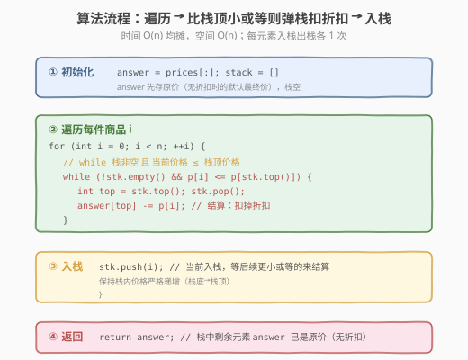

# LeetCode 商品折扣后的最终价格 题解

## 1. 题目概述

- **标题 / 题号**：商品折扣后的最终价格（#1475，easy）
- **链接**：https://leetcode.cn/problems/final-prices-with-a-special-discount-in-a-shop/
- **难度**：简单
- **标签**：数组、单调栈

**题意**：给你一个数组 `prices`，其中 `prices[i]` 是商店里第 `i` 件商品的价格。商店促销：买第 `i` 件商品时，可得到与 `prices[j]` 相等的折扣，其中 `j` 是满足 `j > i` 且 `prices[j] <= prices[i]` 的**最小下标**；若没有满足条件的 `j`，则无折扣。返回数组，第 `i` 个元素为购买商品 `i` 折扣后最终支付的价格。

**示例 1**：

```text
输入：prices = [8,4,6,2,3]
输出：[4,2,4,2,3]
解释：
  商品 0 价格 8，折扣 prices[1]=4 → 8-4=4
  商品 1 价格 4，折扣 prices[3]=2 → 4-2=2
  商品 2 价格 6，折扣 prices[3]=2 → 6-2=4
  商品 3、4 无折扣
```

**示例 2**：

```text
输入：prices = [1,2,3,4,5]
输出：[1,2,3,4,5]
解释：价格严格递增，每件商品右侧都没有更小或相等的，全部无折扣
```

**示例 3**：

```text
输入：prices = [10,1,1,6]
输出：[9,0,1,6]
解释：
  商品 0 价格 10，折扣 prices[1]=1 → 10-1=9
  商品 1 价格 1，折扣 prices[2]=1 → 1-1=0（相等也算折扣！）
  商品 2、3 无折扣
```

**约束**：

- `1 <= prices.length <= 500`
- `1 <= prices[i] <= 10^3`

> 💡 把题意翻译成算法语言：对每个下标 `i`，找**右侧第一个**满足 `prices[j] <= prices[i]` 的下标 `j`，折扣即 `prices[j]`。这正是经典的「**下一个更小或相等元素**」问题，是 [每日温度](../0701-0800/739_每日温度.md) 的对称版——739 找「下一个更大」用递减栈，本题找「下一个更小或相等」用**递增栈**，同一套 `while + pop + push` 骨架。注意 `n <= 500` 很小，暴力 `O(n²)` 也能过，但单调栈 `O(n)` 是可迁移到大数据量的标准解。

## 2. 解题思路

### 2.1 暴力思路：双重循环

对每个 `i`，向右扫描找到第一个 `j > i` 使 `prices[j] <= prices[i]`，`answer[i] = prices[i] - prices[j]`；找不到则 `answer[i] = prices[i]`。

```text
answer = prices[:]            # 先存原价（无折扣的默认值）
for i in 0..n:
    for j in i+1..n:
        if prices[j] <= prices[i]:
            answer[i] -= prices[j]   # 扣掉折扣
            break
```

时间复杂度 `O(n²)`。本题 `n <= 500`，约 `2.5×10^5` 次运算，能过但不够优雅。

> ⚠️ 暴力法的问题：每个元素向右扫描时**重复比较了大量已扫过的元素**。例如 `[8,4,6,2,3]`，找 8 的折扣扫过 4、6、2（停在 2）；找 4 的折扣又扫过 6、2……。这些重复比较可以用**单调栈**消除——栈里记住"还没找到折扣的元素"，一旦遇到更小或相等的就一次性结算多个折扣。

### 2.2 核心观察：单调递增栈

**关键定义**：维护一个**栈**，栈中存放下标，对应价格从栈底到栈顶**严格递增**。

**核心规则**：遍历每件商品 `prices[i]`：

- 若 `prices[i]` **小于或等于**栈顶对应价格：说明第 `i` 件就是栈顶那件的"折扣商品"！弹出栈顶 `top`，`answer[top] -= prices[i]`（扣掉折扣）。**循环弹**直到栈顶价格 `< prices[i]`（保持单调性）或栈空。
- 然后**把** `i` **入栈**（它还没找到折扣，等后续更小或相等的来结算）。



**为什么是递增栈？** 因为我们要找"下一个更小或相等"。栈里存的是"还没找到折扣"的元素，它们应**递增**排列——栈顶是当前最大、最迫切等更小值的那个。新来的 `prices[i]` 如果 `<=` 栈顶，就先把它结算掉；若栈里出现逆序（栈顶比下方大），那栈顶的折扣会先被更小值触发结算。递增保证栈顶总是"最迫切等待"的那个，符合"先进后出"的结算顺序。

> 💡 **与 739 每日温度的对称性**：739 找「下一个更大」用**递减栈**（栈顶最小、最迫切等更大值）；本题找「下一个更小或相等」用**递增栈**（栈顶最大、最迫切等更小值）。两者骨架完全相同，仅比较方向与单调性互换。口诀：**找更大用递减栈，找更小用递增栈**。

> ⚠️ **关键细节：用 `<=` 而非 `<`**。题目要求 `prices[j] <= prices[i]`（**相等也算折扣**，见示例 3 的两个 1）。因此弹栈条件是 `prices[i] <= prices[stk.top()]`。若误用 `<`，相等的元素不会被结算，示例 3 会得到错误的 `[9,1,1,6]` 而非 `[9,0,1,6]`。这是本题与 739（严格更大，用 `>`）最核心的差异点。

### 2.3 算法流程图



**完整步骤**：

1. **初始化**：`answer = prices[:]`（先存原价，无折扣时的默认最终价），栈 `stack = []`
2. **遍历** `i` **从 0 到 n-1**：
   - `while stack 非空 且 prices[i] <= prices[stack.top()]`：
     - `top = stack.pop()`
     - `answer[top] -= prices[i]`（栈顶那件扣掉折扣 `prices[i]`）
   - `stack.push(i)`
3. **结束**：栈中剩余元素 `answer` 保持原价（右侧无更小或相等的，无折扣）

> ⚠️ 栈里存**下标**而非价格值——因为要回写 `answer[top]`，必须知道是哪件商品。这是单调栈题的通用技巧。

### 2.4 示例演算

以 `prices = [8,4,6,2,3]`（示例 1）为例：

![示例演算：[8,4,6,2,3] 逐步栈变化](../images/final_prices_example_walkthrough.svg)

| 步骤 | i | 价格 | 栈（下标） | 动作 | answer 变化 |
|------|---|------|-----------|------|------------|
| 1 | 0 | 8 | [] | 栈空，入栈 0 | [8,4,6,2,3] |
| 2 | 1 | 4 | [0] | 4≤8 弹 0→扣 4；入栈 1 | [4,4,6,2,3] |
| 3 | 2 | 6 | [1] | 6>4 不弹，入栈 2 | 不变 |
| 4 | 3 | 2 | [1,2] | 2≤6 弹 2→扣 2；2≤4 弹 1→扣 2；入栈 3 | [4,2,4,2,3] |
| 5 | 4 | 3 | [3] | 3>2 不弹，入栈 4 | 不变 |
| 结束 | — | — | [3,4] | 剩余保持原价 | [4,2,4,2,3] |

注意步骤 4：`i=3`（价格 2）连续弹了 `[2]` 和 `[1]` 两个下标，一次结算 2 个折扣。这正是单调栈"遇到触发值批量结算"的威力。步骤 5 后栈剩 `[3,4]`（价格 2、3），它们右侧无更小或相等的，`answer` 保持原价。

> 💡 **再看示例 3 `[10,1,1,6] → [9,0,1,6]`**：`i=2`（第二个 1）到来时，`1 <= 1`（相等）触发弹栈，`answer[1] = 1 - 1 = 0`。若把 `<=` 写成 `<`，第二个 1 不会结算第一个 1，`answer[1]` 误保持 1，结果错成 `[9,1,1,6]`。这印证了 2.2 节"必须用 `<=`"的细节。

## 3. 参考代码

### 方法一：单调递增栈（O(n)，推荐）

### C++

```cpp
// 商品折扣后的最终价格.cpp —— 单调递增栈
// 编译: g++ -O2 -std=c++17 商品折扣后的最终价格.cpp -o finalprices
#include <vector>
#include <stack>
using namespace std;

class Solution {
  public:
    vector<int> finalPrices(vector<int>& prices) {
        int n = prices.size();
        vector<int> answer(prices);   // 先存原价（无折扣的默认最终价）
        stack<int> stk;               // 存下标，对应价格严格递增

        for (int i = 0; i < n; ++i) {
            // 当前价格 ≤ 栈顶价格 → 栈顶找到折扣，结算
            while (!stk.empty() && prices[i] <= prices[stk.top()]) {
                int top = stk.top();
                stk.pop();
                answer[top] -= prices[i];  // 扣掉折扣
            }
            stk.push(i);             // 当前入栈，等后续更小或等的来结算
        }
        // 栈中剩余元素 answer 已是原价，无需处理
        return answer;
    }
};
```

### Python

```python
class Solution:
    def finalPrices(self, prices: list[int]) -> list[int]:
        answer = prices[:]            # 先存原价（无折扣的默认最终价）
        stack = []                    # 存下标，价格严格递增

        for i, p in enumerate(prices):
            # 当前价格 ≤ 栈顶价格 → 栈顶找到折扣，结算
            while stack and p <= prices[stack[-1]]:
                top = stack.pop()
                answer[top] -= p      # 扣掉折扣
            stack.append(i)
        # 栈中剩余 answer 已是原价
        return answer
```

> 💡 与 [每日温度](../0701-0800/739_每日温度.md) 对比：739 的 `answer` 初始化全 0、弹栈时写 `answer[top] = i - top`（算距离）；本题 `answer` 初始化为原价、弹栈时 `answer[top] -= prices[i]`（扣折扣）。骨架一致，区别只在初始化与结算内容。

### 方法二：暴力双重循环（O(n²)，本题数据量可过）

### Python

```python
class Solution:
    def finalPrices(self, prices: list[int]) -> list[int]:
        answer = prices[:]            # 先存原价
        for i in range(len(prices)):
            for j in range(i + 1, len(prices)):
                if prices[j] <= prices[i]:
                    answer[i] -= prices[j]   # 扣掉折扣
                    break
        return answer
```

> ⚠️ 暴力法仅因本题 `n <= 500` 才能通过。若数据量放大到 `10^5`（如 739 的规模），必须用单调栈。面试时直接写单调栈解法。

## 4. 复杂度分析

| 维度 | 方法 | 复杂度 | 说明 |
|------|------|--------|------|
| 时间复杂度 | 单调栈 | `O(n)` | 每个下标入栈 1 次、出栈 1 次，总操作 `2n` |
| 空间复杂度 | 单调栈 | `O(n)` | 栈最多存 `n` 个下标（价格严格递增时） |
| 时间复杂度 | 暴力 | `O(n²)` | 每个元素最坏向右扫到末尾 |
| 空间复杂度 | 暴力 | `O(1)` | 除答案外只用常数变量 |

> ⚠️ 单调栈的 `while` 嵌套在 `for` 里，看似 `O(n²)`，但**均摊分析**：每个元素至多入栈 1 次出栈 1 次，`while` 的总弹出次数 ≤ `n`，所以总时间 `O(n)`。这是单调栈"均摊 O(1)"的特性。

## 5. 扩展：单调栈通用模板与变体

### 5.1 通用模板

"找下一个更 X"类问题的统一骨架：

```python
stack = []
for i in range(n):
    while stack and 比较条件(arr[i], arr[stack[-1]]):
        top = stack.pop()
        # 结算 top 的答案，基于 i
    stack.append(i)
# 栈中剩余元素无"下一个更 X"，answer 保持默认
```

**比较条件**决定单调性：

| 找什么 | 比较条件 | 栈单调性 | 例题 |
|--------|---------|---------|------|
| 下一个更大 | `arr[i] > arr[stack[-1]]` | 递减栈 | 739 每日温度 |
| 下一个更大或等于 | `arr[i] >= arr[stack[-1]]` | 严格递减 | — |
| **下一个更小或相等（本题）** | `arr[i] <= arr[stack[-1]]` | **严格递增** | **1475** |
| 下一个更小 | `arr[i] < arr[stack[-1]]` | 递增栈 | — |

### 5.2 与 739 每日温度的对照

| 维度 | 739 每日温度 | 1475 商品折扣 |
|------|-------------|--------------|
| 找什么 | 右侧第一个**更大** | 右侧第一个**更小或相等** |
| 比较条件 | `>` | `<=` |
| 栈单调性 | 递减 | 严格递增 |
| answer 初始化 | 全 0 | 原价（prices 副本） |
| 结算内容 | `i - top`（距离） | `answer[top] -= prices[i]`（扣折扣） |

> 💡 两题骨架完全相同——`for + while 弹栈结算 + push`。差别仅在比较方向、单调性、初始化与结算内容。掌握每日温度的模板，本题可秒杀。

## 6. 面试要点

1. **为什么用单调栈而不是暴力或 DP？**

   - 暴力 `O(n²)` 在本题 `n<=500` 能过，但无法迁移到大数据量；单调栈 `O(n)` 是标准解。
   - DP 需要无后效性的状态定义，但"下一个更小"依赖**未来**的元素，反向 DP 不如单调栈直观。
   - 单调栈天然适合"暂存未结算元素，遇到触发条件批量结算"的模式。

2. **为什么是递增栈？递减栈行不行？**

   - 找"下一个更小或相等"，栈里存"还没找到折扣的"元素。若栈递减（栈顶最小），新来的大元素入栈后压住小元素，小元素永远等不到更小值结算——破坏"栈顶先结算"机制。
   - 递增栈保证栈顶是最大、最迫切等更小值的元素，新来的值先和它比。
   - 口诀：**找更大用递减栈，找更小用递增栈**（与 739 对称）。

3. **为什么弹栈条件用 `<=` 而不是 `<`？**

   - 题目明确 `prices[j] <= prices[i]`，**相等也算折扣**（示例 3 的两个 1）。
   - 用 `<` 会漏掉相等元素，示例 3 得到 `[9,1,1,6]` 而非 `[9,0,1,6]`。
   - 这是本题最易踩的坑，也是与 739（严格更大，用 `>`）的核心差异。

4. **栈里存下标还是存值？为什么？**

   - 存**下标**。因为要回写 `answer[top] -= prices[i]`，必须知道是哪件商品。
   - 通用原则：需要回写答案/算距离时存下标，只需比较值时存值（少见）。

5. **answer 为什么初始化为原价？**

   - 无折扣时最终价就是原价。把 `answer` 初始化为 `prices[:]`，弹栈时减去折扣；未弹栈（栈中剩余）的元素自然保持原价，无需额外处理。
   - 这与 739 初始化全 0 同理：默认值恰好等于"无解"时的答案。

> 💡 **一句话总结**：1475 是单调栈招牌题的"更小或相等"变体——用**严格递增栈**暂存未结算元素，遇到 `<=` 栈顶的价格时批量弹栈扣折扣，把"找下一个更小或相等"从 `O(n²)` 降到 `O(n)`。核心技巧是**存下标**、**递增栈**、**用 `<=`**（相等也算折扣）。这套 `while + pop + push` 骨架与 [每日温度](../0701-0800/739_每日温度.md) 完全一致，仅比较方向与单调性互换。

## 同类练习题

| # | 题目 | 与本题的关联 |
|---|------|-------------|
| 739 | [每日温度](https://leetcode.cn/problems/daily-temperatures/)（[题解](../0701-0800/739_每日温度.md)） | 单调栈招牌题，找"下一个更大"用递减栈，与本题对称 |
| 496 | [下一个更大元素 I](https://leetcode.cn/problems/next-greater-element-i/)（[题解](../0401-0500/496_下一个更大元素 I.md)） | 单调栈入门，两数组 + 哈希映射 |
| 503 | [下一个更大元素 II](https://leetcode.cn/problems/next-greater-element-ii/)（[题解](../0501-0600/503_下一个更大元素 II.md)） | 环形数组单调栈，拼接两遍或取模 |
| 901 | [股票价格跨度](https://leetcode.cn/problems/online-stock-span/)（[题解](../0901-1000/901_股票价格跨度.md)） | 单调递减栈 + 跨度合并，在线流式变体 |
| 84 | [柱状图中最大的矩形](https://leetcode.cn/problems/largest-rectangle-in-histogram/)（[题解](../0001-0100/84_柱状图中最大的矩形.md)） | 单调栈求左右第一个更矮，双侧扫描 |
