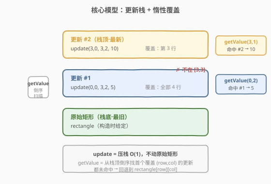
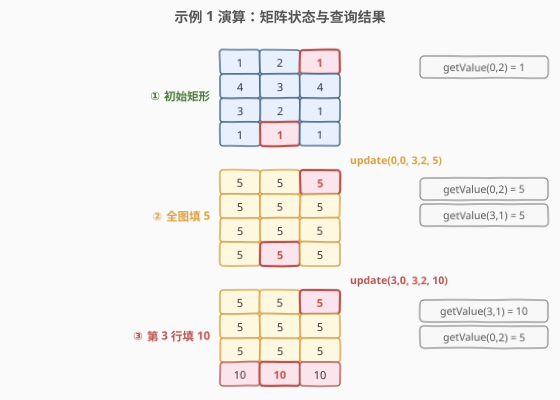

# 子矩形查询

- **题目名称**：子矩形查询
- **链接**：[1476. 子矩形查询](https://leetcode.cn/problems/subrectangle-queries/)
- **难度**：中等
- **标签**：设计、数组

## 1. 题目概述

实现一个类 `SubrectangleQueries`，构造时接收一个 `rows × cols` 的整数矩阵，并支持两种操作：

- `updateSubrectangle(row1, col1, row2, col2, newValue)`：将以 `(row1, col1)` 为左上角、`(row2, col2)` 为右下角的子矩形中**所有元素**置为 `newValue`。
- `getValue(row, col)`：返回当前位置 `(row, col)` 的值。

**示例 1**：

```text
输入：
["SubrectangleQueries","getValue","updateSubrectangle","getValue","getValue",
 "updateSubrectangle","getValue","getValue"]
[[[[1,2,1],[4,3,4],[3,2,1],[1,1,1]]],[0,2],[0,0,3,2,5],[0,2],[3,1],
 [3,0,3,2,10],[3,1],[0,2]]
输出：
[null,1,null,5,5,null,10,5]

初始 (4×3) 矩阵：
1 2 1
4 3 4
3 2 1
1 1 1
update(0,0,3,2,5) 后 → 全图变 5
update(3,0,3,2,10) 后 → 第 3 行变 10，其余仍 5
```

**约束条件**：

- 最多 $500$ 次 `updateSubrectangle` 和 `getValue` 操作。
- $1 \leq \text{rows}, \text{cols} \leq 100$。
- $0 \leq \text{row1} \leq \text{row2} < \text{rows}$，$0 \leq \text{col1} \leq \text{col2} < \text{cols}$。
- $1 \leq \text{newValue}, \text{rectangle}[i][j] \leq 10^9$。

> 💡 **核心抽象**：这是一道「写多/读多权衡」的设计题。`update` 整块赋值、`getValue` 单点读取——和 [304. 二维区域和检索](../0301-0400/304_二维区域和检索_-_数组不可变.md) 的「预处理换查询」是同一类权衡，只是这里把「立即写入」推迟成「惰性记录」，用查询时的一遍扫描换取更新的 $O(1)$。

---

## 2. 解题思路

### 2.1 暴力思路

直接把矩阵存下来，`update` 时双重循环逐格写入 `newValue`：

- `updateSubrectangle`：$O((\text{row2}-\text{row1}+1) \times (\text{col2}-\text{col1}+1))$，最坏 $O(\text{rows} \times \text{cols})$。
- `getValue`：$O(1)$，直接返回 `rectangle[row][col]`。

在 $100 \times 100$、$500$ 次操作的规模下，暴力法完全能过（最坏约 $5 \times 10^6$ 次写）。但它的痛点是：**每次 `update` 都要把子矩形里每个格子真写一遍**，即使后续又被覆盖。如果面试官追问「能否让 `update` 也 $O(1)$」，暴力法就到头了。

> 💡 暴力法的本质是「立即物化」——更新即刻落到矩阵上。换一个视角：**既然后写的更新会覆盖先写的，何不把每次更新当作一张「覆盖层」叠在矩阵之上，查询时从最新层往下找第一个命中的？** 这就把 $O(\text{面积})$ 的写入压缩成 $O(1)$ 的压栈。

### 2.2 核心观察：更新栈 + 惰性覆盖



关键洞察：**更新的语义是「整块覆盖」，后到的更新对它覆盖范围内的格子拥有绝对优先级**。因此无需在 `update` 时改动任何格子，只需把每次更新 `(row1, col1, row2, col2, newValue)` 当作一条记录压入一个「更新栈」：

| 操作 | 做法 | 复杂度 |
|------|------|--------|
| `updateSubrectangle` | 把 `(row1, col1, row2, col2, newValue)` 压入栈 | $O(1)$ |
| `getValue(row, col)` | **从栈顶倒序**找第一个覆盖 `(row, col)` 的更新，返回其 `newValue`；都没有则回退到 `rectangle[row][col]` | $O(U)$，$U$ 为更新数 |

> ⚠️ **为什么倒序？** 因为栈顶是最新的更新，它的优先级最高。第一个覆盖该格子的更新即为「最后写入该格子的值」，这与「立即物化」得到的结果完全一致——惰性覆盖不改变语义，只改变执行的时机。

### 2.3 算法流程图


`getValue` 的核心是「倒序扫描 + 首个命中即返回」：

1. 令 `i = U − 1`（栈顶）；
2. 当 `i ≥ 0`：若 `row1[i] ≤ row ≤ row2[i]` 且 `col1[i] ≤ col ≤ col2[i]`，返回 `newValue[i]`；否则 `i −−`；
3. 扫完都没命中，返回原始 `rectangle[row][col]`。

### 2.4 示例演算

以示例 1 为例，跟踪三个关键时刻的矩阵状态与查询结果（红框为被查询的格子）：



| 步骤 | 操作 | 更新栈（底→顶） | getValue 结果 | 说明 |
|------|------|------------------|---------------|------|
| ① | 初始 | `[]` | `getValue(0,2) = 1` | 栈空，回退原始矩形 |
| ② | `update(0,0,3,2,5)` | `[(0,0,3,2,5)]` | `getValue(0,2) = 5`，`getValue(3,1) = 5` | 栈顶覆盖全图，命中 |
| ③ | `update(3,0,3,2,10)` | `[(0,0,3,2,5), (3,0,3,2,10)]` | `getValue(3,1) = 10`，`getValue(0,2) = 5` | `getValue(3,1)` 命中栈顶；`getValue(0,2)` 不在栈顶范围（行 0 ∉ [3,3]），穿透到栈底下一层命中 |

注意第 ③ 步：`getValue(0,2)` 先看栈顶 `(3,0,3,2,10)`——它只覆盖第 3 行，`(0,2)` 不在其中，于是跳过，继续看下一层 `(0,0,3,2,5)`，命中返回 5。这正是「惰性覆盖」的精髓：**不写一个格子，靠扫描顺序还原覆盖语义**。

---

## 3. 参考代码

### C++

```cpp
class SubrectangleQueries {
    vector<vector<int>> rect;
    vector<array<int,5>> updates; // {row1, col1, row2, col2, newValue}
  public:
    SubrectangleQueries(vector<vector<int>>& rectangle) {
        rect = rectangle;
        updates.clear();
    }

    void updateSubrectangle(int row1, int col1, int row2, int col2, int newValue) {
        updates.push_back({row1, col1, row2, col2, newValue}); // O(1) 压栈
    }

    int getValue(int row, int col) {
        for (int i = (int)updates.size() - 1; i >= 0; --i) { // 倒序扫描
            auto& u = updates[i];
            if (u[0] <= row && row <= u[2] && u[1] <= col && col <= u[3]) {
                return u[4];
            }
        }
        return rect[row][col]; // 都未命中，回退原始矩形
    }
};
```

### Python

```python
class SubrectangleQueries:
    def __init__(self, rectangle: list[list[int]]):
        self.rect = rectangle
        self.updates: list[tuple[int, int, int, int, int]] = []

    def updateSubrectangle(self, row1: int, col1: int, row2: int, col2: int, newValue: int) -> None:
        self.updates.append((row1, col1, row2, col2, newValue))  # O(1) 压栈

    def getValue(self, row: int, col: int) -> int:
        for r1, c1, r2, c2, val in reversed(self.updates):       # 倒序扫描
            if r1 <= row <= r2 and c1 <= col <= c2:
                return val
        return self.rect[row][col]                               # 都未命中，回退原始矩形
```

> 💡 **为什么用 `reversed` 而不是 `self.updates[::-1]`？** `reversed` 返回迭代器，$O(1)$ 启动且不复制；`[::-1]` 会新建一个列表 $O(U)$。查询要尽量轻。

---

## 4. 复杂度分析

| 维度 | 复杂度 | 说明 |
|------|--------|------|
| `updateSubrectangle` | $O(1)$ | 仅压栈一次，不动矩阵 |
| `getValue` | $O(U)$ | 倒序扫更新栈，最坏遍历全部 $U$ 条记录；$U \leq 500$ |
| 空间复杂度 | $O(\text{rows}\times\text{cols} + U)$ | 原始矩阵 + 更新栈 |

> 💡 **写读权衡**：暴力法是「写 $O(\text{面积})$ / 读 $O(1)$」，惰性覆盖法是「写 $O(1)$ / 读 $O(U)$」。本题更新数 $U \leq 500$ 远小于面积上限 $10^4$，且操作总数也仅 $500$，两种写法都能过。惰性法的价值在于：当**更新远多于查询、或子矩形很大**时，把昂贵的写分摊到廉价的读上。

---

## 5. 扩展：暴力写法（对照思路）

如果面试官只要求「能过」，暴力法最直白，也适合作为对照：

```python
class SubrectangleQueries:
    def __init__(self, rectangle: list[list[int]]):
        self.rect = [row[:] for row in rectangle]  # 深拷贝，避免外部修改

    def updateSubrectangle(self, row1: int, col1: int, row2: int, col2: int, newValue: int) -> None:
        for r in range(row1, row2 + 1):
            for c in range(col1, col2 + 1):
                self.rect[r][c] = newValue          # 逐格写入

    def getValue(self, row: int, col: int) -> int:
        return self.rect[row][col]                  # O(1)
```

> ⚠️ 对照之下，惰性覆盖法把双重循环的写「延迟」到了查询时的一次线性扫描——**用「记录意图」替代「执行意图」**。这与 [1381. 设计一个支持增量操作的栈](https://leetcode.cn/problems/design-a-stack-with-increment-operation/) 用惰性增量标记把 `inc` 压成 $O(1)$ 是同一种思想：不立即改动数据，把变更记成元数据，读取时再合并。

---

## 6. 面试要点

1. **为什么倒序扫描而不是正序？**

   - 更新栈底是先写入的、栈顶是后写入的。后写入的覆盖先写入的，所以查询时必须从最新（栈顶）开始找第一个命中的更新——这才能还原「最后写入该格子的值」的语义。正序扫描会返回最先写入的值，语义错误。

2. **惰性覆盖法会不会改变结果正确性？**

   - 不会。整块覆盖的语义下，每个格子的「当前值」= 最后一个覆盖它的更新的值，若无则为原始值。倒序扫描首个命中恰好等价于这个定义。惰性只是推迟了计算，没有改变结果——和 [304. 二维区域和检索](../0301-0400/304_二维区域和检索_-_数组不可变.md) 用前缀和「预处理换查询」一样，都是「换个时机算」。

3. **两种写法各适合什么场景？**

   - 暴力法适合「查询远多于更新、子矩形较小」——写的代价被多次读摊薄。惰性法适合「更新远多于查询、子矩形很大」——把昂贵的 $O(\text{面积})$ 写压成 $O(1)$，代价只在少量查询时支付 $O(U)$。本题约束下两者均可，关键是能说清权衡。

4. **如果更新数 $U$ 极大（比如 $10^6$），`getValue` 的 $O(U)$ 会成为瓶颈，怎么办？**

   - 可以给每个格子维护一个「最后覆盖它的更新的时间戳/指针」，`getValue` 直接读该格子的指针 $O(1)$——但这又把写退回 $O(\text{面积})$（更新时要给范围内所有格子改指针）。若要写读都 $O(1)$，需引入二维数据结构（如二维线段树/树状数组做区间赋值单点查询），复杂度升至 $O(\log m \log n)$，已超出本题范围。设计题的本质就是在这些权衡里选合适的点。

5. **`reversed(self.updates)` 与 `self.updates[::-1]` 的区别？**

   - `reversed` 返回迭代器，$O(1)$ 启动、不复制；`[::-1]` 切片会新建列表 $O(U)$。查询频繁时应用 `reversed`，避免每次查询都复制整个栈。

---

## 7. 同类练习题

- [304. 二维区域和检索 - 数组不可变](https://leetcode.cn/problems/range-sum-query-2d-immutable/)（[题解](../0301-0400/304_二维区域和检索_-_数组不可变.md)）：预处理换查询的经典权衡，与本题「写读时机选择」同类
- [308. 二维区域和检索 - 矩阵可修改](https://leetcode.cn/problems/range-sum-query-2d-mutable/)（[题解](../0301-0400/308_二维区域和检索_-_矩阵可修改.md)）：矩阵可修改下的二维区间查询，是本题「单点查询 + 区间更新」的对偶问题
- [1381. 设计一个支持增量操作的栈](https://leetcode.cn/problems/design-a-stack-with-increment-operation/)：用惰性增量标记把 `inc` 压成 $O(1)$，与本题「用记录替代立即执行」同思想
- [1472. 设计浏览器历史](https://leetcode.cn/problems/design-browser-history/)（[题解](../1401-1500/1472_浏览器历史.md)）：用下标指针替代物理删除实现 $O(1)$ 操作，与本题「逻辑边界替代物化」同属设计题的惰性思想
