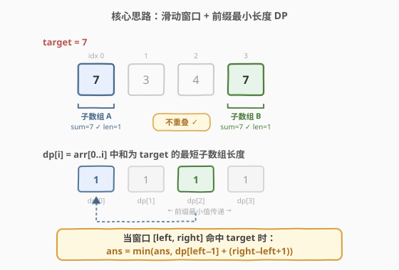
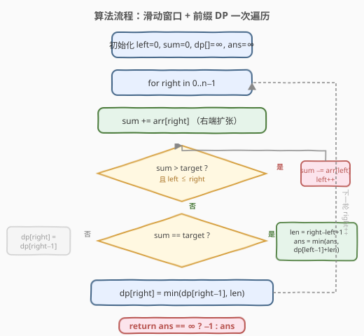

# 找两个和为目标值且不重叠的子数组

- **题目名称**：找两个和为目标值且不重叠的子数组
- **链接**：[1477. 找两个和为目标值且不重叠的子数组](https://leetcode.cn/problems/find-two-non-overlapping-sub-arrays-each-with-target-sum/)
- **难度**：中等
- **标签**：数组、滑动窗口、动态规划

## 1. 题目概述

给你一个正整数数组 `arr` 和一个整数值 `target`。请在 `arr` 中找**两个互不重叠的子数组**且它们的和都等于 `target`。可能会有多种方案，请你返回满足要求的两个子数组长度和的**最小值**。如果无法找到这样的两个子数组，请返回 **-1**。

**示例 1**：

```text
输入：arr = [3,2,2,4,3], target = 3
输出：2
解释：只有两个子数组和为 3（[3] 和 [3]）。它们的长度和为 2。
```

**示例 2**：

```text
输入：arr = [7,3,4,7], target = 7
输出：2
解释：尽管有 3 个互不重叠的子数组和为 7（[7], [3,4] 和 [7]），但选择第一个和第三个，长度和 2 最小。
```

**示例 3**：

```text
输入：arr = [4,3,2,6,2,3,4], target = 6
输出：-1
解释：只有一个和为 6 的子数组。
```

**示例 4**：

```text
输入：arr = [5,5,4,4,5], target = 3
输出：-1
解释：无法找到和为 3 的子数组。
```

**示例 5**：

```text
输入：arr = [3,1,1,1,5,1,2,1], target = 3
输出：3
解释：注意子数组 [1,2] 和 [2,1] 不能成为方案因为它们重叠了。
```

**约束条件**：

- `1 <= arr.length <= 10^5`
- `1 <= arr[i] <= 1000`
- `1 <= target <= 10^8`

---

## 2. 解题思路

### 2.1 暴力思路

枚举所有子数组对 `(A, B)`，检查两者不重叠且和均为 `target`，取长度和最小值。子数组数量为 `O(n²)`，两两组合 `O(n⁴)`，每个验证 `O(n)`，总计 `O(n⁵)`，完全不可行。

### 2.2 核心观察：滑动窗口 + 前缀最小长度 DP



关键洞察分两步：

**第一步：用滑动窗口高效找出所有和为 `target` 的子数组。**

> 💡 因为 `arr[i] >= 1`（全正数），窗口和具有**单调性**——右端扩张时和只增不减，左端收缩时和只减不增。这使得我们可以用双指针在 `O(n)` 时间内找出所有满足条件的窗口。

**第二步：用前缀 DP 记录"到此为止最短的合法子数组"。**

定义 `dp[i]` = `arr[0..i]` 中和为 `target` 的子数组的**最短长度**（若无则为 `∞`）。

当滑动窗口在位置 `right` 命中 `target`（窗口为 `[left, right]`，长度 `len = right - left + 1`）时：

1. **查前缀**：`dp[left - 1]` 记录了 `arr[0..left-1]` 中最短合法子数组长度。由于该子数组结束位置 `≤ left - 1 < left`，与当前窗口 `[left, right]` **不重叠**，可以配对。
2. **更新答案**：`ans = min(ans, dp[left - 1] + len)`。
3. **更新 DP**：`dp[right] = min(dp[right - 1], len)`（前缀最小值传递）。

若窗口未命中，则 `dp[right] = dp[right - 1]`（继承前值）。

> ⚠️ 为什么 `dp[left-1]` 对应的子数组一定不与 `[left, right]` 重叠？因为 `dp[left-1]` 描述的是 `arr[0..left-1]` 范围内的子数组，其右端点 `≤ left - 1`，而当前窗口左端点为 `left`，二者之间至少隔开一个位置，天然不重叠。

### 2.3 算法流程图



整个算法只需**一次遍历**：

1. 初始化 `left = 0`、`sum = 0`、`dp[]` 全 `∞`、`ans = ∞`。
2. 遍历 `right` 从 `0` 到 `n-1`：
   - `sum += arr[right]`（扩张右端）。
   - `while sum > target`：`sum -= arr[left]; left++`（收缩左端，保持和 `≤ target`）。
   - `if sum == target`：
     - `len = right - left + 1`。
     - 若 `left > 0` 且 `dp[left-1] ≠ ∞`：`ans = min(ans, dp[left-1] + len)`。
     - `dp[right] = min(dp[right-1], len)`。
   - `else`：`dp[right] = dp[right-1]`。
3. 返回 `ans == ∞ ? -1 : ans`。

### 2.4 示例演算

以 `arr = [7, 3, 4, 7], target = 7` 为例：

![示例演算：arr = [7, 3, 4, 7], target = 7](../images/1477_example_walkthrough.svg)

| right | 窗口 `[l,r]` | sum | 操作 | dp[right] | ans |
|-------|-------------|-----|------|-----------|-----|
| 0 | `[0,0]` → [7] | 7 | 命中! len=1, left=0 无前缀 | 1 | ∞ |
| 1 | `[1,1]` → [3] | 3 | sum=10>7, 缩窗(7出), 未命中 | 1 | ∞ |
| 2 | `[1,2]` → [3,4] | 7 | 命中! len=2, dp[0]+2=**3** | 1 | 3 |
| 3 | `[3,3]` → [7] | 7 | 命中! len=1, dp[2]+1=**2** | 1 | **2** |

最终选择子数组 [7]（idx 0）和 [7]（idx 3），长度和 = 1 + 1 = **2**。

---

## 3. 参考代码

### C++

```cpp
class Solution {
  public:
    int minSumOfLengths(vector<int>& arr, int target) {
        int n = arr.size();
        vector<int> dp(n, INT_MAX);

        int ans = INT_MAX;
        int left = 0, sum = 0;
        for (int right = 0; right < n; right++) {
            sum += arr[right];
            while (sum > target && left <= right) {
                sum -= arr[left];
                left++;
            }
            if (sum == target) {
                int len = right - left + 1;
                if (left > 0 && dp[left - 1] != INT_MAX) {
                    ans = min(ans, dp[left - 1] + len);
                }
                dp[right] = min((right > 0 ? dp[right - 1] : INT_MAX), len);
            } else {
                dp[right] = (right > 0 ? dp[right - 1] : INT_MAX);
            }
        }

        return ans == INT_MAX ? -1 : ans;
    }
};
```

### Python

```python
class Solution:
    def minSumOfLengths(self, arr: List[int], target: int) -> int:
        n = len(arr)
        INF = float('inf')
        dp = [INF] * n

        ans = INF
        left = 0
        s = 0
        for right in range(n):
            s += arr[right]
            while s > target and left <= right:
                s -= arr[left]
                left += 1
            if s == target:
                length = right - left + 1
                if left > 0 and dp[left - 1] < INF:
                    ans = min(ans, dp[left - 1] + length)
                dp[right] = min(dp[right - 1] if right > 0 else INF, length)
            else:
                dp[right] = dp[right - 1] if right > 0 else INF

        return ans if ans < INF else -1
```

---

## 4. 复杂度分析

| 维度 | 复杂度 | 说明 |
|------|--------|------|
| 时间复杂度 | `O(n)` | `right` 和 `left` 各最多遍历数组一次，`dp` 更新为 `O(1)` |
| 空间复杂度 | `O(n)` | `dp` 数组长度为 `n` |

---

## 5. 扩展：前缀 + 后缀双向 DP

上述解法在一次遍历中同时完成"前缀 DP"和"配对"，最为紧凑。另一种等价思路是将问题拆成**前缀**和**后缀**两个独立数组：

- `prefix[i]` = `arr[0..i]` 中和为 `target` 的最短子数组长度。
- `suffix[i]` = `arr[i..n-1]` 中和为 `target` 的最短子数组长度。

然后枚举分割点 `i`：`ans = min(prefix[i] + suffix[i+1])`。

这种写法需要两次滑动窗口（正向 + 反向），代码稍长但思路更直观，适合面试时分步讲解：

```cpp
class Solution {
  public:
    int minSumOfLengths(vector<int>& arr, int target) {
        int n = arr.size();
        const int INF = INT_MAX;
        vector<int> prefix(n, INF), suffix(n, INF);

        // 正向滑动窗口 → prefix
        int left = 0, sum = 0;
        for (int right = 0; right < n; right++) {
            sum += arr[right];
            while (sum > target && left <= right) {
                sum -= arr[left];
                left++;
            }
            if (sum == target)
                prefix[right] = right - left + 1;
            if (right > 0)
                prefix[right] = min(prefix[right], prefix[right - 1]);
        }

        // 反向滑动窗口 → suffix
        int right = n - 1;
        sum = 0;
        for (int left = n - 1; left >= 0; left--) {
            sum += arr[left];
            while (sum > target && right >= left) {
                sum -= arr[right];
                right--;
            }
            if (sum == target)
                suffix[left] = right - left + 1;
            if (left < n - 1)
                suffix[left] = min(suffix[left], suffix[left + 1]);
        }

        // 枚举分割点
        int ans = INF;
        for (int i = 0; i < n - 1; i++) {
            if (prefix[i] < INF && suffix[i + 1] < INF)
                ans = min(ans, prefix[i] + suffix[i + 1]);
        }
        return ans == INF ? -1 : ans;
    }
};
```

> 💡 两种解法本质相同：单向 DP 版在遍历时即时配对（`dp[left-1] + len`），双向 DP 版先建表再枚举分割点。单向版更简洁，双向版更易理解。

---

## 6. 面试要点

1. **为什么能用滑动窗口？全正数的作用是什么？**

   - `arr[i] >= 1` 保证窗口和的单调性：右端扩张和必增，左端收缩和必减。这使得对于每个 `right`，至多有一个 `left` 使和等于 `target`，双指针 `O(n)` 即可找全。若有负数，单调性被破坏，需改用前缀和 + 哈希。

2. **`dp[left-1]` 为什么保证不重叠？**

   - `dp[left-1]` 描述的是 `arr[0..left-1]` 范围内的最短合法子数组，其右端点 `≤ left-1`。当前窗口左端点为 `left`，二者之间有空隙，天然不重叠。

3. **dp 数组为什么是"前缀最小值"而非逐位置记录？**

   - 我们关心的是"在当前位置之前，最短能短到多少"，而非某个特定位置的最短。用 running min 传递（`dp[right] = min(dp[right-1], len)`）使得任意时刻 `dp[i]` 都代表 `arr[0..i]` 的全局最优，配对时取 `dp[left-1]` 即可。

4. **如果 `target` 很大或数组全小于 `target` 怎么办？**

   - 滑动窗口中 `sum` 永远小于 `target`，`left` 不会收缩，也不会命中。`dp` 全为 `∞`，`ans` 保持 `∞`，最终返回 `-1`。算法自然处理。

5. **能否优化到 `O(1)` 空间？**

   - 不能。因为配对时需要查询 `dp[left-1]`，`left` 可以是任意历史位置，必须保留整个前缀 DP 数组以支持随机访问。除非改用"记录所有合法子数组 + 双指针配对"的思路，但那会增加复杂度。

---

## 7. 同类练习题

- [209. 长度最小的子数组](https://leetcode.cn/problems/minimum-size-subarray-sum/)：滑动窗口求和 ≥ target 的最短子数组，本题的单数组基础版
- [560. 和为 K 的子数组](https://leetcode.cn/problems/subarray-sum-equals-k/)：前缀和 + 哈希求和为 K 的子数组个数（含负数场景，对照本题全正数用滑窗）
- [862. 和至少为 K 的最短子数组](https://leetcode.cn/problems/shortest-subarray-with-sum-at-least-k/)：含负数的最短子数组，需单调队列 + 前缀和，本题的进阶变体
- [1546. 和为目标值的最大不重叠子数组数目](https://leetcode.cn/problems/maximum-number-of-non-overlapping-subarrays-with-sum-equals-target/)：不重叠子数组求"最多数量"而非"最短长度和"，同套路不同优化目标
