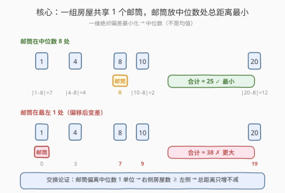
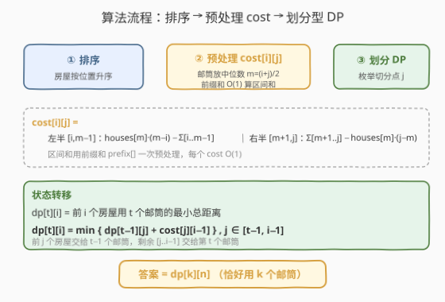
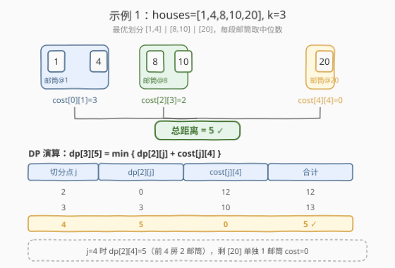

# 安排邮筒

- **题目名称**：安排邮筒
- **链接**：[1478. 安排邮筒](https://leetcode.cn/problems/allocate-mailboxes/)
- **难度**：困难
- **标签**：动态规划、划分型 DP、中位数、前缀和

## 1. 题目概述

一条街上有 `n` 栋房子，`houses[i]` 是第 `i` 栋的位置。要在街上安排 `k` 个邮筒，使**每栋房子到离它最近的邮筒的距离之和最小**。返回该最小总和。

**示例 1**：

```text
输入：houses = [1,4,8,10,20], k = 3
输出：5
解释：邮筒放在 3、9、20 处，距离和 |3-1|+|4-3|+|9-8|+|10-9|+|20-20| = 5。
```

**示例 2**：

```text
输入：houses = [2,3,5,12,18], k = 2
输出：9
解释：邮筒放在 3 和 14 处，距离和 |2-3|+|3-3|+|5-3|+|12-14|+|18-14| = 9。
```

**示例 3**：

```text
输入：houses = [7,4,6,1], k = 1
输出：8
```

**示例 4**：

```text
输入：houses = [3,6,14,10], k = 4
输出：0
解释：每栋房子一个邮筒，距离和为 0。
```

**约束条件**：

- $n = \text{houses.length}$
- $1 \le n \le 100$
- $1 \le \text{houses}[i] \le 10^4$
- $1 \le k \le n$
- `houses` 中整数互不相同。

> 💡 房子位置无序但都在一条直线上，**第一步永远先排序**。排序后问题变成「把有序序列切成 `k` 段，每段配一个邮筒」。

---

## 2. 解题思路

### 2.1 暴力思路

枚举 `k` 个邮筒的所有位置组合：位置取值域 $[1, 10^4]$，组合数 $\binom{10^4}{k}$ 天文数字。即便枚举，每次还要对每栋房子求最近邮筒求和，完全不可行。

> 💡 暴力会反复计算「某一段连续房屋共享一个邮筒时的最小总距离」——这正是**重叠子问题**，且具有**最优子结构**：把前 $j$ 栋房交给 $t-1$ 个邮筒、剩下的交给第 $t$ 个邮筒，前后独立 → 上划分型 DP。

### 2.2 核心观察：一组房屋共享邮筒，邮筒放中位数处



要把一段连续（已排序）房屋 $[\text{houses}[i], \dots, \text{houses}[j]]$ 交给一个邮筒，邮筒位置 $p$ 取何值时 $\sum_{l=i}^{j} |\text{houses}[l] - p|$ 最小？

这是经典的**一维绝对偏差最小化**问题，答案是**中位数**。设 $m = \lfloor (i+j)/2 \rfloor$，邮筒放在 $\text{houses}[m]$ 即可。

**交换论证**（直觉）：若邮筒偏离中位数向左移 1 单位，右侧房屋数 $\ge$ 左侧房屋数，于是「右侧多省的」$\le$「左侧多花的」，总距离只增不减。只有当中位数处左右房屋数相等（或差 1）时才达到平衡点。

> ⚠️ 是中位数**不是均值**。均值最小化的是**平方偏差**和（$\sum (x-p)^2$），绝对偏差和的最优解是中位数。本题距离是绝对值，故用中位数。

于是单段代价可以 $O(1)$ 表达：

$$\text{cost}[i][j] = \sum_{l=i}^{j} \big|\text{houses}[l] - \text{houses}[m]\big|, \quad m = \lfloor (i+j)/2 \rfloor$$

用前缀和拆成左右两半，避免每次 $O(n)$ 求和：

$$\text{cost}[i][j] = \underbrace{\text{houses}[m]\cdot(m-i) - \sum_{l=i}^{m-1}\text{houses}[l]}_{\text{左半}} + \underbrace{\sum_{l=m+1}^{j}\text{houses}[l] - \text{houses}[m]\cdot(j-m)}_{\text{右半}}$$

其中区间和 $\sum_{l=a}^{b}\text{houses}[l] = \text{prefix}[b+1] - \text{prefix}[a]$，预处理前缀和后每段 $O(1)$。

### 2.3 算法流程图



三阶段：

1. **排序** `houses`；
2. **预处理 `cost[i][j]`**：双循环枚举所有区间，中位数 + 前缀和 $O(1)$ 算出代价，共 $O(n^2)$；
3. **划分型 DP**：设 $dp[t][i]$ 为前 $i$ 栋房用 $t$ 个邮筒的最小总距离，枚举切分点 $j$：

$$dp[t][i] = \min_{j \in [t-1,\, i-1]} \big\{ dp[t-1][j] + \text{cost}[j][i-1] \big\}$$

**含义**：前 $j$ 栋房交给 $t-1$ 个邮筒，剩余 $[j, i-1]$ 这一段交给第 $t$ 个邮筒（取该段中位数）。

**初始化**：$dp[0][0] = 0$，其余 $+\infty$；$dp[1][i] = \text{cost}[0][i-1]$（1 个邮筒覆盖前 $i$ 栋）。

**答案**：$dp[k][n]$。

> 💡 **为什么恰好用满 $k$ 个邮筒？** 多一个邮筒永远不会让总距离变大（多余的可与某个邮筒重合），所以「恰好 $k$ 个」的最优值 = 「至多 $k$ 个」的最优值。DP 强制切成 $k$ 段即对应恰好 $k$ 个。

> ⚠️ **无后效性**：第 $t$ 个邮筒只关心「前面用了 $t-1$ 个邮筒覆盖到第 $j$ 栋」这个边界，与前面具体怎么切无关——典型的划分型 DP 结构。

### 2.4 示例演算

以示例 1 `houses = [1,4,8,10,20], k = 3`（排序后不变）为例。



**关键 cost 表项**（中位数 $m = \lfloor(i+j)/2\rfloor$）：

| 区间 $[i,j]$ | 房屋 | 中位数 $\text{houses}[m]$ | cost |
|--------------|------|---------------------------|------|
| $[0,1]$ | 1,4 | 1 | $\|1-1\|+\|4-1\| = 3$ |
| $[2,3]$ | 8,10 | 8 | $\|8-8\|+\|10-8\| = 2$ |
| $[4,4]$ | 20 | 20 | 0 |
| $[2,4]$ | 8,10,20 | 10 | $\|8-10\|+0+\|20-10\| = 12$ |
| $[3,4]$ | 10,20 | 10 | $\|10-10\|+\|20-10\| = 10$ |

**DP 填表**（$dp[t][i]$，前 $i$ 栋用 $t$ 邮筒）：

| $t \backslash i$ | 1 | 2 | 3 | 4 | 5 |
|------------------|---|---|---|---|---|
| 1 | 0 | 3 | 7 | 13 | 25 |
| 2 | ∞ | 0 | 3 | 5 | 13 |
| 3 | ∞ | ∞ | 0 | 2 | **5** ✓ |

最终 $dp[3][5] = 5$，对应划分 $[1,4]\,|\,[8,10]\,|\,[20]$，三段代价 $3+2+0 = 5$。

> 💡 注意 $dp[2][4] = 5$（前 4 栋用 2 邮筒：$[1,4]\,|\,[8,10]$，代价 $3+2=5$），再补第 3 个邮筒单独覆盖 $[20]$（cost 0）即得 $dp[3][5]=5$。

---

## 3. 参考代码

### C++

```cpp
class Solution {
  public:
    int minDistance(vector<int>& houses, int k) {
        int n = houses.size();
        sort(houses.begin(), houses.end());

        // 前缀和：prefix[t] = houses[0]+...+houses[t-1]
        vector<long long> prefix(n + 1, 0);
        for (int i = 0; i < n; ++i) prefix[i + 1] = prefix[i] + houses[i];

        // cost[i][j]: houses[i..j] 共享 1 个邮筒（放中位数）的最小总距离
        vector<vector<int>> cost(n, vector<int>(n, 0));
        for (int i = 0; i < n; ++i) {
            for (int j = i; j < n; ++j) {
                int m = (i + j) / 2;                 // 中位数下标
                long long left  = (long long)houses[m] * (m - i)
                                  - (prefix[m] - prefix[i]);          // [i, m-1]
                long long right = (prefix[j + 1] - prefix[m + 1])
                                  - (long long)houses[m] * (j - m);   // [m+1, j]
                cost[i][j] = left + right;
            }
        }

        // dp[t][i]: 前 i 栋房用 t 个邮筒的最小总距离
        const int INF = 1e9;
        vector<vector<int>> dp(k + 1, vector<int>(n + 1, INF));
        dp[0][0] = 0;
        for (int t = 1; t <= k; ++t) {
            for (int i = t; i <= n; ++i) {            // 至少 t 栋才能配 t 邮筒
                for (int j = t - 1; j < i; ++j) {     // 前 j 栋给 t-1 邮筒
                    if (dp[t - 1][j] >= INF) continue;
                    dp[t][i] = min(dp[t][i], dp[t - 1][j] + cost[j][i - 1]);
                }
            }
        }
        return dp[k][n];
    }
};
```

### Python

```python
class Solution:
    def minDistance(self, houses: List[int], k: int) -> int:
        n = len(houses)
        houses.sort()

        prefix = [0] * (n + 1)
        for i in range(n):
            prefix[i + 1] = prefix[i] + houses[i]

        # cost[i][j]: houses[i..j] 共享 1 个邮筒（中位数）的最小总距离
        cost = [[0] * n for _ in range(n)]
        for i in range(n):
            for j in range(i, n):
                m = (i + j) // 2
                left  = houses[m] * (m - i) - (prefix[m] - prefix[i])
                right = (prefix[j + 1] - prefix[m + 1]) - houses[m] * (j - m)
                cost[i][j] = left + right

        INF = 10 ** 9
        dp = [[INF] * (n + 1) for _ in range(k + 1)]
        dp[0][0] = 0
        for t in range(1, k + 1):
            for i in range(t, n + 1):               # 至少 t 栋才能配 t 邮筒
                for j in range(t - 1, i):           # 前 j 栋给 t-1 邮筒
                    if dp[t - 1][j] >= INF:
                        continue
                    dp[t][i] = min(dp[t][i], dp[t - 1][j] + cost[j][i - 1])
        return dp[k][n]
```

> 💡 **中位数下标 $m = (i+j)//2$ 对奇偶长度都成立**：偶数长度时两中位数之间任意位置都最优，取左中位数（即某栋房位置）必为最优之一，省去浮点。邮筒不必放在房上，但放在中位数的房上不损失最优性。

---

## 4. 复杂度分析

| 维度 | 复杂度 | 说明 |
|------|--------|------|
| 时间复杂度 | $O(n^2 + k \cdot n^2)$ | 预处理 cost 表 $O(n^2)$（每项 $O(1)$）+ DP 三重循环 $k \cdot n^2$；$n \le 100$ 时约 $10^6$ |
| 空间复杂度 | $O(n^2 + k \cdot n)$ | cost 表 $n^2$ + DP 表 $k \cdot n$；可滚动数组压到 $O(n^2 + n)$ |

> ⚠️ 最坏 $n=100, k=100$ 时 DP 约 $100 \times 100 \times 100 / 2 \approx 5 \times 10^5$ 次内层运算，完全在时限内。

---

## 5. 扩展：滚动数组与 cost 的 $O(n^2)$ 增量求法

**滚动数组**：$dp[t]$ 只依赖 $dp[t-1]$，可把第一维压成两张 $n+1$ 表交替，空间降到 $O(n^2 + n)$（cost 表无法压缩，但它是 $O(n^2)$ 的主要内存占用，$n=100$ 仅 $10^4$ 整数，可忽略）。

**cost 的增量求法**（不用前缀和）：固定左端 $i$，$j$ 自增时维护中位数指针 $m$ 与当前代价。当 $j$ 跨过中点时 $m$ 右移一格，利用「新增房屋 + 中位房屋变化」做增量更新，总复杂度同样 $O(n^2)$。前缀和版本写起来更直观、不易出错，推荐面试用。

**邮筒位置不限于房上**：本题解把邮筒放在某栋房上（中位房），这对最小总距离无影响；若题目要求输出邮筒坐标，偶数长度段取两中位数之间任意值均可。

---

## 6. 面试要点

1. **为什么邮筒放中位数而不是均值？**
   - 目标是绝对偏差和 $\sum |x_l - p|$ 最小，其最优解是中位数；均值最小化的是平方偏差和 $\sum (x_l-p)^2$。可用交换论证：偏离中位数 1 单位时，房屋多的一侧「多走」超过房屋少的一侧「少走」，总距离只增不减。

2. **cost 表为什么能 $O(1)$ 算？**
   - 邮筒固定在中位房 $\text{houses}[m]$，代价 = 左半（都 $\le$ 中位）的和 + 右半（都 $\ge$ 中位）的和。左右半都是区间求和，用前缀和 $O(1)$ 取得，故每对 $(i,j)$ $O(1)$。

3. **DP 状态为什么是 $dp[t][i]$？切分点 $j$ 的含义？**
   - 划分型 DP：前 $i$ 栋房用 $t$ 个邮筒的最优值。枚举最后一个邮筒负责的段 $[j, i-1]$，前面 $[0, j-1]$ 交给 $t-1$ 个邮筒。前缀最优 + 后缀单段代价，二者独立 → 最优子结构成立。

4. **为什么「恰好 $k$ 个」等于「至多 $k$ 个」？**
   - 邮筒越多总距离越小（多余邮筒可与他筒重合，不增加任何房子的最近距离），所以最优解一定用满 $k$ 个。DP 切成恰好 $k$ 段即对应。

5. **边界与初始化怎么处理？**
   - $dp[0][0]=0$，其余 $+\infty$；$i < t$ 时 $dp[t][i]=\infty$（房数少于邮筒数非法，靠循环范围 `i from t`、`j from t-1` 天然排除）。答案 $dp[k][n]$ 一定可达（$k \le n$）。

---

## 7. 同类练习题

- [410. 分割数组的最大值](https://leetcode.cn/problems/split-array-largest-sum/)（[题解](../0401-0500/410_分割数组的最大值.md)）：同为「把序列切成 k 段使某目标最小」的划分型 DP，但段代价是「段和最大」而非「中位距离」，对比不同代价函数
- [1011. 在 D 天内送达包裹的能力](https://leetcode.cn/problems/capacity-to-ship-packages-within-d-days/)（[题解](../1001-1100/1011_在D天内送达包裹的能力.md)）：切分 k 段 + 段和约束，本题用二分答案而非区间 DP，对比两种切分思路
- [312. 戳气球](https://leetcode.cn/problems/burst-balloons/)（[题解](../0301-0400/312_戳气球.md)）：区间 DP（开区间），与本题「划分型 DP」对照——前者区间合并、后者区间切分，方向相反
- [296. 最佳的碰头地点](https://leetcode.cn/problems/best-meeting-point/)：二维版中位数最优问题，行、列各自取中位数，与本题「一维中位数」一脉相承
- [462. 最小操作次数使数组元素相等](https://leetcode.cn/problems/minimum-moves-to-equal-array-elements-ii/)：纯中位数应用，把所有元素改成同一个值的最少操作 = 到中位数的绝对偏差和，即本题 $k=1$ 的退化版
