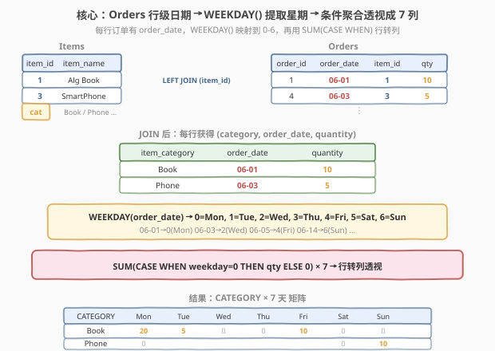
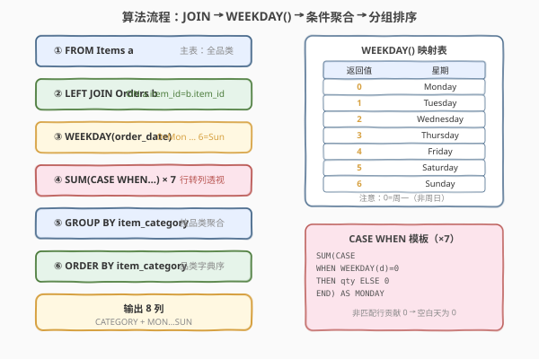
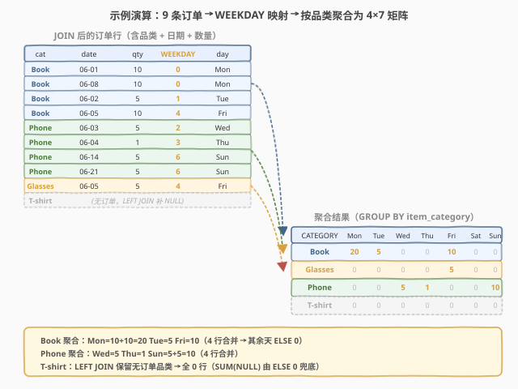

# 周内每天的销售情况

- **题目名称**：周内每天的销售情况
- **链接**：[1479. 周内每天的销售情况](https://leetcode.cn/problems/sales-by-day-of-the-week/)
- **难度**：困难
- **标签**：SQL、行转列、条件聚合、WEEKDAY、LEFT JOIN、GROUP BY、CASE WHEN

## 1. 题目概述

给定两张表：`Items` 存储商品信息（名称与品类），`Orders` 存储订单记录（日期、商品、数量）。编写 SQL 查询，统计**每个品类**在一周中**每天**售出的总数量，输出一张「品类 × 星期」的透视矩阵。

> ⚠️ 本题为 LeetCode Plus 会员专享题。下方表结构与测试数据依据 LeetCode 官方 `mysqlSchemas` 还原。

**表结构**：

```text
Table: Items
+-------------------+------------+
| Column Name       | Type       |
+-------------------+------------+
| item_id           | varchar(30)|
| item_name         | varchar(30)|
| item_category     | varchar(30)|
+-------------------+------------+
item_id 是主键

Table: Orders
+---------------+------------+
| Column Name   | Type       |
+---------------+------------+
| order_id      | int        |
| customer_id   | int        |
| order_date    | date       |
| item_id       | varchar(30)|
| quantity      | int        |
+---------------+------------+
order_id 是主键
```

> 💡 **关键点**：`item_id` 在两张表中都是 `varchar(30)`（非 `int`），JOIN 时按字符串匹配。输出要求按 `item_category` 聚合——同一品类的所有商品合并到一行，每天一列。

**示例 1**：

```text
输入：
Items 表:
+---------+----------------+---------------+
| item_id | item_name      | item_category |
+---------+----------------+---------------+
| 1       | LC Alg. Book   | Book          |
| 2       | LC DB. Book    | Book          |
| 3       | LC SmarthPhone | Phone         |
| 4       | LC Phone 2020  | Phone         |
| 5       | LC SmartGlass  | Glasses       |
| 6       | LC T-Shirt XL  | T-shirt       |
+---------+----------------+---------------+

Orders 表:
+----------+-------------+---------+----------+
| order_id | order_date  | item_id | quantity |
+----------+-------------+---------+----------+
| 1        | 2020-06-01  | 1       | 10       |
| 2        | 2020-06-08  | 2       | 10       |
| 3        | 2020-06-02  | 1       | 5        |
| 4        | 2020-06-03  | 3       | 5        |
| 5        | 2020-06-04  | 4       | 1        |
| 6        | 2020-06-05  | 5       | 5        |
| 7        | 2020-06-05  | 1       | 10       |
| 8        | 2020-06-14  | 4       | 5        |
| 9        | 2020-06-21  | 3       | 5        |
+----------+-------------+---------+----------+

输出：
+-----------+--------+----------+-----------+----------+--------+----------+--------+
| CATEGORY  | MONDAY | TUESDAY  | WEDNESDAY | THURSDAY | FRIDAY | SATURDAY | SUNDAY |
+-----------+--------+----------+-----------+----------+--------+----------+--------+
| Book      | 20     | 5        | 0         | 0        | 10     | 0        | 0      |
| Glasses   | 0      | 0        | 0         | 0        | 5      | 0        | 0      |
| Phone     | 0      | 0        | 5         | 1        | 0      | 0        | 10     |
| T-shirt   | 0      | 0        | 0         | 0        | 0      | 0        | 0      |
+-----------+--------+----------+-----------+----------+--------+----------+--------+
```

**解释**：

- `2020-06-01` 是周一，`2020-06-02` 是周二，`2020-06-03` 是周三，`2020-06-04` 是周四，`2020-06-05` 是周五，`2020-06-08` 是周一，`2020-06-14` 是周日，`2020-06-21` 是周日
- **Book** 品类：周一 = 10(order 1) + 10(order 2) = 20，周二 = 5(order 3)，周五 = 10(order 7)
- **Phone** 品类：周三 = 5(order 4)，周四 = 1(order 5)，周日 = 5(order 8) + 5(order 9) = 10
- **Glasses** 品类：周五 = 5(order 6)
- **T-shirt** 品类：无订单，LEFT JOIN 保留后全为 0

**约束条件**：

- `Orders.order_id` 是主键
- `Items.item_id` 是主键
- `item_id` 类型为 `varchar(30)`
- `order_date` 是合法日期
- 结果按 `item_category` 升序排列

---

## 2. 解题思路

### 2.1 暴力思路：七段子查询 UNION ALL

最直觉的做法：为每个星期写一段独立子查询，分别筛选 `WEEKDAY(order_date) = k` 的订单并按品类聚合，最后 `UNION ALL` 拼成 7 行——但这会把结果变成「每个品类 × 7 行」的长表，而非题目要求的「每个品类 1 行 × 7 列」宽表。

```sql
-- ❌ 错误方向：UNION ALL 产出长表（品类×7行），不是宽表（品类×1行7列）
SELECT item_category, 'MONDAY' AS day, SUM(quantity) AS total
FROM Items JOIN Orders USING(item_id) WHERE WEEKDAY(order_date) = 0
GROUP BY item_category
UNION ALL
SELECT item_category, 'TUESDAY', SUM(quantity) ...
-- ...重复 7 次
```

- **方向错误**：`UNION ALL` 是「纵向拼接行」，而题目要求「横向展开列」。需要的是**行转列透视**（pivot），不是纵向堆叠。
- **重复扫描**：即使方向对了，7 段子查询也会重复 JOIN + 扫描 7 次。

> ⚠️ 暴力的根本误区在于**混淆了 UNION（纵向）与 CASE WHEN（横向）**。行转列必须用条件聚合，在一行内按条件分发到不同列。

### 2.2 核心观察：WEEKDAY() + 条件聚合行转列



三个关键观察把问题从「7 段子查询」简化为「一条查询」：

**观察一（LEFT JOIN 保留全品类）**：`Items` 表中的品类即使没有订单也要出现在结果中（如 `T-shirt`）。用 `LEFT JOIN` 从 `Items` 左连 `Orders`，无订单的品类对应行 `order_date` 和 `quantity` 为 `NULL`，后续条件聚合中 `NULL` 不满足任何 `WEEKDAY` 条件，自动落入 `ELSE 0`。

**观察二（WEEKDAY() 提取星期编号）**：MySQL 的 `WEEKDAY(date)` 函数返回 0–6 的整数，映射关系为 $0=\text{Monday}, 1=\text{Tuesday}, \ldots, 6=\text{Sunday}$。这与输出列的顺序（Monday 在前）天然对齐，每个编号对应一个 `CASE WHEN` 分支。

> ⚠️ **WEEKDAY vs DAYOFWEEK**：两者编号不同！`WEEKDAY()` 返回 0=Monday…6=Sunday；`DAYOFWEEK()` 返回 1=Sunday…7=Saturday（周日为 1）。混用会导致列错位，这是本题最常见的坑。

**观察三（SUM + CASE WHEN 行转列）**：对于每个品类组，用 7 个 `SUM(CASE WHEN WEEKDAY = k THEN quantity ELSE 0 END)` 分别累加对应星期日的销量。`CASE WHEN` 在行内判定星期 → `SUM` 在组内累加 → 7 个并列的聚合列即透视结果：

$$\text{Monday} = \sum_{\substack{\text{row} \in \text{category}}} \begin{cases} \text{quantity} & \text{if } \texttt{WEEKDAY}(\text{order\_date}) = 0 \\ 0 & \text{otherwise} \end{cases}$$

> 💡 **一句话**：`LEFT JOIN` 保品类 → `WEEKDAY()` 映射星期 → `SUM(CASE WHEN)` 行转列 → `GROUP BY` 聚合 → `ORDER BY` 排序。这是 SQL「**条件聚合透视**」的经典四步范式。

### 2.3 算法流程图



| 步骤 | SQL 子句 | 作用 |
|------|----------|------|
| ① | `FROM Items a` | 主表：全品类（含无订单品类） |
| ② | `LEFT JOIN Orders b ON a.item_id = b.item_id` | 左连接订单，保留无订单品类（`NULL` 行） |
| ③ | `WEEKDAY(b.order_date)` | 将日期映射为 0–6（0=Monday） |
| ④ | `SUM(CASE WHEN WEEKDAY=0 THEN quantity ELSE 0) × 7` | 7 个条件聚合列，行转列透视 |
| ⑤ | `GROUP BY a.item_category` | 按品类分组，组内 SUM 聚合 |
| ⑥ | `ORDER BY a.item_category` | 品类字典序排列 |

> 💡 **执行顺序**：`FROM` + `LEFT JOIN` 先拼出行级数据（品类 + 日期 + 数量）→ `WEEKDAY()` 在每行计算星期编号 → `GROUP BY` 按品类分组 → 每组内 7 个 `SUM(CASE WHEN)` 并行聚合 → 输出 8 列宽表。`CASE WHEN` 是行内判定（哪一天），`SUM` 是组内累加（加多少），两者正交。

### 2.4 示例演算

以示例 1 的 9 条订单为例，逐行展开 WEEKDAY 映射与品类聚合的过程：



| order_id | order_date | item_id | 品类 | qty | WEEKDAY | 星期 |
|----------|------------|---------|------|-----|---------|------|
| 1 | 2020-06-01 | 1 | Book | 10 | 0 | Mon |
| 2 | 2020-06-08 | 2 | Book | 10 | 0 | Mon |
| 3 | 2020-06-02 | 1 | Book | 5 | 1 | Tue |
| 4 | 2020-06-03 | 3 | Phone | 5 | 2 | Wed |
| 5 | 2020-06-04 | 4 | Phone | 1 | 3 | Thu |
| 6 | 2020-06-05 | 5 | Glasses | 5 | 4 | Fri |
| 7 | 2020-06-05 | 1 | Book | 10 | 4 | Fri |
| 8 | 2020-06-14 | 4 | Phone | 5 | 6 | Sun |
| 9 | 2020-06-21 | 3 | Phone | 5 | 6 | Sun |

**聚合过程**（`GROUP BY item_category` 后每组内 7 列并行 `SUM(CASE WHEN)`）：

| 品类 | Monday(WD=0) | Tuesday(WD=1) | Wednesday(WD=2) | Thursday(WD=3) | Friday(WD=4) | Saturday(WD=5) | Sunday(WD=6) |
|------|-------------|---------------|-----------------|----------------|-------------|----------------|--------------|
| **Book** | 10+10=**20** | **5** | 0 | 0 | **10** | 0 | 0 |
| **Glasses** | 0 | 0 | 0 | 0 | **5** | 0 | 0 |
| **Phone** | 0 | 0 | **5** | **1** | 0 | 0 | 5+5=**10** |
| **T-shirt** | 0 | 0 | 0 | 0 | 0 | 0 | 0 |

- **第 ① 步**：`LEFT JOIN` 后每行获得 `(item_category, order_date, quantity)`，`T-shirt` 无匹配行但被保留（`order_date=NULL`）。
- **第 ② 步**：`WEEKDAY()` 将每个 `order_date` 映射为 0–6（如 `2020-06-01→0` 即 Monday）。
- **第 ③ 步**：`GROUP BY item_category` 将 9 行（+1 行 T-shirt NULL）分为 4 组，每组内 7 个 `SUM(CASE WHEN)` 分别累加对应星期的 `quantity`，未命中天数 `ELSE 0`。

> 💡 **NULL 安全**：`T-shirt` 行的 `order_date` 为 `NULL`，`WEEKDAY(NULL)` 返回 `NULL`，`NULL = 0` 为 `UNKNOWN`（不触发 `THEN`），自动走 `ELSE 0`。无需额外 `COALESCE` 处理。

---

## 3. 参考代码

### SQL（解法 A：WEEKDAY + CASE WHEN，推荐）

```sql
SELECT a.item_category AS 'CATEGORY',
       SUM(CASE WHEN WEEKDAY(b.order_date) = 0 THEN b.quantity ELSE 0 END) AS 'MONDAY',
       SUM(CASE WHEN WEEKDAY(b.order_date) = 1 THEN b.quantity ELSE 0 END) AS 'TUESDAY',
       SUM(CASE WHEN WEEKDAY(b.order_date) = 2 THEN b.quantity ELSE 0 END) AS 'WEDNESDAY',
       SUM(CASE WHEN WEEKDAY(b.order_date) = 3 THEN b.quantity ELSE 0 END) AS 'THURSDAY',
       SUM(CASE WHEN WEEKDAY(b.order_date) = 4 THEN b.quantity ELSE 0 END) AS 'FRIDAY',
       SUM(CASE WHEN WEEKDAY(b.order_date) = 5 THEN b.quantity ELSE 0 END) AS 'SATURDAY',
       SUM(CASE WHEN WEEKDAY(b.order_date) = 6 THEN b.quantity ELSE 0 END) AS 'SUNDAY'
FROM Items a
LEFT JOIN Orders b ON a.item_id = b.item_id
GROUP BY a.item_category
ORDER BY a.item_category;
```

> 💡 **写法要点**：
> - `LEFT JOIN` 从 `Items` 出发——保证无订单品类（如 `T-shirt`）也出现在结果中，全为 0。
> - `WEEKDAY()` 返回 0=Monday…6=Sunday，与输出列顺序对齐，无需偏移计算。
> - `SUM(CASE WHEN … THEN quantity ELSE 0 END)`：命中则累加 `quantity`，不命中或 `NULL` 则贡献 0。
> - 列别名用单引号 `'MONDAY'` 保持大写——MySQL 默认列名不区分大小写，但引号确保输出格式精确匹配。

### SQL（解法 B：DAYOFWEEK + IF 简写）

```sql
SELECT a.item_category AS 'CATEGORY',
       SUM(IF(DAYOFWEEK(b.order_date) = 2, b.quantity, 0)) AS 'MONDAY',
       SUM(IF(DAYOFWEEK(b.order_date) = 3, b.quantity, 0)) AS 'TUESDAY',
       SUM(IF(DAYOFWEEK(b.order_date) = 4, b.quantity, 0)) AS 'WEDNESDAY',
       SUM(IF(DAYOFWEEK(b.order_date) = 5, b.quantity, 0)) AS 'THURSDAY',
       SUM(IF(DAYOFWEEK(b.order_date) = 6, b.quantity, 0)) AS 'FRIDAY',
       SUM(IF(DAYOFWEEK(b.order_date) = 7, b.quantity, 0)) AS 'SATURDAY',
       SUM(IF(DAYOFWEEK(b.order_date) = 1, b.quantity, 0)) AS 'SUNDAY'
FROM Items a
LEFT JOIN Orders b ON a.item_id = b.item_id
GROUP BY a.item_category
ORDER BY a.item_category;
```

> ⚠️ **DAYOFWEEK 映射**：`1=Sunday, 2=Monday, 3=Tuesday, 4=Wednesday, 5=Thursday, 6=Friday, 7=Saturday`。注意 Sunday 是 1（非 0），Saturday 是 7（非 6），与 `WEEKDAY()` 完全不同。`IF(cond, a, b)` 是 MySQL 专有函数，等价于 `CASE WHEN cond THEN a ELSE b END`，写法更短但可读性稍逊。

### Python（pandas）

```python
import pandas as pd

def sales_by_day(items: pd.DataFrame, orders: pd.DataFrame) -> pd.DataFrame:
    merged = items.merge(orders, on='item_id', how='left')
    day_names = ['Monday', 'Tuesday', 'Wednesday', 'Thursday',
                 'Friday', 'Saturday', 'Sunday']
    merged['weekday'] = pd.to_datetime(merged['order_date']).dt.weekday

    result = (merged
              .assign(qty=merged['quantity'].fillna(0))
              .pivot_table(index='item_category', columns='weekday',
                           values='qty', aggfunc='sum', fill_value=0))
    result.columns = [day_names[c] for c in result.columns]
    for d in day_names:
        if d not in result.columns:
            result[d] = 0
    result = result[day_names].reset_index().rename(columns={'item_category': 'CATEGORY'})
    result.columns = [c.upper() for c in result.columns]
    return result.sort_values('CATEGORY')
```

> 💡 **pandas 对照**：`merge(how='left')` 对应 `LEFT JOIN`；`dt.weekday` 对应 `WEEKDAY()`（同为 0=Monday）；`pivot_table` 对应 `SUM(CASE WHEN)` 的行转列透视；`fill_value=0` 对应 `ELSE 0`。补列循环处理某些星期无订单的情况（等价于 SQL 中 `ELSE 0` 的兜底）。

---

## 4. 复杂度分析

| 维度 | WEEKDAY + CASE（推荐） | DAYOFWEEK + IF | UNION ALL ×7（❌错误方向） |
|------|----------------------|----------------|--------------------------|
| **时间复杂度** | $O(m + n)$ | $O(m + n)$ | $O(7 \times (m + n))$ |
| **空间复杂度** | $O(m + n)$（JOIN 结果） | $O(m + n)$ | $O(7 \times n)$（7 段结果） |
| **JOIN 次数** | 1 次 LEFT JOIN | 1 次 LEFT JOIN | 7 次 JOIN |
| **扫描次数** | 扫描 1 次 | 扫描 1 次 | 扫描 7 次 |
| **输出形态** | 宽表（品类×7列）✓ | 宽表 ✓ | 长表（品类×7行）✗ |
| **代码行数** | 11 行 | 11 行 | 35+ 行 |

- $m$ = `Items` 行数，$n$ = `Orders` 行数
- **推荐解法**：LEFT JOIN 一次 $O(m + n)$，`WEEKDAY()` 每行 $O(1)$，`GROUP BY` 哈希聚合 $O(n)$，整体 $O(m + n)$。7 个 `SUM(CASE WHEN)` 在同一趟聚合中并行计算，不增加扫描次数。
- **UNION ALL 方案**：不仅方向错误（长表 vs 宽表），且重复 JOIN 7 次，常数因子大 7 倍。

> ⚠️ 本题数据量小，所有写法都能秒过。面试中写 `WEEKDAY + CASE WHEN` 体现对「行转列透视」与「条件聚合」的把握——这是 SQL 报表查询的核心技能。

---

## 5. 扩展：行转列透视的通用范式

### 5.1 条件聚合透视模板

本题是 SQL **行转列**（pivot）的经典场景。通用模板：

```sql
SELECT group_key,
       SUM(CASE WHEN pivot_cond = val1 THEN metric ELSE 0 END) AS col1,
       SUM(CASE WHEN pivot_cond = val2 THEN metric ELSE 0 END) AS col2,
       ...
FROM table
GROUP BY group_key;
```

- `group_key`：分组键（本题 = `item_category`）
- `pivot_cond`：决定列归属的条件（本题 = `WEEKDAY(order_date)`）
- `metric`：被聚合的值（本题 = `quantity`）
- `ELSE 0`：未命中条件时的默认值（也可用 `ELSE NULL` 视需求而定）

### 5.2 WEEKDAY vs DAYOFWEEK vs DATE_FORMAT

MySQL 提供三种提取星期的方式，编号各不相同：

| 函数 | 返回值 | Monday | Sunday | 适用场景 |
|------|--------|--------|--------|---------|
| `WEEKDAY(date)` | 0–6 | 0 | 6 | 编号从周一开始，与列顺序对齐（推荐） |
| `DAYOFWEEK(date)` | 1–7 | 2 | 1 | ODBC 标准，周日为 1 |
| `DAYNAME(date)` | 字符串 | `'Monday'` | `'Sunday'` | 可读性好但需字符串比较 |

```sql
-- 第三种写法：DAYNAME + 字符串比较（可读性最佳但性能略低）
SUM(CASE WHEN DAYNAME(b.order_date) = 'Monday' THEN b.quantity ELSE 0 END) AS 'MONDAY'
```

> 💡 `DATE_FORMAT(date, '%W')` 也可返回星期名称字符串，等价于 `DAYNAME()`。

### 5.3 LEFT JOIN 与无订单品类

题目隐含要求：**所有品类都出现在结果中**，即使没有订单。`Items` 表中的 `T-shirt` 品类无任何订单，用 `INNER JOIN` 会丢失该行。`LEFT JOIN` 保留后：

- `b.order_date` = `NULL` → `WEEKDAY(NULL)` = `NULL` → `NULL = 0` 为 `UNKNOWN` → 走 `ELSE 0`
- `b.quantity` = `NULL`，但 `THEN b.quantity` 分支不会被触发（条件为 `UNKNOWN`），故不影响 `SUM`

> ⚠️ 若题目改为「只统计有订单的品类」，则改用 `INNER JOIN` 即可——核心透视逻辑不变。

---

## 6. 面试要点

1. **为什么用 LEFT JOIN 而非 INNER JOIN？**

   > 题目要求所有品类都出现在结果中，包括没有订单的品类（如 `T-shirt`）。`LEFT JOIN` 从 `Items` 出发左连 `Orders`，无匹配的品类行 `order_date` 和 `quantity` 为 `NULL`，后续 `WEEKDAY(NULL)` 返回 `NULL`，条件判断为 `UNKNOWN`，自动走 `ELSE 0`，保证无订单品类输出全 0 行。`INNER JOIN` 会静默丢弃这些品类。

2. **WEEKDAY() 和 DAYOFWEEK() 有什么区别？**

   > `WEEKDAY(date)` 返回 0–6，0=Monday、6=Sunday，与输出列顺序（Monday 在前）天然对齐。`DAYOFWEEK(date)` 返回 1–7，1=Sunday、7=Saturday，周日为 1 而非 0。两者编号完全不同，混用会导致列错位——这是本题最常见 bug。推荐用 `WEEKDAY()` 避免偏移计算。

3. **为什么用 SUM(CASE WHEN) 而非 UNION ALL？**

   > `UNION ALL` 是纵向拼接（行堆叠），会把结果变成「每个品类 × 7 行」的长表，不符合题目「每个品类 1 行 × 7 列」的宽表要求。行转列必须用条件聚合：`SUM(CASE WHEN weekday=k THEN qty ELSE 0 END)` 在一行内按条件分发到不同列，`GROUP BY` 后每个品类恰好一行。此外，UNION ALL 还需重复 JOIN 7 次，效率更差。

4. **T-shirt 品类没有订单，SUM 不会出 NULL 吗？**

   > 不会。LEFT JOIN 后 `T-shirt` 行的 `quantity` 为 `NULL`，但 `CASE WHEN` 的条件 `WEEKDAY(NULL) = 0` 结果为 `UNKNOWN`（非 `TRUE`），不会触发 `THEN b.quantity` 分支，而是走 `ELSE 0`。`SUM` 累加的全是 0，结果为 0。`SUM` 仅在所有值都为 `NULL` 且无 `ELSE` 兜底时才返回 `NULL`——本题 `ELSE 0` 保证了非 `NULL` 输出。

5. **如果要求按 item_name（而非 item_category）分组呢？**

   > 只需把 `GROUP BY a.item_category` 改为 `GROUP BY a.item_category, a.item_name`，并在 `SELECT` 中加上 `a.item_name` 列。透视逻辑（`WEEKDAY + SUM(CASE WHEN)`）完全不变——条件聚合透视与分组键的选择是正交的，分组键决定行粒度，`CASE WHEN` 决定列展开。

> 💡 **一句话总结**：1479 的灵魂是「**条件聚合行转列透视**」——`WEEKDAY()` 把日期映射为星期编号，`SUM(CASE WHEN)` 把行级数据透视成 7 个列，`LEFT JOIN` 保证全品类覆盖，`GROUP BY` 按品类聚合。核心是 SQL 报表查询中「行→列」的范式。

---

## 7. 同类练习题

- [1179. 重新格式化部门表](../1101-1200/1179_重新格式化部门表.md)：SQL 行转列入门题——`SUM(IF(month=k, revenue, 0))` 透视月份列，与 1479 的 `SUM(CASE WHEN weekday=k)` 完全同构，对照理解条件聚合透视的最简形态
- [1440. 计算布尔表达式的值](../1401-1500/1440_计算布尔表达式的值.md)：SQL `CASE WHEN` 条件派生列——双 JOIN 解析变量值后按 `operator` 分发，对照 1479 的 `CASE WHEN` 按 `WEEKDAY` 分发，理解同一语法的「行内判定」与「组内聚合」两种应用形态
- [1173. 即时食物配送 I](https://leetcode.cn/problems/immediate-food-delivery-i/)：SQL `CASE WHEN` + 聚合百分比——用 `IF(order_date = pref_date, 1, 0)` 计布尔标志再 `AVG`，对照 1479 的 `CASE WHEN` 计星期标志再 `SUM`，体会条件表达式在聚合中的通用用法
- [1193. 每月交易 I](https://leetcode.cn/problems/monthly-transactions-i/)：SQL `DATE_FORMAT` + 条件聚合——按月分组并对 `state` 做 `SUM(IF(state='approved', 1, 0))` 计数，与 1479 的 `SUM(CASE WHEN weekday=k)` 同为「条件标志 + 聚合」范式
- [1107. 每日新用户统计](https://leetcode.cn/problems/new-users-daily-count/)：SQL 日期函数 + 两步聚合——`MIN(activity_date)` 取注册日后按日分组计数，对照 1479 的 `WEEKDAY(order_date)` 提取星期后按品类分组聚合，体会日期函数在分组与透视中的不同角色
