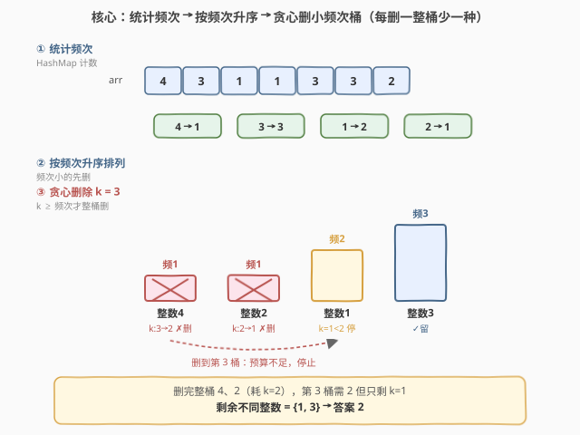
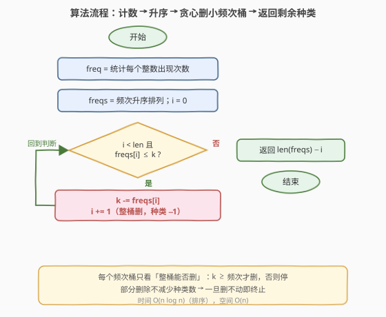

# 不同整数的最少数目

- **题目名称**：不同整数的最少数目
- **链接**：[1481. 不同整数的最少数目](https://leetcode.cn/problems/least-number-of-unique-integers-after-k-removals/)
- **难度**：中等
- **标签**：贪心、数组、哈希表、计数、排序

## 1. 题目概述

给你一个整数数组 `arr` 和一个整数 `k`。现需要从数组中**恰好移除 `k` 个元素**，请找出移除后数组中**不同整数的最少数目**。

**示例 1**：

```text
输入：arr = [5,5,4], k = 1
输出：1
解释：移除 1 个 4，数组中只剩下 5 一种整数。
```

**示例 2**：

```text
输入：arr = [4,3,1,1,3,3,2], k = 3
输出：2
解释：先移除 4、2，然后再移除两个 1 中的任意 1 个或者三个 3 中的任意 1 个，
     最后剩下 1 和 3 两种整数。
```

**约束条件**：

- $1 \le \text{arr.length} \le 10^5$
- $1 \le \text{arr}[i] \le 10^9$
- $0 \le k \le \text{arr.length}$

> 💡 **关键点**：要让「不同整数数目」尽量少，等价于**用有限的 $k$ 个删除名额，尽可能多地「整族灭掉」若干整数**。而灭掉一个出现 $f$ 次的整数需要花 $f$ 个名额、换来「种类 $-1$」。于是问题变成：在预算 $k$ 内，挑**花费最小**的整数先灭——典型贪心。

---

## 2. 解题思路

### 2.1 暴力思路：枚举删除组合

最朴素的做法：从 $n$ 个元素里枚举所有「删 $k$ 个」的组合 $\binom{n}{k}$，对每种剩余方案统计不同整数数取最小。

- **正确**：穷举必然覆盖最优解；
- **不可行**：$\binom{n}{k}$ 在 $n=10^5$ 时是天文数字，且每种方案统计种类又是 $O(n)$，完全超时。

> ⚠️ 暴力的浪费在于「**把目光盯在单个元素上**」。其实减少种类数只跟「某个整数是否被全删」有关，与具体删了哪几个位置无关——应该把视角从「元素」抬升到「整数族（频次桶）」。

### 2.2 核心观察：贪心删小频次桶



把每个整数看作一个「桶」，桶的大小就是它的**出现频次** $f$。删掉一整桶需要 $f$ 个名额，换来种类数 $-1$；只删一部分则该整数仍在、种类数不变。于是：

$$\text{在预算 } k \text{ 内，最多能整删多少个桶} \;\Longrightarrow\; \text{种类数减少多少}$$

要**最大化删除桶数**，自然优先挑**频次最小**的桶（花费最小、收益相同）。算法分三步：

1. **统计频次**：`HashMap` 记每个整数的出现次数；
2. **升序排列**：把所有频次排序，小的在前；
3. **贪心删除**：从最小频次起，只要 $k \ge f$ 就整桶删（$k \mathrel{-}= f$，种类 $-1$）；一旦 $k < f$ 立即停止（剩下的名额删不完整桶，种类不再减少）。

> 💡 **一句话**：每个桶的「性价比」相同（都换 $-1$ 种类），所以按**成本（频次）升序**贪心取，能删的桶数最多——这就是最优解。

> ⚠️ **为什么部分删除无效**：删掉整数 $x$ 的 $f-1$ 个仍剩 $1$ 个，$x$ 依旧存在于数组，种类数不降。因此只有「整桶删」才有收益，预算不足下一桶时即可终止，无需继续。

**正确性证明（交换论证）**：设最优解删了频次较大的桶 $b$（成本 $f_b$）却没删频次较小的桶 $a$（成本 $f_a < f_b$）。把 $b$ 换成 $a$：成本从 $f_b$ 降到 $f_a$，仍在预算内，种类数不变——故存在一个「总是先删小频次」的最优解，贪心成立。

### 2.3 算法流程图



**完整步骤**：

1. **统计频次** `freq`：遍历 `arr` 计数；
2. **取频次列表** `freqs = sorted(freq.values())`（升序）；
3. **初始化** `i = 0`（指向当前尝试的桶）；
4. **循环**：当 `i < len(freqs)` 且 `freqs[i] <= k`：
   - `k -= freqs[i]`（整桶删，消耗名额）；
   - `i += 1`（种类数 $-1$，即已删桶数 $+1$）；
5. **返回** `len(freqs) - i`（总种类数 $-$ 已整删桶数 $=$ 剩余种类数）。

> 💡 用 `i` 记「已删桶数」而非显式 `pop`，避免 $O(m)$ 的列表头删除开销；返回 `len - i` 即剩余种类。

### 2.4 示例演算

以示例 2 的 `arr = [4,3,1,1,3,3,2]`、`k = 3` 为例：

![示例演算：arr = [4,3,1,1,3,3,2]，k = 3](../images/1481_example_walkthrough.svg)

| 步 | 当前桶 | 频次 | $k$ 变化 | 操作 | 剩余种类 |
|----|--------|------|----------|------|----------|
| 0 | — | — | 3 | 初始 | 4 |
| 1 | 整数 4 | 1 | 3 → 2 | ✗ 整桶删 | 3 |
| 2 | 整数 2 | 1 | 2 → 1 | ✗ 整桶删 | 2 |
| 3 | 整数 1 | 2 | 1 < 2 | ✗ 停 | 2 |

- **第 ① 步**：统计频次得 $\{4:1, 3:3, 1:2, 2:1\}$，共 4 种；升序频次 $[1,1,2,3]$，对应整数 $[4,2,1,3]$。
- **第 ② 步**：$k=3 \ge 1$，删整数 4（$k \to 2$，种类 $4 \to 3$）；$k=2 \ge 1$，删整数 2（$k \to 1$，种类 $3 \to 2$）。
- **第 ③ 步**：下一桶整数 1 频次 $2$，但 $k=1 < 2$，删不动，停止。剩余 $\{1, 3\}$ 共 **2** 种 ✓。

> 以示例 1 `[5,5,4]`、$k=1$ 验证：频次 $\{5:2, 4:1\}$，升序 $[1,2]$；$k=1 \ge 1$ 删 4（$k \to 0$，种类 $2 \to 1$）；下一桶频次 $2 > 0$ 停止 ⟹ 答案 **1** ✓。

---

## 3. 参考代码

### C++

```cpp
class Solution {
public:
    int findLeastNumOfUniqueInts(vector<int>& arr, int k) {
        unordered_map<int, int> freq;
        for (int x : arr) freq[x]++;
        vector<int> cnt;
        cnt.reserve(freq.size());
        for (auto& [v, c] : freq) cnt.push_back(c);
        sort(cnt.begin(), cnt.end());
        int removed = 0;
        for (int c : cnt) {
            if (k >= c) { k -= c; removed++; }
            else break;
        }
        return (int)cnt.size() - removed;
    }
};
```

### Python

```python
class Solution:
    def findLeastNumOfUniqueInts(self, arr: List[int], k: int) -> int:
        freq = Counter(arr)
        cnt = sorted(freq.values())
        removed = 0
        for c in cnt:
            if k >= c:
                k -= c
                removed += 1
            else:
                break
        return len(cnt) - removed
```

> 💡 **实现要点**：① 先 `Counter` 计数，再 `sorted(freq.values())` 拿到升序频次，无需保留整数本体（只关心频次成本）；② 用 `removed` 计已删桶数，遇到 `k < c` 立即 `break`——后续频次更大必然也删不动；③ 返回 `len(cnt) - removed`。`break` 后不继续遍历是关键剪枝：升序保证剩余桶频次 $\ge$ 当前，全删不动。

---

## 4. 复杂度分析

| 维度 | 排序贪心 $O(n \log n)$（推荐） | 暴力枚举 |
|------|-------------------------------|----------|
| **时间复杂度** | $O(n \log n)$ | $O(\binom{n}{k} \cdot n)$ |
| **空间复杂度** | $O(n)$（频次表 + 频次数组） | $O(n)$ |
| **可行性** | $n=10^5$ 轻松通过 | 完全超时 |
| **核心操作** | 计数 + 排序 + 一趟贪心 | 枚举组合 + 重复统计 |

- **排序贪心**：计数 $O(n)$；排序至多 $m$ 个频次（$m \le n$ 不同整数），$O(m \log m) \le O(n \log n)$；贪心一趟 $O(m)$。整体 $O(n \log n)$，空间 $O(n)$。本题最优解之一。
- **下界**：$O(n)$ 至少要读完整数组；排序带来 $O(n \log n)$，但可用频次桶排优化到 $O(n)$（见第 5 节）。

> ⚠️ $m$（不同整数数）$\le n$，故排序规模不超过 $n$。当所有元素互异时 $m=n$，每个频次都是 $1$，$k$ 个名额可删 $k$ 个桶，答案 $n-k$——贪心照样一遍过。

---

## 5. 扩展：频次桶排，$O(n)$ 时间

排序是 $O(n \log n)$ 的瓶颈。注意到**频次 $f$ 的取值范围是 $[1, n]$**（一个整数最多出现 $n$ 次），可用**频次为键的计数排序**（桶排）把排序降到 $O(n)$。

**思路**：建一个数组 `bucket[f]` 记「频次恰为 $f$ 的整数有多少个」。然后按 $f$ 从 $1$ 到 $n$ 升序遍历：若 $k \ge f \cdot \text{bucket}[f]$，则这一档的整数**全部**可删，`removed += bucket[f]`、`k -= f * bucket[f]`；否则只能删 $\lfloor k/f \rfloor$ 个，`removed += k // f`，随后预算耗尽跳出。

```cpp
class Solution {
public:
    int findLeastNumOfUniqueInts(vector<int>& arr, int k) {
        int n = arr.size();
        unordered_map<int, int> freq;
        for (int x : arr) freq[x]++;
        vector<int> bucket(n + 1, 0);          // bucket[f] = 频次恰为 f 的整数个数
        for (auto& [v, c] : freq) bucket[c]++;
        int m = freq.size(), removed = 0;
        for (int f = 1; f <= n; ++f) {
            if (bucket[f] == 0) continue;
            long long need = (long long)f * bucket[f];
            if (k >= need) {                    // 这一档全删
                k -= need;
                removed += bucket[f];
            } else {                            // 只能删一部分
                removed += k / f;
                break;
            }
        }
        return m - removed;
    }
};
```

- **时间**：计数 $O(n)$ + 桶排遍历 $O(n)$ = $O(n)$；
- **空间**：$O(n)$（频次表 + 频次桶）。

> 💡 **桶排的代价是空间换时间**：当 $n=10^5$ 时多开一个长度 $n+1$ 的数组毫无压力。面试中先给排序解法讲清思路，再提「频次有界 $\Rightarrow$ 桶排可 $O(n)$」作为加分项。注意 `f * bucket[f]` 可能接近 $n \cdot n$，用 `long long` 防溢出（实际 $\sum f\cdot\text{bucket}[f] = n$，单步不超 $n$，但写法上稳妥）。

---

## 6. 面试要点

1. **为什么贪心删小频次桶是最优的？**

   > 用交换论证：若某最优解删了高频桶 $b$（成本 $f_b$）却留下低频桶 $a$（$f_a < f_b$），把 $b$ 换成 $a$ 后成本更低、仍在预算内、种类数不变——故总存在「先删小频次」的最优解。每个桶收益相同（都 $-1$ 种类），按成本升序取是经典的「最小成本最大化数量」贪心。

2. **部分删除一个桶为什么不减少种类数？**

   > 只要整数还剩 $\ge 1$ 个，它就仍算一种。删掉 $f-1$ 个还剩 $1$ 个，种类不变；只有把 $f$ 个全删掉才 $-1$。所以预算不够下一桶时立即停止，剩下的名额无法再降种类。

3. **这道题和 0-1 背包有什么关系？为什么不用 DP？**

   > 可建模为 0-1 背包：每个整数是一件物品，成本=频次 $f$、价值=$1$，预算=$k$，求最大价值。但所有物品**价值相同**（都是 $1$），此时「按成本升序贪心」即为最优——价值均匀时贪心退化为最优解，无需 $O(nk)$ 的 DP。价值不均时才需背包。

4. **能否做到 $O(n)$ 时间？**

   > 能。频次 $f \in [1, n]$ 有界，用 `bucket[f]` 记频次为 $f$ 的整数个数，按 $f$ 升序遍历即可替代排序，整体 $O(n)$。本质是**对频次做计数排序**。注意 `f * bucket[f]` 的累积虽 $\sum = n$，但写法上用 `long long` 更稳妥。

5. **边界情况怎么处理？**

   > $k=0$：不删任何元素，答案就是不同整数数 $m$，循环条件 `freqs[i] <= 0` 不成立，直接返回 `m` ✓。$k \ge n$：可删完所有元素，答案 $0$（删光后无整数）。$k$ 介于之间按贪心走。另外元素值达 $10^9$ 不影响——只用值做哈希键，不参与排序。

> 💡 **一句话总结**：1481 的灵魂是「**贪心删小频次桶**」——统计频次、升序排列、用预算 $k$ 从最小频次起整桶删，删不动即停；价值均匀使贪心最优，频次有界可桶排优化到 $O(n)$。

---

## 7. 同类练习题

- [347. 前 K 个高频元素](https://leetcode.cn/problems/top-k-frequent-elements/)（[题解](../0301-0400/347_前K个高频元素.md)）：同属「频次统计 + 排序/堆」家族——求频次最高的 K 个，对照 1481 求「频次最低的若干个先删」，频次表是共同前置
- [451. 根据字符出现频率排序](https://leetcode.cn/problems/sort-characters-by-frequency/)（[题解](../0401-0500/451_根据字符出现频率排序.md)）：频次统计后按频次降序输出字符——与 1481 升序取小频次互为镜像，巩固「频次表 + 排序」套路
- [387. 字符串中的第一个唯一字符](https://leetcode.cn/problems/first-unique-character-in-a-string/)（[题解](../0301-0400/387_字符串中的第一个唯一字符.md)）：频次统计后找频次为 1 的首个位置——频次表的另一应用，对照 1481 中「频次=1 的桶最易删」
- [692. 前 K 个高频单词](https://leetcode.cn/problems/top-k-frequent-words/)（[题解](../0601-0700/692_前K个高频单词.md)）：频次统计 + Top-K 最小堆 + 自定义比较器——与 1481 同源，把「排序取前若干」换成「堆取 Top-K」，体会两种取舍
