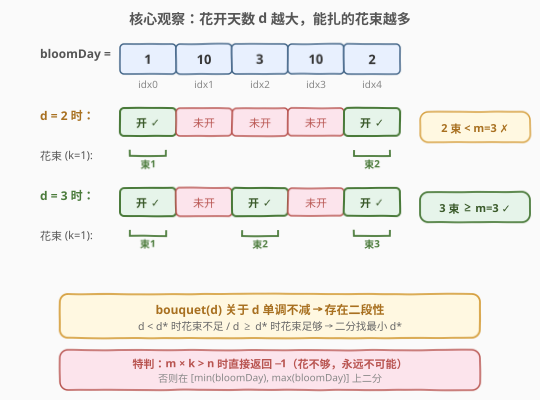
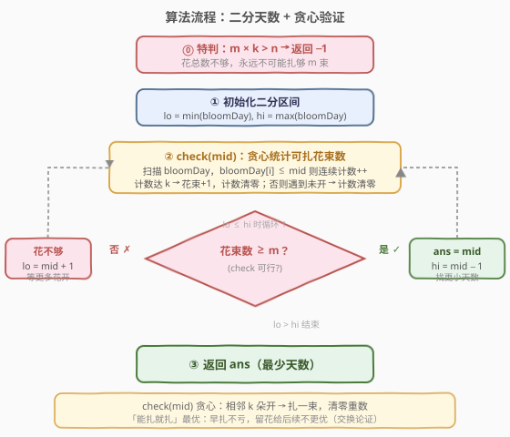

# LeetCode 制作 m 束花所需的最少天数 题解

## 1. 题目概述

- **标题 / 题号**：制作 m 束花所需的最少天数（#1482，medium）
- **链接**：https://leetcode.cn/problems/minimum-number-of-days-to-make-m-bouquets/
- **难度**：中等
- **标签**：数组、二分查找、贪心

**题意**：花园里有 `n` 朵花，第 `i` 朵花会在 `bloomDay[i]` 这天绽放，之后一直保持开放。你想制作 `m` 束花，每束花需要用 **`k` 朵相邻** 的花（即下标连续的一段）。每朵花只能用在一束花中。

返回能制作 `m` 束花所需的**最少天数**。如果无论多少天都无法制作 `m` 束花，返回 `-1`。

**示例 1**：

```text
输入：bloomDay = [1,10,3,10,2], m = 3, k = 1
输出：3
解释：第 3 天时 idx0(1)、idx2(3)、idx4(2) 均已绽放，
     各取 1 朵（k=1）可扎 3 束，恰好满足 m=3。
```

**示例 2**：

```text
输入：bloomDay = [1,10,3,10,2], m = 3, k = 2
输出：-1
解释：需要 3×2=6 朵相邻的花，但花园只有 5 朵，永远不可能。
```

**示例 3**：

```text
输入：bloomDay = [7,7,7,7,12,7,7], m = 2, k = 3
输出：12
解释：第 7 天时 [✓✓✓✓ ✗ ✓✓]，连续段 4 和 2，
     ⌊4/3⌋+⌊2/3⌋ = 1 束，不够；第 12 天全部绽放，⌊7/3⌋=2 束，恰好满足。
```

**约束**：

- $\text{bloomDay.length} = n$
- $1 \le n \le 10^5$
- $1 \le \text{bloomDay}[i] \le 10^9$
- $1 \le m \le 10^6$
- $1 \le k \le n$

> 💡 **关键点**：题目求「最少天数」使花束数达到 `m`，且花束数随天数**单调不减**——这是「二分答案」的典型信号，与 [1011. 在 D 天内送达包裹的能力](../1001-1100/1011_在D天内送达包裹的能力.md) 同构。

## 2. 解题思路

### 2.1 暴力思路

天数 `d` 的取值范围是 $[\min(\text{bloomDay}),\, \max(\text{bloomDay})]$：

- 下界 $\min(\text{bloomDay})$：至少有一朵花开的那天。
- 上界 $\max(\text{bloomDay})$：所有花都开了，能扎的花束最多。

从最小天数开始逐个尝试，对每个 `d` 用贪心扫描统计可扎花束数 `bouquet(d)`，第一个满足 `bouquet(d) >= m` 的 `d` 即为答案。验证单个 `d` 是 $O(n)$，整体 $O(n \cdot (\max - \min))$，而 $\max$ 可达 $10^9$，必然超时。

> ⚠️ 还需先特判：若 $m \times k > n$，花总数不够，直接返回 `-1`。注意 $m$ 可达 $10^6$、$k$ 可达 $10^5$，乘积溢出 `int`，需用 `long long`。

### 2.2 核心观察：二分答案



关键直觉是：**可扎花束数 `bouquet(d)` 关于天数 `d` 单调不减**。

- `d` 越大，绽放的花越多，连续段越长，能扎的束数越多。
- `d = min` 时最少（可能 0 束）；`d = max` 时所有花都开了，花束数最多。

于是存在一个**分界点** `d*`：

```text
d < d* → bouquet(d) < m   (花不够，扎不满)
d ≥ d* → bouquet(d) ≥ m   (可行，扎得满)
```

这正是二分查找所需的**二段性**。把「求最少天数」转化为：在有序区间 $[\min, \max]$ 上二分，每次 $O(n)$ 贪心验证 `mid` 是否可行，可行则去左半找更小的，不可行则去右半等更多花开。

> 💡 **识别信号**：题目求「最小的满足某单调条件值」，且能 $O(n)$ 验证 → 想「二分答案」。与 [1011. 在 D 天内送达包裹的能力](../1001-1100/1011_在D天内送达包裹的能力.md) 是同一套模板，只是 `check()` 从「贪心装船」换成了「贪心数花束」。

> ⚠️ **先判不可能**：$m \times k > n$ 时返回 `-1`。这一步必须在二分之前做——否则即使二分到 `d = max`（全部花开），也只有 $\lfloor n/k \rfloor < m$ 束，二分会返回 `max` 而非 `-1`，答案错误。

### 2.3 算法流程图



`check(mid)` 的贪心逻辑：扫描 `bloomDay`，对每朵花判断 `bloomDay[i] <= mid`（已开）：

- 已开 → 连续计数 `cnt++`；若 `cnt == k`，则花束 `bouquets++` 并 `cnt = 0`（凑齐一束，重新数）。
- 未开 → `cnt = 0`（连续被打断，必须清零）。

最终比较 `bouquets >= m`。

### 2.4 示例演算

![示例演算：bloomDay = [1,10,3,10,2], m=3, k=1](../images/1482_example_walkthrough.svg)

以 `bloomDay = [1,10,3,10,2]`、`m = 3`、`k = 1` 为例，$\min=1$、$\max=10$，答案区间 $[1, 10]$：

- **第 1 轮** $[1,10]$，`mid=5`，绽放 `[✓,✗,✓,✗,✓]` → 3 束 $\ge 3$ ✓ → 可行，记 `ans=5`，去左半 $[1,4]$。
- **第 2 轮** $[1,4]$，`mid=2`，绽放 `[✓,✗,✗,✗,✓]` → 2 束 $< 3$ ✗ → 花不够，去右半 $[3,4]$。
- **第 3 轮** $[3,4]$，`mid=3`，绽放 `[✓,✗,✓,✗,✓]` → 3 束 $\ge 3$ ✓ → 可行，记 `ans=3`，`hi=2`。
- `lo=3 > hi=2`，循环结束，返回 `ans=3`。

下半部分展示 `k=3` 时的 `check()` 贪心过程（示例 3 的 `bloomDay = [7,7,7,7,12,7,7]`）：

- `d=7`：绽放 `[✓,✓,✓,✓,✗,✓,✓]`，连续段 4 和 2，$\lfloor 4/3 \rfloor + \lfloor 2/3 \rfloor = 1$ 束 $< 2$ ✗。
- `d=12`：全部绽放，连续段 7，$\lfloor 7/3 \rfloor = 2$ 束 $\ge 2$ ✓。

## 3. 参考代码

### C++

```cpp
class Solution {
public:
    int minDays(vector<int>& bloomDay, int m, int k) {
        long long need = (long long)m * k;
        if (need > bloomDay.size()) return -1;

        int lo = *min_element(bloomDay.begin(), bloomDay.end());
        int hi = *max_element(bloomDay.begin(), bloomDay.end());
        int ans = hi;

        while (lo <= hi) {
            int mid = lo + (hi - lo) / 2;
            if (canMake(bloomDay, mid, m, k)) {
                ans = mid;
                hi = mid - 1;
            } else {
                lo = mid + 1;
            }
        }
        return ans;
    }

private:
    bool canMake(const vector<int>& bloomDay, int day, int m, int k) {
        int bouquets = 0;
        int cnt = 0;
        for (int bd : bloomDay) {
            if (bd <= day) {
                ++cnt;
                if (cnt == k) {
                    ++bouquets;
                    cnt = 0;
                }
            } else {
                cnt = 0;
            }
        }
        return bouquets >= m;
    }
};
```

### Python

```python
class Solution:
    def minDays(self, bloomDay: List[int], m: int, k: int) -> int:
        if m * k > len(bloomDay):
            return -1

        lo, hi = min(bloomDay), max(bloomDay)
        ans = hi

        while lo <= hi:
            mid = (lo + hi) // 2
            if self._can_make(bloomDay, mid, m, k):
                ans = mid
                hi = mid - 1
            else:
                lo = mid + 1
        return ans

    def _can_make(self, bloomDay: List[int], day: int, m: int, k: int) -> bool:
        bouquets = 0
        cnt = 0
        for bd in bloomDay:
            if bd <= day:
                cnt += 1
                if cnt == k:
                    bouquets += 1
                    cnt = 0
            else:
                cnt = 0
        return bouquets >= m
```

> ⚠️ **三个易错点**：
> 1. **`m * k` 溢出**：`m` 可达 $10^6$、`k` 可达 $10^5$，乘积达 $10^{11}$，C++ 中 `int` 溢出。必须转 `long long` 再乘，或写成 `(long long)m * k`。
> 2. **`cnt == k` 时清零**：凑齐一束后 `cnt` 必须归零，不能继续累加。因为每朵花只能用一次，扎完一束后下一段从 0 重新数。
> 3. **未开花时 `cnt = 0`**：连续段被未开的花打断，必须清零。若不清零，跨越未开花「拼接」两段会得到错误的花束数。

> 💡 **优化**：`check()` 中 `bouquets >= m` 即可提前 `return true`，无需数完所有花束。这在 `mid` 较大时能减少不必要的扫描。

## 4. 复杂度分析

| 维度 | 复杂度 | 说明 |
|------|--------|------|
| 时间复杂度 | $O(n \log D)$ | $D = \max(\text{bloomDay}) - \min(\text{bloomDay})$；二分 $O(\log D)$ 次，每次贪心验证 $O(n)$ |
| 空间复杂度 | $O(1)$ | 仅用常数额外变量 |

> 💡 由于 $\text{bloomDay}[i] \le 10^9$，$\log D \le 30$，$n \le 10^5$，总运算量约 $3 \times 10^6$，远低于时限。

## 5. 扩展：贪心 `check()` 的正确性

「遇到连续 `k` 朵就立即扎一束」为什么是最优的？即为什么贪心得到的花束数是所有方案中**最多**的？

**交换论证**：假设存在更优方案 $P$，其花束数 $>$ 贪心方案 $G$。考察两者的第一束花：

- 贪心方案 $G$ 在最早的能凑齐 $k$ 朵连续开花的位置就扎了第一束，结束于下标 $g$。
- 方案 $P$ 的第一束结束于下标 $p$。由于 $G$ 是「能扎就扎」，$G$ 选取的是最左的合法段，故 $p \ge g$。

把 $P$ 的第一束替换为 $G$ 的第一束（更靠左、更短或等长），不会影响 $P$ 后续的扎花——因为剩余可用的花只会更多（右侧空间更大）。如此逐束对齐，可把 $P$ 调整为 $G$ 而花束数不减少，矛盾。故贪心方案花束数最多。

等价地，连续段长 $L$ 能扎 $\lfloor L / k \rfloor$ 束——这是「数连续 + 整除」写法的理论基础，无需真正模拟分组。

> 💡 **与 [1011. 在 D 天内送达包裹的能力](../1001-1100/1011_在D天内送达包裹的能力.md) 的对照**：两题骨架完全一致——都是「二分答案 + 单调性验证」。差别只在 `check()`：
> - 1011 的 `check` 是贪心装船（累加重量，超载开新天，`need++`）。
> - 1482 的 `check` 是贪心数花束（累加连续开花数，凑 `k` 清零，`bouquets++`）。
>
> 掌握这套「**二分答案框架 + 自定义 check**」的范式，可秒杀一整类「最小化满足条件值」题。

## 6. 面试要点

1. **为什么能二分？二段性体现在哪？**

   - `bouquet(d)` 随 `d` 单调不减。存在分界点 `d*`，使 `d < d*` 时花束不足、`d ≥ d*` 时花束足够。这种「左不合法 / 右合法」的结构就是二段性，可用二分定位 `d*`。

2. **为什么要先判 `m * k > n`？**

   - 若花总数 $n < m \times k$，即使全部花开也扎不够 `m` 束。此时二分会返回 `max(bloomDay)` 而非 `-1`，答案错误。故必须先特判返回 `-1`，且乘积需用 `long long` 防溢出。

3. **`check()` 里 `cnt == k` 时为什么清零？**

   - 每朵花只能用在一束中。凑齐 `k` 朵扎成一束后，这 `k` 朵被「消耗」，下一段从 0 重新数。若不清零，会把同一朵花重复计入多束，导致花束数偏大。

4. **遇到未开花的花为什么 `cnt = 0`？**

   - 花束要求 `k` 朵**相邻**。未开花的花打断了连续性，之前的累积作废，必须从下一朵开的花重新计数。若不清零，会跨越间隔「拼接」出虚假的连续段。

5. **上下界为什么是 `min` 和 `max` 而非 `1` 和 `10^9`？**

   - 下界 `min(bloomDay)`：在此之前没有花开，`bouquet = 0 < m`，二分必然向右走，取更小的下界只浪费几次无效验证。上界 `max(bloomDay)`：所有花开，花束数最大，若仍 `< m` 则已被前述特判拦截。收紧界可减少二分轮数，但取 `1` 到 $10^9$ 也不影响正确性（$\log 10^9 \approx 30$，仅多几轮）。

## 同类练习题

| # | 题目 | 与本题的关联 |
|---|------|-------------|
| 1011 | [在 D 天内送达包裹的能力](https://leetcode.cn/problems/capacity-to-ship-packages-within-d-days/)（[题解](../1001-1100/1011_在D天内送达包裹的能力.md)） | 同模板，二分运载能力 `cap`，`check` 贪心装船，求最小可行 `cap`，与 1482 几乎同构 |
| 875 | [爱吃香蕉的珂珂](https://leetcode.cn/problems/koko-eating-bananas/) | 二分吃香蕉速度 `k`，`check` 用向上取整求和，求最小可行 `k`，同骨架不同 `check` |
| 410 | [分割数组的最大值](https://leetcode.cn/problems/split-array-largest-sum/) | 二分「最大子数组和」上限，`check` 贪心划分子数组，最小化最大值经典题 |
| 2064 | [分配给商店的最小商品数量](https://leetcode.cn/problems/minimized-maximum-of-products-distributed-to-any-store/) | 二分「每店最多商品数」，`check` 贪心统计所需店铺数，最大化最小值的二分答案 |
| 1802 | [有界数组中指定下标处的最大值](https://leetcode.cn/problems/maximum-value-at-a-given-index-in-a-bounded-array/) | 二分答案 + 数学公式验证，`check` 用等差数列求和判定上界，二分答案的数学验证变体 |
