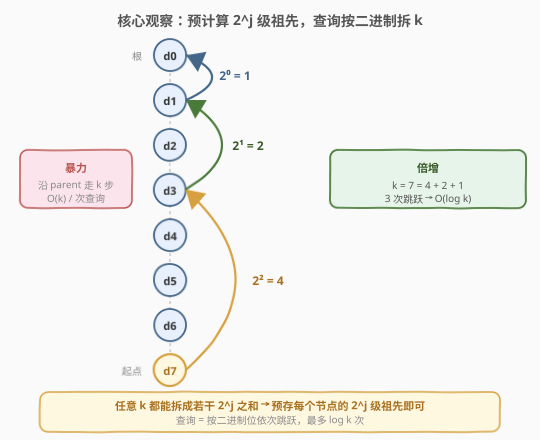
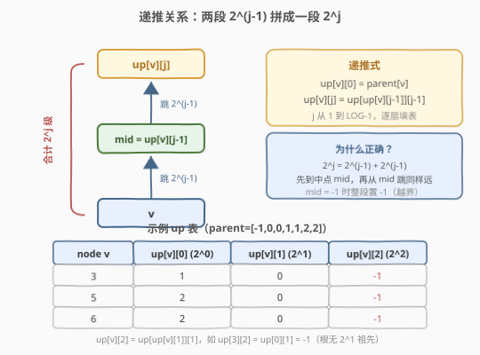
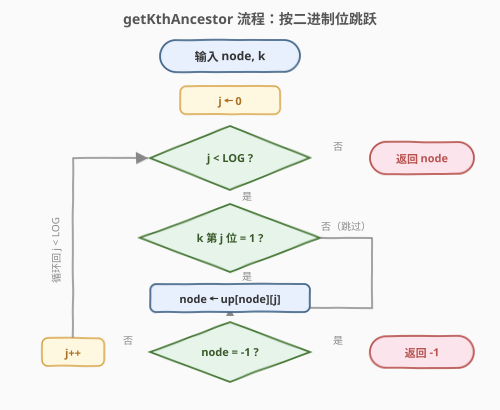

# LeetCode 树节点的第 K 个祖先 题解

## 1. 题目概述

- **标题 / 题号**：树节点的第 K 个祖先（#1483，hard）
- **链接**：https://leetcode.cn/problems/kth-ancestor-of-a-tree-node/
- **难度**：困难
- **标签**：树、倍增、动态规划、二进制

**题意**：给定一棵有 `n` 个节点的树，节点编号 `0` 到 `n-1`，以**父节点数组** `parent` 给出：`parent[i]` 是节点 `i` 的父节点，`parent[0] = -1` 表示 `0` 是根。节点 `node` 的**第 `k` 个祖先**是从 `node` 到根路径上的第 `k` 个节点。

要求实现 `TreeAncestor` 类：

- `TreeAncestor(int n, int[] parent)`：初始化对象。
- `getKthAncestor(int node, int k)`：返回 `node` 的第 `k` 个祖先；若不存在返回 `-1`。

**示例 1**：

```text
输入：
["TreeAncestor","getKthAncestor","getKthAncestor","getKthAncestor"]
[[7,[-1,0,0,1,1,2,2]],[3,1],[5,2],[6,3]]
输出：[null,1,0,-1]

解释：树形如
        0
       / \
      1   2
     / \ / \
    3  4 5  6
getKthAncestor(3,1) → 1   (3 的父节点)
getKthAncestor(5,2) → 0   (5 的祖父节点)
getKthAncestor(6,3) → -1  (6 只有 2 个祖先)
```

**约束**：

- $1 \le k \le n \le 5 \times 10^4$
- `parent[0] == -1`，且对 $0 < i < n$ 有 $0 \le \text{parent}[i] < n$
- $0 \le \text{node} < n$
- 最多查询 $5 \times 10^4$ 次

> 💡 **关键点**：这是一道「**多次查询、静态树**」的题目——树结构初始化后不变，但要回答大量 `getKthAncestor` 查询。这类问题天然适合**预处理**，用空间换时间。核心套路是**倍增（binary lifting）**。

## 2. 解题思路

### 2.1 暴力思路

最直观的做法：查询时从 `node` 出发，沿 `parent` 指针一步步向上走 `k` 次。

```text
def getKthAncestor(node, k):
    while k > 0 and node != -1:
        node = parent[node]
        k -= 1
    return node
```

单次查询 $O(k)$，而 $k$ 可达 $n = 5 \times 10^4$，查询次数也达 $5 \times 10^4$，最坏 $O(n \cdot q) \approx 2.5 \times 10^9$，必然超时。问题在于**每次查询都从零开始走，没有复用任何信息**。

> ⚠️ 树可能退化为一条链（`parent = [-1,0,1,2,...,n-2]`），此时第 $n-1$ 号节点的第 $k$ 个祖先要爬 $k$ 步，暴力必超时。

### 2.2 核心观察：倍增（Binary Lifting）



关键直觉：**任意整数 $k$ 都能拆成若干 $2^j$ 之和**（二进制表示）。如果我们预先存下每个节点的 $2^j$ 级祖先，查询时就不必一步步走，而是按 $k$ 的二进制位「大步跳跃」。

例如 $k = 7 = 4 + 2 + 1$，只需跳 $2^2 \to 2^1 \to 2^0$ 三次，而非走 7 步。

定义倍增表：

> $\text{up}[v][j]$ = 节点 $v$ 的第 $2^j$ 个祖先（即向上跳 $2^j$ 步到达的节点）；不存在则记 $-1$。

**递推关系**（核心）：



- **基础**：$\text{up}[v][0] = \text{parent}[v]$（向上跳 $2^0 = 1$ 步就是父节点）。
- **递推**：$\text{up}[v][j] = \text{up}\big[\,\text{up}[v][j-1]\,\big][j-1]$。

> 💡 **为什么？** $2^j = 2^{j-1} + 2^{j-1}$。先从 $v$ 跳 $2^{j-1}$ 步到中点 $\text{mid} = \text{up}[v][j-1]$，再从 $\text{mid}$ 跳 $2^{j-1}$ 步，两段拼起来恰好 $2^j$ 步。这就是「倍增」之名——每一层的信息由上一层倍乘而来。

> ⚠️ **越界处理**：当 $\text{mid} = \text{up}[v][j-1] = -1$ 时，说明 $v$ 的 $2^{j-1}$ 祖先已不存在，更谈不上 $2^j$ 祖先，此时 $\text{up}[v][j]$ 直接置 $-1$，避免访问 `up[-1]` 越界。

**层数确定**：$k \le n \le 5 \times 10^4$，而 $2^{16} = 65536 > 5 \times 10^4$，故 $j$ 取 $0 \sim 15$ 即可（`LOG = 16`），覆盖所有可能的 $k$。

### 2.3 算法流程图



**预处理**（构造函数）：

1. 令 `LOG = 16`，开 `up[n][LOG]`，初值 $-1$。
2. 填基础层：`up[v][0] = parent[v]`。
3. 按 $j = 1, 2, \dots, \text{LOG}-1$ 的顺序，对每个 $v$ 执行递推 $\text{up}[v][j] = \text{up}[\text{up}[v][j-1]][j-1]$（中点为 $-1$ 时保持 $-1$）。

> 💡 **循环顺序**：外层枚举 $j$（层数），内层枚举 $v$。因为 $\text{up}[v][j]$ 依赖 $\text{up}[v][j-1]$ 和 $\text{up}[\text{mid}][j-1]$，两者都属于**上一层 $j-1$**，而上一整层在第 $j$ 轮开始前已全部算完，所以 $v$ 的枚举顺序无关紧要。

**查询** `getKthAncestor(node, k)`：

从 $j = 0$ 起逐位检查 $k$ 的二进制：

- 若 $k$ 的第 $j$ 位为 $1$：`node = up[node][j]`（跳 $2^j$ 步）。
- 若中途 `node` 变成 $-1$：说明越界，提前返回 $-1$。
- 遍历完所有位后，`node` 即为答案。

### 2.4 示例演算

![示例演算：parent = [-1,0,0,1,1,2,2]](../images/1483_example_walkthrough.svg)

以示例树 `parent = [-1,0,0,1,1,2,2]` 为例，预处理后关键节点的 `up` 表：

| $v$ | $\text{up}[v][0]$（$2^0$） | $\text{up}[v][1]$（$2^1$） | $\text{up}[v][2]$（$2^2$） |
|-----|----------------------------|----------------------------|----------------------------|
| 3   | 1                          | 0                          | $-1$                       |
| 5   | 2                          | 0                          | $-1$                       |
| 6   | 2                          | 0                          | $-1$                       |

**查询 A** `getKthAncestor(6, 3)`：$k = 3 = 2^0 + 2^1$（二进制 `11`）

- $j=0$，位 $=1$：`node = up[6][0] = 2`
- $j=1$，位 $=1$：`node = up[2][1] = -1`（根 `0` 的 $2^1$ 祖先不存在）
- 返回 $-1$ ✗

**查询 B** `getKthAncestor(5, 2)`：$k = 2 = 2^1$（二进制 `10`）

- $j=0$，位 $=0$：跳过
- $j=1$，位 $=1$：`node = up[5][1] = 0`
- 返回 $0$ ✓（根节点）

## 3. 参考代码

### C++

```cpp
class TreeAncestor {
    static constexpr int LOG = 16;
    vector<vector<int>> up; // up[v][j] = 2^j 级祖先
public:
    TreeAncestor(int n, vector<int>& parent) {
        up.assign(n, vector<int>(LOG, -1));
        for (int v = 0; v < n; ++v) up[v][0] = parent[v];        // 基础层
        for (int j = 1; j < LOG; ++j)
            for (int v = 0; v < n; ++v) {
                int mid = up[v][j - 1];
                up[v][j] = (mid == -1) ? -1 : up[mid][j - 1];    // 倍增递推
            }
    }

    int getKthAncestor(int node, int k) {
        for (int j = 0; j < LOG && node != -1; ++j)
            if (k >> j & 1) node = up[node][j];                  // 该位为 1 则跳 2^j
        return node;
    }
};
```

### Python

```python
class TreeAncestor:
    def __init__(self, n: int, parent: List[int]):
        self.LOG = 16
        self.up = [[-1] * self.LOG for _ in range(n)]
        for v in range(n):
            self.up[v][0] = parent[v]                  # 基础层
        for j in range(1, self.LOG):
            for v in range(n):
                mid = self.up[v][j - 1]
                if mid != -1:
                    self.up[v][j] = self.up[mid][j - 1]   # 倍增递推

    def getKthAncestor(self, node: int, k: int) -> int:
        for j in range(self.LOG):
            if node == -1:
                break
            if k >> j & 1:
                node = self.up[node][j]                # 该位为 1 则跳 2^j
        return node
```

> ⚠️ **两个易错点**：
> 1. **越界保护**：递推时若 `up[v][j-1] == -1`，必须保持 `up[v][j] = -1`，绝不能访问 `up[-1]`（C++ 中是未定义行为，Python 中会 `IndexError`）。查询时同理，`node == -1` 要提前终止。
> 2. **层数取够**：`LOG` 要保证 $2^{\text{LOG}-1} \ge n$。本题 $n \le 5\times10^4$，`LOG = 16`（$2^{15}=32768 \le 5\times10^4 < 65536=2^{16}$）刚好覆盖。若不确定可取 `LOG = 17` 更保险，多一层只多 $O(n)$ 预处理。

> 💡 **位运算小技巧**：`k >> j & 1` 取 $k$ 的第 $j$ 位；也可以用 `while k:` 取最低位 `k & -k` 再清除，但逐位遍历 `LOG` 次更简洁，且 `LOG` 很小（$\le 17$），常数可忽略。

## 4. 复杂度分析

| 维度 | 复杂度 | 说明 |
|------|--------|------|
| 预处理时间 | $O(n \log n)$ | 双重循环：$n$ 个节点 $\times$ $\log n$ 层 |
| 预处理空间 | $O(n \log n)$ | `up` 表大小 $n \times \text{LOG}$，$\text{LOG} \approx \log n$ |
| 单次查询 | $O(\log n)$ | 最多遍历 $\text{LOG}$ 个二进制位 |

> 💡 本题 $n, q \le 5\times10^4$，$\log n \approx 16$，预处理约 $8\times10^5$ 次操作，查询总计约 $8\times10^5$ 次，远低于时限。

## 5. 扩展：倍增求 LCA

倍增表的威力不止于求第 $k$ 个祖先——它是**树上 LCA（最近公共祖先）**的经典解法之一，与 [236. 二叉树的最近公共祖先](../0201-0300/236_二叉树的最近公共祖先.md) 的后序 DFS 思路互补。

**思路**：在 `up[v][j]` 表之外，再预处理每个节点的**深度** `dep[v]`（根深度为 0）。求 `u`、`v` 的 LCA：

1. **拉到同深**：先把较深的节点用倍增向上跳 `dep 差` 步，使两者同深。
2. **同幅上跳**：若此时 `u == v`，它就是 LCA；否则从大到小枚举 $j$，若 `up[u][j] != up[v][j]`，则两者同时上跳 $2^j$。
3. 跳完后 `u`、`v` 会停在 LCA 的直接子节点处，`up[u][0]` 即为 LCA。

```cpp
int getLCA(int u, int v) {
    if (dep[u] < dep[v]) swap(u, v);
    int diff = dep[u] - dep[v];
    for (int j = 0; j < LOG; ++j)          // 拉到同深
        if (diff >> j & 1) u = up[u][j];
    if (u == v) return u;
    for (int j = LOG - 1; j >= 0; --j)     // 同幅上跳
        if (up[u][j] != up[v][j]) {
            u = up[u][j];
            v = up[v][j];
        }
    return up[u][0];
}
```

> 💡 **为什么从大到小枚举 $j$？** 目标是「尽量跳、但不跳过头」。大步优先能快速逼近 LCA，而 `up[u][j] != up[v][j]` 保证跳完后两者仍在 LCA 之下；若从小到大则会过早相等、无法逼近。这与 `getKthAncestor` 从小到大取位不同——前者是「凑定值 $k$」，后者是「逼近临界点」。

可见，**1483 的 `up` 表就是 LCA 倍增解法的预处理部分**。掌握倍增，等于一并拿下了「第 $k$ 祖先」和「LCA」两棵树。

## 6. 面试要点

1. **为什么想到倍增？暴力差在哪？**

   - 暴力每次查询 $O(k)$，链状树下 $k$ 可达 $n$，$q$ 次查询总 $O(nq)$ 超时。观察到「树静态不变 + 大量查询」适合预处理，而任意 $k$ 可拆成 $2$ 的幂之和，于是预存 $2^j$ 级祖先，查询按二进制位跳跃，单次降到 $O(\log n)$。

2. **递推式 `up[v][j] = up[up[v][j-1]][j-1]` 的含义和正确性？**

   - 含义：先跳 $2^{j-1}$ 到中点 `mid`，再从 `mid` 跳 $2^{j-1}$，合计 $2^j$。正确性来自 $2^j = 2^{j-1} + 2^{j-1}$，且 `up[mid][j-1]` 已在上一层算完，可直接复用。

3. **`LOG` 取多少？怎么定？**

   - 需保证 $2^{\text{LOG}-1} \ge n$（最大可能的 $k$）。本题 $n \le 5\times10^4$，$2^{15}=32768$、$2^{16}=65536$，故 `LOG = 16`（$j=0\dots15$）。通用写法：`LOG = floor(log2(n)) + 1`，或直接取 17 留余量。

4. **`mid = -1` 时为什么要特殊处理？**

   - `up[v][j-1] = -1` 表示 $v$ 的 $2^{j-1}$ 祖先已越界（不存在），那 $2^j$ 祖先更不存在，应保持 $-1$。若不加判断去访问 `up[-1][j-1]`，C++ 是越界未定义行为，Python 直接抛 `IndexError`。查询中 `node == -1` 同理需提前终止。

5. **倍增和 LCA 的关系？能不能用倍增求 LCA？**

   - 能。`up` 表再加一个深度数组 `dep` 即可：先把两节点拉到同深，再从大到小同幅上跳直到 `up[u][0]` 为 LCA。1483 的预处理正是 LCA 倍增法的第一步。详见第 5 节扩展。

## 同类练习题

| # | 题目 | 与本题的关联 |
|---|------|-------------|
| 236 | [二叉树的最近公共祖先](https://leetcode.cn/problems/lowest-common-ancestor-of-a-binary-tree/)（[题解](../0201-0300/236_二叉树的最近公共祖先.md)） | 倍增是求 LCA 的经典做法之一，把本题 `up` 表再加深度数组即可 $O(\log n)$ 求 LCA |
| 235 | [二叉搜索树的最近公共祖先](https://leetcode.cn/problems/lowest-common-ancestor-of-a-binary-search-tree/)（[题解](../0201-0300/235_二叉搜索树的最近公共祖先.md)） | BST 版 LCA，利用有序性 $O(h)$ 迭代，对照通用倍增做法 |
| 1644 | [二叉树的最近公共祖先 II](https://leetcode.cn/problems/lowest-common-ancestor-of-a-binary-tree-ii/) | 节点可能不存在，LCA 的边界处理变体 |
| 1650 | [二叉树的最近公共祖先 III](https://leetcode.cn/problems/lowest-common-ancestor-of-a-binary-tree-iii/) | 节点带 `parent` 指针，「向上走祖先」的链表交汇变体，与本题同源 |
