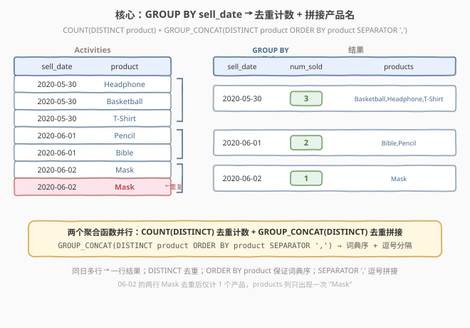
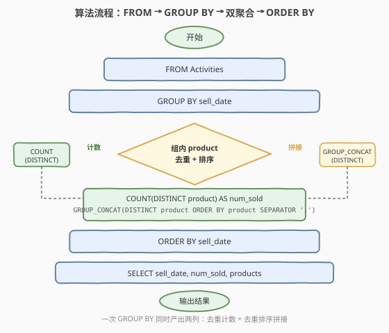
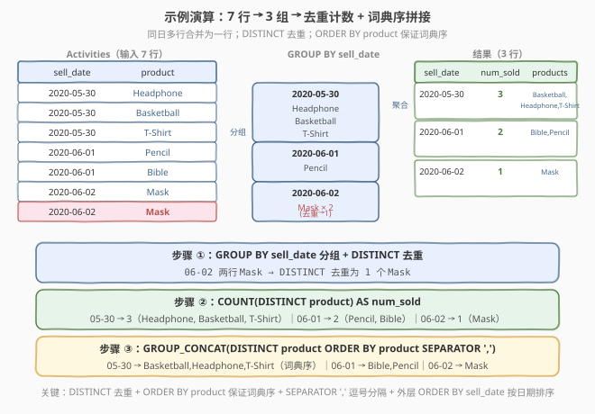

# LeetCode 按日期分组销售产品 题解

## 1. 题目概述

- **标题 / 题号**：按日期分组销售产品（#1484，easy）
- **链接**：https://leetcode.cn/problems/group-sold-products-by-the-date/
- **难度**：简单
- **标签**：SQL、GROUP BY、GROUP_CONCAT、COUNT(DISTINCT)、DISTINCT、ORDER BY、聚合函数

**题意**：给定 `Activities` 表，每行记录某个日期售出的某种产品。表无主键，可能包含重复行（同一天售出多个相同产品）。编写 SQL 查询，找出**每个日期**售出的**不同产品的数量**及其**名称**，产品名称按词典序排列、用逗号分隔，结果按 `sell_date` 排序。

**表结构**：

```text
Table: Activities
+-------------+---------+
| Column Name | Type    |
+-------------+---------+
| sell_date   | date    |
| product     | varchar |
+-------------+---------+
该表没有主键（具有唯一值的列），可能包含重复项。
每一行包含产品名称和在市场上销售的日期。
```

> 💡 **关键点**：表无主键且可能重复——同一天可能有多行相同产品。题目要求统计的是**不同产品**（去重后的数量），产品名称也要去重后按词典序拼接。

**示例 1**：

```text
输入：
Activities 表：
+------------+-------------+
| sell_date  | product     |
+------------+-------------+
| 2020-05-30 | Headphone   |
| 2020-06-01 | Pencil      |
| 2020-06-02 | Mask        |
| 2020-05-30 | Basketball  |
| 2020-06-01 | Bible       |
| 2020-06-02 | Mask        |   ← 与第三行重复
| 2020-05-30 | T-Shirt     |
+------------+-------------+

输出：
+------------+----------+------------------------------+
| sell_date  | num_sold | products                     |
+------------+----------+------------------------------+
| 2020-05-30 | 3        | Basketball,Headphone,T-Shirt |
| 2020-06-01 | 2        | Bible,Pencil                 |
| 2020-06-02 | 1        | Mask                         |
+------------+----------+------------------------------+
```

**解释**：

- `2020-05-30`：售出 Headphone、Basketball、T-Shirt，共 **3** 种不同产品，词典序拼接为 `Basketball,Headphone,T-Shirt`
- `2020-06-01`：售出 Pencil、Bible，共 **2** 种不同产品，词典序拼接为 `Bible,Pencil`
- `2020-06-02`：售出 Mask、Mask（重复），去重后仅 **1** 种产品，拼接为 `Mask`

**约束**：

- `sell_date` 为合法日期
- `product` 为产品名称字符串
- 表无主键，允许重复行
- 产品名称按**词典序**排列，用逗号 `','` 分隔
- 结果按 `sell_date` 升序排列

> 💡 **核心考点**：在同一 `GROUP BY` 分组内同时完成**去重计数**与**去重排序拼接**——这是 MySQL `GROUP_CONCAT` 聚合函数的经典应用场景。

## 2. 解题思路

### 2.1 暴力思路：子查询逐日处理

最直觉的做法：先 `SELECT DISTINCT sell_date` 取所有日期，再对每个日期写一段子查询分别统计 `COUNT(DISTINCT product)` 和拼接产品名——但 SQL 无法在单条查询中循环遍历日期，必须用 JOIN 或 UNION ALL 拼接多个子查询结果。

```sql
-- ❌ 冗长方向：为每个日期写单独的子查询
SELECT d.sell_date,
       (SELECT COUNT(DISTINCT product) FROM Activities a WHERE a.sell_date = d.sell_date) AS num_sold,
       (SELECT GROUP_CONCAT(DISTINCT product ORDER BY product SEPARATOR ',')
        FROM Activities a WHERE a.sell_date = d.sell_date) AS products
FROM (SELECT DISTINCT sell_date FROM Activities) d
ORDER BY d.sell_date;
```

- **正确但冗长**：每个子查询都需独立扫描过滤，且相关子查询按外层每一行执行一次。
- **重复扫描**：`COUNT` 子查询和 `GROUP_CONCAT` 子查询各扫一次同日数据，对同一分组做了两次工作。

> ⚠️ 暴力的浪费在于「把同组内的两个聚合拆成了两个独立子查询」。其实 `COUNT(DISTINCT)` 和 `GROUP_CONCAT(DISTINCT)` 都是聚合函数，可以在**同一个 `GROUP BY`** 中并行计算，一次扫描即可。

### 2.2 核心观察：GROUP BY + 双聚合并行



三个关键观察把问题从「多段子查询」简化为「一条查询」：

**观察一（GROUP BY 分组）**：按 `sell_date` 分组后，同一日期的所有行归入一组。每个分组对应结果表中的一行，无需 JOIN 或子查询。

**观察二（COUNT(DISTINCT) 去重计数）**：表无主键可能重复，直接 `COUNT(product)` 会把重复行也计入。用 `COUNT(DISTINCT product)` 在组内去重后再计数，得到不同产品的数量 `num_sold`：

$$\text{num\_sold}(\text{day}) = \left| \{ \text{product} \mid \text{row} \in \text{day} \} \right|$$

**观察三（GROUP_CONCAT 去重排序拼接）**：MySQL 的 `GROUP_CONCAT` 函数在组内将多个值拼接成一个字符串。三个关键参数组合解决全部需求：

- `DISTINCT`：去重，同日重复产品只拼一次（如 `06-02` 的两行 `Mask` 只输出一次）
- `ORDER BY product`：拼接前按产品名词典序排序（如 `Basketball` < `Headphone` < `T-Shirt`）
- `SEPARATOR ','`：用逗号分隔各产品名

$$\text{products}(\text{day}) = \texttt{GROUP\_CONCAT}(\texttt{DISTINCT product ORDER BY product SEPARATOR ','})$$

> 💡 **一句话**：`GROUP BY sell_date` 分组 → `COUNT(DISTINCT product)` 去重计数 → `GROUP_CONCAT(DISTINCT product ORDER BY product SEPARATOR ',')` 去重排序拼接 → `ORDER BY sell_date` 按日期排序输出。这是 MySQL 「**分组 + 字符串聚合**」的经典范式。

> ⚠️ **GROUP_CONCAT 是 MySQL 专有函数**：PostgreSQL 用 `STRING_AGG`、Oracle 用 `LISTAGG`、SQL Server 用 `STRING_AGG`（2017+）。LeetCode 默认 MySQL 环境，可直接使用。跨数据库时需替换为对应函数。

### 2.3 算法流程图



| 步骤 | SQL 子句 | 作用 |
|------|----------|------|
| ① | `FROM Activities` | 逐行读取 `(sell_date, product)` |
| ② | `GROUP BY sell_date` | 按日期分组，同日所有行归入一组 |
| ③ | `COUNT(DISTINCT product)` | 组内去重计数 → `num_sold` |
| ④ | `GROUP_CONCAT(DISTINCT product ORDER BY product SEPARATOR ',')` | 组内去重 + 词典序排序 + 逗号拼接 → `products` |
| ⑤ | `ORDER BY sell_date` | 结果按日期升序输出 |

> 💡 **执行顺序**：`FROM` 取全表 → `GROUP BY` 按 `sell_date` 切分到各组 → 每组内 `COUNT(DISTINCT)` 和 `GROUP_CONCAT(DISTINCT)` **并行**计算（同一趟聚合，不额外扫描）→ `SELECT` 输出三列 → `ORDER BY sell_date` 排序。两个聚合函数共享同一分组结果，互不干扰。

### 2.4 示例演算

以示例 1 的 7 行数据为例，逐日展开「分组 → 去重 → 计数 + 拼接」的过程：



| sell_date | 组内 product（原始） | 去重后 | num_sold | products（词典序拼接） |
|-----------|----------------------|--------|----------|----------------------|
| 2020-05-30 | Headphone, Basketball, T-Shirt | Headphone, Basketball, T-Shirt | **3** | Basketball,Headphone,T-Shirt |
| 2020-06-01 | Pencil, Bible | Pencil, Bible | **2** | Bible,Pencil |
| 2020-06-02 | Mask, Mask | Mask（去重） | **1** | Mask |

- **第 ① 步**：`GROUP BY sell_date` 把 7 行归为 3 组（按日期）。`06-02` 组有 2 行，都是 `Mask`。
- **第 ② 步**：每组内 `DISTINCT` 去重——`06-02` 的两个 `Mask` 去重后只剩 1 个。其余两组无重复。
- **第 ③ 步**：`COUNT(DISTINCT product)` 得 `num_sold`（3, 2, 1）；`GROUP_CONCAT(DISTINCT product ORDER BY product SEPARATOR ',')` 按词典序拼接得 `products`。
- **第 ④ 步**：`ORDER BY sell_date` 输出 3 行结果（日期升序：05-30, 06-01, 06-02）。

> 💡 **词典序细节**：`05-30` 组的产品 `Basketball` < `Headphone` < `T-Shirt`（按字母 B < H < T）。注意大小写——MySQL 默认排序中 `T-Shirt` 的 `T` 大写，但词典序仍排在 `Headphone` 之后（`H` < `T`）。`ORDER BY product` 使用数据库默认排序规则（通常大小写不敏感），LeetCode 测试用例中产品名首字母大写，排序结果一致。

## 3. 参考代码

### SQL（解法 A：GROUP BY + GROUP_CONCAT，推荐）

```sql
SELECT sell_date,
       COUNT(DISTINCT product) AS num_sold,
       GROUP_CONCAT(DISTINCT product ORDER BY product SEPARATOR ',') AS products
FROM Activities
GROUP BY sell_date
ORDER BY sell_date;
```

> 💡 **写法要点**：
> - `GROUP BY sell_date` 按日期分组——同日所有行归入一组，每组输出一行。
> - `COUNT(DISTINCT product)` 在组内去重后计数——忽略重复行，统计不同产品数。
> - `GROUP_CONCAT(DISTINCT product ORDER BY product SEPARATOR ',')`：`DISTINCT` 去重（重复产品只拼一次），`ORDER BY product` 拼接前按词典序排序，`SEPARATOR ','` 用逗号分隔。
> - 两个聚合函数在**同一 `GROUP BY`** 中并行计算，只需一次全表扫描。
> - `ORDER BY sell_date` 保证结果按日期升序输出。

### SQL（解法 B：子查询，暴力）

```sql
SELECT d.sell_date,
       (SELECT COUNT(DISTINCT product) FROM Activities a WHERE a.sell_date = d.sell_date) AS num_sold,
       (SELECT GROUP_CONCAT(DISTINCT product ORDER BY product SEPARATOR ',')
        FROM Activities a WHERE a.sell_date = d.sell_date) AS products
FROM (SELECT DISTINCT sell_date FROM Activities) d
ORDER BY d.sell_date;
```

> ⚠️ **暴力的问题**：外层先取 `DISTINCT sell_date` 得到所有日期，再用两个**相关子查询**分别对每个日期做 `COUNT` 和 `GROUP_CONCAT`。每个子查询独立扫描过滤，对同一分组做了两次工作。若 $d$ 为不同日期数，总扫描次数为 $O(d)$ 次子查询 × 每次扫描 $O(n/d)$ 行 = $O(n)$ × 2（两个子查询），渐近同 $O(n)$ 但常数因子更大。解法 A 一次 `GROUP BY` 同时产出两列，更简洁高效。

### Python（pandas）

```python
import pandas as pd

def group_sold_products(activities: pd.DataFrame) -> pd.DataFrame:
    result = (
        activities
        .groupby('sell_date')['product']
        .agg(
            num_sold='nunique',
            products=lambda x: ','.join(sorted(x.unique()))
        )
        .reset_index()
    )
    return result.sort_values('sell_date').reset_index(drop=True)
```

> 💡 **pandas 对照**：`groupby('sell_date')` 对应 `GROUP BY sell_date`；`nunique` 对应 `COUNT(DISTINCT product)`（去重计数）；`sorted(x.unique())` 对应 `DISTINCT product ORDER BY product`（去重 + 词典序排序）；`','.join(...)` 对应 `SEPARATOR ','`（逗号拼接）；`sort_values('sell_date')` 对应 `ORDER BY sell_date`。

## 4. 复杂度分析

| 维度 | GROUP BY + 双聚合（推荐） | 子查询（暴力） |
|------|--------------------------|----------------|
| **时间复杂度** | $O(n \log n)$ | $O(n \log n)$ |
| **空间复杂度** | $O(d \times p)$ | $O(d \times p)$ |
| **扫描次数** | 1 次（单次全表 + 分组） | $2d + 1$ 次（取日期 + 每日两个子查询） |
| **聚合并行** | ✓ COUNT + GROUP_CONCAT 同一趟 | ✗ 两个子查询各自独立 |
| **代码行数** | 5 行 | 7 行 |

- $n$ = `Activities` 行数，$d$ = 不同日期数，$p$ = 每组平均不同产品数
- **时间复杂度 $O(n \log n)$**：`GROUP BY` 哈希分组 $O(n)$，组内 `DISTINCT` 去重 + `ORDER BY product` 排序 $O(p \log p)$，总计 $O(n) + d \times O(p \log p) = O(n \log n)$（最坏情况所有产品在同一组）。
- **推荐解法**：一次扫描 + 一次分组，两个聚合函数并行，常数因子小。
- **子查询解法**：每个日期两个相关子查询各扫一次，总扫描 $2d + 1$ 次，但 LeetCode 数据量小无显著差异。

> ⚠️ 本题数据量小，两种写法都能秒过。面试中写解法 A 体现对「**聚合函数并行**」与「**GROUP_CONCAT 三参数**」的把握——这是 SQL 报表查询中字符串聚合的核心技能。

## 5. 扩展：GROUP_CONCAT 深入与跨数据库方案

### 5.1 GROUP_CONCAT 参数详解

`GROUP_CONCAT` 是 MySQL 专有的字符串聚合函数，语法为：

```sql
GROUP_CONCAT(
    [DISTINCT] expr [, expr ...]
    [ORDER BY col [ASC|DESC] ...]
    [SEPARATOR str]
)
```

| 参数 | 作用 | 本题用法 |
|------|------|----------|
| `DISTINCT` | 去除重复值 | `DISTINCT product` — 同日重复产品只拼一次 |
| `ORDER BY` | 拼接前排序 | `ORDER BY product` — 按产品名词典序 |
| `SEPARATOR` | 分隔符（默认逗号） | `SEPARATOR ','` — 显式指定逗号 |
| `expr` | 被拼接的表达式 | `product` — 产品名列 |

> ⚠️ **默认 SEPARATOR 就是逗号**：`GROUP_CONCAT(DISTINCT product ORDER BY product)` 不写 `SEPARATOR` 也会用逗号分隔。但题目要求明确，显式写出 `SEPARATOR ','` 更清晰。若题目要求用其他分隔符（如 `';'`），只需改 `SEPARATOR` 参数。

> ⚠️ **group_concat_max_len 限制**：MySQL 默认 `GROUP_CONCAT` 结果最大长度为 1024 字节（`group_concat_max_len` 系统变量）。若拼接结果超长会被截断。生产环境中大数据量拼接前应执行 `SET SESSION group_concat_max_len = 1000000;`。LeetCode 测试数据量小，不会触发此限制。

### 5.2 跨数据库等价写法

不同数据库的字符串聚合函数：

| 数据库 | 函数 | 语法 |
|--------|------|------|
| MySQL | `GROUP_CONCAT` | `GROUP_CONCAT(DISTINCT product ORDER BY product SEPARATOR ',')` |
| PostgreSQL | `STRING_AGG` | `STRING_AGG(DISTINCT product, ',' ORDER BY product)` |
| SQL Server | `STRING_AGG`（2017+） | `STRING_AGG(product, ',') WITHIN GROUP (ORDER BY product)` |
| Oracle | `LISTAGG` | `LISTAGG(product, ',') WITHIN GROUP (ORDER BY product)` |

```sql
-- PostgreSQL 写法（注意 DISTINCT 在 STRING_AGG 中的位置）
SELECT sell_date,
       COUNT(DISTINCT product) AS num_sold,
       STRING_AGG(DISTINCT product, ',' ORDER BY product) AS products
FROM Activities
GROUP BY sell_date
ORDER BY sell_date;
```

> 💡 PostgreSQL 的 `STRING_AGG(DISTINCT expr, sep ORDER BY ...)` 与 MySQL 的 `GROUP_CONCAT` 参数顺序不同：分隔符在第二参数，`ORDER BY` 在最后。且 PostgreSQL 的 `DISTINCT` 与 `ORDER BY` 一起使用时，`ORDER BY` 表达式必须出现在 `DISTINCT` 列表中。

### 5.3 不使用 GROUP_CONCAT 的替代方案

若面试官要求不使用 `GROUP_CONCAT`（考察底层思维），可用**相关子查询 + 字符串拼接**模拟：

```sql
SELECT sell_date,
       COUNT(DISTINCT product) AS num_sold,
       (SELECT GROUP_CONCAT(product ORDER BY product SEPARATOR ',')
        FROM (SELECT DISTINCT product FROM Activities a2
              WHERE a2.sell_date = Activities.sell_date) t) AS products
FROM Activities
GROUP BY sell_date
ORDER BY sell_date;
```

> ⚠️ 此写法用子查询先 `DISTINCT` 去重再 `GROUP_CONCAT` 拼接（省略外层 `DISTINCT`），逻辑等价但更冗长。仅作为面试中「不依赖 GROUP_CONCAT 的 DISTINCT 参数」的备选思路。实际中直接用 `GROUP_CONCAT(DISTINCT ...)` 即可。

## 6. 面试要点

1. **为什么用 COUNT(DISTINCT) 而非 COUNT？**

   > 表无主键且允许重复行——同一天可能有多行相同产品（如 `06-02` 有两行 `Mask`）。`COUNT(product)` 会把重复行也计入（`06-02` 得 2），而 `COUNT(DISTINCT product)` 先去重再计数（`06-02` 得 1），符合题目「不同产品的数量」要求。涉及「去重计数」时，`COUNT(DISTINCT)` 是标准做法。

2. **GROUP_CONCAT 的 DISTINCT、ORDER BY、SEPARATOR 分别解决什么问题？**

   > 三个参数各司其职：`DISTINCT` 解决**去重**——同日重复产品只拼一次；`ORDER BY product` 解决**词典序**——拼接前按产品名排序，保证 `Basketball,Headphone,T-Shirt` 而非原始行序；`SEPARATOR ','` 解决**分隔符**——用逗号分隔各产品名（虽然默认就是逗号，但显式写出更清晰）。三个参数组合在一个函数调用中完成全部格式化需求。

3. **为什么两个聚合函数可以在同一个 GROUP BY 中并行？**

   > `COUNT(DISTINCT product)` 和 `GROUP_CONCAT(DISTINCT product ORDER BY product SEPARATOR ',')` 都是**聚合函数**，作用于 `GROUP BY` 产生的每个分组。SQL 引擎在一次分组扫描中，对每个分组同时计算所有 SELECT 中的聚合函数——它们共享同一分组结果，互不干扰，无需额外扫描。这与「为每个聚合写一个子查询」的暴力做法形成对比：后者对同一分组重复扫描多次。

4. **GROUP_CONCAT 是 SQL 标准吗？其他数据库怎么写？**

   > `GROUP_CONCAT` 是 MySQL 专有函数，不属于 SQL 标准。PostgreSQL/SQL Server 2017+ 用 `STRING_AGG`，Oracle 用 `LISTAGG`。跨数据库迁移时需替换函数名和参数顺序。面试中若用 MySQL 环境可直接用 `GROUP_CONCAT`，若被问跨数据库方案则提及 `STRING_AGG`/`LISTAGG`。

5. **如果要求产品名按出现顺序拼接（而非词典序）怎么办？**

   > 去掉 `GROUP_CONCAT` 的 `ORDER BY product` 参数即可：`GROUP_CONCAT(DISTINCT product SEPARATOR ',')` 会按分组内行的扫描顺序拼接（取决于存储引擎的扫描顺序，通常不保证）。若需保证特定顺序，必须显式写 `ORDER BY`。本题要求词典序，故 `ORDER BY product` 不可省略。

> 💡 **一句话总结**：1484 的灵魂是「**分组 + 字符串聚合**」——`GROUP BY sell_date` 按日分组，`COUNT(DISTINCT product)` 去重计数，`GROUP_CONCAT(DISTINCT product ORDER BY product SEPARATOR ',')` 去重排序拼接。核心是 MySQL `GROUP_CONCAT` 三参数（DISTINCT + ORDER BY + SEPARATOR）的精准使用。

## 同类练习题

| # | 题目 | 与本题的关联 |
|---|------|-------------|
| 1179 | [重新格式化部门表](https://leetcode.cn/problems/reformat-department-table/) | SQL 行转列 + 条件聚合——`SUM(IF(month=k, revenue, 0))` 把行级数据透视成列，对照 1484 的 `GROUP_CONCAT` 把行级数据压缩成字符串，体会「多行 → 一列」的两种形态（数值聚合 vs 字符串拼接） |
| 1517 | [查找拥有有效邮件的用户](https://leetcode.cn/problems/find-users-with-valid-e-mails/) | SQL 字符串处理 + 正则匹配——在 `WHERE` 中用 `REGEXP` 过滤邮箱格式，对照 1484 在 `GROUP_CONCAT` 中用 `ORDER BY` 排序字符串，理解字符串函数在过滤 vs 聚合中的不同角色 |
| 1527 | [患者确诊感染病毒](https://leetcode.cn/problems/patients-with-a-condition/) | SQL `LIKE` 模式匹配——`WHERE conditions LIKE '%DIAB1%'` 前缀匹配，对照 1484 的字符串拼接输出，体会字符串在输入过滤 vs 输出格式化中的用法 |
| 1581 | [顾客在店内访问次数](https://leetcode.cn/problems/customer-visiting-the-shop/) | SQL `COUNT` + `GROUP BY` + 多表 JOIN——`COUNT(IF(...))` 条件计数，对照 1484 的 `COUNT(DISTINCT)` 去重计数，理解 `COUNT` 家族在不同场景下的变体 |
| 1596 | [每位顾客最经常订购的商品](https://leetcode.cn/problems/the-most-frequently-ordered-products-for-each-customer/) | SQL `GROUP BY` 双层 + `GROUP_CONCAT`——先按 `(customer, product)` 分组计数，再取每组最大值，与 1484 的单层分组 + 字符串聚合形成对照，理解分层聚合的设计思路 |
