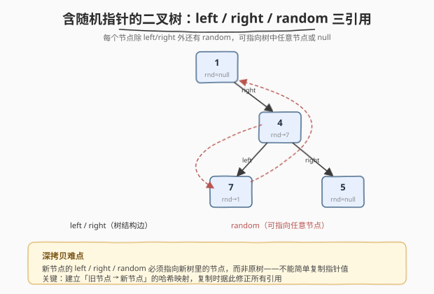
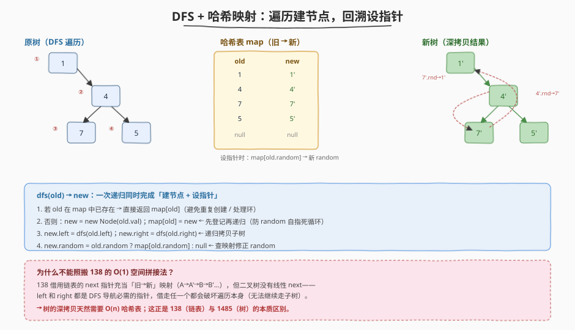
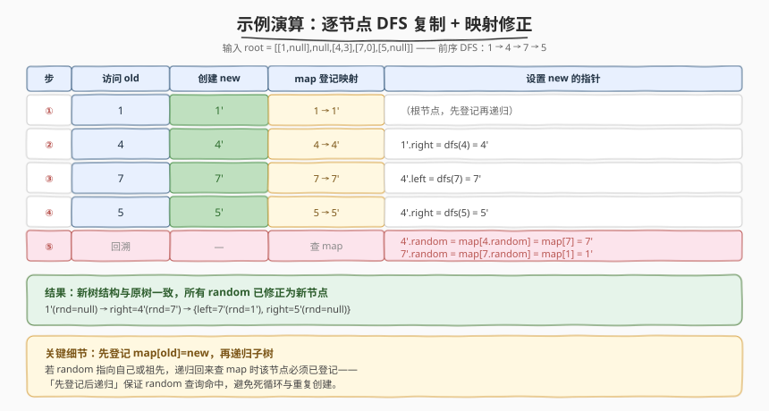

# 克隆含随机指针的二叉树

- **题目名称**：克隆含随机指针的二叉树
- **链接**：[1485. 克隆含随机指针的二叉树](https://leetcode.cn/problems/clone-binary-tree-with-random-pointer/)
- **难度**：中等
- **标签**：树、二叉树、深度优先搜索、哈希表

## 1. 题目概述

给定一棵二叉树，其中每个节点除了 `left`、`right` 两个子指针外，还有一个 `random` 指针，可指向树中**任意节点**或 `null`。请**深拷贝**整棵树——构造一棵全新树，节点值相同，且 `left`、`right`、`random` 的指向关系与原树完全一致（新节点的指针必须指向新树中的节点）。

节点定义：

```cpp
class Node {
public:
    int val;
    Node* left;
    Node* right;
    Node* random;   // 可指向树中任意节点或 null
    Node() {}
    Node(int val) : val(val), left(nullptr), right(nullptr), random(nullptr) {}
};
```

**序列化格式**：树按**层序**展开为列表，每个元素是 `[val, random_index]` 或 `null`。`random_index` 是 `random` 所指节点在层序数组中的下标（下标对应 `null` 槽位时，`random` 视为 `null`）。

**示例 1**：

```text
输入：root = [[1,null],null,[4,3],[7,0],[5,null]]
输出：[[1,null],null,[4,3],[7,0],[5,null]]

        1               random 指向：
         \              1  → null
          4             4  → 7
         / \            7  → 1
        7   5           5  → null
```

层序数组下标：`0→[1,null]`、`1→null`（1 无左子）、`2→[4,3]`（4 的 random 指向下标 3 即 7）、`3→[7,0]`（7 的 random 指向下标 0 即 1）、`4→[5,null]`。

**示例 2**：

```text
输入：root = [[1,4],null,[2,0],[3,1],[4,null]]
输出：[[1,4],null,[2,0],[3,1],[4,null]]

        1               random 指向：
         \              1  → 4
          2             2  → 1
         / \            3  → null（下标 1 是 null 槽位）
        3   4           4  → null
```

**示例 3**：

```text
输入：root = []
输出：[]
```

**约束条件**：

- 树中节点数目范围 `[0, 1000]`
- `1 <= Node.val <= 10^6`

> 💡 难点在 `random` 指针：新节点的 random 必须指向**新树**里的节点，而非原树。这与 [138. 复制带随机指针的链表](../0101-0200/138_复制带随机指针的链表.md) 是同一类问题——只是结构从链表升级为二叉树。

---

## 2. 解题思路

### 2.1 暴力思路

遍历原树，对每个节点创建新节点。但设置 `random` 时发现"新节点要指向的新 random 节点可能还没创建"——需要先建完所有新节点，再回头设 random。这就需要一个"旧节点 → 新节点"的映射来查找。



> ⚠️ 暴力的瓶颈：没有映射就无法在 $O(1)$ 找到"旧 random 对应的新节点"——要么 $O(n^2)$ 遍历查找，要么用哈希表存映射。与 138 完全同构。

### 2.2 核心观察：建立"旧→新"映射

关键洞察：**深拷贝带复杂引用的结构，核心是建立"旧节点 → 新节点"的映射**，复制时据此修正所有引用。



用一次 DFS 把"建节点"和"设指针"合并完成：

```
dfs(old) -> new:
  若 old == null：返回 null
  若 old 已在 map 中：返回 map[old]   ← 命中缓存（处理 random 回指/环）
  new = new Node(old.val)
  map[old] = new                        ← 先登记再递归（关键！）
  new.left  = dfs(old.left)             ← 递归拷贝左子树
  new.right = dfs(old.right)            ← 递归拷贝右子树
  new.random = old.random ? map[old.random] : null   ← 查映射修正
  return new
```

> 💡 **「先登记再递归」的原因**：`random` 可能指向祖先或自身。若先递归子树、递归回来后才登记，则当 random 回指祖先时 `map[old.random]` 尚不存在——会误判为"未创建"导致死循环或重复创建。**先把当前节点登记进 map，再递归**，保证后续任何 random 查询都能命中。

> ⚠️ **为什么不能照搬 138 的 $O(1)$ 空间拼接法？** 138 借用链表的 `next` 指针充当"旧→新"映射（把副本穿插成 `A→A'→B→B'→…`），但二叉树没有线性 `next`——`left` 和 `right` 都是 DFS 导航必需的指针，借走任一个都会破坏遍历本身（无法继续访问子树）。因此树的深拷贝**天然需要 $O(n)$ 哈希表**，这正是 1485（树）与 138（链表）的本质区别。详见第 5 节。

### 2.3 算法流程图

DFS 完整步骤（函数 `dfs(old)` 返回 `old` 的深拷贝根）：

1. **空节点**：`old == null` → 返回 `null`；
2. **缓存命中**：`old` 已在 `map` 中 → 返回 `map[old]`（避免重复创建 / 处理 random 回指形成的"环"）；
3. **建节点 + 登记**：`new = new Node(old.val)`，`map[old] = new`；
4. **递归子树**：`new.left = dfs(old.left)`，`new.right = dfs(old.right)`；
5. **修正 random**：`new.random = old.random ? map[old.random] : null`；
6. 返回 `new`。

> 💡 步骤 3 必须在步骤 4 之前——先登记才能让 random 回指查询命中。步骤 5 的 `map[old.random]` 此时必然存在：`old.random` 指向的节点要么是已访问的祖先（登记在前），要么是当前子树中的节点（子树递归已完成，其节点均已登记）。

### 2.4 示例演算

以示例 1 `root = [[1,null],null,[4,3],[7,0],[5,null]]` 为例，前序 DFS 顺序 `1 → 4 → 7 → 5`：



| 步 | 访问 old | 创建 new | map 登记 | 设置 new 的指针 |
|----|---------|---------|---------|----------------|
| ① | 1 | 1' | 1→1' | （根，先登记再递归） |
| ② | 4 | 4' | 4→4' | `1'.right = dfs(4) = 4'` |
| ③ | 7 | 7' | 7→7' | `4'.left = dfs(7) = 7'` |
| ④ | 5 | 5' | 5→5' | `4'.right = dfs(5) = 5'` |
| ⑤ | 回溯 | — | 查 map | `4'.random = map[7] = 7'`；`7'.random = map[1] = 1'` |

最终新树：`1'(rnd=null) →right→ 4'(rnd→7') →{left→ 7'(rnd→1'), right→ 5'(rnd=null)}` ✓

> 💡 步骤⑤中 `4.random` 指向节点 7——此时 7 已在步骤③登记，故 `map[7]=7'` 命中；`7.random` 指向节点 1——1 在步骤①已登记，故 `map[1]=1'` 命中。这正是"先登记再递归"保证 random 查询命中的体现。

---

## 3. 参考代码

### C++（DFS + 哈希表，单次遍历）

```cpp
class Solution {
public:
    Node* copyRandomBinaryTree(Node* root) {
        unordered_map<Node*, Node*> mp; // 旧 → 新
        return dfs(root, mp);
    }
private:
    Node* dfs(Node* old, unordered_map<Node*, Node*>& mp) {
        if (!old) return nullptr;
        if (mp.count(old)) return mp[old];        // 缓存命中（random 回指 / 环）
        Node* nw = new Node(old->val);
        mp[old] = nw;                              // 先登记再递归
        nw->left   = dfs(old->left, mp);           // 递归拷贝左子树
        nw->right  = dfs(old->right, mp);          // 递归拷贝右子树
        nw->random = old->random ? mp[old->random] : nullptr; // 查映射修正
        return nw;
    }
};
```

### Python（DFS + 字典，单次遍历）

```python
class Solution:
    def copyRandomBinaryTree(self, root: 'Optional[Node]') -> 'Optional[Node]':
        mp = {}  # 旧 → 新

        def dfs(old: 'Optional[Node]') -> 'Optional[Node]':
            if not old:
                return None
            if old in mp:                          # 缓存命中
                return mp[old]
            nw = Node(old.val)
            mp[old] = nw                           # 先登记再递归
            nw.left   = dfs(old.left)
            nw.right  = dfs(old.right)
            nw.random = mp.get(old.random)         # None 或已登记的新节点
            return nw

        return dfs(root)
```

> 💡 Python 版用 `mp.get(old.random)` 优雅处理 `random=None`（返回 `None`）与已登记节点两种情况，无需显式判空。两版逻辑完全一致：DFS 单次遍历同时完成建节点与设指针，`map` 既做去重缓存又做指针翻译表。

### 两遍遍历写法（BFS 建节点 + 第二遍设指针）

```python
from collections import deque

class Solution:
    def copyRandomBinaryTree(self, root: 'Optional[Node]') -> 'Optional[Node]':
        if not root:
            return None
        mp = {}
        # 第一遍：BFS 创建所有新节点
        q = deque([root])
        mp[root] = Node(root.val)
        while q:
            old = q.popleft()
            for child in (old.left, old.right):
                if child and child not in mp:
                    mp[child] = Node(child.val)
                    q.append(child)
        # 第二遍：设 left / right / random
        for old, nw in mp.items():
            nw.left   = mp.get(old.left)
            nw.right  = mp.get(old.right)
            nw.random = mp.get(old.random)
        return mp[root]
```

> 💡 两遍写法把"建节点"与"设指针"显式分离，逻辑更直白但代码更长。DFS 单遍写法用递归回溯天然合并了两步，更简洁——面试推荐 DFS 版，提一句两遍 BFS 作为备选即可。

---

## 4. 复杂度分析

| 维度 | 复杂度 | 说明 |
|------|--------|------|
| 时间复杂度 | $O(n)$ | 每个节点只创建一次（`map` 去重），每条指针（left/right/random）设置一次 |
| 空间复杂度 | $O(n)$ | 哈希表存 $n$ 个"旧→新"映射 + 递归栈 $O(h)$；主项是哈希表 |
| 最坏情况 | $O(n)$ 空间 | 树退化为单侧链时递归深度达 $n$；哈希表始终 $n$ |

> ⚠️ 与 138 不同，1485 的 $O(n)$ 空间是**不可避免的**——树的分支结构无法像链表那样借用 `next` 指针充当映射。若树极深（$n$ 接近 $10^3$ 较小，但理论上）可改用第 5 节的迭代 BFS 版规避递归栈溢出，但哈希表的 $O(n)$ 空间无法省去。

---

## 5. 扩展：为什么树的 $O(1)$ 空间难以实现？

[138. 复制带随机指针的链表](../0101-0200/138_复制带随机指针的链表.md) 有一个精妙的 $O(1)$ 空间解法：把新节点穿插到原链表里（`A→A'→B→B'→…`），借用原 `next` 指针充当"旧→新"映射——`old.next` 就是 `new`，所以"旧 random 指向的旧节点的 `.next`"就是新副本，无需哈希表。

这个技巧**无法迁移到二叉树**，根本原因是：

| 维度 | 链表（138） | 二叉树（1485） |
|------|------------|----------------|
| 结构 | 线性，每个节点只有 1 个后继 `next` | 分支，每个节点有 2 个后继 `left`/`right` |
| 可借用的指针 | `next`（借走后仍能沿 `A'→B` 继续遍历） | `left`/`right`（借走任一个就无法继续 DFS 该子树） |
| 导航依赖 | 只靠 `next` 一条链 | 同时靠 `left` 和 `right` 两条分支 |
| 空间 | $O(1)$（借用 next） | $O(n)$（必须哈希表） |

链表的 `next` 是"冗余"的——穿插副本后 `A.next = A'`，而 `A'.next = B` 仍保留前进方向。但树的 `left`/`right` 没有冗余：若把 `old.left` 改指向 `new`，就**彻底丢失了原左子树的入口**，DFS 无法继续。因此树的深拷贝必须用哈希表显式存映射。

> 💡 更一般的视角：[133. 克隆图](https://leetcode.cn/problems/clone-graph/) 的邻接表比树更自由（每个节点有任意多条边），同样必须用哈希表 + DFS/BFS。从链表（1 条边）→ 树（2 条边）→ 图（任意条边），**结构越自由，可借用的"冗余指针"越少，越依赖哈希表**——这是一条清晰的难度递进链。

---

## 6. 面试要点

1. **为什么不能直接复制指针值？**

   > 新节点的 `left`/`right`/`random` 必须指向**新树里的节点**，而非原树。直接复制 `old.left` 的指针值会让新节点指向旧节点——不是深拷贝，新旧树纠缠，修改一个会影响另一个。必须建立"旧→新"映射，复制时把旧指针翻译成新指针。与 138 完全同理。

2. **为什么必须「先登记 map 再递归子树」？**

   > `random` 可能指向祖先或自身。若先递归子树、回来后才登记，则当 random 回指当前节点自身或某个祖先时，`map[old.random]` 尚不存在——会误判为"未创建"而重复创建或死循环。**先登记 `map[old] = new`**，保证子树递归过程中任何对当前节点的 random 查询都能命中缓存。

3. **DFS 单遍写法里 `map` 起了哪两个作用？**

   > ①**去重缓存**：步骤 2 的 `if (mp.count(old)) return mp[old]` 防止同一节点被重复创建（当 random 回指已访问节点时）。②**指针翻译表**：步骤 5 的 `mp[old.random]` 把旧 random 翻译成新 random。一个哈希表身兼二职，这是单遍写法比两遍写法更简洁的根源。

4. **这题和 138 复制带随机指针的链表有什么异同？**

   > **同**：核心思想完全一致——建立"旧→新"映射，复制时据此修正所有引用（含 random）。**异**：138 有 $O(1)$ 空间拼接法（借用 `next` 指针穿插副本），而 1485 的树结构无法借用 `left`/`right`（借走任一个就破坏 DFS 导航），**必须 $O(n)$ 哈希表**。这是「线性结构有冗余指针可借、分支结构没有」的本质区别。

5. **如果 `random` 指向 `null` 怎么处理？**

   > 代码中 `old.random ? mp[old.random] : nullptr` 显式判空（C++），或 Python 的 `mp.get(old.random)` 在 key 为 `None` 时返回 `None`。注意不要把 `null` 当作 key 存入 map——`map[nullptr]` 在 C++ `unordered_map` 中会值初始化为一个空指针，虽恰好正确但不规范；显式判空更清晰。

> 💡 **一句话总结**：1485 是 138 的"树形升级版"——核心仍是「建立旧→新哈希映射 + DFS 遍历修正所有引用」，但树的分支结构使得 138 的 $O(1)$ 拼接技巧失效，必须用 $O(n)$ 哈希表。掌握 138 → 1485 → 133（克隆图）这条递进链，就掌握了"深拷贝带复杂引用结构"的全部范式。

---

## 7. 同类练习题

- [138. 复制带随机指针的链表](https://leetcode.cn/problems/copy-list-with-random-pointer/)（[题解](../0101-0200/138_复制带随机指针的链表.md)）：链表版深拷贝，同套「旧→新映射」思想，且有 $O(1)$ 空间拼接法对照——体会线性 vs 分支结构的差异
- [133. 克隆图](https://leetcode.cn/problems/clone-graph/)：图的深拷贝，比树更自由（邻接表任意多条边），同样哈希表 + DFS/BFS，是本题的进一步泛化
- [297. 二叉树的序列化与反序列化](https://leetcode.cn/problems/serialize-and-deserialize-binary-tree/)（[题解](../0201-0300/297_二叉树的序列化与反序列化.md)）：二叉树的前序/层序遍历重建，与本题的 DFS 遍历 + 结构重建同源
- [100. 相同的树](https://leetcode.cn/problems/same-tree/)：两棵树的结构逐节点比对，可用来验证深拷贝结果是否与原树同构
