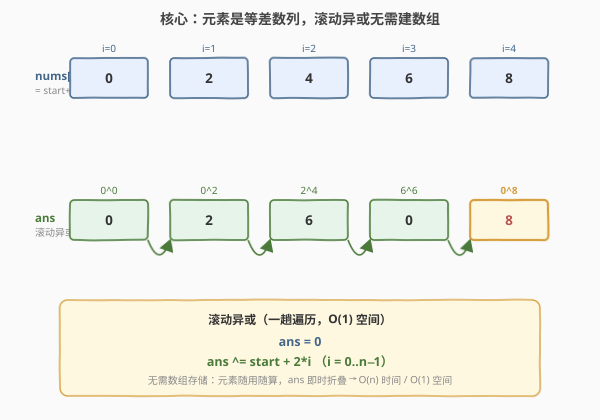
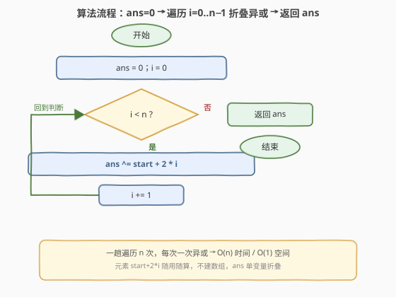
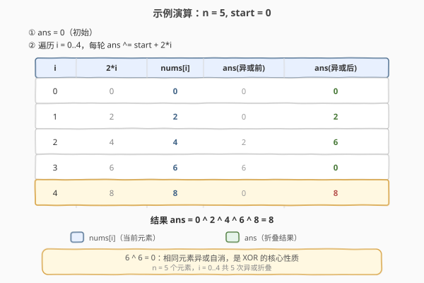
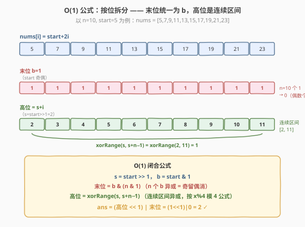

# LeetCode 数组异或操作 题解

## 1. 题目概述

- **标题 / 题号**：数组异或操作（#1486，easy）
- **链接**：https://leetcode.cn/problems/xor-operation-in-an-array/
- **难度**：简单
- **标签**：位运算、数组、数学

**题意**：给定两个整数 `n` 和 `start`。数组 `nums` 定义为：`nums[i] = start + 2*i`（下标从 0 开始），且 `n == nums.length`。请返回 `nums` 中所有元素按位异或（XOR）后得到的结果。

**示例 1**：

```text
输入：n = 5, start = 0
输出：8
解释：数组 nums 为 [0, 2, 4, 6, 8]，其中 (0 ^ 2 ^ 4 ^ 6 ^ 8) = 8
```

**示例 2**：

```text
输入：n = 4, start = 3
输出：8
解释：数组 nums 为 [3, 5, 7, 9]，其中 (3 ^ 5 ^ 7 ^ 9) = 8
```

**示例 3**：

```text
输入：n = 1, start = 7
输出：7
```

**示例 4**：

```text
输入：n = 10, start = 5
输出：2
```

**约束**：

- $1 \le n \le 1000$
- $0 \le \text{start} \le 1000$
- $n == \text{nums.length}$

> 💡 **关键点**：`nums` 是一个**公差为 2 的等差数列**——`start, start+2, start+4, ..., start+2(n-1)`。题目要求把整个数列异或起来。由于 $n \le 1000$，直接逐个生成并折叠异或即可 $O(n)$ 解决；但元素的同奇偶结构与连续性还隐藏着一个 $O(1)$ 闭合公式（见第 5 节）。

## 2. 解题思路

### 2.1 暴力思路：先建数组再异或

最直观的做法分两步走：

1. **建数组**：开一个长度为 $n$ 的数组 `nums`，按下标逐个填入 `nums[i] = start + 2*i`；
2. **再异或**：另起一趟循环，把所有元素依次异或进累加器。

```text
nums = [0] * n
for i in range(n):
    nums[i] = start + 2*i      # 第一趟：构造
ans = 0
for x in nums:
    ans ^= x                   # 第二趟：异或
```

- **正确**：逻辑清晰、必然正确；
- **浪费**：① 额外开了 $O(n)$ 空间存数组；② 两次遍历，而构造与异或完全可以**合并成一趟**。

> ⚠️ 暴力法的根因：把「构造」和「异或」当成两个独立阶段。其实每个元素 `start + 2*i` 用一次即可丢掉——它只参与一次异或，根本不需要被存下来。

### 2.2 核心观察：滚动异或，无需存储



关键观察：**异或运算只需要一个累加器**。元素 `nums[i] = start + 2*i` 可以「随用随算」——算出来立刻折叠进 `ans`，无需数组中转：

$$\text{ans} \mathrel{\oplus}= \text{start} + 2 \cdot i \qquad (i = 0, 1, \dots, n-1)$$

这样把「建数组 + 再异或」的两趟循环合并成**一趟**，空间从 $O(n)$ 降到 $O(1)$，时间仍是 $O(n)$。

> 💡 **为什么异或适合「滚动」？** 异或是**可结合**的，且不依赖历史中间值——`ans ^= x` 只需要当前的 `ans` 和当前的 `x`，不像前缀和那样需要保留整段。所以任何「求全量异或」的问题都可以用单变量滚动，无需数组。这是异或题最基础的优化意识。

### 2.3 算法流程图



**完整步骤**：

1. **初始化** `ans = 0`，`i = 0`（异或的幺元是 0，因为 $0 \oplus x = x$）；
2. **遍历** `i` 从 `0` 到 `n-1`：
   - `ans ^= start + 2 * i`（随用随算当前元素，立即折叠）；
3. **返回** `ans`。

> 💡 **初始化为 0 的依据**：异或运算的幺元是 0——$0 \oplus x = x$，所以从 `ans = 0` 开始等价于「从第一个元素起步」。若误初始化为 `start` 再从 `i = 1` 起算也能得到正确结果，但「从 0 起步、统一循环」的写法更简洁，无需特判首元素。

### 2.4 示例演算

以示例 1 的 `n = 5, start = 0` 为例（`nums = [0, 2, 4, 6, 8]`）：



| $i$ | $2 \cdot i$ | $\text{nums}[i]$ | ans（异或前） | ans（异或后） |
|-----|-------------|-------------------|----------------|----------------|
| 0 | 0 | 0 | 0 | $0 \oplus 0 = 0$ |
| 1 | 2 | 2 | 0 | $0 \oplus 2 = 2$ |
| 2 | 4 | 4 | 2 | $2 \oplus 4 = 6$ |
| 3 | 6 | 6 | 6 | $6 \oplus 6 = 0$ |
| 4 | 8 | 8 | 0 | $0 \oplus 8 = 8$ |

- **第 ① 步**：`ans = 0`（初始化幺元）。
- **第 ② 步**：`i=0` → `ans ^= 0` 仍为 0；`i=1` → `ans ^= 2` 得 2；`i=2` → `ans ^= 4` 得 6；`i=3` → `ans ^= 6`，注意 $6 \oplus 6 = 0$（相同数自消）；`i=4` → `ans ^= 8` 得 8。
- **结果**：`8` ✓。

> 💡 注意 `i=3` 这一步：`6 ^ 6 = 0` 体现了异或的**自消性**（$x \oplus x = 0$）。这是后续 $O(1)$ 公式的理论基石——相同元素成对抵消，使得「奇偶个」成为决定性因素。以示例 4 `[5,7,9,11,13,15,17,19,21,23]` 验证，最终 `ans = 2` ✓。

## 3. 参考代码

### C++

```cpp
class Solution {
public:
    int xorOperation(int n, int start) {
        int ans = 0;
        for (int i = 0; i < n; ++i) {
            ans ^= (start + 2 * i);
        }
        return ans;
    }
};
```

### Python

```python
class Solution:
    def xorOperation(self, n: int, start: int) -> int:
        ans = 0
        for i in range(n):
            ans ^= (start + 2 * i)
        return ans
```

### Python（生成器一行解法）

```python
from functools import reduce
from operator import xor

class Solution:
    def xorOperation(self, n: int, start: int) -> int:
        return reduce(xor, (start + 2 * i for i in range(n)), 0)
```

> 💡 **实现要点**：① `ans` 初始化为 0（异或幺元），循环从 `i = 0` 起统一处理，无需特判首元素；② 元素 `start + 2*i` 算出即用、用完即丢，**不开数组**，$O(1)$ 额外空间；③ 生成器版用 `reduce` + `operator.xor`，本质与手写循环一致，初始值 0 同样是幺元。`reduce` 的第三个参数是初始值，不可省略（否则 $n=0$ 时报错，虽然本题保证 $n \ge 1$）。

## 4. 复杂度分析

| 维度 | 滚动异或 $O(n)$（推荐） | 暴力建数组 |
|------|------------------------|------------|
| **时间复杂度** | $O(n)$ | $O(n)$ |
| **空间复杂度** | $O(1)$ | $O(n)$ |
| **遍历趟数** | 一趟 | 两趟 |
| **是否建数组** | 否 | 是 |

- **滚动异或**：一趟遍历 $n$ 次，每次一次加法（`start + 2*i`）+ 一次异或，合计 $O(n)$；额外空间 $O(1)$（仅 `ans` 与循环变量）。是本题最优解。
- **暴力建数组**：时间同为 $O(n)$（两趟共 $2n$），但额外开了 $O(n)$ 数组，纯属冗余——元素用一次就丢，存储毫无意义。

> ⚠️ 本题下界 $O(n)$（至少要生成 $n$ 个元素参与异或），滚动法已达到时间下界。空间上 $O(1)$ 亦是极限。若 $n$ 上 $10^9$，则需改用第 5 节的 $O(1)$ 闭合公式——但本题 $n \le 1000$，滚动法是**性价比最优**解。

## 5. 扩展：$O(1)$ 闭合公式（按位拆分 + 区间异或）

当 $n$ 极大（如 $10^9$）时，$O(n)$ 滚动会超时。利用等差数列的结构，可推导出 $O(1)$ 闭合公式。

### 5.1 核心观察：末位统一、高位连续

记 $s = \text{start} \gg 1$（`start` 的高位部分），$b = \text{start} \mathbin{\&} 1$（末位，即奇偶性）。则每个元素：

$$\text{start} + 2 \cdot i = 2 \cdot (s + i) + b$$

即**末位恒为 $b$，高位部分为 $s, s+1, \dots, s+n-1$（连续区间）**。



异或可按位独立计算，于是答案拆成两部分：

**末位**：$n$ 个 $b$ 异或。由自消性（$b \oplus b = 0$），偶数个全消为 0，奇数个剩一个 $b$：

$$\text{末位} = b \mathbin{\&} (n \mathbin{\&} 1)$$

**高位**：$s, s+1, \dots, s+n-1$ 的异或，即连续区间异或 $\text{xorRange}(s,\, s+n-1)$。区间异或可用「前缀异或」$O(1)$ 计算：$\text{xorRange}(a, b) = \text{xor}_0(b) \oplus \text{xor}_0(a-1)$，其中 $\text{xor}_0(x)$（$0$ 到 $x$ 的异或）有模 4 周期：

| $x \bmod 4$ | $\text{xor}_0(x)$ |
|-------------|--------------------|
| 0 | $x$ |
| 1 | $1$ |
| 2 | $x + 1$ |
| 3 | $0$ |

**最终公式**：

$$\text{ans} = \big(\text{xorRange}(s,\, s+n-1) \ll 1\big) \;\big|\; \big(b \mathbin{\&} (n \mathbin{\&} 1)\big)$$

> 💡 **模 4 周期的来历**：把 $0,1,2,3$ 异或得 $0$（每 4 个连续整数异或归零），所以 $0..x$ 的异或只取决于末尾不满 4 个的「尾巴」，从而出现 $x \bmod 4$ 的四种情况。这是位运算题的高频结论，建议直接记忆。

### 5.2 参考代码

```cpp
class Solution {
    // 0..x 的异或，模 4 周期
    int xor0ToX(int x) {
        switch (x & 3) {
            case 0: return x;
            case 1: return 1;
            case 2: return x + 1;
            default: return 0;   // case 3
        }
    }
    // [a, b] 闭区间异或；xor0ToX(-1) 经 case 3 恰好返回 0，天然处理 a=0
    int xorRange(int a, int b) {
        return xor0ToX(b) ^ xor0ToX(a - 1);
    }
public:
    int xorOperation(int n, int start) {
        int s = start >> 1, b = start & 1;
        int upper = xorRange(s, s + n - 1);
        return (upper << 1) | (b & (n & 1));
    }
};
```

```python
class Solution:
    def xorOperation(self, n: int, start: int) -> int:
        def xor0(x):
            return (x, 1, x + 1, 0)[x & 3]
        def xor_range(a, b):
            return xor0(b) ^ xor0(a - 1)
        s, b = start >> 1, start & 1
        return (xor_range(s, s + n - 1) << 1) | (b & (n & 1))
```

> ⚠️ **边界细节**：① `a = 0` 时 `xor0ToX(a - 1) = xor0ToX(-1)`，而 $-1$ 在二补码下 $-1 \mathbin{\&} 3 = 3$，走 `case 3` 返回 0，等价于「空区间异或为幺元 0」，无需特判；② `(upper << 1) | lastBit` 用按位或拼接而非加法——因为末位位与高位部分不重叠，或运算等价于加法且更贴合「按位组装」的语义。

### 5.3 $O(n)$ 与 $O(1)$ 的取舍

| 维度 | $O(n)$ 滚动异或 | $O(1)$ 闭合公式 |
|------|-----------------|------------------|
| 时间 | $O(n)$，$n{=}1000$ 约 $10^3$ | $O(1)$，常数次位运算 |
| 空间 | $O(1)$ | $O(1)$ |
| 思维链 | 一步：随用随算折叠 | 三步：按位拆分 → 区间异或 → 模 4 周期 |
| 适用场景 | $n \le 10^6$ 的约束题 | $n$ 上 $10^9$ 时必选 |
| 易错点 | 无 | 模 4 周期记忆、$a=0$ 边界 |

> 💡 **一句话**：$O(n)$ 是「看清本质、实现极简」的性价比解；$O(1)$ 是「等差数列 + 异或按位独立」的结构性红利。面试中应先给 $O(n)$，再主动推导 $O(1)$ 作为进阶，展示从「模拟」到「数学闭合」的思维跃迁。

## 6. 面试要点

1. **为什么 `ans` 初始化为 0 而不是 1 或别的值？**

   > 因为异或运算的**幺元**是 0——$0 \oplus x = x$。从 0 开始累加异或，等价于「从第一个元素起步」而不引入多余噪声。若初始化为 1，则结果会多异或一个 1，得到错误答案。任何「全量异或」问题都应以 0 为累加器初值。

2. **为什么不建数组？滚动异或为何安全？**

   > 每个元素 `start + 2*i` 只参与**一次**异或，算出后即被折叠进 `ans`，之后再也不需要。异或是可结合的，`ans ^= x` 只依赖当前 `ans` 和 `x`，无需保留历史中间值。所以元素随用随算、用完即丢，$O(1)$ 空间即可，数组纯属冗余存储。

3. **$O(1)$ 公式里，为什么末位只取决于 $b$ 和 $n$ 的奇偶？**

   > 因为 $n$ 个元素的末位**全部相同**（都是 $b = \text{start} \& 1$）。由异或自消性 $b \oplus b = 0$，偶数个 $b$ 两两抵消为 0，奇数个剩一个 $b$。所以末位 $= b \mathbin{\&} (n \mathbin{\&} 1)$——奇留偶消。这是「相同元素成对抵消」的直接推论。

4. **$\text{xor}_0(x)$ 的模 4 周期怎么来的？**

   > $0 \oplus 1 \oplus 2 \oplus 3 = 0$——每 4 个连续整数异或归零。所以 $0..x$ 的异或只剩末尾不足 4 个的「尾巴」：$x \bmod 4 = 0$ 时尾巴是 $\{x\}$ 得 $x$；$=1$ 时 $\{x-1, x\}$ 异或为 $1$；$=2$ 时 $\{x-2,x-1,x\}$ 得 $x+1$；$=3$ 时尾巴完整四个归零。建议直接记忆这四种情况。

5. **$O(1)$ 公式里 `xor0ToX(a - 1)` 当 $a = 0$ 时会出问题吗？**

   > 不会。$a = 0$ 时 `a - 1 = -1`，在二补码下 $-1 = \dots1111_2$，所以 $-1 \mathbin{\&} 3 = 3$，走 `case 3` 返回 0——恰好等于「空区间（$0$ 到 $-1$）的异或 = 幺元 0」。这是二补码的一个巧合红利，无需特判。若用 Python，`(-1) & 3` 同样得 3，行为一致。

> 💡 **一句话总结**：1486 是异或题的「Hello World」——$n \le 1000$ 时单变量滚动异或 $O(n)/O(1)$ 即可；其等差数列结构隐藏着按位拆分 + 区间异或的 $O(1)$ 闭合公式，是理解「异或按位独立」与「模 4 周期」的入门跳板。

## 同类练习题

| # | 题目 | 与本题的关联 |
|---|------|-------------|
| 1480 | [一维数组的动态和](https://leetcode.cn/problems/running-sum-of-1d-array/)（[题解](1480_一维数组的动态和.md)） | 同属「等差/递推数组的滚动聚合」家族——1480 滚动求和（加法幺元 0），1486 滚动异或（异或幺元 0），结构完全对称，对照记忆「不同运算的幺元与滚动模板」 |
| 1720 | [解码异或后的数组](https://leetcode.cn/problems/decode-xored-array/) | 异或的逆运算——已知 `encoded[i] = arr[i] ^ arr[i+1]` 和首元素反推原数组，利用 $a \oplus b = c \Rightarrow a = b \oplus c$，承接 1486 的异或基础性质 |
| 1310 | [子数组异或查询](https://leetcode.cn/problems/xor-queries-of-a-subarray/)（[题解](../1301-1400/1310_子数组异或查询.md)） | 前缀异或的直接应用——$\text{arr}[i..j] \oplus = s[j+1] \oplus s[i]$，区间查询 $O(1)$，是 1486「全量异或」升级到「区间异或」的自然延伸 |
| 2683 | [邻位异或](https://leetcode.cn/problems/neighboring-bitwise-xor/) | 异或前缀关系的判定题——给定邻位异或 derived 反推 original 是否存在，综合异或自消性与前缀关系，是 1486 异或性质的进阶综合应用 |
