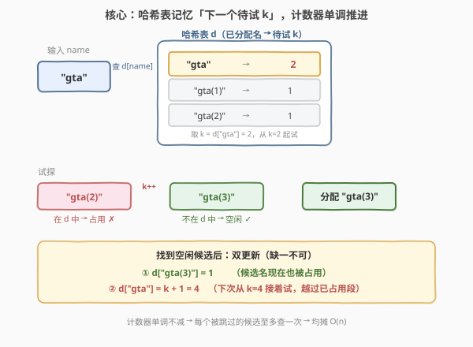
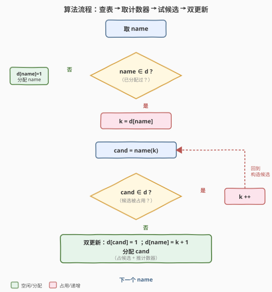
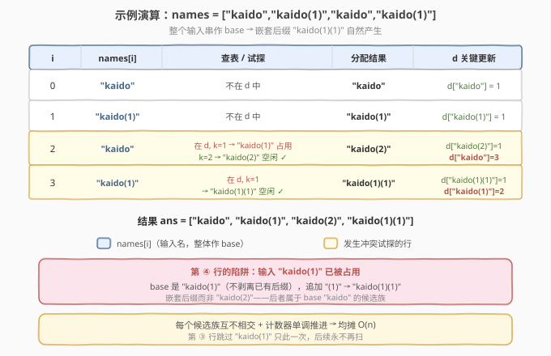

# LeetCode 保证文件名唯一 题解

## 1. 题目概述

- **标题 / 题号**：保证文件名唯一（#1487，medium）
- **链接**：https://leetcode.cn/problems/making-file-names-unique/
- **难度**：中等
- **标签**：哈希表、字符串

**题意**：给定长度为 `n` 的字符串数组 `names`，依次创建文件夹。若当前文件名**已被占用**，系统在其后追加后缀 `(k)`，其中 `k` 是**能保证文件名唯一的最小正整数**。返回实际分配的名称数组。

**关键规则**：被追加后缀后的文件名本身也会占用一个名字——后续若直接输入这个带后缀的名字，仍可能再被追加**新的后缀**。

**示例 1**：

```text
输入：names = ["pes","fifa","gta","pes(2019)"]
输出：["pes","fifa","gta","pes(2019)"]
解释：四个名字互不冲突，原样分配。
```

**示例 2**：

```text
输入：names = ["gta","gta(1)","gta","avalon"]
输出：["gta","gta(1)","gta(2)","avalon"]
解释：第三个 "gta" 被占用，"gta(1)" 也被占用，故 k=2 → "gta(2)"。
```

**示例 5（最易错的样例）**：

```text
输入：names = ["kaido","kaido(1)","kaido","kaido(1)"]
输出：["kaido","kaido(1)","kaido(2)","kaido(1)(1)"]
解释：最后一个 "kaido(1)" 已被占用，于是再追加后缀 → "kaido(1)(1)"，
      而非 "kaido(2)"——因为输入名是 "kaido(1)"，base 就是它本身。
```

**约束**：

- $1 \le \text{names.length} \le 5 \times 10^4$
- $1 \le \text{names}[i].\text{length} \le 20$
- `names[i]` 由小写英文字母、数字和/或圆括号组成。

> 💡 **关键点**：① 把**整个输入串**当作 base 名，不剥离已有 `(k)` 后缀（这是示例 5 的陷阱）；② 用哈希表记录「已分配名 → 下一个待试的 `k`」，让计数器**单调不减**地跳过已占用的候选，实现均摊 $O(n)$。

## 2. 解题思路

### 2.1 暴力思路：每次从 k=1 线性试探

最直觉的做法：用一个集合 `seen` 记录所有已分配的名字。对每个 `name`：

- 若 `name` 不在 `seen` 中，直接分配；
- 否则从 `k=1` 起，依次构造 `name(k)`，直到找到不在 `seen` 中的候选。

```text
seen = set()
for name in names:
    if name not in seen:
        seen.add(name); ans.append(name)
    else:
        k = 1
        while name(k) in seen: k += 1
        seen.add(name(k)); ans.append(name(k))
```

**正确但低效**。反例：`names = ["a","a","a",...,"a"]`（`n` 个相同的 `"a"`）。第 `i` 个 `"a"` 要从 `k=1` 试到 `k=i`，共 $1+2+\dots+(n-1)=O(n^2)$ 次哈希查找，$n=5\times10^4$ 时直接超时。

> ⚠️ 暴力的浪费在于「**重复扫描已占用的候选段**」。处理第 100 个 `"a"` 时，`"a(1)".."a(99)"` 全被占用，却要从 1 重新数到 99——其实上一轮已经确认这段全满，只需从 100 接着试。

### 2.2 核心观察：计数器记忆「下一个待试 k」



把集合升级为**映射** `d`：`d[name]` 记录「`name` 这个 base 下，下一个该试的 `k`」。

- 首次遇到 `name`：分配 `name`，置 `d[name] = 1`（下次冲突从 `k=1` 起试）；
- 再次遇到 `name`：**不从 1 开始**，而是取 `k = d[name]`，构造 `name(k)`：
  - 若 `name(k)` 已在 `d` 中（被先前直接输入占用），`k++` 继续试；
  - 找到空闲的 `name(k)` 后，分配它，并**两步更新**：
    1. `d[name(k)] = 1`——这个候选名现在也被占用了；
    2. `d[name] = k + 1`——下次再遇 `name`，从 `k+1` 接着试。

这样计数器**单调不减**，已确认占用的候选段**永不再扫**。

> 💡 **为什么不剥离已有 `(k)` 后缀？** 因为题意把每个输入串**整体**视为一个名字。`"kaido(1)"` 是一个独立的名字，不是 `"kaido"` 的第 1 号变体。所以重复输入 `"kaido(1)"` 时，base 就是 `"kaido(1)"`，追加后缀得到 `"kaido(1)(1)"`，而非 `"kaido(2)"`。算法上这恰好是自然行为——`name(k)` 构造时用的是完整输入串作 base。

### 2.3 算法流程图



**完整步骤**：

1. **查表**：`name` 是否在 `d` 中？
2. **不在**：直接分配 `name`，`d[name] = 1`，结束；
3. **在**：取 `k = d[name]`，构造 `cand = name + "(" + k + ")"`；
4. **`cand` 在 `d` 中？** 是 → `k++`，回到步骤 3；否 → 进入步骤 5；
5. **双更新**：`d[cand] = 1`，`d[name] = k + 1`，分配 `cand`。

> 💡 步骤 4 的 while 循环看似可能很长，但每次「`cand` 在 `d` 中」都对应一个**先前已插入**的候选——而 `d[name]` 单调不减保证每个被跳过的候选**至多被检查一次**，故总循环次数均摊 $O(n)$（详见第 4 节）。

### 2.4 示例演算

以示例 5 `names = ["kaido","kaido(1)","kaido","kaido(1)"]` 为例（展示**嵌套后缀**这一最易错点）：



| $i$ | `names[i]` | 查表结果 | 试探过程 | 分配结果 | `d` 关键更新 |
|-----|------------|----------|----------|----------|--------------|
| 0 | `kaido` | 不在 | — | `kaido` | `d["kaido"]=1` |
| 1 | `kaido(1)` | 不在 | — | `kaido(1)` | `d["kaido(1)"]=1` |
| 2 | `kaido` | 在，`k=1` | `"kaido(1)"` 占用 → `k=2`；`"kaido(2)"` 空闲 | `kaido(2)` | `d["kaido(2)"]=1`，`d["kaido"]=3` |
| 3 | `kaido(1)` | 在，`k=1` | `"kaido(1)(1)"` 空闲 | `kaido(1)(1)` | `d["kaido(1)(1)"]=1`，`d["kaido(1)"]=2` |

- **第 ③ 步**：`"kaido"` 的计数器从 1 起试，`"kaido(1)"` 已被第 1 步直接占用，跳到 `k=2` 找到空闲的 `"kaido(2)"`，并把计数器推进到 3。
- **第 ④ 步**：输入是 `"kaido(1)"`（整体作 base），它在 `d` 中，计数器为 1，构造 `"kaido(1)(1)"`——注意这是**在 base 后追加**，不是改写已有的 `(1)`，故得到嵌套形式 `"kaido(1)(1)"`。

最终结果 `["kaido","kaido(1)","kaido(2)","kaido(1)(1)"]` ✓。

## 3. 参考代码

### C++

```cpp
// 保证文件名唯一.cpp —— 哈希表记忆计数器，均摊 O(n)
// 编译: g++ -O2 -std=c++17 保证文件名唯一.cpp -o mfn
class Solution {
  public:
    vector<string> getFolderNames(vector<string>& names) {
        unordered_map<string, int> d;          // 已分配名 -> 下一个待试 k
        vector<string> ans;
        ans.reserve(names.size());
        for (string& name : names) {
            if (!d.count(name)) {
                d[name] = 1;                    // 首次出现，登记并预留 k=1
                ans.push_back(name);
            } else {
                int k = d[name];
                string cand;
                while (true) {
                    cand = name + "(" + to_string(k) + ")";
                    if (!d.count(cand)) break;  // 找到空闲候选
                    ++k;                        // 占用则继续递增
                }
                d[cand] = 1;                    // 候选名现在也被占用
                d[name] = k + 1;                // 下次从 k+1 接着试
                ans.push_back(cand);
            }
        }
        return ans;
    }
};
```

### Python

```python
class Solution:
    def getFolderNames(self, names: List[str]) -> List[str]:
        d = {}                                 # 已分配名 -> 下一个待试 k
        ans = []
        for name in names:
            if name not in d:
                d[name] = 1                     # 首次出现，登记并预留 k=1
                ans.append(name)
            else:
                k = d[name]
                while True:
                    cand = f"{name}({k})"
                    if cand not in d:
                        break                   # 找到空闲候选
                    k += 1                      # 占用则继续递增
                d[cand] = 1                     # 候选名现在也被占用
                d[name] = k + 1                 # 下次从 k+1 接着试
                ans.append(cand)
        return ans
```

> 💡 **实现要点**：① 用 `d.count(name)` / `name in d` 判定是否已占用，**不要**用集合——计数器是均摊优化的关键；② 找到候选后**两步更新缺一不可**：`d[cand]=1` 防止后续直接输入 `cand` 时重复分配，`d[name]=k+1` 让计数器越过已确认占用的段；③ C++ 中 `name + "(" + to_string(k) + ")"` 涉及临时串，但 `names[i].length ≤ 20`，单次拼接代价很小。

## 4. 复杂度分析

| 维度 | 计数器记忆法（推荐） | 暴力从 k=1 试探 |
|------|---------------------|-----------------|
| **时间复杂度** | 均摊 $O(n)$ | $O(n^2)$ 最坏 |
| **空间复杂度** | $O(n)$（哈希表存 $n$ 个条目） | $O(n)$（集合存 $n$ 个条目） |
| **每名均摊操作** | $O(1)$ 次哈希查找 | $O(i)$ 次哈希查找 |
| **是否复用前一次** | 是（计数器单调推进） | 否（每次从头扫） |

**均摊 $O(n)$ 的依据**：

- 每个输入名最终向 `d` 插入**恰好一个**条目（`name` 或某个 `name(k)`），故 `d` 中至多 $n$ 个键。
- while 循环中每次「`cand` 在 `d` 中」成功命中，都对应一个**先前已插入**的候选；而 `d[name]` 单调不减，保证同一个候选 `name(k)` 对其 base `name` **至多被跳过一次**。
- 不同 base 产生的候选族**互不相交**（`"a(1)"` 只会是 base `"a"` 的候选，不会是 base `"b"` 的候选），故每个已插入的键至多被「跳过」一次。
- 于是「成功命中」总次数 $\le n$，「失败退出」总次数 $= n$（每个输入名恰好一次），总循环次数 $\le 2n$，均摊 $O(n)$。

> ⚠️ **字符串拼接代价**：`name(k)` 的长度 $\le 20 + \lfloor\log_{10} k\rfloor + 2$。最坏情况 `names` 全为 `"a"` 时，输出 `"a(n-1)"` 长度为 $O(\log n)$，总字符量为 $O(n\log n)$，但哈希查找次数仍为均摊 $O(n)$。题目 $n \le 5\times10^4$，$\log n \approx 16$，毫无压力。

## 5. 扩展：并查集跳点法

还有一种等价的均摊优化：用**并查集**（或称「跳点数组」）让被占用的候选直接指向下一个空位。对每个 base `name` 维护一个映射 `next[name]`：

- 查找 `find(name, k)`：若 `name(k)` 已被占用，则递归 `find(name, k+1)`，并做**路径压缩**——让 `name(k)` 直接指向最终找到的空位。
- 找到空位 `name(k*)` 后，`next[name(k*)]` 指向 `k*+1`。

这与计数器法**本质同构**：计数器 `d[name] = k+1` 就是「`name` 下一个该试的空位」，而 while 循环的递增就是一种线性路径压缩。区别在于：

- **计数器法**：每个 base 一条计数器，跳过的是该 base 的候选族内部，实现最简；
- **并查集法**：对每个**具体候选名**建立指向关系，能跨「直接输入」与「追加生成」统一处理，路径压缩后查找近 $O(1)$，但实现更重。

> 💡 面试中**先用计数器法**讲清「单调推进 + 每个候选只跳一次」的均摊分析，再提并查集作为「路径压缩」视角的等价解，足以覆盖所有追问。两种写法的渐近复杂度相同。

## 6. 面试要点

1. **为什么不从 `k=1` 重新开始试探？**

   > 从 1 开始虽正确，但在「大量同名」输入下退化为 $O(n^2)$（如 `n` 个 `"a"` 要 $1+2+\dots+(n-1)$ 次查找）。用计数器 `d[name]` 记忆「下一个待试 `k`」，让它单调不减地越过已占用段，把每个候选的跳过次数摊到 $O(1)$，整体降到均摊 $O(n)$。

2. **为什么把整个输入串当 base，不剥离已有的 `(k)` 后缀？**

   > 题意把每个输入串**整体**视为一个名字。`"kaido(1)"` 是独立名字，重复输入时 base 就是 `"kaido(1)"`，追加得到 `"kaido(1)(1)"`（嵌套后缀），而非 `"kaido(2)"`。算法上 `cand = name + "(" + k + ")"` 用完整输入串拼接，恰好自然实现这一点——无需任何后缀解析。示例 5 正是考查此陷阱。

3. **均摊 $O(n)$ 的核心依据是什么？**

   > 两点：① 每个输入名恰好向哈希表插入一个条目，表大小至多 $n$；② `d[name]` 单调不减，且不同 base 的候选族互不相交，故每个已插入的候选**至多被跳过一次**。于是 while 循环的「成功命中」总次数 $\le n$，加上每名一次「失败退出」，总次数 $\le 2n$，均摊 $O(n)$。

4. **找到候选后的两步更新能省一步吗？**

   > 不能。`d[cand] = 1` 防止后续**直接输入** `cand` 时重复分配（如示例 5 第 4 步输入 `"kaido(1)"` 命中此条目）；`d[name] = k + 1` 让计数器越过已确认占用的段，保证均摊性。省任一步都会出错或退化：省前者会漏占导致重名，省后者会退回 $O(n^2)$。

5. **如果 `names` 全是同一个串，最坏情况输出有多长？**

   > 输出为 `["a","a(1)","a(2)",...,"a(n-1)"]`。最长串 `"a(n-1)"` 长度 $O(\log n)$，总字符量 $O(n\log n)$；但哈希查找次数仍为均摊 $O(n)$（计数器从 1 单调推到 $n-1$，每个候选只跳一次）。$n=5\times10^4$ 时 $\log n\approx16$，空间与时间都无压力。

> 💡 **一句话总结**：1487 的核心是「**哈希表记忆计数器，单调推进越过已占用段**」。把整个输入串当 base，`d[name]` 记下一个待试 `k`，找到候选后双更新（占候选 + 推计数器），均摊 $O(n)$ 搞定。与 [205 同构字符串](../0201-0300/205_同构字符串.md)、[187 重复的DNA序列](../0101-0200/187_重复的DNA序列.md) 同属「字符串作哈希键」系列。

## 同类练习题

| # | 题目 | 与本题的关联 |
|---|------|-------------|
| 205 | [同构字符串](https://leetcode.cn/problems/isomorphic-strings/)（[题解](../0201-0300/205_同构字符串.md)） | 哈希表维护字符串映射一致性，同为「字符串作哈希键」的招牌题 |
| 187 | [重复的 DNA序列](https://leetcode.cn/problems/repeated-dna-sequences/)（[题解](../0101-0200/187_重复的DNA序列.md)） | 哈希表记录字符串出现并去重，定长滑窗 + 滚动哈希 |
| 49 | [字母异位词分组](https://leetcode.cn/problems/group-anagrams/)（[题解](../0001-0100/49_字母异位词分组.md)） | 把字符串编码为哈希键做分组，键构造思想与本题的 `name(k)` 拼接同源 |
| 290 | [单词规律](https://leetcode.cn/problems/word-pattern/)（[题解](../0201-0300/290_单词规律.md)） | 哈希双射判定，单词 ↔ 字符映射，同为「哈希表维护字符串映射」系列 |
