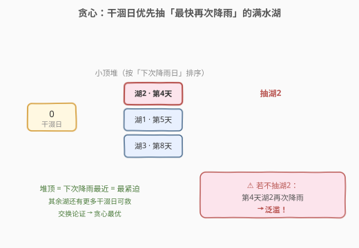
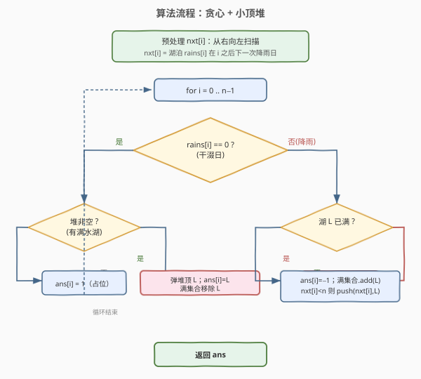
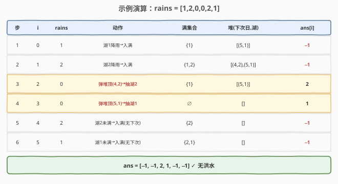

# 避免洪水泛滥

- **题目名称**：避免洪水泛滥
- **链接**：[1488. 避免洪水泛滥](https://leetcode.cn/problems/avoid-flood-in-the-city/)
- **难度**：中等
- **标签**：贪心、堆、哈希表、数组

## 1. 题目概述

有 $10^9$ 个湖泊，初始全空。给一个整数数组 `rains`，按天模拟：

- `rains[i] > 0`：第 `rains[i]` 号湖泊下雨。若下雨前该湖**已满**则发生**洪水**（失败）；若为空则装满。
- `rains[i] == 0`：该天**必须**选一个湖泊**抽干**。抽干满湖→变空；抽干空湖→无事发生。

要求返回数组 `ans`：`rains[i] > 0` 时 `ans[i] = -1`；`rains[i] == 0` 时 `ans[i]` 为该天抽干的湖泊号。若无法避免洪水返回空数组 `[]`。多解返回任意一个。

**示例 1**：

```text
输入：rains = [1,2,3,4]
输出：[-1,-1,-1,-1]
解释：没有干涸日，但每个湖只下一次雨，不会洪水。
```

**示例 2**：

```text
输入：rains = [1,2,0,0,2,1]
输出：[-1,-1,2,1,-1,-1]
解释：第 3 天抽湖 2，第 4 天抽湖 1，第 5、6 天湖 2、湖 1 重新下雨时已是空湖。
```

**示例 3**：

```text
输入：rains = [1,2,0,1,2]
输出：[]
解释：第 3 天只有一个干涰日，但湖 1、湖 2 都会在之后再次下雨，救不了两个 → 必然洪水。
```

**约束条件**：

- $1 \le \text{rains.length} \le 10^5$
- $0 \le \text{rains[i]} \le 10^9$

---

## 2. 解题思路

### 2.1 暴力思路

对每个干涰日枚举要抽哪个湖，回溯所有组合判断是否能让全过程无洪水。干涰日可能多达 $10^5$ 个，每个有 $10^9$ 种选择，显然不可行。

退一步：**何时真正需要抽水？** 只有当一个满水湖**即将再次下雨**时才必须在此之前抽干它。干涰日的选择可以**延迟决策**——先攒着，等某个湖被逼到洪水边缘再回填。

### 2.2 核心观察：贪心 + 小顶堆（按下一次降雨日排序）

关键洞察：**一个满水湖的「紧迫度」= 它下一次降雨的日子**。日子越近越紧迫——若不在那之前抽干，必然洪水。

于是每个干涰日做一件最划算的事：**在所有满水湖里，抽掉「下一次降雨最近」的那个**。



如上图：干涰日到来时，小顶堆里堆着所有「当前满水且未来还会再下雨」的湖泊，按下次降雨日排序。堆顶 = 最紧迫 = 必须最先救。把它抽干，其余湖的下一次降雨都更远，**还留着更多未来的干涰日可救**。

> 💡 **为什么「按下一次降雨日」是正确的贪心维度？** 因为洪水的判定只看「满水湖再次降雨」。一个湖离再次降雨越近，留给它被救的干涰日窗口越短，必须优先。这与 [任务调度器](https://leetcode.cn/problems/task-scheduler/)「按下次需求时刻排序」同构。

**正确性（交换论证）**：设某干涰日 $d$，贪心抽最紧迫的湖 $B$（下次降雨 $r_B$），而某最优解抽了 $A$（下次降雨 $r_A > r_B$）。那么 $B$ 必须在 $r_B$ 前被某干涰日抽干，设最优解在 $d'$ 抽 $B$（$d < d' < r_B$）。把 $d$ 与 $d'$ 的抽取对象对调（$d$ 抽 $B$，$d'$ 抽 $A$）：$d < r_B$ 成立、$d' < r_A$ 也成立（因 $d' < r_B < r_A$），方案仍合法。故贪心不劣于最优解。

### 2.3 预处理：从右向左求「下一次降雨日」

需要快速知道「第 $i$ 天降雨的湖，下一次降雨是哪天」。从右向左扫一遍，用哈希表记录每个湖**最近见到**的下标即可：

$$
\text{nxt}[i] = \begin{cases} \text{seen}[\text{rains}[i]] & \text{若该湖在 } i \text{ 之后出现过} \\ n & \text{否则（永不再下，记为 } +\infty \text{）} \end{cases}
$$

然后更新 $\text{seen}[\text{rains}[i]] = i$。$O(n)$ 一次扫完。

### 2.4 算法流程图



主循环逐天处理：

- **干涰日**（`rains[i]==0`）：若堆非空，弹堆顶（最紧迫湖 $L$），`ans[i]=L`，把 $L$ 移出满集合；否则 `ans[i]=1`（占位，抽空湖无副作用）。
- **降雨日**（`rains[i]=L>0`）：若 $L$ 已在满集合 → **洪水**，返回 `[]`；否则 `ans[i]=-1`，$L$ 入满集合，若 $\text{nxt}[i] < n$ 把 $(\text{nxt}[i], L)$ 入堆（永不再下的湖不必入堆，留着满也无害）。

> ⚠️ **永不再降雨的满水湖不入堆**：它们不会触发洪水，留在满集合里也无副作用，能避免占用宝贵的干涰日。

### 2.5 示例演算

以示例 2 `rains = [1,2,0,0,2,1]` 演算（先预处理得 $\text{nxt}=[5,4,n,n,n,n]$）：



| 步 | i | rains[i] | 动作 | 满集合 | 堆(下次日,湖) | ans[i] |
|----|---|----------|------|--------|--------------|--------|
| 1 | 0 | 1 | 湖1降雨→入满 | {1} | [(5,1)] | −1 |
| 2 | 1 | 2 | 湖2降雨→入满 | {1,2} | [(4,2),(5,1)] | −1 |
| 3 | 2 | 0 | 弹堆顶(4,2)→**抽湖2** | {1} | [(5,1)] | 2 |
| 4 | 3 | 0 | 弹堆顶(5,1)→**抽湖1** | ∅ | [] | 1 |
| 5 | 4 | 2 | 湖2未满→入满(nxt=∞不入堆) | {2} | [] | −1 |
| 6 | 5 | 1 | 湖1未满→入满(nxt=∞不入堆) | {2,1} | [] | −1 |

最终 `ans = [-1,-1,2,1,-1,-1]`，无洪水。关键在第 3、4 步：干涰日依次弹出**最紧迫**的湖 2、湖 1，正好赶在它们第 4、5 天再次降雨前抽干。

> 💡 对照示例 3 `rains=[1,2,0,1,2]`：第 3 天干涰日弹堆顶抽湖 1（或湖 2，二者下次降雨日同为 3/4），但**只剩 1 个干涰日、却有 2 个湖需要救**，第 4 或第 5 天必有一湖仍满而再降雨 → 返回 `[]`。

---

## 3. 参考代码

### Python

```python
class Solution:
    def avoidFlood(self, rains: List[int]) -> List[int]:
        import heapq
        n = len(rains)
        # 预处理 nxt[i]：湖泊 rains[i] 在 i 之后下一次降雨日（不存在记为 n）
        nxt = [n] * n
        seen = {}
        for i in range(n - 1, -1, -1):
            if rains[i] > 0:
                nxt[i] = seen.get(rains[i], n)
                seen[rains[i]] = i

        ans = [1] * n                 # 干涰日默认占位 1（抽空湖无副作用）
        full = set()                  # 当前满水湖泊集合
        heap = []                     # 小顶堆：(下次降雨日, 湖号)

        for i in range(n):
            if rains[i] == 0:         # 干涰日：贪心抽最紧迫的满水湖
                if heap:
                    _, lake = heapq.heappop(heap)
                    ans[i] = lake
                    full.discard(lake)
                # 否则 ans[i] 保持 1
            else:                     # 降雨日
                lake = rains[i]
                if lake in full:      # 已满 → 洪水
                    return []
                ans[i] = -1
                full.add(lake)
                if nxt[i] < n:        # 未来还会再下才入堆
                    heapq.heappush(heap, (nxt[i], lake))
        return ans
```

### C++

```cpp
class Solution {
  public:
    vector<int> avoidFlood(vector<int>& rains) {
        int n = rains.size();
        // 预处理 nxt[i]：湖泊 rains[i] 在 i 之后下一次降雨日（不存在记为 n）
        vector<int> nxt(n, n);
        unordered_map<int, int> seen;
        for (int i = n - 1; i >= 0; --i) {
            if (rains[i] > 0) {
                auto it = seen.find(rains[i]);
                nxt[i] = (it == seen.end()) ? n : it->second;
                seen[rains[i]] = i;
            }
        }

        vector<int> ans(n, 1);                       // 干涰日默认占位 1
        unordered_set<int> full;                     // 当前满水湖泊集合
        priority_queue<pair<int, int>, vector<pair<int, int>>, greater<>> heap;

        for (int i = 0; i < n; ++i) {
            if (rains[i] == 0) {                     // 干涰日：贪心抽最紧迫的满水湖
                if (!heap.empty()) {
                    auto [nd, lake] = heap.top();
                    heap.pop();
                    ans[i] = lake;
                    full.erase(lake);
                }
            } else {                                 // 降雨日
                int lake = rains[i];
                if (full.count(lake)) return {};     // 已满 → 洪水
                ans[i] = -1;
                full.insert(lake);
                if (nxt[i] < n) heap.push({nxt[i], lake});
            }
        }
        return ans;
    }
};
```

> 💡 C++ 用 `priority_queue<..., greater<>>` 实现小顶堆（按 `pair` 第一维「下次降雨日」升序）。`auto [nd, lake] = heap.top();` 为 C++17 结构化绑定。

---

## 4. 复杂度分析

| 维度 | 复杂度 | 说明 |
|------|--------|------|
| 时间复杂度 | $O(n)$ | 预处理从右向左扫一遍 $O(n)$；主循环每个元素至多入堆、出堆各一次，堆操作总计 $O(n)$ |
| 空间复杂度 | $O(n)$ | `nxt` 数组 $O(n)$、`full` 集合与堆最坏各 $O(n)$、`seen` 哈希表 $O(\text{湖泊数}) \le O(n)$ |

> ⚠️ 堆的 `push/pop` 虽在循环内调用，但**均摊分析**：每个降雨日至多入堆 1 次、每个干涰日至多出堆 1 次，堆操作总数 $\le 2n$，单次 $O(\log n)$，总时间 $O(n \log n)$。考虑到湖泊号可达 $10^9$，`full`/`seen` 必须用哈希表而非数组。

---

## 5. 扩展：延迟决策 + 有序集合（另一种等价实现）

上面是「**主动贪心**」：干涰日当场决定抽谁。还有一种「**延迟决策**」视角——干涰日先攒着不决定，等某湖被逼到洪水边缘再回填：

- 用有序集合（C++ `std::set` / Python `SortedList`）维护所有**尚未指派**的干涰日下标。
- 降雨日遇到已满的湖 $L$（上次满于 `last[L]`）：在集合里找 `lower_bound(last[L] + 1)`，取**最早**的可用干涰日 $d$（`last[L] < d < i`），指派 `ans[d] = L` 并从集合移除；找不到则返回 `[]`。

两种视角等价：主动贪心「按下次降雨日排序」≈ 延迟决策「取最早的可用干涰日」。延迟版时间 $O(n \log n)$，空间 $O(n)$，C++ 实现也很简洁：

```cpp
// 延迟决策版（C++）：用 set 维护可用干涰日
vector<int> avoidFlood(vector<int>& rains) {
    int n = rains.size();
    vector<int> ans(n, 1);
    unordered_map<int, int> last;          // 湖 → 上次降雨日
    set<int> dry;                          // 可用干涰日下标集合
    for (int i = 0; i < n; ++i) {
        if (rains[i] == 0) {
            dry.insert(i);
        } else {
            int lake = rains[i];
            ans[i] = -1;
            if (last.count(lake)) {        // 已满，需在 (last, i) 内找干涰日抽干
                auto it = dry.upper_bound(last[lake]);
                if (it == dry.end() || *it > i) return {};
                ans[*it] = lake;
                dry.erase(it);
            }
            last[lake] = i;
        }
    }
    return ans;
}
```

> 💡 **两种实现的取舍**：主动贪心（堆 + `nxt` 预处理）思路更直观——「先救最急」；延迟决策（`set` + `last`）代码更短、无需预处理。面试按个人习惯选其一即可，复杂度相同。

---

## 6. 面试要点

1. **为什么贪心按「下一次降雨日」排序是对的？**
   - 满水湖再次降雨即洪水，离再次降雨越近的湖留给它被救的干涰日窗口越短，必须优先救。可用交换论证严格证明（见 2.2）。

2. **干涰日抽空湖会怎样？**
   - 无事发生。所以无满水湖可救时 `ans[i]=1` 占位即可，不影响合法性。

3. **永不再降雨的满水湖为什么可以不入堆？**
   - 它不会再触发洪水，留在满集合里只占内存不占干涰日。入堆反而会被白白抽掉、浪费本可救别湖的干涰日。

4. **延迟决策和主动贪心的关系？**
   - 主动贪心「按下次降雨日排序弹出」≈ 延迟决策「为被逼湖取最早可用干涰日」。前者当场拍板、后者攒着回填，复杂度都是 $O(n \log n)$。

5. **`rains[i]` 高达 $10^9` 怎么处理？**
   - 湖泊号不能做数组下标，`full`/`last`/`seen` 一律用哈希表（`unordered_set`/`unordered_map`），仅下标维用数组。

---

## 7. 同类练习题

- [1054. 距离相等的条形码](https://leetcode.cn/problems/distant-barcodes/)：贪心 + 大根堆按剩余计数排，重构使相邻不同，与本题「按下次需求紧迫度排序」同构
- [767. 重构字符串](https://leetcode.cn/problems/reorganize-string/)：贪心 + 大根堆按字符频率排，相邻不重，频率维度对应本题「下次降雨日」维度
- [621. 任务调度器](https://leetcode.cn/problems/task-scheduler/)：按任务下次可执行时刻贪心调度，「冷却期」对应本题「满水湖再次降雨前的干涰日窗口」
- [871. 最低加油次数](https://leetcode.cn/problems/minimum-number-of-refueling-stops/)：贪心 + 大根堆延迟决策，途经加油站先攒着、不够用时回取最大油量，与本题延迟决策版同思路
