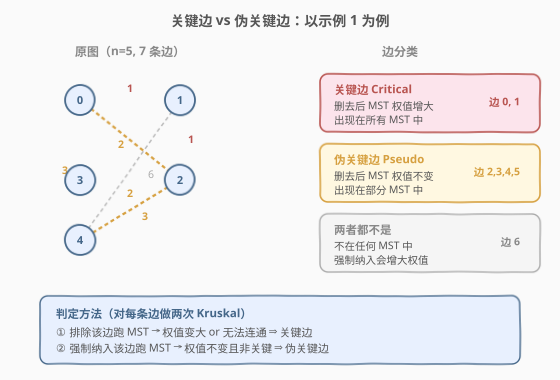
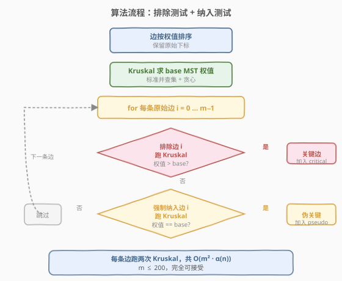
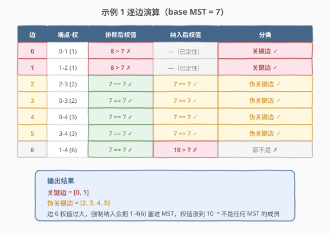

# 找到最小生成树里的关键边和伪关键边

- **题目名称**：找到最小生成树里的关键边和伪关键边
- **链接**：[1489. 找到最小生成树里的关键边和伪关键边](https://leetcode.cn/problems/find-critical-and-pseudo-critical-edges-in-minimum-spanning-tree/)
- **难度**：困难
- **标签**：图、最小生成树、Kruskal 算法、并查集

## 1. 题目概述

给定一个 `n` 个节点的带权无向连通图，节点编号 `0` 到 `n-1`，以及边数组 `edges`，其中 `edges[i] = [fromi, toi, weighti]`。**最小生成树（MST）** 是图中边的一个子集，连接所有节点且无环、权值和最小。

要求找出所有**关键边**和**伪关键边**：

- **关键边**：删去后会导致 MST 权值和增加的边——它出现在**所有** MST 中。
- **伪关键边**：可能出现在某些 MST 中但不会出现在所有 MST 中的边。

返回 `[关键边下标列表, 伪关键边下标列表]`，两个列表内顺序任意。

**示例 1**：

```text
输入：n = 5, edges = [[0,1,1],[1,2,1],[2,3,2],[0,3,2],[0,4,3],[3,4,3],[1,4,6]]
输出：[[0,1],[2,3,4,5]]
解释：边 0(0-1,1) 和边 1(1-2,1) 出现在所有 MST 中 → 关键边。
      边 2,3,4,5 出现在部分 MST 中 → 伪关键边。
      边 6(1-4,6) 权值过大，不在任何 MST 中。
```

**示例 2**：

```text
输入：n = 4, edges = [[0,1,1],[1,2,1],[2,3,1],[0,3,1]]
输出：[[],[0,1,2,3]]
解释：4 条边权值相同，任选 3 条都能组成 MST，因此 4 条都是伪关键边，没有关键边。
```

**约束条件**：

- `2 <= n <= 100`
- `1 <= edges.length <= min(200, n * (n - 1) / 2)`
- `edges[i].length == 3`
- `0 <= fromi < toi < n`
- `1 <= weighti <= 1000`
- 所有 `(fromi, toi)` 数对互不相同

---

## 2. 解题思路

### 2.1 暴力思路：枚举所有生成树？

`n` 个点的图有 $n^{n-2}$ 棵生成树（Cayley 公式），`n = 10` 时已有 $10^9$ 棵——逐一枚举判定每条边是否在「所有 / 部分」MST 中完全不可行。

> 💡 转换视角：不枚举生成树，而是**对每条边做两次 Kruskal 测试**——一次排除它、一次强制纳入它，根据 MST 权值的变化判定分类。

### 2.2 核心观察：排除测试 + 纳入测试



核心思路基于 **Kruskal 算法**（排序 + 并查集贪心选边，详见 [1584. 连接所有点的最小费用](../1501-1600/1584_连接所有点的最小费用.md)）。设 `base` 为标准 MST 权值：

| 测试 | 做法 | 判定 |
|------|------|------|
| **排除测试** | 跳过边 `i`，跑 Kruskal | 若权值 `> base` 或无法连通 → **关键边** |
| **纳入测试** | 先 `union` 边 `i` 两端，再跑 Kruskal | 若权值 `== base` 且非关键 → **伪关键边** |

> 💡 **为什么这两次测试足够？**
> - **排除后权值增大** ⇒ 这条边不可替代，必须在**每一棵** MST 中 ⇒ 关键边。
> - **排除后权值不变** ⇒ 这条边可被替代，不在所有 MST 中；**纳入后权值也不变** ⇒ 它能出现在**某些** MST 中 ⇒ 伪关键边。
> - **纳入后权值增大** ⇒ 这条边太「重」，塞进去必然拖高总权值，不在任何 MST 中 ⇒ 两者都不是。

> ⚠️ **等权边的处理**：Kruskal 中等权边的选择顺序会影响最终选哪些边，但**不会影响 MST 总权值**。因此判定只看权值是否相等，与具体选了哪条等权边无关。排序时需保留原始下标以便回传结果。

### 2.3 算法流程图



### 2.4 示例演算

以示例 1 `n = 5, edges = [[0,1,1],[1,2,1],[2,3,2],[0,3,2],[0,4,3],[3,4,3],[1,4,6]]` 为例。

**第一步**：边按权值排序（保留原始下标）：

| 排序后位置 | 原始下标 | 端点 | 权值 |
|-----------|---------|------|------|
| 0 | 0 | 0-1 | 1 |
| 1 | 1 | 1-2 | 1 |
| 2 | 2 | 2-3 | 2 |
| 3 | 3 | 0-3 | 2 |
| 4 | 4 | 0-4 | 3 |
| 5 | 5 | 3-4 | 3 |
| 6 | 6 | 1-4 | 6 |

**第二步**：标准 Kruskal 求 `base = 7`（选边 0,1,2,4：1+1+2+3=7）。

**第三步**：逐边做排除 / 纳入测试：



| 原始边 | 端点(权) | 排除后权值 | 纳入后权值 | 分类 |
|--------|---------|-----------|-----------|------|
| 0 | 0-1 (1) | 8 > 7 | — | 关键边 |
| 1 | 1-2 (1) | 8 > 7 | — | 关键边 |
| 2 | 2-3 (2) | 7 == 7 | 7 == 7 | 伪关键边 |
| 3 | 0-3 (2) | 7 == 7 | 7 == 7 | 伪关键边 |
| 4 | 0-4 (3) | 7 == 7 | 7 == 7 | 伪关键边 |
| 5 | 3-4 (3) | 7 == 7 | 7 == 7 | 伪关键边 |
| 6 | 1-4 (6) | 7 == 7 | 10 > 7 | 都不是 |

> 💡 **边 6 的特殊性**：排除它后权值不变（因为它本来就不会被选），但强制纳入后权值从 7 涨到 10——说明它太重，不属于任何 MST。这正是纳入测试的作用：区分「伪关键边」和「不在任何 MST 中的边」。

---

## 3. 参考代码

### 方法一：暴力两次 Kruskal（推荐，$O(m^2 \alpha(n))$）

### C++

```cpp
class Solution {
    int parent[101];

    void init(int n) {
        for (int i = 0; i < n; ++i) parent[i] = i;
    }
    int find(int x) {
        return parent[x] == x ? x : parent[x] = find(parent[x]);
    }
    bool unite(int x, int y) {
        int fx = find(x), fy = find(y);
        if (fx == fy) return false;
        parent[fx] = fy;
        return true;
    }

    // sortedEdges[i] = {weight, u, v, originalIndex}
    // forceInclude / forceExclude: 索引指向 sortedEdges 中的位置，-1 表示无
    int kruskal(int n, vector<array<int, 4>>& sortedEdges,
                int forceInclude, int forceExclude) {
        init(n);
        int weight = 0, count = 0;

        if (forceInclude >= 0) {
            auto& e = sortedEdges[forceInclude];
            if (unite(e[1], e[2])) {
                weight += e[0];
                count++;
            }
        }

        for (int i = 0; i < (int)sortedEdges.size(); ++i) {
            if (count == n - 1) break;
            if (i == forceInclude || i == forceExclude) continue;
            auto& e = sortedEdges[i];
            if (unite(e[1], e[2])) {
                weight += e[0];
                count++;
            }
        }
        return count == n - 1 ? weight : INT_MAX;
    }

  public:
    vector<vector<int>> findCriticalAndPseudoCriticalEdges(
        int n, vector<vector<int>>& edges) {
        int m = edges.size();
        vector<array<int, 4>> sortedEdges(m);
        for (int i = 0; i < m; ++i) {
            sortedEdges[i] = {edges[i][2], edges[i][0], edges[i][1], i};
        }
        sort(sortedEdges.begin(), sortedEdges.end());

        int base = kruskal(n, sortedEdges, -1, -1);

        vector<int> critical, pseudo;
        for (int orig = 0; orig < m; ++orig) {
            // 找原始下标 orig 在 sortedEdges 中的位置
            int si = 0;
            while (si < m && sortedEdges[si][3] != orig) ++si;

            int excluded = kruskal(n, sortedEdges, -1, si);
            if (excluded > base) {
                critical.push_back(orig);
                continue;
            }
            int included = kruskal(n, sortedEdges, si, -1);
            if (included == base) {
                pseudo.push_back(orig);
            }
        }
        return {critical, pseudo};
    }
};
```

### Python

```python
class Solution:
    def findCriticalAndPseudoCriticalEdges(
        self, n: int, edges: List[List[int]]
    ) -> List[List[int]]:
        m = len(edges)
        sorted_edges = sorted(
            [(w, u, v, i) for i, (u, v, w) in enumerate(edges)]
        )

        def kruskal(force_include: int = -1, force_exclude: int = -1) -> int:
            parent = list(range(n))

            def find(x: int) -> int:
                while parent[x] != x:
                    parent[x] = parent[parent[x]]
                    x = parent[x]
                return x

            def union(x: int, y: int) -> bool:
                fx, fy = find(x), find(y)
                if fx == fy:
                    return False
                parent[fx] = fy
                return True

            weight = 0
            count = 0

            if force_include >= 0:
                w, u, v, _ = sorted_edges[force_include]
                if union(u, v):
                    weight += w
                    count += 1

            for i, (w, u, v, _) in enumerate(sorted_edges):
                if count == n - 1:
                    break
                if i == force_include or i == force_exclude:
                    continue
                if union(u, v):
                    weight += w
                    count += 1

            return weight if count == n - 1 else float("inf")

        base = kruskal()
        critical, pseudo = [], []

        # 原始下标 → 排序后位置
        idx_map = {sorted_edges[i][3]: i for i in range(m)}

        for orig in range(m):
            si = idx_map[orig]
            if kruskal(force_exclude=si) > base:
                critical.append(orig)
                continue
            if kruskal(force_include=si) == base:
                pseudo.append(orig)

        return [critical, pseudo]
```

> 💡 **实现要点**：`kruskal` 函数用 `forceInclude` / `forceExclude` 两个参数统一了三种模式（标准 / 排除 / 纳入），避免写三份重复代码。`INT_MAX` / `float("inf")` 表示无法构成 MST（图不连通），任何与 `base` 的比较都会判定为「排除后权值增大」→ 关键边。

---

## 4. 复杂度分析

| 维度 | 复杂度 | 说明 |
|------|--------|------|
| 时间复杂度 | $O(m^2 \cdot \alpha(n))$ | 每条边跑两次 Kruskal（各 $O(m \alpha(n))$），共 $m$ 条边 |
| 空间复杂度 | $O(m + n)$ | 排序后的边数组 $O(m)$ + 并查集 `parent` 数组 $O(n)$ |

> ⚠️ 本题 $m \le 200$，$m^2 = 40000$，每次 Kruskal 约 200 步并查集操作，总计约 $8 \times 10^6$ 步——完全在时限内。$n \le 100$ 时并查集路径压缩后 $\alpha(n) \le 4$，可视为常数。

---

## 5. 扩展：基于 Kruskal 生成树结构的优化解法

暴力法对每条边独立跑两次 Kruskal，存在大量重复计算。更高效的思路是**只跑一次 Kruskal**，在过程中记录生成树结构，再利用并查集的连通信息判定：

**核心思想**：

1. 跑一次 Kruskal，记录哪些边被选入某棵 MST（权值相同的不唯一）。
2. 对每条**被选入**的边 `(u, v, w)`，检查是否存在另一条**等权边**能替代它（即删除后仍能用同权边连通 `u` 和 `v`）：
   - 不可替代 → 关键边
   - 可替代 → 伪关键边
3. 对每条**未被选入**的边 `(u, v, w)`，检查在 Kruskal 处理完所有权值 `< w` 的边后，`u` 和 `v` 是否已连通：
   - 未连通（说明该等权边能替代某条被选入的同权边）→ 伪关键边
   - 已连通 → 不在任何 MST 中

该优化将时间降到 $O(m \log m + m \cdot \alpha(n))$，但实现复杂、边界多，面试中 $m \le 200$ 用暴力法已足够清晰可靠。

> 💡 **面试建议**：先讲清暴力法的「排除 + 纳入」两次测试思路，再口述优化方向。面试官看重的是对 MST 性质的理解，而非追求常数级优化。

---

## 6. 面试要点

1. **关键边和伪关键边的定义本质是什么？**

   - 关键边 = 出现在**所有** MST 中的边（不可替代）。
   - 伪关键边 = 出现在**部分** MST 中的边（可替代但能参与）。
   - 两者都不是 = 不在任何 MST 中的边（太重）。

2. **为什么排除测试能判定关键边？**

   - 若删去边 `i` 后 MST 权值增大，说明没有等价替代——每棵 MST 都必须包含它。
   - 若删去后权值不变，说明存在替代方案——它不在所有 MST 中。

3. **为什么还需要纳入测试？**

   - 排除测试只能区分「关键」与「非关键」。非关键边中既有「能出现在某些 MST 的伪关键边」，也有「不在任何 MST 中的边」。
   - 纳入测试：强制塞入后权值不变 → 伪关键；权值增大 → 不在任何 MST。

4. **Kruskal 中等权边的顺序会影响结果吗？**

   - 不影响 MST **总权值**（这是 Kruskal 的保证），但会影响具体选了哪条等权边。
   - 本题判定只依赖权值是否相等，因此等权边顺序不影响最终分类。

5. **暴力法的时间复杂度能否通过？**

   - $O(m^2 \alpha(n))$，$m \le 200$ 时约 $8 \times 10^6$ 步，完全可行。
   - 若 $m$ 更大（如 $10^4$），需用第 5 节的单次 Kruskal + 结构分析优化到 $O(m \log m)$。

---

## 7. 同类练习题

- [1584. 连接所有点的最小费用](https://leetcode.cn/problems/min-cost-to-connect-all-points/)：标准 MST（Prim/Kruskal），本题的前置知识
- [547. 省份数量](https://leetcode.cn/problems/number-of-provinces/)：并查集模板，Kruskal 的基础组件
- [684. 冗余连接](https://leetcode.cn/problems/redundant-connection/)：并查集判环，与 Kruskal 跳过成环边同思路
- [1135. 最低成本联通所有城市](https://leetcode.cn/problems/connecting-cities-with-minimum-cost/)：标准 Kruskal 求 MST 总权值
- [743. 网络延迟时间](https://leetcode.cn/problems/network-delay-time/)：Dijkstra 单源最短路，与 Prim 骨架相似，均为贪心 + 堆选最小值
