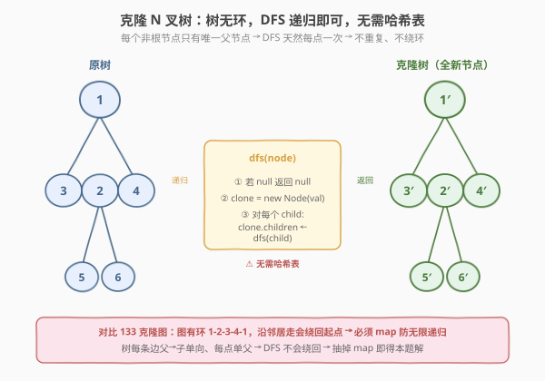
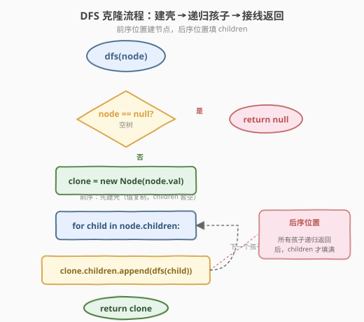
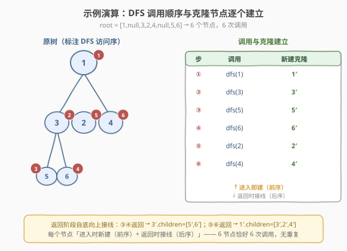

# LeetCode 克隆 N 叉树 题解

## 1. 题目概述

- **标题 / 题号**：克隆 N 叉树（#1490，medium）
- **链接**：https://leetcode.cn/problems/clone-n-ary-tree/
- **难度**：中等
- **标签**：树、N 叉树、深度优先搜索、深拷贝

**题意**：给定一棵 **N 叉树** 的根节点 `root`，返回该树的**深拷贝**（clone）。

N 叉树节点定义如下：

```cpp
class Node {
public:
    int val;
    vector<Node*> children;

    Node() {}
    Node(int _val) : val(_val) {}
    Node(int _val, vector<Node*> _children)
        : val(_val), children(_children) {}
};
```

```python
class Node:
    def __init__(self, val=None, children=None):
        self.val = val
        self.children = children if children is not None else []
```

> 💡 **深拷贝**：新建一组完全独立的节点，结构、值与原树完全相同，但内存地址全不同——对克隆树的任何修改都不影响原树。

**示例 1**：

```text
输入：root = [1,null,3,2,4,null,5,6]
输出：[1,null,3,2,4,null,5,6]

            1
         / | \
        3  2  4
       / \
      5   6
```

根 `1` 有三个孩子 `3, 2, 4`；节点 `3` 有两个孩子 `5, 6`；其余为叶。返回一棵结构、节点值与之完全相同的**全新**树（节点地址不同）。

**示例 2**：

```text
输入：root = [1,null,2]
输出：[1,null,2]

        1
        |
        2
```

根 `1` 仅有一个孩子 `2`。

**示例 3**：

```text
输入：root = []
输出：[]
解释：空树，返回 null。
```

**约束**：

- 树中节点数目范围 `[0, 10^4]`
- `0 <= Node.val <= 10^4`
- 树的深度不超过 `1000`
- 根节点的值为 `1`
- **每个节点的值互不相同**

**进阶**：你的解法能否推广到克隆任意结构的树（不限于 N 叉树）？

> 💡 本题是 [133. 克隆图](../0101-0200/133_克隆图.md) 的「树形退化版」。**树是连通无环图**——每个非根节点只有唯一的父节点，因此从根出发的 DFS 一定会**恰好访问每个节点一次**，不会重复、不会绕环。这就把克隆图里最棘手的「哈希表防环 / 防重复克隆」直接省掉了：只需 `dfs(node)` 新建节点并递归克隆 `children`，无需任何 `visited` 记录。理解「为什么树不需要 map 而图需要」是本题的灵魂。

## 2. 解题思路

### 2.1 暴力思路：按值查找逐层复制

题目特意强调「每个节点的值互不相同」并追问「能否推广到任意树」——这是在**诱导**一种基于哈希表的暴力解法：

- 用 `val` 作为键，先遍历一遍原树建一张「`val → 原节点`」的索引；
- 再遍历一遍，对每个 `val` 新建克隆节点，按父子关系把克隆节点串起来。

这个方案能过，但**完全没用到树的任何性质**——它把树当成「一堆带值的散点」处理。代价是：必须两遍遍历 + 一张 $O(n)$ 的哈希表，且**强依赖「值唯一」**这一约束；一旦值可重复（进阶追问的场景），整套方案立刻崩塌。

> ⚠️ 暴力法的浪费在于：把「父 → 子」这条天然的结构信息丢掉了，改用「值」做间接匹配。而树的父子关系本身就是一条无歧义的链路——顺着 `children` 指针走，每个节点自然只被访问一次。

### 2.2 核心观察：树无环，DFS 天然不重复



**关键洞察**：深拷贝的本质是「为每个原节点新建一个值相同的克隆节点，并复刻它们之间的连接关系」。难点永远在于——**如何避免对同一个节点重复克隆**（否则会建出多份、甚至无限递归）。

- 在 [133. 克隆图](../0101-0200/133_克隆图.md) 中，图**有环**（如 1-2-3-4-1），沿 `neighbors` 走会绕回起点，所以必须用哈希表 `map[原节点] = 克隆节点` 做「已访问」标记；
- 在 [138. 复制带随机指针的链表](../0101-0200/138_复制带随机指针的链表.md) 中，链表虽无环，但 `random` 指针可指向任意前方节点，递归克隆时会**多次需要同一个目标节点**，所以同样需要哈希表缓存。

而**树**呢？树是「连通无环图」，每条边都是父 → 子的有向边，**每个非根节点有且仅有一个父节点**。从根出发沿 `children` 递归，等价于在一棵有向无环图上做 DFS：

> 任何节点 `X` 都只会被它的**唯一父节点**在一次 `dfs(parent)` 调用中遍历到 → `dfs(X)` 只会被调用一次 → `X` 只会被克隆一次。

因此 **完全不需要哈希表**！递归 `dfs(node) = 新建节点 + 递归克隆每个 child` 即可。

> 💡 **对比三种「克隆」题的哈希表需求**：
> 
> | 题目 | 结构 | 有环/多入度？ | 需要哈希表？ | 原因 |
> |------|------|--------------|-------------|------|
> | [133 克隆图](../0101-0200/133_克隆图.md) | 无向图 | 有环 + 邻居互相引用 | ✅ 必须 | 防环导致无限递归，防同一节点被多个邻居各克隆一份 |
> | [138 复制带随机指针链表](../0101-0200/138_复制带随机指针的链表.md) | 链表 + random | random 多对一 | ✅ 必须 | 多个节点的 random 指向同一目标，需复用已建克隆 |
> | **1490 克隆 N 叉树** | 树 | 无环、单父 | ❌ 不需要 | DFS 天然每点一次，无重复访问 |

### 2.3 算法流程图



**DFS 完整步骤**（函数 `dfs(node)` 返回 `node` 子树的克隆根）：

1. **空节点**：返回 `nullptr` / `None`；
2. **新建克隆根**：`clone = new Node(node.val)`，`children` 暂为空；
3. **递归克隆每个孩子**：遍历 `node.children`，对每个 `child` 调用 `dfs(child)`，把返回的克隆子树 `append` 到 `clone.children`；
4. **返回克隆根** `clone`。

> 💡 **第 2、3 步的顺序很重要**：先建好当前克隆节点（拿到引用），再递归孩子——这样即便某个孩子的子树里出现「回指祖先」（普通树不会，但若推广到带 `parent` 指针的结构则可能），也能用哈希表挂上引用。本题无此问题，但保持「先建壳、再填孩子」的习惯，便于推广。

> ⚠️ **`children` 必须新建空列表再 `append`，不要让克隆节点共享原节点的 `children` 数组**。否则对克隆树的修改会污染原树——这就不是深拷贝了。

### 2.4 示例演算

以示例 1 的树 `root = [1,null,3,2,4,null,5,6]`（根 `1`，孩子 `3,2,4`；`3` 的孩子 `5,6`）为例，DFS 调用与克隆建立顺序：



| 步骤 | 调用 | 动作 | 当前克隆树状态 |
|------|------|------|----------------|
| ① | `dfs(1)` | 新建 `1′`，遍历孩子 `[3,2,4]` | `1′`（children 空） |
| ② | `dfs(3)` | 新建 `3′`，遍历孩子 `[5,6]` | `1′` ← 待接 `3′` |
| ③ | `dfs(5)` | 新建 `5′`，无孩子，返回 `5′` | `3′.children = [5′]` |
| ④ | `dfs(6)` | 新建 `6′`，无孩子，返回 `6′` | `3′.children = [5′,6′]` |
| ⑤ | 回到 `dfs(3)` | `3′.children` 填满，返回 `3′` | `1′.children = [3′]` |
| ⑥ | `dfs(2)` | 新建 `2′`，无孩子，返回 `2′` | `1′.children = [3′,2′]` |
| ⑦ | `dfs(4)` | 新建 `4′`，无孩子，返回 `4′` | `1′.children = [3′,2′,4′]` |
| ⑧ | 回到 `dfs(1)` | 返回 `1′` | 克隆完成 ✓ |

> 💡 **DFS 的「后序返回」特性**：每个节点的克隆是在**进入时**新建的（前序位置），但其 `children` 列表是**所有子树递归返回后**才填满的（后序位置）。本质是「自顶向下建壳、自底向上接线」——壳在前序建、边在后序连。这与 [1448. 统计二叉树中好节点的数目](../1401-1500/1448_统计二叉树中好节点的数目.md) 的「前序向下传状态」、[250. 统计同值子树](../0201-0300/250_统计同值子树.md) 的「后序向上传结论」属同一套树形遍历范式。

## 3. 参考代码

### C++

```cpp
// 1490. 克隆 N 叉树.cpp —— DFS 递归克隆，无需哈希表
class Solution {
public:
    Node* cloneTree(Node* root) {
        if (!root) return nullptr;
        Node* clone = new Node(root->val);          // 先建壳
        for (Node* child : root->children) {
            clone->children.push_back(cloneTree(child));  // 递归克隆每个孩子并接线
        }
        return clone;
    }
};
```

### Python

```python
class Solution:
    def cloneTree(self, root: 'Node') -> 'Node':
        if not root:
            return None
        clone = Node(root.val)                       # 先建壳
        clone.children = [self.cloneTree(child) for child in root.children]
        return clone
```

> 💡 两版逻辑一致：判空 → 新建克隆节点（值复制）→ 对每个孩子递归克隆、把结果塞进 `clone.children` → 返回克隆节点。Python 用列表推导一行搞定孩子拼接，C++ 用 `push_back` 循环更显式。**注意 `Node` 构造时 `children` 默认为空**，必须主动填入递归结果，不能让克隆共享原节点的 `children`。

## 4. 复杂度分析

| 维度 | 复杂度 | 说明 |
|------|--------|------|
| 时间复杂度 | $O(n)$ | 每个节点只访问一次，每次做 $O(1)$ 的建节点 + 遍历其孩子指针 |
| 空间复杂度 | $O(h)$ | 递归栈深度 = 树高 $h$；平衡时 $O(\log n)$，退化链状 $O(n)$ |
| 最坏情况 | $O(n)$ 空间 | 树退化为单链时递归深度达 $n$ |

> ⚠️ **与暴力法的对比**：暴力「按 `val` 建索引」方案需要 $O(n)$ 的额外哈希表空间，且遍历两遍；DFS 递归法只用 $O(h)$ 的递归栈空间（不计输出本身），且只遍历一遍。更重要的是，DFS 法**不依赖「值唯一」**——即使值重复也正确，因为它是按结构（指针）而非按值克隆的。这正是进阶追问的答案。

## 5. 扩展：进阶追问与迭代法

### 5.1 进阶：推广到克隆任意结构的树

题目追问「能否推广到任意树」。答案是：**本 DFS 解法已天然适用**，无需任何修改即可处理：

- **值不唯一**的树：DFS 按**指针**而非值克隆，值是否唯一无关紧要；
- **二叉树**：把 `children` 换成 `left/right` 即可（[剑指 Offer 26 / 1379. 找出克隆二叉树中的对应节点](../1301-1400/1379_找出克隆二叉树中的对应节点.md) 即此结构）；
- **带 `parent` 反向指针的树**：此时节点会被父和子的 `parent` 双向引用，**等价于图**，需要加哈希表防重复——这恰好回到 [133 克隆图](../0101-0200/133_克隆图.md) 的范式。

> 💡 **判据**：结构是否「无环且每个节点入度 ≤ 1」。是 → DFS 无需哈希表；否（有环或入度 > 1，如带 `parent`/`random`/无向边）→ 必须用哈希表 `map[原节点] = 克隆节点` 防重复。这是所有「克隆」题的统一判据。

### 5.2 迭代法（显式栈）

树极深（如 $n = 10^4$ 退化链）时递归有栈溢出风险，可用显式栈替代。N 叉树不像二叉树那样能简单「压 `(node, clone)`」前序遍历——因为 `children` 是逐个 `append` 的，需要把「未处理完的孩子迭代器」也压栈。一种简洁写法是用 BFS 层序克隆：

```python
from collections import deque

class Solution:
    def cloneTree(self, root: 'Node') -> 'Node':
        if not root:
            return None
        new_root = Node(root.val)
        queue = deque([(root, new_root)])           # (原节点, 对应克隆)
        while queue:
            orig, clone = queue.popleft()
            for child in orig.children:
                child_clone = Node(child.val)
                clone.children.append(child_clone)
                queue.append((child, child_clone))  # 记录对应关系，稍后填它的孩子
        return new_root
```

```cpp
Node* cloneTree(Node* root) {
    if (!root) return nullptr;
    Node* newRoot = new Node(root->val);
    queue<pair<Node*, Node*>> q;
    q.push({root, newRoot});
    while (!q.empty()) {
        auto [orig, clone] = q.front(); q.pop();
        for (Node* child : orig->children) {
            Node* childClone = new Node(child->val);
            clone->children.push_back(childClone);
            q.push({child, childClone});
        }
    }
    return newRoot;
}
```

> 💡 **迭代法为何可以省哈希表？** BFS/栈每弹出一个原节点时，立刻为它的每个孩子新建克隆并「成对」入队——`(child, childClone)` 的配对本身就是「这个原节点对应哪个克隆」的临时记录，无需全局哈希表。本质上把「哈希表」换成了「队列里的配对元素」，等价但更省空间（队列最多 $O(w)$ 宽度，$w$ 为树最大宽度）。这一思路同样可移植回 [133 克隆图](../0101-0200/133_克隆图.md)，但那里因有环仍需额外 `visited` 集合。

## 6. 面试要点

1. **为什么克隆树不需要哈希表，而克隆图必须用？**

   > 树是连通**无环**图，每个非根节点只有**唯一父节点**——从根出发沿 `children` 做 DFS，每个节点只会在其父节点的迭代中被访问一次，天然不重复、不绕环。图有环且邻居互相引用，沿 `neighbors` 走会绕回起点，必须用 `map[原节点]=克隆节点` 既防无限递归、又防同一节点被多个邻居各克隆一份。

2. **题目说「每个节点的值互不相同」——这个约束在你的解法里有用到吗？**

   > 没用到。DFS 解法按**指针**遍历与克隆，从不依据 `val` 查找节点，值是否唯一完全不影响正确性。题目给出这个约束是为了诱导「按 `val` 建哈希索引」的暴力方案，并借进阶追问「能否推广」考察你是否识破这一点——能识别「冗余约束」正是面试加分项。

3. **进阶：你的解法能推广到任意树吗？什么情况下会失效？**

   > 能推广到任意「无环且每点入度 ≤ 1」的树（含值重复、二叉树、多叉树）。失效场景是结构带**反向或交叉指针**——如 `parent` 指针、`random` 指针、或退化为一般图——此时一个节点会被多个来源引用，DFS 会重复克隆。修复方式就是补一张哈希表 `map[原节点]=克隆节点`，回到 [133 克隆图](../0101-0200/133_克隆图.md) 的范式。判据：**结构是否无环且入度 ≤ 1**。

4. **为什么必须新建 `children` 列表，不能直接共享原节点的 `children`？**

   > 深拷贝要求克隆树与原树**内存完全独立**。若克隆节点直接引用原节点的 `children` 数组，则对任一方的增删都会波及另一方——这是浅拷贝，不是深拷贝。正确做法是 `clone.children` 新建空列表，逐个 `append` 递归返回的克隆子树。

5. **树退化为长度 $10^4$ 的单链时递归会栈溢出吗？怎么办？**

   > 可能。Python 默认递归深度约 1000，C++ 也受栈大小限制。改用第 5.2 节的 BFS/栈迭代版，把 `(原节点, 克隆节点)` 成对入队，空间 $O(w)$（$w$ 为树最大宽度，退化链时 $w=1$）且无递归调用，可安全处理 $10^4$ 深度。也可 `sys.setrecursionlimit(20000)` 临时放宽，但迭代更稳妥。

> 💡 **一句话总结**：1490 的灵魂是「**树是无环图 → DFS 天然每点一次 → 无需哈希表**」。把 [133 克隆图](../0101-0200/133_克隆图.md) 的哈希表抽掉，剩下的就是本题的解；判据「无环且入度 ≤ 1」决定了何时能抽、何时不能抽。

## 同类练习题

| # | 题目 | 与本题的关联 |
|---|------|-------------|
| 133 | [克隆图](https://leetcode.cn/problems/clone-graph/)（[题解](../0101-0200/133_克隆图.md)） | 无向图有环 + 邻居互相引用，**必须**用哈希表 `map[原→克隆]` 防环防重复；本题是它抽掉哈希表后的退化版 |
| 138 | [复制带随机指针的链表](https://leetcode.cn/problems/copy-list-with-random-pointer/)（[题解](../0101-0200/138_复制带随机指针的链表.md)） | 链表无环但 `random` 多对一，需哈希表缓存已建克隆；与本题对比「多入度指针」是引入哈希表的根因 |
| 1379 | [找出克隆二叉树中的对应节点](https://leetcode.cn/problems/find-a-corresponding-node-of-a-binary-tree-in-a-clone-of-that-tree/)（[题解](../1301-1400/1379_找出克隆二叉树中的对应节点.md)） | 二叉树克隆 + 在克隆树中定位对应节点，结构同为本题的二叉版，强调「同构遍历同步定位」 |
| 1448 | [统计二叉树中好节点的数目](https://leetcode.cn/problems/count-good-nodes-in-binary-tree/)（[题解](../1401-1500/1448_统计二叉树中好节点的数目.md)） | 同区间树形 DFS 题，前序向下传 `pathMax`；本题则是前序建壳 + 后序接线，体会树形遍历的两种信息流向 |
| 250 | [统计同值子树](https://leetcode.cn/problems/count-univalue-subtrees/)（[题解](../0201-0300/250_统计同值子树.md)） | 后序向上传递子树结论；与本题「自底向上接线」的后序阶段同构，对照前序/后序分工 |
