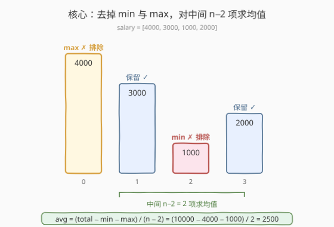
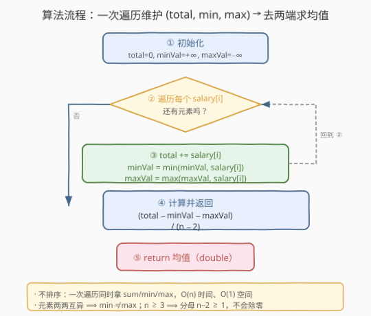

# LeetCode 去掉最低工资和最高工资后的工资平均值 题解

## 1. 题目概述

- **标题 / 题号**：去掉最低工资和最高工资后的工资平均值（#1491，easy）
- **链接**：https://leetcode.cn/problems/average-salary-excluding-the-minimum-and-maximum-salary/
- **难度**：简单
- **标签**：数组、模拟、一次遍历

**题意**：给你一个整数数组 `salary`，其中每个元素**互不相同**，`salary[i]` 表示第 `i` 名员工的工资。请你返回**去掉最低工资和最高工资以后**，剩下员工的平均工资。与实际答案误差不超过 $10^{-5}$ 的结果都被视为正确。

> ⚠️ 题目保证所有工资**两两互异**，因此最小值、最大值各只有一个，去掉「最低」与「最高」就是各删去一个元素。又因 $n \ge 3$，删去两端后至少剩 1 个元素，分母 $n - 2 \ge 1$，不会出现除零。

**示例 1**：

```text
输入：salary = [4000,3000,1000,2000]
输出：2500.00000
解释：最低 1000、最高 4000，去掉后剩 [3000,2000]，均值 (3000+2000)/2 = 2500。
```

**示例 2**：

```text
输入：salary = [1000,2000,3000]
输出：2000.00000
解释：最低 1000、最高 3000，去掉后剩 [2000]，均值 2000/1 = 2000。
```

**示例 3**：

```text
输入：salary = [6000,5000,4000,3000,2000,1000]
输出：3500.00000
解释：最低 1000、最高 6000，去掉后剩 [5000,4000,3000,2000]，均值 14000/4 = 3500。
```

**约束**：

- $3 \le \text{salary.length} \le 1000$
- $10^3 \le \text{salary}[i] \le 10^6$
- `salary` 中的所有整数**互不相同**

> 💡 **关键点**：题目只要「去掉一个最小、一个最大后的均值」，并不关心中间元素的相对顺序。所以排序是多余的——只要能在一次扫描里拿到「总和、最小、最大」三个量，就能直接算出答案。

## 2. 解题思路

### 2.1 暴力思路：先排序再去两端

最直观的做法：把 `salary` 排序，去掉首尾各一个，对中间 $n-2$ 个元素求均值。

- **正确**：排序后首元素即最小、尾元素即最大，中间 $n-2$ 个就是去掉两端后的全体。
- **低效**：排序需 $O(n \log n)$，但题目只用到「最小、最大、总和」三个标量，根本不需要把数组整体排好序——多做的排序工作是浪费。

> ⚠️ 暴力的浪费在于「**为得到两个极值而排了整个数组**」。其实极值与总和都能在一次遍历里顺手统计，无需引入排序。

### 2.2 核心观察：一次遍历维护 (total, min, max)



把「排序找两端」替换为「一次遍历同时累计三个统计量」：

$$\text{avg} = \frac{\text{total} - \min(\text{salary}) - \max(\text{salary})}{n - 2}$$

遍历时对每个 `salary[i]` 做三件事：

1. `total += salary[i]`（累加总和）；
2. `minVal = min(minVal, salary[i])`（维护最小）；
3. `maxVal = max(maxVal, salary[i])`（维护最大）。

一遍结束后，三个量都到手，代入上式即得答案。

**两个关键保证**：

- **元素互异** ⟹ `minVal` 与 `maxVal` 是两个不同元素，各被减去一次，不会多减、也不会漏减；
- **$n \ge 3$** ⟹ 分母 $n - 2 \ge 1$，没有除零风险。

> 💡 **一句话**：识别出「只需三个标量、不需要整体顺序」⟹ 把 $O(n \log n)$ 的排序压成 $O(n)$ 的一次遍历。这是「**能不求序就不排序**」的最朴素范例——凡是只需极值/总和的题，排序几乎都是过度操作。

> ⚠️ **返回类型是浮点**：C++ 中 `(total - minVal - maxVal) / (n - 2)` 两个操作数都是 `int`，会做**整除**丢精度。必须先把分子转成 `double`：`(double)(total - minVal - maxVal) / (n - 2)`。Python 的 `/` 本就是浮点除法，无此坑。

### 2.3 算法流程图



**完整步骤**：

1. **初始化** `total = 0`，`minVal = +∞`，`maxVal = −∞`；
2. **遍历** `i` 从 `0` 到 `n-1`：
   - `total += salary[i]`；
   - `minVal = min(minVal, salary[i])`；
   - `maxVal = max(maxVal, salary[i])`；
3. **返回** `(total - minVal - maxVal) / (n - 2)`（注意浮点除法）。

> 💡 也可不显式维护 `minVal/maxVal`，直接用 `*min_element` / `*max_element` / `accumulate` 三个库函数，各 $O(n)$，合计仍 $O(n)$——常数大些但更短。下文 C++ 给「单遍历版」，Python 给「库函数版」。

### 2.4 示例演算

以示例 1 的 `salary = [4000,3000,1000,2000]` 为例：

![示例演算：salary = [4000, 3000, 1000, 2000]](../images/1491_example_walkthrough.svg)

| 步 | `salary[i]` | `total` | `minVal` | `maxVal` |
|----|-------------|---------|----------|----------|
| init | — | 0 | +∞ | −∞ |
| i=0 | 4000 | 4000 | 4000 | 4000 |
| i=1 | 3000 | 7000 | 3000 | 4000 |
| i=2 | 1000 | 8000 | 1000 | 4000 |
| i=3 | 2000 | 10000 | 1000 | 4000 |

- **遍历结束**：`total = 10000`，`minVal = 1000`，`maxVal = 4000`。
- **计算**：`(10000 − 1000 − 4000) / (4 − 2) = 5000 / 2 = 2500.0` ✓。

> 以示例 2 `[1000,2000,3000]` 为例：`total=6000`、`min=1000`、`max=3000`，`(6000−1000−3000)/(3−2) = 2000/1 = 2000.0` ✓。示例 3 `[6000,5000,4000,3000,2000,1000]`：`total=21000`、`min=1000`、`max=6000`，`(21000−1000−6000)/(6−2) = 14000/4 = 3500.0` ✓。

## 3. 参考代码

### C++

```cpp
class Solution {
public:
    double average(vector<int>& salary) {
        int n = salary.size();
        int total = 0;
        int minVal = INT_MAX;
        int maxVal = INT_MIN;
        for (int s : salary) {
            total += s;
            minVal = min(minVal, s);
            maxVal = max(maxVal, s);
        }
        return (double)(total - minVal - maxVal) / (n - 2);
    }
};
```

### Python

```python
class Solution:
    def average(self, salary: List[int]) -> float:
        total = sum(salary)
        return (total - min(salary) - max(salary)) / (len(salary) - 2)
```

> 💡 **实现要点**：① C++ 单遍历版在一次循环里同时累计 `total`、维护 `minVal/maxVal`，比分别调用 `accumulate`/`min_element`/`max_element` 少两趟扫描，常数更优。② 分子必须 `(double)` 强转再除，否则整除丢精度；Python 的 `/` 天然返回浮点。③ Python 版用 `sum`/`min`/`max` 三个内置，各 $O(n)$，写法最短但共三趟扫描；若追求单趟可仿照 C++ 手写循环。

## 4. 复杂度分析

| 维度 | 一次遍历 $O(n)$（推荐） | 排序法 $O(n \log n)$ |
|------|------------------------|----------------------|
| **时间复杂度** | $O(n)$ | $O(n \log n)$ |
| **空间复杂度** | $O(1)$ | $O(\log n)$（排序栈，原地排序时） |
| **是否排序** | 否，只统计三标量 | 是，整体排好序 |
| **每元素操作** | 一次加法 + 两次比较 | 参与排序的比较 $O(\log n)$ 趟 |
| **数值溢出** | `total` 至多 $10^9$，`int` 可承载 | 同左 |

- **一次遍历**：一趟 $O(n)$ 同时拿 `total`/`minVal`/`maxVal`，再做一次减法与一次浮点除法，整体 $O(n)$；额外只用 3 个变量，空间 $O(1)$。是本题的最优解。
- **排序法**：排序 $O(n \log n)$ 主导，再去首尾求均值 $O(n)$，整体 $O(n \log n)$；$n \le 1000$ 时毫秒级通过，但为「拿两个极值而排整个数组」属于过度操作，理论劣于一次遍历。

> ⚠️ 本题 $n \le 1000$，两种方法都能过。面试中写出一次遍历版即体现对「**只需求标量就不排序**」的把握——这是把 $O(n \log n)$ 降到 $O(n)$ 的通用判断。

> 💡 **关于溢出**：$n \le 1000$、$\text{salary}[i] \le 10^6$，故 `total` 至多 $10^9$，落在 32 位 `int`（上限约 $2.1 \times 10^9$）内，安全。若范围放宽到接近 `INT_MAX`，应改用 `long long` 累加——这是大数场景下的稳健写法。

## 5. 扩展：一次遍历维护多统计量的通用范式

### 5.1 「能不求序就不排序」

只要题目只需若干**标量统计量**（最值、总和、计数等）而不依赖元素的相对顺序，排序几乎总是多余的——一次遍历就能把它们一并算出来。本题是这一判断的最朴素例子：需要 $\min$、$\max$、$\text{total}$，于是单趟维护三者即可，无需 $O(n \log n)$ 排序。

> 💡 反例：若题目要求「去掉最小的 $k$ 个和最大的 $k$ 个」($k > 1$) 且元素可能重复，单靠 $\min/\max$ 就不够了——此时需用快速选择（$O(n)$）或排序。判断「能不能避开排序」的关键是「**所需的极值个数是否常数个且元素唯一可定位**」。

### 5.2 唯一性约束的作用

题目保证 `salary` 两两互异，故 `minVal` 与 `maxVal` 必为两个不同元素，`(total − min − max)` 恰好删去这两个值各一次。若允许重复：

- 多个并列最小/最大时，「去掉最低和最高」的语义会变成「去掉一个最小元素和一个最大元素」（各一个），公式 `(total − min − max)/(n−2)` 仍然成立——因为减去的是 `min`、`max` 这两个**值**，恰对应各删一个元素；
- 但若语义改为「去掉所有等于最小/最大的元素」，公式就失效，需重新计数。本题互异约束让我们无需处理这种歧义。

### 5.3 单趟写法 vs 库函数写法

C++ 可用三个标准库算法替代手写循环：

```cpp
class Solution {
public:
    double average(vector<int>& salary) {
        int n = salary.size();
        int total = accumulate(salary.begin(), salary.end(), 0);
        int minVal = *min_element(salary.begin(), salary.end());
        int maxVal = *max_element(salary.begin(), salary.end());
        return (double)(total - minVal - maxVal) / (n - 2);
    }
};
```

> 💡 三趟 $O(n)$ 仍是 $O(n)$，但常数是手写单趟的约 3 倍。$n \le 1000$ 时无感；追求极致常数或要在数据流场景下「来一个处理一个」时，单趟版更优——它是后续「数据流求均值/中位数」类题目的基础写法。

## 6. 面试要点

1. **如何想到从 $O(n \log n)$ 优化到 $O(n)$？**

   > 观察题目所需：只要「最小、最大、总和」三个标量，并不需要中间元素的顺序。一旦识别出「排序只为拿两个极值」是过度操作，就改为一次遍历同时累计三者，从 $O(n \log n)$ 降到 $O(n)$。

2. **为什么元素互异很重要？**

   > 互异保证 `minVal` 与 `maxVal` 是两个不同元素，`(total − min − max)` 恰好删去「最低」与「最高」各一个，不会出现「一个元素同时是 min 和 max 被减两次」或「多个并列极值导致删多/删少」的歧义。配合 $n \ge 3$，分母 $n-2 \ge 1$，公式严谨。

3. **C++ 里为什么必须 `(double)` 强转？**

   > `(total - minVal - maxVal)` 与 `(n - 2)` 都是 `int`，`int / int` 做整除丢小数。先把分子转 `double` 再除，触发浮点除法。Python 的 `/` 本就返回浮点，无此坑。返回类型题目明确要求 `double`/`float`。

4. **`total` 会不会溢出？**

   > $n \le 1000$、$\text{salary}[i] \le 10^6$，`total` 至多 $10^9$，落在 32 位 `int` 内（上限约 $2.1 \times 10^9$），安全。若范围放宽到接近 `INT_MAX`，应改 `long long` 累加。面试时可主动说明这个边界判断。

5. **如果题目改成「去掉最小的 $k$ 个和最大的 $k$ 个」呢？**

   > $k = 1$ 时即本题，单趟维护 min/max 即可。$k > 1$ 且元素可能重复时，单靠极值不够，需用快速选择 `nth_element`（$O(n)$）或排序（$O(n \log n)$）定位分界点，再对中间段求和。这是「所需极值个数从常数变为变量」时解法升级的典型路径。

> 💡 **一句话总结**：1491 的灵魂是「**只需求标量就不排序**」——一次遍历同时维护 `total`/`minVal`/`maxVal`，代入 $(\text{total} - \min - \max)/(n-2)$ 即得，$O(n)$ 时间、$O(1)$ 额外空间。

## 同类练习题

| # | 题目 | 与本题的关联 |
|---|------|-------------|
| 628 | [三个数的最大乘积](https://leetcode.cn/problems/maximum-product-of-three-numbers/)（[题解](../0601-0700/628_三个数的最大乘积.md)） | 同样是「最值驱动决策」招牌题——只需数组中最大的三个与最小的两个即可定结果，单趟维护 5 个极值，与 1491「单趟维护 min/max/sum」同属「不求序只取标量」范式 |
| 414 | [第三大的数](https://leetcode.cn/problems/third-maximum-number/)（[题解](../0401-0500/414_第三大的数.md)） | 单趟维护前三大不同值，理解「一次遍历维护多个有序极值」的进阶写法，对照 1491 只需前一大（max）与后一大（min）的简化情形 |
| 747 | [至少是其他数字两倍的最大数](https://leetcode.cn/problems/largest-number-at-least-twice-of-others/)（[题解](../0701-0800/747_至少是其他数字两倍的最大数.md)） | 先求 max 再与次大比较，同款「一次遍历拿极值后做判定」的骨架，对照 1491 把极值用于「减去」而非「比较」 |
| 1431 | [拥有最多糖果的孩子](./1431_拥有最多糖果的孩子.md) | 同区间姊妹题，同属「预求一个 max 后逐元素 $O(1)$ 处理」的简单数组题，对照 1491「预求 min/max/sum 后 $O(1)$ 算均值」，体会「不变量预处理」的不同形态 |
