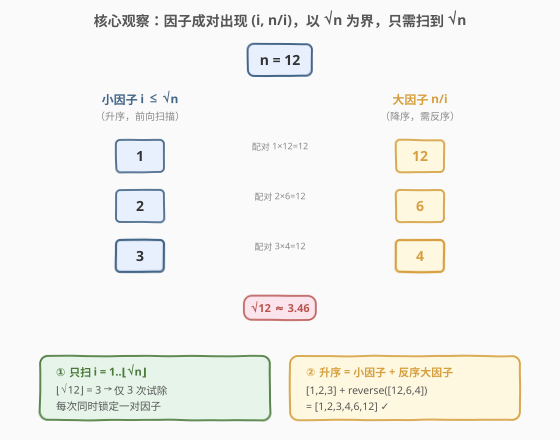
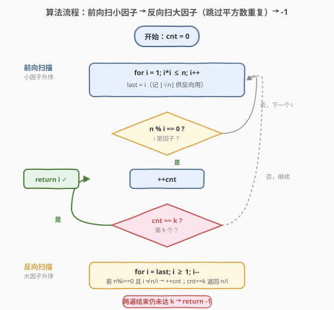
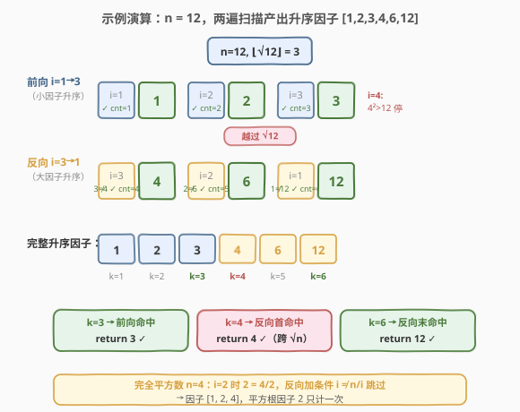

# n 的第 k 个因子

- **题目名称**：n 的第 k 个因子
- **链接**：[1492. n 的第 k 个因子](https://leetcode.cn/problems/the-kth-factor-of-n/)
- **难度**：中等
- **标签**：数学、枚举

## 1. 题目概述

给你两个正整数 `n` 和 `k`。如果整数 `i` 满足 `n % i == 0`，则称 `i` 是 `n` 的**因子**。把 `n` 的所有因子按**升序**排列，返回第 `k` 个因子；若 `n` 的因子总数少于 `k`，则返回 `-1`。

> 💡 因子总是**成对出现**的：若 `i` 整除 `n`，则 `n / i` 也整除 `n`。这一对称性是本题优化的关键。

**示例 1**：

```text
输入：n = 12, k = 3
输出：3
解释：因子列表为 [1, 2, 3, 4, 6, 12]，第 3 个是 3。
```

**示例 2**：

```text
输入：n = 7, k = 2
输出：7
解释：因子列表为 [1, 7]，第 2 个是 7。
```

**示例 3**：

```text
输入：n = 4, k = 4
输出：-1
解释：因子列表为 [1, 2, 4]，只有 3 个因子，不足 4 个。
```

**约束条件**：

- $1 \le k \le n \le 1000$

> ⚠️ **进阶要求**：能否在**小于 $O(n)$** 的时间复杂度内解决？逐个枚举 $1 \sim n$ 是 $O(n)$，需要利用因子的对称结构把扫描范围压缩到 $\sqrt{n}$。

---

## 2. 解题思路

### 2.1 暴力思路：逐个枚举 1~n

最直白的做法：从 `1` 到 `n` 依次试除，命中一个因子就计数，数到第 `k` 个即返回。若循环结束仍未数够 `k` 个，返回 `-1`。

```python
def kthFactor(n, k):
    cnt = 0
    for i in range(1, n + 1):
        if n % i == 0:
            cnt += 1
            if cnt == k:
                return i
    return -1
```

这能通过，时间 $O(n)$。但进阶要求**小于 $O(n)$**——当 $n = 1000$ 时 $O(n)$ 尚可，思路却未利用因子的任何结构。问题在于：**真的需要把 $1 \sim n$ 全扫一遍吗？**

> 💡 暴力法把每个候选数都试一遍，但实际上因子集中在 $n$ 的「前半段」与「后半段」之间存在一一对应，扫到 $\sqrt{n}$ 就能覆盖全部因子。

### 2.2 核心观察：因子成对出现，只需扫到 √n



**因子配对性**：若 `i` 整除 `n`（即 `i` 是因子），则 `n / i` 也是因子。于是因子天然分成两类，并以 $\sqrt{n}$ 为分界：

- **小因子**：$i \le \sqrt{n}$，随 `i` 从 $1$ 递增到 $\lfloor\sqrt{n}\rfloor$，**天然升序**出现；
- **大因子**：$n / i > \sqrt{n}$，是上述每个小因子 `i` 的配对项。

以 $n = 12$ 为例（$\sqrt{12} \approx 3.46$，$\lfloor\sqrt{12}\rfloor = 3$）：

| 小因子 $i$ | 配对大因子 $n/i$ | 配对 |
|-----------|-----------------|------|
| 1 | 12 | $(1, 12)$ |
| 2 | 6 | $(2, 6)$ |
| 3 | 4 | $(3, 4)$ |

**两个要点**：

1. **升序拼接**：小因子已升序；大因子按「$i$ 递增」收集时是 $12, 6, 4$（降序），故需**反序**后才是 $4, 6, 12$。完整升序列表 = 小因子 + 反序后的大因子 = $[1,2,3] + [4,6,12]$。

2. **完全平方数去重**：当 $n$ 是完全平方数（如 $n=4$），$i = \sqrt{n}$ 时 $i = n/i$，该因子只算**一次**，不能在小、大两段重复计数。

> 💡 **为何扫描范围减半**：每个 $i \le \sqrt{n}$ 一次试除，就能同时确定 $i$ 与 $n/i$ 两个因子（或一个，当 $i = \sqrt{n}$）。因此只需遍历 $1 \sim \lfloor\sqrt{n}\rfloor$，因子总数却被完整覆盖——时间从 $O(n)$ 降到 $O(\sqrt{n})$。这与 [50. Pow(x, n)](../0001-0100/50_Powx_n.md) 的「折半」、[204. 计数质数](../0201-0300/204_计数质数.md) 的「只筛到 $\sqrt{n}$」同属「**用对称性折叠搜索空间**」的数论套路。

### 2.3 算法流程图



采用**两遍扫描、原地计数**（不存储因子列表，$O(1)$ 空间）：

1. **前向扫描**（小因子，升序）：`i` 从 $1$ 到 $\lfloor\sqrt{n}\rfloor$，凡 `n % i == 0` 就 `cnt++`，若 `cnt == k` 直接返回 `i`。
2. **反向扫描**（大因子，升序）：`i` 从 $\lfloor\sqrt{n}\rfloor$ 递减到 $1$，凡 `n % i == 0` 且 `i != n/i`（跳过完全平方数的重复）就 `cnt++`，若 `cnt == k` 返回 `n / i`。
3. 两遍结束仍未达 `k`，返回 `-1`。

> 💡 **为何反向扫描得到的是升序？** 前向时大因子按 $i$ 递增收集为降序（$n/i$ 随 $i$ 增大而减小）；反向遍历 $i$ 即让 $n/i$ 从小到大出现，正好是升序。这一步无需真正 `reverse` 数组——靠「遍历方向」就把顺序排好了，省下 $O(\sqrt{n})$ 空间。

### 2.4 示例演算



以 $n = 12$、$\lfloor\sqrt{12}\rfloor = 3$ 为例，演示两遍扫描如何依次产出升序因子：

**前向扫描**（$i = 1 \to 3$，收集小因子）：

| 步骤 | `i` | `12 % i` | 命中？ | `cnt` | 产出因子 | 说明 |
|------|-----|----------|--------|-------|----------|------|
| 1 | 1 | 0 | ✓ | 1 | **1** | 最小因子 |
| 2 | 2 | 0 | ✓ | 2 | **2** | |
| 3 | 3 | 0 | ✓ | 3 | **3** | 小因子段结束（$i=4$ 时 $4^2>12$，越界） |

**反向扫描**（$i = 3 \to 1$，收集大因子 $n/i$，升序）：

| 步骤 | `i` | `12 % i` | `i == 12/i`？ | `cnt` | 产出因子 $n/i$ | 说明 |
|------|-----|----------|---------------|-------|----------------|------|
| 4 | 3 | 0 | $3 \ne 4$ | 4 | **4** | 大因子最小者 |
| 5 | 2 | 0 | $2 \ne 6$ | 5 | **6** | |
| 6 | 1 | 0 | $1 \ne 12$ | 6 | **12** | 最大因子 |

完整升序因子序列：$[1, 2, 3, 4, 6, 12]$，共 $6$ 个。

- `k = 3` → 前向第 3 步命中，返回 `3` ✓
- `k = 4` → 反向第 1 步命中，返回 `4` ✓（首个大因子，恰好跨过分界）
- `k = 6` → 反向第 3 步命中，返回 `12` ✓
- `k = 7` → 两遍结束 `cnt = 6 < 7`，返回 `-1` ✓

> 💡 **观察 `k` 与因子总数的落点**：前向扫描产出的因子数 $= \lfloor\sqrt{n}\rfloor$ 范围内的因子个数。若 `k` 落在前向段，直接在 $O(\sqrt{n})$ 内返回；否则进入反向段。无论哪段，最坏都遍历 $2\lfloor\sqrt{n}\rfloor$ 步。

再以完全平方数 $n = 4$、$\lfloor\sqrt{4}\rfloor = 2$ 验证去重：

| 步骤 | `i` | 命中？ | 去重判断 | `cnt` | 产出因子 |
|------|-----|--------|----------|-------|----------|
| 1 | 1 | ✓ | —（前向） | 1 | 1 |
| 2 | 2 | ✓ | —（前向） | 2 | 2 |
| 3 | 2 | ✓ | $2 = 4/2$，**跳过** | 2 | — |
| 4 | 1 | ✓ | $1 \ne 4$ | 3 | 4 |

因子序列 $[1, 2, 4]$，$\sqrt{4}=2$ 这个因子只在前向段算了一次 ✓。

---

## 3. 参考代码

### C++

```cpp
class Solution {
  public:
    int kthFactor(int n, int k) {
        int cnt = 0;
        int last = 0;
        for (int i = 1; (long long)i * i <= n; ++i) {
            last = i;
            if (n % i == 0) {
                ++cnt;
                if (cnt == k) return i;
            }
        }
        for (int i = last; i >= 1; --i) {
            if (n % i == 0 && i != n / i) {
                ++cnt;
                if (cnt == k) return n / i;
            }
        }
        return -1;
    }
};
```

### Python

```python
import math


class Solution:
    def kthFactor(self, n: int, k: int) -> int:
        cnt = 0
        isqrt = math.isqrt(n)
        for i in range(1, isqrt + 1):
            if n % i == 0:
                cnt += 1
                if cnt == k:
                    return i
        for i in range(isqrt, 0, -1):
            if n % i == 0 and i != n // i:
                cnt += 1
                if cnt == k:
                    return n // i
        return -1
```

> 💡 **实现细节**：
> - **C++ 用 `i * i <= n` 而非 `std::sqrt`**：避免浮点精度问题，且无需引入 `<cmath>`。用 `(long long)i * i` 防止大 `i` 时乘法溢出（本题 $n \le 1000$ 实际 `int` 足够，但写成 `long long` 是通用安全习惯）。前向循环顺便记下 `last = i`（即 $\lfloor\sqrt{n}\rfloor$），供反向循环复用，无需单独算平方根。
> - **Python 用 `math.isqrt`**：返回**精确**的整数平方根（Python 3.8+），无浮点误差，比 `int(n ** 0.5)` 更可靠。
> - **去重条件 `i != n / i`**：仅写在反向循环。前向循环里 $i \le \sqrt{n}$，即便 $i = \sqrt{n}$（完全平方数）也照常计入一次；反向循环遇到同一个 $i$ 时用此条件跳过，保证完全平方根因子只算一次。
> - **两版逻辑完全对称**：前向收小因子（升序），反向收大因子（靠遍历方向天然升序），全程只维护一个计数器 `cnt`，$O(1)$ 额外空间。

---

## 4. 复杂度分析

| 维度 | 复杂度 | 说明 |
|------|--------|------|
| 时间复杂度 | $O(\sqrt{n})$ | 前向遍历 $1 \sim \lfloor\sqrt{n}\rfloor$，反向再遍历同范围，共约 $2\sqrt{n}$ 次试除。$n = 1000$ 时约 $60$ 次，远优于暴力的 $1000$ 次，满足「小于 $O(n)$」的进阶要求 |
| 空间复杂度 | $O(1)$ | 仅 `cnt`、`i`、`last` 三个变量，不存储因子列表 |

> 💡 **为何是 $\sqrt{n}$ 而非 $n$**：因子配对性保证每个 $i \le \sqrt{n}$ 一次试除就锁定一对因子 $(i, n/i)$，搜索空间被「对称折叠」了一半——从 $[1, n]$ 压缩到 $[1, \sqrt{n}]$。这是数论题里反复出现的降维手段：判定质数只需试到 $\sqrt{n}$、[204. 计数质数](../0201-0300/204_计数质数.md) 的埃氏筛只划到 $\sqrt{n}$、[367. 有效的完全平方数](https://leetcode.cn/problems/valid-perfect-square/) 也靠 $\sqrt{n}$ 截断。

> ⚠️ **完全平方数不影响复杂度**：去重只是一个 `i != n/i` 的 $O(1)$ 判断，不改变遍历次数；因子总数 $d(n)$（约数个数）上界为 $O(n^{1/3})$ 量级，远小于 $\sqrt{n}$，故「计数」本身不构成瓶颈，瓶颈只在「遍历候选 $i$」。

---

## 5. 扩展：因子总数与质因数分解

本题只需找出第 $k$ 个因子，无需知道因子总数。但若问题升级为「$n$ 的因子总数是多少」，可以借助**质因数分解**做到更高效：

若 $n = p_1^{e_1} p_2^{e_2} \cdots p_m^{e_m}$（$p_i$ 为不同质数），则约数个数函数

$$d(n) = \prod_{i=1}^{m} (e_i + 1)$$

每个质因子的幂次 $e_i$ 可取 $0 \sim e_i$ 共 $e_i + 1$ 种选择，乘法原理即得上式。例如 $12 = 2^2 \times 3^1$，$d(12) = (2+1)(1+1) = 6$，与因子列表 $[1,2,3,4,6,12]$ 的长度一致。

> 💡 **与本题的关系**：本题两遍扫描的时间是 $O(\sqrt{n})$，与「试除法做质因数分解」的复杂度同级。若要**枚举全部因子**而非只取第 $k$ 个，$O(\sqrt{n})$ 配对法依然是最优做法（产出 $d(n)$ 个因子，但 $d(n) = O(n^\epsilon)$ 远小于 $\sqrt{n}$，遍历开销主导）。

---

## 6. 面试要点

1. **为什么只需扫描到 $\sqrt{n}$？**

   > 因子成对出现：若 $i$ 整除 $n$，则 $n/i$ 也整除 $n$，且二者以 $\sqrt{n}$ 为分界（一个 $\le \sqrt{n}$、一个 $> \sqrt{n}$，或相等）。所以遍历 $i = 1 \sim \lfloor\sqrt{n}\rfloor$ 就能通过配对覆盖全部因子，把 $O(n)$ 降到 $O(\sqrt{n})$。

2. **反向扫描为什么能得到升序的大因子？**

   > 前向遍历 $i$ 递增时，大因子 $n/i$ 递减（收集到的是降序）；反向遍历 $i$ 递减时，$n/i$ 递增——正好是升序。所以无需真正 `reverse` 数组，靠「遍历方向」就排好序，省下 $O(\sqrt{n})$ 空间，实现 $O(1)$ 额外空间。

3. **完全平方数为什么要去重？怎么去？**

   > 当 $n$ 是完全平方数（如 $n=4$，$\sqrt{n}=2$），$i = \sqrt{n}$ 时 $i = n/i$，同一个因子在前向、反向两段都会被命中，会被算两次。去重方法：反向循环加条件 `i != n/i`，遇到 $i = n/i$ 就跳过，保证只计一次。前向循环照常计入一次即可。

4. **时间复杂度是多少？满足进阶要求吗？**

   > $O(\sqrt{n})$ 时间、$O(1)$ 空间。两遍遍历各 $\lfloor\sqrt{n}\rfloor$ 步，共约 $2\sqrt{n}$ 次试除。$n = 1000$ 时约 $60$ 次，严格小于 $O(n) = 1000$，满足进阶的「小于 $O(n)$」要求。

5. **C++ 里用 `i * i <= n` 还是 `std::sqrt(n)`？**

   > 推荐 `i * i <= n`：避免浮点 `sqrt` 的精度误差（大 $n$ 时 `int(sqrt(n))` 可能差 1），也无需引入 `<cmath>`。注意写成 `(long long)i * i` 防止乘法溢出。Python 则用 `math.isqrt` 获得精确整数平方根，比 `int(n**0.5)` 可靠。

6. **如果 `k` 大于因子总数，何时能提前判定？**

   > 本题最坏需两遍都跑完才知道 `cnt < k`。若预先用质因数分解算出 $d(n) = \prod(e_i+1)$，可在 $O(\sqrt{n})$ 分解后立即比较 $k$ 与 $d(n)$，若 $k > d(n)$ 直接返回 `-1`，省去反向扫描。但分解本身也是 $O(\sqrt{n})$，渐近复杂度不变，仅常数优化。

> 💡 **一句话总结**：1492 的核心是「因子配对性」——以 $\sqrt{n}$ 为界，小因子升序、大因子靠反向遍历天然升序，两遍 $O(\sqrt{n})$ 扫描 + $O(1)$ 空间即可定位第 $k$ 个因子，完全平方数用 `i != n/i` 去重。这是数论题「用对称性折叠搜索空间」的标准套路。

---

## 7. 同类练习题

- [507. 完美数](https://leetcode.cn/problems/perfect-number/)：判断 $n$ 是否等于其**真因子之和**。同样只需枚举到 $\sqrt{n}$ 收集配对因子求和，是「因子配对 + $\sqrt{n}$ 截断」的直接应用，本题的姊妹题
- [367. 有效的完全平方数](https://leetcode.cn/problems/valid-perfect-square/)：判断 $n$ 是否为完全平方数。靠 $i \cdot i \le n$ 的遍历与 $\sqrt{n}$ 截断，与本题判定「$i = n/i$ 去重」的边界情形同源
- [204. 计数质数](https://leetcode.cn/problems/count-primes/)（[题解](../0201-0300/204_计数质数.md)）：埃氏筛只划到 $\sqrt{n}$ 即可标记所有合数。同为「用 $\sqrt{n}$ 对称性折叠搜索空间」的数论题，可对比「试除判因子」与「筛法标合数」两种 $\sqrt{n}$ 用法
- [50. Pow(x, n)](https://leetcode.cn/problems/powx-n/)（[题解](../0001-0100/50_Powx_n.md)）：快速幂用「折半」把 $O(n)$ 降到 $O(\log n)$。与本题「$\sqrt{n}$ 折叠」同属「用数学结构把线性搜索降维」的思想，可对比「指数折半」与「因子对折」
