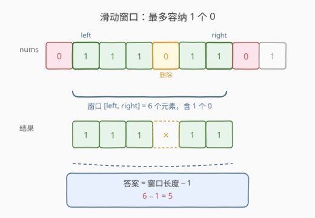
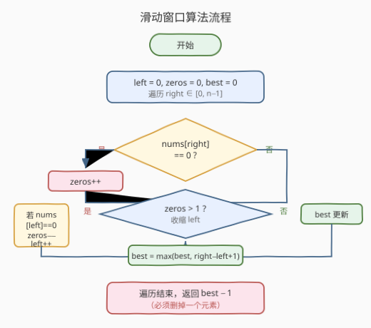
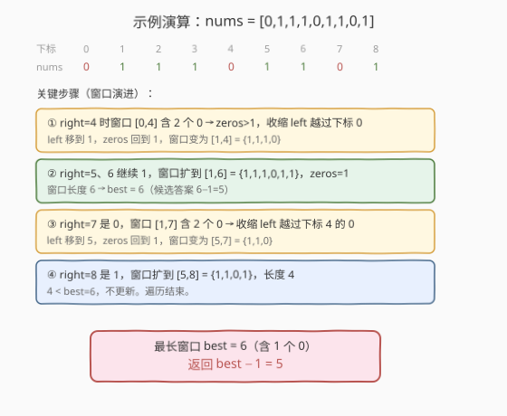

# 删掉一个元素以后全为 1 的最长子数组

- **题目名称**：删掉一个元素以后全为 1 的最长子数组
- **链接**：[1493. 删掉一个元素以后全为 1 的最长子数组](https://leetcode.cn/problems/longest-subarray-of-1s-after-deleting-one-element/)
- **难度**：中等
- **标签**：数组、滑动窗口、双指针

## 1. 题目概述

给你一个二进制数组 `nums`，你需要从中**删掉一个元素**，返回删掉一个元素后**全为 1 的最长非空子数组**的长度。如果不存在这样的子数组，返回 `0`。

> ⚠️ **注意**：无论数组是否全为 1，都**必须删掉恰好一个元素**。

**示例 1**：

```text
输入：nums = [1,1,0,1]
输出：3
解释：删掉下标 2 的 0 后得到 [1,1,1]，全 1 子数组长度为 3。
```

**示例 2**：

```text
输入：nums = [0,1,1,1,0,1,1,0,1]
输出：5
解释：删掉下标 4 的 0 后得到 [0,1,1,1,1,1,0,1]，全 1 子数组 [1,1,1,1,1] 长度为 5。
```

**示例 3**：

```text
输入：nums = [1,1,1]
输出：2
解释：必须删掉一个元素，删任意一个 1 后得到 [1,1]，长度为 2。
```

**约束条件**：

- `1 <= nums.length <= 10^5`
- `nums[i]` 为 `0` 或 `1`

---

## 2. 解题思路

### 2.1 暴力思路

枚举「删除哪一个元素」，对每次删除后的数组再扫描一遍最长连续 1。时间复杂度 `O(n^2)`，`n` 高达 `10^5` 会超时。

### 2.2 核心观察：滑动窗口（最多容纳 1 个 0）



把问题换个角度：**要找一个最长的窗口，使得窗口内最多包含 1 个 0**——这个 0 就是被删掉的那个元素。窗口里其余全是 1，删掉那唯一一个 0 之后，剩下的全 1 段长度就是「窗口长度 − 1」。

> 💡 **关键转化**：题目说「必须删一个元素」，而滑动窗口维护「最多 1 个 0」的窗口。无论窗口里有 0 个还是 1 个 0，最终答案都是 `窗口长度 − 1`：
> - 窗口里有 1 个 0：删掉它，剩下 `长度 − 1` 个 1。
> - 窗口里 0 个 0（全 1）：仍然要删一个，剩 `长度 − 1` 个 1。

这正好统一了示例 3（全 1）和示例 1/2（含 0）的情况，无需特判。

### 2.3 算法流程图



用双指针 `left`、`right` 维护窗口，并用 `zeros` 记录当前窗口内 0 的个数：

1. `right` 每右移一步，若 `nums[right] == 0` 则 `zeros++`。
2. 当 `zeros > 1` 时，不断右移 `left` 收缩窗口；若 `nums[left] == 0` 则 `zeros--`，直到 `zeros <= 1`。
3. 用当前窗口长度 `right - left + 1` 更新 `best`。
4. 遍历结束后返回 `best - 1`。

### 2.4 示例演算



以 `nums = [0,1,1,1,0,1,1,0,1]` 为例，窗口在含 0 的位置触发收缩，最终最长窗口为 `[1,6]`（长度 6，含 1 个 0），返回 `6 - 1 = 5`。

---

## 3. 参考代码

### C++

```cpp
class Solution {
  public:
    int longestSubarray(vector<int>& nums) {
        int n = nums.size();
        int left = 0, zeros = 0, best = 0;
        for (int right = 0; right < n; right++) {
            if (nums[right] == 0) zeros++;
            while (zeros > 1) {
                if (nums[left] == 0) zeros--;
                left++;
            }
            best = max(best, right - left + 1);
        }
        return best - 1;
    }
};
```

### Python

```python
class Solution:
    def longestSubarray(self, nums: List[int]) -> int:
        left = zeros = best = 0
        for right, x in enumerate(nums):
            if x == 0:
                zeros += 1
            while zeros > 1:
                if nums[left] == 0:
                    zeros -= 1
                left += 1
            best = max(best, right - left + 1)
        return best - 1
```

---

## 4. 复杂度分析

| 维度 | 复杂度 | 说明 |
|------|--------|------|
| 时间复杂度 | O(n) | `right`、`left` 各至多遍历数组一次，均摊每次 O(1) |
| 空间复杂度 | O(1) | 仅用 `left`/`zeros`/`best` 等常数变量 |

---

## 5. 扩展：与「至多 K 个 0」的统一模板

本题是 **「1004. 最大连续 1 的个数 III」**的特例——那题允许把 `k` 个 0 翻成 1（窗口内最多 `k` 个 0），且**不强制删除**，答案直接取窗口长度。把模板里 `zeros > 1` 换成 `zeros > k`，并把返回值从 `best - 1` 改成 `best` 即可套用。

> ⚠️ **区别要点**：1004 是「翻转」(允许保留 0 的位置，答案=窗口长度)；1493 是「删除」(必须少一个元素，答案=窗口长度−1)。后者即便全 1 也要 −1，这是两题唯一的形上差异。

---

## 6. 面试要点

1. **为什么要返回 `best - 1` 而不是 `best`？**
   - 题目要求**必须删掉一个元素**。窗口里那个 0（或全 1 时任意一个 1）就是被删的，所以有效全 1 长度比窗口少 1。

2. **全 1 数组怎么处理？需要特判吗？**
   - 不需要。窗口会扩到整个数组（`zeros` 始终为 0，不触发收缩），`best = n`，返回 `n - 1`，正好符合「必须删一个」。

3. **`while zeros > 1` 收缩为什么是对的？**
   - 窗口里出现第 2 个 0 时，不可能再通过删一个元素得到全 1 段，必须把最左边的 0 连同左侧元素一起移出窗口，恢复「至多 1 个 0」的不变式。

4. **能改成「至多 K 个 0」的通解吗？**
   - 可以，把 `zeros > 1` 改成 `zeros > k`，返回值视题意决定是否 `−1`。这是滑动窗口「可变长 + 配额」模板。

---

## 7. 同类练习题

- [1004. 最大连续 1 的个数 III](https://leetcode.cn/problems/max-consecutive-ones-iii/)：本题的泛化版，窗口内至多 `k` 个 0，不强制删除，答案=窗口长度。
- [485. 最大连续 1 的个数](https://leetcode.cn/problems/max-consecutive-ones/)：不允许删/翻，最朴素的连续 1 计数，作为本题的退化基线。
- [487. 最大连续 1 的个数 II](https://leetcode.cn/problems/max-consecutive-ones-ii/)：允许翻转至多 1 个 0（即 `k=1` 版的 1004），与本题窗口口径相同但无需强制删除。
- [209. 长度最小的子数组](https://leetcode.cn/problems/minimum-size-subarray-sum/)：同类「配额 + 双指针收缩」滑动窗口模板。
