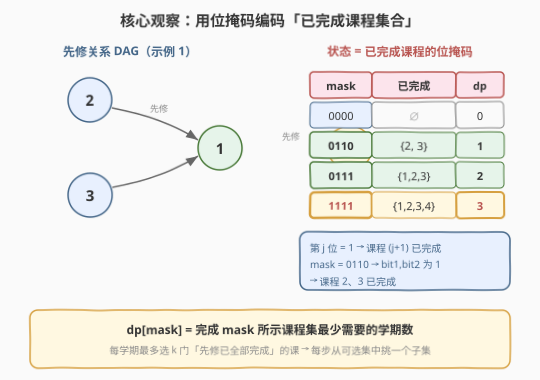
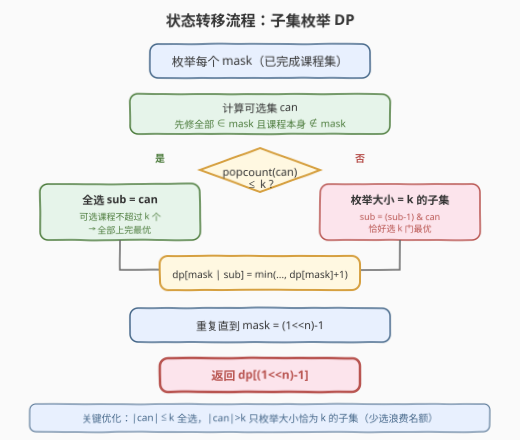
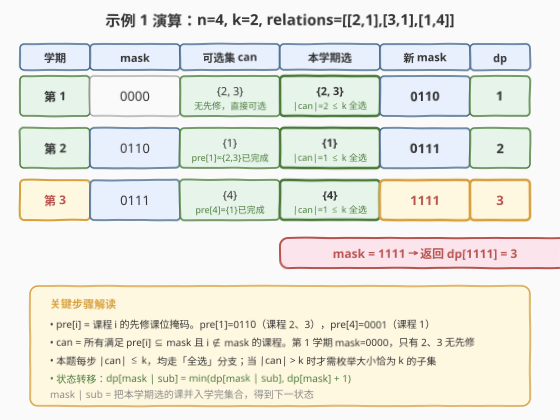

# LeetCode 并行课程 II 题解

## 1. 题目概述

- **标题 / 题号**：并行课程 II（#1494，hard）
- **链接**：https://leetcode.cn/problems/parallel-courses-ii/
- **难度**：困难
- **标签**：位运算、动态规划、状态压缩、图

**题意**：给你一个整数 `n` 表示某所大学里课程的数目，编号为 `1` 到 `n`。数组 `relations` 中 `relations[i] = [xi, yi]` 表示课程 `xi` 必须在课程 `yi` **之前**上。同时你还有一个整数 `k`。

在一个学期中，你**最多**可以同时上 `k` 门课，前提是这些课的先修课在之前的学期里已经上过了。请你返回上完所有课最少需要多少个学期。题目保证一定存在一种上完所有课的方式（先修关系图是 DAG）。

**示例 1**：

```text
输入：n = 4, relations = [[2,1],[3,1],[1,4]], k = 2
输出：3
解释：上图展示了题目输入的图。在第一个学期中，我们可以上课程 2 和课程 3。
      然后第二个学期上课程 1，第三个学期上课程 4。
```

**示例 2**：

```text
输入：n = 5, relations = [[2,1],[3,1],[4,1],[1,5]], k = 2
输出：4
解释：一个最优方案是：第一学期上课程 2 和 3，第二学期上课程 4，
      第三学期上课程 1，第四学期上课程 5。
```

**示例 3**：

```text
输入：n = 11, relations = [], k = 2
输出：6
解释：没有先修约束，每学期最多上 2 门，⌈11/2⌉ = 6。
```

**约束**：

- `1 <= n <= 15`
- `1 <= k <= n`
- `0 <= relations.length <= n * (n-1) / 2`
- 所有先修关系都是不同的，图是一个有向无环图

> ⚠️ **关键信号**：`n ≤ 15` 是**状压 DP（bitmask DP）**的标志性数据范围——$2^{15} = 32768$ 个状态，恰好落在「可以枚举所有子集」的甜区。本题是**带优先约束的单元任务调度**，已被证明是 NP-hard 问题，`n ≤ 15` 的数据范围正是为指数级状压 DP 而设。

## 2. 解题思路

### 2.1 暴力思路：贪心为什么不行？

一个自然的贪心想法是：每学期**尽可能多**地上「当前可上的课」（先修已全部完成的课），凑满 `k` 门。

但贪心的致命问题是：当可选课程**多于 `k`** 时，**选哪 `k` 门**会直接影响后续学期能解锁什么。不同的选择可能导致不同的总学期数，没有任何简单的贪心策略（如「选依赖最多的」「选解锁最多的」）能保证全局最优。

> ⚠️ 本题本质是 **NP-hard** 的调度问题（$P_m \mid prec, p_j=1 \mid C_{max}$），无法用多项式贪心求解。`n ≤ 15` 的约束指向**指数级状压 DP**。

### 2.2 核心观察：用位掩码记录「已完成的课程集合」



在任意中间时刻，我们只需要知道一件事：**哪些课程已经上完了**。因为「已完成的课程集合」唯一决定了「当前可选的课程集合」——所有先修都在已完成集合里、且自身尚未完成的课程，就是本学期可选的。

用一个 `n` 位的二进制整数 `mask` 作为状态：

- `mask` 的第 `j` 位（`0`-indexed）为 `1`，表示课程 `j+1` **已完成**；
- 已完成课程数 = `popcount(mask)`；
- `mask = 0`：什么都没上；`mask = (1<<n)-1`：全部上完。

定义 `dp[mask]` = 完成 `mask` 所示课程集合**最少需要的学期数**。

- **初始**：`dp[0] = 0`（空集，0 学期）。
- **答案**：`dp[(1 << n) - 1]`（全部完成）。

### 2.3 状态转移：子集枚举



对每个状态 `mask`，转移分三步：

**第一步：计算可选集 `can`。**

逐个检查课程 `i`（`1` 到 `n`）：若 `i` 不在 `mask` 中，且 `i` 的先修课掩码 `pre[i]` 是 `mask` 的子集（即 `(pre[i] & mask) == pre[i]`），则 `i` 可选，加入 `can`。

> 💡 **预处理**：对每个课程 `i`，先修掩码 `pre[i] = OR{ 1 << (x-1) | [x,i] ∈ relations }`。例如示例 1 中 `pre[1] = 0110`（课程 2、3 是 1 的先修），`pre[4] = 0001`（课程 1 是 4 的先修）。

**第二步：枚举本学期选的子集 `sub`。**

从 `can` 中挑一个**大小不超过 `k`** 的非空子集 `sub` 作为本学期要上的课。这里有一个**关键优化**：

| `popcount(can)` 情况 | 本学期选什么 | 原因 |
|------|------|------|
| `≤ k` | **全选** `sub = can` | 名额够用，多上一门只会更早解锁后续课程，不会更差 |
| `> k` | 枚举大小**恰好为 `k`** 的子集 | 名额不够，但少选会浪费名额；恰好选满 `k` 一定最优（见 5.2 证明） |

> 💡 **为什么恰好选 `k` 最优？** 若某最优解本学期只选了 `m < k` 门，则 `can` 中还有课被推迟。把其中一门 `c` 提到本学期（名额有空），不影响其他课的合法性，且 `c` 的依赖者可能提前解锁——新方案不会更差。故存在「恰好选 `k`」的最优解。

**第三步：更新 DP。**

$$dp[\text{mask} \mid \text{sub}] = \min\big(dp[\text{mask} \mid \text{sub}],\; dp[\text{mask}] + 1\big)$$

其中 `mask | sub` 表示把本学期选的课并入学完集合，得到下一状态。

**子集枚举技巧**：用 `sub = (sub - 1) & can` 遍历 `can` 的所有非空子集（从 `can` 本身开始递减）。这是位运算枚举子集的标准写法，复杂度为 $O(2^{|\text{can}|})$。

### 2.4 示例演算



以示例 1 为例：`n=4, relations=[[2,1],[3,1],[1,4]], k=2`。

- 先修掩码：`pre[1]=0110, pre[2]=0, pre[3]=0, pre[4]=0001`
- **第 1 学期**：`mask=0000`，`can={2,3}`（课程 2、3 无先修），`|can|=2 ≤ k=2`，全选 → `mask=0110`，`dp=1`
- **第 2 学期**：`mask=0110`，`can={1}`（`pre[1]={2,3} ⊆ mask`），`|can|=1 ≤ k`，全选 → `mask=0111`，`dp=2`
- **第 3 学期**：`mask=0111`，`can={4}`（`pre[4]={1} ⊆ mask`），`|can|=1 ≤ k`，全选 → `mask=1111`，`dp=3`

返回 `dp[1111] = 3`。

> 💡 本例每步 `|can| ≤ k`，均走「全选」分支。当无先修约束且 `n > k` 时（如示例 3），`|can|` 会远大于 `k`，需要枚举大小恰为 `k` 的子集，此时子集枚举技巧就发挥作用了。

## 3. 参考代码

### C++

```cpp
class Solution {
  public:
    int minNumberOfSemesters(int n, vector<vector<int>>& relations, int k) {
        vector<int> pre(n + 1, 0);
        for (auto& r : relations) {
            pre[r[1]] |= 1 << (r[0] - 1);
        }
        int full = (1 << n) - 1;
        vector<int> dp(1 << n, INT_MAX);
        dp[0] = 0;
        for (int mask = 0; mask <= full; ++mask) {
            if (dp[mask] == INT_MAX) continue;
            int can = 0;
            for (int i = 1; i <= n; ++i) {
                int bit = 1 << (i - 1);
                if ((mask & bit) == 0 && (pre[i] & mask) == pre[i]) {
                    can |= bit;
                }
            }
            if (can == 0) continue;
            if (__builtin_popcount(can) <= k) {
                dp[mask | can] = min(dp[mask | can], dp[mask] + 1);
            } else {
                for (int sub = can; sub; sub = (sub - 1) & can) {
                    if (__builtin_popcount(sub) == k) {
                        dp[mask | sub] = min(dp[mask | sub], dp[mask] + 1);
                    }
                }
            }
        }
        return dp[full];
    }
};
```

### Python

```python
class Solution:
    def minNumberOfSemesters(self, n: int, relations: List[List[int]], k: int) -> int:
        pre = [0] * (n + 1)
        for x, y in relations:
            pre[y] |= 1 << (x - 1)
        full = (1 << n) - 1
        dp = [float('inf')] * (1 << n)
        dp[0] = 0
        for mask in range(1 << n):
            if dp[mask] == float('inf'):
                continue
            can = 0
            for i in range(1, n + 1):
                bit = 1 << (i - 1)
                if not (mask & bit) and (pre[i] & mask) == pre[i]:
                    can |= bit
            if can == 0:
                continue
            if can.bit_count() <= k:
                dp[mask | can] = min(dp[mask | can], dp[mask] + 1)
            else:
                sub = can
                while sub:
                    if sub.bit_count() == k:
                        dp[mask | sub] = min(dp[mask | sub], dp[mask] + 1)
                    sub = (sub - 1) & can
        return dp[full]
```

> 💡 **实现要点**：
> - `pre[r[1]] |= 1 << (r[0] - 1)`：把先修课编码进掩码，注意课程 1-indexed 而位 0-indexed，需 `-1`。
> - `(pre[i] & mask) == pre[i]`：判断先修是否全部完成（子集关系），等价于 `pre[i]` 是 `mask` 的子集。
> - `sub = (sub - 1) & can`：标准子集枚举递推，从 `can` 开始遍历所有非空子集。
> - `__builtin_popcount` / `int.bit_count()`：CPU 单指令 popcount，比手写循环更快。

## 4. 复杂度分析

| 维度 | 复杂度 | 说明 |
|------|--------|------|
| 时间复杂度 | $O(3^n)$ | 共 $2^n$ 个状态，每个状态枚举 `can` 的子集。由恒等式 $\sum_{j=0}^{n} \binom{n}{j} 2^{n-j} = 3^n$ 给出上界 |
| 空间复杂度 | $O(2^n)$ | `dp` 数组大小为 $2^n$ |

$n=15$ 时 $3^{15} \approx 1.43 \times 10^7$，毫秒级完成。

> 💡 **「恰好选 `k`」优化的效果**：理论最坏 $O(3^n)$，但优化后实际枚举量大减。无先修约束时，`can` 的大小从 `n` 递减到 `0`，总枚举量为 $\sum_{j} \binom{n-j}{k}$，远小于 $3^n$。最坏情况出现在 `k ≈ n/2` 时，但 $n=15$ 仍可控。

## 5. 扩展：贪心失效分析与「恰好选 k」的正确性

### 5.1 贪心为什么不行

考虑一个场景：当前可选集 `can = {A, B, C}`，`k = 2`，其中 `A` 是 5 门课的先修，`B` 是 1 门课的先修，`C` 无依赖者。

- 贪心策略 1「选依赖最多的」：选 `{A, B}`，但可能 `A` 和 `B` 的依赖者恰好互锁，导致后续需 3 学期；
- 贪心策略 2「随便选 2 个」：选 `{B, C}`，`A` 被推迟，5 门依赖者全部推迟解锁，可能需 4 学期；
- 最优解可能是 `{A, C}`：`A` 尽早解锁 5 门依赖，后续 2 学期就能排完。

**本质原因**：本题是 $P_m \mid prec, p_j=1 \mid C_{max}$ 的特例（`m=k` 台机器、单元时长、优先约束、最小化 makespan），已被证明是 **NP-hard**。不存在多项式贪心策略，必须指数级搜索所有「选 `k` 门」的组合——这正是状压 DP + 子集枚举做的事。

### 5.2 「恰好选 k」的正确性证明

**引理**：当 `popcount(can) > k` 时，存在一个最优方案，本学期恰好选 `k` 门课。

**证明**（交换论证）：

设某最优方案 $\mathcal{O}$ 在当前状态 `mask` 只选了 $m < k$ 门课（子集 $S$，$|S| = m$）。因为 $|can| > k > m$，存在课程 $c \in can \setminus S$，$c$ 被推迟到某个后续学期 $t'$ 上。

构造新方案 $\mathcal{O}'$：把 $c$ 从学期 $t'$ 提到当前学期。验证：

1. **合法性**：$c \in can$ 说明 $c$ 的先修在 `mask` 中已完成，当前学期选 $c$ 合法。当前学期名额 $m < k$，有空位。
2. **不影响其他课**：$c$ 提前不阻塞任何课（它不占后续学期的名额）。$c$ 的依赖者原本要等 $t'$ 后才能上，现在可能更早解锁——只会变好或不变。
3. **总学期数**：$\mathcal{O}'$ 不比 $\mathcal{O}$ 长。

重复此交换直到本学期选满 $k$ 门，得到恰好选 $k$ 的最优方案。$\square$

> ⚠️ **注意**：该引理只在 `|can| > k` 时成立。当 `|can| ≤ k` 时，恰好选 `k` 可能无意义（不够 `k` 个可选），此时全选即可。

## 6. 面试要点

1. **为什么 `n ≤ 15` 提示用状压 DP？**
   - $2^{15} = 32768$，状态空间可承受。$n \leq 20$ 的「选/不选」+ 组合决策问题都可考虑状压 DP。本题更难，因为每步要**选一个子集**而非单个元素，但子集枚举技巧让复杂度控制在 $O(3^n)$。

2. **状态为什么只需一维 `mask`，不用记「第几学期」？**
   - 学期数就是 `dp[mask]` 的值本身——我们求的就是最少学期数。状态只需记录「已完成集合」，转移时 `+1` 累加学期。

3. **`sub = (sub - 1) & can` 是什么原理？**
   - 这是位运算枚举子集的标准技巧。`can` 的所有子集按递减顺序遍历：从 `can` 本身开始，每次 `(sub-1)` 把最低位的 `1` 变 `0`、其后所有位变 `1`，再 `& can` 截断到 `can` 的位。共 $2^{|can|} - 1$ 个非空子集。

4. **「全选」和「恰好选 k」两个优化为什么正确？**
   - 核心是**交换论证**：可选的课程推迟到后面上，不会比现在上更好（先修已满足，早上早解锁）。名额有空就填满，名额不够就选满 `k` 个最优组合。

5. **为什么不用拓扑排序 + 贪心？**
   - 拓扑排序能判合法性（是否能排完），但无法处理「每学期选 `k` 门中的哪几门最优」——这是 NP-hard 的组合决策。状压 DP 把所有子集选择都试一遍，保证最优。

## 同类练习题

| # | 题目 | 与本题的关联 |
|---|------|-------------|
| 1136 | [平行课程](https://leetcode.cn/problems/parallel-courses/) | 本题的「无 `k` 限制」简化版，求 DAG 最长路径（拓扑排序 BFS 取最大层数），对比可体会加入 `k` 约束后如何从多项式退化到 NP-hard。 |
| 2050 | [平行课程 III](https://leetcode.cn/problems/parallel-courses-iii/) | 在 1136 基础上加课程时长，求最长带权路径（拓扑排序 + DP），同样是多项式解，与本题的指数解形成对照。 |
| 526 | [优美的排列](https://leetcode.cn/problems/beautiful-arrangement/)（[站内题解](../0501-0600/526_优美的排列.md)） | 状压 DP 入门，`mask` 表示已放数字集合，逐位填排列。承接本题的 bitmask 状态设计思路。 |
| 1655 | [分配重复整数](https://leetcode.cn/problems/distribute-repeating-integers/) | 状压 DP 进阶，`mask` 表示已分配的需求子集，与本题「`mask` 表示已学课程集合」同构，子集枚举转移逻辑一致。 |
| 698 | [划分为 K 个相等的子集](https://leetcode.cn/problems/partition-to-k-equal-sum-subsets/)（[站内题解](../0601-0700/698_划分为K个相等的子集.md)） | 状压 DP / 回溯，`mask` 表示已用元素，把数分成 K 组——「子集划分」型状压，承接本题的「每步选一个子集」转移模式。 |
