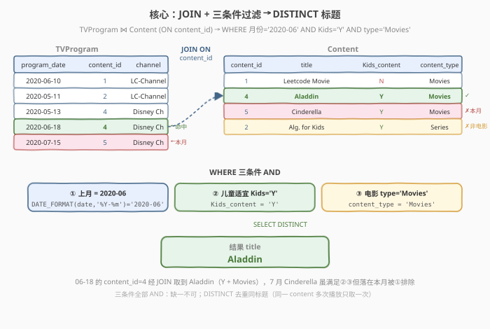
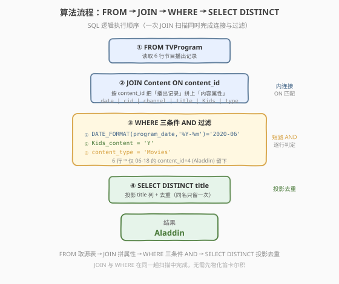
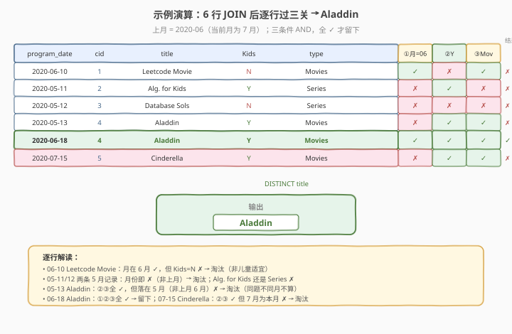

# LeetCode 上月播放的儿童适宜电影 题解

## 1. 题目概述

- **标题 / 题号**：上月播放的儿童适宜电影（#1495，easy）
- **链接**：https://leetcode.cn/problems/friendly-movies-streamed-last-month/
- **难度**：简单
- **标签**：SQL、JOIN、WHERE、日期函数、DATE_FORMAT、DISTINCT、多条件过滤

**题意**：给定 `TVProgram`（节目播出表）与 `Content`（内容属性表）两张表。编写 SQL 查询，报告**上个月**播放过的、**儿童适宜**的**电影**的去重标题。

- **儿童适宜**：`Kids_content = 'Y'`
- **电影**：`content_type = 'Movies'`（区别于 `Series` 剧集）
- **上月**：当前月的上一个自然月。本题数据语境下当前月为 2020 年 7 月，故「上月」= 2020 年 6 月（`'2020-06'`）。

**表结构**：

```text
Table: TVProgram
+-------------+---------+
| Column Name | Type    |
+-------------+---------+
| program_date| date    |
| content_id  | int     |
| channel     | varchar |
+-------------+---------+
(program_date, content_id) 是该表主键。
该表每一行表示某个内容在某天的某个频道播出。

Table: Content
+-------------+---------+
| Column Name | Type    |
+-------------+---------+
| content_id  | varchar |
| title       | varchar |
| Kids_content| enum    |
| content_type| varchar |
+-------------+---------+
content_id 是该表主键。
Kids_content 是枚举，取值 'Y' 或 'N'。
content_type 取值 'Series' 或 'Movies'。
```

> 💡 **关键点**：播出信息（哪天播）在 `TVProgram`，内容属性（是否儿童适宜、是不是电影）在 `Content`，二者靠 `content_id` 关联——必须 **JOIN** 才能同时拿到「日期 + 属性」做联合判定。

**示例 1**：

```text
输入：
TVProgram 表：
+---------------------+------------+------------+
| program_date        | content_id | channel    |
+---------------------+------------+------------+
| 2020-06-10 08:00    | 1          | LC-Channel |
| 2020-05-11 12:00    | 2          | LC-Channel |
| 2020-05-12 12:00    | 3          | LC-Channel |
| 2020-05-13 14:00    | 4          | Disney Ch  |
| 2020-06-18 14:00    | 4          | Disney Ch  |
| 2020-07-15 16:00    | 5          | Disney Ch  |
+---------------------+------------+------------+

Content 表：
+------------+----------------+--------------+--------------+
| content_id | title          | Kids_content | content_type |
+------------+----------------+--------------+--------------+
| 1          | Leetcode Movie | N            | Movies       |
| 2          | Alg. for Kids  | Y            | Series       |
| 3          | Database Sols  | N            | Series       |
| 4          | Aladdin        | Y            | Movies       |
| 5          | Cinderella     | Y            | Movies       |
+------------+----------------+--------------+--------------+

输出：
+-----------+
| title     |
+-----------+
| Aladdin   |
+-----------+
```

**解释**：

- 上月 = 2020 年 6 月（当前月为 7 月）。6 月的播出记录有两条：`2020-06-10` 的 content_id=1、`2020-06-18` 的 content_id=4。
- content_id=1（Leetcode Movie）：`Kids_content = N` → 非儿童适宜，淘汰。
- content_id=4（Aladdin）：`Kids_content = Y` 且 `content_type = Movies` → 命中，标题 `Aladdin`。
- 注意 content_id=5（Cinderella）虽是儿童适宜电影，但它在 `2020-07-15` 播出，属**当前月**而非上月，被月份条件排除——它是本题的「干扰项」。

**约束**：

- `program_date` 为合法日期
- `content_id` 在两表间可关联（`TVProgram.content_id` 引用 `Content.content_id`）
- `Kids_content ∈ {'Y', 'N'}`，`content_type ∈ {'Series', 'Movies'}`
- 结果返回去重后的 `title`，顺序任意

> 💡 **核心考点**：① 两表 `JOIN` 关联；② `WHERE` 多条件 `AND` 过滤（月份 + 枚举值两个布尔判定）；③ `DISTINCT` 去重输出。三件套是「连接 + 过滤 + 去重投影」的最小完整范式。

## 2. 解题思路

### 2.1 暴力思路：分步查询拼接

最直觉的做法是分三步走：先筛上月的 `content_id`，再查这些 id 对应的儿童适宜电影，最后去重标题。但 SQL 是声明式的，无需把步骤拆开——拆成多个子查询反而会重复扫描：

```sql
-- ❌ 冗长方向：先取上月 content_id，再用子查询过滤属性
SELECT DISTINCT title
FROM Content
WHERE content_id IN (
        SELECT content_id FROM TVProgram
        WHERE DATE_FORMAT(program_date, '%Y-%m') = '2020-06'
    )
  AND Kids_content = 'Y'
  AND content_type = 'Movies';
```

- **正确但啰嗦**：`IN` 子查询先扫一遍 `TVProgram` 取上月的 id 集合，外层再扫 `Content` 过滤属性。
- **两次扫描**：`TVProgram` 与 `Content` 各扫一次，且 `IN` 子查询结果需物化成临时集合。

> ⚠️ 暴力的浪费在于「把『连接』和『过滤』拆成了两步」。其实 `JOIN ... ON content_id` 在一趟扫描里就能同时完成连接与过滤，无需中间集合。

### 2.2 核心观察：JOIN + 三条件 AND



三个关键观察把问题从「子查询两步走」简化为「一条 JOIN 查询」：

**观察一（JOIN 关联）**：播出日期在 `TVProgram`，属性在 `Content`，靠 `content_id` 内连接即可拼成「日期 + 属性」的宽表。一次 `JOIN ... ON t.content_id = c.content_id` 让每行同时具备判定所需的全部字段。

**观察二（三条件 AND）**：题目要求「上月 + 儿童适宜 + 电影」三者同时成立，即三个谓词用 `AND` 串联：

$$\text{保留}(r) \iff \text{month}(r) = \texttt{'2020-06'} \;\land\; \text{Kids}(r) = \texttt{'Y'} \;\land\; \text{type}(r) = \texttt{'Movies'}$$

- 月份：`DATE_FORMAT(program_date, '%Y-%m') = '2020-06'`——把日期规约到「年-月」字符串做等值比较，避免跨年误判（只比 `MONTH` 会把 2021-06 也算进来）。
- 儿童适宜：`Kids_content = 'Y'`——枚举等值。
- 电影：`content_type = 'Movies'`——排除 `Series` 剧集。

**观察三（DISTINCT 去重）**：同一 `content_id` 可能在上月被多个频道/多个时段重复播出（如示例中 content_id=4 的 Aladdin 在 5 月、6 月各播一次；若 6 月播多次也会产生多行）。题目要「去重标题」，故 `SELECT DISTINCT title`。

> 💡 **一句话**：`JOIN` 拼宽表 → `WHERE` 三个 `AND` 过滤 → `SELECT DISTINCT title` 投影去重。这是 SQL 「**连接 + 过滤 + 去重**」的经典三段式。

> ⚠️ **关于「上月」的确定**：LeetCode 测试数据固定在 2020 年，当前月语境为 7 月，故上月 = `'2020-06'`。若在生产环境运行，应改用相对日期 `DATE_FORMAT(DATE_SUB(CURDATE(), INTERVAL 1 MONTH), '%Y-%m')` 动态计算（见第 5 节扩展）。直接硬编码 `'2020-06'` 是通过 LeetCode 用例的写法。

### 2.3 算法流程图



| 步骤 | SQL 子句 | 作用 |
|------|----------|------|
| ① | `FROM TVProgram t` | 取源表，逐行读取播出记录 `(program_date, content_id, channel)` |
| ② | `JOIN Content c ON t.content_id = c.content_id` | 内连接，按 `content_id` 拼上 `(title, Kids_content, content_type)` |
| ③ | `WHERE 月份='2020-06' AND Kids='Y' AND type='Movies'` | 三条件 AND 逐行过滤，全真才留 |
| ④ | `SELECT DISTINCT title` | 投影 `title` 列并去重 |

> 💡 **执行顺序**：`FROM` 取源表 → `JOIN` 一趟扫描同时完成连接与过滤（无需物化笛卡尔积）→ `WHERE` 在连接结果上逐行判定 → `SELECT DISTINCT` 投影去重输出。`JOIN` 与 `WHERE` 共享同一趟扫描，谓词下推到连接阶段即剔除不满足的行。

### 2.4 示例演算

以示例 1 的 6 行 `TVProgram` JOIN `Content` 后的宽表为例，逐行过三关：



| program_date | cid | title | Kids | type | ①月=06 | ②Kids=Y | ③Movies | 结果 |
|--------------|-----|-------|------|------|--------|---------|---------|------|
| 2020-06-10 | 1 | Leetcode Movie | N | Movies | ✓ | ✗ | ✓ | ✗ |
| 2020-05-11 | 2 | Alg. for Kids | Y | Series | ✗ | ✓ | ✗ | ✗ |
| 2020-05-12 | 3 | Database Sols | N | Series | ✗ | ✗ | ✗ | ✗ |
| 2020-05-13 | 4 | Aladdin | Y | Movies | ✗ | ✓ | ✓ | ✗ |
| 2020-06-18 | 4 | Aladdin | Y | Movies | ✓ | ✓ | ✓ | **✓** |
| 2020-07-15 | 5 | Cinderella | Y | Movies | ✗ | ✓ | ✓ | ✗ |

- **第 ① 步**：`JOIN ON content_id` 把 6 行播出记录各拼上对应内容属性。
- **第 ② 步**：逐行判定三条件 AND——
  - `06-10` Leetcode Movie：月在 6 月但 `Kids=N`，淘汰；
  - `05-11/12` 两条 5 月记录：月份先 ✗（非上月），Alg. for Kids 还因 Series ✗；
  - `05-13` Aladdin：②③全 ✓ 但落在 5 月（非上月），淘汰（同题不同月不算）；
  - `06-18` Aladdin：三关全 ✓，留下；
  - `07-15` Cinderella：②③ ✓ 但 7 月为本月，月份 ✗，淘汰（这是命题人设的干扰项）。
- **第 ③ 步**：`SELECT DISTINCT title` → 仅剩 `Aladdin`。

> 💡 **干扰项设计**：Cinderella（7 月）与 5 月的 Aladdin 都是「满足②③但月份不对」的诱饵，专测你是否正确实现「上月」过滤。若漏掉月份条件，会把 Cinderella 也算进来；若只比 `MONTH` 不带年份，跨年数据会出错。

## 3. 参考代码

### SQL（解法 A：JOIN + 三条件 AND，推荐）

```sql
SELECT DISTINCT c.title
FROM TVProgram t
JOIN Content c ON t.content_id = c.content_id
WHERE DATE_FORMAT(t.program_date, '%Y-%m') = '2020-06'
  AND c.Kids_content = 'Y'
  AND c.content_type = 'Movies';
```

> 💡 **写法要点**：
> - `JOIN ... ON content_id` 一趟扫描完成连接，每行同时具备日期与属性字段。
> - `DATE_FORMAT(program_date, '%Y-%m') = '2020-06'`：把日期规约到「年-月」字符串等值比较，避免单独用 `MONTH()` 忽略年份的跨年陷阱。
> - `Kids_content = 'Y'` 与 `content_type = 'Movies'`：两个枚举等值谓词，与月份条件 `AND` 串联。
> - `SELECT DISTINCT title`：同一标题多次播放只输出一次。
> - 三个 `WHERE` 谓词顺序不影响结果（SQL 是声明式），但把选择性强的放前面有助于阅读。

### SQL（解法 B：子查询 IN，暴力）

```sql
SELECT DISTINCT title
FROM Content
WHERE content_id IN (
        SELECT content_id FROM TVProgram
        WHERE DATE_FORMAT(program_date, '%Y-%m') = '2020-06'
    )
  AND Kids_content = 'Y'
  AND content_type = 'Movies';
```

> ⚠️ **暴力的问题**：`IN` 子查询先扫 `TVProgram` 取上月的 `content_id` 集合物化，外层再扫 `Content` 做属性过滤。两张表各扫一次，且子查询结果需临时存储。解法 A 的 `JOIN` 在一趟扫描里同时完成连接与过滤，更简洁。本题数据量小两者都能秒过，面试中写解法 A 体现对「连接与过滤合并」的把握。

### Python（pandas）

```python
import pandas as pd

def friendly_movies_last_month(tv_program: pd.DataFrame, content: pd.DataFrame) -> pd.DataFrame:
    df = tv_program.merge(content, on='content_id')
    df['program_date'] = pd.to_datetime(df['program_date'])
    mask = (
        (df['program_date'].dt.strftime('%Y-%m') == '2020-06')
        & (df['Kids_content'] == 'Y')
        & (df['content_type'] == 'Movies')
    )
    return df.loc[mask, ['title']].drop_duplicates().reset_index(drop=True)
```

> 💡 **pandas 对照**：`merge(on='content_id')` 对应 `JOIN ... ON content_id`；`dt.strftime('%Y-%m') == '2020-06'` 对应 `DATE_FORMAT(...)` 月份过滤；三个布尔 `&` 对应 `WHERE ... AND ...`；`drop_duplicates()` 对应 `SELECT DISTINCT`。`pd.to_datetime` 先把字符串日期转为时间类型以支持 `dt` 访问器。

## 4. 复杂度分析

| 维度 | JOIN + 三条件（推荐） | 子查询 IN（暴力） |
|------|----------------------|-------------------|
| **时间复杂度** | $O(n + m)$ | $O(n + m)$ |
| **空间复杂度** | $O(1)$（流式过滤，无中间集合） | $O(k)$（子查询结果集合） |
| **扫描次数** | 1 趟（JOIN 与 WHERE 合并） | 2 趟（子查询 + 外层） |
| **中间物化** | 无 | 子查询 id 集合 |
| **代码行数** | 5 行 | 7 行 |

- $n$ = `TVProgram` 行数，$m$ = `Content` 行数，$k$ = 上月不同 `content_id` 数
- **时间复杂度 $O(n + m)$**：内连接对 `content_id` 做哈希/索引查找 $O(n + m)$，逐行 `WHERE` 判定 $O(1)$，`DISTINCT` 去重 $O(k)$。整体线性。
- **推荐解法**：一趟扫描，谓词在连接阶段即下推剔除，无中间集合。
- **子查询解法**：先扫 `TVProgram` 取上月 id 集合（$O(n)$ + 物化 $O(k)$），再扫 `Content` 过滤（$O(m)$）。渐近同阶但常数更大。

> ⚠️ 本题数据量小，两种写法都能秒过。面试中写解法 A 体现对「**连接与过滤合并**」「**谓词下推**」的理解——这是 SQL 报表查询的基础功。

## 5. 扩展：「上月」的动态计算与跨数据库方案

### 5.1 用相对日期动态算「上月」

LeetCode 测试数据固定在 2020 年，硬编码 `'2020-06'` 即可通过。生产环境中「上月」应相对当前日期动态计算：

```sql
-- MySQL：DATE_SUB + DATE_FORMAT 动态取上月
SELECT DISTINCT c.title
FROM TVProgram t
JOIN Content c ON t.content_id = c.content_id
WHERE DATE_FORMAT(t.program_date, '%Y-%m') = DATE_FORMAT(DATE_SUB(CURDATE(), INTERVAL 1 MONTH), '%Y-%m')
  AND c.Kids_content = 'Y'
  AND c.content_type = 'Movies';
```

> ⚠️ **为何 LeetCode 不用 `CURDATE()`**：LeetCode 的 MySQL 沙箱时钟是真实当前日期，测试数据却是 2020 年的。若用 `CURDATE()`，今天运行会得到本月（如 2026-08）的上月（2026-07），与 2020 数据匹配为空，结果错误。故 LeetCode 用例下必须硬编码 `'2020-06'`。这是 LeetCode 日期类 SQL 题的通病——数据与「当前」脱节。

### 5.2 月份比较的不同写法

| 写法 | 说明 | 风险 |
|------|------|------|
| `DATE_FORMAT(date, '%Y-%m') = '2020-06'` | 年-月字符串等值 | ✓ 推荐，跨年安全 |
| `MONTH(date) = 6 AND YEAR(date) = 2020` | 拆年月双条件 | ✓ 安全但啰嗦 |
| `MONTH(date) = 6` | 只比月 | ⚠️ 跨年会误判（2021-06 也命中） |
| `date >= '2020-06-01' AND date < '2020-07-01'` | 半开区间 | ✓ 可走索引（范围扫描最快） |

> 💡 **索引友好**：若 `program_date` 上有索引，半开区间 `date >= '2020-06-01' AND date < '2020-07-01'` 是范围谓词，能走索引范围扫描；而 `DATE_FORMAT(date, '%Y-%m') = '2020-06'` 对列套了函数，索引会失效（除非建函数索引）。生产环境优先用半开区间。

### 5.3 跨数据库的日期函数

| 数据库 | 取「年-月」 | 上月 |
|--------|------------|------|
| MySQL | `DATE_FORMAT(d, '%Y-%m')` | `DATE_SUB(CURDATE(), INTERVAL 1 MONTH)` |
| PostgreSQL | `TO_CHAR(d, 'YYYY-MM')` | `DATE_TRUNC('month', CURRENT_DATE) - INTERVAL '1 month'` |
| SQL Server | `FORMAT(d, 'yyyy-MM')` | `DATEADD(month, -1, GETDATE())` |
| Oracle | `TO_CHAR(d, 'YYYY-MM')` | `ADD_MONTHS(SYSDATE, -1)` |

## 6. 面试要点

1. **为什么必须 JOIN 而不能只用一张表？**

   > 播出日期在 `TVProgram`，而「儿童适宜」「电影」属性在 `Content`，两表靠 `content_id` 关联。单查任一张表都无法同时拿到「日期 + 属性」做联合判定。`JOIN ON content_id` 是把分散在两表的字段拼成宽表的唯一方式。

2. **三个 WHERE 条件为什么用 AND 而不是 OR？**

   > 题目要求「上月播放」**且**「儿童适宜」**且**「电影」，三者须同时成立——这是合取（conjunction），用 `AND`。`OR` 表示「任一成立即可」，会把非上月的儿童适宜电影、上月的非儿童适宜电影都算进来，扩大结果集。

3. **为什么用 DATE_FORMAT 比较月份，而不直接 MONTH(program_date) = 6？**

   > `MONTH(date) = 6` 只比月份忽略年份，跨年数据（如 2021-06）会被误判为命中。`DATE_FORMAT(date, '%Y-%m') = '2020-06'` 把年月一起比，跨年安全。若数据保证单年，`MONTH + YEAR` 双条件也可；生产环境带索引时优先半开区间 `>= 月初 AND < 下月初`。

4. **DISTINCT 的作用是什么？不加会怎样？**

   > 同一 `content_id` 可能在上月被多个频道或多个时段重复播出，JOIN 后会产生多行同标题。题目要求「去重标题」，`SELECT DISTINCT title` 保证每个标题只出现一次。不加 `DISTINCT` 会输出重复行（如 Aladdin 出现多次）。

5. **Cinderella 是儿童适宜电影，为什么没出现在结果里？**

   > Cinderella（content_id=5）在 `2020-07-15` 播出，属**当前月（7 月）**而非上月（6 月），被月份条件 `DATE_FORMAT(...)='2020-06'` 排除。它是命题人刻意设置的干扰项——满足属性条件但月份不对，专测「上月」过滤是否正确实现。若漏掉月份条件就会误把它算进来。

> 💡 **一句话总结**：1495 的灵魂是「**连接 + 三条件过滤 + 去重**」——`JOIN ON content_id` 拼宽表，`WHERE 月份='2020-06' AND Kids='Y' AND type='Movies'` 三关 AND，`SELECT DISTINCT title` 投影去重。核心是 JOIN 与 WHERE 在一趟扫描中合并，以及用 `DATE_FORMAT` 做跨年安全的月份等值比较。

## 同类练习题

| # | 题目 | 与本题的关联 |
|---|------|-------------|
| 1179 | [重新格式化部门表](https://leetcode.cn/problems/reformat-department-table/) | SQL 行转列 + 条件聚合——`SUM(IF(month=k, revenue, 0))` 把行级数据透视成列，对照 1495 的 `WHERE` 行级过滤，体会「行过滤 vs 列透视」两种数据重塑形态 |
| 584 | [寻找用户推荐人](https://leetcode.cn/problems/find-customer-referee/) | SQL 单表 `WHERE` 多条件过滤 + `NULL` 处理——`referee_id <> 2 OR referee_id IS NULL`，对照 1495 的三条件 AND，理解 `WHERE` 谓词与三值逻辑 |
| 1757 | [可回收且低脂的产品](https://leetcode.cn/problems/recyclable-and-low-fat-products/) | SQL 单表多布尔条件 AND 过滤——`low_fats='Y' AND recyclable='Y'`，是 1495 去掉 JOIN 与月份后的极简版，适合对照理解「多条件 AND」的最小形态 |
| 197 | [上升的温度](https://leetcode.cn/problems/rising-temperature/) | SQL 自连接 + 日期比较——`DATEDIFF(a.recordDate, b.recordDate)=1 AND a.temperature > b.temperature`，对照 1495 的 `DATE_FORMAT` 月份比较，体会日期函数在不同比较场景（差值 vs 等值）下的用法 |
| 1148 | [文章浏览 I](https://leetcode.cn/problems/article-views-i/) | SQL 单表 `WHERE` + `DISTINCT` 投影去重——`viewer_id = author_id` 后 `SELECT DISTINCT author_id`，是 1495 去掉 JOIN 后的极简版，对照理解「过滤 + 去重」组合 |
