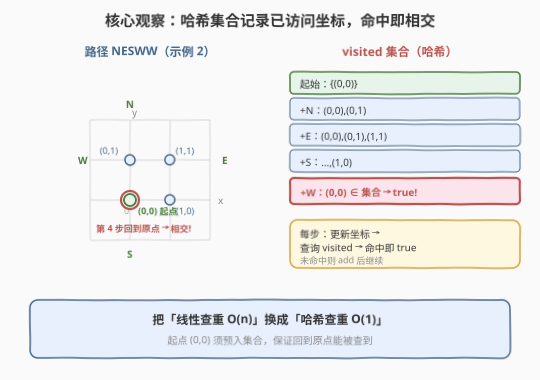
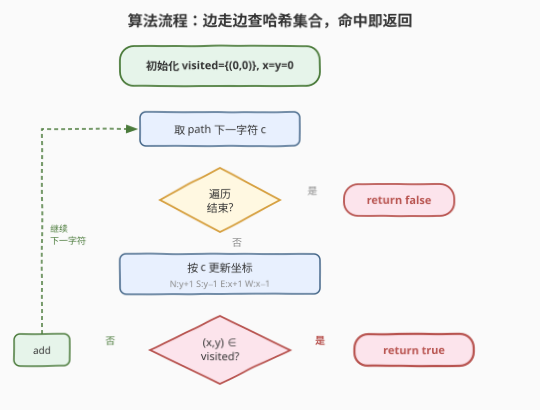
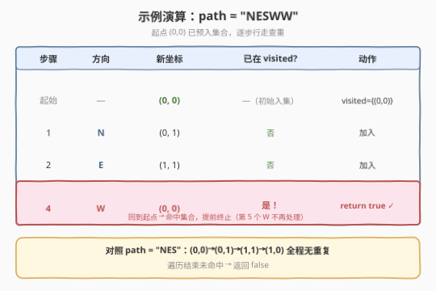

# LeetCode 判断路径是否相交 题解

## 1. 题目概述

- **标题 / 题号**：判断路径是否相交（#1496，easy）
- **链接**：https://leetcode.cn/problems/path-crossing/
- **难度**：简单
- **标签**：哈希表、字符串、模拟

**题意**：给定一个字符串 `path`，其中 `path[i]` 为 `'N'`、`'S'`、`'E'`、`'W'` 之一，分别表示向北、南、东、西移动一个单位。你从二维平面原点 `(0, 0)` 出发，按 `path` 顺序行走。若路径在任一位置与自身相交（即走到了之前已经到过的位置），返回 `true`；否则返回 `false`。

> 💡 本质是「**在线判重**」：边走边查「当前位置是否曾出现过」，一旦重复立即判定相交。

**示例 1**：

```text
输入：path = "NES"
输出：false
解释：路径依次经过 (0,0)→(0,1)→(1,1)→(1,0)，无重复位置。
```

**示例 2**：

```text
输入：path = "NESWW"
输出：true
解释：路径依次经过 (0,0)→(0,1)→(1,1)→(1,0)→(0,0)，第 4 步回到原点，与起点重复。
```

**约束**：

- $1 \le \text{path.length} \le 10^4$
- `path[i]` 为 `'N'`、`'S'`、`'E'` 或 `'W'`

## 2. 解题思路

### 2.1 暴力思路：每步回查所有历史位置

最直白的做法：用一个列表记录走过的每个坐标，每走一步就遍历该列表查重。时间 $O(n^2)$，$n = 10^4$ 时达 $10^8$ 量级，常数虽小但不优雅。

> 💡 问题在于「查重」这一步是 $O(n)$ 的线性扫描。把「线性查」换成「哈希查」即可一步到位降到 $O(1)$。

### 2.2 核心观察：哈希集合记录已访问坐标



**关键转化**：只需回答「当前位置是否曾到过」——这是典型的**集合成员查询**。用一个哈希集合 `visited` 存放所有走过的 `(x, y)`：

- **初始**：`visited = {(0, 0)}`，当前位置 `(x, y) = (0, 0)`（起点先行入集）；
- **走每一步**：按方向更新 `(x, y)`，若 `(x, y) ∈ visited` → **相交，返回 `true`**；否则 `visited.add((x, y))` 继续；
- **走完全程未重复**：返回 `false`。

**方向 → 坐标增量映射**：

| 方向 | 含义 | `dx` | `dy` |
|------|------|------|------|
| `N` | 北 | 0 | +1 |
| `S` | 南 | 0 | −1 |
| `E` | 东 | +1 | 0 |
| `W` | 西 | −1 | 0 |

> 💡 **为何起点要先入集合？** 题目要求「走到之前已经走过的位置」即相交。起点 `(0, 0)` 本身就是「走过的位置」，若后续某步回到原点（如示例 2 的第 4 步），必须能被查到——故初始化时就把 `(0, 0)` 放入 `visited`。这一细节与 [202. 快乐数](../0201-0300/202_快乐数.md)「初始值先入集再迭代」、[141. 环形链表](../0101-0200/141_环形链表.md)「判环需覆盖起点」同源。

### 2.3 算法流程图



1. 初始化 `visited = {(0, 0)}`，`x = 0, y = 0`；
2. 对 `path` 中每个字符 `c`：
   - 按 `c` 更新 `(x, y)`；
   - 若 `(x, y)` 已在 `visited` 中 → 返回 `true`；
   - 否则把 `(x, y)` 加入 `visited`；
3. 遍历完毕未命中 → 返回 `false`。

> 💡 **提前终止**：一旦查到重复立即返回，不必走完整条 `path`。最坏情况（不相交）才遍历全部 $n$ 步。

### 2.4 示例演算



以 `path = "NESWW"` 演示（起点 `(0, 0)` 已入集）：

| 步骤 | 方向 | 新坐标 `(x,y)` | 是否已在 `visited` | 动作 |
|------|------|----------------|-------------------|------|
| 起始 | — | (0, 0) | —（初始入集） | `visited = {(0,0)}` |
| 1 | N | (0, 1) | 否 | 加入，`visited` 含 2 点 |
| 2 | E | (1, 1) | 否 | 加入，`visited` 含 3 点 |
| 3 | S | (1, 0) | 否 | 加入，`visited` 含 4 点 |
| 4 | W | (0, 0) | **是！** | **返回 `true`** ✓ |

第 4 步 `W` 使坐标从 `(1, 0)` 变为 `(0, 0)`，而 `(0, 0)` 是起点、早就在集合里 → 命中，立即返回 `true`，第 5 个 `W` 无需处理。

对照 `path = "NES"`：起点 `(0,0)` → `(0,1)` → `(1,1)` → `(1,0)`，全程无重复，遍历结束返回 `false` ✓。

## 3. 参考代码

### C++

```cpp
class Solution {
  public:
    bool isPathCrossing(string path) {
        unordered_set<string> visited;
        int x = 0, y = 0;
        visited.insert(to_string(x) + "," + to_string(y));
        for (char c : path) {
            if (c == 'N') ++y;
            else if (c == 'S') --y;
            else if (c == 'E') ++x;
            else --x;
            string key = to_string(x) + "," + to_string(y);
            if (visited.count(key)) return true;
            visited.insert(key);
        }
        return false;
    }
};
```

### Python

```python
class Solution:
    def isPathCrossing(self, path: str) -> bool:
        x = y = 0
        visited = {(x, y)}
        for c in path:
            if c == 'N':
                y += 1
            elif c == 'S':
                y -= 1
            elif c == 'E':
                x += 1
            else:
                x -= 1
            if (x, y) in visited:
                return True
            visited.add((x, y))
        return False
```

> 💡 **实现细节**：
> - **Python 直接用元组 `(x, y)` 作集合元素**：元组可哈希、自带可读性，无需手工拼字符串键。
> - **C++ 用 `string` 键**：`pair<int,int>` 也可，但 `unordered_set` 默认不支持 `pair`、需自定义哈希；用 `to_string(x)+","+to_string(y)` 拼字符串键最省事，开箱即用。分隔符 `","` 不可省——否则 `(1, 23)` 与 `(12, 3)` 会拼成同一个 `"123"` 造成误判。
> - **起点先入集**：循环开始前就把 `(0, 0)` 插入，保证回到原点能被查到。
> - **`if/elif` 覆盖四种方向**：题目保证 `path[i]` 仅四值之一，最后一个 `else` 直接处理 `W`，无需再判。

## 4. 复杂度分析

| 维度 | 复杂度 | 说明 |
|------|--------|------|
| 时间复杂度 | $O(n)$ | 至多遍历 `path` 一次，每步哈希插入/查询均摊 $O(1)$；$n = 10^4$ 时约 $10^4$ 次操作 |
| 空间复杂度 | $O(n)$ | 最坏（不相交）时集合存放全部 $n+1$ 个坐标 |

> 💡 **哈希集合为何是 $O(1)$ 查询？** 理想哈希函数下，单次插入/查询均摊常数时间。本题坐标范围有界（$|x|,|y| \le n$），即便用最朴素的「除留余数」哈希也极少冲突。对比暴力法的 $O(n)$ 线性查重，哈希把单步查重从 $O(n)$ 降到 $O(1)$，总复杂度由 $O(n^2)$ 降到 $O(n)$。

> ⚠️ **「相交」≠「成环」**：本题只要**任一位置被走到两次**即相交，不要求形成完整闭环。示例 2 在第 4 步就返回 `true`，彼时路径只是「回到起点」，尚未构成环。这与 [141. 环形链表](../0101-0200/141_环形链表.md)「成环需回到某节点且其后仍有后继」略有差别——本题更宽松，任何重访都算。

## 5. 扩展：坐标编码与碰撞优化（可选）

当坐标范围巨大或需要更紧凑存储时，可用**单整数编码**替代字符串/元组：

- 取定一个足够大的偏移 $B$（保证 $x + B \ge 0$），令 $\text{key} = (x + B) \cdot M + (y + B)$，把二维坐标压成一个非负整数。如此 `unordered_set<long long>` 即可，省去字符串构造开销。
- 本题 $n \le 10^4$，坐标范围 $[-10^4, 10^4]$，取 $B = 10^4$、$M = 2 \times 10^4 + 1$ 即可保证双射。但字符串键已足够通过，编码优化主要面向坐标范围更大的场景。

> 💡 这一编码思想与 [187. 重复的 DNA 序列](../0101-0200/187_重复的DNA序列.md)「2 位编码 + 滚动哈希」、[149. 直线上最多的点数](../0101-0200/149_直线上最多的点数.md)「GCD 化简分数作哈希键」同属「**把多元状态压成可哈希的单值**」的通用技巧。

## 6. 面试要点

1. **为什么起点要预先放入集合？**

   > 题目把「走到之前走过的位置」定义为相交，起点 `(0, 0)` 本身就是「走过的位置」。若后续回到原点（如示例 2 第 4 步），必须能被查到，故初始化时即 `visited.add((0,0))`。漏掉这一步会导致回到原点时误判为不相交。

2. **时间复杂度是多少？为什么不是 $O(n^2)$？**

   > $O(n)$ 时间、$O(n)$ 空间。每步用哈希集合做成员查询与插入，均摊 $O(1)$，故 $n$ 步共 $O(n)$。暴力法用列表线性查重才是 $O(n^2)$——把「线性查」换成「哈希查」是降阶关键。

3. **C++ 里用 `pair<int,int>` 还是字符串键？**

   > 两者皆可。`pair<int,int>` 需自定义哈希（`unordered_set` 默认不支持 `pair`），实现稍繁；字符串键 `to_string(x)+","+to_string(y)` 开箱即用，可读性好，常数略大但本题 $n \le 10^4$ 完全够用。注意分隔符 `","` 不可省，避免 `(1,23)` 与 `(12,3)` 拼重。

4. **「相交」和「成环」有何区别？**

   > 本题只要**任一位置被走到两次**即相交，哪怕只是回到起点后立即停止也算（示例 2 第 4 步即返回）。成环通常指存在一个节点其后续能回到自身并继续循环，要求更强。本题判定更宽松，任何重访都触发 `true`。

5. **能否做到 $O(1)$ 额外空间？**

   > 一般不能。判重必须留存「历史位置」信息，至少 $O(n)$ 空间存放已访问坐标。除非路径有特殊结构（如方向固定受限），否则无通用 $O(1)$ 空间解。对比 [141. 环形链表](../0101-0200/141_环形链表.md) 可用 Floyd 快慢指针 $O(1)$ 判环，但那依赖「链表节点唯一后继」的结构，本题任意方向走动不具备该约束。

> 💡 **一句话总结**：1496 是「哈希集合在线判重」的最直接应用——边走边把坐标塞进集合，命中即相交。起点预入集是唯一易错点，整体 $O(n)$ 时间、$O(n)$ 空间，简单题的套路模板。

## 同类练习题

| # | 题目 | 与本题的关联 |
|---|------|-------------|
| 202 | [快乐数](https://leetcode.cn/problems/happy-number/)（[题解](../0201-0300/202_快乐数.md)） | 用哈希集合检测数位平方和序列是否出现重复状态（循环节）。与本题「坐标重复即相交」同属「哈希集合判重」套路，可对比「判序列重复」与「判坐标重复」 |
| 141 | [环形链表](https://leetcode.cn/problems/linked-list-cycle/)（[题解](../0101-0200/141_环形链表.md)） | 判定链表是否成环，本质是检测「重复节点」。哈希集合判重或 Floyd 快慢指针判圈，与本题「重复位置即相交」思想同源，可对比 $O(1)$ 空间判圈的适用条件 |
| 219 | [存在重复元素 II](https://leetcode.cn/problems/contains-duplicate-ii/)（[题解](../0201-0300/219_存在重复元素II.md)） | 用哈希表记录每个值最近出现的下标，检测「索引差 $\le k$ 的重复」。同为「哈希表查重」变体，关注重复的「距离约束」，可对比「查任意重复」与「查受限距离重复」 |
| 1 | [两数之和](https://leetcode.cn/problems/two-sum/)（[题解](../0001-0100/1_两数之和.md)） | 哈希表一次遍历查找互补数。与本题同为「边遍历边查哈希表」的在线查询范式，可对比「查互补值」与「查重复值」 |
