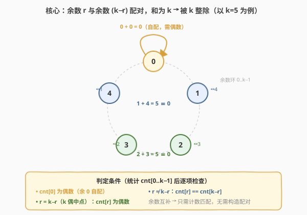

# LeetCode 检查数组对是否可以被 k 整除 题解

## 1. 题目概述

- **标题 / 题号**：检查数组对是否可以被 k 整除（#1497，medium）
- **链接**：https://leetcode.cn/problems/check-if-array-pairs-are-divisible-by-k/
- **难度**：中等
- **标签**：数组、哈希表、计数、数学

**题意**：给定一个长度为偶数 $n$ 的整数数组 `arr` 和一个整数 `k`，需要把数组**恰好**分成 $n/2$ 对，使**每对数字的和都能被 $k$ 整除**。存在这样的分法返回 `true`，否则返回 `false`。

**示例 1**：

```text
输入：arr = [1,2,3,4,5,10,6,7,8,9], k = 5
输出：true
解释：划分后的数字对为 (1,9),(2,8),(3,7),(4,6) 以及 (5,10)。
```

**示例 2**：

```text
输入：arr = [1,2,3,4,5,6], k = 7
输出：true
解释：划分后的数字对为 (1,6),(2,5) 以及 (3,4)。
```

**示例 3**：

```text
输入：arr = [1,2,3,4,5,6], k = 10
输出：false
解释：无法在将数组中的数字分为三对的同时满足每对数字和能够被 10 整除的条件。
```

**约束**：

- $1 \le n = \text{arr.length} \le 10^5$，$n$ 为偶数
- $-10^9 \le \text{arr}[i] \le 10^9$
- $1 \le k \le 10^5$

> ⚠️ 数组元素可能为**负数**，取余必须规范化到 $[0, k-1]$，否则负余数会与正余数被错分到不同桶导致误判。

> 💡 **关键点**：能否配对只取决于两数对 $k$ 的**余数**，与具体数值无关。把「按数值枚举配对方案」抽象为「按余数类匹配计数」，问题立刻从指数级方案枚举降为 $k$ 个桶的计数判定。

## 2. 解题思路

### 2.1 暴力思路：枚举所有配对方案

最直白的做法：枚举所有把 $n$ 个数分成 $n/2$ 对的方案，逐方案检查每对和能否被 $k$ 整除。$n$ 个数的配对方案数为 $(n-1)!! = (n-1)(n-3)\cdots 1$，当 $n=10^5$ 时是天文数字，完全不可行。

即便退而用搜索 + 回溯（逐个选数、为其找一个尚未配对的伙伴），最坏仍要穷举大量组合，且没有利用「和被 $k$ 整除」这一结构的任何性质。

> ⚠️ 暴力的浪费在于「**按具体数值配对**」——其实两个数能否凑成 $k$ 的倍数，**只取决于它们各自的余数**，与数值本身无关。一旦按余数分桶，桶内的任一数都可与互补桶内的任一数配对，方案枚举就退化为计数匹配。

### 2.2 核心观察：余数配对



**配对定理**：两数 $a, b$ 之和能被 $k$ 整除，当且仅当它们对 $k$ 的余数之和为 $k$（或 $0$）：

$$
(a + b) \bmod k = 0 \iff (a \bmod k + b \bmod k) \bmod k = 0 \iff b \bmod k = (k - a \bmod k) \bmod k
$$

即：**余数 $r$ 只能与余数 $(k-r) \bmod k$ 配对**。于是把所有数按「对 $k$ 的余数」分桶 $cnt[0..k-1]$，只需检查互补桶的计数能否两两对上：

| 余数 $r$ | 互补余数 $(k-r)\bmod k$ | 配对要求 | 说明 |
|----------|------------------------|----------|------|
| $0$ | $0$ | $cnt[0]$ 为**偶数** | 余 $0$ 的数两两配对（$0+0\equiv 0$） |
| $r$（$1 \le r < k/2$） | $k-r$（与 $r$ 不同） | $cnt[r] == cnt[k-r]$ | 两桶一一配对 |
| $k/2$（仅 $k$ 为偶数） | $k/2$（与自身相同） | $cnt[k/2]$ 为**偶数** | 中点余数自配对（$k/2+k/2 \equiv 0$） |

> 💡 **为何只需匹配计数、无需真的构造配对？** 因为「相容关系」是干净的**类间互补**：同一余数类内的任一元素，与互补余数类内的任一元素都满足整除条件，不存在更细的结构约束（不像二分图匹配那样有边集限制）。所以这是**判定问题**而非真正的匹配问题——只要计数对得上，就一定能配出来。

**负数余数规范化**：$r = ((x \bmod k) + k) \bmod k$，保证落在 $[0, k-1]$。例：$x=-1, k=5$ 时 $((-1) + 5) \bmod 5 = 4$，即 $-1$ 与 $4$（互补 $1$）属于同一桶——这与 $-1+1=0$ 被 $5$ 整除一致。

### 2.3 算法流程图

![算法流程：统计余数频次 → 检查 cnt[0] 偶 → 循环 r=1..⌊k/2⌋ 检查互补计数 → 全过返回 true](../images/1497_algorithm_flow.svg)

**完整步骤**：

1. **统计余数频次**：遍历 `arr`，对每个 $x$ 计算 $r = ((x \bmod k) + k) \bmod k$，`cnt[r]++`；
2. **检查余数 0**：若 $cnt[0]$ 为奇数 → 返回 `false`；
3. **循环检查互补对**：$r$ 从 $1$ 到 $\lfloor k/2 \rfloor$：
   - 若 $r = k-r$（$k$ 为偶数的中点）：要求 $cnt[r]$ 为偶数，否则 `false`；
   - 否则要求 $cnt[r] = cnt[k-r]$，否则 `false`；
4. **全部通过** → 返回 `true`。

> 💡 循环只到 $\lfloor k/2 \rfloor$：因为 $r$ 与 $k-r$ 对称，检查一半即覆盖全部互补对，避免重复比较。中点 $r = k/2$（$k$ 偶数时）单独走「自配对需偶数」分支。

### 2.4 示例演算

![示例演算：arr=[1,2,3,4,5,10,6,7,8,9], k=5 → 余数分桶 → 计数匹配 → true](../images/1497_example_walkthrough.svg)

以**示例 1** `arr = [1,2,3,4,5,10,6,7,8,9]`、$k=5$ 为例：

**第一步：算余数**

| 数值 | 1 | 2 | 3 | 4 | 5 | 10 | 6 | 7 | 8 | 9 |
|------|---|---|---|---|---|----|---|---|---|---|
| 余数 | 1 | 2 | 3 | 4 | 0 | 0  | 1 | 2 | 3 | 4 |

**第二步：分桶计数**

| 余数 $r$ | 0 | 1 | 2 | 3 | 4 |
|----------|---|---|---|---|---|
| $cnt[r]$ | 2 | 2 | 2 | 2 | 2 |

**第三步：配对检查**

| 检查项 | 条件 | 结果 |
|--------|------|------|
| 余数 0 | $cnt[0]=2$ 为偶数 | ✓ |
| $r=1$ | $cnt[1]=2 == cnt[4]=2$ | ✓ |
| $r=2$ | $cnt[2]=2 == cnt[3]=2$ | ✓ |

全部通过 → 返回 `true` ✓。一种合法配对：$1(r1)\!+\!9(r4)$、$2(r2)\!+\!8(r3)$、$3(r3)\!+\!7(r2)$、$4(r4)\!+\!6(r1)$、$5(r0)\!+\!10(r0)$。

> 以**示例 3** `arr=[1,2,3,4,5,6]`、$k=10$ 反证：余数 $1,2,3,4,5,6$，$cnt[1]=1$ 但 $cnt[9]=0$，$1 \ne 0$ → 返回 `false` ✓。余数 $1$ 找不到互补的余数 $9$，无法配对。

## 3. 参考代码

### C++

```cpp
class Solution {
public:
    bool canArrange(vector<int>& arr, int k) {
        vector<int> cnt(k, 0);
        for (int x : arr) {
            int r = ((x % k) + k) % k;   // 规范化负数余数到 [0, k-1]
            cnt[r]++;
        }
        if (cnt[0] % 2 != 0) return false;
        for (int r = 1; r <= k / 2; ++r) {
            if (r == k - r) {            // k 为偶数的中点余数，自配对
                if (cnt[r] % 2 != 0) return false;
            } else {
                if (cnt[r] != cnt[k - r]) return false;
            }
        }
        return true;
    }
};
```

### Python

```python
class Solution:
    def canArrange(self, arr: List[int], k: int) -> bool:
        cnt = [0] * k
        for x in arr:
            cnt[x % k] += 1            # Python % 对正 k 已返回 [0, k-1]，负数自动规范化
        if cnt[0] % 2 != 0:
            return False
        for r in range(1, k // 2 + 1):
            if r == k - r:             # k 为偶数的中点
                if cnt[r] % 2 != 0:
                    return False
            elif cnt[r] != cnt[k - r]:
                return False
        return True
```

> 💡 **实现要点**：
> - **负数余数**：C++/Java 的 `x % k` 对负 $x$ 返回**负值**（如 $-1 \% 5 = -1$），必须 `((x%k)+k)%k` 规范化；Python 的 `%` 对正模数已返回非负，无需处理。
> - **用长度 $k$ 的数组而非哈希表**：余数取值恰为 $[0, k-1]$，数组下标天然映射，$O(1)$ 访问且无哈希开销。
> - **循环只到 $\lfloor k/2 \rfloor$**：$r$ 与 $k-r$ 对称，检查一半即覆盖全部互补对；中点 $r=k/2$（$k$ 偶数时）走自配对分支。

## 4. 复杂度分析

| 维度 | 复杂度 | 说明 |
|------|--------|------|
| 时间复杂度 | $O(n + k)$ | 一次遍历统计余数 $O(n)$ + 至多 $\lfloor k/2 \rfloor$ 次配对检查 $O(k)$ |
| 空间复杂度 | $O(k)$ | 余数频次数组 $cnt[0..k-1]$ |

- **统计阶段**：遍历 $n$ 个元素各做一次取余与自增，$O(n)$。
- **检查阶段**：循环 $r = 1 \dots \lfloor k/2 \rfloor$，每次 $O(1)$ 比较，合计 $O(k)$。
- **总体** $O(n+k)$，$n, k \le 10^5$，总量 $\le 2\times 10^5$ 次操作，轻松通过。

> ⚠️ **不能简写成 $O(n)$**：检查阶段需要遍历到 $\lfloor k/2 \rfloor$，当 $k \gg n$ 时（如 $n=2, k=10^5$）$O(k)$ 反而主导。不过 $k \le 10^5$，即便最坏也只 $10^5$ 次比较，可控。

> 💡 **下界**：至少要读完全部 $n$ 个数才能统计余数，故 $\Omega(n)$ 不可避免；$O(n+k)$ 已接近最优。若用贪心配对法（见扩展）可省去对 $k$ 个桶的显式遍历，但最坏仍 $O(n+k)$。

## 5. 扩展：贪心配对法（一趟在线匹配）

上面是「先统计后检查」的两阶段法。也可用「在线贪心配对」一趟完成：维护一个待配对余数池 `pool`，对每个数算余数 $r$ 及互补余数 $comp = (k-r) \bmod k$；若池中有 $comp$ 就消掉一个（配对成功），否则把 $r$ 入池等待。最终池空即 `true`。

```python
class Solution:
    def canArrange(self, arr: List[int], k: int) -> bool:
        from collections import Counter
        pool = Counter()
        for x in arr:
            r = x % k
            comp = (k - r) % k
            if pool[comp] > 0:      # 有互补余数等待 → 立即配对
                pool[comp] -= 1
            else:                   # 否则入池等待
                pool[r] += 1
        return all(v == 0 for v in pool.values())
```

**为何正确**：当 $r = comp$（余数 $0$ 或 $k/2$）时，池中查找的就是同类自身，等价于「偶数个才能两两消尽」；当 $r \ne comp$ 时，先到的余数入池等待，后到的互补余数把它消掉——最终全消尽当且仅当互补计数严格相等。两法完全等价。

> 💡 贪心法无需单独遍历 $k$ 个余数桶，代码更短；但 `pool` 的键数至多 $k$，最坏仍 $O(n+k)$。**统计法更直观、更易在面试中讲清「为何只需计数」**，推荐作主解；贪心法作为优雅的替代方案提及即可。

## 6. 面试要点

1. **如何想到按余数分桶？**

   > 两数和被 $k$ 整除 ⟺ 余数互补。把「具体数值能否配对」抽象为「余数类能否配对」，问题从 $(n-1)!!$ 种方案枚举降为 $k$ 个桶的计数匹配。识别信号：题目涉及「和被某数整除」+「配对/分组」，几乎都走余数互补。

2. **负数余数怎么处理？为什么必须规范化？**

   > C++/Java 的 `%` 对负数返回负值（如 $-1 \% 5 = -1$），而 $-1$ 的互补余数应是 $4$（因为 $-1+1=0$，$1$ 的互补是 $4$，故 $-1$ 应归入余数 $4$ 桶）。若不规范化，$-1$ 会被分到「$-1$ 桶」、$4$ 被分到「$4$ 桶」，互补检查失效。统一用 $r = ((x \bmod k) + k) \bmod k$ 映射到 $[0, k-1]$。Python `%` 对正模数已是非负，无需处理。

3. **为什么只需比较计数、不用真的构造配对？**

   > 相容关系是「余数 $r$ 与余数 $k-r$ 互补」的类间关系，同类内任一元素都可与互补类任一元素配对，没有更细的约束（不像二分图匹配有特定边集）。所以这是判定问题——只要互补桶计数对得上，就一定能配出来，不必构造具体方案。

4. **余数 0 和 $k/2$（$k$ 偶数）为什么特殊？**

   > 它们的互补余数就是自身（$r = (k-r) \bmod k$），只能**类内自配对**，故要求计数为偶数；其余余数 $r$ 与 $k-r$ 是两个不同的类，要求两类计数相等。代码里用 `r == k - r` 区分这两种情况。

5. **时间复杂度是 $O(n)$ 还是 $O(n+k)$？**

   > $O(n+k)$。统计 $O(n)$，配对检查遍历到 $\lfloor k/2 \rfloor$ 即 $O(k)$。当 $k \gg n$ 时 $O(k)$ 主导，不能简写成 $O(n)$。题目 $k \le 10^5$，最坏 $10^5$ 次比较，可控。

6. **如果 $k$ 很大（如 $k=10^9$）怎么办？**

   > $O(k)$ 空间的频次数组不可行，改用哈希表只存出现过的余数，空间降到 $O(\min(n, k)) = O(n)$；检查时只遍历哈希表中的余数 $r$，对每个查 $k-r$ 是否存在且计数匹配。复杂度 $O(n)$。但本题 $k \le 10^5$，数组法更高效。

> 💡 **一句话总结**：1497 的核心是「**余数互补配对**」——两数和被 $k$ 整除 ⟺ 余数 $r$ 与 $k-r$ 配对，把数值配对抽象为余数桶计数匹配，$O(n+k)$ 一趟统计 + 一趟检查即可判定，负数余数务必规范化、中点余数走自配对分支。

## 同类练习题

| # | 题目 | 与本题的关联 |
|---|------|-------------|
| 974 | [和可被 K 整除的子数组](https://leetcode.cn/problems/subarray-sums-divisible-by-k/)（[题解](../0901-1000/974_和可被K整除的子数组.md)） | **同余定理**——两前缀和对 $k$ 同余 ⟺ 区间和被 $k$ 整除，用余数哈希计数。与本题同属「余数互补/同余」家族，一个是配对判定、一个是子数组计数 |
| 1010 | [总持续时间可被 60 整除的歌曲对](https://leetcode.cn/problems/pairs-of-songs-with-total-durations-divisible-by-60/)（[题解](../1001-1100/1010_总持续时间可被60整除的歌曲对.md)） | 余数配对**计数**——$k=60$ 固定，统计各余数对 $(r, 60-r)$ 的配对数目。是本题「能否配对」的「数几种配法」兄弟题，同一套余数互补模板 |
| 523 | [连续的子数组和](https://leetcode.cn/problems/continuous-subarray-sum/)（[题解](../0501-0600/523_连续的子数组和.md)） | 同余 + 前缀和——判断是否存在长度 $\ge 2$ 的子数组和被 $k$ 整除，同余定理 + 哈希存最早下标，与 974/1497 同源但聚焦「存在性」 |
| 1590 | [使数组和能被 P 整除](https://leetcode.cn/problems/make-sum-divisible-by-p/) | 前缀和同余的**逆向**——删除最短子数组使剩余和被 $p$ 整除，转译为「找同余差的最短子数组」。本题思想的进阶应用，从「能否配对」升级为「最小删除」 |
