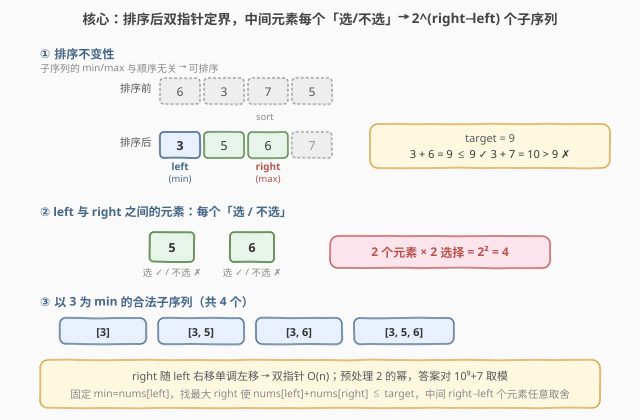
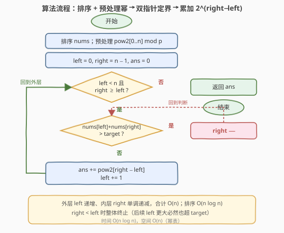

# LeetCode 满足条件的子序列数目 题解

## 1. 题目概述

- **标题 / 题号**：满足条件的子序列数目（#1498，medium）
- **链接**：https://leetcode.cn/problems/number-of-subsequences-that-satisfy-the-given-sum-condition/
- **难度**：中等
- **标签**：数组、双指针、二分查找、排序、贪心

**题意**：给你一个整数数组 `nums` 和一个整数 `target`。请统计并返回 `nums` 中能满足其**最小元素与最大元素之和小于或等于 `target`** 的**非空子序列**数目。由于答案可能很大，将结果对 $10^9 + 7$ 取余后返回。

**示例 1**：

```text
输入：nums = [3,5,6,7], target = 9
输出：4
解释：有 4 个子序列满足条件。
[3]      -> min + max = 3 + 3 = 6 ≤ 9
[3,5]    -> 3 + 5 = 8 ≤ 9
[3,5,6]  -> 3 + 6 = 9 ≤ 9
[3,6]    -> 3 + 6 = 9 ≤ 9
```

**示例 2**：

```text
输入：nums = [3,3,6,8], target = 10
输出：6
解释：[3], [3], [3,3], [3,6], [3,6], [3,3,6]（nums 中可有重复数字）
```

**示例 3**：

```text
输入：nums = [2,3,3,4,6,7], target = 12
输出：61
解释：共 63 个非空子序列，其中 2 个不满足（[6,7], [7]），有效序列 63 − 2 = 61
```

**约束**：

- $1 \le \text{nums.length} \le 10^5$
- $1 \le \text{nums}[i] \le 10^6$
- $1 \le \text{target} \le 10^6$

> 💡 **关键点**：题目统计的是**子序列**（subsequence）而非子数组——子序列只关心「选了哪些元素」，与它们在原数组中的顺序无关。这一性质是整个解法的入口：既然顺序无关，就可以先排序，再用双指针快速锁定每个最小值对应的最大值边界。

## 2. 解题思路

### 2.1 暴力思路：枚举所有子序列

最朴素的做法：枚举 `nums` 的所有 $2^n - 1$ 个非空子序列，对每个子序列求 min 与 max，判断 min + max ≤ target。

- **正确**：穷举必然覆盖全部答案；
- **不可行**：$n = 10^5$ 时 $2^n$ 是天文数字，完全超时。

> ⚠️ 暴力的浪费在于「**逐个构造子序列**」。其实一个子序列是否合法，只取决于它的**最小值与最大值**，中间夹了哪些元素无所谓——只要 min + max ≤ target，中间元素怎么选都合法。应把视角从「逐个枚举子序列」抬升到「按 (min, max) 边界批量计数」。

### 2.2 核心观察：排序 + 双指针 + 幂计数



三个关键观察层层推进：

**观察一：子序列与顺序无关 → 可以排序。**
子序列的 min/max 只由「选了哪些元素」决定，与原数组顺序无关。将 `nums` 升序排序后，任何子序列的 min/max 性质不变，但数组变成有序，便于用双指针锁定边界。

**观察二：固定 min，找最大 max。**
排序后，枚举每个 `left` 作为最小值 `nums[left]`。由于数组有序，寻找最大的 `right` 使得 $\text{nums}[left] + \text{nums}[right] \le \text{target}$。且随 `left` 右移（min 变大），`right` 只会单调左移——这是经典双指针的单调性。

**观察三：中间元素任意取舍 → $2^{\text{right}-\text{left}}$ 个子序列。**
固定 `left`（必须选，作为 min）和 `right`（合法上界）后，区间 $(left, right]$ 内共 `right - left` 个元素，每个都有「选 / 不选」两种选择。任取一种组合：

- 所有被选元素 $\ge \text{nums}[left]$，故 min 仍是 $\text{nums}[left]$；
- 所有被选元素 $\le \text{nums}[right]$，故 max $\le \text{nums}[right]$；
- 于是 $\text{min} + \text{max} \le \text{nums}[left] + \text{nums}[right] \le \text{target}$ ✓。

因此以 $\text{nums}[left]$ 为 min 的合法子序列数恰为 $2^{\text{right}-\text{left}}$。把所有 `left` 的贡献求和即为答案。

$$\text{ans} = \sum_{\text{left}=0}^{n-1} 2^{\text{right}(\text{left}) - \text{left}}, \quad \text{其中 right}(\text{left}) = \max\{\,j \ge \text{left} \mid \text{nums}[\text{left}] + \text{nums}[j] \le \text{target}\,\}$$

> 💡 **一句话**：排序破除顺序依赖，双指针 O(n) 找每个 min 的 max 上界，幂计数 $2^{\text{right}-\text{left}}$ 批量统计中间元素的取舍组合——三步把 $O(2^n)$ 压到 $O(n \log n)$。

> ⚠️ **终止条件**：当 `right` 退化到 `right < left`（即 $\text{nums}[left] \times 2 > \text{target}$，单独选 `nums[left]` 都不合法）时，由于数组升序、后续 `left` 更大必然也不合法，可直接 `break` 终止整个循环。

### 2.3 算法流程图



**完整步骤**：

1. **排序**：`sort(nums)`；
2. **预处理幂表**：`pow2[0..n]`，`pow2[k] = 2^k mod (10^9+7)`，递推 `pow2[i] = pow2[i-1] * 2 % MOD`；
3. **初始化**：`left = 0`，`right = n - 1`，`ans = 0`；
4. **外层循环** `left` 从 $0$ 到 $n-1$：
   - **内层 while**：只要 `right >= left` 且 $\text{nums}[left] + \text{nums}[right] > \text{target}$，就 `right--`；
   - **终止判断**：若 `right < left`，`break`（后续均不合法）；
   - **累加**：`ans = (ans + pow2[right - left]) % MOD`；
5. **返回** `ans`。

> 💡 **双指针为何 O(n)**：`left` 只递增（至多 $n$ 步）、`right` 只递减（至多 $n$ 步），两指针合计移动不超过 $2n$ 次。预处理幂表 $O(n)$，排序 $O(n \log n)$ 为整体瓶颈。

### 2.4 示例演算

以示例 1 `nums = [3,5,6,7]`、`target = 9` 为例（排序后不变）：

![示例演算：nums = [3,5,6,7]，target = 9](../images/1498_example_walkthrough.svg)

| 步 | left | nums[left] | right 调整过程 | right | $2^{\text{right}-\text{left}}$ | ans |
|----|------|------------|----------------|-------|--------------------------------|-----|
| ① | 0 | 3 | $3+7=10>9$ → `right--`；$3+6=9 \le 9$ ✓ | 2 | $2^{2}=4$ | 4 |
| ② | 1 | 5 | $5+6=11>9$；$5+5=10>9$ → `right=0 < left` | $<\text{left}$ | —（break） | 4 |

- **步 ①**：`left=0`（min=3），`right` 从 3 左移到 2（$3+6=9 \le 9$）。中间元素 $\{5,6\}$ 共 $2$ 个，每个选/不选 → $2^2 = 4$ 个子序列：`[3]`、`[3,5]`、`[3,6]`、`[3,5,6]`，均满足 $3 + \max \le 9$。
- **步 ②**：`left=1`（min=5），$5+5=10 > 9$ 连自身都不合法，`right` 跌到 $0 < 1$，终止。最终答案 **4** ✓。

> 以示例 2 `[3,3,6,8]`、`target=10` 验证：`left=0`(3)→`right=2`(6)，$2^2=4$；`left=1`(3)→`right=2`(6)，$2^1=2$；`left=2`(6)→$6+6=12>10$ 终止 ⟹ 答案 $4+2=6$ ✓。以示例 3 `[2,3,3,4,6,7]`、`target=12` 验证：各 `left` 贡献 $32+16+8+4+1=61$ ✓。

## 3. 参考代码

### C++

```cpp
class Solution {
public:
    int numSubseq(vector<int>& nums, int target) {
        const int MOD = 1e9 + 7;
        int n = nums.size();
        sort(nums.begin(), nums.end());
        // 预处理 2 的幂
        vector<int> pow2(n + 1);
        pow2[0] = 1;
        for (int i = 1; i <= n; ++i)
            pow2[i] = (pow2[i - 1] * 2) % MOD;
        int ans = 0, right = n - 1;
        for (int left = 0; left < n; ++left) {
            while (right >= left && nums[left] + nums[right] > target)
                --right;
            if (right < left) break;          // 后续 left 更大，必然也不合法
            ans = (ans + pow2[right - left]) % MOD;
        }
        return ans;
    }
};
```

### Python

```python
class Solution:
    def numSubseq(self, nums: List[int], target: int) -> int:
        MOD = 10**9 + 7
        n = len(nums)
        nums.sort()
        # 预处理 2 的幂
        pow2 = [1] * (n + 1)
        for i in range(1, n + 1):
            pow2[i] = (pow2[i - 1] * 2) % MOD
        ans = 0
        right = n - 1
        for left in range(n):
            while right >= left and nums[left] + nums[right] > target:
                right -= 1
            if right < left:
                break                      # 后续 left 更大，必然也不合法
            ans = (ans + pow2[right - left]) % MOD
        return ans
```

> 💡 **实现要点**：① 先排序，再预处理 `pow2[0..n]`，避免每次调用快速幂；② `right` 初始化为 `n-1`，**在外层循环之外**——它只随 `left` 单调左移，不重置，这是双指针 $O(n)$ 的关键；③ `right < left` 时 `break` 而非 `continue`：数组升序保证后续 `left` 的 `nums[left]` 更大，$2 \cdot \text{nums}[left] > \text{target}$ 必然持续成立；④ 全程对 $10^9+7$ 取模，`pow2` 递推时就要取模，累加时也要取模。

## 4. 复杂度分析

| 维度 | 排序 + 双指针 $O(n \log n)$（推荐） | 暴力枚举 |
|------|-------------------------------------|----------|
| **时间复杂度** | $O(n \log n)$ | $O(2^n \cdot n)$ |
| **空间复杂度** | $O(n)$（幂表） | $O(n)$ |
| **可行性** | $n=10^5$ 轻松通过 | 完全超时 |
| **核心操作** | 排序 + 双指针 + 幂计数 | 逐个构造子序列并求 min/max |

- **排序 + 双指针**：排序 $O(n \log n)$；预处理幂表 $O(n)$；双指针两指针合计移动 $O(n)$。整体 $O(n \log n)$，排序为瓶颈，空间 $O(n)$ 存幂表。
- **下界**：读数组至少 $O(n)$；排序带来 $O(n \log n)$，但本题只需「每个 min 的 max 上界」，双指针已将该部分降到 $O(n)$，已是排序框架下的最优。

> ⚠️ 幂表空间可优化到 $O(1)$ 吗？`right - left` 取值不单调（`left` 右移时 `right` 左移，差值可增可减），无法顺序递推。若改用快速幂 $O(\log n)$ 每次，则总查询 $O(n \log n)$，与排序同级但常数更大——故预计算 $O(n)$ 幂表是更好的取舍。

## 5. 扩展：二分查找替代内层双指针

若一时没察觉到 `right` 的单调性，可对每个 `left` 用**二分查找**定位最大 `right`：在有序数组中找满足 $\text{nums}[j] \le \text{target} - \text{nums}[left]$ 的最大下标，即 `upper_bound(target - nums[left]) - 1`。

```cpp
class Solution {
public:
    int numSubseq(vector<int>& nums, int target) {
        const int MOD = 1e9 + 7;
        int n = nums.size();
        sort(nums.begin(), nums.end());
        vector<int> pow2(n + 1);
        pow2[0] = 1;
        for (int i = 1; i <= n; ++i)
            pow2[i] = (pow2[i - 1] * 2) % MOD;
        int ans = 0;
        for (int left = 0; left < n; ++left) {
            if (nums[left] * 2 > target) break;        // 自身即超，提前终止
            int r = upper_bound(nums.begin(), nums.end(),
                                target - nums[left]) - nums.begin() - 1;
            ans = (ans + pow2[r - left]) % MOD;
        }
        return ans;
    }
};
```

- **时间**：排序 $O(n \log n)$ + $n$ 次二分 $O(n \log n)$ = $O(n \log n)$；
- **对比双指针**：渐近复杂度相同（排序同为瓶颈），但双指针的查询部分是 $O(n)$，常数更小、且无需重复二分。面试中先讲双指针版，再提「也可二分，思路更直白但常数略大」作为对照。

> 💡 **两种写法等价的根源**：双指针利用了 `right(left)` 的单调不减... 实为单调不增（`left` 增 → `right` 减），这是排序数组上「固定一端求另一端阈值」的天然性质。一旦看出单调性，双指针就是对二分的摊还优化。

## 6. 面试要点

1. **为什么子序列问题可以先排序？**

   > 子序列只要求「选了哪些元素」，不要求它们连续或保序。一个子序列的 min/max 完全由所选元素集合决定，与原数组顺序无关。排序只改变元素的位置，不改变任何子序列对应的元素集合，因此 min/max 性质保持不变。而子数组（连续）则不能排序——顺序即其定义的一部分。

2. **$2^{\text{right}-\text{left}}$ 这个计数是怎么来的？**

   > 固定 `left` 必选（保证它是 min）、`right` 为合法上界后，区间 $(left, right]$ 内有 `right - left` 个元素，每个「选/不选」相互独立，共 $2^{\text{right}-\text{left}}$ 种组合。任一组合的最大值 $\le \text{nums}[right]$，故 $\text{min}+\text{max} \le \text{target}$ 恒成立。注意 `right` 位置的元素本身也在「可选」之列——选它时它就是 max，不选时 max 更小，依旧合法。

3. **双指针为什么是 O(n)？`right` 为什么不用每次重置？**

   > `left` 递增时 `nums[left]` 变大，约束 $\text{nums}[left] + \text{nums}[right] \le \text{target}$ 更紧，合法的 `right` 只能更小——即 `right(left)` 关于 `left` 单调不增。所以 `right` 在外层循环外初始化一次，只往左走不回头，两指针合计移动 $\le 2n$ 次。若每次重置 `right = n-1` 就退化成 $O(n^2)$。

4. **`right < left` 时为什么可以直接 `break` 而不是 `continue`？**

   > `right < left` 意味着 $\text{nums}[left] + \text{nums}[left] = 2\cdot\text{nums}[left] > \text{target}$。数组升序，后续 `left' > left` 有 $\text{nums}[left'] \ge \text{nums}[left]$，故 $2\cdot\text{nums}[left'] > \text{target}$ 同样成立，必然也 `right < left'`。提前 `break` 是正确的剪枝。

5. **为什么要预处理幂表？取模有哪些注意点？**

   > 答案可达 $2^n$ 量级（$n=10^5$），远超 64 位整数范围，必须对 $10^9+7$ 取模。预处理 `pow2[k] = 2^k \bmod p` 递推只需 $O(n)$，每次查询 $O(1)$；若用快速幂则每次 $O(\log n)$、总 $O(n \log n)$，常数更大。取模要在幂表递推和 `ans` 累加两处都做，避免中间溢出（C++ 中 `pow2[i-1] * 2` 在取模前不超 $2 \times 10^9$，可用 `int` 但写 `long long` 更稳妥）。

> 💡 **一句话总结**：1498 的灵魂是「**子序列→排序→双指针定界→幂计数**」——排序破除顺序依赖，双指针 O(n) 找每个 min 的 max 上界，$2^{\text{right}-\text{left}}$ 批量统计中间元素取舍，把指数级枚举压到 $O(n \log n)$。

## 同类练习题

| # | 题目 | 与本题的关联 |
|---|------|-------------|
| 713 | [乘积小于 K 的子数组](https://leetcode.cn/problems/subarray-product-less-than-k/)（[题解](../0701-0800/713_乘积小于K的子数组.md)） | 滑动窗口计数 $\text{right}-\text{left}+1$，与本题 $2^{\text{right}-\text{left}}$ 互为镜像——713 数**连续子数组**（顺序敏感，线性计数），1498 数**子序列**（顺序无关→排序后幂计数），体会两种计数公式的根源差异 |
| 611 | [有效三角形的个数](https://leetcode.cn/problems/valid-triangle-number/)（[题解](../0601-0700/611_有效三角形的个数.md)） | 排序 + 固定最大边 + 双指针区间计数，同为「排序后双指针锁定边界再批量计数」家族，对照 $a+b>c$ 与 $\text{min}+\text{max}\le\text{target}$ 的双指针收缩方向 |
| 16 | [最接近的三数之和](https://leetcode.cn/problems/3sum-closest/)（[题解](../0001-0100/16_最接近的三数之和.md)） | 排序 + 双指针维护最近和，双指针在有序数组上单调收缩的基础题，承接 1498 内层 `right` 单调左移的直觉 |
| 912 | [排序数组](https://leetcode.cn/problems/sort-an-array/)（[题解](../0901-1000/912_排序数组.md)） | 排序是本题前置——子序列不关心顺序才可排序，手撕快排/归并巩固 $O(n \log n)$ 排序基础 |
