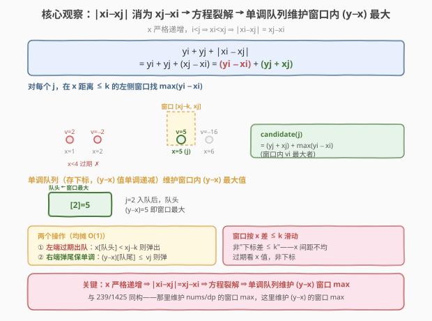
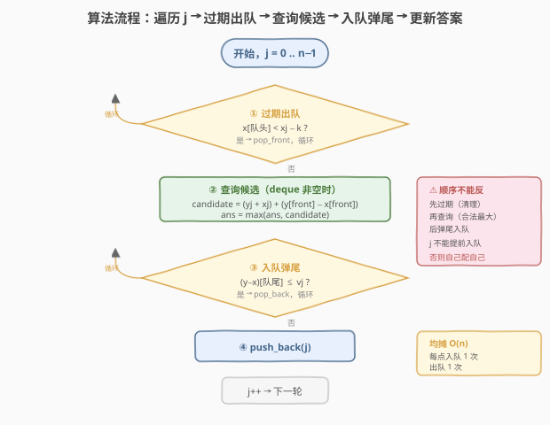
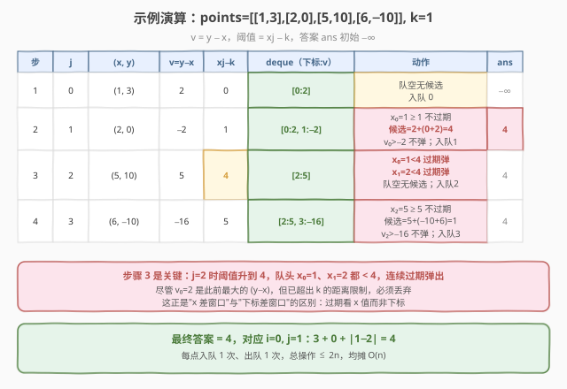

# 满足不等式的最大值

- **题目名称**：满足不等式的最大值
- **链接**：[1499. 满足不等式的最大值](https://leetcode.cn/problems/max-value-of-equation/)
- **难度**：困难
- **标签**：数组、单调队列、滑动窗口

## 1. 题目概述

给定一个点集 `points`，其中 `points[i] = [xi, yi]` 表示二维平面上的一个点。**`points` 已按 $x$ 坐标严格递增排序**。再给定一个整数 $k$。

返回满足 $|x_i - x_j| \le k$ 且 $1 \le i < j \le \text{points.length}$ 的方程 $y_i + y_j + |x_i - x_j|$ 的**最大值**。

**示例 1**：

```text
输入：points = [[1,3],[2,0],[5,10],[6,-10]], k = 1
输出：4
解释：i=0, j=1：3 + 0 + |1 - 2| = 4，|1-2|=1 ≤ 1 合法。
```

**示例 2**：

```text
输入：points = [[0,0],[3,0],[9,2]], k = 3
输出：3
解释：i=0, j=1：0 + 0 + |0 - 3| = 3，|0-3|=3 ≤ 3 合法。
```

**约束条件**：

- $2 \le \text{points.length} \le 10^5$
- $\text{points[i].length} == 2$
- $-10^8 \le x_i, y_i \le 10^8$
- $0 \le k \le 2 \times 10^8$
- $x_i < x_j$（对所有 $i < j$），$x_i$ 严格递增

> 💡 本题的灵魂是「**$x$ 严格递增**」——它把绝对值 $|x_i - x_j|$ 直接消成 $x_j - x_i$（$i < j$ 时），方程随之裂解为「只跟 $i$ 有关的项 + 只跟 $j$ 有关的项」：$y_i + y_j + x_j - x_i = (y_i - x_i) + (y_j + x_j)$。于是对每个 $j$，只需在「$x$ 距离 $\le k$ 的左侧窗口」里找一个 $i$ 使 $(y_i - x_i)$ 最大——这正是 [239. 滑动窗口最大值](../0201-0300/239_滑动窗口最大值.md) 的单调队列场景，只是窗口不再是"下标差 $\le k$"而是"$x$ 差 $\le k$"，维护的值从 `nums` 换成了 `y - x`。

---

## 2. 解题思路

### 2.1 暴力思路：固定 j，线性扫描左侧窗口

由上面的化简，对每个 $j$，在所有满足 $x_j - x_i \le k$（即 $x_i \ge x_j - k$）且 $i < j$ 的点中，找最大的 $(y_i - x_i)$：

$$\text{ans} = \max_{j} \Bigl[ (y_j + x_j) + \max_{\substack{i < j \\ x_j - x_i \le k}} (y_i - x_i) \Bigr]$$

暴力实现：对每个 $j$，向左扫描所有 $i < j$，跳过 $x_j - x_i > k$ 的：

```text
for j = 1..n-1:
    best = -∞
    for i = 0..j-1:
        if x[j] - x[i] <= k:
            best = max(best, y[i] - x[i])
    ans = max(ans, best + y[j] + x[j])
```

时间复杂度 $O(n^2)$。本题 $n$ 可达 $10^5$，最坏 $10^{10}$ 次运算，**严重超时**。

> ⚠️ 瓶颈在于"对每个 $j$ 重新扫一遍左侧所有点"。但相邻 $j$ 的合法窗口高度重叠——$j$ 增大时窗口右端纳入新点、左端因 $x_j - k$ 增大而丢弃过远的点，是一个**随 $x$ 滑动的窗口**。用**单调队列**维护窗口内 $(y - x)$ 的最大值，可把每次查询降到均摊 $O(1)$。

### 2.2 核心观察：单调队列维护窗口内 (y−x) 的最大值



**关键定义**：用一个**双端队列**存下标，对应 $(y - x)$ 值从队头到队尾**单调递减**。队头始终是当前合法窗口内 $(y - x)$ 值最大的下标。

**两个操作**（与 [239. 滑动窗口最大值](../0201-0300/239_滑动窗口最大值.md) 完全同构，只是窗口边界从"下标差"换成"$x$ 差"，维护值从 `nums` 换成 `y - x`）：

1. **过期出队（左端）**：队头下标 $i$ 满足 $x_i < x_j - k$（已滑出窗口），从队头弹出。由于 $x$ 严格递增，下标在队列中按 $x$ 递增排列，过期的一定在队头。
2. **入队弹尾（右端）**：新点 $j$ 入队前，从队尾弹出所有 $(y - x) \le (y_j - x_j)$ 的下标——它们**更小且更早**（$x$ 更小，更快过期），只要 $j$ 还在窗口里，这些旧值永远不可能成为最大，可安全丢弃。

**查询**：队头对应的 $(y - x)$ 即窗口最大值，$O(1)$ 取得。于是：

$$\text{candidate}(j) = (y_j + x_j) + \bigl(y_{\text{front}} - x_{\text{front}}\bigr)$$

> 💡 **与 1425 / 239 的同构关系**：[1425. 带限制的子序列和](../1401-1500/1425_带限制的子序列和.md) 维护的是"窗口内 $dp$ 的最大值"，239 维护的是"窗口内 `nums` 的最大值"，本题维护的是"窗口内 $(y - x)$ 的最大值"。三者共用同一套单调队列骨架——存下标、左端过期、右端弹尾、队头即最值。区别仅在于：本题窗口是"$x$ 距离 $\le k$"（按 $x$ 值滑动，非按下标），所以过期条件是 `x[front] < x[j] - k` 而非 `front < j - k`。

### 2.3 算法流程图



**完整步骤**（遍历 $j$ 从 $0$ 到 $n-1$）：

1. **过期出队**：`while deque 非空 且 x[deque.front()] < x[j] - k：pop_front()`。
2. **查询并计算**：若 deque 非空，`candidate = (y[j] + x[j]) + (y[front] - x[front])`；`ans = max(ans, candidate)`。
3. **入队弹尾**：`while deque 非空 且 (y[back] - x[back]) ≤ (y[j] - x[j])：pop_back()`；`push_back(j)`。

> ⚠️ **顺序不能反**：先过期出队（清理窗口），再查询（此时队头是合法窗口内的最大），再算候选，最后入队弹尾（$j$ 供后续使用，不能提前入队否则会拿自己配自己）。与 1425 / 239 的"先过期、再查询、后弹尾"一脉相承。注意第 2 步要求 deque 非空——$j=0$ 时窗口空，无候选，仅入队供后续使用。

### 2.4 示例演算

以示例 1 `points = [[1,3],[2,0],[5,10],[6,-10]], k = 1` 为例（记 $v_i = y_i - x_i$）：



| 步 | j | (x,y) | $v=y-x$ | 阈值 $x_j-k$ | deque（下标:$v$） | 动作 | 候选 | ans |
|----|---|-------|---------|-------------|-------------------|------|------|-----|
| 1 | 0 | (1,3) | 2 | 0 | `[0:2]` | 队空无候选；入队 0 | — | $-\infty$ |
| 2 | 1 | (2,0) | −2 | 1 | `[0:2, 1:−2]` | $x_0=1 \ge 1$ 不过期；候选 $=2+(0+2)=4$；$v_0=2 > -2$ 不弹；入队 1 | 4 | 4 |
| 3 | 2 | (5,10) | 5 | 4 | `[2:5]` | $x_0=1 < 4$ 过期弹；$x_1=2 < 4$ 过期弹；队空无候选；入队 2 | — | 4 |
| 4 | 3 | (6,−10) | −16 | 5 | `[2:5, 3:−16]` | $x_2=5 \ge 5$ 不过期；候选 $=5+(-10+6)=1$；$v_2=5 > -16$ 不弹；入队 3 | 1 | 4 |

**步骤 3 是关键**：$j=2$ 时窗口阈值升到 $x_j - k = 4$，队头的 $x_0=1$、$x_1=2$ 都小于 4，连续弹出——尽管 $v_0=2$ 是此前最大的 $(y-x)$，但它已超出 $k$ 的距离限制，必须丢弃。这正是"$x$ 差窗口"与"下标差窗口"的区别：过期看的是 $x$ 值而非下标。

最终答案 $= 4$，对应 $i=0, j=1$：$3 + 0 + |1-2| = 4$。

> 💡 每个下标入队 1 次、出队 1 次（弹尾或过期），总操作 $\le 2n$，与 239 / 1425 的均摊分析完全一致。

---

## 3. 参考代码

### C++

```cpp
// 满足不等式的最大值.cpp —— 单调队列维护窗口内 (y-x) 最大值，O(n)
// 编译: g++ -O2 -std=c++17 满足不等式的最大值.cpp -o mve
#include <vector>
#include <deque>
#include <climits>
using namespace std;

class Solution {
public:
    int findMaxValueOfEquation(vector<vector<int>>& points, int k) {
        int n = points.size();
        deque<int> dq;            // 存下标，对应 (y-x) 单调递减
        long long ans = LLONG_MIN;

        for (int j = 0; j < n; ++j) {
            long long xj = points[j][0], yj = points[j][1];
            // ① 过期出队：队头 x < xj - k（超出距离限制）
            while (!dq.empty() && points[dq.front()][0] < xj - k) {
                dq.pop_front();
            }
            // ② 查询窗口内 (y-x) 最大值，计算候选
            if (!dq.empty()) {
                int i = dq.front();
                long long vi = (long long)points[i][1] - points[i][0];
                ans = max(ans, vi + (yj + xj));
            }
            // ③ 入队弹尾：弹出所有 (y-x) ≤ (yj-xj) 的（更小且更早，永不可能是最大）
            long long vj = yj - xj;
            while (!dq.empty()) {
                int b = dq.back();
                long long vb = (long long)points[b][1] - points[b][0];
                if (vb <= vj) dq.pop_back();
                else break;
            }
            dq.push_back(j);
        }
        return (int)ans;
    }
};
```

### Python

```python
from collections import deque

class Solution:
    def findMaxValueOfEquation(self, points: list[list[int]], k: int) -> int:
        n = len(points)
        dq = deque()               # 存下标，对应 (y-x) 单调递减
        ans = float('-inf')

        for j in range(n):
            xj, yj = points[j]
            # ① 过期出队
            while dq and points[dq[0]][0] < xj - k:
                dq.popleft()
            # ② 查询窗口内 (y-x) 最大值，计算候选
            if dq:
                i = dq[0]
                vi = points[i][1] - points[i][0]
                ans = max(ans, vi + (yj + xj))
            # ③ 入队弹尾
            vj = yj - xj
            while dq and points[dq[-1]][1] - points[dq[-1]][0] <= vj:
                dq.pop()
            dq.append(j)
        return ans
```

> 💡 **实现细节**：① 过期条件用 `x[front] < xj - k`（不是 `≤`）：$x_j - x_i \le k$ 等价于 $x_i \ge x_j - k$，故 $x_i < x_j - k$ 才过期，$x_i = x_j - k$（距离恰为 $k$）仍合法——注意 $x$ 严格递增，不会有两个点 $x$ 相等。② 用 `long long` 存候选：$y-x$ 与 $y+x$ 各可达 $\pm 2 \times 10^8$，相加达 $4 \times 10^8$，虽不溢 `int` 但接近上限，用 `long long` 更稳妥。③ 弹尾用 `≤`：相同 $(y-x)$ 只保留最新的（旧的同值 $x$ 更小、先过期，留着无意义），与 239 / 1425 一致。

---

## 4. 复杂度分析

| 维度 | 单调队列（主） | 暴力 | 堆 + 懒惰删除（第 5 节） |
|------|---------------|------|--------------------------|
| 时间复杂度 | $O(n)$ | $O(n^2)$ | $O(n \log n)$ |
| 空间复杂度 | $O(n)$（deque 最多 $n$ 个下标） | $O(1)$ | $O(n)$ |
| 实际运算量 | $n=10^5$ 约 $2 \times 10^5$ 次操作，毫秒级 | 最坏 $10^{10}$，超时 | 约 $10^5 \log 10^5 \approx 1.7 \times 10^6$，毫秒级 |

> ⚠️ **均摊分析**：`while` 嵌套在 `for` 里看似 $O(n^2)$，但每个下标至多入队 1 次、出队 1 次（弹尾或过期），两个 `while` 的总弹出次数 $\le 2n$，故总时间 $O(n)$。与 [239](../0201-0300/239_滑动窗口最大值.md) / [1425](../1401-1500/1425_带限制的子序列和.md) 的均摊论证完全一致——这是所有单调结构的共性。

---

## 5. 扩展：堆 + 懒惰删除的 $O(n \log n)$ 解法

若不熟悉单调队列，可用**大顶堆**维护窗口内 $(y-x)$ 的最大值：堆中存 `((y-x) 值, 下标)`，每次取堆顶前检查下标的 $x$ 是否过期（$x_i < x_j - k$），过期则弹出（懒惰删除）。

```python
import heapq

class Solution:
    def findMaxValueOfEquation(self, points: list[list[int]], k: int) -> int:
        heap = []           # 大顶堆（存 -(y-x), 下标）
        ans = float('-inf')
        for j in range(len(points)):
            xj, yj = points[j]
            # 懒惰删除：弹出过期的堆顶
            while heap and points[heap[0][1]][0] < xj - k:
                heapq.heappop(heap)
            if heap:
                vi = -heap[0][0]
                ans = max(ans, vi + (yj + xj))
            vj = yj - xj
            heapq.heappush(heap, (-vj, j))
        return ans
```

堆的每次操作 $O(\log n)$，总 $O(n \log n)$。堆不利用"窗口连续滑动"的特性，过期元素只能堆积后批量清理，常数比单调队列大。但堆更通用（不要求窗口连续），适合"动态集合最值"场景。

> 💡 **单调队列 vs 堆**：当最值查询作用于**连续滑动的窗口**时，单调队列 $O(n)$ 优于堆 $O(n \log n)$——本题窗口随 $x_j$ 右移而连续滑动（左端按 $x_j - k$ 丢弃、右端纳入 $j$），单调队列是首选。若窗口不连续（如"满足某条件的所有历史点"），则只能用堆或有序集合。

---

## 6. 面试要点

1. **为什么 $|x_i - x_j|$ 能消成 $x_j - x_i$？**

   > 因为题目保证 $x$ **严格递增**，且 $i < j$ 时 $x_i < x_j$，绝对值直接展开为 $x_j - x_i$。这一步是整题的钥匙——它把含绝对值的方程裂解为「$i$ 的项 + $j$ 的项」，使问题从"两点配对"降为"对每个 $j$ 找最优 $i$"。若 $x$ 未排序，需先排序（$O(n \log n)$），但本题已排序，白送 $O(n)$。

2. **为什么用单调队列而不是堆或线段树？**

   > 单调队列 $O(n)$，堆 $O(n \log n)$，线段树 $O(n \log n)$。本题窗口**随 $x$ 连续滑动**（$j$ 增大时阈值 $x_j - k$ 单调不减，左端连续丢弃），单调队列能利用这一特性：新点入队时批量弹掉比它 $(y-x)$ 更小的旧点，因为那些旧点"更小且 $x$ 更小（更快过期）"，永不可能再成为最大。堆/线段树不利用窗口连续性，常数更大。

3. **过期条件为什么是 `x[front] < xj - k` 而不是 `front < j - k`？**

   > 本题窗口是「$x$ 距离 $\le k$」即 $x_i \ge x_j - k$，不是「下标距离 $\le k$」。$x$ 严格递增但间距不均匀，下标差与 $x$ 差不对应。故过期看 $x$ 值：`x[front] < xj - k`。对比 [239](../0201-0300/239_滑动窗口最大值.md) / [1425](../1401-1500/1425_带限制的子序列和.md) 的窗口是「下标差 $\le k$」，过期看下标：`front < j - k`。务必对齐自己题目的窗口定义。

4. **为什么 $j=0$ 时不产生候选？**

   > $j=0$ 时左侧没有任何点（$i < j$ 不存在），窗口为空，deque 也空，第 2 步跳过。$j=0$ 仅入队供后续 $j$ 查询。题目保证 $n \ge 2$，故答案必然存在（至少 $j=1$ 时产生一个候选）。

5. **弹尾条件为什么用 `≤` 而不是 `<`？**

   > 用 `≤`（弹掉"小或等"的）：相同 $(y-x)$ 值只保留最新的一个（$x$ 更大、更晚过期），旧的同值先过期，留着无意义。用 `<`（只弹严格更小）也能过，但队列更长。两种都正确，`≤` 更紧凑。与 239 / 1425 一致。

> 💡 **一句话总结**：1499 的本质是"**方程裂解 + 滑动窗口最值**"——$x$ 严格递增把 $|x_i-x_j|$ 消成 $x_j-x_i$，方程裂解为 $(y_i-x_i)+(y_j+x_j)$；于是对每个 $j$ 只需在「$x$ 距离 $\le k$」的左侧窗口里找 $(y_i-x_i)$ 的最大值，用 [239. 滑动窗口最大值](../0201-0300/239_滑动窗口最大值.md) 的单调队列把查询从 $O(n)$ 降到均摊 $O(1)$，整体 $O(n)$。与 [1425. 带限制的子序列和](../1401-1500/1425_带限制的子序列和.md)（维护 $dp$ 窗口 max）同属"单调队列优化最值查询"范式，区别仅是窗口边界从"下标差"换成"$x$ 差"。

---

## 7. 同类练习题

- [239. 滑动窗口最大值](https://leetcode.cn/problems/sliding-window-maximum/)（[题解](../0201-0300/239_滑动窗口最大值.md)）：单调队列招牌题，维护 `nums` 的窗口 max；本题把 `nums` 换成 `y-x`，骨架完全一致
- [1425. 带限制的子序列和](https://leetcode.cn/problems/constrained-subsequence-sum/)（[题解](../1401-1500/1425_带限制的子序列和.md)）：单调队列维护 $dp$ 的窗口 max，与本题"维护 $(y-x)$ 的窗口 max"同构，区别是 1425 窗口按下标差、本题按 $x$ 差
- [1696. 跳跃游戏 VI](https://leetcode.cn/problems/jump-game-vi/)：与 1425 几乎同题，转移完全一致，区别仅在必须从 0 出发到 $n-1$ 结束
- [1438. 绝对差不超过限制的最长连续子数组](https://leetcode.cn/problems/longest-continuous-subarray-with-absolute-diff-less-than-or-equal-to-limit/)（[题解](../1401-1500/1438_绝对差不超过限制的最长连续子数组.md)）：双单调队列（最大+最小）维护滑窗极值，本题只需维护最大
- [862. 和至少为 K 的最短子数组](https://leetcode.cn/problems/shortest-subarray-with-sum-at-least-k/)：前缀和 + 单调队列，队列存前缀和下标找满足条件的最短，同属单调队列应用家族
