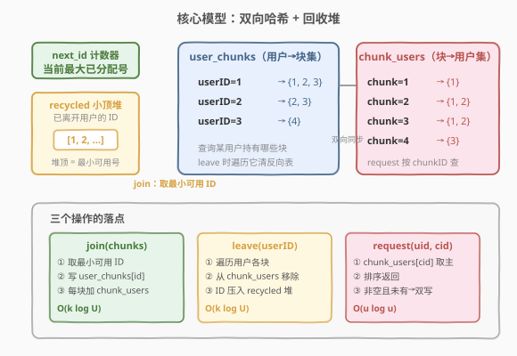
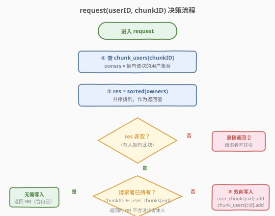
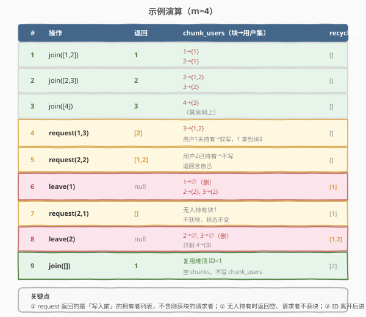

# LeetCode 设计文件分享系统 题解

## 1. 题目概述

- **标题 / 题号**：设计文件分享系统（#1500，medium）
- **链接**：https://leetcode.cn/problems/design-a-file-sharing-system/
- **难度**：中等
- **标签**：设计、哈希表、堆（优先队列）、数据流

**题意**：用一个文件分享系统来分享一个由 `m` 个小**块（chunk）**组成的大文件，块编号 `1` 到 `m`。用户加入系统时拥有若干块，系统需为其分配**唯一用户 ID**；用户离开后其 ID 可被**复用**。用户可请求某一块，系统返回当前拥有该块的所有用户 ID（升序）；若返回非空列表，请求者即成功获得该块。

实现 `FileSharing` 类：

- `FileSharing(int m)`：以 `m` 个块初始化。
- `int join(int[] ownedChunks)`：一个拥有 `ownedChunks` 的新用户加入，系统分配**未被占用的最小正整数**作为其 ID 并返回。
- `void leave(int userID)`：用户 `userID` 离开，其持有的所有块不再对他人可用，其 ID 进入可复用池。
- `int[] request(int userID, int chunkID)`：用户 `userID` 请求块 `chunkID`，返回当前拥有该块的用户 ID **升序列表**。若列表非空，请求者获得该块（若其原本没有）。

**示例 1**：

```text
输入：
["FileSharing","join","join","join","request","request","leave","request","leave","join"]
[[4],[[1,2]],[[2,3]],[[4]],[1,3],[2,2],[1],[2,1],[2],[[]]]
输出：
[null,1,2,3,[2],[1,2],null,[],null,1]

解释：
FileSharing fs = new FileSharing(4);   // 文件共 4 块
fs.join([1, 2]);    // 分配 ID=1，返回 1
fs.join([2, 3]);    // 分配 ID=2，返回 2
fs.join([4]);       // 分配 ID=3，返回 3
fs.request(1, 3);   // 只有用户 2 持有块 3，返回 [2]；用户 1 现持有 [1,2,3]
fs.request(2, 2);   // 用户 1、2 持有块 2，返回 [1,2]；用户 2 本就持有，无变化
fs.leave(1);        // 用户 1 离开，其块全部释放
fs.request(2, 1);   // 无人持有块 1，返回 []；用户 2 不获块
fs.leave(2);        // 用户 2 离开
fs.join([]);        // 新用户无块加入，复用最小可用 ID=1，返回 1
```

**约束**：

- $1 \leq m \leq 10^5$
- $0 \leq \text{ownedChunks.length} \leq \min(100, m)$
- $1 \leq \text{ownedChunks}[i] \leq m$，`ownedChunks` 中值互不相同
- $1 \leq \text{chunkID} \leq m$
- `userID` 保证是系统中的合法用户（只要 ID 分配正确）
- `join`、`leave`、`request` 总调用次数不超过 $10^4$；每个 `leave` 都有对应的 `join`

> ⚠️ **关键语义**：`request` 返回的是**调用时刻**的拥有者列表（用于让请求者向这些用户下载）；若请求者原本不持有该块**且**列表非空，请求者才获得该块并写入两表。若无人持有（返回空列表），请求者**不**获块。

## 2. 解题思路

### 2.1 暴力思路：只维护一张「用户→块集」表

最直观的做法是只维护 `user_chunks`（用户 → 持有块集合）一张表：

- `join`：分配 ID，写入 `user_chunks[userID] = set(ownedChunks)`。
- `leave`：删除 `user_chunks[userID]`，回收 ID。
- `request(userID, chunkID)`：**遍历所有用户**，逐一检查其块集是否含 `chunkID`，收集后排序返回。

痛点在 `request`：每次 $O(U)$ 全表扫描（$U$ 为当前用户数）。$10^4$ 次调用、每次扫 $10^4$ 用户，最坏 $10^8$ 次集合查询，勉强卡边界、不优雅。根本原因是「按块找用户」缺一张反向索引。

> 💡 自然优化：再加一张「块→用户集」的反向表 `chunk_users`，`request` 直接按 `chunkID` 取主，省去全表扫描。这是典型的**双向哈希**思想——正反两张表同步维护，任一方向的查询都 $O(1)$ 取表。

### 2.2 核心观察：双向哈希 + 回收堆



需要维护四件东西：

| 结构 | 类型 | 作用 |
|------|------|------|
| `next_id` | 整型计数器 | 记录已分配过的最大 ID，新用户无回收号可用时 `++next_id` |
| `recycled` | 小顶堆 | 存已离开用户的 ID，`join` 时取堆顶即「最小可用号」 |
| `user_chunks` | 哈希表 `userID → 块集` | 正向：查某用户持有哪些块；`leave` 时遍历它清反向表 |
| `chunk_users` | 哈希表 `chunkID → 用户集` | 反向：`request` 按 `chunkID` 直接取拥有者；用有序集合则天然升序 |

> 💡 **为什么用小顶堆存回收号？** 题目要求分配「最小正整数」可用 ID。回收号是动态进出（leave 入、join 出）的，小顶堆的堆顶恒为最小值，$O(\log U)$ 取出。若无回收号则 `++next_id`——这样保证「回收池优先于自增」，ID 紧凑复用。对照 [1172. 餐盘栈](../1101-1200/1172_餐盘栈.md) 用小顶堆追踪可用栈下标，是同一套「资源回收复用」范式。

### 2.3 request 决策流程



`request` 是本题语义最易错的操作，分四步：

1. **取主**：`owners = chunk_users.get(chunkID)`，拿到当前拥有该块的用户集合。
2. **排序**：`res = sorted(owners)`，升序作为返回值。
3. **判空**：若 `res` 为空（无人持有），直接返回 `[]`，请求者**不**获块。
4. **判重写入**：若 `res` 非空**且**请求者未持有该块，则**双向写入**——`user_chunks[userID].add(chunkID)` 且 `chunk_users[chunkID].add(userID)`，使请求者成为未来的可分享源。

> ⚠️ **两个易错点**：
> - 返回的 `res` 是**写入前**的快照，不含刚获块的请求者本人（这一调用里他还没块，是从别人那下载）。
> - 若请求者**本就持有**该块，`res` 含其本人，走「判重」跳过写入，直接返回——不重复添加。

### 2.4 示例演算



以示例 1 为例，重点看三个关键时刻：

- **第 4 步 `request(1,3)`**：块 3 原只有用户 2 持有，返回 `[2]`；用户 1 未持有→双向写入，`chunk_users[3]` 变为 `{1,2}`。
- **第 7 步 `request(2,1)`**：用户 1 已离开，块 1 无人持有，返回 `[]`；用户 2 **不**获块，状态不变。
- **第 9 步 `join([])`**：`recycled = [1,2]`，堆顶 `1` 被复用，返回 `1`；空 `chunks` 不写 `chunk_users`。

## 3. 参考代码

### C++

```cpp
class FileSharing {
    int chunks;
    int next_id = 0;
    priority_queue<int, vector<int>, greater<int>> recycled;   // 小顶堆：回收的可用 ID
    unordered_map<int, set<int>> user_chunks;                  // 用户 -> 持有块集
    unordered_map<int, set<int>> chunk_users;                  // 块 -> 拥有用户集
  public:
    FileSharing(int m) : chunks(m) {}

    int join(vector<int> ownedChunks) {
        int userID;
        if (recycled.empty()) {
            userID = ++next_id;                // 无回收号则自增
        } else {
            userID = recycled.top();           // 取最小可用号
            recycled.pop();
        }
        user_chunks[userID] = set<int>(ownedChunks.begin(), ownedChunks.end());
        for (int c : ownedChunks) {
            chunk_users[c].insert(userID);     // 反向表同步登记
        }
        return userID;
    }

    void leave(int userID) {
        for (int c : user_chunks[userID]) {
            chunk_users[c].erase(userID);      // 反向表逐块移除
            if (chunk_users[c].empty()) {
                chunk_users.erase(c);          // 空集及时清理，request 据此判空
            }
        }
        user_chunks.erase(userID);
        recycled.push(userID);                 // ID 入回收池
    }

    vector<int> request(int userID, int chunkID) {
        vector<int> res;
        auto it = chunk_users.find(chunkID);
        if (it != chunk_users.end()) {
            res.assign(it->second.begin(), it->second.end());   // set 天然升序
        }
        if (!res.empty() && !user_chunks[userID].count(chunkID)) {
            user_chunks[userID].insert(chunkID);                // 双向写入
            chunk_users[chunkID].insert(userID);
        }
        return res;
    }
};
```

### Python

```python
class FileSharing:
    def __init__(self, m: int):
        import heapq
        self._heapq = heapq
        self.chunks = m
        self.next_id = 0
        self.recycled = []                     # 小顶堆：回收的可用 ID
        self.user_chunks = {}                  # 用户 -> 持有块集
        self.chunk_users = {}                  # 块 -> 拥有用户集

    def join(self, ownedChunks: List[int]) -> int:
        if self.recycled:
            userID = self._heapq.heappop(self.recycled)   # 取最小可用号
        else:
            self.next_id += 1
            userID = self.next_id
        self.user_chunks[userID] = set(ownedChunks)
        for c in ownedChunks:
            self.chunk_users.setdefault(c, set()).add(userID)
        return userID

    def leave(self, userID: int) -> None:
        for c in self.user_chunks[userID]:
            owners = self.chunk_users[c]
            owners.discard(userID)             # 反向表逐块移除
            if not owners:
                del self.chunk_users[c]        # 空集及时清理
        del self.user_chunks[userID]
        self._heapq.heappush(self.recycled, userID)

    def request(self, userID: int, chunkID: int) -> List[int]:
        owners = self.chunk_users.get(chunkID)
        res = sorted(owners) if owners else []
        if res and chunkID not in self.user_chunks[userID]:
            self.user_chunks[userID].add(chunkID)         # 双向写入
            self.chunk_users.setdefault(chunkID, set()).add(userID)
        return res
```

> 💡 **实现要点**：
> - `recycled` 用小顶堆而非有序数组：堆的 push/pop 都是 $O(\log U)$，且堆顶恒为最小，无需排序。
> - `leave` 中 `chunk_users[c]` 变空后及时 `erase`/`del`，使 `request` 能据「键不存在」直接判定无人持有。
> - C++ 用 `set<int>` 存拥有者，天然升序，`res.assign(begin, end)` 直接得到有序结果；Python 用 `set` + `sorted()`。
> - `import heapq` 放在 `__init__` 内并缓存为 `self._heapq`，符合本仓库在方法内按需导入的惯例。

## 4. 复杂度分析

| 维度 | 复杂度 | 说明 |
|------|--------|------|
| 时间复杂度 | 见下 | 三操作分别分析 |
| 空间复杂度 | $O(C + U)$ | $C$ 为所有「用户-块」关联总数（两表对称存同一份关联），$U$ 为回收堆大小 |

各操作时间：

| 操作 | 复杂度 | 说明 |
|------|--------|------|
| `join` | $O(k \log U)$ | 堆取号 $O(\log U)$ + $k$ 次反向表插入各 $O(\log U)$；$k = \text{ownedChunks.length} \leq 100$ |
| `leave` | $O(k \log U)$ | $k$ 次反向表删除各 $O(\log U)$ + 堆 push $O(\log U)$ |
| `request` | $O(u \log u)$ | 取表 $O(1)$ + 排序 $u$ 个拥有者；$u$ 为单块拥有者数，通常很小 |

> 💡 总调用 $\leq 10^4$、$k \leq 100$，整体运算量在 $10^6$ 量级，毫秒级完成。若改用单表暴力，`request` 退化为 $O(U)$ 全扫，最坏 $10^8$，仅勉强通过——反向表把「按块找人」从线性降到对数级，是本题的关键优化。

## 5. 扩展：Follow-up 思考

题目给出四个 follow-up，核心是考察设计在大数据 / 高变动场景下的健壮性：

1. **用户以 IP 标识、频繁断连重连同一 IP**：把 ID 与 IP 解耦——维护 `ip → userID` 映射，重连时复用原 ID 而非新分配；或直接以 IP 为键，省去 ID 分配。需处理 IP 持有块在断连期间是否保留的策略（可设 TTL 过期释放）。

2. **用户频繁加入 / 离开却不请求块**：本方案的 `join`/`leave` 都是 $O(k \log U)$，与请求数无关，频繁进出仍高效。但若用户量极大且 `ownedChunks` 长，反向表写入开销不可忽视——可考虑惰性登记：`join` 只写正向表，首次被 `request` 命中时再补建反向项。

3. **所有用户一次性加入、请求全部块后离开**：峰值负载集中。本方案空间峰值 $O(\sum k_i)$，单块拥有者可达 $U$，`request` 排序 $O(U \log U)$。若 $U$ 极大，可改用有序结构（C++ `set` 已有序，Python 可用 `SortedList`）避免每次 `sorted`。

4. **分享 $n$ 个文件、第 $i$ 个文件 $m[i]$ 块**：把 `chunk_users` 的键从 `chunkID` 升级为 `(fileID, chunkID)` 二元组，或全局编号 `chunkID = offset[fileID] + localChunk`。`user_chunks` 同样存二元组。其余逻辑不变——本质只是把一维块空间拓成二维。

## 6. 面试要点

1. **为什么需要两张哈希表？只用一张行不行？**
   - 只用 `user_chunks` 一张正向表，`request` 需遍历全部用户找谁持有某块，$O(U)$。加 `chunk_users` 反向表后按 `chunkID` 直接取主，$O(1)$ 取表 + $O(u \log u)$ 排序。两表对称存同一份关联，是「双向索引」的经典权衡——用翻倍空间换查询方向的全覆盖。和 [146. LRU 缓存](../0101-0200/146_LRU缓存.md) 的哈希 + 双向链表一样，都是「两套索引同步维护」的设计。

2. **ID 复用为什么用小顶堆，不用有序数组或直接遍历找空号？**
   - 题目要求分配「最小可用正整数」。小顶堆 push/pop 均 $O(\log U)$ 且堆顶恒为最小，天然满足。有序数组插入需 $O(U)$ 搬移；遍历找空号 $O(U)$。堆是把「动态进出 + 取最小」压缩到对数级的最优选择。对照 [1172. 餐盘栈](../1101-1200/1172_餐盘栈.md) 用堆追踪可用栈下标，同范式。

3. **`request` 返回的列表为什么不含刚获块的请求者？**
   - 返回的是**调用时刻**的拥有者快照，用途是让请求者向这些用户下载。请求者这一刻还没块（正因没有才请求），所以不在列表里。写入发生在返回值确定之后，使他成为**未来**请求的可分享源。若请求者本就持有该块，则他已在快照里，跳过写入直接返回。

4. **`leave` 时为什么要遍历用户的块集去清反向表？直接删正向表不够吗？**
   - 若只删 `user_chunks[userID]`，`chunk_users` 里仍残留该用户的引用——`request` 会把已离开的用户算作拥有者，返回脏数据。必须遍历其块集，从每个 `chunk_users[c]` 中移除该用户。空集及时 `erase` 是为了让 `request` 据键是否存在判空，避免返回空列表时误判为「有人持有但集为空」。

5. **如果 `join` 的 `ownedChunks` 可含重复值或越界值怎么处理？**
   - 用 `set` 存块集天然去重；越界值（`chunkID > m` 或 `< 1`）应在 `join` 前校验并忽略或报错。本题约束保证值合法，生产系统则需做边界检查——这是设计题体现健壮性的常见追问点。

## 同类练习题

| # | 题目 | 与本题的关联 |
|---|------|-------------|
| 146 | [LRU 缓存](https://leetcode.cn/problems/lru-cache/)（[题解](../0101-0200/146_LRU缓存.md)） | 哈希 + 双向链表的设计题招牌，与本题「两套索引同步维护」同构，体会双向索引在 $O(1)$ 定位中的核心作用。 |
| 460 | [LFU 缓存](https://leetcode.cn/problems/lfu-cache/)（[题解](../0401-0500/460_LFU缓存.md)） | 频率桶 + 哈希的复杂设计，与本题同为「多结构协同维护状态」的设计类，难度进阶。 |
| 1172 | [餐盘栈](https://leetcode.cn/problems/dinner-plate-stacks/)（[题解](../1101-1200/1172_餐盘栈.md)） | 用小顶堆追踪可用栈下标并复用，与本题「recycled 回收堆取最小可用 ID」是同一套资源回收复用范式。 |
| 981 | [基于时间的键值存储](https://leetcode.cn/problems/time-based-key-value-store/)（[题解](../0901-1000/981_基于时间的键值存储.md)） | 哈希表 + 有序结构按 key 查询，与本题「按 chunkID 在 `chunk_users` 取拥有者列表」同属哈希驱动的检索设计。 |
| 1472 | [浏览器历史](https://leetcode.cn/problems/design-browser-history/)（[题解](../1401-1500/1472_浏览器历史.md)） | 同区间的设计题，用数组 + 双指针维护游走状态，对照体会不同设计题各自「最小数据结构编码全部状态」的思路。 |
