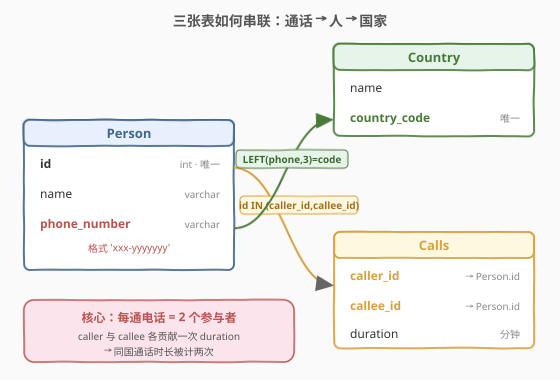
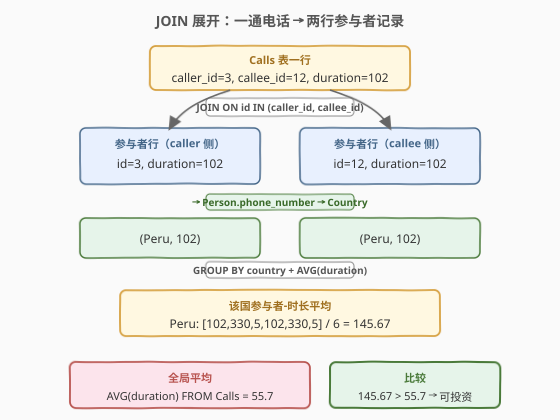
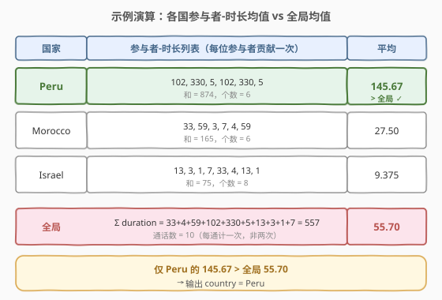

# 可以放心投资的国家

- **题目名称**：可以放心投资的国家
- **链接**：[1501. 可以放心投资的国家](https://leetcode.cn/problems/countries-you-can-safely-invest-in/)
- **难度**：中等
- **标签**：SQL、多表 JOIN、GROUP BY、AVG 聚合、子查询

## 1. 题目概述

一家电信公司想在新的国家投资。该公司打算投资于**该国通话的平均时长严格大于全局平均通话时长**的国家。给定 `Person`、`Country`、`Calls` 三张表，编写 SQL 查询返回可投资的国家名，结果列名为 `country`，顺序任意。

**表结构**：

```text
Table: Person
+-------------+---------+
| Column Name | Type    |
+-------------+---------+
| id          | int     |  ← 唯一值
| name        | varchar |
| phone_number| varchar |  ← 格式 'xxx-yyyyyyy'，xxx 为国家代码(3位)
+-------------+---------+

Table: Country
+--------------+---------+
| Column Name  | Type    |
+--------------+---------+
| name         | varchar |
| country_code | varchar |  ← 唯一值，格式 'xxx'
+--------------+---------+

Table: Calls
+-------------+------+
| Column Name | Type |
+-------------+------+
| caller_id   | int  |  → Person.id
| callee_id   | int  |  → Person.id
| duration    | int  |  ← 通话分钟数
+-------------+------+
无主键，caller_id != callee_id，可能含重复行。
```

> ⚠️ `phone_number` 形如 `'xxx-yyyyyyy'`，前 3 位 `xxx` 即国家代码，与 `Country.country_code` 对应（如 `051-1234567` → 秘鲁 `051`）。一通电话涉及两个参与者：`caller_id` 与 `callee_id`，二者均属 `Person`。

**示例 1**：

```text
输入：
Person 表:
+----+----------+--------------+
| id | name     | phone_number |
+----+----------+--------------+
| 3  | Jonathan | 051-1234567  |
| 12 | Elvis    | 051-7654321  |
| 1  | Moncef   | 212-1234567  |
| 2  | Maroua   | 212-6523651  |
| 7  | Meir     | 972-1234567  |
| 9  | Rachel   | 972-0011100  |
+----+----------+--------------+

Country 表:
+----------+--------------+
| name     | country_code |
+----------+--------------+
| Peru     | 051          |
| Israel   | 972          |
| Morocco  | 212          |
| Germany  | 049          |
| Ethiopia | 251          |
+----------+--------------+

Calls 表:
+-----------+-----------+----------+
| caller_id | callee_id | duration |
+-----------+-----------+----------+
| 1         | 9         | 33       |
| 2         | 9         | 4        |
| 1         | 2         | 59       |
| 3         | 12        | 102      |
| 3         | 12        | 330      |
| 12        | 3         | 5        |
| 7         | 9         | 13       |
| 7         | 1         | 3        |
| 9         | 7         | 1        |
| 1         | 7         | 7        |
+-----------+-----------+----------+

输出:
+---------+
| country |
+---------+
| Peru    |
+---------+
```

**解释**：

| 国家 | 参与者-时长列表 | 平均时长 |
|------|----------------|----------|
| Peru | 102, 330, 5, 102, 330, 5 | 874 / 6 ≈ 145.67 |
| Israel | 33, 4, 13, 13, 3, 1, 1, 7 | 75 / 8 = 9.375 |
| Morocco | 33, 4, 59, 59, 3, 7 | 165 / 6 = 27.50 |
| **全局** | 通话时长和 557，通话数 10 | 557 / 10 = 55.70 |

仅 Peru 的平均 145.67 > 全局 55.70，故输出 Peru。

**约束条件**：

- `Person.id` 具有唯一值；`Country.country_code` 具有唯一值
- `phone_number` 前 3 位为国家代码
- `Calls` 无主键，`caller_id != callee_id`
- 结果列名 `country`，顺序任意

> 💡 本题是 SQL **"多表关联 + 均值对比"招牌题**——核心两步：① 把每通电话按 `caller`/`callee` 拆成两行参与者记录，关联 `Person → Country` 打上国家标签；② 按国家 `GROUP BY + AVG`，与全局 `AVG(duration)` 比较。难点在于理解"每通电话计两次"的统计口径，以及为何全局均值恰好等于 `AVG(duration) FROM Calls`。

---

## 2. 解题思路

### 2.1 暴力思路：逐国家扫描

最直觉的过程式思路：对每个国家，遍历 `Calls` 的每一行，判断 `caller` 或 `callee` 是否属于该国（通过 `Person.phone_number` 前缀匹配 `country_code`），收集这些通话的 `duration`，求平均；最后与全局平均比较。伪代码：

```text
global_avg = sum(call.duration for call in Calls) / count(Calls)
for each country:
    durations = []
    for call in Calls:
        if country_of(call.caller_id) == country:
            durations.append(call.duration)        # caller 侧贡献
        if country_of(call.callee_id) == country:
            durations.append(call.duration)        # callee 侧贡献
    if mean(durations) > global_avg:
        result.append(country)
```

但**纯 SQL 没有显式逐行循环**——"判断 caller/callee 是否属某国并对两者各计一次"需换成集合式表达：用 `JOIN ... ON id IN (caller_id, callee_id)` 让每通电话自然展开成两行参与者记录，再按国家聚合。

> ⚠️ 关键统计口径：一通电话有 **2 个参与者**（caller + callee）。计算某国平均时，**每位参与者都贡献一次该通话时长**——若 caller 与 callee 同属一国，该国会把这条 `duration` 计两次。这与"把通话当作一条记录平均"截然不同，是本题最易错点。

### 2.2 核心观察：JOIN 展开 + 按国家聚合



**问题拆解为两个子问题**：

1. **该国平均时长**：把 `Calls` 按 `caller_id`/`callee_id` 展开成「参与者 × 时长」记录，关联 `Person`（取 `phone_number`）与 `Country`（前 3 位匹配 `country_code`）打上国家标签，再 `GROUP BY country + AVG(duration)`。

   $$\text{avg}(c) = \frac{\sum\limits_{\substack{\text{call}\,\in\,\text{Calls}\\ \text{caller}\in c\,\text{或}\,\text{callee}\in c}} \text{duration}}{\#\{\text{参与者记录}\in c\}}$$

   其中同一通电话若两端都在 $c$，则贡献两条参与者记录（`duration` 计两次）。

2. **全局平均时长**：所有通话的平均时长。每通电话全局必有 2 个参与者，故参与者加权和为 $2\sum\text{duration}$、参与者记录数为 $2\cdot|\text{Calls}|$：

   $$\text{global\_avg} = \frac{2\sum\text{duration}}{2\cdot|\text{Calls}|} = \frac{\sum\text{duration}}{|\text{Calls}|} = \text{AVG}(\text{duration})\text{ FROM Calls}$$

> 💡 **为何全局均值就是 `AVG(duration) FROM Calls`（每通计一次）**：参与者加权的全局均值分子分母同时放大 2 倍，恰好抵消——等价于对 `Calls` 表每行求一次 `AVG`。这避免了为全局再写一次 JOIN 展开，是本题最优雅的化简。

> ⚠️ **三个易错点**：
> - **同国通话计两次**：`JOIN ON id IN (caller_id, callee_id)` 会为每通电话匹配两行 `Person`（caller 行 + callee 行）；若两人同国，该国拿到两条相同 `duration`。**不要**用 `JOIN ON id = caller_id`（只算 caller 侧，漏掉 callee）。
> - **国家归属靠电话号码前缀**：`LEFT(phone_number, 3)` 取国家代码，再 `=` `Country.country_code`。不能用 `Person.id` 直接关联 `Country`——两表无共同字段。
> - **严格大于**：题目要求「严格大于全局均值」，用 `>` 而非 `>=`；若某国均值恰等于全局均值，不应入选。

### 2.3 算法流程图



**逻辑执行步骤**：

| 步骤 | 子句 | 作用 |
|------|------|------|
| ① | `JOIN Calls ON p.id IN (caller_id, callee_id)` | 每通电话展开为两行参与者记录（caller 行 + callee 行） |
| ② | `JOIN Country c ON LEFT(p.phone_number, 3) = c.country_code` | 用电话号码前 3 位匹配国家代码，打上国家标签 |
| ③ | `GROUP BY c.name + AVG(duration)` | 按国家聚合，算该国参与者-时长平均 |
| ④ | `WHERE avg_dur > (SELECT AVG(duration) FROM Calls)` | 与全局均值比较，筛出严格大于的国家 |

> 💡 **SQL 子句执行顺序**：`FROM`（含 `JOIN`/`ON`）→ `WHERE` → `GROUP BY` → `HAVING` → `SELECT`（含 `AVG`）→ `ORDER BY` → `LIMIT`。步骤 ①② 的两个 `JOIN` 在 `FROM` 阶段串行完成，产出「参与者 × 国家」的明细行集；步骤 ③ 的 `GROUP BY + AVG` 在聚合阶段把明细按国家折叠成一行；步骤 ④ 的 `WHERE` 作用于外层子查询的聚合结果（故需把聚合包成子查询，再在外层 `WHERE` 过滤——`WHERE` 不能直接用聚合别名）。

### 2.4 示例演算

以示例 1 数据为例，观察「JOIN 展开 → 按国聚合 → 比较全局」的逐步过程：



**步骤 ①②：JOIN 展开并打国家标签**

`Person JOIN Calls ON id IN (caller_id, callee_id)` 把 10 通电话展开为 20 行参与者记录，再按 `phone_number` 前 3 位关联 `Country`。以 Peru（051，居民 id=3 Jonathan、id=12 Elvis）为例：

| 通话 | caller | callee | duration | 参与者记录（仅 Peru） |
|------|--------|--------|----------|----------------------|
| #4 | 3 | 12 | 102 | (id=3, 102), (id=12, 102) |
| #5 | 3 | 12 | 330 | (id=3, 330), (id=12, 330) |
| #6 | 12 | 3 | 5 | (id=12, 5), (id=3, 5) |

> 💡 通话 #4/#5/#6 两端都在 Peru，故每通都贡献两条记录——这正是"同国通话计两次"的体现。Peru 共 6 条记录：`[102, 330, 5, 102, 330, 5]`。

**步骤 ③：`GROUP BY country + AVG(duration)`**

| 国家 | 参与者-时长列表 | 平均 |
|------|----------------|------|
| Peru | 102, 330, 5, 102, 330, 5 | 874/6 = 145.67 |
| Morocco | 33, 59, 3, 7, 4, 59 | 165/6 = 27.50 |
| Israel | 33, 4, 13, 13, 3, 1, 1, 7 | 75/8 = 9.375 |

> 💡 Morocco 居民 id=1、id=2，参与通话涉及以色列(id=7,9)的跨国防线，故 6 条记录里时长多为跨国通话；Israel 居民 id=7、id=9 参与了 8 条记录（部分通话两端都在以色列被计两次）。

**步骤 ④：与全局均值比较**

$$\text{global\_avg} = \frac{33+4+59+102+330+5+13+3+1+7}{10} = \frac{557}{10} = 55.70$$

| 国家 | 平均 | vs 全局 55.70 | 入选? |
|------|------|---------------|-------|
| Peru | 145.67 | > | ✓ |
| Morocco | 27.50 | < | ✗ |
| Israel | 9.375 | < | ✗ |

最终输出 `country = Peru`，与示例一致。

---

## 3. 参考代码

### SQL（解法 A：`JOIN ON id IN (...)` 紧凑版，推荐）

```sql
SELECT country
FROM (
    SELECT c.name AS country, AVG(duration) AS avg_dur
    FROM Person p
    JOIN Calls ON p.id IN (caller_id, callee_id)
    JOIN Country c ON LEFT(p.phone_number, 3) = c.country_code
    GROUP BY c.name
) t
WHERE avg_dur > (SELECT AVG(duration) FROM Calls);
```

> 💡 **写法要点**：
> - **`JOIN Calls ON p.id IN (caller_id, callee_id)`**：让每个 `Person` 行匹配其作为 `caller` 或 `callee` 的所有通话——每通电话因此展开为两行（caller 行 + callee 行），自然实现"每位参与者贡献一次"。
> - **`LEFT(p.phone_number, 3)`**：取电话号码前 3 位国家代码，关联 `Country.country_code`。
> - **`GROUP BY c.name + AVG(duration)`**：按国家折叠，算参与者-时长均值。
> - **外层 `WHERE`**：聚合别名 `avg_dur` 不能在 `WHERE` 直接用（`WHERE` 先于 `SELECT` 求值），故包一层子查询，在外层 `WHERE` 过滤。
> - **全局子查询**：`SELECT AVG(duration) FROM Calls` 每通计一次，恰等于参与者加权的全局均值（见 2.2 证明）。
> - ✓ **最紧凑**：`JOIN ON id IN (...)` 一行即完成"双倍计数"，是 LeetCode 官方题解写法。

### SQL（解法 B：`UNION ALL` 显式展开版）

```sql
WITH participants AS (
    SELECT caller_id AS pid, duration FROM Calls
    UNION ALL
    SELECT callee_id AS pid, duration FROM Calls
)
SELECT c.name AS country
FROM participants pt
JOIN Person p ON p.id = pt.pid
JOIN Country c ON LEFT(p.phone_number, 3) = c.country_code
GROUP BY c.name
HAVING AVG(pt.duration) > (SELECT AVG(duration) FROM Calls);
```

> 💡 **与解法 A 的区别**：用 `UNION ALL` 把 `Calls` 显式拆成「参与者 × 时长」两份（caller 侧 + callee 侧）再 `UNION ALL` 合并——把"每通计两次"的逻辑写在外面，更易读懂。`HAVING` 直接对聚合结果过滤（`HAVING` 在 `GROUP BY` 之后求值，可直接用 `AVG(...)`），无需外层子查询包一层。语义与解法 A 完全等价，仅写法风格不同。

### Python（pandas）

```python
import pandas as pd

def countries_you_can_safely_invest_in(person: pd.DataFrame, calls: pd.DataFrame, country: pd.DataFrame) -> pd.DataFrame:
    callers = calls[['caller_id', 'duration']].rename(columns={'caller_id': 'id'})
    callees = calls[['callee_id', 'duration']].rename(columns={'callee_id': 'id'})
    parts = pd.concat([callers, callees], ignore_index=True)
    parts = parts.merge(person[['id', 'phone_number']], on='id')
    parts['code'] = parts['phone_number'].str[:3]
    parts = parts.merge(country[['name', 'country_code']], left_on='code', right_on='country_code')
    avg_by_country = parts.groupby('name')['duration'].mean()
    global_avg = calls['duration'].mean()
    res = avg_by_country[avg_by_country > global_avg].index.tolist()
    return pd.DataFrame({'country': res})
```

> 💡 **pandas 对照**：
> - `calls[['caller_id','duration']]` + `calls[['callee_id','duration']]` 统一列名为 `id` 后 `pd.concat` —— 对应 SQL 的 `UNION ALL`（解法 B），把每通电话拆成两行参与者记录。
> - `.merge(person[['id','phone_number']], on='id')` 对应 `JOIN Person`。
> - `.str[:3]` 取电话号码前 3 位，对应 `LEFT(phone_number, 3)`。
> - `.merge(country, left_on='code', right_on='country_code')` 对应 `JOIN Country`。
> - `.groupby('name')['duration'].mean()` 对应 `GROUP BY c.name + AVG(duration)`。
> - `calls['duration'].mean()` 对应 `AVG(duration) FROM Calls`（每通计一次 = 全局均值）。
> - 布尔索引 `avg_by_country > global_avg` 对应 `WHERE avg_dur > (...)`。

---

## 4. 复杂度分析

| 维度 | 解法 A（`JOIN ON id IN`） | 解法 B（`UNION ALL`） |
|------|--------------------------|----------------------|
| **时间** | $O(n + m)$ | $O(n + m)$ |
| **空间** | $O(2n + k)$ | $O(2n + k)$ |
| **展开方式** | `JOIN` 谓词隐式展开 | `UNION ALL` 显式物化 |
| **过滤位置** | 外层 `WHERE`（需子查询包一层） | `HAVING`（直接过滤聚合） |
| **推荐度** | ✓ **首选**，紧凑 | ✓ 备选，可读性强 |

> - $n$ = `Calls` 表行数，$m$ = `Person` 表行数，$k$ = `Country` 表行数（国家数）
> - **展开后行数**：每通电话 2 行参与者记录，共 $2n$ 行
> - **时间**：`JOIN Person` 在 `Person.id` 上探测 $O(1)$（主键索引），$2n$ 次探测 $O(n)$；`JOIN Country` 在 `country_code` 上哈希/索引探测 $O(2n)$；`GROUP BY + AVG` 扫描 $2n$ 行 $O(n)$；全局子查询扫描 `Calls` 一次 $O(n)$。总计 $O(n + m)$
> - **空间**：展开后中间结果 $2n$ 行 $O(n)$；`GROUP BY` 哈希表 $O(k)$
> - **索引优化**：在 `Person(id)`、`Country(country_code)` 上建索引（题目已声明唯一值，通常自带索引）；`Calls(caller_id)`、`Calls(callee_id)` 上建索引可加速 `JOIN ON id IN (...)` 的探测

---

## 5. 扩展：统计口径与跨库写法

### 5.1 "每通计两次"的两种等价实现

| 写法 | SQL | 思路 |
|------|-----|------|
| **JOIN 谓词** | `JOIN Calls ON id IN (caller_id, callee_id)` | 一个 `JOIN` 让 `Person` 同时匹配 `caller`/`callee` 两列，引擎自动产生两行 |
| **UNION ALL** | `SELECT caller_id ... UNION ALL SELECT callee_id ...` | 先把 `Calls` 拆成两份"参与者视图"再合并，逻辑外显 |

> 💡 两者结果集完全相同（都是 $2n$ 行参与者记录）。`JOIN ON id IN` 更短，但初学者易忽略"为何产生两行"；`UNION ALL` 把双倍计数写在明处，便于审阅。生产环境若 `Calls` 巨大，`UNION ALL` 会物化一份 $2n$ 行的临时表，`JOIN ON id IN` 可能走嵌套循环——具体取决于优化器，可按 `EXPLAIN` 选择。

### 5.2 跨数据库的取前缀写法

| 数据库 | 取电话号码前 3 位 | 备注 |
|--------|-------------------|------|
| MySQL | `LEFT(phone_number, 3)` 或 `SUBSTRING(phone_number, 1, 3)` | LeetCode 默认 MySQL |
| PostgreSQL | `LEFT(phone_number, 3)` 或 `SUBSTR(phone_number, 1, 3)` | 通用 |
| SQL Server | `LEFT(phone_number, 3)` 或 `SUBSTRING(phone_number, 1, 3)` | 通用 |
| 标准 SQL | `SUBSTRING(phone_number FROM 1 FOR 3)` | SQL 标准语法 |

> 💡 本题 `phone_number` 格式固定 `'xxx-yyyyyyy'`，前 3 位即国家代码。若格式不保证（如国家代码长度可变），应改用 `SUBSTRING_INDEX(phone_number, '-', 1)`（MySQL）按 `-` 切第一段，更鲁棒。

### 5.3 若题目改为"该国通话总时长最多"

若把判定条件从"均值 > 全局均值"换成"总时长最大"，只需把步骤 ③ 的 `AVG` 换 `SUM`、步骤 ④ 换 `ORDER BY SUM(duration) DESC LIMIT 1`——JOIN 展开与按国聚合骨架不变。本题的"双倍计数"统计口径是均值/求和型统计题的通用模板。

---

## 6. 面试要点

1. **为什么每通电话要计两次？**

   > 一通电话涉及 caller 与 callee 两个参与者。题目统计的是「该国居民参与的通话的平均时长」——每位参与者都贡献一次该通话时长。若 caller 与 callee 同属一国，这条 `duration` 在该国被计两次。用 `JOIN ON id IN (caller_id, callee_id)` 让每通电话展开为两行参与者记录，自然实现这一口径；漏写 callee 侧会把同国通话少计一半。

2. **为什么全局均值是 `AVG(duration) FROM Calls` 而不是再 JOIN 展开一次？**

   > 全局参与者加权和 = $2\sum\text{duration}$（每通两个参与者），全局参与者记录数 = $2\cdot|\text{Calls}|$，均值 = $\frac{2\sum}{2|\text{Calls}|} = \frac{\sum}{|\text{Calls}|}$，恰好等于对 `Calls` 表每行求一次 `AVG(duration)`。分子分母同时放大 2 倍恰好抵消——这是本题最优雅的化简，避免了为全局再写一次 JOIN 展开。

3. **`JOIN ON id IN (caller_id, callee_id)` 是怎么工作的？**

   > 对 `Person` 的每一行（某 `id`），匹配 `Calls` 中 `caller_id = id` 或 `callee_id = id` 的所有行。一通电话 `(c=3, e=12, dur=102)` 会匹配到 `id=3`（作为 caller）和 `id=12`（作为 callee）两个 `Person` 行，从而产生两条 `(id, duration)` 参与者记录。这是"一行匹配多列"的 `JOIN` 谓词技巧，等价于 `UNION ALL` 显式展开。

4. **为什么把聚合包成子查询，再在外层 `WHERE` 过滤？**

   > SQL 执行顺序中 `WHERE` 先于 `SELECT`（含聚合别名）求值，故 `WHERE avg_dur > ...` 无法引用 `SELECT` 里定义的 `avg_dur` 别名。两种解法：① 包一层子查询，在外层 `WHERE` 用别名过滤（解法 A）；② 用 `HAVING` 直接对聚合表达式过滤（解法 B，`HAVING` 在 `GROUP BY` 之后求值，可直接写 `HAVING AVG(duration) > (...)`）。

5. **如果某国家没有任何通话，会出现在结果里吗？**

   > 不会。`JOIN Calls` 会把没有参与任何通话的 `Person`（及对应国家）过滤掉——内连接只保留匹配行。这符合题意：无通话的国家无"平均时长"可言，不参与比较。若题目要求列出所有国家（含无通话者），需改用 `LEFT JOIN` 并对空值做 `COALESCE` 处理。

> 💡 **一句话总结**：1501 是 SQL **"多表关联 + 均值对比"招牌题**——核心模板「`JOIN ON id IN (caller_id, callee_id)` 把每通电话展开成两行参与者记录 → 关联 `Person → Country` 打国家标签 → `GROUP BY country + AVG` → 与全局 `AVG(duration) FROM Calls` 比较」。两个要点：① 同国通话时长被计两次（双参与者口径）；② 全局均值因分子分母同乘 2 而恰好等于 `AVG(duration) FROM Calls`。

---

## 7. 同类练习题

- [1174. 即时食物配送 II](https://leetcode.cn/problems/immediate-food-delivery-ii/)：`GROUP BY + MIN` 求首次订单 → `JOIN` 回原表 → `AVG(布尔)` 算比例，同为「聚合 + 关联 + 均值/比例对比」骨架
- [1173. 即时食物配送 I](https://leetcode.cn/problems/immediate-food-delivery-i/)：直接 `AVG(布尔)` 算即时订单比例，是 1501「均值对比」的简化版（无需多表 JOIN）
- [1107. 每日新用户统计](https://leetcode.cn/problems/new-users-daily-count/)：`GROUP BY + MIN` 求每人首次登录日再按日计数，共享 1501 的「子查询聚合 + 外层过滤」结构
- [1068. 产品销售分析 I](https://leetcode.cn/problems/product-sales-analysis-i/)：多表 `JOIN` 关联销售表与产品表取详情，共享 1501 的「多表串联取国家/产品标签」骨架
- [550. 游戏玩法分析 IV](https://leetcode.cn/problems/game-play-analysis-iv/)：首次登录次日留存比例，同为「聚合求均值 + 子查询对比」结构
